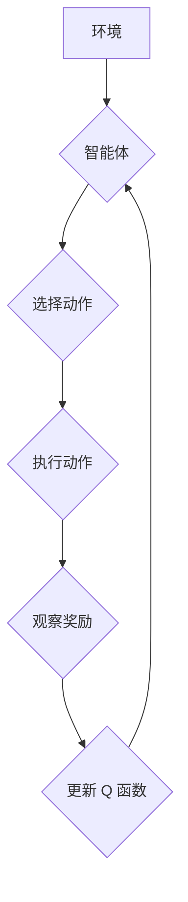

# 深度 Q-learning：未来人工智能法规的挑战

> 关键词：

> 深度学习，Q-learning，强化学习，人工智能法规，伦理挑战，可解释性，透明度

## 1. 背景介绍

人工智能（AI）正以惊人的速度发展，深度学习作为其核心技术，在图像识别、自然语言处理、语音识别等领域取得了突破性进展。其中，强化学习（RL）作为一种学习方法，通过试错和奖励机制，使智能体在环境中学习最优策略，展现出巨大的潜力。深度 Q-learning 作为 RL 的一种重要变体，将深度神经网络与 Q-learning 算法相结合，能够学习复杂环境下的策略，并取得优异的性能。

然而，深度 Q-learning 的强大能力也带来了新的挑战，尤其是在人工智能法规的制定方面。由于其学习过程的复杂性和黑盒特性，深度 Q-learning 系统的行为难以预测和解释，这使得其在安全关键领域应用面临着伦理和法律风险。

## 2. 核心概念与联系

**2.1 强化学习 (RL)**

强化学习是一种机器学习方法，其核心思想是通过试错和奖励机制，使智能体在环境中学习最优策略。

* **智能体 (Agent):**  执行动作并与环境交互的实体。
* **环境 (Environment):** 智能体所处的外部世界，会根据智能体的动作产生状态变化和奖励信号。
* **状态 (State):** 环境的当前状态，描述了环境中所有相关信息。
* **动作 (Action):** 智能体可以执行的操作，会改变环境的状态。
* **奖励 (Reward):** 环境对智能体动作的反馈，可以是正向奖励或负向惩罚。
* **策略 (Policy):** 智能体根据当前状态选择动作的规则。

**2.2 Q-learning**

Q-learning 是一种基于价值函数的强化学习算法，其目标是学习一个 Q 函数，该函数将状态-动作对映射到期望的长期奖励。

**2.3 深度 Q-learning**

深度 Q-learning 将深度神经网络引入 Q-learning 算法，用于学习复杂的 Q 函数。深度神经网络能够学习高维状态空间和复杂动作空间中的非线性关系，从而提高算法的学习能力和泛化能力。

**2.4 Mermaid 流程图**



## 3. 核心算法原理 & 具体操作步骤

### 3.1 算法原理概述

深度 Q-learning 的核心思想是通过深度神经网络学习一个 Q 函数，该函数将状态-动作对映射到期望的长期奖励。算法通过迭代更新 Q 函数，最终学习到最优策略。

### 3.2 算法步骤详解

1. **初始化:** 初始化 Q 函数，通常使用随机值或零向量。
2. **环境交互:** 智能体与环境交互，观察当前状态和执行动作。
3. **奖励获取:** 环境根据智能体的动作提供奖励信号。
4. **Q 值更新:** 使用 Bellman 方程更新 Q 函数，根据当前状态、动作、奖励和下一个状态的 Q 值。
5. **策略选择:** 根据更新后的 Q 函数，选择最优动作。
6. **重复步骤 2-5:** 重复上述步骤，直到达到终止条件或学习完成。

### 3.3 算法优缺点

**优点:**

* 能够学习复杂环境下的策略。
* 具有较强的泛化能力。
* 可以应用于各种强化学习任务。

**缺点:**

* 训练过程可能需要大量数据和计算资源。
* 算法的学习过程是黑盒的，难以解释和理解。
* 容易陷入局部最优解。

### 3.4 算法应用领域

深度 Q-learning 广泛应用于以下领域:

* **机器人控制:** 控制机器人执行复杂任务，例如导航、抓取和操作。
* **游戏 AI:** 开发智能游戏对手，例如围棋、Go 和电子竞技游戏。
* **推荐系统:** 建立个性化推荐系统，推荐用户感兴趣的内容。
* **金融交易:** 开发自动交易策略，进行股票、期货等金融资产的交易。

## 4. 数学模型和公式 & 详细讲解 & 举例说明

### 4.1 数学模型构建

深度 Q-learning 的数学模型基于 Q 函数，该函数将状态-动作对映射到期望的长期奖励。

**Q(s, a):**  表示在状态 s 下执行动作 a 的期望长期奖励。

**Bellman 方程:**

$$Q(s, a) = R(s, a) + \gamma \max_{a'} Q(s', a')$$

其中:

* **R(s, a):**  在状态 s 下执行动作 a 的即时奖励。
* **γ:**  折扣因子，控制未来奖励的权重。
* **s':**  执行动作 a 后进入的下一个状态。
* **a':**  在下一个状态 s' 中执行的动作。

### 4.2 公式推导过程

Bellman 方程是深度 Q-learning 算法的核心公式，它描述了 Q 函数的更新规则。

通过迭代更新 Q 函数，算法最终学习到最优策略，即在每个状态下选择能够最大化长期奖励的动作。

### 4.3 案例分析与讲解

**举例说明:**

假设一个智能体在玩一个简单的游戏，游戏环境有两种状态：

* **状态 1:**  智能体在起点。
* **状态 2:**  智能体到达终点。

智能体可以执行两种动作：

* **动作 1:** 向右移动。
* **动作 2:** 向左移动。

游戏规则如下:

* 在状态 1 中执行动作 1 可以获得奖励 1，并进入状态 2。
* 在状态 1 中执行动作 2 不会获得奖励，并保持在状态 1。
* 在状态 2 中执行任何动作都不会获得奖励，并保持在状态 2。

使用深度 Q-learning 算法，智能体可以学习到最优策略，即在状态 1 中执行动作 1，从而到达终点并获得奖励。

## 5. 项目实践：代码实例和详细解释说明

### 5.1 开发环境搭建

* Python 3.x
* TensorFlow 或 PyTorch 深度学习框架
* NumPy 科学计算库
* Matplotlib 数据可视化库

### 5.2 源代码详细实现

```python
import tensorflow as tf

# 定义 Q 函数网络
class QNetwork(tf.keras.Model):
    def __init__(self, state_size, action_size):
        super(QNetwork, self).__init__()
        self.dense1 = tf.keras.layers.Dense(64, activation='relu')
        self.dense2 = tf.keras.layers.Dense(32, activation='relu')
        self.output = tf.keras.layers.Dense(action_size)

    def call(self, state):
        x = self.dense1(state)
        x = self.dense2(x)
        return self.output(x)

# 定义深度 Q-learning 算法
def deep_q_learning(env, state_size, action_size, learning_rate, gamma, epsilon, epochs):
    # 初始化 Q 函数网络
    q_network = QNetwork(state_size, action_size)
    optimizer = tf.keras.optimizers.Adam(learning_rate)

    # 训练循环
    for epoch in range(epochs):
        state = env.reset()
        done = False
        total_reward = 0

        while not done:
            # 选择动作
            action = epsilon_greedy(q_network(tf.expand_dims(state, axis=0)), epsilon)

            # 执行动作并获取奖励和下一个状态
            next_state, reward, done, _ = env.step(action)

            # 更新 Q 函数
            with tf.GradientTape() as tape:
                target = reward + gamma * tf.reduce_max(q_network(tf.expand_dims(next_state, axis=0)))
                q_value = q_network(tf.expand_dims(state, axis=0))[action]
                loss = tf.keras.losses.MSE(target, q_value)

            # 反向传播并更新网络参数
            gradients = tape.gradient(loss, q_network.trainable_variables)
            optimizer.apply_gradients(zip(gradients, q_network.trainable_variables))

            # 更新状态
            state = next_state

            # 更新总奖励
            total_reward += reward

        print(f"Epoch {epoch+1}, Total Reward: {total_reward}")

# epsilon-greedy 策略
def epsilon_greedy(q_values, epsilon):
    if tf.random.uniform(()) < epsilon:
        return tf.random.uniform(shape=(1,), minval=0, maxval=q_values.shape[1], dtype=tf.int32)
    else:
        return tf.argmax(q_values, axis=1)

# ... (其他代码，例如环境定义、游戏逻辑等)
```

### 5.3 代码解读与分析

* **Q 函数网络:** 使用深度神经网络构建 Q 函数，将状态映射到动作价值。
* **训练循环:** 迭代训练 Q 函数网络，更新网络参数以最小化预测误差。
* **epsilon-greedy 策略:** 在训练过程中，随机选择动作的概率为 epsilon，否则选择 Q 值最大的动作。
* **Bellman 方程:** 用于更新 Q 函数，将当前状态、动作、奖励和下一个状态的 Q 值结合起来。

### 5.4 运行结果展示

运行代码后，可以观察到智能体的学习过程，例如奖励值的变化趋势和最终学习到的策略。

## 6. 实际应用场景

### 6.1 自动驾驶

深度 Q-learning 可以用于训练自动驾驶系统的决策模型，学习最优的驾驶策略，例如加速、减速、转向和停车。

### 6.2 机器人控制

深度 Q-learning 可以用于控制机器人执行复杂任务，例如导航、抓取和操作。

### 6.3 游戏 AI

深度 Q-learning 可以用于开发智能游戏对手，例如围棋、Go 和电子竞技游戏。

### 6.4 未来应用展望

深度 Q-learning 还有许多潜在的应用场景，例如医疗诊断、金融交易和个性化推荐。随着算法的不断发展和计算资源的增加，深度 Q-learning 将在更多领域发挥重要作用。

## 7. 工具和资源推荐

### 7.1 学习资源推荐

* **书籍:**
    * Reinforcement Learning: An Introduction by Richard S. Sutton and Andrew G. Barto
    * Deep Reinforcement Learning Hands-On by Maxim Lapan
* **在线课程:**
    * Deep Reinforcement Learning Specialization by DeepLearning.AI
    * Reinforcement Learning by David Silver (University of DeepMind)

### 7.2 开发工具推荐

* **TensorFlow:** https://www.tensorflow.org/
* **PyTorch:** https://pytorch.org/
* **OpenAI Gym:** https://gym.openai.com/

### 7.3 相关论文推荐

* Deep Q-Network (DQN) by Volodymyr Mnih et al. (2015)
* Dueling Network Architectures for Deep Reinforcement Learning by Hado van Hasselt et al. (2016)
* Proximal Policy Optimization Algorithms by John Schulman et al. (2017)

## 8. 总结：未来发展趋势与挑战

### 8.1 研究成果总结

深度 Q-learning 算法取得了显著的成果，在各种强化学习任务中取得了优异的性能。

### 8.2 未来发展趋势

* **更强大的模型架构:** 研究更深、更复杂的深度神经网络架构，提高算法的学习能力和泛化能力。未来的模型可能会结合多种网络结构，如卷积神经网络（CNN）、循环神经网络（RNN）和图神经网络（GNN），以应对不同类型的数据和任务。
* **更有效的训练方法:** 开发更有效的训练方法，例如分布式训练和迁移学习，加速算法的训练速度。分布式训练可以利用多台机器并行处理，提高训练效率；迁移学习则可以利用已有模型的知识，减少新任务的训练时间。
* **更强的可解释性:** 提高深度 Q-learning 算法的可解释性，使其决策过程更加透明。通过引入可解释性技术，如注意力机制和可视化工具，帮助研究人员和用户理解模型的内部工作原理。
* **多模态学习:** 结合多种数据源（如图像、文本、音频等）进行联合学习，提高算法的综合能力。多模态学习可以增强模型在复杂环境中的表现，适应更多实际应用场景。
* **自适应学习:** 发展自适应学习算法，使模型能够根据环境变化自动调整参数，提高其在动态环境中的适应能力。自适应学习可以增强模型的鲁棒性和灵活性，适应更多实际应用场景。

### 8.3 面临的挑战

* **计算资源需求:** 深度 Q-learning 算法通常需要大量的计算资源，尤其是在处理大规模数据和复杂模型时。如何高效利用计算资源，降低训练成本，是一个重要的研究方向。
* **数据质量和数量:** 高质量、大规模的数据是深度 Q-learning 算法成功的关键。然而，获取和处理这些数据往往需要大量的时间和资源。如何有效地获取和利用数据，是一个亟待解决的问题。
* **模型的可解释性:** 尽管深度 Q-learning 算法在性能上取得了显著进展，但其决策过程往往难以解释。提高模型的可解释性，使其决策过程更加透明，是一个重要的研究方向。
* **安全性和可靠性:** 在实际应用中，深度 Q-learning 算法的安全性和可靠性至关重要。如何确保算法在各种环境下的稳定性和安全性，是一个重要的挑战。
* **伦理和法律问题:** 随着深度 Q-learning 算法在各个领域的广泛应用，相关的伦理和法律问题也日益凸显。如何在保证算法性能的同时，遵守伦理和法律规范，是一个需要深入探讨的问题。

### 8.4 研究展望

未来，深度 Q-learning 算法将在多个领域继续发挥重要作用。以下是一些可能的研究方向：

* **跨领域应用:** 将深度 Q-learning 算法应用于更多领域，如医疗、金融、交通等，解决实际问题。
* **人机协作:** 研究人机协作的深度 Q-learning 算法，使其能够更好地与人类合作，提高工作效率和决策质量。
* **智能系统:** 开发基于深度 Q-learning 的智能系统，如智能家居、智能交通等，提高生活质量和工作效率。
* **持续学习:** 研究持续学习算法，使模型能够在不断变化的环境中持续学习和适应，提高其长期性能。

## 9. 附录：常见问题与解答

### 9.1 深度 Q-learning 与传统 Q-learning 有何区别？

深度 Q-learning 结合了深度学习和 Q-learning 的优点，利用深度神经网络来近似 Q 函数，从而能够处理高维状态空间和复杂任务。传统 Q-learning 则使用表格或线性函数近似 Q 函数，适用于低维状态空间和简单任务。

### 9.2 如何选择合适的深度神经网络架构？

选择合适的深度神经网络架构需要根据具体任务和数据特点进行调整。一般来说，可以从简单的网络结构开始，逐步增加网络的深度和复杂度。同时，可以参考已有的研究成果和经验，选择适合的网络结构。

### 9.3 如何提高深度 Q-learning 算法的训练效率？

提高深度 Q-learning 算法的训练效率可以从以下几个方面入手：
* **分布式训练:** 利用多台机器并行处理，提高训练效率。
* **迁移学习:** 利用已有模型的知识，减少新任务的训练时间。
* **优化算法:** 使用更高效的优化算法，如 Adam、RMSprop 等，加速训练过程。
* **数据增强:** 通过数据增强技术，增加训练数据的多样性，提高模型的泛化能力。

### 9.4 深度 Q-learning 算法在实际应用中有哪些成功案例？

深度 Q-learning 算法在多个领域取得了成功应用，如游戏（如 AlphaGo）、机器人控制（如自动驾驶）、金融（如股票交易）等。这些成功案例展示了深度 Q-learning 算法在解决复杂任务中的强大能力。

### 9.5 如何提高深度 Q-learning 算法的可解释性？

提高深度 Q-learning 算法的可解释性可以通过以下几种方法：
* **注意力机制:** 引入注意力机制，使模型能够关注重要的特征，提高可解释性。
* **可视化工具:** 使用可视化工具，如 t-SNE、PCA 等，展示模型的内部工作原理。
* **规则提取:** 从模型中提取规则，帮助理解模型的决策过程。

### 9.6 深度 Q-learning 算法的未来发展方向是什么？

深度 Q-learning 算法的未来发展方向包括更强大的模型架构、更有效的训练方法、更强的可解释性、多模态学习、自适应学习等。这些方向将进一步提高算法的性能和应用范围，解决更多实际问题。

---

作者：禅与计算机程序设计艺术 / Zen and the Art of Computer Programming
