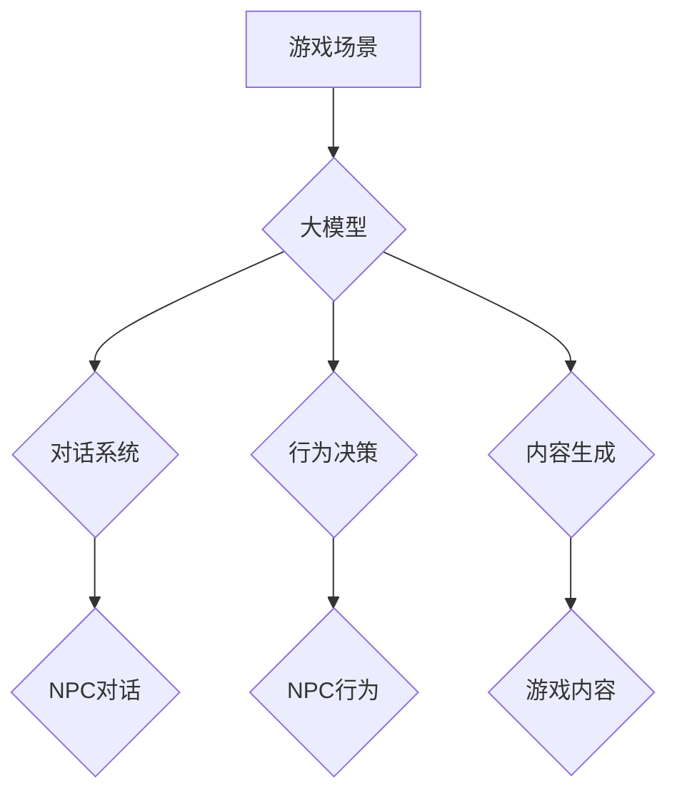

> 游戏AI, 大模型, 深度学习, 自然语言处理, 决策树, 强化学习, 虚拟世界

## 1. 背景介绍

游戏行业作为数字娱乐领域的重要组成部分，近年来呈现出蓬勃发展的态势。随着游戏技术的不断进步，玩家对游戏体验的要求也越来越高。其中，游戏AI作为游戏体验的重要组成部分，在提升游戏趣味性和沉浸感方面发挥着越来越重要的作用。

传统的基于规则的游戏AI通常难以应对复杂的游戏场景和玩家行为，而深度学习技术的出现为游戏AI的发展带来了新的机遇。深度学习算法能够从海量游戏数据中学习，并生成更加智能、逼真的游戏AI行为。

大模型作为深度学习领域的重要突破，拥有强大的泛化能力和知识表示能力，为游戏AI的创新应用提供了新的可能性。

## 2. 核心概念与联系

### 2.1 游戏AI

游戏AI是指在游戏中模拟智能行为的计算机程序。它负责控制游戏中的非玩家角色（NPC），使其能够做出逼真、合理的决策，从而提升玩家的游戏体验。

### 2.2 大模型

大模型是指在海量数据上训练的深度学习模型，拥有大量的参数和强大的泛化能力。大模型能够处理复杂的任务，例如自然语言处理、图像识别、语音合成等。

### 2.3 核心概念联系

大模型可以应用于游戏AI的多个方面，例如：

* **对话系统:** 利用大模型的自然语言处理能力，构建更加自然、流畅的对话系统，使NPC能够与玩家进行更逼真的互动。
* **行为决策:** 利用大模型的决策能力，使NPC能够做出更加智能、灵活的行为决策，从而提升游戏的挑战性和趣味性。
* **内容生成:** 利用大模型的文本生成能力，自动生成游戏中的剧情、对话、物品描述等内容，减轻游戏开发者的工作负担。

**Mermaid 流程图**



## 3. 核心算法原理 & 具体操作步骤

### 3.1 算法原理概述

大模型在游戏AI中的应用主要基于以下核心算法：

* **深度强化学习 (Deep Reinforcement Learning):** 

通过训练一个深度神经网络，使NPC能够在游戏中学习最佳策略，从而实现更加智能的行为决策。

* **自然语言处理 (Natural Language Processing):** 

利用大模型的语言理解和生成能力，使NPC能够理解玩家的指令和进行自然流畅的对话。

* **生成对抗网络 (Generative Adversarial Networks):** 

通过两个神经网络的对抗训练，生成更加逼真、多样化的游戏内容，例如场景、物品、人物等。

### 3.2 算法步骤详解

**深度强化学习:**

1. **环境建模:** 建立一个游戏环境模型，定义游戏状态、动作空间和奖励函数。
2. **代理训练:** 使用深度神经网络作为代理，通过强化学习算法训练代理，使其能够在游戏中学习最佳策略。
3. **策略评估:** 评估代理在游戏中的表现，并根据评估结果进行策略调整。

**自然语言处理:**

1. **文本预处理:** 对玩家输入的文本进行预处理，例如分词、词性标注等。
2. **语义理解:** 利用大模型的语义理解能力，理解玩家的意图和需求。
3. **文本生成:** 根据语义理解结果，生成自然流畅的对话回复。

**生成对抗网络:**

1. **生成器训练:** 使用生成器网络生成游戏内容，例如场景、物品、人物等。
2. **鉴别器训练:** 使用鉴别器网络判断生成的內容是否真实，并反馈给生成器网络。
3. **对抗训练:** 生成器和鉴别器网络进行对抗训练，使生成器网络能够生成更加逼真的游戏内容。

### 3.3 算法优缺点

**深度强化学习:**

* **优点:** 能够学习复杂的策略，实现更加智能的行为决策。
* **缺点:** 训练过程复杂，需要大量的训练数据和计算资源。

**自然语言处理:**

* **优点:** 能够实现更加自然、流畅的对话交互。
* **缺点:** 理解复杂语言和上下文仍然存在挑战。

**生成对抗网络:**

* **优点:** 能够生成更加逼真、多样化的游戏内容。
* **缺点:** 训练过程复杂，容易陷入局部最优解。

### 3.4 算法应用领域

* **角色扮演游戏 (RPG):** 使NPC能够进行更加自然、逼真的对话交互，并根据玩家的行动做出相应的反应。
* **策略游戏 (Strategy Game):** 使NPC能够做出更加智能、灵活的决策，提升游戏的挑战性和趣味性。
* **动作游戏 (Action Game):** 使NPC能够做出更加逼真的动作和行为，提升游戏的沉浸感。

## 4. 数学模型和公式 & 详细讲解 & 举例说明

### 4.1 数学模型构建

**深度强化学习:**

* **状态空间:**  $S = \{s_1, s_2, ..., s_n\}$，其中 $s_i$ 表示游戏中的一个状态。
* **动作空间:** $A = \{a_1, a_2, ..., a_m\}$，其中 $a_i$ 表示一个可执行的动作。
* **奖励函数:** $R(s, a)$，表示在状态 $s$ 执行动作 $a$ 后获得的奖励。
* **价值函数:** $V(s)$，表示从状态 $s$ 开始执行最佳策略的期望累积奖励。

**公式:**

* **Bellman方程:** $V(s) = \max_a \sum_{s'} P(s' | s, a) [R(s, a) + \gamma V(s')]$

其中:

* $\gamma$ 是折扣因子，控制未来奖励的权重。
* $P(s' | s, a)$ 是从状态 $s$ 执行动作 $a$ 到状态 $s'$ 的转移概率。

**自然语言处理:**

* **词嵌入:** 将单词映射到一个低维向量空间，表示单词的语义信息。
* **注意力机制:** 允许模型关注输入序列中的特定部分，提高对上下文信息的理解能力。

**公式:**

* **词嵌入:** $w_i = \mathbf{e}_i$，其中 $w_i$ 是单词 $i$ 的嵌入向量，$\mathbf{e}_i$ 是一个低维向量。
* **注意力权重:** $a_{ij} = \frac{\exp(score(w_i, w_j))}{\sum_k \exp(score(w_i, w_k))}$

其中:

* $score(w_i, w_j)$ 是单词 $i$ 和 $j$ 之间的相似度得分。

### 4.2 公式推导过程

**Bellman方程的推导:**

Bellman方程是强化学习的核心公式，它描述了价值函数的更新规则。

假设我们有一个状态 $s$，我们想要找到从这个状态开始执行最佳策略的期望累积奖励。

我们可以通过以下方式来计算:

1. 在状态 $s$ 执行一个动作 $a$，然后进入下一个状态 $s'$。
2. 在状态 $s'$ 继续执行最佳策略，获得期望累积奖励 $V(s')$。
3. 将奖励 $R(s, a)$ 和折扣后的期望累积奖励 $V(s')$ 相加，得到从状态 $s$ 执行动作 $a$ 后获得的期望累积奖励。
4. 对所有可能的动作 $a$ 进行求最大，得到从状态 $s$ 开始执行最佳策略的期望累积奖励 $V(s)$。

**公式:**

$V(s) = \max_a \sum_{s'} P(s' | s, a) [R(s, a) + \gamma V(s')]$

### 4.3 案例分析与讲解

**深度强化学习案例:**

AlphaGo 是 DeepMind 开发的围棋 AI，它利用深度强化学习算法战胜了世界冠军围棋手。

AlphaGo 的训练过程包括以下步骤:

1. 使用蒙特卡罗树搜索算法生成游戏局面。
2. 使用深度神经网络评估每个局面的价值。
3. 使用强化学习算法更新神经网络的权重。

AlphaGo 的成功证明了深度强化学习算法在游戏AI领域的应用潜力。

## 5. 项目实践：代码实例和详细解释说明

### 5.1 开发环境搭建

* **操作系统:** Ubuntu 20.04
* **编程语言:** Python 3.8
* **深度学习框架:** TensorFlow 2.0
* **其他工具:** Git, Jupyter Notebook

### 5.2 源代码详细实现

```python
import tensorflow as tf

# 定义神经网络模型
model = tf.keras.models.Sequential([
    tf.keras.layers.Dense(128, activation='relu', input_shape=(input_dim,)),
    tf.keras.layers.Dense(64, activation='relu'),
    tf.keras.layers.Dense(output_dim)
])

# 定义损失函数和优化器
loss_fn = tf.keras.losses.MeanSquaredError()
optimizer = tf.keras.optimizers.Adam()

# 训练模型
for epoch in range(num_epochs):
    for batch in dataset:
        with tf.GradientTape() as tape:
            predictions = model(batch['input'])
            loss = loss_fn(predictions, batch['target'])
        gradients = tape.gradient(loss, model.trainable_variables)
        optimizer.apply_gradients(zip(gradients, model.trainable_variables))

# 保存模型
model.save('game_ai_model.h5')
```

### 5.3 代码解读与分析

* **神经网络模型:** 代码定义了一个简单的多层感知机模型，用于学习游戏状态和动作之间的关系。
* **损失函数和优化器:** 使用均方误差损失函数和Adam优化器来训练模型。
* **训练过程:** 训练模型的过程包括迭代地更新模型参数，以最小化损失函数的值。
* **模型保存:** 训练完成后，将模型保存为文件，以便后续使用。

### 5.4 运行结果展示

训练完成后，可以使用训练好的模型对新的游戏状态进行预测，并生成相应的动作。

## 6. 实际应用场景

### 6.1 游戏NPC对话系统

利用大模型的自然语言处理能力，构建更加自然、流畅的NPC对话系统，使玩家能够与NPC进行更加逼真的互动。

### 6.2 游戏策略决策

利用大模型的决策能力，使NPC能够做出更加智能、灵活的策略决策，提升游戏的挑战性和趣味性。

### 6.3 游戏内容生成

利用大模型的文本生成能力，自动生成游戏中的剧情、对话、物品描述等内容，减轻游戏开发者的工作负担。

### 6.4 未来应用展望

* **个性化游戏体验:** 根据玩家的喜好和行为，定制个性化的游戏内容和难度。
* **沉浸式游戏体验:** 利用虚拟现实和增强现实技术，结合大模型生成的逼真游戏内容，打造更加沉浸式的游戏体验。
* **游戏辅助工具:** 利用大模型分析游戏数据，为玩家提供游戏策略建议和技巧指导。

## 7. 工具和资源推荐

### 7.1 学习资源推荐

* **书籍:**
    * 《深度学习》
    * 《强化学习：原理、算法和应用》
* **在线课程:**
    * Coursera: 深度学习
    * Udacity: 强化学习
* **开源项目:**
    * TensorFlow
    * PyTorch

### 7.2 开发工具推荐

* **IDE:** PyCharm, VS Code
* **深度学习框架:** TensorFlow, PyTorch
* **游戏引擎:** Unity, Unreal Engine

### 7.3 相关论文推荐

* **AlphaGo:** Mastering the game of Go with deep neural networks and tree search
* **Dota 2 AI:** OpenAI Five: Mastering Dota 2 with Deep Reinforcement Learning

## 8. 总结：