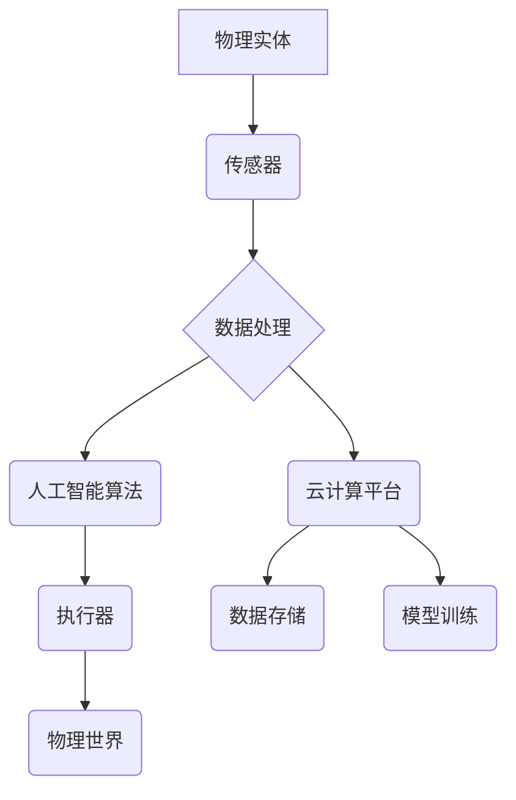

> 物理实体自动化、机器人技术、人工智能、深度学习、计算机视觉、自然语言处理、云计算、物联网

## 1. 背景介绍

随着人工智能 (AI)、机器学习 (ML) 和深度学习 (DL) 技术的飞速发展，物理实体自动化已成为一个备受关注的领域。物理实体自动化是指利用智能技术控制和管理物理世界中的实体，例如机器人、车辆、设备等，以提高效率、降低成本和增强安全性。

传统自动化主要依赖于预先编程的规则和逻辑，而物理实体自动化的核心在于赋予实体自主学习和决策的能力。通过结合传感器、 actuators、算法和云计算平台，物理实体可以感知环境、理解指令、做出决策并执行动作，从而实现更灵活、更智能的自动化。

## 2. 核心概念与联系

**2.1 核心概念**

* **机器人技术:**  机器人技术是物理实体自动化的基础，涉及机器人设计、控制、导航和感知等方面。
* **人工智能 (AI):** AI 赋予实体智能，使其能够学习、推理和决策。
* **深度学习 (DL):** DL 是 AI 的一种子集，利用多层神经网络模拟人类大脑的学习过程，能够处理复杂的数据和模式。
* **计算机视觉 (CV):** CV 使实体能够“看”世界，通过摄像头获取图像信息并进行识别、分类和理解。
* **自然语言处理 (NLP):** NLP 使实体能够“听”和“说”，理解和生成人类语言。
* **云计算:** 云计算提供强大的计算资源和数据存储能力，支持实体的远程控制、数据分析和模型训练。
* **物联网 (IoT):** IoT 连接实体和网络，实现数据共享和远程监控。

**2.2 架构图**



## 3. 核心算法原理 & 具体操作步骤

**3.1 算法原理概述**

物理实体自动化的核心算法通常基于机器学习和深度学习技术。这些算法通过训练数据学习实体的行为模式和环境特征，从而实现自主决策和控制。常见的算法包括：

* **强化学习 (RL):** RL 算法通过奖励机制训练实体，使其在特定环境中学习最佳行为策略。
* **监督学习 (SL):** SL 算法利用标记数据训练模型，使其能够预测或分类输入数据。
* **无监督学习 (UL):** UL 算法从未标记数据中发现模式和结构，例如聚类和降维。

**3.2 算法步骤详解**

1. **数据收集:** 收集实体周围的环境数据，例如图像、传感器读数和文本信息。
2. **数据预处理:** 对收集到的数据进行清洗、转换和特征提取，使其适合算法训练。
3. **模型选择:** 根据任务需求选择合适的算法模型，例如 RL、SL 或 UL。
4. **模型训练:** 利用训练数据训练模型，调整模型参数以获得最佳性能。
5. **模型评估:** 使用测试数据评估模型性能，例如准确率、召回率和 F1-score。
6. **模型部署:** 将训练好的模型部署到实体中，使其能够实时感知环境并做出决策。

**3.3 算法优缺点**

| 算法类型 | 优点 | 缺点 |
|---|---|---|
| 强化学习 | 能够学习复杂的行为策略，适应动态环境 | 需要大量训练数据和时间，训练过程可能不稳定 |
| 监督学习 | 性能通常较高，可以实现高准确率 | 需要大量标记数据，数据标注成本高 |
| 无监督学习 | 不需要标记数据，可以发现数据中的隐含模式 | 难以评估模型性能，应用场景相对有限 |

**3.4 算法应用领域**

物理实体自动化算法广泛应用于以下领域：

* **制造业:** 自动化生产线、机器人焊接、智能仓储
* **物流运输:** 自动驾驶车辆、无人配送机器人
* **医疗保健:** 机器人手术、智能诊断系统
* **农业:** 自动化耕种、无人驾驶拖拉机
* **服务业:** 机器人客服、智能家居

## 4. 数学模型和公式 & 详细讲解 & 举例说明

**4.1 数学模型构建**

物理实体自动化的数学模型通常基于状态空间模型，将实体的状态和动作表示为数学变量和函数。

* **状态空间:** 描述实体在特定时间点的状态，例如位置、速度、姿态等。
* **动作空间:** 描述实体可以执行的动作，例如移动、旋转、抓取等。
* **状态转移函数:** 描述实体状态随时间变化的规律。
* **观测函数:** 描述实体感知环境的传感器数据。

**4.2 公式推导过程**

强化学习算法的核心是最大化累积奖励。假设实体在时间步 t 的状态为 s_t，执行动作 a_t，获得奖励 r_t，则累积奖励可以表示为：

$$
R = \sum_{t=0}^{T} \gamma^t r_t
$$

其中，γ 是折扣因子，控制未来奖励的权重。

强化学习算法的目标是找到最优策略 π，使得累积奖励最大化：

$$
\pi^* = \arg\max_{\pi} R(\pi)
$$

**4.3 案例分析与讲解**

例如，训练一个机器人导航到目标位置，可以使用强化学习算法。

* 状态空间: 机器人的位置和方向。
* 动作空间: 机器人可以向前、向后、向左、向右移动。
* 状态转移函数: 描述机器人移动后状态的变化。
* 观测函数: 机器人通过传感器感知周围环境。
* 奖励函数: 当机器人到达目标位置时获得最大奖励，否则获得较小的奖励。

通过训练，机器人可以学习到最优导航策略，从而高效地到达目标位置。

## 5. 项目实践：代码实例和详细解释说明

**5.1 开发环境搭建**

* 操作系统: Ubuntu 20.04
* Python 版本: 3.8
* 库依赖: TensorFlow, PyTorch, OpenCV, NumPy

**5.2 源代码详细实现**

```python
import tensorflow as tf

# 定义神经网络模型
model = tf.keras.models.Sequential([
    tf.keras.layers.Conv2D(32, (3, 3), activation='relu', input_shape=(64, 64, 3)),
    tf.keras.layers.MaxPooling2D((2, 2)),
    tf.keras.layers.Conv2D(64, (3, 3), activation='relu'),
    tf.keras.layers.MaxPooling2D((2, 2)),
    tf.keras.layers.Flatten(),
    tf.keras.layers.Dense(10, activation='softmax')
])

# 编译模型
model.compile(optimizer='adam',
              loss='sparse_categorical_crossentropy',
              metrics=['accuracy'])

# 训练模型
model.fit(x_train, y_train, epochs=10)

# 评估模型
loss, accuracy = model.evaluate(x_test, y_test)
print('Test loss:', loss)
print('Test accuracy:', accuracy)
```

**5.3 代码解读与分析**

这段代码实现了一个简单的图像分类模型。

* 使用 TensorFlow 库构建神经网络模型。
* 模型包含卷积层、池化层和全连接层。
* 使用 Adam 优化器、交叉熵损失函数和准确率指标训练模型。
* 使用训练数据训练模型，并使用测试数据评估模型性能。

**5.4 运行结果展示**

训练完成后，模型可以用于识别图像中的类别。

## 6. 实际应用场景

**6.1 智能制造**

* 自动化生产线: 机器人协同工作，完成装配、焊接、喷涂等任务。
* 智能仓储: 无人叉车自动搬运货物，提高仓储效率。
* 品质检测: 机器视觉系统自动识别产品缺陷。

**6.2 自动驾驶**

* 自动驾驶汽车: 利用传感器数据和深度学习算法，实现车辆自动驾驶。
* 无人机: 自动飞行、航拍、物料运输等应用。

**6.3 智能医疗**

* 机器人手术: 辅助医生进行微创手术，提高手术精度。
* 智能诊断系统: 利用机器学习算法分析患者数据，辅助医生诊断疾病。

**6.4 其他应用场景**

* 智能家居: 智能音箱、智能照明、智能安防等。
* 农业机器人: 自动化耕种、喷洒农药、收割等。
* 服务机器人: 机器人客服、陪伴机器人等。

**6.5 未来应用展望**

随着人工智能和机器人技术的不断发展，物理实体自动化将应用于更多领域，例如：

* 个性化医疗: 根据患者的个体特征提供定制化的医疗服务。
* 智能城市: 利用传感器网络和人工智能算法，提高城市管理效率和居民生活质量。
* 灾害救援: 机器人参与灾害救援，提供快速有效的救援服务。

## 7. 工具和资源推荐

**7.1 学习资源推荐**

* **书籍:**
    * 《机器人学导论》
    * 《深度学习》
    * 《人工智能：现代方法》
* **在线课程:**
    * Coursera: 机器人学、深度学习
    * edX: 人工智能、机器学习
* **开源平台:**
    * ROS (Robot Operating System)
    * TensorFlow
    * PyTorch

**7.2 开发工具推荐**

* **编程语言:** Python
* **机器学习库:** TensorFlow, PyTorch
* **机器人控制库:** ROS
* **计算机视觉库:** OpenCV

**7.3 相关论文推荐**

* **强化学习:**
    * Deep Reinforcement Learning: An Overview
* **深度学习:**
    * ImageNet Classification with Deep Convolutional Neural Networks
* **机器人学:**
    * A Survey of Robot Learning

## 8. 总结：未来发展趋势与挑战

**8.1 研究成果总结**

物理实体自动化领域取得了显著进展，例如：

* 强化学习算法在机器人控制和导航方面取得了突破。
* 深度学习算法在计算机视觉和自然语言处理方面取得了重大进展。
* 机器人技术不断发展，机器人更加灵活、智能和安全。

**8.2 未来发展趋势**

* **更智能的实体:** 利用更先进的 AI 算法，赋予实体更强的学习、推理和决策能力。
* **更协同的系统:** 构建多机器人协同工作系统，提高效率和灵活性。
* **更安全可靠的系统:** 提高实体的安全性、可靠性和鲁棒性，确保其在复杂环境中安全运行。

**8.3 面临的挑战**

* **数据获取和标注:** 训练高性能的 AI 模型需要大量高质量的数据，数据获取和标注成本高昂。
* **算法复杂度:** 许多 AI 算法非常复杂，难以理解和调试。
* **安全性和伦理问题:** 物理实体自动化涉及安全性和伦理问题，需要制定相应的规范和政策。

**8.4 研究展望**

未来，物理实体自动化将继续朝着更智能、更协同、更安全的方向发展。研究者将继续探索新的算法、技术和应用场景，推动物理实体自动化技术的发展和应用。

## 9. 附录：常见问题与解答

**9.1 如何选择合适的 AI 算法？**

选择合适的 AI 算法取决于具体的应用场景和数据特点。例如，对于预测连续值的任务，可以使用回归算法；对于分类任务，可以使用分类算法。

**9.2 如何解决数据标注问题？**

数据标注是训练 AI 模型的关键步骤，但数据标注成本高昂。一些解决方案包括：

* 利用自动标注工具
* crowdsourcing 数据标注
* 使用迁移学习技术

**9.3 如何保证物理实体自动化的安全性？**

物理实体自动化的安全性是一个重要问题，需要采取以下措施：

* 设计安全的硬件和软件系统
* 开发可靠的故障