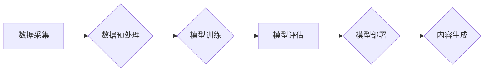

> AIGC, 生成式AI, 长尾效应, 产业变革, 伦理挑战, 知识图谱, 深度学习, 自然语言处理

## 1. 背景介绍

在上一篇博客中，我们探讨了生成式AI的潜力和挑战，并分析了其在各个领域的应用场景。如今，AIGC（人工智能生成内容）正逐渐成为一个炙手可热的话题，其强大的内容创作能力引发了广泛的关注和讨论。

从ChatGPT的爆火到DALL-E 2的惊艳表现，生成式AI已经不再是科幻小说中的幻想，而是触手可及的现实。它能够生成高质量的文本、图像、音频、视频等多种内容，为人们的生活和工作带来了前所未有的便利。

然而，AIGC的发展也面临着诸多挑战，例如数据安全、版权问题、伦理道德等。如何平衡AIGC的应用与风险，是需要我们认真思考和探讨的问题。

## 2. 核心概念与联系

AIGC的核心概念是利用人工智能技术，自动生成新的内容。它基于深度学习算法，通过训练大量的文本、图像、音频等数据，学习内容的规律和模式，从而能够生成类似人类创作的内容。

AIGC的应用场景非常广泛，涵盖了文本创作、图像生成、音频合成、视频制作等多个领域。

**Mermaid 流程图：**

## 3. 核心算法原理 & 具体操作步骤

### 3.1  算法原理概述

AIGC的核心算法主要包括：

* **自然语言处理 (NLP):** 用于理解和生成文本内容。
* **计算机视觉 (CV):** 用于理解和生成图像内容。
* **语音识别 (ASR):** 用于将语音转换为文本内容。
* **语音合成 (TTS):** 用于将文本转换为语音内容。

这些算法通常基于深度学习模型，例如Transformer、GAN等。

### 3.2  算法步骤详解

AIGC的具体操作步骤如下：

1. **数据采集:** 收集大量文本、图像、音频等数据，作为模型训练的数据集。
2. **数据预处理:** 对收集到的数据进行清洗、格式化、标注等处理，使其能够被模型理解和训练。
3. **模型训练:** 使用深度学习算法，训练模型，使其能够生成高质量的内容。
4. **模型评估:** 对训练好的模型进行评估，测试其生成内容的质量和准确性。
5. **模型部署:** 将训练好的模型部署到服务器或云平台，使其能够为用户提供服务。
6. **内容生成:** 用户通过输入文本、图像、音频等提示，模型根据提示生成相应的新的内容。

### 3.3  算法优缺点

**优点:**

* **自动化生成内容:** 可以自动生成大量高质量的内容，节省人力成本和时间。
* **个性化定制:** 可以根据用户的需求，生成个性化的内容。
* **跨语言支持:** 可以生成多种语言的内容。

**缺点:**

* **数据依赖:** AIGC模型的性能取决于训练数据的质量和数量。
* **伦理风险:** AIGC可能被用于生成虚假信息、恶意内容等，存在伦理风险。
* **版权问题:** AIGC生成的內容的版权归属问题尚待解决。

### 3.4  算法应用领域

AIGC的应用领域非常广泛，包括：

* **内容创作:** 自动生成新闻报道、广告文案、小说、诗歌等。
* **教育培训:** 自动生成学习资料、练习题、个性化教学方案等。
* **娱乐休闲:** 自动生成游戏场景、虚拟角色、音乐作品等。
* **科学研究:** 自动生成实验数据、分析报告、学术论文等。

## 4. 数学模型和公式 & 详细讲解 & 举例说明

### 4.1  数学模型构建

AIGC的核心数学模型通常是基于神经网络的，例如Transformer、GAN等。

**Transformer模型:**

Transformer模型是一种基于注意力机制的神经网络模型，能够有效地处理序列数据，例如文本。

**GAN模型:**

GAN模型是一种生成对抗网络，由生成器和判别器两个部分组成。生成器试图生成逼真的数据，而判别器试图区分真实数据和生成数据。

### 4.2  公式推导过程

Transformer模型的注意力机制公式如下：

$$
Attention(Q, K, V) = \frac{exp(Q \cdot K^T / \sqrt{d_k})}{exp(Q \cdot K^T / \sqrt{d_k})} \cdot V
$$

其中：

* $Q$：查询矩阵
* $K$：键矩阵
* $V$：值矩阵
* $d_k$：键向量的维度

GAN模型的损失函数公式如下：

$$
L(G, D) = E_{x \sim p_{data}(x)}[log(D(x))] + E_{z \sim p_z(z)}[log(1 - D(G(z)))]
$$

其中：

* $G$：生成器
* $D$：判别器
* $x$：真实数据
* $z$：噪声向量

### 4.3  案例分析与讲解

**Transformer模型案例:**

BERT模型是基于Transformer模型的预训练语言模型，能够理解和生成高质量的文本内容。

**GAN模型案例:**

StyleGAN模型是基于GAN模型的图像生成模型，能够生成逼真的图像，例如人脸、风景等。

## 5. 项目实践：代码实例和详细解释说明

### 5.1  开发环境搭建

AIGC的开发环境通常需要安装Python、深度学习框架（例如TensorFlow、PyTorch）等软件。

### 5.2  源代码详细实现

AIGC的源代码实现非常复杂，需要根据具体的应用场景和模型选择进行编写。

### 5.3  代码解读与分析

AIGC的代码解读需要对深度学习算法、神经网络模型等知识有深入的理解。

### 5.4  运行结果展示

AIGC的运行结果展示需要根据具体的应用场景进行评估，例如文本生成质量、图像生成逼真度等。

## 6. 实际应用场景

### 6.1  新闻报道

AIGC可以自动生成新闻报道，例如财经新闻、体育新闻等。

### 6.2  广告文案

AIGC可以自动生成广告文案，例如产品描述、促销语等。

### 6.3  小说创作

AIGC可以辅助小说创作，例如生成情节、人物、场景等。

### 6.4  未来应用展望

AIGC的未来应用前景非常广阔，例如：

* **个性化教育:** 根据学生的学习情况，自动生成个性化的学习方案。
* **虚拟助手:** 提供更智能、更人性化的虚拟助手服务。
* **创意设计:** 辅助设计师进行创意设计，例如生成产品外观、服装款式等。

## 7. 工具和资源推荐

### 7.1  学习资源推荐

* **书籍:** 《深度学习》、《自然语言处理》
* **在线课程:** Coursera、edX、Udacity等平台上的深度学习、自然语言处理课程。
* **开源项目:** TensorFlow、PyTorch、HuggingFace等开源项目。

### 7.2  开发工具推荐

* **Python:** AIGC开发的主要编程语言。
* **深度学习框架:** TensorFlow、PyTorch等深度学习框架。
* **云平台:** AWS、Azure、Google Cloud等云平台提供AIGC相关的服务和工具。

### 7.3  相关论文推荐

* **Attention Is All You Need:** https://arxiv.org/abs/1706.03762
* **Generative Adversarial Networks:** https://arxiv.org/abs/1406.2661

## 8. 总结：未来发展趋势与挑战

### 8.1  研究成果总结

AIGC的研究取得了显著的进展，例如：

* **模型性能提升:** AIGC模型的生成能力和质量不断提升。
* **应用场景拓展:** AIGC的应用场景不断拓展，覆盖了多个领域。
* **技术标准制定:** 相关机构正在制定AIGC的技术标准和规范。

### 8.2  未来发展趋势

* **模型更加强大:** AIGC模型将更加强大，能够生成更加逼真、更加复杂的內容。
* **应用更加广泛:** AIGC将应用于更多领域，例如医疗、金融、法律等。
* **伦理规范更加完善:** 针对AIGC的伦理问题，将制定更加完善的规范和制度。

### 8.3  面临的挑战

* **数据安全:** AIGC模型的训练需要大量数据，如何保证数据的安全和隐私是需要解决的问题。
* **版权问题:** AIGC生成的內容的版权归属问题尚待解决。
* **伦理风险:** AIGC可能被用于生成虚假信息、恶意内容等，存在伦理风险。

### 8.4  研究展望

未来，AIGC的研究将更加注重以下方面：

* **模型的可解释性:** 提高AIGC模型的可解释性，使其生成的內容更加透明和可信。
* **模型的安全性:** 加强AIGC模型的安全性，防止其被用于恶意目的。
* **模型的公平性:** 确保AIGC模型的公平性，避免其产生偏见和歧视。

## 9. 附录：常见问题与解答

**常见问题:**

* AIGC生成的內容是否真实可靠？
* AIGC会取代人类的工作吗？
* 如何避免AIGC被用于恶意目的？

**解答:**

* AIGC生成的內容需要进行核实和验证，不能完全相信其真实性。
* AIGC可以辅助人类工作，但不会完全取代人类的工作。
* 需要制定相应的法律法规和伦理规范，防止AIGC被用于恶意目的。

作者：禅与计算机程序设计艺术 / Zen and the Art of Computer Programming 
<end_of_turn>