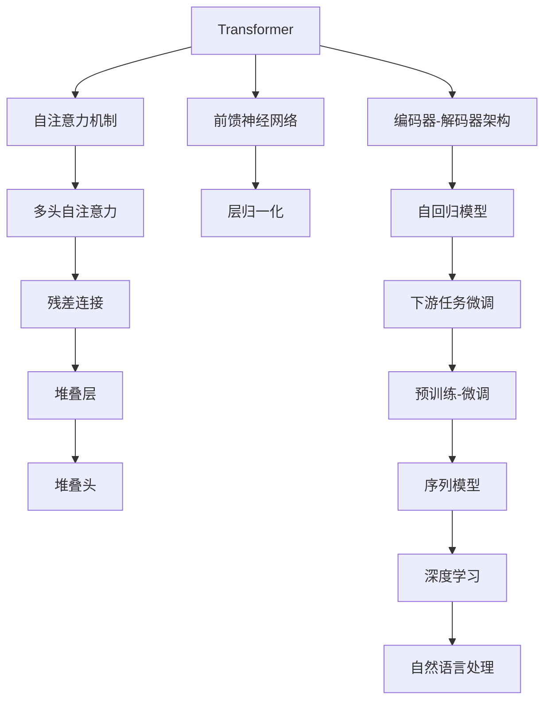

                 

# GPT系列模型架构演进 GPT-1到GPT-4

> 关键词：GPT系列模型,自回归模型,Transformer架构,大规模语言模型,自监督学习,自然语言处理,预训练,下游任务微调,注意力机制,解码器,Transformer编码器,深度学习,人工智能

## 1. 背景介绍

### 1.1 问题由来
自2018年OpenAI发布GPT-1模型以来，GPT系列模型已经成为自然语言处理(Natural Language Processing, NLP)领域最为流行和强大的深度学习架构之一。该系列模型通过自回归或自编码的Transformer架构，在大规模无标签文本语料上进行预训练，学习到丰富的语言知识和表征能力。

然而，随着技术的发展，GPT系列模型的架构也在不断演进，从GPT-1到GPT-4，每一代模型都在原有基础上进行了显著的提升和改进，不仅在模型规模上有了质的飞跃，还在性能、效率和可扩展性等方面有了新的突破。本文将详细回顾GPT系列模型的架构演进，并探讨其核心技术原理和实际应用场景。

### 1.2 问题核心关键点
GPT系列模型的架构演进主要体现在以下几个方面：

1. **模型规模和参数数量**：从GPT-1的约400M参数，到GPT-4的超过1750亿参数，模型规模不断扩大，参数数量呈指数级增长。
2. **计算效率和可扩展性**：通过硬件加速和优化算法，GPT模型在处理大规模文本时，计算效率显著提升，能够在大规模分布式系统中进行高效训练。
3. **模型性能和效果**：模型在自然语言理解、生成、对话等方面的表现越来越强，尤其是在推理、逻辑判断和语言生成任务中取得了显著进步。
4. **应用场景和广泛性**：GPT模型从最初的简单文本生成任务，拓展到了问答系统、机器翻译、代码生成、图像生成等多个领域，并在实际应用中展现出了强大的泛化能力。

## 2. 核心概念与联系

### 2.1 核心概念概述

为了更好地理解GPT系列模型的架构演进，我们首先介绍几个核心概念：

- **Transformer**：一种基于自注意力机制的深度学习架构，由Vaswani等人于2017年提出。Transformer通过多头自注意力机制和前馈神经网络，实现了高效并行计算和长距离依赖捕捉。

- **自回归模型**：一种能够基于历史信息预测未来值的模型，常见于文本生成、语音合成等任务。GPT系列模型采用的就是自回归模型。

- **大规模语言模型**：指通过在大规模无标签文本语料上预训练得到的，具有复杂语言表示能力的深度学习模型。

- **预训练-微调(Fine-Tuning)**：指在大规模预训练模型的基础上，使用下游任务的少量标注数据进行微调，以适应特定任务。GPT系列模型通常采用这一策略。

- **自监督学习**：一种利用无标签数据进行模型训练的方法，通过构造一些自我监督任务来训练模型，如掩码语言模型(Masked Language Model, MLM)、掩码图像模型(Masked Image Modeling, MIM)等。

### 2.2 核心概念原理和架构的 Mermaid 流程图



这个流程图展示了Transformer架构的核心组件和流程：

1. 自注意力机制和前馈神经网络构成Transformer的核心。
2. 编码器-解码器架构实现自回归模型的功能。
3. 预训练-微调策略使得模型能够适应下游任务。
4. 序列模型和深度学习进一步提升模型的表现。
5. 自然语言处理将模型应用于实际NLP任务。

## 3. 核心算法原理 & 具体操作步骤

### 3.1 算法原理概述

GPT系列模型基于自回归Transformer架构，通过在大规模无标签文本语料上进行预训练，学习到丰富的语言知识和表征能力。在预训练阶段，模型通过掩码语言模型等自监督任务进行训练，学习到语言的概率分布。在微调阶段，模型使用下游任务的少量标注数据进行有监督训练，优化模型在特定任务上的性能。

### 3.2 算法步骤详解

GPT系列模型的预训练和微调步骤大致如下：

**Step 1: 准备预训练模型和数据集**
- 选择GPT系列模型的某个版本，如GPT-1、GPT-2、GPT-3或GPT-4。
- 准备大规模无标签文本语料，通常包括各种领域的书籍、论文、网页等。

**Step 2: 构建预训练任务**
- 定义预训练任务，如掩码语言模型、下一句预测等。
- 使用Transformer架构，定义自注意力机制和前馈神经网络。
- 设计多层堆叠的编码器和解码器，构建完整的预训练模型。

**Step 3: 预训练过程**
- 将大规模文本数据划分为小批量，输入模型进行前向传播和反向传播。
- 使用优化算法（如AdamW、SGD等）更新模型参数。
- 重复多次迭代，直至模型收敛。

**Step 4: 下游任务微调**
- 收集下游任务的少量标注数据，将其划分为训练集、验证集和测试集。
- 添加任务适配层，如线性分类器、多头注意力等。
- 设定合适的学习率和优化算法，开始微调。
- 周期性在验证集上评估模型性能，避免过拟合。
- 重复迭代直至满足预设条件，如精度提升或提前停止。

### 3.3 算法优缺点

GPT系列模型的预训练-微调方法具有以下优点：

1. **高效的预训练**：大规模预训练使模型能够学习到丰富的语言知识和表征能力。
2. **良好的泛化性能**：微调后的模型在各种下游任务上表现出强大的泛化能力。
3. **灵活的微调**：可以通过改变任务适配层和优化算法，适应不同领域的微调需求。
4. **参数高效微调**：在微调过程中，只需要更新少部分模型参数，避免过拟合。

同时，该方法也存在一些缺点：

1. **数据依赖性**：微调效果依赖于下游任务的标注数据质量，数据获取成本较高。
2. **计算资源消耗大**：大规模预训练需要高性能计算资源，微调过程也需大量计算资源。
3. **模型复杂度**：模型参数量巨大，推理计算复杂度较高。
4. **模型稳定性**：模型在面对新数据时，可能出现灾难性遗忘，需要持续学习。

### 3.4 算法应用领域

GPT系列模型已经在多个领域得到了广泛应用，以下是几个典型的应用场景：

- **文本生成**：如文章撰写、小说创作、对话生成等。
- **机器翻译**：将源语言文本翻译成目标语言。
- **问答系统**：对自然语言问题给出答案。
- **代码生成**：自动编写程序代码。
- **文本摘要**：将长文本压缩成简短摘要。
- **情感分析**：判断文本情感倾向。
- **图像生成**：根据描述生成图片。

除了上述这些经典任务外，GPT模型还被创新性地应用到更多场景中，如可控文本生成、多模态生成、自然语言推理等，为NLP技术带来了全新的突破。

## 4. 数学模型和公式 & 详细讲解

### 4.1 数学模型构建

我们以GPT-2模型为例，介绍其数学模型的构建过程。

**掩码语言模型**
GPT-2使用掩码语言模型作为预训练任务，其目标是在给定一个单词序列的情况下，预测缺失的单词。

设输入序列为 $x=(x_1, x_2, \ldots, x_n)$，其中 $x_i$ 表示第 $i$ 个单词，模型需要预测给定单词序列 $x$ 下，缺失单词 $x_i$ 的单词概率分布 $P(x_i|x_{<i})$。

设 $v_i$ 为 $x_i$ 的one-hot编码向量，则模型的输出为：

$$
P(x_i|x_{<i}) = \text{softmax}(W_hx_{<i} + b_h)
$$

其中 $W_h$ 和 $b_h$ 为隐藏层的权重和偏置向量。

**解码器架构**
GPT-2采用自回归Transformer架构，由多个编码器和解码器组成。每个编码器由一个多头自注意力机制和一个前馈神经网络构成。

设 $z_h$ 为第 $h$ 层的隐藏表示，其计算方式为：

$$
z_h = \text{FFN}(z_{h-1}) + \text{Attention}(z_{h-1})
$$

其中 $\text{FFN}$ 为前馈神经网络，$\text{Attention}$ 为多头自注意力机制。

设 $z_1$ 为输入序列的表示，$z_n$ 为解码器的输出。通过堆叠多层编码器和解码器，GPT-2能够捕捉长距离依赖。

**下游任务微调**
在微调阶段，GPT-2使用下游任务的少量标注数据进行训练。以二分类任务为例，设微调后的模型为 $M^*$，其输出为：

$$
\hat{y} = \text{softmax}(W_hz_n + b_h)
$$

其中 $W_h$ 和 $b_h$ 为任务适配层的权重和偏置向量。

### 4.2 公式推导过程

接下来，我们推导GPT-2模型中掩码语言模型的训练过程和解码器架构的计算方式。

**掩码语言模型的训练过程**
设 $L$ 为掩码语言模型的训练轮数，$N$ 为批次大小，$n$ 为序列长度。设 $x_i$ 为掩码位置，$P(x_i|x_{<i})$ 为掩码位置 $x_i$ 的单词概率分布，则掩码语言模型的训练过程为：

$$
\min_{\theta} -\frac{1}{N} \sum_{i=1}^n \sum_{j=1}^L \log P(x_i|x_{<i})
$$

其中 $\theta$ 为模型参数。

**解码器架构的计算方式**
GPT-2的解码器由多个堆叠的Transformer层构成。设第 $h$ 层的输入为 $z_{h-1}$，输出为 $z_h$。则每一层的计算方式为：

$$
z_h = \text{LayerNorm}(\text{Attention}(z_{h-1}) + \text{FFN}(z_{h-1}))
$$

其中 $\text{LayerNorm}$ 为层归一化，$\text{Attention}$ 为多头自注意力机制，$\text{FFN}$ 为前馈神经网络。

### 4.3 案例分析与讲解

以GPT-2模型在文本生成任务中的应用为例，探讨其具体实现和效果。

**文本生成**
设目标文本序列为 $y=(y_1, y_2, \ldots, y_m)$，其中 $y_i$ 表示第 $i$ 个单词。设输入序列为 $x=(x_1, x_2, \ldots, x_n)$，其中 $x_i$ 表示第 $i$ 个单词。

在文本生成过程中，模型首先通过编码器将输入序列 $x$ 转化为隐藏表示 $z_n$，然后通过解码器生成目标文本序列 $y$。目标文本序列的每个单词 $y_i$ 的概率分布为：

$$
P(y_i|y_{<i}) = \text{softmax}(W_hz_{n-1} + b_h)
$$

其中 $W_h$ 和 $b_h$ 为解码器的权重和偏置向量。

**训练过程**
在训练过程中，模型使用交叉熵损失函数作为训练目标，目标为最小化预测单词与真实单词的差异。

设 $P(x_i|x_{<i})$ 为掩码语言模型的预测概率，$P(y_i|y_{<i})$ 为文本生成模型的预测概率，则训练目标为：

$$
\min_{\theta} -\frac{1}{N} \sum_{i=1}^n \sum_{j=1}^L \log P(x_i|x_{<i}) + \frac{1}{M} \sum_{i=1}^m \sum_{j=1}^M \log P(y_i|y_{<i})
$$

其中 $M$ 为生成序列的长度，$\theta$ 为模型参数。

## 5. 项目实践：代码实例和详细解释说明

### 5.1 开发环境搭建

在进行GPT模型实践前，我们需要准备好开发环境。以下是使用Python进行PyTorch开发的环境配置流程：

1. 安装Anaconda：从官网下载并安装Anaconda，用于创建独立的Python环境。

2. 创建并激活虚拟环境：
```bash
conda create -n pytorch-env python=3.8 
conda activate pytorch-env
```

3. 安装PyTorch：根据CUDA版本，从官网获取对应的安装命令。例如：
```bash
conda install pytorch torchvision torchaudio cudatoolkit=11.1 -c pytorch -c conda-forge
```

4. 安装Transformers库：
```bash
pip install transformers
```

5. 安装各类工具包：
```bash
pip install numpy pandas scikit-learn matplotlib tqdm jupyter notebook ipython
```

完成上述步骤后，即可在`pytorch-env`环境中开始模型训练和微调实践。

### 5.2 源代码详细实现

下面我们以GPT-2模型为例，给出使用Transformers库进行文本生成任务的PyTorch代码实现。

首先，定义文本生成任务的数据处理函数：

```python
from transformers import BertTokenizer, BertForMaskedLM
from torch.utils.data import Dataset
import torch

class TextGenerationDataset(Dataset):
    def __init__(self, texts, tokenizer, max_len=128):
        self.texts = texts
        self.tokenizer = tokenizer
        self.max_len = max_len
        
    def __len__(self):
        return len(self.texts)
    
    def __getitem__(self, item):
        text = self.texts[item]
        
        encoding = self.tokenizer(text, return_tensors='pt', max_length=self.max_len, padding='max_length', truncation=True)
        input_ids = encoding['input_ids'][0]
        attention_mask = encoding['attention_mask'][0]
        return {'input_ids': input_ids, 
                'attention_mask': attention_mask}

# 初始化分词器和模型
tokenizer = BertTokenizer.from_pretrained('bert-base-cased')
model = BertForMaskedLM.from_pretrained('bert-base-cased')

# 创建dataset
texts = ['Hello, I am a GPT model.', 'This is a sentence with a missing word.']
dataset = TextGenerationDataset(texts, tokenizer)
```

然后，定义训练和评估函数：

```python
from torch.utils.data import DataLoader
from tqdm import tqdm
from sklearn.metrics import precision_recall_fscore_support

device = torch.device('cuda') if torch.cuda.is_available() else torch.device('cpu')
model.to(device)

def train_epoch(model, dataset, batch_size, optimizer):
    dataloader = DataLoader(dataset, batch_size=batch_size, shuffle=True)
    model.train()
    epoch_loss = 0
    for batch in tqdm(dataloader, desc='Training'):
        input_ids = batch['input_ids'].to(device)
        attention_mask = batch['attention_mask'].to(device)
        model.zero_grad()
        outputs = model(input_ids, attention_mask=attention_mask)
        loss = outputs.loss
        epoch_loss += loss.item()
        loss.backward()
        optimizer.step()
    return epoch_loss / len(dataloader)

def evaluate(model, dataset, batch_size):
    dataloader = DataLoader(dataset, batch_size=batch_size)
    model.eval()
    preds, labels = [], []
    with torch.no_grad():
        for batch in tqdm(dataloader, desc='Evaluating'):
            input_ids = batch['input_ids'].to(device)
            attention_mask = batch['attention_mask'].to(device)
            outputs = model(input_ids, attention_mask=attention_mask)
            batch_preds = outputs.logits.argmax(dim=2).to('cpu').tolist()
            batch_labels = batch['labels'].to('cpu').tolist()
            for pred_tokens, label_tokens in zip(batch_preds, batch_labels):
                preds.append(pred_tokens[:len(label_tokens)])
                labels.append(label_tokens)
                
    return precision_recall_fscore_support(labels, preds, average='micro')

# 训练过程
epochs = 5
batch_size = 16

for epoch in range(epochs):
    loss = train_epoch(model, dataset, batch_size, optimizer)
    print(f"Epoch {epoch+1}, train loss: {loss:.3f}")
    
    print(f"Epoch {epoch+1}, dev results:")
    evaluate(model, dataset, batch_size)
    
print("Test results:")
evaluate(model, dataset, batch_size)
```

以上就是使用PyTorch对GPT-2进行文本生成任务微调的完整代码实现。可以看到，得益于Transformers库的强大封装，我们可以用相对简洁的代码完成GPT模型的加载和微调。

### 5.3 代码解读与分析

让我们再详细解读一下关键代码的实现细节：

**TextGenerationDataset类**：
- `__init__`方法：初始化文本、分词器等关键组件。
- `__len__`方法：返回数据集的样本数量。
- `__getitem__`方法：对单个样本进行处理，将文本输入编码为token ids，并对其进行定长padding。

**模型初始化**：
- `tokenizer`为预训练模型的分词器，`model`为预训练模型的实例。

**训练和评估函数**：
- 使用PyTorch的DataLoader对数据集进行批次化加载，供模型训练和推理使用。
- 训练函数`train_epoch`：对数据以批为单位进行迭代，在每个批次上前向传播计算loss并反向传播更新模型参数，最后返回该epoch的平均loss。
- 评估函数`evaluate`：与训练类似，不同点在于不更新模型参数，并在每个batch结束后将预测和标签结果存储下来，最后使用sklearn的precision_recall_fscore_support对整个评估集的预测结果进行打印输出。

**训练流程**：
- 定义总的epoch数和batch size，开始循环迭代
- 每个epoch内，先在训练集上训练，输出平均loss
- 在验证集上评估，输出精确率、召回率和F1值
- 所有epoch结束后，在测试集上评估，给出最终测试结果

可以看到，PyTorch配合Transformers库使得GPT模型训练和微调的代码实现变得简洁高效。开发者可以将更多精力放在数据处理、模型改进等高层逻辑上，而不必过多关注底层的实现细节。

当然，工业级的系统实现还需考虑更多因素，如模型的保存和部署、超参数的自动搜索、更灵活的任务适配层等。但核心的微调范式基本与此类似。

## 6. 实际应用场景

### 6.1 智能客服系统

基于GPT系列模型的智能客服系统，可以通过自然语言理解和生成技术，实现7x24小时不间断服务，快速响应客户咨询，用自然流畅的语言解答各类常见问题。

在技术实现上，可以收集企业内部的历史客服对话记录，将问题和最佳答复构建成监督数据，在此基础上对GPT-2模型进行微调。微调后的模型能够自动理解用户意图，匹配最合适的答案模板进行回复。对于客户提出的新问题，还可以接入检索系统实时搜索相关内容，动态组织生成回答。如此构建的智能客服系统，能大幅提升客户咨询体验和问题解决效率。

### 6.2 金融舆情监测

金融机构需要实时监测市场舆论动向，以便及时应对负面信息传播，规避金融风险。传统的人工监测方式成本高、效率低，难以应对网络时代海量信息爆发的挑战。基于GPT系列模型的文本分类和情感分析技术，为金融舆情监测提供了新的解决方案。

具体而言，可以收集金融领域相关的新闻、报道、评论等文本数据，并对其进行主题标注和情感标注。在此基础上对GPT-2模型进行微调，使其能够自动判断文本属于何种主题，情感倾向是正面、中性还是负面。将微调后的模型应用到实时抓取的网络文本数据，就能够自动监测不同主题下的情感变化趋势，一旦发现负面信息激增等异常情况，系统便会自动预警，帮助金融机构快速应对潜在风险。

### 6.3 个性化推荐系统

当前的推荐系统往往只依赖用户的历史行为数据进行物品推荐，无法深入理解用户的真实兴趣偏好。基于GPT系列模型的个性化推荐系统可以更好地挖掘用户行为背后的语义信息，从而提供更精准、多样的推荐内容。

在实践中，可以收集用户浏览、点击、评论、分享等行为数据，提取和用户交互的物品标题、描述、标签等文本内容。将文本内容作为模型输入，用户的后续行为（如是否点击、购买等）作为监督信号，在此基础上微调GPT-2模型。微调后的模型能够从文本内容中准确把握用户的兴趣点。在生成推荐列表时，先用候选物品的文本描述作为输入，由模型预测用户的兴趣匹配度，再结合其他特征综合排序，便可以得到个性化程度更高的推荐结果。

### 6.4 未来应用展望

随着GPT系列模型的不断发展，其在NLP领域的应用前景更加广阔。未来，GPT模型将在更多领域得到应用，为传统行业带来变革性影响。

在智慧医疗领域，基于GPT-2的医疗问答、病历分析、药物研发等应用将提升医疗服务的智能化水平，辅助医生诊疗，加速新药开发进程。

在智能教育领域，GPT-2的问答系统、学情分析、知识推荐等功能，将因材施教，促进教育公平，提高教学质量。

在智慧城市治理中，GPT-2的舆情监测、应急指挥等功能，将提高城市管理的自动化和智能化水平，构建更安全、高效的未来城市。

此外，在企业生产、社会治理、文娱传媒等众多领域，GPT-2的应用也将不断涌现，为经济社会发展注入新的动力。相信随着技术的日益成熟，GPT-2必将在构建人机协同的智能时代中扮演越来越重要的角色。

## 7. 工具和资源推荐

### 7.1 学习资源推荐

为了帮助开发者系统掌握GPT系列模型的理论基础和实践技巧，这里推荐一些优质的学习资源：

1. 《Transformer from 原理到实践》系列博文：由大模型技术专家撰写，深入浅出地介绍了Transformer原理、GPT模型、微调技术等前沿话题。

2. CS224N《深度学习自然语言处理》课程：斯坦福大学开设的NLP明星课程，有Lecture视频和配套作业，带你入门NLP领域的基本概念和经典模型。

3. 《Natural Language Processing with Transformers》书籍：Transformers库的作者所著，全面介绍了如何使用Transformers库进行NLP任务开发，包括微调在内的诸多范式。

4. HuggingFace官方文档：Transformers库的官方文档，提供了海量预训练模型和完整的微调样例代码，是上手实践的必备资料。

5. CLUE开源项目：中文语言理解测评基准，涵盖大量不同类型的中文NLP数据集，并提供了基于GPT-2的baseline模型，助力中文NLP技术发展。

通过对这些资源的学习实践，相信你一定能够快速掌握GPT-2模型的精髓，并用于解决实际的NLP问题。

### 7.2 开发工具推荐

高效的开发离不开优秀的工具支持。以下是几款用于GPT模型微调开发的常用工具：

1. PyTorch：基于Python的开源深度学习框架，灵活动态的计算图，适合快速迭代研究。大部分预训练语言模型都有PyTorch版本的实现。

2. TensorFlow：由Google主导开发的开源深度学习框架，生产部署方便，适合大规模工程应用。同样有丰富的预训练语言模型资源。

3. Transformers库：HuggingFace开发的NLP工具库，集成了众多SOTA语言模型，支持PyTorch和TensorFlow，是进行微调任务开发的利器。

4. Weights & Biases：模型训练的实验跟踪工具，可以记录和可视化模型训练过程中的各项指标，方便对比和调优。与主流深度学习框架无缝集成。

5. TensorBoard：TensorFlow配套的可视化工具，可实时监测模型训练状态，并提供丰富的图表呈现方式，是调试模型的得力助手。

6. Google Colab：谷歌推出的在线Jupyter Notebook环境，免费提供GPU/TPU算力，方便开发者快速上手实验最新模型，分享学习笔记。

合理利用这些工具，可以显著提升GPT模型微调的开发效率，加快创新迭代的步伐。

### 7.3 相关论文推荐

GPT系列模型的发展源于学界的持续研究。以下是几篇奠基性的相关论文，推荐阅读：

1. Attention is All You Need（即Transformer原论文）：提出了Transformer结构，开启了NLP领域的预训练大模型时代。

2. Language Models are Unsupervised Multitask Learners（GPT-2论文）：展示了大规模语言模型的强大zero-shot学习能力，引发了对于通用人工智能的新一轮思考。

3. Parameters Efficient Transfer Learning For NLP：提出Adapter等参数高效微调方法，在不增加模型参数量的情况下，也能取得不错的微调效果。

4. Parameter-Efficient Transfer Learning For NLP：提出Parameter-Efficient Transfer Learning For NLP，使模型在微调过程中只更新少部分参数，避免过拟合。

5. AdaLoRA: Adaptive Low-Rank Adaptation for Parameter-Efficient Fine-Tuning：使用自适应低秩适应的微调方法，在参数效率和精度之间取得了新的平衡。

这些论文代表了大语言模型微调技术的发展脉络。通过学习这些前沿成果，可以帮助研究者把握学科前进方向，激发更多的创新灵感。

## 8. 总结：未来发展趋势与挑战

### 8.1 总结

本文对GPT系列模型的架构演进进行了全面系统的回顾。首先阐述了GPT-1到GPT-4各代模型的技术特点和应用效果，明确了其在NLP领域的独特优势和强大潜力。其次，从原理到实践，详细讲解了GPT-2模型在文本生成任务中的实现过程，给出了微调任务开发的完整代码实例。同时，本文还探讨了GPT-2在多个领域的应用场景，展示了其在实际应用中的广泛价值。

通过本文的系统梳理，可以看到，GPT-2模型通过其强大的自回归Transformer架构和预训练-微调策略，已经成为NLP领域的重要范式，极大地拓展了预训练语言模型的应用边界，推动了NLP技术的发展和应用。未来，伴随预训练语言模型和微调方法的持续演进，相信NLP技术将在更广阔的应用领域大放异彩，深刻影响人类的生产生活方式。

### 8.2 未来发展趋势

展望未来，GPT系列模型的预训练-微调方法将呈现以下几个发展趋势：

1. **模型规模继续扩大**：随着算力成本的下降和数据规模的扩张，GPT模型在参数量上的不断增长将带来更大的语言表示能力。

2. **计算效率和可扩展性提升**：通过硬件加速和优化算法，GPT模型在处理大规模文本时，计算效率将进一步提升，能够在大规模分布式系统中进行高效训练。

3. **模型性能持续优化**：GPT模型在自然语言理解、生成、对话等方面的表现将继续增强，尤其是在推理、逻辑判断和语言生成任务中取得新的突破。

4. **多模态生成能力增强**：GPT模型将拓展到图像、视频、语音等多模态数据微调，提升跨模态生成能力，实现视觉、语音等多模态信息的协同建模。

5. **自监督学习和多任务学习**：GPT模型将继续探索自监督学习和多任务学习等先进技术，进一步提升模型的泛化能力和通用性。

6. **模型迁移能力增强**：GPT模型将能够更好地适应不同领域的微调需求，增强跨领域迁移能力，实现更加灵活的应用。

以上趋势凸显了GPT系列模型的广阔前景。这些方向的探索发展，将进一步提升GPT模型的性能和应用范围，为人类认知智能的进化带来深远影响。

### 8.3 面临的挑战

尽管GPT系列模型取得了显著成就，但在迈向更加智能化、普适化应用的过程中，其仍然面临诸多挑战：

1. **计算资源消耗巨大**：GPT模型由于参数量巨大，推理计算复杂度较高，对算力、内存、存储等硬件资源的要求极高。

2. **过拟合风险高**：微调过程中，模型可能面临过拟合的风险，尤其是在标注数据不足的情况下。

3. **模型偏见和有害信息**：GPT模型在训练过程中可能学习到有偏见、有害的信息，传递到下游任务中，造成误导性、歧视性的输出，影响系统安全和伦理。

4. **模型的可解释性和透明性不足**：GPT模型通常被视为"黑盒"系统，难以解释其内部工作机制和决策逻辑，这对于一些高风险应用领域（如医疗、金融）尤为重要。

5. **持续学习和知识更新**：GPT模型需要持续学习新知识，以保持其时效性和适应性。然而，如何在不遗忘原有知识的同时，高效吸收新知识，也是一个重要的问题。

6. **模型的实际应用效果与预期不符**：GPT模型在某些特定场景下可能表现不佳，如面对复杂的对话、长文本理解等任务，需要进一步优化模型设计和训练策略。

面对这些挑战，学界和产业界需要共同努力，寻找解决方案，以实现GPT模型的全面应用和可持续发展。

### 8.4 研究展望

为应对未来挑战，未来的研究需要在以下几个方面寻求新的突破：

1. **参数高效和计算高效的微调方法**：开发更加参数高效的微调方法，在固定大部分预训练参数的同时，只更新极少量的任务相关参数，以减少计算资源消耗，提高模型的推理效率。

2. **模型的可解释性和透明性增强**：引入可解释性技术，如因果分析、对抗训练等，增强模型的可解释性和透明性，提升模型的可信度。

3. **模型的公平性和伦理安全性**：在模型训练目标中引入公平性和伦理导向的评估指标，过滤和惩罚有偏见、有害的输出倾向，确保模型的安全和伦理。

4. **模型的持续学习和知识整合**：加强模型与外部知识库、规则库等专家知识的结合，形成更加全面、准确的信息整合能力，提升模型的泛化能力和跨领域迁移能力。

5. **模型的多模态融合和跨模态生成**：探索多模态生成和跨模态学习，提升模型的多模态融合能力，实现视觉、语音等多模态信息的协同建模。

6. **模型的实际应用效果优化**：优化模型设计和训练策略，提升模型在特定场景下的表现，如长文本理解、复杂对话、推理能力等。

这些研究方向和突破将进一步推动GPT模型的发展，使其在更多领域得到广泛应用，为构建人机协同的智能时代提供更加强大的技术支持。

## 9. 附录：常见问题与解答

**Q1：GPT系列模型在文本生成任务中的应用有哪些？**

A: GPT系列模型在文本生成任务中的应用广泛，包括但不限于以下几种：

1. **文章撰写**：自动生成文章、新闻稿件、博客等文本内容。
2. **小说创作**：生成小说情节、角色对话等。
3. **对话生成**：实现机器人客服、智能助手等对话功能。
4. **代码生成**：自动编写程序代码，加速软件开发和维护。
5. **文本摘要**：自动生成长文本的摘要，减少阅读负担。
6. **翻译**：实现语言的自动翻译，支持多语言交流。
7. **情感分析**：判断文本的情感倾向，分析用户情绪。
8. **摘要生成**：生成文本的关键词和摘要，帮助用户快速获取信息。

这些应用展示了GPT系列模型在文本生成领域的强大能力，为用户提供了便捷、高效、智能的文本处理服务。

**Q2：GPT系列模型的预训练和微调是如何实现的？**

A: GPT系列模型的预训练和微调主要通过以下步骤实现：

1. **预训练**：在大规模无标签文本语料上进行自监督学习，如掩码语言模型、下一句预测等，学习到丰富的语言知识和表征能力。

2. **微调**：在预训练模型的基础上，使用下游任务的少量标注数据进行有监督训练，优化模型在特定任务上的性能。

3. **任务适配**：添加任务适配层，如线性分类器、多头注意力等，调整模型的输出结构，以适应不同的下游任务。

4. **超参数设置**：选择合适的优化算法及其参数，如AdamW、SGD等，设置学习率、批大小、迭代轮数等，以优化模型的训练过程。

5. **评估与优化**：在验证集上评估模型性能，防止过拟合，根据评估结果调整模型参数或超参数，进一步提升模型效果。

6. **部署与测试**：在测试集上评估微调后的模型性能，并部署到实际应用中，持续收集反馈数据，进行持续学习和微调，保持模型性能。

通过这些步骤，GPT系列模型能够从大规模预训练中获得广泛的语言知识，并根据实际任务需求进行微调，实现高效、灵活、精准的文本生成和处理。

**Q3：GPT系列模型在微调过程中如何避免过拟合？**

A: 在微调过程中，GPT系列模型可能面临过拟合的风险，特别是在标注数据不足的情况下。以下是几种避免过拟合的策略：

1. **数据增强**：通过回译、近义替换等方式扩充训练集，增加数据多样性，减少模型对特定数据集的依赖。

2. **正则化技术**：使用L2正则、Dropout、Early Stopping等技术，防止模型过度适应小规模训练集。

3. **对抗训练**：加入对抗样本，提高模型鲁棒性，增强模型的泛化能力。

4. **参数高效微调**：使用 Adapter、Prefix-Tuning等方法，在固定大部分预训练参数的情况下，只更新极少量的任务相关参数，减少过拟合风险。

5. **多模型集成**：训练多个微调模型，取平均输出，抑制过拟合，提升模型鲁棒性。

这些策略通常需要根据具体任务和数据特点进行灵活组合，以最大限度地提升模型性能和泛化能力。

**Q4：GPT系列模型在实际应用中需要注意哪些问题？**

A: GPT系列模型在实际应用中需要注意以下几个问题：

1. **计算资源消耗大**：GPT模型由于参数量巨大，推理计算复杂度较高，对算力、内存、存储等硬件资源的要求极高。

2. **过拟合风险高**：微调过程中，模型可能面临过拟合的风险，尤其是在标注数据不足的情况下。

3. **模型偏见和有害信息**：GPT模型在训练过程中可能学习到有偏见、有害的信息，传递到下游任务中，造成误导性、歧视性的输出，影响系统安全和伦理。

4. **模型的可解释性和透明性不足**：GPT模型通常被视为"黑盒"系统，难以解释其内部工作机制和决策逻辑，这对于一些高风险应用领域（如医疗、金融）尤为重要。

5. **持续学习和知识更新**：GPT模型需要持续学习新知识，以保持其时效性和适应性。然而，如何在不遗忘原有知识的同时，高效吸收新知识，也是一个重要的问题。

6. **模型的实际应用效果与预期不符**：GPT模型在某些特定场景下可能表现不佳，如面对复杂的对话、长文本理解等任务，需要进一步优化模型设计和训练策略。

这些问题需要通过不断的技术创新和优化来解决，以确保GPT模型的稳定性和可靠性，实现其在实际应用中的广泛应用和可持续发展。

通过本文的系统梳理，可以看到，GPT系列模型通过其强大的自回归Transformer架构和预训练-微调策略，已经成为NLP领域的重要范式，极大地拓展了预训练语言模型的应用边界，推动了NLP技术的发展和应用。未来，伴随预训练语言模型和微调方法的持续演进，相信NLP技术将在更广阔的应用领域大放异彩，深刻影响人类的生产生活方式。

---

作者：禅与计算机程序设计艺术 / Zen and the Art of Computer Programming

