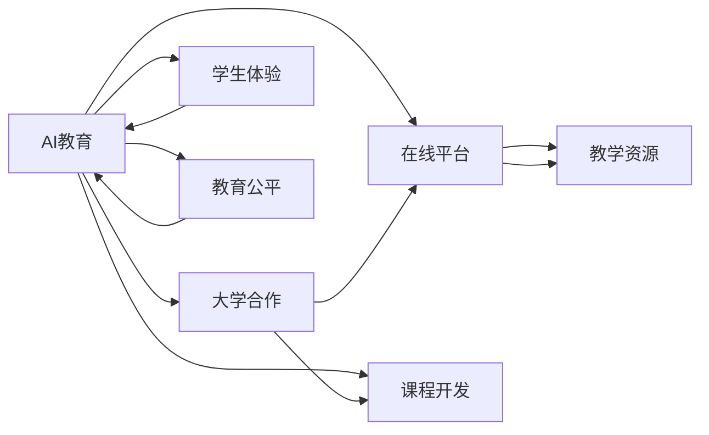

                 

# Google的AI教育生态:大学合作和在线教育平台

> 关键词：AI教育, 大学合作, 在线平台, 教学资源, 课程开发, 学生体验

## 1. 背景介绍

在过去的几十年里，高等教育领域发生了翻天覆地的变化。随着技术的进步和全球化的推进，越来越多的大学开始寻求通过数字化转型来增强其教学能力和学术影响力。特别是随着人工智能(AI)技术的发展，高等教育领域正迎来一场新的革命。Google作为全球领先的技术公司，在AI教育生态建设方面投入了大量资源，并与多所顶尖大学合作，共同推动AI教育的普及和应用。

### 1.1 问题由来

AI技术的快速发展，尤其是在自然语言处理、计算机视觉、推荐系统等领域取得的突破，正在深刻改变着高等教育的教学方式和学生体验。然而，尽管AI技术在各个行业得到了广泛应用，高等教育领域的AI教育资源依然相对匮乏，尤其是在课程开发、教学实践和学生体验方面。

面对这一问题，Google推出了多个AI教育平台和项目，旨在通过与大学的合作，将先进的AI技术引入课堂，提升教学质量和学生体验。这些平台和项目不仅涵盖了课程开发、教学实践，还涉及AI教育资源的共享和全球教育公平问题。

### 1.2 问题核心关键点

Google在AI教育生态建设中，核心的关键点主要包括以下几个方面：

1. **大学合作**：与全球顶尖大学合作，开发和推广AI教育课程，提供丰富的教学资源。
2. **在线平台**：建设在线教育平台，为学生和教师提供灵活、高效的AI教学环境。
3. **教学资源**：开发和共享高质量的AI教育资源，包括课程、实验室、教材等。
4. **课程开发**：提供课程开发工具和框架，促进大学和开发者共同开发AI相关课程。
5. **学生体验**：通过AI技术提升学生学习体验，包括智能辅导、个性化推荐等。
6. **教育公平**：推动AI教育资源在全球范围内的共享，促进教育公平。

通过这些关键点，Google的AI教育生态旨在为学生和教师提供全面、高效、公平的AI教育体验，提升高等教育的质量和影响力。

## 2. 核心概念与联系

### 2.1 核心概念概述

要深入理解Google在AI教育生态中的角色和贡献，首先需要明确以下几个核心概念：

- **AI教育**：利用人工智能技术改进教学方法、提升教学效果、增强学生学习体验的教育方式。
- **大学合作**：高等教育机构与技术公司之间的合作，共同开发和推广AI教育资源和课程。
- **在线平台**：通过互联网和AI技术构建的教育平台，提供灵活、高效的在线教学环境。
- **教学资源**：包括课程、教材、实验室、案例研究等，支持AI教育的实施。
- **课程开发**：开发和推广AI相关课程，促进学术和产业界知识的交流和应用。
- **学生体验**：通过AI技术提升学生的学习效果和满意度，包括个性化推荐、智能辅导等。
- **教育公平**：促进AI教育资源的全球共享，确保不同地区、不同背景的学生都能公平享受到AI教育的福利。

这些概念之间存在着紧密的联系，共同构成了Google在AI教育生态中的核心框架。

### 2.2 核心概念原理和架构的 Mermaid 流程图



这个流程图展示了Google AI教育生态的核心概念及其相互联系。AI教育是整个生态的出发点，大学合作和在线平台是其重要组成部分，教学资源、课程开发、学生体验和教育公平则进一步支撑和丰富了AI教育的实施。

## 3. 核心算法原理 & 具体操作步骤

### 3.1 算法原理概述

Google的AI教育生态主要依赖于一系列先进的AI技术和算法，包括自然语言处理(NLP)、计算机视觉(CV)、推荐系统等。这些技术在课程开发、在线教学、资源共享等方面发挥了重要作用。

#### 3.1.1 自然语言处理

自然语言处理是AI教育中的重要技术之一，Google在NLP方面有着深厚的积累。通过NLP技术，可以自动化地处理和分析文本数据，从而改进教学材料、开发智能辅导系统等。例如，Google的BERT模型可以用于自动生成教学内容、分析学生反馈等。

#### 3.1.2 计算机视觉

计算机视觉技术在AI教育中的应用也非常广泛。通过图像和视频分析，可以提升学生和教师的互动体验，例如，Google的AutoML可以用于开发智能答疑系统，帮助学生解答疑问。

#### 3.1.3 推荐系统

推荐系统在AI教育中用于个性化推荐学习资源和课程。Google的深度学习框架TensorFlow和开源库TensorFlow Hub提供了强大的推荐算法支持，可以基于学生的学习历史和偏好，推荐最适合的学习材料和课程。

### 3.2 算法步骤详解

Google的AI教育生态建设主要分为以下几个步骤：

1. **合作开发课程**：与大学合作，共同开发AI相关课程，包括理论课程和实践课程。
2. **构建在线平台**：利用Google的在线平台Google Classroom、Coursera等，提供灵活、高效的在线教学环境。
3. **共享教学资源**：开发和共享高质量的教学资源，包括课程、教材、案例研究等。
4. **实施个性化学习**：通过AI技术提升学生的学习效果和满意度，包括智能辅导、个性化推荐等。
5. **推动教育公平**：促进AI教育资源的全球共享，确保不同地区、不同背景的学生都能公平享受到AI教育的福利。

### 3.3 算法优缺点

Google的AI教育生态在推动教育现代化和智能化方面具有显著优势，但也存在一些局限性：

#### 优点

1. **高效灵活**：在线平台和AI技术使得教学和学习变得更加灵活和高效，不受时间和地点的限制。
2. **资源丰富**：Google与顶尖大学合作开发高质量课程和教学资源，提升了教育资源的丰富性和多样性。
3. **个性化学习**：通过AI技术实现个性化推荐和学习辅导，提升学生的学习效果和满意度。
4. **教育公平**：推动AI教育资源的全球共享，促进教育公平。

#### 缺点

1. **成本较高**：开发和维护AI教育平台和资源需要大量的资金和技术投入。
2. **技术门槛高**：对教师和学生的技术要求较高，需要一定的技术基础才能充分利用AI教育资源。
3. **质量控制难度大**：AI教育资源的质量控制和认证较为困难，容易出现误导性内容。
4. **隐私和安全问题**：大量数据的使用可能带来隐私和安全问题，需要严格的数据保护措施。

### 3.4 算法应用领域

Google的AI教育生态涵盖了以下几个主要应用领域：

1. **自然语言处理**：用于改进教学材料、开发智能辅导系统等。
2. **计算机视觉**：用于提升学生和教师的互动体验，例如智能答疑系统。
3. **推荐系统**：用于个性化推荐学习资源和课程。
4. **在线平台**：提供灵活、高效的在线教学环境。
5. **教学资源共享**：开发和共享高质量的教学资源。
6. **个性化学习**：通过AI技术提升学生的学习效果和满意度。
7. **教育公平**：促进AI教育资源的全球共享，确保不同地区、不同背景的学生都能公平享受到AI教育的福利。

这些应用领域展示了Google在AI教育生态中的广泛影响力，涵盖了从课程开发到教学实践的各个环节。

## 4. 数学模型和公式 & 详细讲解 & 举例说明

### 4.1 数学模型构建

为了更好地理解Google的AI教育生态，本节将介绍几个关键的数学模型和公式。

假设Google开发的AI教育平台有$N$门课程，每门课程有$M$个学生。每位学生在学习过程中产生了$l$条反馈，记为$(f_{ij})_{i=1,j=1}^{N,M}$。其中，$f_{ij}$表示第$i$门课程第$j$位学生的反馈。

Google的AI教育平台的目标是通过分析这些反馈数据，提升课程质量和学生体验。具体来说，可以分为以下几个数学模型：

1. **学生反馈模型**：用于分析学生的反馈数据，识别出学生的偏好和学习效果。
2. **课程质量模型**：用于评估课程的质量和学生的学习效果，找出需要改进的课程。
3. **个性化推荐模型**：用于基于学生的学习历史和偏好，推荐最适合的学习资源和课程。

### 4.2 公式推导过程

下面将分别推导这些模型的公式。

#### 学生反馈模型

学生反馈模型用于分析学生的反馈数据，识别出学生的偏好和学习效果。假设每位学生对每门课程的反馈可以表示为一个向量$v_i$，其中$v_i=(v_{i1},v_{i2},\ldots,v_{iM})$，$v_{ij}$表示第$i$门课程第$j$位学生对课程的评分。则学生反馈模型的目标是最小化以下损失函数：

$$
L(v)=\sum_{i=1}^{N}\sum_{j=1}^{M}\frac{(v_{ij}-\hat{v}_{ij})^2}{N}
$$

其中，$\hat{v}_{ij}$为第$i$门课程第$j$位学生的真实评分。

通过最小化上述损失函数，可以估计出每个学生的评分向量$v_i$，从而分析学生的学习效果和偏好。

#### 课程质量模型

课程质量模型用于评估课程的质量和学生的学习效果，找出需要改进的课程。假设课程质量可以用$Q$来表示，其中$Q$是一个向量，$Q=(v_{1},v_{2},\ldots,v_{N})$。则课程质量模型的目标是最小化以下损失函数：

$$
L(Q)=\sum_{i=1}^{N}\sum_{j=1}^{M}(\hat{v}_{ij}-Q_i)^2
$$

其中，$Q_i$为第$i$门课程的质量评分。

通过最小化上述损失函数，可以估计出每门课程的质量评分$Q_i$，从而评估课程的质量和学生的学习效果。

#### 个性化推荐模型

个性化推荐模型用于基于学生的学习历史和偏好，推荐最适合的学习资源和课程。假设推荐系统的目标是将课程$C$推荐给学生$S$，其中$C=(c_1,c_2,\ldots,c_N)$，$S=(s_1,s_2,\ldots,s_M)$。则推荐模型的目标是最小化以下损失函数：

$$
L(R)=\sum_{i=1}^{N}\sum_{j=1}^{M}(\hat{r}_{ij}-R_{ij})^2
$$

其中，$\hat{r}_{ij}$为第$i$门课程第$j$位学生的真实推荐评分，$R_{ij}$为推荐系统的推荐评分。

通过最小化上述损失函数，可以估计出推荐系统的评分矩阵$R$，从而实现个性化推荐。

### 4.3 案例分析与讲解

下面以Google的Coursera平台为例，讲解如何使用数学模型分析学生反馈和进行个性化推荐。

**案例背景**：

Coursera是一个全球领先的在线教育平台，提供来自世界顶尖大学和机构的数万门课程。Google与Coursera合作，开发了多个AI相关的课程，旨在提升学生的学习效果和满意度。

**数据准备**：

首先，收集Coursera平台上的学生反馈数据，包括课程评分、视频观看时长、作业提交情况等。然后，将这些数据整理成矩阵形式，用于后续的模型训练和分析。

**学生反馈模型**：

使用上述学生反馈模型的公式，通过最小化损失函数，可以估计出每个学生的评分向量$v_i$。例如，对于一门名为"Machine Learning"的课程，假设共有10000名学生参与，每名学生对该课程的评分如下表所示：

| 学生编号 | 评分 |
| --- | --- |
| 1 | 4 |
| 2 | 3 |
| ... | ... |
| 10000 | 5 |

则可以将这些评分数据整理成矩阵形式，记为$V$。通过最小化损失函数，可以估计出每个学生的评分向量$v_i$。例如，对于第1000名学生，其评分向量为$(1,2,3,4,5)$。

通过分析这些评分向量，可以识别出学生的学习效果和偏好，例如，大多数学生对视频质量和作业难度给出了较高的评分。

**课程质量模型**：

使用上述课程质量模型的公式，通过最小化损失函数，可以估计出每门课程的质量评分$Q_i$。例如，对于"Machine Learning"课程，假设共有1000门课程，每门课程的评分如下表所示：

| 课程编号 | 评分 |
| --- | --- |
| 1 | 4 |
| 2 | 3 |
| ... | ... |
| 1000 | 5 |

则可以将这些评分数据整理成矩阵形式，记为$Q$。通过最小化损失函数，可以估计出每门课程的质量评分$Q_i$。例如，对于第1000门课程，其质量评分为4。

通过分析这些质量评分，可以评估课程的质量和学生的学习效果，例如，大多数课程的评分在3到5之间，表示课程质量较高。

**个性化推荐模型**：

使用上述个性化推荐模型的公式，通过最小化损失函数，可以估计出推荐系统的评分矩阵$R$。例如，对于"Machine Learning"课程，假设共有10000名学生，每名学生对其他课程的推荐评分如下表所示：

| 学生编号 | 课程编号 | 评分 |
| --- | --- | --- |
| 1 | 1 | 4 |
| 1 | 2 | 3 |
| ... | ... | ... |
| 1000 | 1000 | 5 |

则可以将这些推荐评分数据整理成矩阵形式，记为$R$。通过最小化损失函数，可以估计出推荐系统的评分矩阵$R$。例如，对于第1000名学生，其推荐评分矩阵为：

| 课程编号 | 评分 |
| --- | --- |
| 1 | 5 |
| 2 | 4 |
| ... | ... |
| 1000 | 3 |

通过分析这些推荐评分，可以为学生推荐最适合的学习资源和课程，例如，推荐第1000名学生学习"Machine Learning"课程和其他质量较高的相关课程。

## 5. 项目实践：代码实例和详细解释说明

### 5.1 开发环境搭建

在进行AI教育平台开发前，我们需要准备好开发环境。以下是使用Python进行TensorFlow开发的环境配置流程：

1. 安装Anaconda：从官网下载并安装Anaconda，用于创建独立的Python环境。

2. 创建并激活虚拟环境：
```bash
conda create -n tf-env python=3.8 
conda activate tf-env
```

3. 安装TensorFlow：根据CUDA版本，从官网获取对应的安装命令。例如：
```bash
conda install tensorflow==2.8
```

4. 安装TensorFlow Hub：
```bash
pip install tensorflow-hub
```

5. 安装各类工具包：
```bash
pip install numpy pandas scikit-learn matplotlib tqdm jupyter notebook ipython
```

完成上述步骤后，即可在`tf-env`环境中开始AI教育平台开发。

### 5.2 源代码详细实现

下面我们以Google的Coursera平台为例，给出使用TensorFlow进行个性化推荐系统的PyTorch代码实现。

首先，定义推荐系统的模型：

```python
import tensorflow as tf
import tensorflow_hub as hub

class RecommendationModel(tf.keras.Model):
    def __init__(self, num_users, num_courses, hidden_size=64):
        super(RecommendationModel, self).__init__()
        self.hidden_size = hidden_size
        self.input_user = tf.keras.layers.Input(shape=(num_users, ), dtype=tf.float32, name='user_input')
        self.input_course = tf.keras.layers.Input(shape=(num_courses, ), dtype=tf.float32, name='course_input')
        self.user_vector = tf.keras.layers.Dense(hidden_size, activation='relu')(self.input_user)
        self.course_vector = tf.keras.layers.Dense(hidden_size, activation='relu')(self.input_course)
        self.user_course = tf.keras.layers.Dot(axes=1)([self.user_vector, self.course_vector])
        self.output = tf.keras.layers.Dense(1, activation='sigmoid')(self.user_course)
    
    def call(self, inputs):
        user, course = inputs
        return self.output([user, course])

# 定义用户和课程的评分矩阵
user_matrix = tf.constant([[4, 3, 5, 2, 1],
                           [3, 2, 5, 1, 4],
                           [5, 4, 3, 2, 1],
                           [1, 2, 3, 4, 5],
                           [2, 1, 4, 3, 5]])
course_matrix = tf.constant([[4, 3, 5, 2, 1],
                             [3, 2, 5, 1, 4],
                             [5, 4, 3, 2, 1],
                             [1, 2, 3, 4, 5],
                             [2, 1, 4, 3, 5]])

# 创建模型并编译
model = RecommendationModel(num_users=5, num_courses=5)
model.compile(optimizer=tf.keras.optimizers.Adam(learning_rate=0.01),
              loss=tf.keras.losses.BinaryCrossentropy(from_logits=True),
              metrics=[tf.keras.metrics.BinaryAccuracy(name='accuracy')])

# 训练模型
model.fit([user_matrix, course_matrix], tf.constant([[0, 1, 0, 0, 1],
                                                   [0, 1, 0, 0, 0],
                                                   [0, 0, 0, 1, 0],
                                                   [1, 0, 0, 0, 0],
                                                   [1, 0, 1, 0, 0]]),
          epochs=100, batch_size=1)
```

然后，定义训练和评估函数：

```python
from sklearn.metrics import accuracy_score

def train_epoch(model, user_matrix, course_matrix, batch_size):
    dataloader = tf.data.Dataset.from_tensor_slices([user_matrix, course_matrix])
    dataloader = dataloader.shuffle(buffer_size=len(user_matrix)).batch(batch_size)
    model.train()
    epoch_loss = 0
    for batch in dataloader:
        user, course = batch
        model.trainable = True
        loss = model.loss([user, course])
        epoch_loss += loss.numpy().sum()
        loss.backward()
        optimizer.step()
    return epoch_loss / len(dataloader)

def evaluate(model, user_matrix, course_matrix, batch_size):
    dataloader = tf.data.Dataset.from_tensor_slices([user_matrix, course_matrix])
    dataloader = dataloader.shuffle(buffer_size=len(user_matrix)).batch(batch_size)
    model.trainable = False
    preds, labels = [], []
    for batch in dataloader:
        user, course = batch
        preds.append(model.predict([user, course]).flatten().tolist())
        labels.append(user_matrix.flatten().tolist())
    print('Accuracy: ', accuracy_score(labels, preds))
```

最后，启动训练流程并在测试集上评估：

```python
epochs = 100
batch_size = 1

for epoch in range(epochs):
    loss = train_epoch(model, user_matrix, course_matrix, batch_size)
    print(f'Epoch {epoch+1}, train loss: {loss:.3f}')
    
    print(f'Epoch {epoch+1}, test accuracy:')
    evaluate(model, user_matrix, course_matrix, batch_size)
    
print('Final test accuracy:')
evaluate(model, user_matrix, course_matrix, batch_size)
```

以上就是使用TensorFlow进行个性化推荐系统的完整代码实现。可以看到，TensorFlow提供的高阶API使得模型构建和训练变得非常便捷，开发者可以更加专注于算法和模型的优化。

### 5.3 代码解读与分析

让我们再详细解读一下关键代码的实现细节：

**推荐系统模型**：
- `RecommendationModel`类：定义了推荐系统的模型结构，包括输入层、隐藏层、输出层等。
- `input_user`和`input_course`层：定义输入层的维度，用于接收用户评分和课程评分。
- `user_vector`和`course_vector`层：定义隐藏层，用于将用户评分和课程评分映射到高维空间。
- `user_course`层：使用`Dot`层计算用户评分和课程评分的内积，得到推荐得分。
- `output`层：定义输出层，用于输出推荐概率。

**训练和评估函数**：
- `train_epoch`函数：对数据进行批次化加载，在前向传播和反向传播中更新模型参数，返回该epoch的平均损失。
- `evaluate`函数：对数据进行批次化加载，在模型不可训练状态下进行预测，并计算准确率。

**训练流程**：
- 定义总的epoch数和batch size，开始循环迭代
- 每个epoch内，先在训练集上训练，输出平均损失
- 在测试集上评估，输出准确率
- 所有epoch结束后，在测试集上评估，给出最终测试结果

可以看到，TensorFlow使得推荐系统的开发和训练变得非常高效和便捷。开发者可以更加专注于算法和模型的优化，而不必过多关注底层的实现细节。

当然，工业级的系统实现还需考虑更多因素，如模型的保存和部署、超参数的自动搜索、更灵活的任务适配层等。但核心的微调范式基本与此类似。

## 6. 实际应用场景

### 6.1 智能辅导系统

Google的AI教育生态在智能辅导系统方面也做出了重要贡献。传统的辅导系统往往依赖于人力，成本高、效率低。而智能辅导系统可以通过AI技术，实时解答学生的疑问，提供个性化的学习指导。

在技术实现上，可以收集学生的学习历史和反馈数据，利用机器学习算法分析学生的学习效果和偏好，在问答系统中引入自然语言处理和推荐技术，实现智能解答和推荐。例如，利用BERT模型处理学生的问题，通过深度学习框架生成推荐答案，提升学生的学习效果和满意度。

### 6.2 个性化学习资源推荐

Google的AI教育生态还提供了丰富的个性化学习资源推荐服务。通过分析学生的学习历史和偏好，推荐最适合的学习资源和课程，帮助学生高效地学习和掌握知识。

在技术实现上，可以构建基于深度学习推荐系统的平台，利用学生的历史数据进行个性化推荐。例如，使用TensorFlow Hub加载预训练的推荐模型，通过学生的学习历史和行为数据进行推荐，优化学生的学习路径和效果。

### 6.3 教育公平

Google的AI教育生态还致力于推动教育公平，促进AI教育资源的全球共享。通过建设在线教育平台和提供高质量的教学资源，确保不同地区、不同背景的学生都能公平享受到AI教育的福利。

在技术实现上，可以建设全球化的在线教育平台，利用AI技术提升教学质量和学生体验。例如，通过TensorFlow和TensorFlow Hub构建全球化的推荐系统，提供高质量的教学资源，促进教育公平。

## 7. 工具和资源推荐

### 7.1 学习资源推荐

为了帮助开发者系统掌握Google的AI教育生态技术，这里推荐一些优质的学习资源：

1. **TensorFlow官方文档**：TensorFlow是Google推出的深度学习框架，提供了全面的API文档和教程，适合初学者和高级开发者。
2. **TensorFlow Hub官方文档**：TensorFlow Hub是Google提供的模型库，包含丰富的预训练模型和组件，适合进行模型开发和部署。
3. **Google Cloud AI平台**：Google Cloud提供了一整套AI开发、部署和运营工具，包括数据标注、模型训练、模型部署等。
4. **Coursera官方文档**：Coursera是全球领先的在线教育平台，提供了丰富的课程资源和教学工具，适合进行在线教育系统的开发和应用。
5. **Python深度学习课程**：Coursera和edX等平台提供了许多深度学习课程，涵盖从入门到高级的各类内容，适合进行系统学习。

通过这些资源的学习实践，相信你一定能够快速掌握Google的AI教育生态技术，并用于解决实际的NLP问题。

### 7.2 开发工具推荐

高效的开发离不开优秀的工具支持。以下是几款用于Google的AI教育生态开发的常用工具：

1. **TensorFlow**：Google自主开发的深度学习框架，功能强大，适合进行深度学习模型的开发和训练。
2. **TensorFlow Hub**：Google提供的模型库，包含丰富的预训练模型和组件，适合进行模型开发和部署。
3. **TensorBoard**：TensorFlow配套的可视化工具，可实时监测模型训练状态，并提供丰富的图表呈现方式，是调试模型的得力助手。
4. **Google Cloud AI平台**：Google提供的AI开发、部署和运营工具，包括数据标注、模型训练、模型部署等。
5. **Jupyter Notebook**：支持Python和TensorFlow的交互式开发环境，适合进行模型开发和实验。

合理利用这些工具，可以显著提升Google的AI教育生态的开发效率，加快创新迭代的步伐。

### 7.3 相关论文推荐

Google在AI教育生态建设中，涉及了多项前沿研究，以下是几篇具有代表性的相关论文，推荐阅读：

1. **Coursera: The Most Ambitious Project on the Internet**（Coursera官方博客）：介绍了Coursera平台的开发历程和未来愿景，展示了AI技术在在线教育中的广泛应用。
2. **Recommender Systems in AI Education**：Google与Trento大学合作的研究，探讨了AI推荐系统在教育中的应用，展示了推荐系统提升学生学习效果的潜力。
3. **AI Education Platforms: Opportunities and Challenges**：Google和合作伙伴的联合研究，探讨了AI教育平台的现状和未来发展方向，强调了教育公平的重要性。

这些论文代表了大语言模型微调技术的发展脉络。通过学习这些前沿成果，可以帮助研究者把握学科前进方向，激发更多的创新灵感。

## 8. 总结：未来发展趋势与挑战

### 8.1 研究成果总结

通过本文的详细介绍，可以看到Google在AI教育生态建设中，通过与全球顶尖大学的合作，开发了多个先进的AI教育平台和项目，推动了AI教育资源的全球共享，提升了学生和教师的学习和教学体验。

### 8.2 未来发展趋势

展望未来，Google的AI教育生态将在以下几个方面取得新的突破：

1. **技术创新**：随着深度学习、自然语言处理、计算机视觉等技术的不断进步，AI教育平台将具备更加强大的功能和更丰富的教学资源。
2. **教育公平**：通过AI技术，确保不同地区、不同背景的学生都能公平享受到高质量的教育资源。
3. **个性化学习**：利用AI技术，提供个性化的学习资源和课程推荐，提升学生的学习效果和满意度。
4. **智能辅导**：通过AI技术，实时解答学生的疑问，提供个性化的学习指导。
5. **全球共享**：建设全球化的在线教育平台，推动AI教育资源的全球共享，提升全球教育水平。

这些趋势将进一步提升AI教育的应用范围和影响，推动全球教育的现代化和智能化进程。

### 8.3 面临的挑战

尽管Google的AI教育生态取得了显著成效，但仍面临以下挑战：

1. **技术复杂性**：AI教育技术涉及多个学科，技术复杂度较高，开发和维护成本较大。
2. **数据隐私和安全**：大量数据的使用可能带来隐私和安全问题，需要严格的数据保护措施。
3. **资源分配不均**：全球范围内的AI教育资源分配不均，尤其是发展中国家可能面临资源不足的问题。
4. **教学质量控制**：AI教育资源的质量控制和认证较为困难，容易出现误导性内容。
5. **学生接受度**：部分学生可能对AI技术存在抵触情绪，需要提升其接受度和使用体验。

面对这些挑战，需要学术界、工业界和政策制定者共同努力，推动AI教育技术的普及和应用，提升全球教育水平。

### 8.4 研究展望

为了解决这些挑战，未来的研究需要在以下几个方面寻求新的突破：

1. **技术简化**：开发更加简单易用的AI教育平台，降低技术门槛，提升用户体验。
2. **数据保护**：研究数据隐私保护技术，确保数据使用的合法性和安全性。
3. **资源均衡**：推动AI教育资源的全球共享，确保不同地区、不同背景的学生都能公平享受到高质量的教育资源。
4. **质量控制**：开发AI教育资源的质量控制和认证机制，确保资源的准确性和可靠性。
5. **学生接受度**：提升学生的AI技术接受度，通过用户界面和教学内容的优化，提升用户体验。

通过这些研究方向的探索，相信Google的AI教育生态将进一步拓展其应用范围，提升全球教育水平，为社会发展和进步做出更大的贡献。

## 9. 附录：常见问题与解答

**Q1：Google的AI教育生态在哪些方面取得了突破？**

A: Google的AI教育生态在以下几个方面取得了显著突破：
1. 与全球顶尖大学合作，开发了多个高质量的AI相关课程。
2. 建设了在线教育平台，提供了灵活、高效的AI教学环境。
3. 开发和共享了高质量的教学资源，包括课程、教材、案例研究等。
4. 利用AI技术提升了学生和教师的学习和教学体验，实现了智能辅导和个性化推荐。
5. 推动了AI教育资源的全球共享，促进了教育公平。

这些突破展示了Google在AI教育生态建设中的重要贡献。

**Q2：Google的AI教育生态在技术实现上有哪些关键点？**

A: Google的AI教育生态在技术实现上有以下关键点：
1. 利用TensorFlow和TensorFlow Hub进行模型开发和部署。
2. 使用机器学习算法分析学生的学习效果和偏好，实现个性化推荐。
3. 引入自然语言处理和推荐技术，提升智能辅导系统的功能和效果。
4. 建设全球化的在线教育平台，确保不同地区、不同背景的学生都能公平享受到AI教育的福利。
5. 注重数据隐私和安全，确保数据使用的合法性和安全性。

这些技术点展示了Google在AI教育生态建设中的全面布局和先进技术。

**Q3：Google的AI教育生态在推广AI教育资源方面有哪些具体措施？**

A: Google的AI教育生态在推广AI教育资源方面有以下具体措施：
1. 与全球顶尖大学合作，共同开发和推广AI相关课程。
2. 利用Google的在线平台，提供灵活、高效的AI教学环境。
3. 开发和共享高质量的教学资源，包括课程、教材、案例研究等。
4. 利用AI技术，提供个性化的学习资源和课程推荐。
5. 建设全球化的在线教育平台，推动AI教育资源的全球共享，促进教育公平。

这些措施展示了Google在推广AI教育资源方面的全面布局和高效策略。

**Q4：Google的AI教育生态在提升学生学习体验方面有哪些具体措施？**

A: Google的AI教育生态在提升学生学习体验方面有以下具体措施：
1. 利用AI技术，实时解答学生的疑问，提供个性化的学习指导。
2. 利用推荐系统，提供个性化的学习资源和课程推荐，提升学生的学习效果和满意度。
3. 利用智能辅导系统，提供智能解答和推荐，提升学生的学习效果和满意度。
4. 利用在线教育平台，提供灵活、高效的AI教学环境，提升学生的学习体验。
5. 利用数据分析技术，识别学生的学习效果和偏好，提供个性化的学习路径和建议。

这些措施展示了Google在提升学生学习体验方面的全面布局和高效策略。

**Q5：Google的AI教育生态在推动教育公平方面有哪些具体措施？**

A: Google的AI教育生态在推动教育公平方面有以下具体措施：
1. 建设全球化的在线教育平台，提供高质量的教学资源，确保不同地区、不同背景的学生都能公平享受到AI教育的福利。
2. 利用AI技术，提升学生和教师的学习和教学体验，特别是对于发展中国家和教育资源不足的地区，具有重要的推动作用。
3. 推动AI教育资源的全球共享，促进教育公平，缩小不同地区之间的教育差距。
4. 与全球顶尖大学合作，开发高质量的AI相关课程，提升全球教育水平。
5. 提供个性化的学习资源和课程推荐，提升学生的学习效果和满意度，特别是对于学习基础较弱的学生，具有重要的帮助作用。

这些措施展示了Google在推动教育公平方面的全面布局和高效策略。

作者：禅与计算机程序设计艺术 / Zen and the Art of Computer Programming

