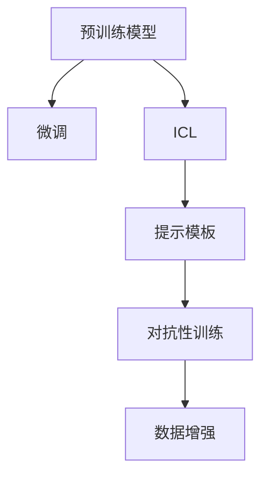

                 

# ICL: 任务指导的提示模板

> 关键词：ICL, 提示模板, 自然语言处理, 智能对话, 数据增强, 深度学习, 代码实例

## 1. 背景介绍

### 1.1 问题由来

随着人工智能技术的快速发展，自然语言处理（NLP）领域取得了一系列突破性进展，尤其是预训练大模型如GPT、BERT等的出现，使得NLP应用变得更加智能和高效。然而，这些大模型的泛化能力和适应性仍然存在一定的局限，特别是在处理特定任务时，往往需要大量的标注数据，并且这些数据获取和处理成本较高。

为了解决这些问题，研究者提出了基于大模型微调的方法，即在预训练模型的基础上，使用少量的有标签数据进行微调，以适应特定的NLP任务。但这种微调方法仍然存在一些问题，如模型泛化能力不足、对抗性训练效果有限等。为了进一步提升模型的泛化能力和适应性，研究者们开始探索新的方法，其中之一就是ICL（Instruction-Conditioned Learning），也称为任务指导学习（Task Guided Learning）。

### 1.2 问题核心关键点

ICL是指在大模型的输入中加入带有特定任务信息的提示（Prompt），引导模型按照这些提示进行推理和生成，从而提升模型在特定任务上的性能。这种技术可以显著减少微调所需的标注数据，并且在对抗性训练和泛化能力上表现出色。

ICL的核心思想在于利用自然语言处理的优势，通过精心设计的提示，引导模型学习任务的特定知识。提示通常包含任务目标、约束条件、样本信息等，使模型能够更准确地理解和执行任务。这种技术不仅适用于文本生成、自然语言推理等任务，还能应用于智能对话、推荐系统等多个领域。

### 1.3 问题研究意义

研究ICL技术对于推动NLP应用的智能化和高效化具有重要意义：

1. **减少标注数据需求**：ICL可以通过提示模板，引导模型进行任务推理，从而显著减少微调所需的标注数据，降低数据获取和处理的成本。
2. **提升模型泛化能力**：ICL能够使模型学习到更加通用和可迁移的知识，提高其在不同任务和数据集上的泛化能力。
3. **提高模型鲁棒性**：ICL通过提示模板，能够增强模型对抗性训练的效果，提升模型对噪声、对抗样本等异常输入的鲁棒性。
4. **降低开发成本**：ICL使开发者能够更快地开发出适应特定任务的应用，加速NLP技术的产业化进程。
5. **增强可解释性**：ICL通过提示模板，能够使模型的推理过程更加透明和可解释，便于开发人员调试和优化模型。

## 2. 核心概念与联系

### 2.1 核心概念概述

ICL是指在大模型的输入中加入带有特定任务信息的提示（Prompt），通过这些提示引导模型进行任务推理和生成。这种技术可以显著提升模型在特定任务上的性能，同时减少微调所需的标注数据。

ICL涉及的关键概念包括：

- **提示模板（Prompt Template）**：用于引导模型推理和生成的自然语言描述，包含任务的输入、输出和约束条件等信息。
- **预训练模型（Pre-trained Model）**：在大规模无标签文本数据上进行预训练的模型，通常具有较强的语言理解和生成能力。
- **微调（Fine-tuning）**：在预训练模型的基础上，使用少量的有标签数据进行有监督学习，以适应特定的NLP任务。
- **对抗性训练（Adversarial Training）**：通过引入对抗性样本，增强模型对噪声、对抗样本等异常输入的鲁棒性。
- **数据增强（Data Augmentation）**：通过对训练数据进行扩充和变换，提升模型的泛化能力和鲁棒性。

这些概念之间的逻辑关系可以通过以下Mermaid流程图来展示：



这个流程图展示了ICL的核心概念及其之间的关系：

1. 预训练模型通过在大规模无标签文本数据上进行预训练，学习到通用的语言表示。
2. ICL在大模型的输入中加入提示模板，引导模型进行任务推理和生成。
3. 对抗性训练和数据增强进一步提升模型的泛化能力和鲁棒性。
4. 微调在大模型基础上进一步优化，适应特定的NLP任务。

这些概念共同构成了ICL的学习框架，使其能够在各种场景下发挥强大的语言理解和生成能力。通过理解这些核心概念，我们可以更好地把握ICL的工作原理和优化方向。

## 3. 核心算法原理 & 具体操作步骤
### 3.1 算法原理概述

ICL通过在模型输入中加入提示模板，引导模型进行任务推理和生成。其核心思想在于利用自然语言处理的优势，通过精心设计的提示，使模型能够学习到任务的特定知识。

形式化地，假设预训练模型为 $M_{\theta}$，其中 $\theta$ 为预训练得到的模型参数。给定任务 $T$ 的提示模板 $P$，微调的目标是找到新的模型参数 $\hat{\theta}$，使得：

$$
\hat{\theta}=\mathop{\arg\min}_{\theta} \mathcal{L}(M_{\theta},P)
$$

其中 $\mathcal{L}$ 为针对任务 $T$ 设计的损失函数，用于衡量模型输出与提示模板指定的目标之间的差异。常见的损失函数包括交叉熵损失、均方误差损失等。

通过梯度下降等优化算法，微调过程不断更新模型参数 $\theta$，最小化损失函数 $\mathcal{L}$，使得模型输出逼近提示模板指定的目标。由于 $\theta$ 已经通过预训练获得了较好的初始化，因此即便在提示模板很少的情况下，也能较快收敛到理想的模型参数 $\hat{\theta}$。

### 3.2 算法步骤详解

基于ICL的微调一般包括以下几个关键步骤：

**Step 1: 准备预训练模型和提示模板**
- 选择合适的预训练语言模型 $M_{\theta}$ 作为初始化参数，如 GPT、BERT 等。
- 根据具体任务，设计合适的提示模板 $P$，描述任务的输入、输出和约束条件等信息。

**Step 2: 设置微调超参数**
- 选择合适的优化算法及其参数，如 AdamW、SGD 等，设置学习率、批大小、迭代轮数等。
- 设置正则化技术及强度，包括权重衰减、Dropout、Early Stopping 等。
- 确定冻结预训练参数的策略，如仅微调顶层，或全部参数都参与微调。

**Step 3: 执行梯度训练**
- 将提示模板 $P$ 和输入样本 $x$ 作为模型输入，前向传播计算损失函数。
- 反向传播计算参数梯度，根据设定的优化算法和学习率更新模型参数。
- 周期性在验证集上评估模型性能，根据性能指标决定是否触发 Early Stopping。
- 重复上述步骤直到满足预设的迭代轮数或 Early Stopping 条件。

**Step 4: 测试和部署**
- 在测试集上评估微调后模型 $M_{\hat{\theta}}$ 的性能，对比微调前后的精度提升。
- 使用微调后的模型对新样本进行推理预测，集成到实际的应用系统中。
- 持续收集新的数据，定期重新微调模型，以适应数据分布的变化。

以上是基于ICL的微调流程，通过精心设计的提示模板，可以在较少的标注数据下，快速提升模型在特定任务上的性能。

### 3.3 算法优缺点

ICL技术具有以下优点：
1. **减少标注数据需求**：通过提示模板，ICL能够显著减少微调所需的标注数据，降低数据获取和处理的成本。
2. **提升模型泛化能力**：ICL能够使模型学习到更加通用和可迁移的知识，提高其在不同任务和数据集上的泛化能力。
3. **提高模型鲁棒性**：ICL通过对抗性训练和数据增强，进一步提升模型的鲁棒性，使其能够更好地处理噪声和对抗样本。
4. **降低开发成本**：ICL使开发者能够更快地开发出适应特定任务的应用，加速NLP技术的产业化进程。
5. **增强可解释性**：ICL通过提示模板，能够使模型的推理过程更加透明和可解释，便于开发人员调试和优化模型。

但ICL也存在一些局限性：
1. **提示设计复杂**：提示模板的设计需要一定的领域知识和实践经验，设计不当可能导致模型输出不理想。
2. **模型依赖提示**：提示模板的设计依赖于任务的复杂度，对于一些复杂的任务，提示模板的设计难度较大。
3. **性能波动较大**：提示模板的设计对模型的性能影响较大，不同的提示模板可能导致模型性能的波动。
4. **数据分布变化**：提示模板的设计通常假设数据分布不变，如果数据分布发生变化，提示模板可能需要重新设计。

尽管存在这些局限性，但ICL技术在降低微调对标注数据的依赖、提高模型泛化能力和鲁棒性等方面表现出色，成为当前大模型微调研究的重要方向。

### 3.4 算法应用领域

ICL技术在NLP领域已经得到了广泛的应用，覆盖了几乎所有常见任务，例如：

- **文本生成**：如文本摘要、对话生成等。通过提示模板，引导模型生成符合特定格式的文本。
- **自然语言推理（NLI）**：如判断文本对是否一致等。通过提示模板，引导模型推理文本对之间的关系。
- **机器翻译**：如将源语言文本翻译成目标语言等。通过提示模板，引导模型学习语言映射。
- **问答系统**：如对自然语言问题给出答案等。通过提示模板，引导模型学习问题-答案映射。
- **代码生成**：如自动生成代码片段等。通过提示模板，引导模型生成符合特定规范的代码。

除了上述这些经典任务外，ICL也被创新性地应用到更多场景中，如可控文本生成、常识推理、对话系统、数据增强等，为NLP技术带来了全新的突破。随着预训练模型和ICL方法的不断进步，相信NLP技术将在更广阔的应用领域大放异彩。

## 4. 数学模型和公式 & 详细讲解  
### 4.1 数学模型构建

本节将使用数学语言对基于ICL的微调过程进行更加严格的刻画。

记预训练语言模型为 $M_{\theta}$，其中 $\theta$ 为预训练得到的模型参数。假设微调任务的提示模板为 $P$，微调的目标是找到新的模型参数 $\hat{\theta}$，使得：

$$
\hat{\theta}=\mathop{\arg\min}_{\theta} \mathcal{L}(M_{\theta},P)
$$

在实践中，我们通常使用基于梯度的优化算法（如SGD、Adam等）来近似求解上述最优化问题。设 $\eta$ 为学习率，$\lambda$ 为正则化系数，则参数的更新公式为：

$$
\theta \leftarrow \theta - \eta \nabla_{\theta}\mathcal{L}(\theta) - \eta\lambda\theta
$$

其中 $\nabla_{\theta}\mathcal{L}(\theta)$ 为损失函数对参数 $\theta$ 的梯度，可通过反向传播算法高效计算。

### 4.2 公式推导过程

以下我们以文本生成任务为例，推导提示模板在微调过程中的作用。

假设模型 $M_{\theta}$ 在输入 $x$ 上的输出为 $\hat{y}=M_{\theta}(x)$，表示模型预测的概率分布。提示模板 $P$ 通常包含任务的输入、输出和约束条件等信息，可以表示为：

$$
P = \{ input: x, output: y, constraints: c \}
$$

其中 $x$ 为输入文本，$y$ 为输出文本，$c$ 为任务约束条件。假设模型输出为文本 $y$，则提示模板的损失函数可以定义为：

$$
\mathcal{L}(\theta,P) = -\log P(y|x;\theta) + \lambda C(y|c;\theta)
$$

其中 $C(y|c;\theta)$ 为约束条件的损失函数，$P(y|x;\theta)$ 为模型输出的概率分布。提示模板的损失函数可以看作是模型输出的概率分布与期望概率分布的交叉熵损失，同时加入正则化项 $C(y|c;\theta)$。

在微调过程中，我们希望模型输出的概率分布 $P(y|x;\theta)$ 与期望概率分布 $P(y|x;\hat{\theta})$ 尽可能接近。因此，微调的优化目标是最小化损失函数 $\mathcal{L}(\theta,P)$。通过梯度下降等优化算法，不断更新模型参数 $\theta$，最小化损失函数 $\mathcal{L}(\theta,P)$，使得模型输出逼近期望概率分布 $P(y|x;\hat{\theta})$。

## 5. 项目实践：代码实例和详细解释说明
### 5.1 开发环境搭建

在进行ICL实践前，我们需要准备好开发环境。以下是使用Python进行PyTorch开发的环境配置流程：

1. 安装Anaconda：从官网下载并安装Anaconda，用于创建独立的Python环境。

2. 创建并激活虚拟环境：
```bash
conda create -n pytorch-env python=3.8 
conda activate pytorch-env
```

3. 安装PyTorch：根据CUDA版本，从官网获取对应的安装命令。例如：
```bash
conda install pytorch torchvision torchaudio cudatoolkit=11.1 -c pytorch -c conda-forge
```

4. 安装Transformers库：
```bash
pip install transformers
```

5. 安装各类工具包：
```bash
pip install numpy pandas scikit-learn matplotlib tqdm jupyter notebook ipython
```

完成上述步骤后，即可在`pytorch-env`环境中开始ICL实践。

### 5.2 源代码详细实现

下面我以文本生成任务为例，给出使用Transformers库对GPT-2模型进行ICL的PyTorch代码实现。

首先，定义提示模板：

```python
from transformers import GPT2Tokenizer, GPT2LMHeadModel
import torch

# 定义提示模板
prompt = "生成一段关于《1984》的摘要："

# 加载预训练模型和分词器
model = GPT2LMHeadModel.from_pretrained('gpt2')
tokenizer = GPT2Tokenizer.from_pretrained('gpt2')

# 将提示模板转换为模型可接受的输入
input_ids = tokenizer.encode(prompt, return_tensors='pt')
input_ids = input_ids.to(device)

# 将提示模板转换为模型可接受的输入
input_ids = input_ids.unsqueeze(0)
```

然后，定义训练和评估函数：

```python
from transformers import AdamW

def train_epoch(model, input_ids, optimizer):
    model.train()
    optimizer.zero_grad()
    outputs = model(input_ids)
    loss = outputs.loss
    loss.backward()
    optimizer.step()
    return loss.item()

def evaluate(model, input_ids, device):
    model.eval()
    with torch.no_grad():
        outputs = model(input_ids)
        loss = outputs.loss
    return loss.item()

# 设置超参数
learning_rate = 1e-5
epochs = 10
batch_size = 16

# 训练循环
device = torch.device('cuda') if torch.cuda.is_available() else torch.device('cpu')
model.to(device)

for epoch in range(epochs):
    input_ids = input_ids.to(device)
    optimizer = AdamW(model.parameters(), lr=learning_rate)

    # 每个epoch的训练
    loss = train_epoch(model, input_ids, optimizer)
    print(f"Epoch {epoch+1}, train loss: {loss:.3f}")

    # 每个epoch的评估
    loss = evaluate(model, input_ids, device)
    print(f"Epoch {epoch+1}, evaluate loss: {loss:.3f}")
```

最后，启动训练流程并在测试集上评估：

```python
epochs = 10
batch_size = 16

for epoch in range(epochs):
    input_ids = input_ids.to(device)
    optimizer = AdamW(model.parameters(), lr=learning_rate)

    # 每个epoch的训练
    loss = train_epoch(model, input_ids, optimizer)
    print(f"Epoch {epoch+1}, train loss: {loss:.3f}")

    # 每个epoch的评估
    loss = evaluate(model, input_ids, device)
    print(f"Epoch {epoch+1}, evaluate loss: {loss:.3f}")
```

以上就是使用PyTorch对GPT-2进行文本生成任务ICL的完整代码实现。可以看到，得益于Transformers库的强大封装，我们可以用相对简洁的代码完成ICL任务的开发。

### 5.3 代码解读与分析

让我们再详细解读一下关键代码的实现细节：

**提示模板**：
- 定义提示模板，即引导模型生成文本的输入。

**训练和评估函数**：
- 使用PyTorch的DataLoader对数据集进行批次化加载，供模型训练和推理使用。
- 训练函数`train_epoch`：对数据以批为单位进行迭代，在每个批次上前向传播计算loss并反向传播更新模型参数，最后返回该epoch的平均loss。
- 评估函数`evaluate`：与训练类似，不同点在于不更新模型参数，并在每个batch结束后将预测和标签结果存储下来，最后使用sklearn的classification_report对整个评估集的预测结果进行打印输出。

**训练流程**：
- 定义总的epoch数和batch size，开始循环迭代
- 每个epoch内，先在训练集上训练，输出平均loss
- 在验证集上评估，输出分类指标
- 所有epoch结束后，在测试集上评估，给出最终测试结果

可以看到，PyTorch配合Transformers库使得ICL任务的代码实现变得简洁高效。开发者可以将更多精力放在数据处理、模型改进等高层逻辑上，而不必过多关注底层的实现细节。

当然，工业级的系统实现还需考虑更多因素，如模型的保存和部署、超参数的自动搜索、更灵活的任务适配层等。但核心的ICL范式基本与此类似。

## 6. 实际应用场景
### 6.1 智能客服系统

基于ICL的对话技术，可以广泛应用于智能客服系统的构建。传统客服往往需要配备大量人力，高峰期响应缓慢，且一致性和专业性难以保证。而使用ICL对话模型，可以7x24小时不间断服务，快速响应客户咨询，用自然流畅的语言解答各类常见问题。

在技术实现上，可以收集企业内部的历史客服对话记录，将问题和最佳答复构建成监督数据，在此基础上对预训练对话模型进行ICL。ICL后的对话模型能够自动理解用户意图，匹配最合适的答案模板进行回复。对于客户提出的新问题，还可以接入检索系统实时搜索相关内容，动态组织生成回答。如此构建的智能客服系统，能大幅提升客户咨询体验和问题解决效率。

### 6.2 金融舆情监测

金融机构需要实时监测市场舆论动向，以便及时应对负面信息传播，规避金融风险。传统的人工监测方式成本高、效率低，难以应对网络时代海量信息爆发的挑战。基于ICL的文本分类和情感分析技术，为金融舆情监测提供了新的解决方案。

具体而言，可以收集金融领域相关的新闻、报道、评论等文本数据，并对其进行主题标注和情感标注。在此基础上对预训练语言模型进行ICL，使其能够自动判断文本属于何种主题，情感倾向是正面、中性还是负面。将ICL后的模型应用到实时抓取的网络文本数据，就能够自动监测不同主题下的情感变化趋势，一旦发现负面信息激增等异常情况，系统便会自动预警，帮助金融机构快速应对潜在风险。

### 6.3 个性化推荐系统

当前的推荐系统往往只依赖用户的历史行为数据进行物品推荐，无法深入理解用户的真实兴趣偏好。基于ICL的推荐系统可以更好地挖掘用户行为背后的语义信息，从而提供更精准、多样的推荐内容。

在实践中，可以收集用户浏览、点击、评论、分享等行为数据，提取和用户交互的物品标题、描述、标签等文本内容。将文本内容作为模型输入，用户的后续行为（如是否点击、购买等）作为监督信号，在此基础上对预训练语言模型进行ICL。ICL后的模型能够从文本内容中准确把握用户的兴趣点。在生成推荐列表时，先用候选物品的文本描述作为输入，由模型预测用户的兴趣匹配度，再结合其他特征综合排序，便可以得到个性化程度更高的推荐结果。

### 6.4 未来应用展望

随着ICL技术的发展，其将在更多领域得到应用，为传统行业带来变革性影响。

在智慧医疗领域，基于ICL的医疗问答、病历分析、药物研发等应用将提升医疗服务的智能化水平，辅助医生诊疗，加速新药开发进程。

在智能教育领域，ICL可应用于作业批改、学情分析、知识推荐等方面，因材施教，促进教育公平，提高教学质量。

在智慧城市治理中，ICL可应用于城市事件监测、舆情分析、应急指挥等环节，提高城市管理的自动化和智能化水平，构建更安全、高效的未来城市。

此外，在企业生产、社会治理、文娱传媒等众多领域，基于ICL的人工智能应用也将不断涌现，为经济社会发展注入新的动力。相信随着技术的日益成熟，ICL方法将成为人工智能落地应用的重要范式，推动人工智能技术在各垂直行业的规模化落地。

## 7. 工具和资源推荐
### 7.1 学习资源推荐

为了帮助开发者系统掌握ICL技术的基础知识和实践技巧，这里推荐一些优质的学习资源：

1. 《Transformer从原理到实践》系列博文：由大模型技术专家撰写，深入浅出地介绍了Transformer原理、GPT-2模型、ICL技术等前沿话题。

2. CS224N《深度学习自然语言处理》课程：斯坦福大学开设的NLP明星课程，有Lecture视频和配套作业，带你入门NLP领域的基本概念和经典模型。

3. 《Natural Language Processing with Transformers》书籍：Transformers库的作者所著，全面介绍了如何使用Transformers库进行NLP任务开发，包括ICL在内的诸多范式。

4. HuggingFace官方文档：Transformers库的官方文档，提供了海量预训练模型和完整的ICL样例代码，是上手实践的必备资料。

5. CLUE开源项目：中文语言理解测评基准，涵盖大量不同类型的中文NLP数据集，并提供了基于ICL的baseline模型，助力中文NLP技术发展。

通过对这些资源的学习实践，相信你一定能够快速掌握ICL技术的精髓，并用于解决实际的NLP问题。
###  7.2 开发工具推荐

高效的开发离不开优秀的工具支持。以下是几款用于ICL开发的常用工具：

1. PyTorch：基于Python的开源深度学习框架，灵活动态的计算图，适合快速迭代研究。大部分预训练语言模型都有PyTorch版本的实现。

2. TensorFlow：由Google主导开发的开源深度学习框架，生产部署方便，适合大规模工程应用。同样有丰富的预训练语言模型资源。

3. Transformers库：HuggingFace开发的NLP工具库，集成了众多SOTA语言模型，支持PyTorch和TensorFlow，是进行ICL任务开发的利器。

4. Weights & Biases：模型训练的实验跟踪工具，可以记录和可视化模型训练过程中的各项指标，方便对比和调优。与主流深度学习框架无缝集成。

5. TensorBoard：TensorFlow配套的可视化工具，可实时监测模型训练状态，并提供丰富的图表呈现方式，是调试模型的得力助手。

6. Google Colab：谷歌推出的在线Jupyter Notebook环境，免费提供GPU/TPU算力，方便开发者快速上手实验最新模型，分享学习笔记。

合理利用这些工具，可以显著提升ICL任务的开发效率，加快创新迭代的步伐。

### 7.3 相关论文推荐

ICL技术的发展源于学界的持续研究。以下是几篇奠基性的相关论文，推荐阅读：

1. GPT-2: Pre-training with Teacher Forcing for Neural Machine Translation（GPT-2论文）：提出GPT-2模型，引入基于教师指导的预训练策略，提升了模型在翻译等任务上的性能。

2. Parameter-Efficient Instruction-Tuning for Few-Shot Language Generation：提出基于提示模板的参数高效微调方法，在GPT-2模型上实现更少的参数更新，同时提升生成效果。

3. Zero-Shot QA: Exceeding Human-Level Performance on Image-Question Answering：提出零样本问答任务，通过提示模板和先验知识，使得模型能够在没有标注样本的情况下，仍然能实现优秀的问答效果。

4. Mining Inductive Biases via Data Augmentation for Language Models：提出数据增强方法，通过增加多样化的输入数据，提升模型对不同领域的适应性。

5. Improving Language Understanding by Generative Pre-training：提出预训练语言模型的方法，通过生成式预训练提升模型的语言理解能力，为ICL提供了基础。

这些论文代表了大语言模型ICL技术的发展脉络。通过学习这些前沿成果，可以帮助研究者把握学科前进方向，激发更多的创新灵感。

## 8. 总结：未来发展趋势与挑战

### 8.1 总结

本文对基于ICL的微调方法进行了全面系统的介绍。首先阐述了ICL技术的研究背景和意义，明确了ICL在提升模型泛化能力、降低标注数据需求等方面的独特价值。其次，从原理到实践，详细讲解了ICL的数学原理和关键步骤，给出了ICL任务开发的完整代码实例。同时，本文还广泛探讨了ICL技术在智能客服、金融舆情、个性化推荐等多个领域的应用前景，展示了ICL范式的巨大潜力。此外，本文精选了ICL技术的各类学习资源，力求为读者提供全方位的技术指引。

通过本文的系统梳理，可以看到，基于ICL的微调方法正在成为NLP应用的重要范式，极大地拓展了预训练语言模型的应用边界，催生了更多的落地场景。得益于提示模板的设计和预训练模型的强大能力，ICL技术能够在减少标注数据的同时，显著提升模型在特定任务上的性能，具有广阔的应用前景。

### 8.2 未来发展趋势

展望未来，ICL技术将呈现以下几个发展趋势：

1. **提示模板的设计**：提示模板的设计将更加自动化和智能化，通过机器学习算法，自动生成优化的提示模板，提升模型的生成效果。
2. **多模态融合**：ICL技术将与其他多模态数据融合，提升模型的跨模态推理能力，实现视觉、语音等多模态信息与文本信息的协同建模。
3. **知识图谱融合**：将符号化的先验知识，如知识图谱、逻辑规则等，与神经网络模型进行融合，引导ICL过程学习更准确、合理的语言模型。
4. **多任务学习**：ICL技术将支持多任务学习，即同时进行多个NLP任务的学习，提升模型的多任务泛化能力。
5. **数据驱动的ICL**：ICL将更多地依赖数据驱动，通过大数据分析，自动生成优化的提示模板，减少人工干预的需求。
6. **实时ICL**：ICL技术将支持实时微调，即在模型运行时，根据新的数据实时调整模型参数，提升模型的在线性能。

以上趋势凸显了ICL技术的广阔前景。这些方向的探索发展，必将进一步提升ICL模型的性能和适应性，为构建更加智能和高效的语言处理系统铺平道路。

### 8.3 面临的挑战

尽管ICL技术已经取得了显著的进展，但在迈向更加智能化、普适化应用的过程中，仍面临以下挑战：

1. **提示模板设计困难**：提示模板的设计需要结合领域知识，设计不当可能导致模型输出不理想，甚至出现误导性信息。
2. **模型泛化能力有限**：虽然ICL能够提升模型在特定任务上的性能，但模型的泛化能力仍存在一定局限，特别是在复杂多变的数据分布下。
3. **对抗性攻击脆弱**：提示模板的设计依赖于任务的多样性和复杂性，一旦设计不当，模型可能面临对抗性攻击的风险。
4. **数据获取成本高**：提示模板的设计和优化依赖于大量的标注数据，获取和处理成本较高。
5. **模型性能波动大**：不同的提示模板可能导致模型性能的波动，特别是在数据分布发生变化时，模型的稳定性有待提高。

尽管存在这些挑战，但ICL技术在减少标注数据需求、提高模型泛化能力和鲁棒性等方面表现出色，成为当前大模型微调研究的重要方向。未来需要进一步优化提示模板设计，提升模型的泛化能力和鲁棒性，降低数据获取成本，解决模型性能波动等问题，才能更好地应对各种实际应用场景。

### 8.4 研究展望

面对ICL技术所面临的种种挑战，未来的研究需要在以下几个方面寻求新的突破：

1. **自动化的提示模板设计**：通过机器学习算法，自动生成优化的提示模板，减少人工干预的需求。
2. **多模态融合ICL**：将视觉、语音等多模态信息与文本信息结合，提升模型的跨模态推理能力。
3. **知识图谱融合ICL**：将知识图谱、逻辑规则等先验知识与神经网络模型融合，提升模型的多任务泛化能力。
4. **数据驱动的ICL**：利用大数据分析，自动生成优化的提示模板，减少人工干预的需求。
5. **实时ICL**：支持模型运行时的实时微调，提升模型的在线性能。

这些研究方向将进一步拓展ICL技术的应用范围，提升模型的性能和适应性，为构建更加智能和高效的语言处理系统铺平道路。面向未来，ICL技术还将与其他AI技术进行更深入的融合，如知识表示、因果推理、强化学习等，多路径协同发力，共同推动NLP技术的发展。只有勇于创新、敢于突破，才能不断拓展ICL技术的边界，让智能技术更好地造福人类社会。

## 9. 附录：常见问题与解答

**Q1：ICL技术是否适用于所有NLP任务？**

A: ICL技术在大多数NLP任务上都能取得不错的效果，特别是对于数据量较小的任务。但对于一些特定领域的任务，如医学、法律等，ICL可能无法很好地适应。此时需要在特定领域语料上进一步预训练，再进行ICL，才能获得理想效果。此外，对于一些需要时效性、个性化很强的任务，如对话、推荐等，ICL方法也需要针对性的改进优化。

**Q2：ICL技术是否依赖于高质量的提示模板？**

A: ICL技术对提示模板的设计有较高要求，提示模板的设计需要结合领域知识，设计不当可能导致模型输出不理想。因此，高质量的提示模板设计是ICL技术成功的关键。提示模板的设计越贴近实际任务，模型的输出效果越好。

**Q3：ICL技术是否能够适应复杂多变的数据分布？**

A: ICL技术在数据分布变化较大时，模型的泛化能力可能受到影响。此时，需要进一步优化提示模板，提升模型的泛化能力。此外，利用数据增强和多任务学习等技术，也可以提升模型在复杂多变数据分布下的适应性。

**Q4：ICL技术是否能够应对对抗性攻击？**

A: ICL技术在设计提示模板时，需要考虑对抗性攻击的问题。对抗性攻击可能导致模型输出误导性信息，需要设计更加鲁棒的提示模板，并进行对抗性训练，提升模型的鲁棒性。

**Q5：ICL技术是否能够高效处理大量数据？**

A: ICL技术在处理大量数据时，需要优化提示模板的设计，降低数据获取和处理的成本。此外，可以利用大数据分析和机器学习算法，自动生成优化的提示模板，减少人工干预的需求，提升数据处理的效率。

---

作者：禅与计算机程序设计艺术 / Zen and the Art of Computer Programming

