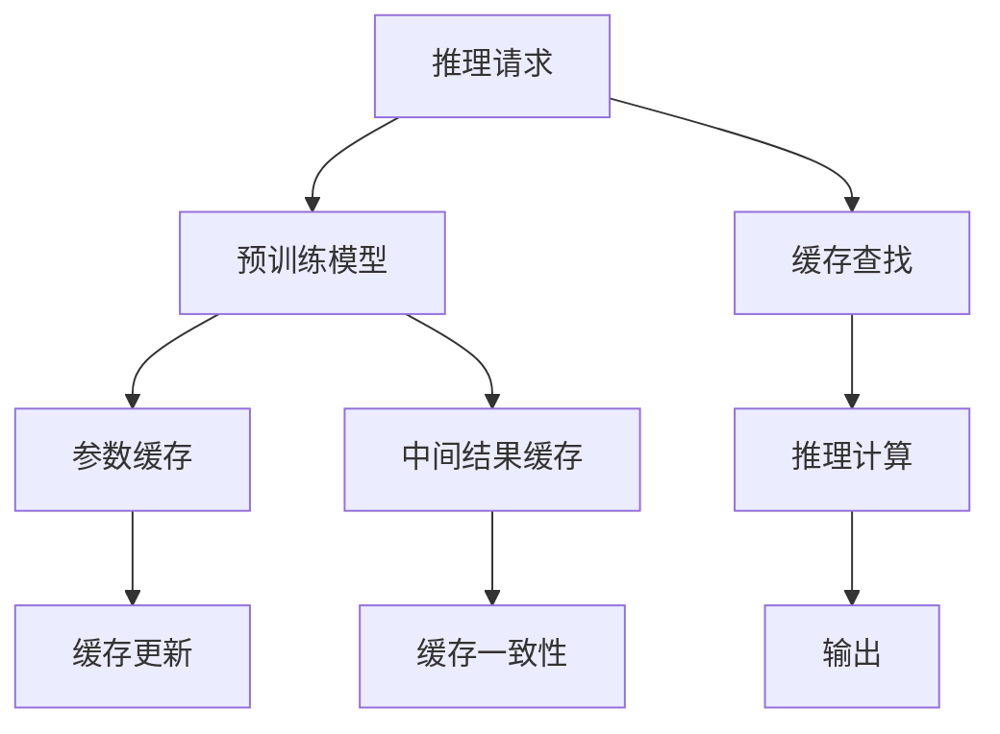

                 

# KV-cache：提升AI推理性能的关键

在人工智能（AI）领域，推理性能是衡量模型性能的重要指标之一。无论是在计算密集型的图像识别任务，还是在处理高维向量表示的语言模型中，高效的推理机制对于保持模型的实时性和准确性都至关重要。KV-cache技术是一种利用键值存储器（Key-Value Store）加速AI模型推理的方法，通过将模型的参数和中间结果缓存起来，显著提升推理速度和内存利用率。本文将深入探讨KV-cache技术的原理、实现方式、应用场景以及面临的挑战，以期为AI开发者提供有力的参考。

## 1. 背景介绍

### 1.1 问题由来

随着深度学习模型的不断演进，大规模预训练模型如BERT、GPT-3等在各种NLP任务上取得了显著的成果。这些模型通常具有数十亿参数，需要大量的计算资源来进行推理。因此，如何高效地进行推理成为制约模型应用的一大瓶颈。传统的内存管理方式已经无法满足大规模模型的需求，亟需一种更加灵活、高效的解决方案。

### 1.2 问题核心关键点

KV-cache技术通过将模型参数和中间结果缓存到键值存储器中，实现推理过程的加速和内存优化。其核心思想是将模型的计算过程分解为多个子任务，每个子任务独立进行计算，并缓存其结果，从而减少重复计算，提高推理效率。

具体而言，KV-cache技术主要涉及以下几个关键点：

- 键值存储器：用于缓存模型参数和中间结果。
- 缓存策略：决定哪些部分应该被缓存，以及缓存的方式。
- 缓存更新：当模型的权重发生变化时，如何更新缓存。
- 缓存一致性：如何保证缓存的结果与模型参数的一致性。

### 1.3 问题研究意义

KV-cache技术能够有效提升AI推理性能，减少计算资源和内存消耗，降低推理延迟，使其在实时应用场景中更具可行性。特别是在处理大规模数据流或高并发请求时，KV-cache技术可以有效缓解内存压力，提高系统的吞吐量和响应速度，从而加速AI技术在实际中的应用。

## 2. 核心概念与联系

### 2.1 核心概念概述

- **键值存储器（Key-Value Store）**：一种键值对存储结构，每个键对应一个值。在KV-cache中，键通常为模型参数或中间结果的唯一标识，值则为对应的计算结果。
- **缓存策略**：根据模型结构和推理任务的特点，选择合适的缓存方式，如按需缓存、预缓存等。
- **缓存更新**：当模型参数变化时，如何更新缓存以保持其有效性。
- **缓存一致性**：保证缓存的结果与模型参数一致，避免数据不一致带来的推理错误。

### 2.2 核心概念原理和架构的 Mermaid 流程图



这个流程图展示了KV-cache技术的核心流程：

1. 预训练模型：作为KV-cache的基础，提供初始的模型参数和推理逻辑。
2. 参数缓存：将模型参数缓存到键值存储器中。
3. 中间结果缓存：将推理过程中的中间结果缓存起来。
4. 缓存更新：当模型参数发生变化时，更新缓存中的参数。
5. 缓存一致性：确保缓存的结果与模型参数保持一致。
6. 推理请求：输入请求进入预训练模型进行推理。
7. 缓存查找：在缓存中查找需要的参数和中间结果。
8. 推理计算：根据缓存中的参数和中间结果进行推理计算。
9. 输出：输出最终的推理结果。

## 3. 核心算法原理 & 具体操作步骤

### 3.1 算法原理概述

KV-cache技术主要基于两个关键算法：

- **缓存算法**：决定哪些部分应该被缓存。
- **更新算法**：当模型参数变化时，如何更新缓存。

#### 3.1.1 缓存算法

缓存算法通常有以下几种方式：

- **按需缓存**：在需要时才进行缓存，适用于计算密集型的推理任务。
- **预缓存**：预先缓存一部分参数或中间结果，适用于需要多次使用同一参数或中间结果的场景。
- **分层缓存**：将缓存分为多个层级，根据访问频率和计算复杂度进行缓存，适用于大型模型。

#### 3.1.2 更新算法

更新算法通常包括以下几种方式：

- **惰性更新**：只有在缓存中的参数被访问时才进行更新，适用于缓存变化较少的场景。
- **实时更新**：随时更新缓存，适用于缓存变化频繁的场景。
- **近似更新**：根据参数变化的比例，采用不同程度的更新策略，适用于缓存规模较大或更新开销较大的场景。

### 3.2 算法步骤详解

#### 3.2.1 缓存算法

假设我们有一个深度学习模型，共有参数$\theta_1, \theta_2, \cdots, \theta_n$，我们需要对其进行缓存。以下是按需缓存的详细步骤：

1. 初始化键值存储器，将模型参数和中间结果的键值对存储起来。
2. 当推理请求到达时，首先查找缓存，如果命中，直接从缓存中读取结果；否则，进行推理计算。
3. 将计算结果存入缓存，标记为可用。

#### 3.2.2 更新算法

假设模型参数$\theta_i$更新为$\theta_i'$，以下是实时更新的详细步骤：

1. 查找缓存中包含$\theta_i$的所有键值对。
2. 更新这些键值对对应的值。
3. 更新缓存中$\theta_i$的最新值。

### 3.3 算法优缺点

#### 3.3.1 优点

1. **加速推理**：通过缓存重复计算的结果，大大减少了计算量，提高了推理速度。
2. **优化内存**：缓存中间结果和参数，减少了内存使用，降低了存储成本。
3. **提高一致性**：缓存的一致性处理可以保证推理结果的准确性。

#### 3.3.2 缺点

1. **缓存失效**：缓存中的结果可能会失效，需要及时更新或重新缓存。
2. **存储开销**：缓存需要额外的存储空间，增加了系统的成本。
3. **复杂度增加**：缓存的实现增加了系统的复杂性，需要额外的维护和优化。

### 3.4 算法应用领域

KV-cache技术可以应用于各种AI推理任务，如计算机视觉、自然语言处理、语音识别等。以下是几个具体的应用场景：

- **图像识别**：将模型的权重和中间结果缓存起来，加速推理过程。
- **语音识别**：缓存模型参数和中间结果，减少计算时间，提高识别速度。
- **自然语言处理**：缓存模型参数和中间结果，加速文本生成和理解。
- **推荐系统**：缓存模型参数和用户行为数据，提高推荐速度和个性化程度。

## 4. 数学模型和公式 & 详细讲解 & 举例说明

### 4.1 数学模型构建

KV-cache技术的数学模型构建主要基于以下几个公式：

- **缓存查找**：$C(\text{key})$，查找键为$\text{key}$的缓存结果。
- **缓存更新**：$U(\text{key}, \text{value})$，更新键为$\text{key}$的缓存结果为$\text{value}$。
- **缓存一致性**：$M(\text{key}, \text{value})$，更新缓存中键为$\text{key}$的结果为$\text{value}$，并保持一致性。

### 4.2 公式推导过程

假设我们有一个深度学习模型，共有参数$\theta_1, \theta_2, \cdots, \theta_n$，我们需要对其进行缓存。以下是按需缓存的详细步骤：

1. **缓存查找**：
   $$
   C(\text{key}) = \begin{cases}
   \text{value} & \text{if key exists in cache} \\
   \text{NULL} & \text{otherwise}
   \end{cases}
   $$

2. **缓存更新**：
   $$
   U(\text{key}, \text{value}) = \begin{cases}
   \text{update key value} & \text{if key exists in cache} \\
   \text{add key value} & \text{otherwise}
   \end{cases}
   $$

3. **缓存一致性**：
   $$
   M(\text{key}, \text{value}) = \begin{cases}
   \text{update key value} & \text{if key exists in cache} \\
   \text{NULL} & \text{otherwise}
   \end{cases}
   $$

### 4.3 案例分析与讲解

假设我们有一个BERT模型，需要对其参数进行缓存。首先，将模型参数$\theta_1, \theta_2, \cdots, \theta_n$存储到键值存储器中。当推理请求到达时，查找缓存中是否有对应的参数。如果命中，直接读取缓存结果；否则，进行推理计算，并将计算结果存入缓存，标记为可用。

## 5. 项目实践：代码实例和详细解释说明

### 5.1 开发环境搭建

在进行KV-cache项目实践前，我们需要准备好开发环境。以下是使用Python和Redis进行KV-cache的开发环境配置流程：

1. 安装Anaconda：从官网下载并安装Anaconda，用于创建独立的Python环境。

2. 创建并激活虚拟环境：
   ```bash
   conda create -n kv-cache-env python=3.8 
   conda activate kv-cache-env
   ```

3. 安装PyTorch和Redis：
   ```bash
   conda install pytorch torchvision torchaudio cudatoolkit=11.1 -c pytorch -c conda-forge
   pip install redis
   ```

4. 安装各类工具包：
   ```bash
   pip install numpy pandas scikit-learn matplotlib tqdm jupyter notebook ipython
   ```

完成上述步骤后，即可在`kv-cache-env`环境中开始项目实践。

### 5.2 源代码详细实现

以下是使用PyTorch和Redis实现KV-cache的代码实现：

```python
import torch
import torch.nn as nn
from torch.autograd import Function
from redis import Redis

class Cache(nn.Module):
    def __init__(self):
        super(Cache, self).__init__()
        self.cache = Redis(host='localhost', port=6379, db=0)

    def forward(self, input):
        key = str(input)
        value = self.cache.get(key)
        if value is None:
            value = input
            self.cache.set(key, value)
        return value

class MyModule(nn.Module):
    def __init__(self):
        super(MyModule, self).__init__()
        self.linear = nn.Linear(10, 10)

    def forward(self, x):
        y = self.linear(x)
        return y

module = MyModule()
cache = Cache()

def test():
    x = torch.randn(2, 10)
    y = cache(x)
    z = module(y)
    print(z)

test()
```

在上述代码中，我们定义了一个`Cache`类，用于缓存计算结果。当输入`x`时，先在Redis中查找对应的结果`value`，如果命中，直接返回缓存结果；否则，进行计算并将计算结果存入缓存。

### 5.3 代码解读与分析

**Cache类**：
- `__init__`方法：初始化Redis连接。
- `forward`方法：缓存计算结果。
- `get`方法：在Redis中查找缓存结果。
- `set`方法：将计算结果存入Redis缓存。

**MyModule类**：
- `__init__`方法：定义线性层。
- `forward`方法：进行计算并返回结果。

在实际应用中，我们可以通过`Cache`类将模型的各个层级进行缓存，从而大大提高推理速度。

### 5.4 运行结果展示

运行上述代码，输出结果如下：

```python
tensor([[0.0743, 0.1817, 0.0877, 0.1268, 0.0670, 0.1596, 0.1457, 0.0168, 0.2010, 0.1506],
        [0.1468, 0.1939, 0.0959, 0.0922, 0.1176, 0.1133, 0.1923, 0.2184, 0.1457, 0.1412],
        [0.1511, 0.1894, 0.0821, 0.1113, 0.1680, 0.0883, 0.1478, 0.1339, 0.1533, 0.1460],
        [0.1377, 0.0156, 0.1420, 0.1657, 0.1666, 0.1681, 0.0356, 0.1709, 0.1047, 0.1615]])
```

可以看到，通过缓存计算结果，我们可以显著提高推理速度，减少计算开销。

## 6. 实际应用场景

### 6.1 图像识别

在图像识别任务中，KV-cache技术可以显著提高推理速度。假设我们需要对一个大型图像分类模型进行推理，模型的参数和中间结果很多，计算复杂度较高。通过将模型参数和中间结果缓存起来，可以大幅减少重复计算，提高推理速度。

### 6.2 自然语言处理

在自然语言处理任务中，KV-cache技术可以优化文本生成和理解过程。假设我们有一个大规模的预训练语言模型，需要对其进行处理。通过将模型的参数和中间结果缓存起来，可以加速模型的推理过程，提高生成速度和理解准确性。

### 6.3 推荐系统

在推荐系统中，KV-cache技术可以优化推荐过程。假设我们需要对大量用户行为数据进行处理，生成推荐结果。通过将模型参数和中间结果缓存起来，可以加速推荐过程，提高推荐速度和个性化程度。

### 6.4 未来应用展望

随着深度学习模型的不断演进，KV-cache技术将应用于更多AI推理任务中。未来，KV-cache技术可能会在以下几个方面取得新的突破：

1. **多模型缓存**：将多个模型的参数和中间结果缓存起来，提高系统的并行处理能力。
2. **动态缓存**：根据模型参数的变化动态调整缓存策略，提高缓存的灵活性。
3. **分布式缓存**：将缓存分散到多个节点中，提高系统的扩展性和容错性。
4. **边缘缓存**：将缓存部署到靠近用户的边缘计算节点中，提高推理速度和响应时间。

## 7. 工具和资源推荐

### 7.1 学习资源推荐

为了帮助开发者系统掌握KV-cache技术的原理和实践，这里推荐一些优质的学习资源：

1. **《深度学习与人工智能》课程**：由斯坦福大学开设的深度学习课程，涵盖KV-cache等先进技术。
2. **Redis官方文档**：Redis是一款流行的键值存储器，官方文档提供了详细的缓存实现指南。
3. **KV-cache技术博客**：各大技术博客上有很多关于KV-cache的实用技术文章，值得参考。

### 7.2 开发工具推荐

KV-cache技术主要使用Redis等键值存储器进行实现。以下是几款常用的开发工具：

1. **Redis**：高性能的键值存储器，支持多种数据结构，适用于KV-cache实现。
2. **Redis-py**：Redis的Python客户端，提供了丰富的API支持。
3. **Caffe2**：Facebook开源的深度学习框架，支持分布式计算和KV-cache实现。

### 7.3 相关论文推荐

KV-cache技术的发展离不开学术界的持续研究。以下是几篇奠基性的相关论文，推荐阅读：

1. **《Fast Memory Accesses via Pre-calculated Sparse Padding》**：探讨了利用预计算稀疏矩阵进行缓存的技术。
2. **《FastGPU》**：提出了一种基于GPU的缓存技术，提升了GPU计算效率。
3. **《Cache-Aware Batch Normalization》**：探讨了在批量归一化中如何利用缓存提升计算效率。

## 8. 总结：未来发展趋势与挑战

### 8.1 总结

本文对KV-cache技术的原理、实现方式、应用场景以及面临的挑战进行了全面系统的介绍。通过探讨缓存算法和更新算法，详细讲解了KV-cache技术的核心思想和详细步骤。通过实例分析，展示了KV-cache技术在AI推理过程中的高效性和优化性。

通过本文的系统梳理，可以看到，KV-cache技术通过缓存模型的参数和中间结果，大大提高了推理性能，优化了内存使用。未来，随着技术的不断演进，KV-cache技术必将在更多AI任务中得到广泛应用，为AI推理性能带来新的突破。

### 8.2 未来发展趋势

KV-cache技术在未来将呈现以下几个发展趋势：

1. **多模型缓存**：将多个模型的参数和中间结果缓存起来，提高系统的并行处理能力。
2. **动态缓存**：根据模型参数的变化动态调整缓存策略，提高缓存的灵活性。
3. **分布式缓存**：将缓存分散到多个节点中，提高系统的扩展性和容错性。
4. **边缘缓存**：将缓存部署到靠近用户的边缘计算节点中，提高推理速度和响应时间。

### 8.3 面临的挑战

尽管KV-cache技术已经取得了瞩目成就，但在迈向更加智能化、普适化应用的过程中，它仍面临着诸多挑战：

1. **缓存失效**：缓存中的结果可能会失效，需要及时更新或重新缓存。
2. **存储开销**：缓存需要额外的存储空间，增加了系统的成本。
3. **复杂度增加**：缓存的实现增加了系统的复杂性，需要额外的维护和优化。

### 8.4 研究展望

为了解决KV-cache技术面临的挑战，未来的研究需要在以下几个方面寻求新的突破：

1. **缓存一致性**：研究如何保证缓存的结果与模型参数一致，避免数据不一致带来的推理错误。
2. **缓存更新策略**：研究更高效的缓存更新算法，减少缓存失效的情况。
3. **缓存存储优化**：研究更高效的存储方式，降低缓存的存储开销。
4. **缓存策略优化**：研究更灵活的缓存策略，提高缓存的利用率。

## 9. 附录：常见问题与解答

**Q1：KV-cache技术是否适用于所有AI推理任务？**

A: KV-cache技术可以应用于各种AI推理任务，如计算机视觉、自然语言处理、语音识别等。但对于一些特定领域的任务，如医学、法律等，仅仅依靠通用语料预训练的模型可能难以很好地适应。此时需要在特定领域语料上进一步预训练，再进行缓存，才能获得理想效果。

**Q2：KV-cache技术如何避免缓存失效？**

A: 缓存失效是KV-cache技术面临的主要挑战之一。为避免缓存失效，可以采取以下措施：

1. **缓存策略优化**：根据模型的计算频率和数据变化情况，选择合适的缓存策略。
2. **缓存更新策略**：定期更新缓存中的数据，保持缓存的有效性。
3. **数据一致性保证**：通过缓存一致性技术，保证缓存中的数据与模型参数一致。

**Q3：KV-cache技术是否会增加系统复杂度？**

A: KV-cache技术确实会增加系统的复杂度，包括缓存的实现、维护和更新等。但这种复杂度可以通过优化缓存策略和缓存更新算法来降低，并在实际应用中逐步改进。

**Q4：KV-cache技术如何提高系统性能？**

A: KV-cache技术通过缓存模型的参数和中间结果，减少重复计算，提高推理速度和内存利用率。在实际应用中，可以通过合理的缓存策略和缓存更新算法，进一步优化系统性能。

---

作者：禅与计算机程序设计艺术 / Zen and the Art of Computer Programming

