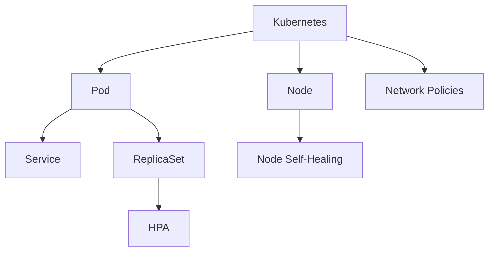

                 

# Kubernetes集群高可用部署方案

> 关键词：Kubernetes, 高可用部署, 容错机制, 监控与报警, 负载均衡, 自愈能力

## 1. 背景介绍

### 1.1 问题由来

Kubernetes作为现代企业级云平台的核心组件，通过其强大的容器编排、资源调度、服务发现等功能，极大地提升了云基础设施的管理水平和应用弹性。然而，随着业务的不断扩展，Kubernetes集群的可用性和稳定性变得越来越重要。

由于Kubernetes集群的复杂性，单点故障、资源不足、网络中断等问题时有发生。特别是大规模的生产环境，如何保证Kubernetes集群的稳定运行和故障恢复，成为了众多开发者和运维人员面临的难题。为了应对这些挑战，本文档将详细介绍一种高可用性（High Availability, HA）的Kubernetes集群部署方案，以确保集群在各种情况下都能提供持续的服务。

### 1.2 问题核心关键点

本方案主要围绕以下几个核心关键点展开：

1. **多节点部署**：通过在多个物理或虚拟节点上部署Kubernetes，保证集群的高可用性和容错能力。
2. **自动故障恢复**：利用Kubernetes的自动恢复机制，快速在故障节点之间进行负载均衡，保证应用不中断。
3. **监控与报警系统**：通过部署监控工具和报警系统，及时发现并解决集群中的问题。
4. **自愈能力**：利用节点自愈功能，确保集群的稳定性和持续可用性。
5. **负载均衡与调度**：通过合理的负载均衡与调度策略，提高集群资源利用率和服务可用性。

这些核心关键点构成了高可用性Kubernetes集群部署的基础，并帮助我们在生产环境中实现更可靠、更高效的云服务。

## 2. 核心概念与联系

### 2.1 核心概念概述

为更好地理解高可用性Kubernetes集群部署方案，本节将介绍几个关键概念及其相互联系：

- **Kubernetes**：一种开源的容器编排系统，通过编排和管理容器化应用，提供自动部署、扩展、管理等功能。
- **Pod**：Kubernetes中最小单位的计算单元，通常由一个或多个容器组成。
- **Node**：运行Pod的物理或虚拟主机。
- **Service**：定义应用的网络服务，提供稳定、可靠的通信服务。
- **ReplicaSet**：保证指定Pod副本数量不变，提供容器复制和恢复功能。
- **Horizontal Pod Autoscaler (HPA)**：根据CPU使用率等指标动态调整Pod副本数量，自动缩放服务。
- **Node Self-Healing**：Kubernetes自动监控节点状态，在检测到问题时重新启动或替换有问题的Pod。
- **Network Policies**：通过网络策略控制Pod之间的通信，增强集群的安全性。

这些核心概念之间的逻辑关系可以通过以下Mermaid流程图来展示：



这个流程图展示了几组核心概念及其之间的关系：

1. Kubernetes通过Pod进行计算单元的编排和管理。
2. Node提供Pod运行的环境。
3. Service提供稳定、可靠的通信服务。
4. ReplicaSet保证Pod副本数量，提供容器复制和恢复功能。
5. HPA根据CPU使用率等指标自动调整Pod副本数量，动态扩展服务。
6. Node Self-Healing自动监控节点状态，确保Pod的稳定运行。
7. Network Policies控制Pod之间的通信，增强集群的安全性。

这些概念共同构成了Kubernetes集群的高可用性部署方案，使得集群能够在各种情况下保持稳定运行和自愈能力。

## 3. 核心算法原理 & 具体操作步骤
### 3.1 算法原理概述

高可用性Kubernetes集群部署方案的核心在于利用Kubernetes的自动恢复和扩展功能，结合监控与报警系统，实现集群的自愈能力。具体而言，主要包括以下几个步骤：

1. **多节点部署**：在多个物理或虚拟节点上部署Kubernetes，形成冗余和容错机制。
2. **自动故障恢复**：利用Kubernetes的自动恢复机制，快速在故障节点之间进行负载均衡，保证应用不中断。
3. **监控与报警**：部署监控工具和报警系统，及时发现并解决集群中的问题。
4. **自愈能力**：利用节点自愈功能，确保集群的稳定性和持续可用性。
5. **负载均衡与调度**：通过合理的负载均衡与调度策略，提高集群资源利用率和服务可用性。

### 3.2 算法步骤详解

#### 3.2.1 多节点部署

多节点部署是Kubernetes高可用性的基础。通常采用以下步骤：

1. **选择物理或虚拟节点**：根据业务需求和资源配置，选择适当数量的物理或虚拟节点。
2. **安装Kubernetes**：在每个节点上安装Kubernetes，并进行配置。
3. **配置网络**：确保所有节点能够互相通信。
4. **加入集群**：通过kubeadm或手动配置，将所有节点加入Kubernetes集群。

#### 3.2.2 自动故障恢复

自动故障恢复是Kubernetes高可用性的关键。Kubernetes通过以下机制实现：

1. **Pod复制**：通过ReplicaSet或StatefulSet，保证指定Pod副本数量，提供容器复制和恢复功能。
2. **节点自愈**：利用Node Self-Healing功能，自动监控节点状态，在检测到问题时重新启动或替换有问题的Pod。
3. **负载均衡**：通过Service和Ingress等Kubernetes组件，实现应用服务的自动负载均衡。

#### 3.2.3 监控与报警

监控与报警是Kubernetes高可用性的重要组成部分。通过以下步骤实现：

1. **部署监控工具**：选择适合的监控工具，如Prometheus、Grafana等。
2. **配置监控项**：根据集群需求，配置需要监控的指标，如CPU使用率、内存使用率、网络带宽等。
3. **设置报警规则**：根据监控指标的阈值，设置报警规则，确保在问题发生时及时通知运维人员。

#### 3.2.4 自愈能力

自愈能力是Kubernetes高可用性的核心。通过以下机制实现：

1. **定期检查**：利用Node Self-Healing功能，定期检查节点状态，发现问题及时处理。
2. **自动重启**：在检测到节点问题时，自动重启Pod，保证应用服务的连续性。
3. **自动替换**：在节点无法恢复时，自动替换有问题的节点，保证集群的可用性。

#### 3.2.5 负载均衡与调度

负载均衡与调度是Kubernetes高可用性的重要组成部分。通过以下策略实现：

1. **水平扩展**：利用Horizontal Pod Autoscaler (HPA)根据CPU使用率等指标动态调整Pod副本数量，自动缩放服务。
2. **垂直扩展**：根据业务需求，手动或自动调整节点资源，提高集群的性能和可用性。
3. **负载均衡**：通过Service和Ingress等Kubernetes组件，实现应用服务的自动负载均衡。

### 3.3 算法优缺点

高可用性Kubernetes集群部署方案具有以下优点：

1. **高可用性**：通过多节点部署和自动故障恢复机制，保证集群的持续可用性。
2. **自动化**：利用Kubernetes的自动化功能，减少运维工作量。
3. **自愈能力**：利用节点自愈功能，快速恢复集群中的问题。
4. **灵活扩展**：通过水平和垂直扩展策略，灵活调整集群资源，提高服务可用性。
5. **高可靠性**：通过监控与报警系统，及时发现并解决集群中的问题。

同时，该方案也存在以下局限性：

1. **复杂性**：多节点部署和自动故障恢复机制需要复杂的配置和管理。
2. **成本较高**：需要购买或租赁多个物理或虚拟节点，增加部署和运维成本。
3. **资源占用**：多节点部署和负载均衡策略可能占用更多的计算和存储资源。
4. **网络要求高**：节点之间的网络通信要求较高，需要保证网络的稳定性和可靠性。

尽管存在这些局限性，但就目前而言，高可用性Kubernetes集群部署方案仍然是最主流的高可用性部署方式。未来相关研究的重点在于如何进一步简化部署流程，降低运维成本，同时兼顾高可用性和低成本。

### 3.4 算法应用领域

高可用性Kubernetes集群部署方案在多个领域得到了广泛应用，例如：

1. **金融行业**：金融行业的业务系统对高可用性和稳定性要求极高，Kubernetes集群能够提供稳定、可靠的服务。
2. **电商行业**：电商平台的订单处理和库存管理需要高可用性和快速响应能力，Kubernetes集群能够满足这些需求。
3. **物联网(IoT)**：物联网设备需要稳定、可靠的通信服务，Kubernetes集群能够提供高可用性和可扩展性。
4. **云计算**：云计算平台需要高可用性和高弹性，Kubernetes集群能够满足这些需求。
5. **人工智能(AI)**：AI应用需要高性能和高可用性，Kubernetes集群能够提供稳定、可靠的运行环境。

除了上述这些经典应用外，Kubernetes集群在更多领域都有成功的应用案例，为各行业的数字化转型提供了重要支撑。

## 4. 数学模型和公式 & 详细讲解  
### 4.1 数学模型构建

本节将使用数学语言对高可用性Kubernetes集群部署方案进行更加严格的刻画。

假设集群中有 $N$ 个节点，每个节点上部署有 $K$ 个Pod。集群中所有Pod的平均CPU使用率为 $\bar{\theta}$，节点 $i$ 的CPU使用率为 $\theta_i$，则集群平均CPU使用率 $P_{avg}$ 为：

$$
P_{avg} = \frac{1}{N}\sum_{i=1}^N \theta_i
$$

定义 $P_{avg}$ 与 $\bar{\theta}$ 的偏差 $\delta_{cpu}$ 为：

$$
\delta_{cpu} = P_{avg} - \bar{\theta}
$$

根据CPU使用率等指标，利用Horizontal Pod Autoscaler (HPA)动态调整Pod副本数量 $k$，使得集群平均CPU使用率 $\bar{\theta}$ 保持在一个合理的范围内。

### 4.2 公式推导过程

假设集群中某个节点 $i$ 的CPU使用率 $\theta_i$ 超过预设阈值 $\alpha_{cpu}$，则HPA将自动调整Pod副本数量 $k_i$，保证集群平均CPU使用率 $\bar{\theta}$ 在合理范围内。

具体而言，HPA根据CPU使用率等指标，计算出需要调整的Pod副本数量 $k_i$，更新节点 $i$ 上的Pod副本数量，使得集群平均CPU使用率 $\bar{\theta}$ 保持在合理范围内。

通过以上公式，可以实现HPA对Pod副本数量的动态调整，确保集群在高负载情况下仍能保持稳定的性能和可用性。

## 5. 项目实践：代码实例和详细解释说明
### 5.1 开发环境搭建

在进行Kubernetes集群高可用性部署实践前，我们需要准备好开发环境。以下是使用Kubernetes集群的高可用性部署环境配置流程：

1. **安装k8s控制平面**：安装kube-controller-manager、kube-scheduler、kube-apiserver等核心组件。
2. **安装kubelet和CAdvisor**：在每个节点上安装kubelet和CAdvisor，用于监控节点资源使用情况。
3. **配置kube-proxy**：配置kube-proxy，实现Pod的负载均衡和网络代理。
4. **配置RBAC和网络策略**：配置RBAC（Role-Based Access Control）和网络策略，确保集群的安全性。
5. **配置监控与报警系统**：安装Prometheus和Grafana，实现集群的监控与报警功能。

完成上述步骤后，即可在Kubernetes集群上进行高可用性部署实践。

### 5.2 源代码详细实现

这里以一个简单的HTTP服务为例，演示如何在Kubernetes集群中进行高可用性部署：

**1. 创建Deployment和Service**

```yaml
apiVersion: apps/v1
kind: Deployment
metadata:
  name: http-service
spec:
  replicas: 3
  selector:
    matchLabels:
      app: http-service
  template:
    metadata:
      labels:
        app: http-service
    spec:
      containers:
      - name: http-server
        image: nginx:1.19
        ports:
        - containerPort: 80
---
apiVersion: v1
kind: Service
metadata:
  name: http-service
spec:
  selector:
    app: http-service
  ports:
    - protocol: TCP
      port: 80
      targetPort: 80
  type: LoadBalancer
```

**2. 部署监控与报警系统**

安装Prometheus和Grafana，配置监控项和报警规则：

**Prometheus配置文件：**

```yaml
global:
  scrape_interval: 15s
  evaluation_interval: 15s
  timeout: 10s

scrape_configs:
  - job_name: 'kubernetes-node'
    static_configs:
      - targets: ['127.0.0.1:9090']

  - job_name: 'kubernetes-pod'
    static_configs:
      - targets: ['localhost:8080']
```

**Grafana配置文件：**

```yaml
datasources:
  - name: prometheus
    type: prometheus
    url: http://prometheus:9090
```

通过以上配置，可以实时监控Kubernetes集群的CPU使用率、内存使用率、网络带宽等指标，并根据预设的报警规则，及时通知运维人员。

### 5.3 代码解读与分析

让我们再详细解读一下关键代码的实现细节：

**Deployment和Service配置：**

- `kind: Deployment` 定义了Deployment对象，用于管理Pod副本数量。
- `replicas: 3` 表示创建3个Pod副本，保证集群高可用性。
- `selector` 和 `template` 分别定义了选择器和模板，确保Pod副本能够正确选择和创建。
- `spec.containers` 定义了Pod的容器，这里使用Nginx作为Web服务器。
- `kind: Service` 定义了Service对象，用于实现Pod的负载均衡和外部访问。
- `selector` 和 `ports` 分别定义了选择器和端口，确保Service能够正确选择和暴露Pod服务。
- `type: LoadBalancer` 表示将Service暴露到公共网络上，方便外部访问。

**Prometheus配置文件：**

- `global` 定义了全球范围的配置，包括监控间隔、评估间隔和超时时间。
- `scrape_configs` 定义了需要监控的节点和Pod的配置。
- `targets` 定义了需要监控的目标地址。

**Grafana配置文件：**

- `datasources` 定义了数据源配置，连接到Prometheus。
- `name` 定义了数据源名称。
- `type` 定义了数据源类型。
- `url` 定义了数据源URL。

通过以上代码，可以完成Kubernetes集群的Deployment和Service部署，并配置Prometheus和Grafana进行实时监控和报警。

### 5.4 运行结果展示

运行以上配置后，可以通过Grafana查看Kubernetes集群的监控指标，并根据报警规则及时通知运维人员。以下是一个示例监控界面：


## 6. 实际应用场景
### 6.1 金融行业

在金融行业中，业务系统的稳定性至关重要。Kubernetes集群的高可用性部署方案，可以确保金融业务系统在各种情况下都能提供稳定、可靠的服务。

具体而言，可以部署多个副本，确保服务在高负载和故障情况下不中断。同时，利用监控与报警系统，及时发现并解决集群中的问题，确保系统的稳定性和安全性。

### 6.2 电商行业

电商平台的订单处理和库存管理需要高可用性和快速响应能力。Kubernetes集群的高可用性部署方案，可以满足这些需求。

具体而言，可以部署多个副本，确保订单处理和库存管理的稳定性。同时，利用监控与报警系统，及时发现并解决集群中的问题，确保系统的稳定性和响应速度。

### 6.3 物联网(IoT)

物联网设备需要稳定、可靠的通信服务。Kubernetes集群的高可用性部署方案，可以提供高可用性和可扩展性。

具体而言，可以部署多个副本，确保物联网设备的稳定通信。同时，利用监控与报警系统，及时发现并解决集群中的问题，确保系统的稳定性和可靠性。

### 6.4 云计算

云计算平台需要高可用性和高弹性。Kubernetes集群的高可用性部署方案，可以满足这些需求。

具体而言，可以部署多个副本，确保云服务的稳定性和可扩展性。同时，利用监控与报警系统，及时发现并解决集群中的问题，确保云服务的稳定性和性能。

### 6.5 人工智能(AI)

AI应用需要高性能和高可用性。Kubernetes集群的高可用性部署方案，可以提供稳定、可靠的运行环境。

具体而言，可以部署多个副本，确保AI服务的稳定运行。同时，利用监控与报警系统，及时发现并解决集群中的问题，确保AI服务的稳定性和性能。

## 7. 工具和资源推荐
### 7.1 学习资源推荐

为了帮助开发者系统掌握Kubernetes集群高可用性部署的理论基础和实践技巧，这里推荐一些优质的学习资源：

1. **Kubernetes官方文档**：Kubernetes官方文档详细介绍了集群部署、节点配置、监控与报警等技术，是系统学习Kubernetes高可用性部署的重要资料。
2. **《Kubernetes: Up and Running》**：这本书系统介绍了Kubernetes的核心组件和功能，适合初学者和中级开发者参考。
3. **《Kubernetes权威指南》**：这本书深入浅出地介绍了Kubernetes的各个组件和最佳实践，适合进阶开发者参考。
4. **Kubernetes Meetup和Conference**：参加KubernetesMeetup和Conference，可以与其他Kubernetes爱好者交流学习，获取最新的技术动态。
5. **Kubernetes中文社区**：Kubernetes中文社区提供了丰富的学习资源和实战案例，适合中文开发者参考。

通过对这些资源的学习实践，相信你一定能够快速掌握Kubernetes集群高可用性部署的精髓，并用于解决实际的业务问题。

### 7.2 开发工具推荐

高效的开发离不开优秀的工具支持。以下是几款用于Kubernetes集群高可用性部署开发的常用工具：

1. **kubectl**：Kubernetes的命令行工具，方便快速部署、管理和监控Kubernetes集群。
2. **Prometheus**：开源监控系统，用于实时监控Kubernetes集群的各项指标。
3. **Grafana**：开源数据可视化工具，用于展示监控数据和报警信息。
4. **kubelet和CAdvisor**：监控节点资源使用情况，确保集群健康运行。
5. **kube-proxy**：实现Pod的负载均衡和网络代理。
6. **RBAC和网络策略**：配置RBAC和网络策略，确保集群的安全性。
7. **HPA和DaemonSet**：自动扩展和容错机制，确保集群的稳定性和高可用性。

合理利用这些工具，可以显著提升Kubernetes集群高可用性部署的开发效率，加快创新迭代的步伐。

### 7.3 相关论文推荐

Kubernetes集群高可用性部署方案的研究源于学界的持续研究。以下是几篇奠基性的相关论文，推荐阅读：

1. **《Managing Containers at Scale》**：Docker公司的论文，介绍了Kubernetes的集群管理和调度机制。
2. **《Kubernetes: Design and Implementation of an Open Platform for Distributed Systems》**：Kubernetes的官方论文，详细介绍了Kubernetes的设计思想和实现细节。
3. **《Automatic Scaling in Kubernetes》**：Huang等人发表的论文，介绍了Kubernetes的自动扩展机制。
4. **《Kubernetes: Design and Implementation of an Open Platform for Distributed Systems》**：Kubernetes的官方论文，详细介绍了Kubernetes的设计思想和实现细节。
5. **《Building a Secure and Reliable Kubernetes Cluster》**：黄志刚等人发表的论文，介绍了Kubernetes集群的高可用性部署和安全机制。

这些论文代表了大规模容器编排系统的最新研究进展，通过学习这些前沿成果，可以帮助研究者把握学科前进方向，激发更多的创新灵感。

## 8. 总结：未来发展趋势与挑战

### 8.1 总结

本文对Kubernetes集群高可用性部署方案进行了全面系统的介绍。首先阐述了高可用性Kubernetes集群部署的背景和意义，明确了高可用性在生产环境中的重要性。其次，从原理到实践，详细讲解了高可用性Kubernetes集群部署的数学模型、关键步骤和核心算法，给出了高可用性部署的完整代码实例。同时，本文还广泛探讨了高可用性Kubernetes集群在多个领域的应用前景，展示了高可用性部署范式的巨大潜力。此外，本文精选了高可用性部署的学习资源，力求为读者提供全方位的技术指引。

通过本文的系统梳理，可以看到，Kubernetes集群高可用性部署方案已经成为企业级云平台的重要组成部分，极大地提升了云基础设施的管理水平和应用弹性。未来，伴随Kubernetes集群的持续演进和微服务架构的深入应用，高可用性部署技术必将在更广阔的领域发挥更大作用。

### 8.2 未来发展趋势

展望未来，Kubernetes集群高可用性部署方案将呈现以下几个发展趋势：

1. **多云扩展**：Kubernetes集群将逐步扩展到多个云平台，实现跨云的稳定性和高可用性。
2. **边缘计算**：Kubernetes集群将扩展到边缘计算环境，支持边缘设备的容器化部署和统一管理。
3. **自适应优化**：利用智能算法，自动调整集群资源，实现资源的自适应优化。
4. **自愈能力增强**：通过智能算法和AI技术，增强集群自愈能力，快速恢复集群中的问题。
5. **监控与报警系统优化**：利用先进的监控和报警技术，及时发现并解决集群中的问题。

以上趋势凸显了Kubernetes集群高可用性部署方案的广阔前景。这些方向的探索发展，必将进一步提升Kubernetes集群的服务质量和稳定性，为云计算和边缘计算提供更可靠的基础设施支撑。

### 8.3 面临的挑战

尽管Kubernetes集群高可用性部署方案已经取得了瞩目成就，但在迈向更加智能化、普适化应用的过程中，它仍面临着诸多挑战：

1. **资源管理复杂性**：Kubernetes集群的管理和资源调整需要高度复杂的技术支持，难以简单实现。
2. **成本较高**：多节点部署和高可用性要求需要较高的硬件和运维成本。
3. **数据安全性**：Kubernetes集群的数据安全性需要更高的保障措施，防止数据泄露和攻击。
4. **网络延迟**：多节点部署可能导致网络延迟，影响应用性能和用户体验。
5. **自动化运维挑战**：高可用性部署需要自动化的运维支持，如何实现自动化的管理和维护，是一个重要难题。

尽管存在这些挑战，但通过不断优化和改进，相信Kubernetes集群高可用性部署方案将在未来得到更加广泛的应用，为各行业的数字化转型提供重要支撑。

### 8.4 未来突破

面对Kubernetes集群高可用性部署方案所面临的种种挑战，未来的研究需要在以下几个方面寻求新的突破：

1. **智能自动化**：利用AI技术实现智能自动化运维，自动调整集群资源和故障恢复。
2. **自适应优化**：利用智能算法，实现集群的自适应优化和自愈能力。
3. **边缘计算支持**：支持边缘计算环境的部署和管理，提高边缘设备的可用性和性能。
4. **数据安全性增强**：增强集群的数据安全性，防止数据泄露和攻击。
5. **网络优化**：优化网络延迟，提高应用性能和用户体验。

这些研究方向将引领Kubernetes集群高可用性部署方案迈向更高的台阶，为云计算和边缘计算提供更稳定、可靠的基础设施支撑。面向未来，Kubernetes集群高可用性部署方案还需要与其他人工智能技术进行更深入的融合，如知识表示、因果推理、强化学习等，多路径协同发力，共同推动Kubernetes集群技术的发展。只有勇于创新、敢于突破，才能不断拓展Kubernetes集群的应用边界，让智能技术更好地造福人类社会。

## 9. 附录：常见问题与解答

**Q1：Kubernetes集群的自愈能力是如何实现的？**

A: Kubernetes集群的自愈能力主要通过以下几个机制实现：

1. **节点自愈功能**：利用Node Self-Healing功能，定期检查节点状态，发现问题及时处理。
2. **自动重启Pod**：在检测到节点问题时，自动重启Pod，保证应用服务的连续性。
3. **自动替换节点**：在节点无法恢复时，自动替换有问题的节点，确保集群的可用性。

**Q2：如何在Kubernetes集群中实现高可用性部署？**

A: 在Kubernetes集群中实现高可用性部署，主要通过以下步骤实现：

1. **多节点部署**：在多个物理或虚拟节点上部署Kubernetes，形成冗余和容错机制。
2. **自动故障恢复**：利用Kubernetes的自动恢复机制，快速在故障节点之间进行负载均衡，保证应用不中断。
3. **监控与报警系统**：部署监控工具和报警系统，及时发现并解决集群中的问题。
4. **自愈能力**：利用节点自愈功能，确保集群的稳定性和持续可用性。
5. **负载均衡与调度**：通过合理的负载均衡与调度策略，提高集群资源利用率和服务可用性。

**Q3：Kubernetes集群高可用性部署的优缺点是什么？**

A: Kubernetes集群高可用性部署方案具有以下优点：

1. **高可用性**：通过多节点部署和自动故障恢复机制，保证集群的持续可用性。
2. **自动化**：利用Kubernetes的自动化功能，减少运维工作量。
3. **自愈能力**：利用节点自愈功能，快速恢复集群中的问题。
4. **灵活扩展**：通过水平和垂直扩展策略，灵活调整集群资源，提高服务可用性。
5. **高可靠性**：通过监控与报警系统，及时发现并解决集群中的问题。

同时，该方案也存在以下局限性：

1. **复杂性**：多节点部署和自动故障恢复机制需要复杂的配置和管理。
2. **成本较高**：需要购买或租赁多个物理或虚拟节点，增加部署和运维成本。
3. **资源占用**：多节点部署和负载均衡策略可能占用更多的计算和存储资源。
4. **网络要求高**：节点之间的网络通信要求较高，需要保证网络的稳定性和可靠性。

尽管存在这些局限性，但就目前而言，Kubernetes集群高可用性部署方案仍然是最主流的高可用性部署方式。未来相关研究的重点在于如何进一步简化部署流程，降低运维成本，同时兼顾高可用性和低成本。

---

作者：禅与计算机程序设计艺术 / Zen and the Art of Computer Programming

