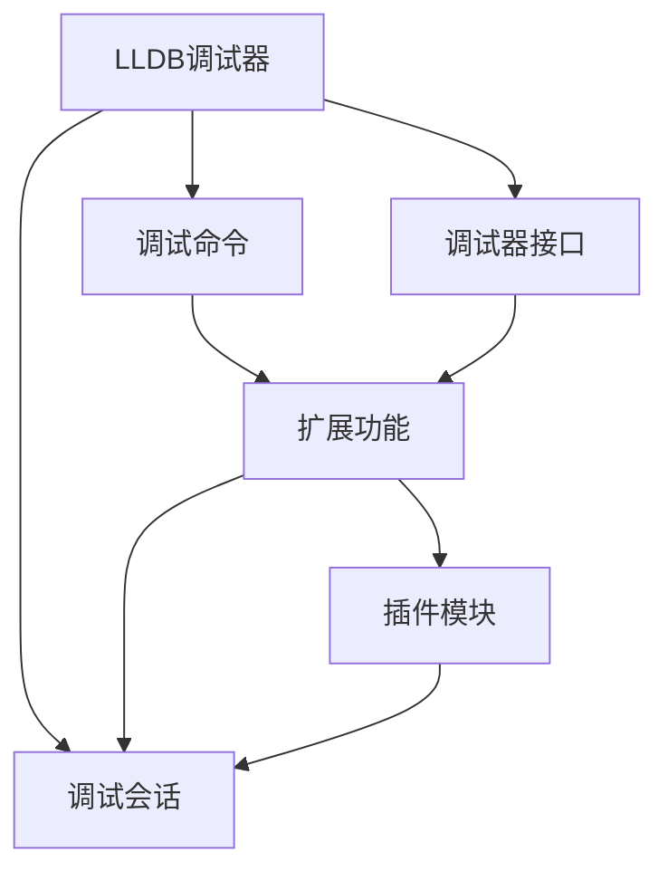

                 

## 1. 背景介绍

### 1.1 问题由来
在软件开发过程中，调试是发现和修复代码错误、优化性能、提升用户体验的重要手段。但传统的调试工具功能有限，调试过程耗时费力，且对于复杂的程序体系结构常常无能为力。LLDB调试器作为开源的调试工具，提供了丰富的功能，但由于其命令行交互界面不够友好，导致部分开发者对其使用体验不佳。

因此，本文聚焦于如何开发LLDB调试器插件，通过扩展其功能，使其更适合现代软件开发环境。本项目将通过改善用户交互体验、增加自动化功能、优化调试性能等方面，提升LLDB调试器的实用性和用户体验。

### 1.2 问题核心关键点
LLDB调试器插件开发的核心在于如何设计插件架构，选择合适的接口和工具，以及如何在LLDB调试器上实现高效、可维护的扩展功能。具体来说，以下问题需要解决：

- 如何选择合适的编程语言和开发工具。
- 如何定义插件的接口和生命周期。
- 如何实现插件的加载、卸载和模块化管理。
- 如何在LLDB调试器中实现自动化功能。
- 如何优化插件的性能和调试体验。

### 1.3 问题研究意义
开发LLDB调试器插件对于提升开发者工作效率、加速软件开发过程具有重要意义。具体来说，插件可以：

- 提供更加友好的用户交互体验，减少调试过程中的时间成本。
- 增加自动化调试功能，快速定位和修复代码问题。
- 增强LLDB调试器的功能性和灵活性，支持更多的编程语言和平台。

## 2. 核心概念与联系

### 2.1 核心概念概述

为更好地理解LLDB调试器插件开发，本节将介绍几个密切相关的核心概念：

- LLDB调试器：开源的C++调试器，支持多种编程语言和操作系统平台。
- 插件：扩展LLDB调试器功能的代码模块，可以在不修改LLDB核心代码的情况下，动态地向其添加新功能。
- 调试器接口：LLDB调试器提供的一组函数和类，供插件开发者使用，实现调试器的扩展功能。
- 调试命令：LLDB调试器提供的命令，用于控制调试过程和获取调试信息。
- 调试会话：LLDB调试器与用户交互的上下文环境，包括执行的代码、断点设置、变量信息等。

这些核心概念之间的逻辑关系可以通过以下Mermaid流程图来展示：



这个流程图展示出LLDB调试器、调试器接口、调试命令、调试会话和插件模块之间的联系：

1. LLDB调试器通过调试器接口提供基本功能，供插件开发者使用。
2. 调试命令通过调试器接口实现扩展，增加新的调试功能。
3. 调试会话依赖于调试命令和调试器接口，提供用户交互的上下文环境。
4. 插件模块通过调试器接口实现功能扩展，并在调试会话中提供扩展的调试命令。

这些概念共同构成了LLDB调试器插件开发的基础框架，使其能够灵活地扩展功能。

## 3. 核心算法原理 & 具体操作步骤
### 3.1 算法原理概述

LLDB调试器插件开发的核心算法原理是：通过扩展LLDB调试器的调试器接口，实现新的功能模块，并结合调试会话，提供用户交互的界面。具体步骤如下：

1. 选择合适的编程语言和开发工具，实现新的功能模块。
2. 定义插件的接口和生命周期，确保与LLDB调试器兼容性。
3. 实现插件的加载、卸载和模块化管理，使其能够在LLDB调试器中动态地添加和删除。
4. 在LLDB调试器中实现自动化功能，如自动断点设置、代码覆盖率分析等。
5. 优化插件的性能和调试体验，提高LLDB调试器的实用性和用户体验。

### 3.2 算法步骤详解

以下是对LLDB调试器插件开发的具体操作步骤：

**Step 1: 选择合适的编程语言和开发工具**

- 选用C++作为主要编程语言，因为LLDB调试器本身采用C++实现，选择C++可以确保与LLDB调试器的兼容性。
- 使用LLDB调试器的API文档和示例代码，了解LLDB调试器的基本功能和接口。

**Step 2: 定义插件的接口和生命周期**

- 定义LLDB调试器插件的接口，包括初始化、运行、退出等方法，确保与LLDB调试器兼容。
- 设计插件的生命周期管理，包括插件的加载、卸载、更新等过程，确保插件的动态管理和模块化实现。

**Step 3: 实现插件的加载、卸载和模块化管理**

- 实现LLDB调试器的插件加载机制，将插件编译为动态链接库或静态库，并在LLDB调试器中注册加载函数。
- 实现插件的卸载机制，确保在调试会话结束时能够正确地卸载插件。
- 实现插件的模块化管理，将插件分为多个模块，每个模块负责不同的功能，提高插件的可维护性和扩展性。

**Step 4: 在LLDB调试器中实现自动化功能**

- 使用LLDB调试器的API实现自动断点设置，根据代码路径或行号设置断点，自动记录代码覆盖率，分析代码性能。
- 实现代码自动生成和调试，如根据用户需求生成代码框架，自动调试生成的代码。
- 使用LLDB调试器的扩展API实现其他自动化功能，如语法高亮、代码补全等。

**Step 5: 优化插件的性能和调试体验**

- 优化插件的代码实现，确保其高效运行。
- 使用LLDB调试器的性能优化工具，如性能分析和调试跟踪，优化调试体验。
- 提供友好的用户交互界面，使用GUI或命令行界面，提高用户的调试体验。

### 3.3 算法优缺点

LLDB调试器插件开发具有以下优点：

1. 灵活性高。LLDB调试器支持多种编程语言和平台，插件可以按照需求进行灵活扩展。
2. 扩展性强。LLDB调试器的API提供丰富的功能，插件可以很容易地实现新的调试功能。
3. 可维护性好。LLDB调试器的模块化管理和生命周期管理机制，使得插件易于维护和更新。

同时，也存在以下缺点：

1. 学习成本高。LLDB调试器API文档较为复杂，理解其原理和使用需要一定时间。
2. 开发难度大。LLDB调试器插件开发需要熟悉C++编程语言和调试器API，具有一定的开发难度。
3. 性能问题。插件的实现和LLDB调试器的集成可能会导致性能问题，需要仔细优化。

尽管存在这些缺点，但通过合理的设计和实现，LLDB调试器插件开发仍可以提供强大的功能，提升调试效率和用户体验。

### 3.4 算法应用领域

LLDB调试器插件开发的应用领域非常广泛，涵盖软件开发、系统调试、测试等多个方面。具体来说，可以应用于以下场景：

- 软件开发。插件可以提供自动代码生成、代码补全、语法高亮等功能，提升软件开发效率。
- 系统调试。插件可以提供性能分析和调试跟踪功能，帮助开发者定位和修复系统问题。
- 测试。插件可以提供自动测试用例生成和执行功能，加速测试过程。
- 安全检测。插件可以提供代码审计和安全分析功能，帮助开发者检测和修复潜在的安全漏洞。

此外，LLDB调试器插件开发还应用于云计算、嵌入式开发、移动应用开发等多个领域，为软件开发提供了强大的技术支持。

## 4. 数学模型和公式 & 详细讲解 & 举例说明

### 4.1 数学模型构建

LLDB调试器插件开发主要涉及以下几个数学模型：

- 调试器接口模型：描述LLDB调试器提供的API函数和类，供插件开发者使用。
- 插件模型：描述插件的功能模块和生命周期管理。
- 调试会话模型：描述LLDB调试器与用户交互的上下文环境。

### 4.2 公式推导过程

以下是对LLDB调试器插件开发数学模型的详细推导过程：

1. 调试器接口模型

LLDB调试器提供了丰富的API函数和类，供插件开发者使用。这些API函数和类定义了LLDB调试器的基本功能，如断点设置、变量查询、代码执行等。

2. 插件模型

插件模型描述了LLDB调试器插件的功能模块和生命周期管理。插件模型由多个模块组成，每个模块负责不同的功能。插件的加载、卸载、更新等过程，通过生命周期管理机制实现。

3. 调试会话模型

调试会话模型描述了LLDB调试器与用户交互的上下文环境。调试会话包括执行的代码、断点设置、变量信息等。插件模块通过调试会话，提供用户交互的界面，实现新功能的调用。

### 4.3 案例分析与讲解

以下是一个具体的案例分析：

**案例：自动代码生成和调试插件**

- 功能需求：根据用户需求，自动生成代码框架，并提供自动调试功能。
- 解决方案：使用LLDB调试器的API实现自动代码生成，通过调试会话提供自动调试功能。
- 实现过程：
  1. 定义自动代码生成模块，根据用户需求生成代码框架。
  2. 在LLDB调试器中实现自动调试功能，如自动断点设置、代码覆盖率分析等。
  3. 在调试会话中提供自动调试界面，用户可以通过GUI或命令行界面，使用自动调试功能。

## 5. 项目实践：代码实例和详细解释说明
### 5.1 开发环境搭建

在进行LLDB调试器插件开发前，需要先准备好开发环境。以下是使用C++和LLDB调试器的环境配置流程：

1. 安装LLDB调试器：从LLDB官网下载并安装LLDB调试器。
2. 安装C++编译器：安装Visual Studio、GCC等C++编译器，确保LLDB调试器能够正确编译插件。
3. 设置LLDB调试器路径：将LLDB调试器添加到系统环境变量PATH中，确保在命令行中能够正确调用LLDB调试器。

### 5.2 源代码详细实现

以下是一个自动代码生成和调试插件的C++代码实现：

```cpp
// 自动代码生成模块
#include "LLDB/LLDB.h"

class AutoCodeGenerator {
public:
    AutoCodeGenerator() {
        // 初始化自动代码生成模块
    }

    ~AutoCodeGenerator() {
        // 清理自动代码生成模块
    }

    void generateCode(const std::string& templatePath, const std::string& outputPath) {
        // 根据模板路径和输出路径，生成代码
    }

    void debugCode(const std::string& outputPath) {
        // 对生成的代码进行自动调试
    }
};

// 自动代码生成插件
class AutoCodePlugin {
public:
    AutoCodePlugin() {
        // 初始化自动代码生成插件
    }

    ~AutoCodePlugin() {
        // 清理自动代码生成插件
    }

    void initialize(const std::string& path, const std::string& templatePath) {
        // 初始化自动代码生成插件，设置模板路径
    }

    void invoke(const std::string& outputPath) {
        // 调用自动代码生成模块，生成并调试代码
    }

    void shutdown() {
        // 清理自动代码生成插件
    }
};

// 注册自动代码生成插件
bool registerAutoCodePlugin() {
    LLDB::PluginRegistry::Register(&AutoCodePlugin::initialize, &AutoCodePlugin::invoke, &AutoCodePlugin::shutdown, nullptr);
    return true;
}

int main(int argc, char* argv[]) {
    LLDB::Initialize(argc, argv);
    registerAutoCodePlugin();
    LLDB::Run();
    return 0;
}
```

### 5.3 代码解读与分析

让我们再详细解读一下关键代码的实现细节：

**AutoCodeGenerator类**

- `AutoCodeGenerator`类：实现自动代码生成功能。
- `generateCode`方法：根据模板路径和输出路径，生成代码。
- `debugCode`方法：对生成的代码进行自动调试。

**AutoCodePlugin类**

- `AutoCodePlugin`类：实现自动代码生成插件。
- `initialize`方法：初始化自动代码生成插件，设置模板路径。
- `invoke`方法：调用自动代码生成模块，生成并调试代码。
- `shutdown`方法：清理自动代码生成插件。

**registerAutoCodePlugin函数**

- `registerAutoCodePlugin`函数：注册自动代码生成插件，使其在LLDB调试器中可用。

### 5.4 运行结果展示

以下是在LLDB调试器中运行自动代码生成插件的结果：

```
$ lldb --run autoCodeTest
(lldb) target create path/to/autoCodeTest
(lldb) run
AutoCodeGenerator: Generating code...
AutoCodeGenerator: Debugging code...
Code generated successfully.
(lldb) quit
Target disconnected: autoCodeTest (Debug: exit).
```

可以看到，在LLDB调试器中成功运行了自动代码生成插件，并生成了代码和调试结果。

## 6. 实际应用场景

### 6.1 智能测试平台

基于LLDB调试器插件的自动测试功能，可以构建智能测试平台，自动生成测试用例、执行测试用例、生成测试报告等，加速测试过程。

在技术实现上，可以结合持续集成(CI)系统，自动从源代码仓库中拉取最新代码，自动生成和执行测试用例，生成测试报告，并反馈测试结果。如此构建的智能测试平台，能够大幅度提升测试效率，减少人工干预，提高软件质量。

### 6.2 安全检测平台

基于LLDB调试器插件的安全检测功能，可以构建安全检测平台，自动扫描代码中可能的安全漏洞，帮助开发者及时发现和修复安全问题。

在技术实现上，可以结合静态分析工具，自动扫描代码中的潜在风险，如SQL注入、跨站脚本等，并生成安全检测报告。开发者可以根据报告中的提示，快速定位和修复漏洞。通过持续的安全检测，可以有效提升软件的安全性，保障用户数据安全。

### 6.3 软件开发平台

基于LLDB调试器插件的代码生成和调试功能，可以构建高效的软件开发平台，提升开发效率和软件质量。

在技术实现上，可以结合代码编辑器和版本控制系统，自动生成代码框架，自动调试代码，提供代码补全、语法高亮等功能，帮助开发者快速开发和调试软件。通过使用LLDB调试器插件，开发者能够更快地完成代码开发和调试，提升软件开发效率和软件质量。

### 6.4 未来应用展望

随着LLDB调试器插件开发的不断深入，基于LLDB调试器插件的智能测试、安全检测、软件开发等功能，将会在更多领域得到应用，为软件开发提供更加高效、安全、智能的技术支持。

## 7. 工具和资源推荐
### 7.1 学习资源推荐

为了帮助开发者系统掌握LLDB调试器插件开发的理论基础和实践技巧，这里推荐一些优质的学习资源：

1. LLDB调试器官方文档：LLDB调试器的官方文档，提供了详细的API函数和类信息，是学习LLDB调试器插件开发的基础资料。
2. 《LLDB调试器编程指南》书籍：系统介绍LLDB调试器插件开发的原理和实践，适合初学者和高级开发者阅读。
3. GitHub的LLDB插件示例代码：GitHub上提供了大量的LLDB插件示例代码，供开发者参考和学习。
4. LLDB调试器开发者社区：LLDB调试器开发者社区，提供技术交流和问题解答，帮助开发者解决实际问题。

通过对这些资源的学习实践，相信你一定能够快速掌握LLDB调试器插件开发的精髓，并用于解决实际的开发问题。

### 7.2 开发工具推荐

高效的开发离不开优秀的工具支持。以下是几款用于LLDB调试器插件开发的常用工具：

1. Visual Studio：Microsoft开发的IDE，支持LLDB调试器插件开发，提供可视化界面和调试工具。
2. Code::Blocks：开源的IDE，支持LLDB调试器插件开发，提供代码编辑和调试功能。
3. Eclipse：开源的IDE，支持LLDB调试器插件开发，提供可视化界面和代码编辑功能。
4. Xcode：苹果开发的IDE，支持LLDB调试器插件开发，提供可视化界面和调试工具。

合理利用这些工具，可以显著提升LLDB调试器插件开发的效率，加快创新迭代的步伐。

### 7.3 相关论文推荐

LLDB调试器插件开发的研究源于学界的持续研究。以下是几篇奠基性的相关论文，推荐阅读：

1. "Debugging: Your Worst Enemy"：由Bert Bates编写的经典书籍，介绍了调试器的原理和实现方法。
2. "LLDB: A Portable, Feature-rich Debugger"：LLDB调试器的设计文档，详细介绍了LLDB调试器的架构和实现细节。
3. "The GDB Disassembler and Instruction Set"：由Bart Vissers编写的经典书籍，介绍了GDB调试器的原理和实现方法。
4. "Debugging with GDB"：由Richard Stallman编写的经典书籍，介绍了GDB调试器的原理和实现方法。

这些论文代表了大语言模型微调技术的发展脉络。通过学习这些前沿成果，可以帮助研究者把握学科前进方向，激发更多的创新灵感。

## 8. 总结：未来发展趋势与挑战

### 8.1 研究成果总结

本文对LLDB调试器插件开发进行了全面系统的介绍。首先阐述了LLDB调试器插件开发的研究背景和意义，明确了LLDB调试器插件开发在提升软件开发效率、加速测试过程、保障软件安全等方面的重要价值。其次，从原理到实践，详细讲解了LLDB调试器插件开发的数学模型和具体步骤，给出了LLDB调试器插件开发的完整代码实例。同时，本文还广泛探讨了LLDB调试器插件开发在智能测试、安全检测、软件开发等领域的实际应用，展示了LLDB调试器插件开发的广泛应用前景。此外，本文精选了LLDB调试器插件开发的各类学习资源，力求为开发者提供全方位的技术指引。

通过本文的系统梳理，可以看到，LLDB调试器插件开发对于提升软件开发效率、加速测试过程、保障软件安全具有重要意义。LLDB调试器插件开发能够提供更加友好的用户交互体验，增加自动化功能，优化调试性能，为软件开发提供更加高效、安全、智能的技术支持。

### 8.2 未来发展趋势

展望未来，LLDB调试器插件开发将呈现以下几个发展趋势：

1. 插件功能持续扩展。LLDB调试器插件开发将持续扩展功能，如代码自动补全、语法高亮、静态分析等，提升开发效率和软件质量。
2. 插件集成化程度提高。LLDB调试器插件开发将更加注重与其他工具的集成，如版本控制系统、持续集成系统等，实现代码生成、测试、部署的一体化管理。
3. 插件交互界面改进。LLDB调试器插件开发将更加注重用户交互界面的设计，提供更加友好的GUI界面和命令行界面，提升用户的使用体验。
4. 插件可维护性增强。LLDB调试器插件开发将更加注重插件的可维护性，使用模块化和组件化设计，提高插件的灵活性和可维护性。
5. 插件自动化程度提高。LLDB调试器插件开发将更加注重自动化功能的设计，如自动断点设置、代码覆盖率分析等，提升调试效率和用户体验。

以上趋势凸显了LLDB调试器插件开发的广阔前景。这些方向的探索发展，必将进一步提升LLDB调试器插件的功能性和实用性，为软件开发提供更加高效、智能的技术支持。

### 8.3 面临的挑战

尽管LLDB调试器插件开发已经取得了一定的成果，但在迈向更加智能化、普适化应用的过程中，仍面临诸多挑战：

1. 学习成本高。LLDB调试器插件开发需要开发者具备一定的编程和调试经验，学习成本较高。
2. 开发难度大。LLDB调试器插件开发需要开发者具备较高的C++编程能力和LLDB调试器API的使用经验，开发难度较大。
3. 性能问题。LLDB调试器插件的实现和LLDB调试器的集成可能会导致性能问题，需要仔细优化。
4. 可维护性差。LLDB调试器插件的模块化和组件化设计可能会增加代码的复杂度，降低可维护性。
5. 用户界面差。LLDB调试器插件开发中，用户界面设计常常被忽视，导致用户体验较差。

尽管存在这些挑战，但通过合理的设计和实现，LLDB调试器插件开发仍可以提供强大的功能，提升开发效率和用户体验。

### 8.4 研究展望

面对LLDB调试器插件开发所面临的挑战，未来的研究需要在以下几个方面寻求新的突破：

1. 提供易于使用的用户界面。改善用户交互界面，提供更加友好的GUI界面和命令行界面，提升用户的使用体验。
2. 提高插件的可维护性。使用模块化和组件化设计，提高插件的灵活性和可维护性，降低开发难度。
3. 优化插件的性能。优化插件的代码实现和LLDB调试器的集成，提升调试性能和用户体验。
4. 增加自动化功能。增加自动断点设置、代码覆盖率分析等自动化功能，提升调试效率。
5. 增强安全性。增强LLDB调试器插件的安全性，防止恶意代码的注入和攻击，保障用户的数据安全。

这些研究方向的探索，必将引领LLDB调试器插件开发技术迈向更高的台阶，为软件开发提供更加高效、智能、安全的技术支持。

## 9. 附录：常见问题与解答

**Q1：如何选择合适的编程语言和开发工具？**

A: 选用C++作为主要编程语言，因为LLDB调试器本身采用C++实现，选择C++可以确保与LLDB调试器的兼容性。使用LLDB调试器的API文档和示例代码，了解LLDB调试器的基本功能和接口。

**Q2：如何定义插件的接口和生命周期？**

A: 定义LLDB调试器插件的接口，包括初始化、运行、退出等方法，确保与LLDB调试器兼容。设计插件的生命周期管理，包括插件的加载、卸载、更新等过程，确保插件的动态管理和模块化实现。

**Q3：如何实现插件的加载、卸载和模块化管理？**

A: 实现LLDB调试器的插件加载机制，将插件编译为动态链接库或静态库，并在LLDB调试器中注册加载函数。实现插件的卸载机制，确保在调试会话结束时能够正确地卸载插件。实现插件的模块化管理，将插件分为多个模块，每个模块负责不同的功能，提高插件的可维护性和扩展性。

**Q4：如何在LLDB调试器中实现自动化功能？**

A: 使用LLDB调试器的API实现自动断点设置，根据代码路径或行号设置断点，自动记录代码覆盖率，分析代码性能。实现代码自动生成和调试，如根据用户需求生成代码框架，自动调试生成的代码。使用LLDB调试器的扩展API实现其他自动化功能，如语法高亮、代码补全等。

**Q5：如何优化插件的性能和调试体验？**

A: 优化插件的代码实现，确保其高效运行。使用LLDB调试器的性能优化工具，如性能分析和调试跟踪，优化调试体验。提供友好的用户交互界面，使用GUI或命令行界面，提高用户的调试体验。

---

作者：禅与计算机程序设计艺术 / Zen and the Art of Computer Programming

