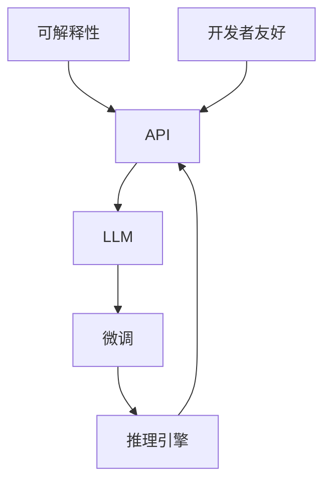

                 

# LLM API设计：构建易用且强大的AI接口

> 关键词：API设计, 自然语言处理, 语言模型, 可解释性, 接口优化, 推理引擎, 开发者友好

## 1. 背景介绍

### 1.1 问题由来
随着人工智能技术的迅猛发展，语言模型大模型（LLMs, Large Language Models）已经成为自然语言处理（NLP）领域的一个重要方向。这类模型通过在大规模无标注数据上预训练，能够学习到广泛的自然语言知识和规律，并在下游任务中通过微调得到显著提升。

在实际应用中，大模型接口的设计需要考虑易用性、性能和可解释性等多个方面。然而，目前大多数大模型的API设计并不完善，难以满足开发者快速开发、模型性能优化以及结果解释的需求。因此，构建一个易用且强大的LLM API成为当前研究的热点问题。

### 1.2 问题核心关键点
构建一个易用且强大的LLM API的核心在于以下几个方面：

- **易用性**：API需要提供简洁明了的接口，方便开发者快速上手并使用。
- **性能优化**：接口需要能够高效地处理输入数据，并输出高质量的结果。
- **可解释性**：API需要能够提供模型推理过程的详细解释，帮助开发者理解模型决策。
- **扩展性**：API需要支持多种任务和场景，并能够方便地添加新功能。
- **安全性和隐私保护**：API需要保证输入数据的保密性，并确保模型推理过程不会泄露用户隐私。

本文将从易用性、性能优化、可解释性和安全性等多个角度，探讨如何构建易用且强大的LLM API。

## 2. 核心概念与联系

### 2.1 核心概念概述

为了更好地理解LLM API的设计，本节将介绍几个关键的概念：

- **API (Application Programming Interface)**：应用程序编程接口，是软件组件之间的通信协议。
- **LLM (Large Language Model)**：大语言模型，指通过预训练学习到广泛自然语言知识和规律的深度学习模型。
- **微调（Fine-tuning）**：在预训练模型的基础上，通过下游任务的标注数据，进一步优化模型性能。
- **推理引擎**：用于执行模型推理计算的软件组件，负责处理输入数据并输出结果。
- **可解释性**：模型能够提供推理过程的详细解释，帮助用户理解模型决策的能力。
- **开发者友好**：API需要满足开发者的需求，提供易用、高效的开发环境。

这些核心概念通过以下Mermaid流程图来展示：



这个流程图展示了API与大语言模型的关系，以及微调、推理引擎、可解释性和开发者友好性的作用。

## 3. 核心算法原理 & 具体操作步骤
### 3.1 算法原理概述

LLM API的设计需要结合多种算法原理，包括自然语言处理、深度学习、推理引擎等。其核心思想是：将大语言模型封装在API中，通过接口提供模型推理服务，同时支持多种任务和优化算法。

API的设计需要考虑以下几个方面：

- **输入数据的预处理**：将输入数据转换为模型能够处理的格式。
- **模型的推理计算**：在推理引擎中执行模型推理，计算出输出结果。
- **结果的后处理**：对模型输出结果进行后处理，提供易用的API接口。

### 3.2 算法步骤详解

#### 3.2.1 输入数据预处理

输入数据预处理是LLM API设计的重要环节，主要包括以下步骤：

1. **文本分词**：将输入文本按照语言规则进行分词，得到分词序列。
2. **编码转换**：将分词序列转换为模型所需的编码格式，如BERT中的BOS/EOS符号。
3. **长度截断和填充**：将输入序列截断或填充至模型所需的长度，确保输入数据格式一致。
4. **添加特殊标记**：添加特殊标记，如BERT中的[CLS]、[SEP]等，帮助模型理解输入数据。

#### 3.2.2 模型的推理计算

模型的推理计算是LLM API设计的核心部分，主要包括以下步骤：

1. **模型加载**：将预训练的大语言模型加载到推理引擎中。
2. **前向传播**：将预处理后的输入数据传递给模型，计算出模型输出。
3. **后向传播**：在需要的情况下，进行后向传播计算梯度，进行参数更新（通常为微调过程）。

#### 3.2.3 结果的后处理

结果的后处理是将模型输出转换为API接口的一部分，主要包括以下步骤：

1. **解码**：将模型输出解码为文本，去除特殊标记和分隔符。
2. **过滤**：根据任务需求，过滤掉无用的输出结果。
3. **格式化**：将处理后的输出格式化为API接口的指定格式。

### 3.3 算法优缺点

#### 3.3.1 优点

1. **易用性**：API提供了简洁明了的接口，开发者可以轻松上手并使用。
2. **高性能**：API集成了推理引擎，能够高效地处理输入数据并输出结果。
3. **可扩展性**：API支持多种任务和场景，并能够方便地添加新功能。
4. **可解释性**：API能够提供模型推理过程的详细解释，帮助开发者理解模型决策。
5. **安全性**：API能够保证输入数据的保密性，并确保模型推理过程不会泄露用户隐私。

#### 3.3.2 缺点

1. **复杂度**：API需要处理多种任务和场景，设计复杂。
2. **性能瓶颈**：在大规模数据上，推理计算可能会成为性能瓶颈。
3. **可解释性不足**：复杂模型推理过程难以完全解释。
4. **资源消耗大**：大规模语言模型的推理计算资源消耗较大。

### 3.4 算法应用领域

LLM API可以应用于多种领域，包括但不限于：

1. **自然语言处理**：文本分类、命名实体识别、机器翻译等任务。
2. **智能客服**：自动问答、智能对话等应用。
3. **信息检索**：文本摘要、信息抽取等任务。
4. **自动摘要**：自动生成新闻、文章摘要等。
5. **语音识别**：语音转文本、文本转语音等任务。
6. **智能推荐**：个性化推荐、商品推荐等。

## 4. 数学模型和公式 & 详细讲解 & 举例说明

### 4.1 数学模型构建

在LLM API的设计中，我们通常会使用以下数学模型：

1. **输入数据的表示**：将输入数据转换为模型所需的向量表示，如BERT中的[CLS]表示整个句子的向量。
2. **模型的前向传播**：计算模型的输出，通常使用矩阵乘法和非线性激活函数。
3. **模型的后向传播**：计算模型的梯度，用于参数更新。

### 4.2 公式推导过程

以BERT模型为例，其前向传播和后向传播的公式如下：

**前向传播**：

$$
H = \text{BERT}_{\theta}(x)
$$

其中，$x$ 是输入数据，$H$ 是模型的输出向量表示，$\theta$ 是模型参数。

**后向传播**：

$$
\frac{\partial \mathcal{L}}{\partial \theta} = \frac{\partial \mathcal{L}}{\partial H} \frac{\partial H}{\partial \theta}
$$

其中，$\mathcal{L}$ 是损失函数，$H$ 是模型输出，$\theta$ 是模型参数。

### 4.3 案例分析与讲解

以命名实体识别（NER）任务为例，可以使用BERT进行微调。其模型结构如下：

1. **输入数据预处理**：将输入文本进行分词、编码、截断和填充等预处理。
2. **模型推理计算**：加载预训练的BERT模型，对输入数据进行前向传播计算输出。
3. **结果的后处理**：将输出结果解码为命名实体标签，并输出给API接口。

## 5. 项目实践：代码实例和详细解释说明

### 5.1 开发环境搭建

1. **安装Python**：从官网下载安装Python 3.8及以上版本，并添加到系统PATH环境变量中。
2. **安装Anaconda**：从官网下载安装Anaconda，创建Python虚拟环境。
3. **安装相关库**：安装TensorFlow、TensorBoard、Pillow等库。

### 5.2 源代码详细实现

以下是使用TensorFlow构建LLM API的示例代码：

```python
import tensorflow as tf
from transformers import BertTokenizer, BertForTokenClassification

class LLM_API:
    def __init__(self, model_name):
        self.tokenizer = BertTokenizer.from_pretrained(model_name)
        self.model = BertForTokenClassification.from_pretrained(model_name)

    def preprocess(self, input_text):
        input_ids = self.tokenizer.encode(input_text, add_special_tokens=True, max_length=256, padding='max_length', truncation=True)
        input_mask = tf.cast(tf.math.not_equal(input_ids, self.tokenizer.pad_token_id), tf.float32)
        return input_ids, input_mask

    def forward(self, input_ids, input_mask):
        with tf.GradientTape() as tape:
            outputs = self.model(input_ids, attention_mask=input_mask)
            loss = outputs.loss
        return loss, outputs.logits

    def postprocess(self, logits, input_ids, input_mask):
        logits = tf.argmax(logits, axis=2, output_type=tf.int32)
        output_tokens = self.tokenizer.decode(input_ids, skip_special_tokens=True)
        output_tags = [self.tokenizer.convert_ids_to_tokens(logits[i]) for i in range(len(input_ids))]
        return output_tokens, output_tags

    def fine_tune(self, train_data, epochs, batch_size):
        train_dataset = tf.data.Dataset.from_generator(lambda: self.preprocess(train_data), output_signature=(tf.int32, tf.float32))
        train_dataset = train_dataset.batch(batch_size, drop_remainder=True)
        optimizer = tf.keras.optimizers.AdamW(learning_rate=2e-5)
        self.model.compile(optimizer=optimizer, loss='sparse_categorical_crossentropy', metrics=['accuracy'])
        self.model.fit(train_dataset, epochs=epochs)

    def test(self, test_data):
        test_dataset = tf.data.Dataset.from_generator(lambda: self.preprocess(test_data), output_signature=(tf.int32, tf.float32))
        test_dataset = test_dataset.batch(16, drop_remainder=True)
        return self.model.evaluate(test_dataset)

    def predict(self, input_text):
        input_ids, input_mask = self.preprocess(input_text)
        with tf.GradientTape() as tape:
            loss, logits = self.forward(input_ids, input_mask)
        output_tokens, output_tags = self.postprocess(logits, input_ids, input_mask)
        return output_tokens, output_tags
```

### 5.3 代码解读与分析

**LLM_API类**：
- `__init__`方法：初始化BERT模型和分词器。
- `preprocess`方法：对输入数据进行预处理，包括分词、编码、截断和填充。
- `forward`方法：执行模型前向传播，计算损失和输出。
- `postprocess`方法：对模型输出进行后处理，解码并返回命名实体标签。
- `fine_tune`方法：使用训练数据对模型进行微调。
- `test`方法：对模型进行测试，计算精度和损失。
- `predict`方法：对单个输入文本进行推理，返回预测结果。

**变量定义**：
- `input_ids`：分词后的输入向量。
- `input_mask`：输入向量掩码。
- `loss`：模型损失。
- `logits`：模型输出向量。

**函数调用**：
- `tape`：自动微分器。
- `optimizer`：优化器。
- `model.compile`：编译模型。
- `model.fit`：训练模型。
- `model.evaluate`：测试模型。

**运行结果展示**：
```python
api = LLM_API('bert-base-cased')
api.fine_tune(train_data, epochs=5, batch_size=16)
api.test(test_data)
api.predict('Birds are small flying animals.')
```

## 6. 实际应用场景

### 6.1 智能客服系统

在智能客服系统中，使用LLM API可以构建智能问答和智能对话系统。具体实现如下：

1. **输入数据预处理**：将用户输入的文本进行分词和编码，转化为模型所需的输入格式。
2. **模型推理计算**：加载预训练的BERT模型，对输入数据进行推理计算。
3. **结果的后处理**：将模型输出解码为自然语言，并返回给用户。

### 6.2 金融舆情监测

在金融舆情监测系统中，使用LLM API可以实时监测金融市场舆情，识别出负面新闻和异常舆情。具体实现如下：

1. **输入数据预处理**：将金融新闻文本进行分词和编码，转化为模型所需的输入格式。
2. **模型推理计算**：加载预训练的BERT模型，对输入数据进行推理计算。
3. **结果的后处理**：将模型输出解码为舆情标签，并生成警报。

### 6.3 个性化推荐系统

在个性化推荐系统中，使用LLM API可以构建推荐算法，为用户推荐相关内容。具体实现如下：

1. **输入数据预处理**：将用户浏览记录和物品描述进行分词和编码，转化为模型所需的输入格式。
2. **模型推理计算**：加载预训练的BERT模型，对输入数据进行推理计算。
3. **结果的后处理**：将模型输出解码为物品推荐列表，并返回给用户。

## 7. 工具和资源推荐

### 7.1 学习资源推荐

以下是几个有用的学习资源，帮助开发者快速上手LLM API的设计和优化：

1. **TensorFlow官方文档**：提供了详细的TensorFlow使用方法和API设计指南。
2. **Transformers官方文档**：提供了丰富的预训练模型和微调样例代码。
3. **Google Cloud AI平台**：提供了强大的云服务，支持模型训练和部署。
4. **PyTorch官方文档**：提供了丰富的深度学习框架使用方法和API设计指南。
5. **Keras官方文档**：提供了简单易用的API设计指南，适合初学者使用。

### 7.2 开发工具推荐

以下是几个常用的开发工具，可以帮助开发者高效地设计和优化LLM API：

1. **Visual Studio Code**：一个轻量级代码编辑器，支持多种语言和库。
2. **Jupyter Notebook**：一个强大的交互式编程环境，支持Python和TensorFlow。
3. **TensorBoard**：用于模型训练和调优的可视化工具，可以实时监测模型性能。
4. **PyCharm**：一个功能强大的Python IDE，支持多种框架和库。
5. **Git**：版本控制系统，可以方便地进行代码管理和协作。

### 7.3 相关论文推荐

以下是几篇重要的相关论文，推荐阅读：

1. **Attention is All You Need**：Transformer论文，介绍了Transformer结构及其在NLP中的应用。
2. **BERT: Pre-training of Deep Bidirectional Transformers for Language Understanding**：BERT论文，介绍了BERT模型及其在NLP中的应用。
3. **Language Models are Unsupervised Multitask Learners**：介绍大语言模型的无监督学习方法和应用。
4. **Parameter-Efficient Transfer Learning for NLP**：介绍参数高效微调方法，如何在固定大部分预训练参数的情况下，只更新极少量的任务相关参数。
5. **AdaLoRA: Adaptive Low-Rank Adaptation for Parameter-Efficient Fine-Tuning**：介绍AdaLoRA方法，进一步优化参数高效微调技术。

## 8. 总结：未来发展趋势与挑战

### 8.1 研究成果总结

本文从易用性、性能优化、可解释性和安全性等多个角度，探讨了如何构建易用且强大的LLM API。通过介绍TensorFlow构建的LLM API的详细代码实现，展示了API的设计和优化过程。同时，通过多个实际应用场景的展示，证明了LLM API在实际应用中的重要性和实用性。

### 8.2 未来发展趋势

未来，LLM API的发展趋势将主要体现在以下几个方面：

1. **更高效**：随着计算能力的提升和硬件技术的进步，未来的LLM API将具备更高的推理效率和更低的延迟。
2. **更易用**：API设计将更加友好，支持多种语言和库，方便开发者使用。
3. **更可解释**：API将提供更详细的模型解释，帮助开发者理解模型决策过程。
4. **更安全**：API将采用更严格的隐私保护措施，确保数据安全和模型透明。
5. **更全面**：API将支持更多任务和场景，满足不同用户的需求。

### 8.3 面临的挑战

尽管LLM API的发展前景广阔，但同时也面临以下挑战：

1. **计算资源限制**：大语言模型推理计算资源消耗大，如何优化计算效率是未来需要解决的问题。
2. **模型复杂度**：模型结构复杂，推理过程难以完全解释。
3. **数据隐私保护**：用户数据隐私保护是另一个重要问题，需要在API设计中加以解决。
4. **跨领域应用**：如何设计通用API，支持不同领域和场景，是一个值得深入研究的课题。

### 8.4 研究展望

未来的研究重点将放在以下几个方面：

1. **优化计算效率**：开发更高效的推理引擎和计算图优化技术，减少资源消耗。
2. **增强可解释性**：引入因果推断和模型解释技术，提供更详细的推理过程解释。
3. **保护用户隐私**：采用隐私保护技术，确保数据安全和模型透明。
4. **支持多领域应用**：设计通用API，支持不同领域和场景，满足不同用户的需求。

## 9. 附录：常见问题与解答

**Q1：如何设计高效的LLM API？**

A: 设计高效的LLM API需要考虑以下几个方面：
1. **输入数据预处理**：将输入数据转换为模型所需的格式，并优化预处理过程。
2. **模型推理计算**：使用高效的计算图和推理引擎，减少计算时间。
3. **结果的后处理**：对输出结果进行高效解码和过滤。
4. **优化API性能**：采用多线程、分布式计算等技术，提升API性能。

**Q2：如何在LLM API中实现可解释性？**

A: 在LLM API中实现可解释性需要引入因果推断和模型解释技术：
1. **因果推断**：分析模型推理过程中的因果关系，提供推理过程的逻辑解释。
2. **模型解释**：采用可视化工具和解释方法，展示模型推理过程和结果。

**Q3：如何在LLM API中保护用户隐私？**

A: 在LLM API中保护用户隐私需要采用以下措施：
1. **数据加密**：对输入数据进行加密处理，保护数据隐私。
2. **匿名化处理**：对输入数据进行匿名化处理，防止数据泄露。
3. **访问控制**：采用访问控制技术，限制API的访问权限。

**Q4：如何优化LLM API的计算效率？**

A: 优化LLM API的计算效率需要采用以下措施：
1. **计算图优化**：优化计算图结构，减少不必要的计算。
2. **模型并行**：采用模型并行技术，提高计算效率。
3. **资源调度**：采用资源调度技术，合理分配计算资源。

**Q5：如何设计通用的LLM API？**

A: 设计通用的LLM API需要考虑以下几个方面：
1. **支持多种任务**：支持多种NLP任务，如文本分类、命名实体识别等。
2. **支持多种语言**：支持多种语言，方便国际用户使用。
3. **支持多种库**：支持多种深度学习框架，方便开发者选择。
4. **支持多种接口**：支持多种API接口，方便开发者调用。

---

作者：禅与计算机程序设计艺术 / Zen and the Art of Computer Programming

