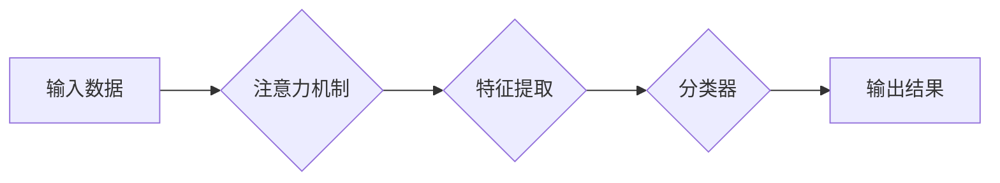

> 神经网络, 注意力机制, 模式识别, 计算机视觉, 自然语言处理

## 1. 背景介绍

模式识别是人工智能领域的核心任务之一，它旨在从数据中学习并识别模式，从而实现对未知数据的分类、预测和理解。传统模式识别方法通常依赖于手工设计的特征工程，但随着数据量的爆炸式增长和模式复杂性的增加，手工特征工程变得越来越困难和不可靠。

近年来，深度学习技术，特别是卷积神经网络（CNN）和循环神经网络（RNN），在模式识别领域取得了显著的进展。这些网络能够自动学习数据中的特征，并取得了优于传统方法的性能。然而，深度学习模型的训练过程仍然存在一些挑战，例如过拟合、梯度消失和计算成本高。

注意力机制（Attention Mechanism）作为一种新兴的深度学习技术，为解决这些挑战提供了新的思路。注意力机制能够学习到数据中哪些部分对目标任务更重要，并对这些重要部分给予更多的关注。这使得注意力机制能够提高模型的表达能力、鲁棒性和效率。

## 2. 核心概念与联系

### 2.1 注意力机制

注意力机制的核心思想是学习一个“注意力权重”，用于衡量输入数据中每个元素对目标任务的贡献。注意力权重可以看作是模型对输入数据的“关注度”，权重越高，模型对该元素的关注度就越高。

注意力机制可以应用于各种深度学习模型，例如CNN、RNN和Transformer。在CNN中，注意力机制可以用于学习图像中不同区域之间的关系，从而提高图像分类和目标检测的性能。在RNN中，注意力机制可以用于学习文本序列中不同词语之间的关系，从而提高机器翻译和文本摘要的性能。

### 2.2 模式识别

模式识别是指从数据中识别和分类模式的过程。模式识别应用广泛，例如图像识别、语音识别、人脸识别、文本分类等。

### 2.3 神经网络

神经网络是一种模仿人脑神经网络结构的机器学习模型。神经网络由多个层组成，每层包含多个神经元。神经元之间通过连接进行信息传递，每个连接都有一个权重。通过训练，神经网络可以学习到这些权重，从而实现对数据的学习和预测。

**Mermaid 流程图**



## 3. 核心算法原理 & 具体操作步骤

### 3.1 算法原理概述

注意力机制的核心思想是学习一个“注意力权重”，用于衡量输入数据中每个元素对目标任务的贡献。注意力权重可以看作是模型对输入数据的“关注度”，权重越高，模型对该元素的关注度就越高。

注意力机制通常由以下三个步骤组成：

1. 计算注意力权重：根据输入数据和目标任务，计算每个元素的注意力权重。
2. 加权求和：将注意力权重与输入数据相乘，得到加权后的输入数据。
3. 进一步处理：将加权后的输入数据输入到后续的网络层进行处理。

### 3.2 算法步骤详解

1. **计算注意力权重:**

   - 将输入数据映射到一个隐藏空间。
   - 计算每个元素与目标任务的相似度。
   - 使用 softmax 函数将相似度转换为注意力权重。

2. **加权求和:**

   - 将注意力权重与输入数据相乘，得到加权后的输入数据。

3. **进一步处理:**

   - 将加权后的输入数据输入到后续的网络层进行处理。

### 3.3 算法优缺点

**优点:**

- 能够学习到数据中哪些部分对目标任务更重要。
- 提高模型的表达能力、鲁棒性和效率。

**缺点:**

- 计算复杂度较高。
- 需要大量的训练数据。

### 3.4 算法应用领域

注意力机制在模式识别领域有着广泛的应用，例如：

- **图像识别:** 学习图像中不同区域之间的关系，提高图像分类和目标检测的性能。
- **语音识别:** 学习语音信号中不同音素之间的关系，提高语音识别准确率。
- **自然语言处理:** 学习文本序列中不同词语之间的关系，提高机器翻译、文本摘要和问答系统的性能。

## 4. 数学模型和公式 & 详细讲解 & 举例说明

### 4.1 数学模型构建

假设我们有一个输入序列 $X = \{x_1, x_2, ..., x_n\}$，其中每个元素 $x_i$ 代表一个数据点。目标是学习一个注意力权重 $a_i$，用于衡量每个元素对目标任务的贡献。

注意力权重 $a_i$ 可以通过以下公式计算：

$$a_i = \frac{exp(e_i)}{\sum_{j=1}^{n} exp(e_j)}$$

其中，$e_i$ 是每个元素 $x_i$ 与目标任务的相似度得分。

### 4.2 公式推导过程

注意力权重 $a_i$ 的计算过程可以分为以下几个步骤：

1. 计算每个元素 $x_i$ 与目标任务的相似度得分 $e_i$。

2. 将所有相似度得分 $e_i$ 通过 softmax 函数进行归一化，得到注意力权重 $a_i$。

### 4.3 案例分析与讲解

例如，在机器翻译任务中，输入序列 $X$ 是源语言的词语序列，目标任务是生成目标语言的词语序列。

我们可以使用注意力机制来学习源语言中哪些词语对目标语言的翻译更重要。

通过计算每个源语言词语与目标语言词语之间的相似度得分，我们可以得到每个源语言词语的注意力权重。

在翻译过程中，模型会根据这些注意力权重，对源语言词语进行加权求和，从而生成更准确的目标语言词语序列。

## 5. 项目实践：代码实例和详细解释说明

### 5.1 开发环境搭建

- Python 3.6+
- TensorFlow 2.0+
- PyTorch 1.0+
- CUDA 10.0+ (可选)

### 5.2 源代码详细实现

```python
import tensorflow as tf

# 定义注意力机制层
class AttentionLayer(tf.keras.layers.Layer):
    def __init__(self, units):
        super(AttentionLayer, self).__init__()
        self.W1 = tf.keras.layers.Dense(units)
        self.W2 = tf.keras.layers.Dense(units)
        self.V = tf.keras.layers.Dense(1)

    def call(self, inputs):
        # inputs: (batch_size, seq_len, units)
        # 计算每个元素与目标任务的相似度得分
        scores = self.V(tf.tanh(self.W2(inputs)))
        # softmax归一化
        attention_weights = tf.nn.softmax(scores, axis=1)
        # 加权求和
        context_vector = tf.matmul(attention_weights, inputs)
        return context_vector

# 定义模型
model = tf.keras.Sequential([
    tf.keras.layers.Embedding(input_dim=vocab_size, output_dim=units),
    AttentionLayer(units),
    tf.keras.layers.Dense(units),
    tf.keras.layers.Dense(output_dim)
])

# 编译模型
model.compile(optimizer='adam', loss='categorical_crossentropy', metrics=['accuracy'])

# 训练模型
model.fit(train_data, train_labels, epochs=10)
```

### 5.3 代码解读与分析

- `AttentionLayer` 类定义了一个注意力机制层，它包含三个密集层：`W1`、`W2` 和 `V`。
- `call` 方法计算每个元素与目标任务的相似度得分，并使用 softmax 函数将其归一化，得到注意力权重。
- `context_vector` 是加权后的输入数据，它代表了模型对输入序列的关注点。
- 模型使用 `Embedding` 层将词语转换为向量表示，然后通过注意力机制层学习到词语之间的关系。
- 最后，模型使用两个密集层进行分类。

### 5.4 运行结果展示

训练完成后，我们可以使用模型对测试数据进行预测，并评估模型的性能。

## 6. 实际应用场景

### 6.1 图像识别

注意力机制可以用于学习图像中不同区域之间的关系，从而提高图像分类和目标检测的性能。例如，在医学图像分析中，注意力机制可以帮助医生识别图像中的关键区域，例如肿瘤或骨折。

### 6.2 语音识别

注意力机制可以用于学习语音信号中不同音素之间的关系，提高语音识别准确率。例如，在语音助手中，注意力机制可以帮助模型识别用户的语音指令。

### 6.3 自然语言处理

注意力机制可以用于学习文本序列中不同词语之间的关系，提高机器翻译、文本摘要和问答系统的性能。例如，在机器翻译中，注意力机制可以帮助模型关注源语言中与目标语言词语相关的词语。

### 6.4 未来应用展望

注意力机制在模式识别领域有着广阔的应用前景，未来可能会应用于更多领域，例如：

- **视频分析:** 学习视频中不同帧之间的关系，提高视频理解和动作识别能力。
- **时间序列分析:** 学习时间序列中不同时间点的关系，提高预测和异常检测能力。
* **自动驾驶:** 学习图像和传感器数据之间的关系，提高自动驾驶系统的安全性。

## 7. 工具和资源推荐

### 7.1 学习资源推荐

- **书籍:**
    - Deep Learning by Ian Goodfellow, Yoshua Bengio, and Aaron Courville
    - Attention Is All You Need by Vaswani et al.
- **论文:**
    - "Attention Is All You Need" (Vaswani et al., 2017)
    - "BERT: Pre-training of Deep Bidirectional Transformers for Language Understanding" (Devlin et al., 2018)
- **在线课程:**
    - Coursera: Deep Learning Specialization
    - Udacity: Deep Learning Nanodegree

### 7.2 开发工具推荐

- **TensorFlow:** https://www.tensorflow.org/
- **PyTorch:** https://pytorch.org/
- **Keras:** https://keras.io/

### 7.3 相关论文推荐

- "Attention Is All You Need" (Vaswani et al., 2017)
- "BERT: Pre-training of Deep Bidirectional Transformers for Language Understanding" (Devlin et al., 2018)
- "Transformer-XL: Attentive Language Models Beyond a Fixed-Length Context" (Dai et al., 2019)

## 8. 总结：未来发展趋势与挑战

### 8.1 研究成果总结

注意力机制在模式识别领域取得了显著的进展，提高了模型的性能和效率。

### 8.2 未来发展趋势

未来，注意力机制的研究方向可能包括：

- **更有效的注意力机制:** 设计更有效的注意力机制，提高模型的性能和效率。
- **自适应注意力机制:** 开发自适应注意力机制，能够根据不同的任务和数据自动调整注意力权重。
- **多模态注意力机制:** 研究跨模态的注意力机制，例如图像和文本的联合注意力。

### 8.3 面临的挑战

注意力机制仍然面临一些挑战，例如：

- **计算复杂度:** 某些注意力机制的计算复杂度较高，难以应用于大规模数据。
- **可解释性:** 注意力机制的决策过程难以解释，这限制了其在一些应用场景中的使用。

### 8.4 研究展望

未来，注意力机制的研究将继续深入，并应用于更多领域，为人工智能的发展做出更大的贡献。

## 9. 附录：常见问题与解答

### 9.1 什么是注意力机制？

注意力机制是一种机器学习技术，它能够学习到数据中哪些部分对目标任务更重要，并对这些重要部分给予更多的关注。

### 9.2 注意力机制的应用场景有哪些？