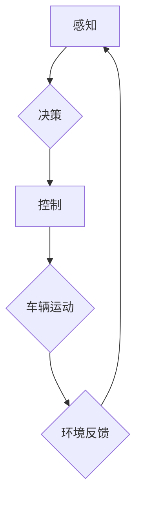

> 自动驾驶,端到端学习,自主代驾,深度学习,强化学习,计算机视觉,传感器融合,路径规划,决策控制

## 1. 背景介绍

随着人工智能技术的飞速发展，自动驾驶技术已成为一个备受关注的领域。自动驾驶汽车能够自主感知周围环境、规划路径并控制车辆行驶，具有极大的潜力改变交通出行方式，提升道路安全和效率。

传统的自动驾驶系统通常采用分层架构，将感知、决策和控制等功能模块独立设计和实现。然而，这种分层架构存在一些弊端，例如模块之间信息传递不畅、系统鲁棒性差等。

端到端自动驾驶系统则采用一种全新的设计理念，将感知、决策和控制等功能模块直接端到端地连接起来，通过深度学习算法实现从传感器数据到车辆控制指令的直接映射。这种设计能够有效解决传统分层架构的不足，提高系统的整体性能和鲁棒性。

自主代驾服务模式是基于端到端自动驾驶技术的商业化应用模式，它提供了一种全新的出行方式，用户可以通过手机APP或其他平台预约自动驾驶汽车，并享受安全、便捷、舒适的代驾服务。

## 2. 核心概念与联系

**2.1  端到端学习 (End-to-End Learning)**

端到端学习是一种机器学习方法，它将输入数据直接映射到输出结果，无需人工设计中间特征。在自动驾驶领域，端到端学习可以将传感器数据直接映射到车辆控制指令，简化系统设计，提高学习效率。

**2.2  自主代驾 (Robotaxi)**

自主代驾是指利用自动驾驶技术，提供无人驾驶汽车的出租车服务。用户可以通过手机APP或其他平台预约自动驾驶汽车，并享受安全、便捷、舒适的代驾服务。

**2.3  深度学习 (Deep Learning)**

深度学习是一种机器学习方法，它利用多层神经网络来学习数据特征。深度学习在计算机视觉、自然语言处理等领域取得了显著成果，也成为自动驾驶技术的重要组成部分。

**2.4  强化学习 (Reinforcement Learning)**

强化学习是一种机器学习方法，它通过奖励机制来训练智能体，使其在特定环境中做出最优决策。强化学习在自动驾驶领域可以用于训练车辆的决策控制策略。

**2.5  传感器融合 (Sensor Fusion)**

传感器融合是指将来自多个传感器的数据进行融合，以获得更准确、更全面的环境感知信息。在自动驾驶系统中，传感器融合是实现感知功能的关键技术。

**2.6  路径规划 (Path Planning)**

路径规划是指根据车辆的目标位置和周围环境，规划出车辆行驶的最佳路径。路径规划是自动驾驶系统的重要功能之一，它需要考虑车辆的运动特性、道路规则以及其他车辆和行人的安全。

**2.7  决策控制 (Decision Control)**

决策控制是指根据车辆的感知信息和路径规划结果，控制车辆的转向、加速和制动等动作。决策控制是自动驾驶系统的核心功能之一，它需要能够快速、准确地做出决策，并控制车辆安全行驶。

**2.8  Mermaid 流程图**



## 3. 核心算法原理 & 具体操作步骤

### 3.1  算法原理概述

端到端自动驾驶系统主要采用深度学习算法，将传感器数据直接映射到车辆控制指令。常用的深度学习算法包括卷积神经网络 (CNN)、循环神经网络 (RNN) 和强化学习算法等。

CNN 用于处理图像数据，例如摄像头采集的图像，可以提取图像中的特征信息，例如道路、车辆、行人等。RNN 用于处理序列数据，例如激光雷达采集的点云数据，可以学习序列中的时间依赖关系。强化学习算法用于训练车辆的决策控制策略，通过奖励机制来引导车辆做出最优决策。

### 3.2  算法步骤详解

1. **数据采集:** 收集大量真实道路场景的数据，包括摄像头图像、激光雷达点云、GPS信息、IMU数据等。
2. **数据预处理:** 对采集到的数据进行预处理，例如图像增强、点云去噪、数据标注等。
3. **模型训练:** 使用深度学习算法训练端到端自动驾驶模型，将预处理后的数据作为输入，训练模型将输入数据映射到车辆控制指令。
4. **模型评估:** 使用测试数据集评估模型的性能，例如准确率、召回率、平均位移误差等。
5. **模型部署:** 将训练好的模型部署到自动驾驶汽车上，实现自动驾驶功能。

### 3.3  算法优缺点

**优点:**

* 简化系统设计，提高学习效率。
* 能够学习到更复杂的特征关系。
* 提高系统的整体性能和鲁棒性。

**缺点:**

* 需要大量的训练数据。
* 训练过程耗时和耗能。
* 模型解释性较差。

### 3.4  算法应用领域

端到端学习算法在自动驾驶领域具有广泛的应用前景，例如：

* **自动驾驶汽车:** 实现车辆的感知、决策和控制功能。
* **无人机:** 实现无人机的自主飞行和路径规划。
* **机器人:** 实现机器人的自主导航和任务执行。

## 4. 数学模型和公式 & 详细讲解 & 举例说明

### 4.1  数学模型构建

端到端自动驾驶系统的数学模型可以表示为一个函数映射关系：

$$
y = f(x)
$$

其中：

* $x$ 代表输入数据，例如传感器数据。
* $y$ 代表输出结果，例如车辆控制指令。
* $f$ 代表深度学习模型，例如CNN、RNN或强化学习算法。

### 4.2  公式推导过程

深度学习模型的训练过程本质上是通过优化模型参数来最小化预测误差的过程。常用的优化算法包括梯度下降法、Adam算法等。

梯度下降法的核心思想是通过计算模型参数的梯度，沿着梯度负方向更新模型参数，从而逐渐降低预测误差。

$$
\theta = \theta - \alpha \nabla L(\theta)
$$

其中：

* $\theta$ 代表模型参数。
* $\alpha$ 代表学习率。
* $\nabla L(\theta)$ 代表损失函数 $L(\theta)$ 对模型参数 $\theta$ 的梯度。

### 4.3  案例分析与讲解

假设我们训练一个CNN模型用于识别道路上的行人。

输入数据为摄像头采集的图像，输出结果为行人是否存在。

训练过程中，模型会学习到图像中行人的特征，例如形状、颜色、纹理等。

当模型遇到新的图像时，它会根据学习到的特征判断图像中是否存在行人。

## 5. 项目实践：代码实例和详细解释说明

### 5.1  开发环境搭建

* 操作系统：Ubuntu 18.04
* Python 版本：3.7
* 深度学习框架：TensorFlow 2.0

### 5.2  源代码详细实现

```python
import tensorflow as tf

# 定义模型结构
model = tf.keras.models.Sequential([
    tf.keras.layers.Conv2D(32, (3, 3), activation='relu', input_shape=(64, 64, 3)),
    tf.keras.layers.MaxPooling2D((2, 2)),
    tf.keras.layers.Conv2D(64, (3, 3), activation='relu'),
    tf.keras.layers.MaxPooling2D((2, 2)),
    tf.keras.layers.Flatten(),
    tf.keras.layers.Dense(10, activation='softmax')
])

# 定义损失函数和优化器
model.compile(loss='categorical_crossentropy', optimizer='adam', metrics=['accuracy'])

# 训练模型
model.fit(x_train, y_train, epochs=10)

# 评估模型
loss, accuracy = model.evaluate(x_test, y_test)
print('Loss:', loss)
print('Accuracy:', accuracy)
```

### 5.3  代码解读与分析

这段代码定义了一个简单的CNN模型，用于图像分类任务。

模型结构包括两个卷积层、两个最大池化层、一个全连接层和一个输出层。

损失函数为交叉熵损失，优化器为Adam算法。

模型训练过程包括训练和评估两个阶段。

训练阶段使用训练数据训练模型，评估阶段使用测试数据评估模型的性能。

### 5.4  运行结果展示

训练完成后，可以将模型部署到自动驾驶汽车上，实现自动驾驶功能。

## 6. 实际应用场景

### 6.1  城市道路驾驶

端到端自动驾驶系统可以应用于城市道路驾驶，例如自动驾驶出租车、自动驾驶公交车等。

### 6.2  高速公路驾驶

端到端自动驾驶系统也可以应用于高速公路驾驶，例如自动驾驶货车、自动驾驶物流车等。

### 6.3  复杂环境驾驶

端到端自动驾驶系统可以应用于复杂环境驾驶，例如拥堵路段、恶劣天气条件等。

### 6.4  未来应用展望

端到端自动驾驶技术的发展将带来许多新的应用场景，例如：

* **无人配送:** 自动驾驶汽车可以用于无人配送货物，提高配送效率和降低成本。
* **自动驾驶农业:** 自动驾驶无人机可以用于农业作业，例如喷洒农药、播种、收割等。
* **自动驾驶医疗:** 自动驾驶汽车可以用于紧急医疗救援，提高医疗服务效率。

## 7. 工具和资源推荐

### 7.1  学习资源推荐

* **Udacity Self-Driving Car Engineer Nanodegree:** https://www.udacity.com/course/self-driving-car-engineer-nanodegree--nd009
* **Coursera Deep Learning Specialization:** https://www.coursera.org/specializations/deep-learning
* **OpenAI Spinning Up in Deep RL:** https://spinningup.openai.com/en/latest/

### 7.2  开发工具推荐

* **TensorFlow:** https://www.tensorflow.org/
* **PyTorch:** https://pytorch.org/
* **ROS (Robot Operating System):** https://www.ros.org/

### 7.3  相关论文推荐

* **End to End Learning for Self-Driving Cars** (Bojarski et al., 2016)
* **Deep Reinforcement Learning for End-to-End Autonomous Driving** (Schulman et al., 2017)
* **Learning to Drive in a Simulator** (Chen et al., 2018)

## 8. 总结：未来发展趋势与挑战

### 8.1  研究成果总结

端到端自动驾驶技术取得了显著进展，能够实现车辆在复杂道路场景下的自主驾驶。

### 8.2  未来发展趋势

* **更强大的模型:** 研究更强大的深度学习模型，例如Transformer、Generative Adversarial Networks (GANs)等，提高自动驾驶系统的性能和鲁棒性。
* **更丰富的传感器融合:** 融合更多类型的传感器数据，例如LiDAR、雷达、摄像头等，提高自动驾驶系统的感知能力。
* **更安全的驾驶策略:** 研究更安全的驾驶策略，例如安全驾驶规划、风险评估等，提高自动驾驶系统的安全性。

### 8.3  面临的挑战

* **数据获取和标注:** 自动驾驶系统需要大量的真实道路场景数据进行训练，数据获取和标注成本较高。
* **模型解释性:** 深度学习模型的决策过程难以解释，这对于自动驾驶系统的安全性至关重要。
* **法律法规:** 自动驾驶技术的应用需要完善的法律法规，明确自动驾驶汽车的责任和义务。

### 8.4  研究展望

未来，端到端自动驾驶技术将继续发展，并应用于更广泛的场景，为人类出行带来更多便利和安全。


## 9. 附录：常见问题与解答

**1. 端到端自动驾驶系统与传统自动驾驶系统的区别是什么？**

端到端自动驾驶系统采用深度学习算法，将感知、决策