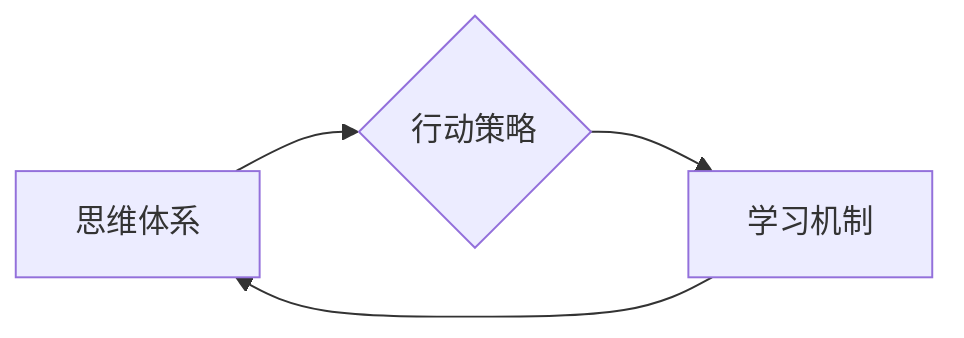

> 管理者、思维模型、行动策略、学习机制、技术领导、团队管理、创新驱动、数字化转型、人工智能

## 1. 背景介绍

在当今瞬息万变的科技时代，管理者肩负着带领团队突破创新、应对挑战、实现可持续发展的重任。传统的管理模式已难以适应快速发展的技术环境，管理者需要不断提升自身的能力，掌握新的思维方式、行动策略和学习机制，才能有效应对未来带来的机遇和挑战。

本篇文章将从“思维、行动和学习”三个维度，探讨管理者在科技时代所需的全新能力体系，并结合实际案例和技术趋势，为管理者提供有价值的思考和实践指导。

## 2. 核心概念与联系

### 2.1 思维体系

管理者的思维体系是其决策、判断和行动的基础。在科技时代，管理者需要具备以下思维特质：

* **系统思维:** 能够将复杂问题分解成相互关联的子系统，并理解各个子系统之间的相互作用，从而制定更全面的解决方案。
* **创新思维:** 能够跳出固有的思维模式，勇于尝试新的想法和方法，并将其转化为现实的成果。
* **数据驱动思维:** 能够利用数据分析和洞察，为决策提供科学依据，并不断优化管理策略。
* **未来导向思维:** 能够预判未来趋势，并制定相应的战略规划，以应对不断变化的市场环境。

### 2.2 行动策略

管理者的行动策略是指其在执行决策和实现目标的过程中所采取的具体步骤和方法。在科技时代，管理者需要具备以下行动特质：

* **敏捷行动:** 能够快速响应市场变化和技术发展，并灵活调整行动策略。
* **协同行动:** 能够有效地协调团队成员，并促进团队合作，共同完成目标。
* **结果导向:** 能够将目标分解成可衡量的指标，并持续跟踪和评估行动效果，不断优化行动策略。
* **持续改进:** 能够不断反思和总结经验教训，并将其应用于未来的行动中，不断提升行动效率和效果。

### 2.3 学习机制

管理者的学习机制是指其获取新知识、技能和经验的方式和方法。在科技时代，管理者需要具备以下学习特质：

* **终身学习:** 能够保持对新知识和新技术的学习热情，并将其应用于实际工作中。
* **主动学习:** 能够主动寻求学习机会，并积极参与学习活动，不断提升自身能力。
* **实践学习:** 能够将学习到的知识和技能应用于实际工作中，并通过实践不断积累经验。
* **知识分享:** 能够将自己的知识和经验与他人分享，促进团队学习和成长。

**核心概念与联系流程图:**



## 3. 核心算法原理 & 具体操作步骤

### 3.1 算法原理概述

在科技时代，管理者需要掌握一些核心算法原理，以帮助他们进行决策、优化资源和提升效率。例如，

* **决策树算法:** 用于解决分类问题，通过构建决策树模型，将数据分类到不同的类别。
* **线性回归算法:** 用于预测连续变量，通过建立线性关系模型，预测目标变量的值。
* **聚类算法:** 用于将数据分组，根据数据的相似度，将数据分成不同的簇。

### 3.2 算法步骤详解

以决策树算法为例，其具体操作步骤如下：

1. **数据预处理:** 对数据进行清洗、转换和特征工程，以确保数据质量和算法的有效性。
2. **特征选择:** 选择最能代表目标变量的特征，以提高模型的预测精度。
3. **决策树构建:** 根据特征值和目标变量的值，构建决策树模型，将数据分类到不同的类别。
4. **模型评估:** 使用测试数据评估模型的预测精度，并进行模型调优。
5. **模型部署:** 将训练好的模型部署到实际应用场景中，用于进行预测和决策。

### 3.3 算法优缺点

**决策树算法的优点:**

* 易于理解和解释，模型结构清晰直观。
* 可以处理分类和回归问题，具有较高的灵活性。
* 对数据类型要求不高，可以处理数值型、分类型和文本型数据。

**决策树算法的缺点:**

* 容易过拟合，模型泛化能力较差。
* 对数据噪声敏感，数据质量对模型性能影响较大。
* 对于高维数据，模型复杂度会增加，训练时间会延长。

### 3.4 算法应用领域

决策树算法广泛应用于以下领域:

* **金融领域:** 贷款风险评估、欺诈检测、客户画像分析。
* **医疗领域:** 疾病诊断、药物推荐、患者风险预测。
* **电商领域:** 商品推荐、用户画像分析、精准营销。

## 4. 数学模型和公式 & 详细讲解 & 举例说明

### 4.1 数学模型构建

决策树算法的构建过程可以抽象为一个数学模型，其中决策节点表示决策变量，分支表示决策规则，叶子节点表示最终决策结果。

### 4.2 公式推导过程

决策树算法的构建过程通常使用信息增益或基尼系数等指标来选择最优特征和决策规则。

**信息增益:**

$$
Gain(S,A) = Entropy(S) - \sum_{v \in Values(A)} \frac{|S_v|}{|S|} Entropy(S_v)
$$

其中:

* $S$ 是训练数据集
* $A$ 是特征
* $Values(A)$ 是特征 $A$ 的所有取值
* $S_v$ 是特征 $A$ 取值为 $v$ 的子集
* $Entropy(S)$ 是数据集 $S$ 的熵

**基尼系数:**

$$
Gini(S) = 1 - \sum_{i=1}^{k} p_i^2
$$

其中:

* $k$ 是类别数
* $p_i$ 是类别 $i$ 的概率

### 4.3 案例分析与讲解

假设我们有一个数据集，用于预测客户是否会购买商品。我们可以使用决策树算法构建一个模型，根据客户的年龄、收入和购买历史等特征，预测客户是否会购买商品。

通过计算信息增益或基尼系数，我们可以选择最优特征和决策规则，构建决策树模型。最终，模型可以将客户分类到“购买”和“不购买”两类。

## 5. 项目实践：代码实例和详细解释说明

### 5.1 开发环境搭建

本项目使用 Python 语言和 scikit-learn 库进行开发。

* 安装 Python 语言环境
* 安装 scikit-learn 库

```bash
pip install scikit-learn
```

### 5.2 源代码详细实现

```python
from sklearn.tree import DecisionTreeClassifier
from sklearn.model_selection import train_test_split
from sklearn.metrics import accuracy_score

# 加载数据
# ...

# 将数据分为训练集和测试集
X_train, X_test, y_train, y_test = train_test_split(X, y, test_size=0.2, random_state=42)

# 创建决策树模型
model = DecisionTreeClassifier()

# 训练模型
model.fit(X_train, y_train)

# 预测测试集结果
y_pred = model.predict(X_test)

# 计算模型精度
accuracy = accuracy_score(y_test, y_pred)
print(f"模型精度: {accuracy}")
```

### 5.3 代码解读与分析

* `DecisionTreeClassifier()` 创建决策树模型。
* `train_test_split()` 将数据分为训练集和测试集。
* `fit()` 方法训练模型。
* `predict()` 方法预测测试集结果。
* `accuracy_score()` 计算模型精度。

### 5.4 运行结果展示

运行代码后，会输出模型的精度值。

## 6. 实际应用场景

### 6.1 医疗诊断

决策树算法可以用于辅助医生进行疾病诊断。通过构建决策树模型，将患者的症状、检查结果等特征与疾病类型关联起来，医生可以根据模型的预测结果，辅助做出诊断决策。

### 6.2 金融风险评估

决策树算法可以用于评估客户的贷款风险。通过构建决策树模型，将客户的收入、信用记录、还款能力等特征与贷款风险等级关联起来，银行可以根据模型的预测结果，决定是否批准贷款申请，并设定相应的贷款利率。

### 6.3 市场营销

决策树算法可以用于精准营销。通过构建决策树模型，将客户的年龄、性别、购买历史、兴趣爱好等特征与产品购买概率关联起来，企业可以根据模型的预测结果，精准推送广告和促销活动，提高营销效果。

### 6.4 未来应用展望

随着人工智能技术的不断发展，决策树算法将在更多领域得到应用，例如：

* **个性化推荐:** 为用户提供个性化的产品推荐、内容推荐和服务推荐。
* **自动驾驶:** 辅助自动驾驶系统进行决策，例如判断行人、车辆和交通信号灯。
* **智能客服:** 帮助智能客服系统理解用户需求，并提供更精准的回复。

## 7. 工具和资源推荐

### 7.1 学习资源推荐

* **书籍:**
    * 《机器学习》 - 周志华
    * 《Python机器学习实战》 - 塞缪尔·阿布拉姆斯
* **在线课程:**
    * Coursera: 机器学习
    * edX: 数据科学与机器学习
* **博客和网站:**
    * 机器学习 Mastery
    * Towards Data Science

### 7.2 开发工具推荐

* **Python:** 
    * Jupyter Notebook
    * PyCharm
* **机器学习库:**
    * scikit-learn
    * TensorFlow
    * PyTorch

### 7.3 相关论文推荐

* **决策树算法:**
    * Quinlan, J. R. (1986). Induction of decision trees. Machine learning, 1(1), 81-106.
* **信息增益:**
    * Shannon, C. E. (1948). A mathematical theory of communication. The Bell System Technical Journal, 27(3), 379-423.
* **基尼系数:**
    * Breiman, L., Friedman, J. H., Olshen, R. A., & Stone, C. J. (1984). Classification and regression trees. Wadsworth & Brooks/Cole.

## 8. 总结：未来发展趋势与挑战

### 8.1 研究成果总结

本篇文章探讨了管理者在科技时代所需的全新能力体系，并结合实际案例和技术趋势，为管理者提供有价值的思考和实践指导。

### 8.2 未来发展趋势

* **人工智能技术的进一步发展:** 人工智能技术将更加深入地融入到管理实践中，例如，人工智能驱动的决策支持系统、智能人力资源管理系统等。
* **数据驱动的管理模式:** 管理者将更加依赖数据分析和洞察，以制定更科学、更有效的管理策略。
* **敏捷和协作的管理模式:** 管理者将更加注重敏捷和协作，以应对快速变化的市场环境和技术发展。

### 8.3 面临的挑战

* **人才短缺:** 科技时代需要更多具备科技素养的管理者，而人才短缺是一个普遍的挑战。
* **技术更新迭代:** 科技发展日新月异，管理者需要不断学习新知识和技能，以跟上技术发展步伐。
* **伦理和社会影响:** 人工智能技术的应用引发了伦理和社会影响的讨论，管理者需要关注这些问题，并制定相应的应对措施。

### 8.4 研究展望

未来，我们将继续关注管理者在科技时代所需的全新能力体系，并深入研究人工智能技术在管理实践中的应用，为管理者提供更有效的指导和支持。

## 9. 附录：常见问题与解答

### 9.