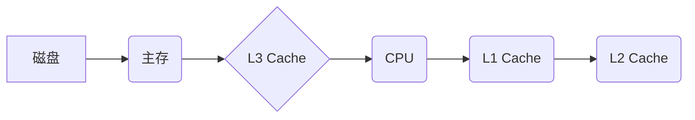

> 缓存机制、高吞吐量、数据访问、性能优化、算法原理、实践案例、未来趋势

## 1. 背景介绍

在当今数据爆炸的时代，高吞吐量系统已成为各种应用的核心需求。无论是电商平台的商品查询、金融系统的交易处理，还是社交媒体的实时信息流，都需要快速、高效地处理海量数据请求。而缓存机制作为一种重要的性能优化手段，在高吞吐量系统中扮演着至关重要的角色。

传统的数据库访问模式往往需要访问磁盘存储，这会导致数据访问速度缓慢，成为系统性能瓶颈。缓存机制通过将频繁访问的数据预先加载到内存中，从而实现快速的数据访问，有效提升系统吞吐量和响应速度。

## 2. 核心概念与联系

### 2.1 缓存机制概述

缓存机制是一种数据存储和检索技术，它将数据从一个较慢的存储介质（如磁盘）复制到一个较快的存储介质（如内存）中，以便更快地访问。当应用程序需要访问某个数据时，首先会检查缓存中是否存在该数据。如果存在，则直接从缓存中读取，无需访问磁盘，从而大大提高数据访问速度。

### 2.2 缓存层次结构

缓存机制通常采用多层次结构，从最快的缓存到最慢的缓存，依次排列。常见的缓存层次结构包括：

* **L1 Cache:** 位于CPU内部，速度最快，容量最小。
* **L2 Cache:** 位于CPU外，速度比L1 Cache慢，容量比L1 Cache大。
* **L3 Cache:** 位于主板上的共享缓存，速度比L2 Cache慢，容量比L2 Cache大。
* **主存 (RAM):** 速度比缓存慢，容量比L3 Cache大。
* **磁盘:** 速度最慢，容量最大。

数据从磁盘加载到内存，再到缓存，形成一个数据访问的层次结构。

### 2.3 缓存相关术语

* **命中率 (Hit Rate):** 缓存命中次数占总访问次数的比例。
* **未命中率 (Miss Rate):** 缓存未命中次数占总访问次数的比例。
* **缓存大小:** 缓存能够存储的数据量。
* **缓存淘汰策略:** 当缓存空间不足时，决定哪些数据需要从缓存中移除。

### 2.4 缓存架构图



## 3. 核心算法原理 & 具体操作步骤

### 3.1 算法原理概述

缓存机制的核心算法原理是**局部性原理**。局部性原理指出，程序在运行过程中，访问的数据往往具有局部性，即最近访问的数据更有可能在未来被再次访问。

基于局部性原理，缓存算法可以将最近访问的数据存储在高速缓存中，从而提高数据访问速度。常见的缓存算法包括：

* **FIFO (First-In, First-Out):** 采用先进先出策略，缓存中最早添加的数据将首先被移除。
* **LRU (Least Recently Used):** 采用最近最少使用策略，缓存中最近最少使用的的数据将首先被移除。
* **LFU (Least Frequently Used):** 采用最近最少使用策略，缓存中最近最少使用的的数据将首先被移除。

### 3.2 算法步骤详解

以LRU算法为例，其具体操作步骤如下：

1. 当应用程序请求访问某个数据时，首先检查缓存中是否存在该数据。
2. 如果存在，则直接从缓存中读取数据，并更新该数据的访问时间。
3. 如果不存在，则从磁盘中读取数据，并将数据存储到缓存中。同时，更新该数据的访问时间。
4. 如果缓存空间不足，则根据LRU策略移除访问时间最久的缓存数据，并用新的数据替换。

### 3.3 算法优缺点

**FIFO算法:**

* 优点: 简单易实现。
* 缺点: 容易导致缓存命中率低，因为可能移除最近访问的数据。

**LRU算法:**

* 优点: 命中率较高，能够有效利用缓存空间。
* 缺点: 实现复杂度较高，需要维护数据访问时间。

**LFU算法:**

* 优点: 能够根据数据访问频率动态调整缓存策略。
* 缺点: 需要维护数据访问次数，实现复杂度较高。

### 3.4 算法应用领域

缓存算法广泛应用于各种领域，例如：

* **Web服务器:** 缓存网页内容，提高网页访问速度。
* **数据库:** 缓存数据库查询结果，减少数据库访问次数。
* **游戏服务器:** 缓存游戏数据，提高游戏响应速度。
* **搜索引擎:** 缓存搜索结果，提高搜索速度。

## 4. 数学模型和公式 & 详细讲解 & 举例说明

### 4.1 数学模型构建

缓存命中率可以表示为：

$$
Hit Rate = \frac{Number of Cache Hits}{Total Number of Requests}
$$

未命中率可以表示为：

$$
Miss Rate = \frac{Number of Cache Misses}{Total Number of Requests}
$$

### 4.2 公式推导过程

缓存命中率和未命中率是衡量缓存性能的重要指标。命中率越高，表示缓存命中次数越多，数据访问速度越快。未命中率越低，表示缓存未命中次数越少，数据访问效率越高。

### 4.3 案例分析与讲解

假设一个缓存系统，总共处理了1000个请求，其中有800个请求命中缓存，200个请求未命中缓存。那么，该缓存系统的命中率为：

$$
Hit Rate = \frac{800}{1000} = 0.8
$$

未命中率为：

$$
Miss Rate = \frac{200}{1000} = 0.2
$$

## 5. 项目实践：代码实例和详细解释说明

### 5.1 开发环境搭建

* 操作系统: Ubuntu 20.04
* 编程语言: Python 3.8
* 框架: Flask

### 5.2 源代码详细实现

```python
from flask import Flask, request, jsonify
from collections import OrderedDict

app = Flask(__name__)

# 缓存字典，使用OrderedDict实现LRU策略
cache = OrderedDict()

@app.route('/data/<key>')
def get_data(key):
    if key in cache:
        # 命中缓存
        data = cache[key]
        cache.move_to_end(key)  # 更新访问时间
        return jsonify({'data': data})
    else:
        # 未命中缓存，从数据库或其他数据源获取数据
        data = '获取数据...'
        cache[key] = data
        return jsonify({'data': data})

if __name__ == '__main__':
    app.run(debug=True)
```

### 5.3 代码解读与分析

* 使用Flask框架构建一个简单的API接口。
* 使用OrderedDict实现LRU缓存策略，当缓存空间不足时，会自动移除访问时间最久的缓存数据。
* 当请求命中缓存时，会直接返回缓存数据，并更新该数据的访问时间。
* 当请求未命中缓存时，会从数据库或其他数据源获取数据，并将其存储到缓存中。

### 5.4 运行结果展示

启动应用程序后，访问`/data/<key>`接口，可以获取数据。

## 6. 实际应用场景

### 6.1 网站内容缓存

网站内容缓存可以将网页内容、图片、CSS文件等静态资源存储在缓存中，从而减少服务器的负载，提高网站的访问速度。

### 6.2 数据库查询缓存

数据库查询缓存可以将数据库查询结果存储在缓存中，减少数据库的访问次数，提高数据库的性能。

### 6.3 游戏数据缓存

游戏数据缓存可以将游戏数据，例如玩家信息、游戏地图等，存储在缓存中，从而提高游戏响应速度，提升玩家的游戏体验。

### 6.4 未来应用展望

随着云计算、大数据、人工智能等技术的快速发展，缓存机制将在未来发挥更加重要的作用。例如：

* **边缘计算:** 将缓存部署在边缘节点，实现更快速的本地数据访问。
* **物联网:** 在物联网设备中使用缓存，提高数据处理效率。
* **人工智能:** 在人工智能模型训练和推理过程中使用缓存，加速模型训练和推理速度。

## 7. 工具和资源推荐

### 7.1 学习资源推荐

* **书籍:**
    * 《深入理解计算机系统》
    * 《操作系统导论》
* **在线课程:**
    * Coursera: Operating Systems
    * edX: Computer Architecture

### 7.2 开发工具推荐

* **Redis:** 高性能的内存数据库，广泛用于缓存应用。
* **Memcached:** 轻量级的内存缓存系统，适合高并发场景。
* **Varnish Cache:** 高性能的HTTP缓存代理服务器。

### 7.3 相关论文推荐

* **The Case for LRU Cache Replacement**
* **A Survey of Cache Replacement Algorithms**

## 8. 总结：未来发展趋势与挑战

### 8.1 研究成果总结

缓存机制在高吞吐量系统中发挥着至关重要的作用，通过提高数据访问速度，有效提升系统性能。

### 8.2 未来发展趋势

未来，缓存机制将朝着以下方向发展：

* **智能化:** 基于机器学习等人工智能技术，实现更智能的缓存策略，例如动态调整缓存大小、淘汰策略等。
* **分布式化:** 将缓存部署在多个节点上，实现分布式缓存，提高缓存的容错性和扩展性。
* **边缘化:** 将缓存部署在边缘节点，实现更快速的本地数据访问。

### 8.3 面临的挑战

缓存机制的发展也面临着一些挑战：

* **数据一致性:** 在分布式缓存环境下，保证数据的一致性是一个难题。
* **缓存管理复杂性:** 随着缓存规模的扩大，缓存管理的复杂性也会增加。
* **安全问题:** 缓存数据可能包含敏感信息，需要采取相应的安全措施。

### 8.4 研究展望

未来，研究人员将继续探索新的缓存算法、架构和技术，以解决缓存机制面临的挑战，并进一步提高缓存的性能和效率。

## 9. 附录：常见问题与解答

* **什么是缓存击穿？**

缓存击穿是指当缓存中没有某个数据时，需要从数据库或其他数据源获取数据，但数据库或其他数据源也无法提供数据，导致请求失败的情况。

* **如何避免缓存击穿？**

可以使用多种方法避免缓存击穿，例如：

* 使用缓存预热技术，提前加载热门数据到缓存中。
* 使用缓存失效策略，在数据过期后及时更新缓存。
* 使用缓存代理，在缓存击穿时，将请求转发到备用服务器。

* **什么是缓存雪崩？**

缓存雪崩是指当大量数据同时从缓存中失效，导致数据库或其他数据源被大量请求，从而导致系统性能下降甚至崩溃的情况。

* **如何避免缓存雪崩？**

可以使用多种方法避免缓存雪崩，例如：

* 使用缓存失效策略，将数据失效时间分散开来。
* 使用缓存分片技术，将数据分片到多个缓存服务器上。
* 使用缓存降级策略，在缓存雪崩发生时，将请求降级到非缓存模式。


作者：禅与计算机程序设计艺术 / Zen and the Art of Computer Programming 
<end_of_turn>