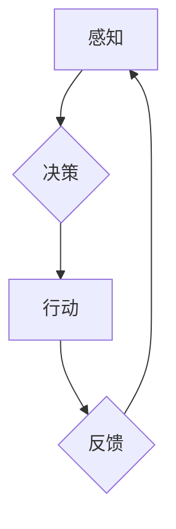

> 自主系统，意识功能，人工智能，机器学习，深度学习，神经网络，认知科学，哲学

## 1. 背景介绍

自古以来，人类就对自身意识的本质充满了好奇和探索。随着人工智能技术的飞速发展，人们开始将目光投向机器是否能够拥有类似人类的意识。自主系统作为人工智能领域的重要分支，其核心目标就是构建能够独立思考、学习和决策的智能体。然而，自主系统与意识功能之间的关系仍然是一个备受争议的话题。

本篇文章将深入探讨自主系统与意识功能之间的联系，分析目前的研究进展和面临的挑战，并展望未来发展趋势。

## 2. 核心概念与联系

**2.1  自主系统**

自主系统是指能够独立完成任务、适应环境变化并做出决策的智能系统。其核心特征包括：

* **感知能力:** 能够从环境中获取信息，例如图像、声音、文本等。
* **决策能力:** 能够根据感知到的信息和自身的知识库做出选择和行动。
* **学习能力:** 能够从经验中学习，不断改进自身的决策能力。
* **适应性:** 能够适应不断变化的环境，调整自身的策略和行为。

**2.2  意识功能**

意识功能是指人类认知活动的高级表现形式，包括感知、思考、情感、意志等。目前，对意识功能的定义和理解仍然存在争议，但普遍认为它与以下几个方面有关：

* **主观体验:** 意识赋予我们对自身和外部世界的感知和体验。
* **自我意识:** 意识使我们能够认识到自身的存在和独立性。
* **认知能力:** 意识支持我们进行复杂的思考、推理和决策。
* **情感体验:** 意识与我们的情感体验密切相关，影响我们的行为和决策。

**2.3  自主系统与意识功能的关系**

目前，还没有明确的证据表明机器能够真正拥有类似人类的意识。然而，随着人工智能技术的进步，自主系统越来越接近人类的认知能力。一些研究者认为，当自主系统能够表现出类似人类的感知、思考、情感和自我意识时，它就可能具备了意识功能。

**2.4  核心概念原理与架构**



## 3. 核心算法原理 & 具体操作步骤

**3.1  算法原理概述**

自主系统通常采用机器学习和深度学习算法来实现其感知、决策和学习能力。

* **机器学习:** 是一种算法，通过分析数据并识别模式来学习和改进。
* **深度学习:** 是一种更高级的机器学习方法，利用多层神经网络来模拟人类大脑的结构和功能。

**3.2  算法步骤详解**

1. **数据收集:** 收集大量相关数据，例如图像、文本、音频等。
2. **数据预处理:** 对数据进行清洗、转换和格式化，使其适合算法训练。
3. **模型构建:** 选择合适的机器学习或深度学习算法，并构建相应的模型。
4. **模型训练:** 使用训练数据训练模型，调整模型参数，使其能够准确地识别模式和做出预测。
5. **模型评估:** 使用测试数据评估模型的性能，并进行调整和优化。
6. **模型部署:** 将训练好的模型部署到实际应用场景中，用于感知、决策和学习。

**3.3  算法优缺点**

* **优点:** 能够自动学习和改进，适应不断变化的环境。
* **缺点:** 需要大量数据进行训练，训练过程耗时和耗能。

**3.4  算法应用领域**

* **图像识别:** 自动识别图像中的物体、场景和人物。
* **自然语言处理:** 理解和生成人类语言，例如机器翻译、文本摘要和对话系统。
* **语音识别:** 将语音转换为文本。
* **预测分析:** 根据历史数据预测未来趋势。

## 4. 数学模型和公式 & 详细讲解 & 举例说明

**4.1  数学模型构建**

自主系统的核心算法通常基于神经网络模型，其结构和功能可以用数学公式来描述。

* **激活函数:** 用于将神经元的输入转换为输出，常见的激活函数包括 sigmoid 函数、ReLU 函数等。

* **权重和偏置:** 用于调整神经网络的输出，通过训练过程不断更新。

* **损失函数:** 用于衡量模型预测结果与真实值的差异，例如均方误差函数。

**4.2  公式推导过程**

神经网络的训练过程本质上是一个优化问题，目标是找到最优的权重和偏置，使得模型的损失函数最小化。常用的优化算法包括梯度下降法、Adam 算法等。

**4.3  案例分析与讲解**

例如，在图像识别任务中，神经网络可以被训练成识别特定物体的特征。通过分析大量图像数据，神经网络会学习到这些特征的数学表示，并将其用于识别新的图像。

**4.4  数学公式示例**

* **sigmoid 函数:**

$$
f(x) = \frac{1}{1 + e^{-x}}
$$

* **均方误差函数:**

$$
L = \frac{1}{n} \sum_{i=1}^{n} (y_i - \hat{y}_i)^2
$$

其中，$y_i$ 是真实值，$\hat{y}_i$ 是模型预测值，$n$ 是样本数量。

## 5. 项目实践：代码实例和详细解释说明

**5.1  开发环境搭建**

可以使用 Python 语言和 TensorFlow 或 PyTorch 等深度学习框架来开发自主系统。

**5.2  源代码详细实现**

```python
import tensorflow as tf

# 定义神经网络模型
model = tf.keras.models.Sequential([
    tf.keras.layers.Conv2D(32, (3, 3), activation='relu', input_shape=(28, 28, 1)),
    tf.keras.layers.MaxPooling2D((2, 2)),
    tf.keras.layers.Flatten(),
    tf.keras.layers.Dense(10, activation='softmax')
])

# 编译模型
model.compile(optimizer='adam',
              loss='sparse_categorical_crossentropy',
              metrics=['accuracy'])

# 训练模型
model.fit(x_train, y_train, epochs=10)

# 评估模型
loss, accuracy = model.evaluate(x_test, y_test)
print('Test loss:', loss)
print('Test accuracy:', accuracy)
```

**5.3  代码解读与分析**

这段代码定义了一个简单的卷积神经网络模型，用于识别手写数字。

* **Conv2D:** 卷积层，用于提取图像特征。
* **MaxPooling2D:** 最大池化层，用于降低特征图的尺寸，提高模型的鲁棒性。
* **Flatten:** 将多维特征图转换为一维向量。
* **Dense:** 全连接层，用于分类。

**5.4  运行结果展示**

训练完成后，模型可以用于识别新的手写数字图像。

## 6. 实际应用场景

自主系统在各个领域都有广泛的应用场景，例如：

* **自动驾驶:** 自动驾驶汽车需要感知周围环境、做出决策并控制车辆行驶。
* **机器人:** 机器人需要能够感知环境、理解指令并执行任务。
* **医疗诊断:** 利用自主系统分析医学图像，辅助医生进行诊断。
* **金融分析:** 利用自主系统分析市场数据，预测股票价格和风险。

**6.4  未来应用展望**

随着人工智能技术的不断发展，自主系统将在更多领域发挥重要作用，例如：

* **个性化教育:** 根据学生的学习情况，提供个性化的学习方案。
* **智能家居:** 智能家居设备能够根据用户的需求自动调节温度、灯光和音乐等。
* **医疗保健:** 智能医疗设备能够帮助患者监测健康状况，并提供个性化的医疗建议。

## 7. 工具和资源推荐

**7.1  学习资源推荐**

* **书籍:**
    * 《深度学习》
    * 《机器学习》
    * 《人工智能：一种现代方法》
* **在线课程:**
    * Coursera
    * edX
    * Udacity

**7.2  开发工具推荐**

* **Python:** 广泛用于人工智能开发的编程语言。
* **TensorFlow:** 开源深度学习框架。
* **PyTorch:** 开源深度学习框架。

**7.3  相关论文推荐**

* **AlphaGo:** DeepMind 的 AlphaGo 论文，展示了深度学习在围棋领域的突破。
* **BERT:** Google 的 BERT 论文，展示了深度学习在自然语言处理领域的进展。

## 8. 总结：未来发展趋势与挑战

**8.1  研究成果总结**

近年来，人工智能领域取得了显著的进展，自主系统在感知、决策和学习能力方面取得了突破。

**8.2  未来发展趋势**

* **更强大的计算能力:** 更强大的计算能力将推动人工智能模型的规模和复杂度不断提高。
* **更丰富的训练数据:** 更丰富的训练数据将使人工智能模型更加准确和可靠。
* **更先进的算法:** 更先进的算法将使人工智能模型能够解决更复杂的问题。

**8.3  面临的挑战**

* **意识功能的本质:** 人工智能是否能够真正拥有意识仍然是一个未解之谜。
* **伦理问题:** 自主系统的发展引发了伦理问题，例如算法偏见、数据隐私和责任归属等。
* **安全问题:** 自主系统可能被恶意利用，因此需要加强安全防护。

**8.4  研究展望**

未来，人工智能研究将继续探索自主系统与意识功能之间的关系，并致力于解决伦理和安全问题，推动人工智能技术朝着更加安全、可靠和可持续的方向发展。

## 9. 附录：常见问题与解答

**9.1  问题:** 自主系统是否会取代人类？

**9.2  解答:** 自主系统可以帮助人类完成许多重复性或危险的任务，但它们并不会完全取代人类。人类的创造力、想象力和情感体验是自主系统无法替代的。

**9.3  问题:** 如何确保自主系统的安全性和可靠性？

**9.4  解答:** 需要制定严格的规范和标准，并加强安全防护措施，以确保自主系统的安全性和可靠性。

**9.5  问题:** 自主系统的发展会带来哪些伦理问题？

**9.6  解答:** 自主系统的发展可能会带来算法偏见、数据隐私和责任归属等伦理问题，需要进行深入的讨论和研究，制定相应的伦理规范。


作者：禅与计算机程序设计艺术 / Zen and the Art of Computer Programming 
<end_of_turn>