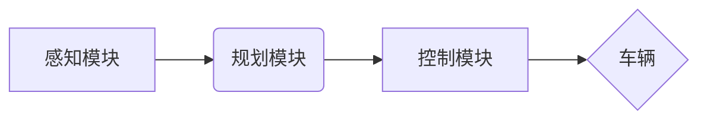

> 自动驾驶, 感知, 规划, 控制, 深度学习, 机器学习, 计算机视觉, 路径规划, 控制算法

## 1. 背景介绍

自动驾驶技术作为未来交通运输的重要发展方向，近年来取得了显著进展。自动驾驶系统旨在实现车辆自主行驶，无需人工干预。其核心功能包括感知环境、规划路径和控制车辆运动。感知模块负责收集车辆周围环境信息，规划模块根据感知信息制定行驶路线，控制模块则根据规划指令控制车辆执行动作。

自动驾驶技术的发展离不开感知、规划和控制模块的协同工作。这三个模块相互依赖，共同构成了自动驾驶系统的核心功能。感知模块为规划模块提供环境信息，规划模块为控制模块提供行驶路线，控制模块则将规划指令转化为车辆实际动作。

## 2. 核心概念与联系

**感知模块**负责收集车辆周围环境信息，包括道路状况、交通标志、其他车辆和行人等。常用的感知技术包括：

* **摄像头:** 提供视觉信息，用于识别道路标线、交通信号灯、车辆和行人等。
* **雷达:** 通过发射电磁波探测目标距离、速度和方向，能够穿透雾霾和雨雪等恶劣天气条件。
* **激光雷达:** 通过发射激光束探测目标距离、形状和速度，能够提供高精度三维地图。
* **超声波传感器:** 用于检测车辆周围的障碍物，主要用于低速行驶场景。

**规划模块**根据感知模块提供的环境信息，制定车辆行驶路线。常用的规划算法包括：

* **路径规划算法:** 用于寻找车辆从起点到终点的最佳路径，考虑道路限制、交通流量和安全因素。
* **决策算法:** 用于在复杂路况下做出驾驶决策，例如变道、超车、停车等。

**控制模块**根据规划模块提供的行驶路线，控制车辆执行动作。常用的控制算法包括：

* **动力学控制算法:** 用于控制车辆的加速、减速和转向。
* **轨迹跟踪控制算法:** 用于使车辆沿着规划好的路径行驶。

**核心概念架构图:**



## 3. 核心算法原理 & 具体操作步骤

### 3.1  算法原理概述

**路径规划算法**旨在找到车辆从起点到终点的最佳路径，该路径需满足以下条件：

* **可行性:** 路径必须在道路范围内，且没有障碍物。
* **安全性:** 路径必须保证车辆行驶安全，避免碰撞和其他危险情况。
* **效率:** 路径应尽量缩短行驶时间和距离。

常见的路径规划算法包括：

* **A* 算法:** 基于启发式搜索的算法，能够高效地找到最短路径。
* **Dijkstra 算法:** 基于贪婪搜索的算法，能够找到最短路径，但效率相对较低。
* **Rapidly-exploring Random Trees (RRT) 算法:** 基于随机采样的算法，能够在复杂环境下规划路径。

### 3.2  算法步骤详解

以 A* 算法为例，其具体步骤如下：

1. **构建地图:** 将环境信息转化为地图数据，包括道路、障碍物和目标点。
2. **初始化:** 设置起点和终点，并创建开放列表和关闭列表。开放列表包含待探索的节点，关闭列表包含已探索的节点。
3. **选择节点:** 从开放列表中选择 f 值最小的节点，f 值等于节点到终点的距离加上节点到起点的距离。
4. **探索邻居:** 探索当前节点的邻居节点，并计算其到终点的距离。
5. **更新节点:** 如果邻居节点的到终点的距离比当前节点的到终点的距离更短，则更新邻居节点的父节点和到终点的距离。
6. **重复步骤 3-5:** 直到找到终点节点。
7. **回溯路径:** 从终点节点回溯到起点节点，得到最短路径。

### 3.3  算法优缺点

**A* 算法**的优点包括：

* **效率高:** 能够高效地找到最短路径。
* **可扩展性强:** 可以应用于各种复杂环境。

**A* 算法**的缺点包括：

* **需要启发式函数:** 启发式函数的选择会影响算法的效率和准确性。
* **内存占用较大:** 对于大型地图，内存占用可能会比较大。

### 3.4  算法应用领域

路径规划算法广泛应用于自动驾驶、机器人导航、物流配送等领域。

## 4. 数学模型和公式 & 详细讲解 & 举例说明

### 4.1  数学模型构建

**A* 算法**的数学模型可以表示为以下公式：

$$f(n) = g(n) + h(n)$$

其中：

* $f(n)$: 节点 $n$ 的总代价，即节点到终点的距离加上节点到起点的距离。
* $g(n)$: 节点 $n$ 到起点的距离。
* $h(n)$: 节点 $n$ 到终点的估计距离，称为启发式函数。

### 4.2  公式推导过程

A* 算法的核心思想是选择 f 值最小的节点进行探索，从而找到最短路径。

* **启发式函数:** 启发式函数 $h(n)$ 用于估计节点 $n$ 到终点的距离。常用的启发式函数包括曼哈顿距离、欧几里得距离等。
* **总代价:** 节点 $n$ 的总代价 $f(n)$ 包含了节点到起点的距离 $g(n)$ 和节点到终点的估计距离 $h(n)$。

### 4.3  案例分析与讲解

假设起点为 A，终点为 B，地图上存在障碍物 C。

* **曼哈顿距离:**  $h(A) = |A_x - B_x| + |A_y - B_y|$
* **欧几里得距离:** $h(A) = \sqrt{(A_x - B_x)^2 + (A_y - B_y)^2}$

根据启发式函数和总代价公式，A* 算法会选择 f 值最小的节点进行探索，最终找到从 A 到 B 的最短路径。

## 5. 项目实践：代码实例和详细解释说明

### 5.1  开发环境搭建

* 操作系统: Ubuntu 20.04
* 编程语言: Python 3.8
* 库依赖: numpy, matplotlib, opencv-python

### 5.2  源代码详细实现

```python
import numpy as np
from matplotlib import pyplot as plt
import cv2

# 地图数据
map_data = np.array([
    [0, 0, 0, 1, 0],
    [0, 1, 0, 1, 0],
    [0, 0, 0, 0, 0],
    [1, 1, 1, 1, 0],
    [0, 0, 0, 0, 0],
])

# 起点和终点坐标
start_node = (0, 0)
goal_node = (4, 4)

# 启发式函数
def heuristic(node1, node2):
    return abs(node1[0] - node2[0]) + abs(node1[1] - node2[1])

# A* 算法
def a_star(map_data, start_node, goal_node):
    # ... (实现 A* 算法逻辑)
    pass

# 执行 A* 算法
path = a_star(map_data, start_node, goal_node)

# 绘制路径
plt.imshow(map_data, cmap='gray')
plt.plot([node[1] for node in path], [node[0] for node in path], 'r-')
plt.show()
```

### 5.3  代码解读与分析

* **地图数据:** 使用 NumPy 数组表示地图数据，其中 0 表示可通行区域，1 表示障碍物。
* **起点和终点坐标:** 定义起点和终点坐标。
* **启发式函数:** 使用曼哈顿距离作为启发式函数，估计节点到终点的距离。
* **A* 算法:** 实现 A* 算法逻辑，包括节点扩展、路径搜索等步骤。
* **路径绘制:** 使用 Matplotlib 绘制地图和路径。

### 5.4  运行结果展示

运行代码后，将显示地图和从起点到终点的路径。

## 6. 实际应用场景

自动驾驶中的感知、规划和控制模块已在许多实际应用场景中得到应用，例如：

* **自动驾驶汽车:** 自动驾驶汽车利用感知模块收集环境信息，规划模块规划行驶路线，控制模块控制车辆行驶。
* **无人机:** 无人机利用感知模块感知周围环境，规划模块规划飞行路径，控制模块控制无人机飞行。
* **机器人导航:** 机器人导航系统利用感知模块感知环境，规划模块规划机器人路径，控制模块控制机器人运动。

### 6.4  未来应用展望

随着自动驾驶技术的不断发展，感知、规划和控制模块将应用于更多领域，例如：

* **智能交通系统:** 自动驾驶车辆将与智能交通系统协同工作，提高交通效率和安全性。
* **物流配送:** 自动驾驶车辆将用于物流配送，提高配送效率和降低成本。
* **医疗服务:** 自动驾驶车辆将用于医疗服务，例如送药、送病人等。

## 7. 工具和资源推荐

### 7.1  学习资源推荐

* **书籍:**
    * "Principles of Robot Motion: Theory, Algorithms, and Implementations" by Howie Choset et al.
    * "Probabilistic Robotics" by Sebastian Thrun et al.
* **在线课程:**
    * Coursera: "Robotics: Perception and Control"
    * Udacity: "Self-Driving Car Engineer Nanodegree"

### 7.2  开发工具推荐

* **ROS (Robot Operating System):** 一个用于机器人开发的开源软件框架。
* **Gazebo:** 一个用于机器人仿真和测试的开源软件。
* **Autoware:** 一个用于自动驾驶开发的开源软件平台。

### 7.3  相关论文推荐

* "A Survey of Path Planning Algorithms for Autonomous Vehicles" by J. Zhang et al.
* "Deep Reinforcement Learning for Autonomous Driving" by B. Peng et al.

## 8. 总结：未来发展趋势与挑战

### 8.1  研究成果总结

自动驾驶技术取得了显著进展，感知、规划和控制模块已实现较高的自动化水平。

### 8.2  未来发展趋势

* **人工智能技术:** 深度学习和强化学习将进一步提升自动驾驶系统的感知、规划和控制能力。
* **传感器技术:** 新一代传感器，例如激光雷达和毫米波雷达，将提供更精确的环境信息。
* **云计算:** 云计算将为自动驾驶系统提供更强大的计算能力和数据处理能力。

### 8.3  面临的挑战

* **安全性:** 自动驾驶系统的安全性仍然是一个重要挑战，需要确保系统能够在各种复杂路况下安全行驶。
* **法规政策:** 自动驾驶技术的法规政策尚不完善，需要制定相应的法律法规来规范自动驾驶系统的应用。
* **伦理问题:** 自动驾驶系统可能会面临一些伦理问题，例如如何处理紧急情况下的决策。

### 8.4  研究展望

未来研究方向包括：

* **提高自动驾驶系统的安全性:** 开发更 robust 和可靠的感知、规划和控制算法。
* **完善自动驾驶系统的法规政策:** 制定相应的法律法规来规范自动驾驶系统的应用。
* **解决自动驾驶系统的伦理问题:** 研究如何让自动驾驶系统做出符合伦理道德的决策。

## 9. 附录：常见问题与解答

* **Q: 自动驾驶系统是如何感知周围环境的？**

* **A:** 自动驾驶系统使用多种传感器，例如摄像头、雷达和激光雷达，来感知周围环境。

* **