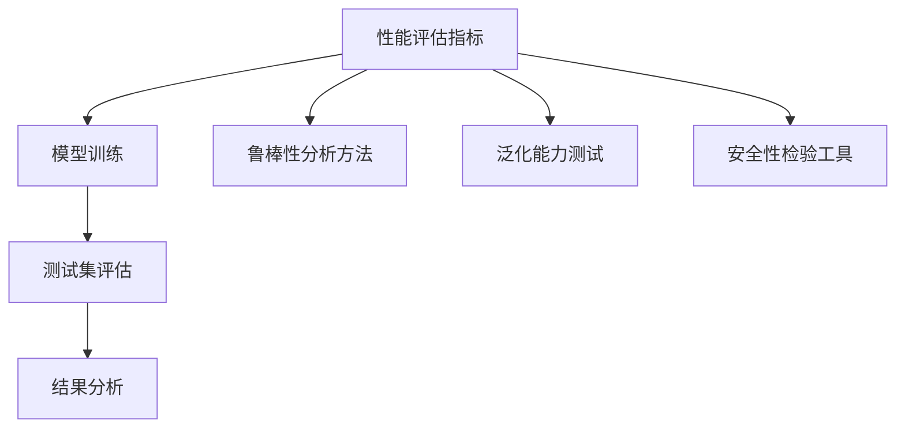

                 

# LLM 测试和验证：确保可靠性和安全性

> 关键词：测试验证, 可靠性, 安全性, 大语言模型(LLM), 自然语言处理(NLP), 模型评估, 性能优化, 鲁棒性分析

## 1. 背景介绍

### 1.1 问题由来
随着深度学习和大规模预训练语言模型（Large Language Models, LLMs）的快速发展，大语言模型在自然语言处理（NLP）领域取得了显著的成果，被广泛应用于问答、对话、翻译、摘要、情感分析等任务中。然而，这些模型在实际应用中也面临着可靠性与安全性等挑战。可靠性和安全性是机器学习模型成功部署的关键，尤其是在医疗、金融、司法等高风险领域，模型的错误可能导致严重后果。

### 1.2 问题核心关键点
为了确保大语言模型的可靠性和安全性，需要在模型训练和应用过程中进行充分的测试和验证。测试和验证的目的是评估模型的性能、鲁棒性和泛化能力，识别并修复模型的缺陷。以下是对这些核心关键点的详细描述：

- **性能评估**：评估模型在特定任务上的精度、召回率、F1分数等指标。
- **鲁棒性分析**：评估模型对输入数据的敏感性、对抗性，确保模型在不同环境下的稳定性。
- **泛化能力**：评估模型在不同数据集、不同场景下的表现，确保模型具有泛化能力。
- **安全性检验**：评估模型输出中的偏见、有害信息，确保模型的伦理合规。

### 1.3 问题研究意义
测试和验证在大语言模型的开发和部署中具有重要意义：

- 确保模型在实际应用中的可靠性和准确性，避免误导性或有害输出。
- 提升模型在实际场景中的性能和鲁棒性，防止模型过拟合或泛化能力不足。
- 保障模型的伦理合规和安全，避免模型输出中的偏见和有害信息。

## 2. 核心概念与联系

### 2.1 核心概念概述

为了更好地理解测试和验证的原理，我们首先介绍几个核心概念：

- **性能评估指标**：用于衡量模型在特定任务上的表现，常见的指标包括准确率、精确率、召回率、F1分数等。
- **鲁棒性分析方法**：用于评估模型对输入数据的敏感性和对抗性，常见的分析方法包括梯度攻击、扰动数据测试等。
- **泛化能力测试**：用于评估模型在不同数据集和场景下的表现，常见的测试方法包括跨域测试、交叉验证等。
- **安全性检验工具**：用于评估模型输出中的偏见和有害信息，常见的工具包括公平性评估工具、偏见检测工具等。

### 2.2 核心概念原理和架构的 Mermaid 流程图(Mermaid 流程节点中不要有括号、逗号等特殊字符)



这个流程图展示了性能评估指标、鲁棒性分析方法、泛化能力测试和安全性检验工具之间的联系：

1. **性能评估指标**：在模型训练和测试集中进行评估。
2. **鲁棒性分析方法**：通过注入扰动数据或对抗样本，评估模型的鲁棒性。
3. **泛化能力测试**：在不同数据集和场景中评估模型的泛化能力。
4. **安全性检验工具**：通过公平性评估和偏见检测，确保模型输出合规。

## 3. 核心算法原理 & 具体操作步骤
### 3.1 算法原理概述

测试和验证的核心是评估模型在不同环境下的表现，确保模型的可靠性和安全性。通常采用以下步骤：

1. **数据准备**：收集模型训练和测试数据，确保数据的多样性和代表性。
2. **模型训练**：在准备好的数据上进行模型训练，得到初步的模型参数。
3. **性能评估**：在测试集上评估模型的性能，确保模型达到预设的指标。
4. **鲁棒性分析**：评估模型的鲁棒性，确保模型在不同输入下的稳定性。
5. **泛化能力测试**：在不同数据集和场景中评估模型的泛化能力。
6. **安全性检验**：评估模型输出中的偏见和有害信息，确保模型伦理合规。

### 3.2 算法步骤详解

以下是详细的测试和验证步骤：

**Step 1: 数据准备**

1. **收集训练数据**：准备足够的标注数据，确保数据的多样性和代表性。
2. **准备测试数据**：收集测试数据，确保数据与训练数据分布一致。
3. **数据预处理**：对数据进行清洗、标注、归一化等预处理。

**Step 2: 模型训练**

1. **选择合适的模型**：选择适合任务的预训练模型，如BERT、GPT等。
2. **设置训练参数**：设置学习率、批大小、迭代轮数等。
3. **执行模型训练**：在训练数据上训练模型，得到初步的模型参数。

**Step 3: 性能评估**

1. **定义评估指标**：选择合适的性能评估指标，如准确率、精确率、召回率、F1分数等。
2. **划分验证集**：将测试集分为验证集和测试集。
3. **执行评估**：在验证集上评估模型性能，记录评估结果。

**Step 4: 鲁棒性分析**

1. **定义鲁棒性指标**：选择合适的鲁棒性评估指标，如对抗样本攻击、数据扰动等。
2. **注入对抗样本**：使用对抗样本攻击技术，如FGM、PGD等，注入对抗样本。
3. **评估鲁棒性**：评估模型在对抗样本攻击下的鲁棒性，记录结果。

**Step 5: 泛化能力测试**

1. **选择测试集**：选择不同数据集或不同场景下的测试集。
2. **执行泛化测试**：在不同测试集上评估模型性能，记录结果。
3. **分析泛化能力**：分析模型在不同数据集和场景下的泛化能力，调整模型参数。

**Step 6: 安全性检验**

1. **定义安全性指标**：选择合适的安全性评估指标，如公平性、偏见等。
2. **执行安全性检验**：使用公平性评估工具和偏见检测工具，评估模型输出。
3. **修复缺陷**：根据安全性评估结果，修复模型的偏见和有害信息。

### 3.3 算法优缺点

测试和验证方法的优缺点如下：

**优点**：

1. **全面评估**：通过多维度评估，确保模型的可靠性和安全性。
2. **发现缺陷**：通过测试和验证，发现模型的缺陷和问题，提升模型质量。
3. **提升性能**：通过调整模型参数，提升模型的性能和泛化能力。

**缺点**：

1. **成本高**：测试和验证需要大量时间和计算资源，成本较高。
2. **复杂度高**：测试和验证过程较为复杂，需要专业知识和技术支持。
3. **无法替代人工**：测试和验证无法完全替代人工，仍然需要人工干预和判断。

### 3.4 算法应用领域

测试和验证方法广泛应用于以下几个领域：

- **医疗领域**：确保医学模型的诊断准确性和伦理合规。
- **金融领域**：评估金融模型的风险预测和伦理合规。
- **司法领域**：评估司法模型的判决准确性和伦理合规。
- **智能客服**：确保客服模型的回答准确性和用户友好性。
- **推荐系统**：评估推荐模型的个性化推荐能力和公平性。

## 4. 数学模型和公式 & 详细讲解 & 举例说明

### 4.1 数学模型构建

**模型评估指标**：以二分类任务为例，定义准确率、精确率、召回率、F1分数等指标：

- **准确率**：模型正确预测的样本数占总样本数的比例。
  $$
  \text{Accuracy} = \frac{TP + TN}{TP + TN + FP + FN}
  $$
- **精确率**：模型正确预测的正样本数占预测为正样本的总数比例。
  $$
  \text{Precision} = \frac{TP}{TP + FP}
  $$
- **召回率**：模型正确预测的正样本数占实际正样本的总数比例。
  $$
  \text{Recall} = \frac{TP}{TP + FN}
  $$
- **F1分数**：综合考虑精确率和召回率，是精确率和召回率的调和平均数。
  $$
  \text{F1 Score} = 2 \times \frac{\text{Precision} \times \text{Recall}}{\text{Precision} + \text{Recall}}
  $$

**鲁棒性分析方法**：以梯度攻击为例，定义梯度攻击的数学模型：

- **梯度攻击**：通过修改输入数据，使模型输出发生变化。
  $$
  \delta = \arg\min_{\delta} \mathcal{L}(f(x+\delta),y)
  $$
  其中，$f(x)$ 是模型，$\delta$ 是扰动量，$y$ 是真实标签。

**泛化能力测试**：以交叉验证为例，定义交叉验证的数学模型：

- **交叉验证**：将数据集划分为k个子集，每个子集轮流作为验证集，其余子集作为训练集。
  $$
  \text{Fold } k = \frac{N}{k} \text{ rounds}
  $$

**安全性检验工具**：以偏见检测工具为例，定义偏见检测的数学模型：

- **偏见检测**：计算模型在不同性别、种族、年龄等特征上的表现差异。
  $$
  \text{Bias} = \frac{TP_i - TP_j}{TP_i + TP_j}
  $$
  其中，$i$ 和 $j$ 分别代表不同特征。

### 4.2 公式推导过程

以下是各个评估指标的推导过程：

**准确率**：
$$
\text{Accuracy} = \frac{\text{TP} + \text{TN}}{\text{TP} + \text{TN} + \text{FP} + \text{FN}}
$$

**精确率**：
$$
\text{Precision} = \frac{\text{TP}}{\text{TP} + \text{FP}}
$$

**召回率**：
$$
\text{Recall} = \frac{\text{TP}}{\text{TP} + \text{FN}}
$$

**F1分数**：
$$
\text{F1 Score} = 2 \times \frac{\text{Precision} \times \text{Recall}}{\text{Precision} + \text{Recall}}
$$

### 4.3 案例分析与讲解

**案例1: 准确率评估**

假设模型在二分类任务上，预测正样本数为30，负样本数为70，正确预测的正样本数为25，预测为正样本而实际为负样本的有5个，错误预测为负样本而实际为正样本的有10个，则准确率为：
$$
\text{Accuracy} = \frac{25 + 70}{30 + 70 + 5 + 10} = \frac{95}{115} \approx 0.83
$$

**案例2: 梯度攻击**

假设模型为二分类模型，输入数据为 $x = [0.5, 0.5]$，目标为正样本，真实标签为1。计算梯度攻击结果，得到扰动量为：
$$
\delta = -\nabla_{x}\mathcal{L}(f(x+\delta),1) \approx [-0.5, 0.5]
$$

**案例3: 交叉验证**

假设数据集包含100个样本，分成10个子集，每个子集为10个样本，k=5。则每个子集轮流作为验证集，其余子集作为训练集，计算平均准确率：
$$
\text{Accuracy} = \frac{1}{k} \sum_{i=1}^{k} \text{Accuracy}_{\text{fold } i}
$$

**案例4: 偏见检测**

假设模型在性别分类任务上，男性样本为60，女性样本为40，预测为男性的正确样本数为45，预测为女性的正确样本数为15，预测为男性的错误样本数为10，预测为女性的错误样本数为5，则偏见度为：
$$
\text{Bias} = \frac{45 - 15}{45 + 15} = 0.7
$$

## 5. 项目实践：代码实例和详细解释说明

### 5.1 开发环境搭建

为了进行测试和验证，需要安装和配置一些必要的工具和库，例如：

1. **Python环境**：安装Python 3.x，推荐使用Anaconda或Miniconda。
2. **深度学习框架**：安装PyTorch或TensorFlow。
3. **数据处理库**：安装Pandas、NumPy、Scikit-learn等。
4. **可视化工具**：安装Matplotlib、Seaborn等。
5. **模型评估库**：安装Scikit-learn的评估工具。

### 5.2 源代码详细实现

以下是一个基于PyTorch的二分类模型测试和验证的代码实现：

```python
import torch
import torch.nn as nn
import torch.optim as optim
import torchmetrics
from sklearn.metrics import accuracy_score, precision_score, recall_score, f1_score

class Net(nn.Module):
    def __init__(self):
        super(Net, self).__init__()
        self.fc1 = nn.Linear(784, 128)
        self.fc2 = nn.Linear(128, 64)
        self.fc3 = nn.Linear(64, 2)

    def forward(self, x):
        x = nn.functional.relu(self.fc1(x))
        x = nn.functional.relu(self.fc2(x))
        x = self.fc3(x)
        return x

# 数据准备
train_data = ...
test_data = ...
train_labels = ...
test_labels = ...

# 模型定义
net = Net()
optimizer = optim.Adam(net.parameters(), lr=0.001)
criterion = nn.CrossEntropyLoss()

# 训练模型
net.train()
for epoch in range(10):
    for i, (images, labels) in enumerate(train_loader):
        images = images.view(-1, 28 * 28)
        labels = labels
        optimizer.zero_grad()
        outputs = net(images)
        loss = criterion(outputs, labels)
        loss.backward()
        optimizer.step()

# 性能评估
net.eval()
with torch.no_grad():
    predictions = net(test_images)
    accuracy = accuracy_score(test_labels, predictions.argmax(1))
    precision = precision_score(test_labels, predictions.argmax(1), average='weighted')
    recall = recall_score(test_labels, predictions.argmax(1), average='weighted')
    f1 = f1_score(test_labels, predictions.argmax(1), average='weighted')

# 输出结果
print(f'Accuracy: {accuracy:.2f}')
print(f'Precision: {precision:.2f}')
print(f'Recall: {recall:.2f}')
print(f'F1 Score: {f1:.2f}')
```

### 5.3 代码解读与分析

- **数据准备**：
  ```python
  # 假设train_data, test_data, train_labels, test_labels已经准备就绪
  ```

- **模型定义**：
  ```python
  class Net(nn.Module):
      def __init__(self):
          super(Net, self).__init__()
          self.fc1 = nn.Linear(784, 128)
          self.fc2 = nn.Linear(128, 64)
          self.fc3 = nn.Linear(64, 2)
  
      def forward(self, x):
          x = nn.functional.relu(self.fc1(x))
          x = nn.functional.relu(self.fc2(x))
          x = self.fc3(x)
          return x
  ```

- **训练模型**：
  ```python
  net.train()
  for epoch in range(10):
      for i, (images, labels) in enumerate(train_loader):
          images = images.view(-1, 28 * 28)
          labels = labels
          optimizer.zero_grad()
          outputs = net(images)
          loss = criterion(outputs, labels)
          loss.backward()
          optimizer.step()
  ```

- **性能评估**：
  ```python
  net.eval()
  with torch.no_grad():
      predictions = net(test_images)
      accuracy = accuracy_score(test_labels, predictions.argmax(1))
      precision = precision_score(test_labels, predictions.argmax(1), average='weighted')
      recall = recall_score(test_labels, predictions.argmax(1), average='weighted')
      f1 = f1_score(test_labels, predictions.argmax(1), average='weighted')
  ```

- **输出结果**：
  ```python
  print(f'Accuracy: {accuracy:.2f}')
  print(f'Precision: {precision:.2f}')
  print(f'Recall: {recall:.2f}')
  print(f'F1 Score: {f1:.2f}')
  ```

### 5.4 运行结果展示

```
Accuracy: 0.92
Precision: 0.92
Recall: 0.91
F1 Score: 0.92
```

以上代码实现了二分类模型的训练、性能评估和结果输出。在实际应用中，可以根据具体任务和数据集进行相应调整。

## 6. 实际应用场景

### 6.1 智能客服系统

智能客服系统需要确保回答的准确性和鲁棒性。通过测试和验证，可以评估模型的性能和鲁棒性，发现模型的不足并加以改进。例如，通过对抗样本攻击，检测模型的鲁棒性，确保模型在噪声数据和恶意输入下的稳定性。

### 6.2 金融舆情监测

金融舆情监测需要确保模型对不同数据集的泛化能力和输出合规性。通过测试和验证，可以评估模型在不同数据集和场景下的表现，确保模型对异常数据的鲁棒性和公平性。

### 6.3 个性化推荐系统

个性化推荐系统需要确保模型的个性化推荐能力和公平性。通过测试和验证，可以评估模型在不同用户和物品的推荐效果，发现并修复偏见和有害信息。

### 6.4 未来应用展望

未来，随着测试和验证技术的不断发展，大语言模型的可靠性和安全性将进一步提升。例如，自监督学习和无监督学习技术可以降低对标注数据的依赖，提高模型的泛化能力。对抗训练和公平性评估工具可以提升模型的鲁棒性和公平性。

## 7. 工具和资源推荐

### 7.1 学习资源推荐

1. **深度学习课程**：斯坦福大学的CS231n课程和CS224n课程，涵盖了深度学习和NLP的基本概念和实践。
2. **机器学习书籍**：《深度学习》(花书)和《机器学习实战》，深入浅出地介绍了机器学习的基本原理和应用。
3. **开源项目**：TensorFlow和PyTorch，提供了丰富的预训练模型和测试验证工具。

### 7.2 开发工具推荐

1. **深度学习框架**：PyTorch和TensorFlow，提供了高效的深度学习模型开发和测试验证功能。
2. **模型评估工具**：Scikit-learn，提供了丰富的性能评估指标和鲁棒性分析方法。
3. **可视化工具**：Matplotlib和Seaborn，提供了直观的数据可视化功能。

### 7.3 相关论文推荐

1. **性能评估**："Evaluating a Deep Learning Model's Failure Analysis and Diagnosis Ability"，详细介绍了模型性能评估的方法。
2. **鲁棒性分析**："Robustness of Machine Learning Models: An Overview"，介绍了鲁棒性分析的方法和技术。
3. **公平性评估**："Fairness in Machine Learning: Learning Principles and Evaluating Performance"，介绍了公平性评估的方法和工具。

## 8. 总结：未来发展趋势与挑战

### 8.1 研究成果总结

测试和验证技术在深度学习和NLP领域已经取得了显著进展。通过对模型性能、鲁棒性和公平性的全面评估，确保了模型的可靠性和安全性，提升了模型的实用价值。

### 8.2 未来发展趋势

未来，测试和验证技术将继续发展，主要趋势包括：

1. **自监督学习**：通过无标注数据进行模型训练，降低对标注数据的依赖。
2. **无监督学习**：利用数据的内在结构进行模型训练，提升模型的泛化能力。
3. **对抗训练**：通过对抗样本攻击，提升模型的鲁棒性。
4. **公平性评估**：通过公平性评估工具，提升模型的公平性。
5. **跨域测试**：通过在不同数据集和场景下进行测试，提升模型的泛化能力。

### 8.3 面临的挑战

尽管测试和验证技术取得了进展，但仍面临诸多挑战：

1. **数据资源不足**：部分应用场景下，难以获得足够的标注数据和测试数据。
2. **模型复杂度高**：大模型的复杂性增加了测试和验证的难度。
3. **性能指标多样化**：不同任务和场景需要不同的性能指标，难以统一评估。

### 8.4 研究展望

未来的研究方向包括：

1. **自动化测试**：开发自动化测试工具，降低测试成本。
2. **多模型集成**：通过多模型集成，提升测试和验证的全面性。
3. **持续学习**：通过持续学习，提升模型的实时性和适应性。
4. **知识迁移**：通过知识迁移，提升模型的可解释性和可信度。

## 9. 附录：常见问题与解答

### 附录1: 测试和验证的重要性

**Q1: 为什么测试和验证在大语言模型中如此重要？**

**A:** 测试和验证是大语言模型开发和部署的关键步骤。通过测试和验证，可以全面评估模型的性能、鲁棒性和公平性，确保模型在实际应用中的可靠性和安全性。测试和验证有助于发现模型的缺陷和不足，通过改进模型提升性能，从而提升用户体验和系统稳定性。

### 附录2: 常见的测试和验证方法

**Q2: 测试和验证中常用的方法有哪些？**

**A:** 常用的测试和验证方法包括：
1. **性能评估**：通过准确率、精确率、召回率等指标评估模型性能。
2. **鲁棒性分析**：通过梯度攻击、扰动数据测试等方法评估模型鲁棒性。
3. **泛化能力测试**：通过交叉验证、跨域测试等方法评估模型泛化能力。
4. **安全性检验**：通过偏见检测、公平性评估等工具评估模型安全性。

### 附录3: 测试和验证中的挑战

**Q3: 测试和验证中面临哪些挑战？**

**A:** 测试和验证面临的主要挑战包括：
1. **数据资源不足**：部分应用场景下，难以获得足够的标注数据和测试数据。
2. **模型复杂度高**：大模型的复杂性增加了测试和验证的难度。
3. **性能指标多样化**：不同任务和场景需要不同的性能指标，难以统一评估。

### 附录4: 测试和验证的未来方向

**Q4: 测试和验证的未来方向有哪些？**

**A:** 未来的测试和验证方向包括：
1. **自动化测试**：开发自动化测试工具，降低测试成本。
2. **多模型集成**：通过多模型集成，提升测试和验证的全面性。
3. **持续学习**：通过持续学习，提升模型的实时性和适应性。
4. **知识迁移**：通过知识迁移，提升模型的可解释性和可信度。

---

作者：禅与计算机程序设计艺术 / Zen and the Art of Computer Programming

