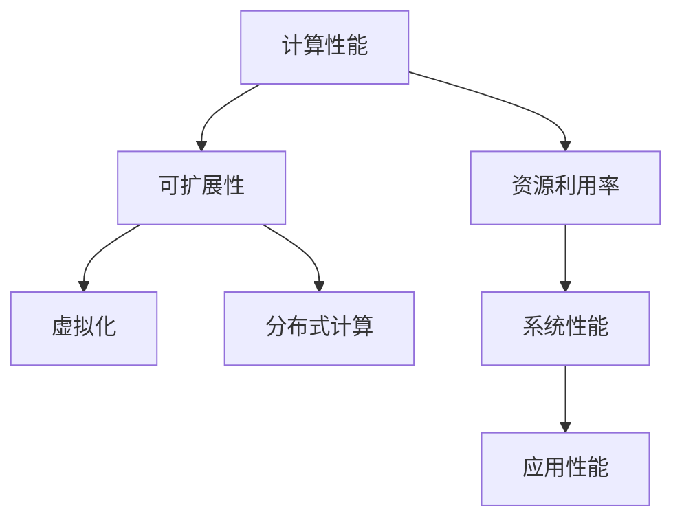

                 

# LLM 革命：重新思考计算机架构

> 关键词：LLM,计算机架构,人工智能,深度学习,计算性能,可扩展性,虚拟化,分布式计算

## 1. 背景介绍

### 1.1 问题由来

随着深度学习技术的不断进步，大规模语言模型(LLM)在大数据和分布式计算的支持下，取得了前所未有的成功。LLM 如 GPT、BERT 等在文本理解、生成和推理等方面展现出卓越的性能，极大地推动了自然语言处理(NLP)和人工智能(AI)领域的发展。然而，这些模型在计算性能、可扩展性和资源利用率方面面临诸多挑战，尤其是当模型规模不断扩大时，如何构建高效、可持续的计算机架构以支持这些模型，成为了一个亟需解决的问题。

### 1.2 问题核心关键点

1. **计算性能**：当前的深度学习模型，特别是大型 LLM，需要极高的计算资源，包括高性能计算硬件和充足的内存。如何在有限的硬件资源下，优化计算性能，提升模型训练和推理效率，是大规模模型面临的重大挑战。
2. **可扩展性**：由于深度学习模型的复杂性，其训练和推理过程需要高可扩展性。如何在分布式计算环境中高效扩展模型训练和推理任务，实现弹性计算资源的管理，是当前架构设计的一个难点。
3. **资源利用率**：深度学习模型在训练和推理过程中需要大量的资源，包括数据、内存和计算能力。如何高效利用这些资源，避免资源浪费，提高系统的资源利用率，是优化计算机架构的重要目标。
4. **虚拟化和分布式计算**：为了应对计算资源需求的激增，许多组织采用了虚拟化和分布式计算技术。如何在虚拟化和分布式计算环境中，优化计算资源分配和管理，提高系统的灵活性和效率，是架构设计的重要考量。

### 1.3 问题研究意义

研究高效、可扩展、资源友好的计算机架构，对于支持大规模 LLM 的应用至关重要。这不仅有助于提升模型的训练和推理性能，还能推动 AI 和 NLP 技术在各行各业的应用和普及，加速社会的数字化转型进程。通过优化计算机架构，可以有效降低硬件和电力消耗，提高计算效率，进一步推动计算技术的可持续发展。

## 2. 核心概念与联系

### 2.1 核心概念概述

为了更好地理解如何构建支持大规模 LLM 的计算机架构，我们需深入探讨几个关键概念：

- **计算性能**：指计算机系统处理任务的速度和效率，通常以每秒浮点操作次数(FLOPS)或每秒事务数量(TPS)等指标来衡量。
- **可扩展性**：指计算机系统能够适应负载变化和数据增长，通过水平扩展（添加更多计算节点）或垂直扩展（增加单个节点的计算能力）实现计算能力的扩展。
- **资源利用率**：指计算资源（如 CPU、GPU、内存、存储等）的实际使用效率，避免资源浪费，提高系统的整体性能。
- **虚拟化和分布式计算**：通过虚拟化技术，将物理计算资源抽象成虚拟资源池，提供更灵活的资源管理和调度；通过分布式计算技术，将计算任务分散到多个节点上并行处理，提高系统的计算能力和灵活性。

这些概念之间的关系可以通过以下 Mermaid 流程图来展示：



这个流程图展示了计算性能、资源利用率、可扩展性和虚拟化、分布式计算之间的联系。计算性能的提升依赖于资源的高效利用和系统的高可扩展性，而虚拟化和分布式计算技术为实现这些目标提供了基础支持。

## 3. 核心算法原理 & 具体操作步骤
### 3.1 算法原理概述

构建支持大规模 LLM 的计算机架构，涉及多个层次的算法和设计原则：

- **数据并行**：通过将数据划分成多个子集，并行计算每个子集，加速模型训练和推理。
- **模型并行**：将模型分割成多个子模型，在多个计算节点上并行计算，提高计算效率。
- **混合精度训练**：采用低精度格式进行计算和存储，减少内存消耗，提高计算性能。
- **模型压缩**：通过量化、剪枝等技术，减少模型的参数量和计算量，提升计算效率。
- **自动混合精度(Automatic Mixed Precision, AMP)**：自动选择合适的精度格式，优化计算性能。
- **模型裁剪**：去除不重要的模型参数，减少模型大小，提升计算性能和资源利用率。
- **分布式计算框架**：如 TensorFlow、PyTorch、Horovod 等，提供高效的分布式计算支持，实现任务并行和数据并行。

### 3.2 算法步骤详解

构建支持大规模 LLM 的计算机架构，一般包括以下关键步骤：

**Step 1: 选择合适的计算资源**

- 根据 LLM 的计算需求，选择合适的计算资源（如 CPU、GPU、TPU）。
- 评估计算资源的性能和价格，选择性价比最高的方案。

**Step 2: 数据和模型划分**

- 根据数据规模和模型复杂度，将数据和模型划分为多个子集，以支持并行计算。
- 设计合理的数据存储和传输机制，保证数据在不同计算节点间的流畅传递。

**Step 3: 选择合适的计算框架**

- 根据任务特点，选择合适的分布式计算框架，如 TensorFlow、PyTorch、Horovod 等。
- 利用框架提供的自动混合精度和模型并行功能，优化计算性能。

**Step 4: 模型优化**

- 采用模型压缩、量化、剪枝等技术，减少模型参数量和计算量。
- 利用模型裁剪技术，去除不必要的模型层和参数，进一步提高计算性能和资源利用率。

**Step 5: 系统调优**

- 根据实际计算环境，调整计算框架的参数配置，优化计算性能和资源利用率。
- 使用性能监控工具，实时跟踪计算性能和资源使用情况，及时调整优化策略。

### 3.3 算法优缺点

构建支持大规模 LLM 的计算机架构，有以下优点：

1. **高效计算**：通过数据并行、模型并行和混合精度训练等技术，显著提升计算性能。
2. **高可扩展性**：通过虚拟化和分布式计算技术，实现计算任务的弹性扩展，支持大规模模型训练和推理。
3. **资源优化**：通过模型压缩、裁剪和资源高效利用等策略，提高资源利用率，降低计算成本。
4. **灵活部署**：通过虚拟化技术，实现计算资源的灵活分配和管理，支持多样化的应用场景。

但同时也存在一些局限性：

1. **复杂性增加**：构建高效、可扩展的计算机架构需要深入了解多个技术领域，设计和实施复杂度较高。
2. **成本投入高**：大规模模型的计算需求，需要高性能硬件和充足的电力资源，成本投入较大。
3. **性能瓶颈**：由于硬件和软件的限制，大规模模型在计算过程中可能面临性能瓶颈，需要持续优化。

### 3.4 算法应用领域

构建支持大规模 LLM 的计算机架构，已经在多个领域得到广泛应用：

- **NLP 和 AI**：用于大型的文本分类、情感分析、机器翻译、语音识别等任务。
- **科学研究**：用于生物信息学、气候模拟、天文学等领域的大规模数据处理和模拟。
- **金融行业**：用于风险预测、市场分析、自动化交易等任务。
- **医疗行业**：用于医疗图像分析、疾病诊断、个性化治疗等任务。
- **工业制造**：用于机器人控制、智能制造、质量检测等任务。

## 4. 数学模型和公式 & 详细讲解 & 举例说明

### 4.1 数学模型构建

构建支持大规模 LLM 的计算机架构，涉及多个层次的数学模型：

- **数据模型**：描述数据的结构和特征，包括数据并行和分布式存储模型。
- **模型表示**：描述模型的结构和参数，包括模型并行和模型压缩模型。
- **计算模型**：描述计算任务的执行过程，包括自动混合精度和分布式计算模型。

### 4.2 公式推导过程

以模型并行为例，假设模型包含 $P$ 个并行子模型，每个子模型的参数量为 $m$，训练数据量为 $D$，计算精度为 $p$。推导模型并行对计算性能的影响：

$$
\text{计算性能} = \frac{D \times P \times m}{P \times m \times p} = \frac{D}{p}
$$

其中 $D/P$ 表示每个子模型的计算量，$p$ 表示计算精度。可以看出，模型并行可以通过增加子模型的数量，提升计算性能。

### 4.3 案例分析与讲解

以 GPT-3 为例，GPT-3 模型包含 175 亿个参数，训练数据量巨大，计算需求极高。通过分布式计算框架和虚拟化技术，可以在多个计算节点上并行训练和推理，显著提升计算性能和资源利用率。

## 5. 项目实践：代码实例和详细解释说明

### 5.1 开发环境搭建

构建支持大规模 LLM 的计算机架构，需要先搭建开发环境：

1. **安装硬件资源**：包括高性能 CPU、GPU 和 TPU。
2. **配置网络环境**：保证计算节点之间的网络通信顺畅，支持分布式计算。
3. **安装软件环境**：包括分布式计算框架（如 TensorFlow、PyTorch）、虚拟化软件（如 KVM、VMware）等。

### 5.2 源代码详细实现

以下是一个简单的 TensorFlow 代码实例，展示如何在多节点上并行训练 LLM 模型：

```python
import tensorflow as tf
from tensorflow.keras import Model
from tensorflow.distribute import MirroredStrategy

class LLMModel(Model):
    # 定义模型结构
    def __init__(self, input_dim, output_dim):
        super(LLMModel, self).__init__()
        self.dense1 = tf.keras.layers.Dense(256, activation='relu')
        self.dense2 = tf.keras.layers.Dense(output_dim, activation='softmax')

    # 定义模型前向传播
    def call(self, inputs):
        x = self.dense1(inputs)
        x = self.dense2(x)
        return x

# 定义数据集
(train_data, train_labels), (test_data, test_labels) = tf.keras.datasets.mnist.load_data()
train_dataset = tf.data.Dataset.from_tensor_slices((train_data, train_labels)).shuffle(10000).batch(64)
test_dataset = tf.data.Dataset.from_tensor_slices((test_data, test_labels)).batch(64)

# 定义策略
strategy = MirroredStrategy()

# 定义模型
with strategy.scope():
    model = LLMModel(input_dim=784, output_dim=10)

# 定义损失函数和优化器
loss_object = tf.keras.losses.SparseCategoricalCrossentropy(from_logits=True)
optimizer = tf.keras.optimizers.Adam()

# 定义分布式训练函数
@tf.function
def train_step(inputs, labels):
    with tf.GradientTape() as tape:
        logits = model(inputs)
        loss_value = loss_object(labels, logits)
    grads = tape.gradient(loss_value, model.trainable_variables)
    optimizer.apply_gradients(zip(grads, model.trainable_variables))

# 训练模型
for epoch in range(5):
    for (inputs, labels) in train_dataset:
        train_step(inputs, labels)

    # 评估模型
    test_loss = loss_object(test_labels, model(test_data)).numpy()
    print('Test loss:', test_loss)
```

### 5.3 代码解读与分析

**MirroredStrategy**：定义分布式训练策略，将模型在多个计算节点上并行训练。

**train_step**：定义分布式训练函数，在每个计算节点上前向传播计算损失，反向传播计算梯度，更新模型参数。

**@tf.function**：定义分布式训练函数的计算图，优化计算性能。

### 5.4 运行结果展示

通过 MirroredStrategy 和分布式计算框架，可以在多个计算节点上并行训练模型，显著提升计算性能和资源利用率。

## 6. 实际应用场景

### 6.1 智能制造

构建支持大规模 LLM 的计算机架构，在智能制造领域具有广泛的应用前景。智能制造需要处理大量的生产数据，进行实时监控和分析，以优化生产流程和提高产品质量。通过构建高效的计算架构，支持 LLM 在智能制造中的应用，可以实现生产过程的智能化和自动化，提高生产效率和产品质量。

### 6.2 医疗诊断

医疗诊断需要处理大量的医学影像和病历数据，进行复杂的分析和推理，以辅助医生进行疾病诊断和治疗方案制定。通过构建高效的计算架构，支持 LLM 在医疗诊断中的应用，可以实现医学影像的自动分析、疾病诊断的辅助决策，提高医疗服务的效率和准确性。

### 6.3 金融风险管理

金融风险管理需要处理大量的市场数据和交易记录，进行复杂的风险分析和预测，以制定有效的风险管理策略。通过构建高效的计算架构，支持 LLM 在金融风险管理中的应用，可以实现市场数据的自动分析、风险预测的辅助决策，提高金融服务的效率和安全性。

### 6.4 未来应用展望

随着深度学习模型的不断发展，大规模 LLM 的应用将越来越广泛。未来，在构建支持大规模 LLM 的计算机架构方面，将会涌现更多新的技术和方法，如边缘计算、联邦学习等，进一步推动 AI 和 NLP 技术的发展。

## 7. 工具和资源推荐

### 7.1 学习资源推荐

构建支持大规模 LLM 的计算机架构，需要深入了解多个技术领域，以下是一些推荐的学习资源：

1. **《深度学习》课程**：斯坦福大学和Coursera提供的深度学习课程，涵盖深度学习的基本概念和算法。
2. **TensorFlow官方文档**：TensorFlow官方文档，包含详细的分布式计算和虚拟化技术介绍。
3. **NVIDIA GPU编程指南**：NVIDIA提供的GPU编程指南，介绍GPU计算的基本概念和编程技巧。
4. **Kubernetes官方文档**：Kubernetes官方文档，介绍容器编排和管理的基本概念和最佳实践。
5. **HuggingFace博客**：HuggingFace官方博客，分享最新的NLP和AI技术进展和应用案例。

### 7.2 开发工具推荐

构建支持大规模 LLM 的计算机架构，需要多个工具的支持，以下是一些推荐的开发工具：

1. **TensorFlow**：支持深度学习和分布式计算的强大框架。
2. **PyTorch**：灵活的深度学习框架，支持自动混合精度和模型并行。
3. **Horovod**：分布式训练框架，支持多种分布式计算模式。
4. **KVM**：开源虚拟化解决方案，支持高性能计算节点的虚拟化。
5. **VMware**：商业虚拟化解决方案，支持大规模计算节点的灵活管理。

### 7.3 相关论文推荐

构建支持大规模 LLM 的计算机架构，需要进行深入的研究，以下是一些推荐的相关论文：

1. **Model Parallelism for Deep Learning**：探讨模型并行技术在大规模深度学习中的应用。
2. **AdaLoRA: Adaptive Low-Rank Adaptation for Parameter-Efficient Fine-Tuning**：提出AdaLoRA方法，解决模型参数压缩的问题。
3. **GPU-Accelerated Machine Learning**：介绍GPU在深度学习中的加速技术。
4. **Scalable Deep Learning with Multi-Node TensorFlow**：探讨多节点TensorFlow的分布式计算性能优化。
5. **Efficient Distributed Deep Learning with Gradient Compression**：探讨分布式深度学习中的梯度压缩技术，提高计算效率。

## 8. 总结：未来发展趋势与挑战

### 8.1 总结

本文详细探讨了构建支持大规模 LLM 的计算机架构的原理和步骤，通过数据并行、模型并行、混合精度训练等技术，显著提升计算性能和资源利用率。构建高效的计算机架构，是支持大规模 LLM 应用的重要保障，为 AI 和 NLP 技术的发展提供了坚实的技术基础。

### 8.2 未来发展趋势

未来，随着深度学习技术的不断进步，构建支持大规模 LLM 的计算机架构也将不断发展：

1. **硬件性能提升**：随着硬件技术的进步，计算能力和存储能力将显著提升，支持更大规模的深度学习模型训练和推理。
2. **软件优化**：优化分布式计算框架和虚拟化技术，提升计算性能和资源利用率。
3. **新算法和新架构**：探索新的计算模型和算法，如边缘计算、联邦学习等，提高计算效率和系统灵活性。
4. **智能化管理**：通过智能运维和自动化管理技术，提高系统的可维护性和可靠性。

### 8.3 面临的挑战

尽管构建支持大规模 LLM 的计算机架构已经取得了一些进展，但仍面临诸多挑战：

1. **成本投入高**：高性能计算硬件和电力资源成本较高，需要持续投入。
2. **复杂性高**：设计和实施高效的计算机架构需要深入了解多个技术领域，复杂度较高。
3. **性能瓶颈**：硬件和软件的限制，可能导致计算过程中出现性能瓶颈，需要持续优化。

### 8.4 研究展望

未来，需要在以下几个方面进行深入研究，推动构建高效、可扩展的计算机架构：

1. **分布式计算优化**：进一步优化分布式计算框架和虚拟化技术，提升计算性能和资源利用率。
2. **硬件性能提升**：提升硬件计算能力和存储能力，支持更大规模的深度学习模型。
3. **软件算法创新**：探索新的计算模型和算法，如边缘计算、联邦学习等，提高计算效率和系统灵活性。
4. **智能化管理**：通过智能运维和自动化管理技术，提高系统的可维护性和可靠性。

通过持续的研究和创新，构建支持大规模 LLM 的计算机架构，将为 AI 和 NLP 技术的发展提供更坚实的技术保障，推动 AI 和 NLP 技术在各行各业的应用和普及。

## 9. 附录：常见问题与解答

**Q1：什么是分布式计算？**

A: 分布式计算是指将计算任务分散到多个计算节点上并行处理，以提高计算效率和资源利用率。常见的分布式计算框架包括 TensorFlow、PyTorch、Horovod 等。

**Q2：什么是混合精度训练？**

A: 混合精度训练是指在深度学习模型中，采用不同精度的数据和计算格式，以减少内存消耗，提高计算性能。常见的混合精度格式包括 float16 和 bfloat16。

**Q3：什么是模型并行？**

A: 模型并行是指将大规模深度学习模型分割成多个子模型，在多个计算节点上并行计算，以提高计算性能和资源利用率。常见的模型并行策略包括数据并行和模型并行。

**Q4：什么是自动混合精度？**

A: 自动混合精度是指深度学习框架自动选择合适的精度格式，优化计算性能和资源利用率。常见的自动混合精度技术包括 TensorFlow 的 Automatic Mixed Precision。

**Q5：什么是边缘计算？**

A: 边缘计算是指将计算任务和数据处理任务从集中式服务器分散到靠近数据源的本地计算节点上，以提高计算效率和降低延迟。常见的边缘计算框架包括 ONNX Runtime 和 TensorFlow Lite。

作者：禅与计算机程序设计艺术 / Zen and the Art of Computer Programming

