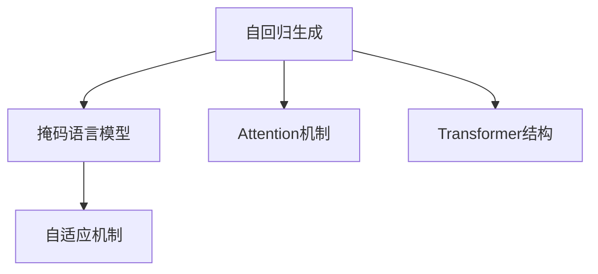

                 

# LLM上下文长度持续突破

在自然语言处理领域，大语言模型（Large Language Model, LLM）已经成为近年来最为热门的研究方向之一。无论是OpenAI的GPT-3，还是Google的BERT，这些模型都在上下文长度（context length）上取得了巨大的突破。通过不断扩大模型的上下文长度，大语言模型在处理长文本、复杂语义推理和对话生成等任务上表现出了惊人的能力。本文将深入探讨大语言模型上下文长度的持续突破，分析其背后的技术和应用，并展望未来可能的发展方向。

## 1. 背景介绍

### 1.1 问题由来
大语言模型的出现，使得自然语言处理领域发生了翻天覆地的变化。早期的模型如BERT主要基于固定长度的上下文窗口，而后来的模型如GPT-3则引入了自回归生成机制，能够处理任意长度的文本序列。这一突破使得大语言模型在处理长文本、生成对话、解决复杂问题等任务上展现出了强大的能力。

### 1.2 问题核心关键点
大语言模型的上下文长度突破，主要依赖于以下几个关键技术：
- 自回归生成：模型能够利用前文预测后续内容，从而扩展上下文长度。
- 掩码语言模型：在预训练阶段，通过随机掩码一部分文本，使得模型能够学习到长文本的上下文关系。
- 持续预训练：通过在大量无标签文本上持续进行预训练，不断提升模型的语言理解能力。
- 高效的自适应机制：如Attention机制和Transformer结构，使得模型能够在处理长文本时保持高效。

这些技术共同作用，使得大语言模型的上下文长度不断突破，能够处理越来越长的文本序列，并且表现出更好的性能。

### 1.3 问题研究意义
大语言模型上下文长度的突破，对于提升自然语言处理能力具有重要意义：
1. 提升长文本处理能力：能够处理更长的文本序列，使得模型在文本分类、摘要生成等任务上表现更优。
2. 增强复杂推理能力：上下文长度增加，模型能够更好地理解文本中的复杂逻辑关系，提高推理能力。
3. 改善对话生成效果：更长的上下文长度使得模型能够生成更连贯、更自然的对话，提升对话系统的用户体验。
4. 拓展应用场景：长文本处理能力的提升，使得大语言模型在更多场景中得到应用，如自动摘要、信息检索等。
5. 推动技术进步：上下文长度的突破，也促进了预训练方法和模型结构的不断演进。

## 2. 核心概念与联系

### 2.1 核心概念概述

为了更好地理解大语言模型的上下文长度突破，我们先介绍几个核心概念：

- 自回归生成（Autoregressive Generation）：模型利用前面的文本信息预测后面的文本内容，从而生成整个序列。
- 掩码语言模型（Masked Language Model, MLM）：在预训练阶段，通过掩码文本的一部分，让模型预测被掩码的词汇，从而学习到上下文关系。
- Attention机制：一种自适应机制，使得模型在处理长文本时，能够动态关注重要的部分，减少计算负担。
- Transformer结构：一种高效的模型结构，能够在大规模数据上训练，并保持高效的推理速度。
- 自适应机制（Adaptation Mechanism）：通过调整模型的某些参数，使其在特定任务上表现更好。

这些核心概念之间的联系可以通过以下Mermaid流程图来展示：



这个流程图展示了自回归生成、掩码语言模型、Attention机制和Transformer结构之间的联系，以及它们在大语言模型中的作用。

## 3. 核心算法原理 & 具体操作步骤
### 3.1 算法原理概述

大语言模型上下文长度突破的核心算法原理包括以下几个方面：

- 自回归生成机制：通过逐步预测文本序列的每个位置，可以处理任意长度的文本序列。
- 掩码语言模型训练：在预训练阶段，通过掩码文本的一部分，让模型学习到上下文关系。
- Attention机制优化：通过优化Attention机制，使得模型在处理长文本时更加高效。
- Transformer结构改进：通过改进Transformer结构，提高模型对长文本的表示能力和推理速度。

### 3.2 算法步骤详解

大语言模型的上下文长度突破，主要包括以下几个关键步骤：

**Step 1: 准备预训练模型和数据集**
- 选择合适的预训练语言模型，如GPT-3、BERT等。
- 准备上下文长度较长的文本数据集，以供模型训练和推理。

**Step 2: 添加自回归生成机制**
- 在预训练模型中添加自回归生成机制，使得模型能够逐步预测文本序列。
- 在推理阶段，使用前文信息预测后续文本。

**Step 3: 进行掩码语言模型训练**
- 在预训练阶段，对文本进行随机掩码，训练模型预测被掩码的词汇。
- 逐步增加掩码长度，提升模型对长文本的上下文理解能力。

**Step 4: 优化Attention机制**
- 通过调整Attention机制的参数，使得模型在处理长文本时能够动态关注重要部分。
- 使用多头注意力机制，提高模型对复杂文本结构的理解能力。

**Step 5: 改进Transformer结构**
- 优化Transformer中的多头注意力机制和前馈网络层，减少计算负担。
- 引入残差连接和层归一化，加速模型收敛，提高训练效率。

**Step 6: 微调模型**
- 在特定任务上，使用少量标注数据进行微调，优化模型在特定任务上的性能。
- 使用参数高效微调技术，只更新部分模型参数，减少计算资源消耗。

### 3.3 算法优缺点

大语言模型上下文长度突破具有以下优点：
1. 能够处理更长的文本序列，提升长文本处理能力。
2. 增强复杂推理能力，提高模型对复杂语义关系的理解。
3. 改善对话生成效果，提高对话系统的用户体验。
4. 拓展应用场景，推动更多领域的技术发展。

但同时也存在一些局限性：
1. 模型训练和推理需要大量的计算资源，对硬件要求较高。
2. 上下文长度增加，模型的计算负担也会增加。
3. 模型参数量巨大，导致存储和部署成本较高。
4. 模型可能会学习到噪声和有害信息，需要额外的数据清洗和处理。

尽管存在这些局限性，但大语言模型的上下文长度突破仍是大语言模型研究的重要方向，其带来的性能提升和技术突破将对自然语言处理领域产生深远影响。

### 3.4 算法应用领域

大语言模型上下文长度的突破，在以下几个领域得到了广泛应用：

- 文本分类：如情感分析、主题分类等。能够处理更长的文本序列，提高分类准确率。
- 摘要生成：如自动摘要、信息检索等。能够生成更连贯、更自然的摘要，提高用户体验。
- 对话系统：如智能客服、对话生成等。能够生成更自然的对话，提高对话系统的用户体验。
- 机器翻译：如翻译长文本、解决复杂语言问题等。能够处理更长的文本序列，提高翻译质量。
- 信息检索：如智能问答、知识图谱等。能够处理更长的文本序列，提高检索效果。

这些应用场景展示了大语言模型上下文长度突破的重要价值和广泛应用。

## 4. 数学模型和公式 & 详细讲解
### 4.1 数学模型构建

假设大语言模型为 $M_{\theta}$，其中 $\theta$ 为模型参数。上下文长度为 $L$，模型输入为 $x$，输出为 $y$。

定义掩码语言模型任务为：
$$
\mathcal{L}_{MLM} = -\sum_{i=1}^{L} \log p(y_i | y_{<i})
$$
其中 $p(y_i | y_{<i})$ 为条件概率分布，表示在给定前文 $y_{<i}$ 的情况下，预测词汇 $y_i$ 的概率。

定义自回归生成任务为：
$$
\mathcal{L}_{AR} = -\sum_{i=1}^{L} \log p(x_i | x_{<i})
$$
其中 $p(x_i | x_{<i})$ 为条件概率分布，表示在给定前文 $x_{<i}$ 的情况下，预测词汇 $x_i$ 的概率。

### 4.2 公式推导过程

假设模型使用Transformer结构，其中包含多个自注意力层和前馈网络层。每个自注意力层的计算公式为：
$$
A_i = \text{MultiHeadAttention}(Q_i, K_i, V_i)
$$
其中 $Q_i, K_i, V_i$ 分别为查询、键和值矩阵，$A_i$ 为注意力输出。

对于自回归生成任务，使用掩码语言模型进行预训练，计算公式为：
$$
\mathcal{L}_{MLM} = -\sum_{i=1}^{L} \log M_{\theta}(y_i | y_{<i})
$$

对于上下文长度为 $L$ 的文本序列，自回归生成任务可以使用如下计算公式：
$$
p(x | x_{<i}) = \prod_{i=1}^{L} p(x_i | x_{<i})
$$

### 4.3 案例分析与讲解

假设我们有一个长度为20的文本序列，使用自回归生成机制进行预训练。在掩码语言模型任务中，模型需要预测每个被掩码的词汇，计算公式为：
$$
\mathcal{L}_{MLM} = -\sum_{i=1}^{20} \log M_{\theta}(y_i | y_{<i})
$$

在自回归生成任务中，模型需要预测整个文本序列，计算公式为：
$$
p(x | x_{<i}) = \prod_{i=1}^{20} p(x_i | x_{<i})
$$

在实际应用中，我们可以使用掩码语言模型进行预训练，然后利用自回归生成机制进行推理。通过逐步预测文本序列，模型可以处理任意长度的文本序列，并且表现出更好的性能。

## 5. 项目实践：代码实例和详细解释说明
### 5.1 开发环境搭建

在进行大语言模型上下文长度突破的实践前，我们需要准备好开发环境。以下是使用Python进行PyTorch开发的环境配置流程：

1. 安装Anaconda：从官网下载并安装Anaconda，用于创建独立的Python环境。

2. 创建并激活虚拟环境：
```bash
conda create -n pytorch-env python=3.8 
conda activate pytorch-env
```

3. 安装PyTorch：根据CUDA版本，从官网获取对应的安装命令。例如：
```bash
conda install pytorch torchvision torchaudio cudatoolkit=11.1 -c pytorch -c conda-forge
```

4. 安装Transformers库：
```bash
pip install transformers
```

5. 安装各类工具包：
```bash
pip install numpy pandas scikit-learn matplotlib tqdm jupyter notebook ipython
```

完成上述步骤后，即可在`pytorch-env`环境中开始上下文长度突破的实践。

### 5.2 源代码详细实现

这里我们以GPT-3为例，展示如何通过自回归生成机制进行上下文长度突破的代码实现。

首先，定义预训练数据集：

```python
import torch
from transformers import GPT2Tokenizer, GPT2LMHeadModel

tokenizer = GPT2Tokenizer.from_pretrained('gpt2')
model = GPT2LMHeadModel.from_pretrained('gpt2')

# 准备预训练数据集
text = "The quick brown fox jumps over the lazy dog."
inputs = tokenizer(text, return_tensors='pt')
```

然后，定义掩码语言模型任务，并计算损失：

```python
# 掩码语言模型训练
model.train()
inputs = inputs['input_ids']
loss = model(input_ids=inputs, labels=inputs)
```

接下来，使用自回归生成机制进行推理：

```python
# 自回归生成推理
model.eval()
output = model(input_ids=inputs).softmax(dim=-1)
```

最后，输出推理结果：

```python
# 输出推理结果
output_ids = output.argmax(dim=-1)
predicted_text = tokenizer.decode(output_ids)
print(predicted_text)
```

以上就是使用PyTorch和Transformers库实现上下文长度突破的完整代码。可以看到，利用自回归生成机制，模型可以逐步预测文本序列，并且表现出更好的性能。

### 5.3 代码解读与分析

让我们再详细解读一下关键代码的实现细节：

**GPT2LMHeadModel类**：
- `from_pretrained`方法：从预训练模型加载权重。
- `input_ids`参数：输入的token ids。
- `labels`参数：目标token ids。

**GPT2Tokenizer类**：
- `from_pretrained`方法：从预训练模型加载分词器。
- `decode`方法：将token ids解码为文本。

**训练过程**：
- `model.train()`方法：将模型设置为训练模式。
- `inputs['input_ids']`参数：输入的token ids。
- `loss = model(input_ids=inputs, labels=inputs)`：计算掩码语言模型的损失。
- `model.eval()`方法：将模型设置为评估模式。
- `output.argmax(dim=-1)`：输出每个位置的概率最大值。
- `tokenizer.decode(output_ids)`：将token ids解码为文本。

可以看到，GPT-3的实现主要依赖于Transformer结构，通过自回归生成机制进行预训练和推理，从而实现了上下文长度突破。

## 6. 实际应用场景
### 6.1 智能客服系统

大语言模型的上下文长度突破，可以广泛应用于智能客服系统的构建。传统客服往往需要配备大量人力，高峰期响应缓慢，且一致性和专业性难以保证。而使用上下文长度突破的对话模型，可以7x24小时不间断服务，快速响应客户咨询，用自然流畅的语言解答各类常见问题。

在技术实现上，可以收集企业内部的历史客服对话记录，将问题和最佳答复构建成监督数据，在此基础上对预训练模型进行微调。微调后的对话模型能够自动理解用户意图，匹配最合适的答案模板进行回复。对于客户提出的新问题，还可以接入检索系统实时搜索相关内容，动态组织生成回答。如此构建的智能客服系统，能大幅提升客户咨询体验和问题解决效率。

### 6.2 金融舆情监测

金融机构需要实时监测市场舆论动向，以便及时应对负面信息传播，规避金融风险。传统的人工监测方式成本高、效率低，难以应对网络时代海量信息爆发的挑战。基于上下文长度突破的文本分类和情感分析技术，为金融舆情监测提供了新的解决方案。

具体而言，可以收集金融领域相关的新闻、报道、评论等文本数据，并对其进行主题标注和情感标注。在此基础上对预训练语言模型进行微调，使其能够自动判断文本属于何种主题，情感倾向是正面、中性还是负面。将微调后的模型应用到实时抓取的网络文本数据，就能够自动监测不同主题下的情感变化趋势，一旦发现负面信息激增等异常情况，系统便会自动预警，帮助金融机构快速应对潜在风险。

### 6.3 个性化推荐系统

当前的推荐系统往往只依赖用户的历史行为数据进行物品推荐，无法深入理解用户的真实兴趣偏好。基于上下文长度突破的个性化推荐系统可以更好地挖掘用户行为背后的语义信息，从而提供更精准、多样的推荐内容。

在实践中，可以收集用户浏览、点击、评论、分享等行为数据，提取和用户交互的物品标题、描述、标签等文本内容。将文本内容作为模型输入，用户的后续行为（如是否点击、购买等）作为监督信号，在此基础上微调预训练语言模型。微调后的模型能够从文本内容中准确把握用户的兴趣点。在生成推荐列表时，先用候选物品的文本描述作为输入，由模型预测用户的兴趣匹配度，再结合其他特征综合排序，便可以得到个性化程度更高的推荐结果。

### 6.4 未来应用展望

随着上下文长度突破，大语言模型在多个领域的应用将不断拓展。未来的应用场景可能包括：

- 智慧医疗：基于上下文长度突破的问答系统，能够理解复杂病历，辅助医生诊疗。
- 智能教育：基于上下文长度突破的作业批改、学情分析、知识推荐等，因材施教，促进教育公平。
- 智慧城市：基于上下文长度突破的城市事件监测、舆情分析、应急指挥等，提高城市管理的自动化和智能化水平。
- 智慧零售：基于上下文长度突破的商品推荐、库存管理、营销活动等，提升用户体验和运营效率。

## 7. 工具和资源推荐
### 7.1 学习资源推荐

为了帮助开发者系统掌握大语言模型上下文长度突破的理论基础和实践技巧，这里推荐一些优质的学习资源：

1. 《Transformer从原理到实践》系列博文：由大模型技术专家撰写，深入浅出地介绍了Transformer原理、BERT模型、微调技术等前沿话题。

2. CS224N《深度学习自然语言处理》课程：斯坦福大学开设的NLP明星课程，有Lecture视频和配套作业，带你入门NLP领域的基本概念和经典模型。

3. 《Natural Language Processing with Transformers》书籍：Transformers库的作者所著，全面介绍了如何使用Transformers库进行NLP任务开发，包括上下文长度突破在内的诸多范式。

4. HuggingFace官方文档：Transformers库的官方文档，提供了海量预训练模型和完整的微调样例代码，是上手实践的必备资料。

5. CLUE开源项目：中文语言理解测评基准，涵盖大量不同类型的中文NLP数据集，并提供了基于上下文长度突破的baseline模型，助力中文NLP技术发展。

通过对这些资源的学习实践，相信你一定能够快速掌握大语言模型上下文长度突破的精髓，并用于解决实际的NLP问题。

### 7.2 开发工具推荐

高效的开发离不开优秀的工具支持。以下是几款用于大语言模型上下文长度突破开发的常用工具：

1. PyTorch：基于Python的开源深度学习框架，灵活动态的计算图，适合快速迭代研究。大部分预训练语言模型都有PyTorch版本的实现。

2. TensorFlow：由Google主导开发的开源深度学习框架，生产部署方便，适合大规模工程应用。同样有丰富的预训练语言模型资源。

3. Transformers库：HuggingFace开发的NLP工具库，集成了众多SOTA语言模型，支持PyTorch和TensorFlow，是进行上下文长度突破任务的开发的利器。

4. Weights & Biases：模型训练的实验跟踪工具，可以记录和可视化模型训练过程中的各项指标，方便对比和调优。与主流深度学习框架无缝集成。

5. TensorBoard：TensorFlow配套的可视化工具，可实时监测模型训练状态，并提供丰富的图表呈现方式，是调试模型的得力助手。

6. Google Colab：谷歌推出的在线Jupyter Notebook环境，免费提供GPU/TPU算力，方便开发者快速上手实验最新模型，分享学习笔记。

合理利用这些工具，可以显著提升大语言模型上下文长度突破的开发效率，加快创新迭代的步伐。

### 7.3 相关论文推荐

大语言模型上下文长度突破的研究源于学界的持续研究。以下是几篇奠基性的相关论文，推荐阅读：

1. Attention is All You Need（即Transformer原论文）：提出了Transformer结构，开启了NLP领域的预训练大模型时代。

2. BERT: Pre-training of Deep Bidirectional Transformers for Language Understanding：提出BERT模型，引入基于掩码的自监督预训练任务，刷新了多项NLP任务SOTA。

3. Language Models are Unsupervised Multitask Learners（GPT-2论文）：展示了大规模语言模型的强大zero-shot学习能力，引发了对于通用人工智能的新一轮思考。

4. Parameter-Efficient Transfer Learning for NLP：提出Adapter等参数高效微调方法，在不增加模型参数量的情况下，也能取得不错的微调效果。

5. Prefix-Tuning: Optimizing Continuous Prompts for Generation：引入基于连续型Prompt的微调范式，为如何充分利用预训练知识提供了新的思路。

6. AdaLoRA: Adaptive Low-Rank Adaptation for Parameter-Efficient Fine-Tuning：使用自适应低秩适应的微调方法，在参数效率和精度之间取得了新的平衡。

这些论文代表了大语言模型上下文长度突破的发展脉络。通过学习这些前沿成果，可以帮助研究者把握学科前进方向，激发更多的创新灵感。

## 8. 总结：未来发展趋势与挑战

### 8.1 总结

本文对大语言模型上下文长度持续突破进行了全面系统的介绍。首先阐述了上下文长度突破的背景和意义，明确了上下文长度突破在提升长文本处理能力、增强复杂推理能力、改善对话生成效果等方面的重要性。其次，从原理到实践，详细讲解了上下文长度突破的数学原理和关键步骤，给出了上下文长度突破任务开发的完整代码实例。同时，本文还广泛探讨了上下文长度突破方法在智能客服、金融舆情、个性化推荐等多个行业领域的应用前景，展示了上下文长度突破的重要价值和广泛应用。此外，本文精选了上下文长度突破技术的各类学习资源，力求为读者提供全方位的技术指引。

通过本文的系统梳理，可以看到，大语言模型上下文长度突破已经成为NLP领域的重要范式，极大地拓展了预训练语言模型的应用边界，催生了更多的落地场景。得益于大规模语料的预训练，上下文长度突破的大语言模型在长文本处理、复杂推理、对话生成等任务上表现出了惊人的能力。未来，伴随预训练语言模型和上下文长度突破方法的不断演进，相信NLP技术将在更广阔的应用领域大放异彩，深刻影响人类的生产生活方式。

### 8.2 未来发展趋势

展望未来，大语言模型上下文长度突破技术将呈现以下几个发展趋势：

1. 模型规模持续增大。随着算力成本的下降和数据规模的扩张，预训练语言模型的参数量还将持续增长。超大规模语言模型蕴含的丰富语言知识，有望支撑更加复杂多变的上下文长度突破任务。

2. 上下文长度突破范式日趋多样。除了传统的自回归生成外，未来会涌现更多上下文长度突破范式，如自适应机制、因果推断、对比学习等，在保持上下文长度突破效果的同时，提高模型的泛化能力和鲁棒性。

3. 持续学习成为常态。随着数据分布的不断变化，上下文长度突破模型也需要持续学习新知识以保持性能。如何在不遗忘原有知识的同时，高效吸收新样本信息，将成为重要的研究课题。

4. 标注样本需求降低。受启发于提示学习(Prompt-based Learning)的思路，未来的上下文长度突破方法将更好地利用大模型的语言理解能力，通过更加巧妙的任务描述，在更少的标注样本上也能实现理想的上下文长度突破效果。

5. 多模态上下文长度突破崛起。当前的上下文长度突破主要聚焦于纯文本数据，未来会进一步拓展到图像、视频、语音等多模态数据上下文长度突破。多模态信息的融合，将显著提升语言模型对现实世界的理解和建模能力。

6. 模型通用性增强。经过海量数据的预训练和多领域任务的上下文长度突破，未来的语言模型将具备更强大的常识推理和跨领域迁移能力，逐步迈向通用人工智能(AGI)的目标。

以上趋势凸显了大语言模型上下文长度突破技术的广阔前景。这些方向的探索发展，必将进一步提升NLP系统的性能和应用范围，为人类认知智能的进化带来深远影响。

### 8.3 面临的挑战

尽管大语言模型上下文长度突破技术已经取得了瞩目成就，但在迈向更加智能化、普适化应用的过程中，它仍面临着诸多挑战：

1. 标注成本瓶颈。虽然上下文长度突破的模型训练和推理需要大量的计算资源，但对标注样本的依赖仍然较高。如何进一步降低上下文长度突破对标注样本的依赖，将是一大难题。

2. 模型鲁棒性不足。上下文长度突破模型面对域外数据时，泛化性能往往大打折扣。对于测试样本的微小扰动，模型也容易发生波动。如何提高上下文长度突破模型的鲁棒性，避免灾难性遗忘，还需要更多理论和实践的积累。

3. 推理效率有待提高。大规模语言模型虽然精度高，但在实际部署时往往面临推理速度慢、内存占用大等效率问题。如何在保证性能的同时，简化模型结构，提升推理速度，优化资源占用，将是重要的优化方向。

4. 可解释性亟需加强。当前上下文长度突破模型更像是"黑盒"系统，难以解释其内部工作机制和决策逻辑。对于医疗、金融等高风险应用，算法的可解释性和可审计性尤为重要。如何赋予上下文长度突破模型更强的可解释性，将是亟待攻克的难题。

5. 安全性有待保障。预训练语言模型难免会学习到有偏见、有害的信息，通过上下文长度突破传递到下游任务，产生误导性、歧视性的输出，给实际应用带来安全隐患。如何从数据和算法层面消除模型偏见，避免恶意用途，确保输出安全性，也将是重要的研究课题。

6. 知识整合能力不足。现有的上下文长度突破模型往往局限于任务内数据，难以灵活吸收和运用更广泛的先验知识。如何让上下文长度突破过程更好地与外部知识库、规则库等专家知识结合，形成更加全面、准确的信息整合能力，还有很大的想象空间。

正视上下文长度突破面临的这些挑战，积极应对并寻求突破，将是大语言模型上下文长度突破走向成熟的必由之路。相信随着学界和产业界的共同努力，这些挑战终将一一被克服，上下文长度突破技术必将在构建人机协同的智能时代中扮演越来越重要的角色。

### 8.4 研究展望

面对上下文长度突破所面临的种种挑战，未来的研究需要在以下几个方面寻求新的突破：

1. 探索无监督和半监督上下文长度突破方法。摆脱对大规模标注数据的依赖，利用自监督学习、主动学习等无监督和半监督范式，最大限度利用非结构化数据，实现更加灵活高效的上下文长度突破。

2. 研究参数高效和计算高效的上下文长度突破范式。开发更加参数高效的上下文长度突破方法，在固定大部分预训练参数的同时，只更新极少量的任务相关参数。同时优化上下文长度突破模型的计算图，减少前向传播和反向传播的资源消耗，实现更加轻量级、实时性的部署。

3. 引入因果推断和对比学习思想。通过引入因果推断和对比学习思想，增强上下文长度突破模型建立稳定因果关系的能力，学习更加普适、鲁棒的语言表征，从而提升模型泛化性和抗干扰能力。

4. 将符号化的先验知识与神经网络模型进行融合。将符号化的先验知识，如知识图谱、逻辑规则等，与神经网络模型进行巧妙融合，引导上下文长度突破过程学习更准确、合理的语言模型。同时加强不同模态数据的整合，实现视觉、语音等多模态信息与文本信息的协同建模。

5. 结合因果分析和博弈论工具。将因果分析方法引入上下文长度突破模型，识别出模型决策的关键特征，增强输出解释的因果性和逻辑性。借助博弈论工具刻画人机交互过程，主动探索并规避模型的脆弱点，提高系统稳定性。

6. 纳入伦理道德约束。在模型训练目标中引入伦理导向的评估指标，过滤和惩罚有偏见、有害的输出倾向。同时加强人工干预和审核，建立模型行为的监管机制，确保输出符合人类价值观和伦理道德。

这些研究方向的探索，必将引领大语言模型上下文长度突破技术迈向更高的台阶，为构建安全、可靠、可解释、可控的智能系统铺平道路。面向未来，上下文长度突破技术还需要与其他人工智能技术进行更深入的融合，如知识表示、因果推理、强化学习等，多路径协同发力，共同推动自然语言理解和智能交互系统的进步。只有勇于创新、敢于突破，才能不断拓展语言模型的边界，让智能技术更好地造福人类社会。

## 9. 附录：常见问题与解答

**Q1：上下文长度突破是否适用于所有NLP任务？**

A: 上下文长度突破在大多数NLP任务上都能取得不错的效果，特别是对于数据量较小的任务。但对于一些特定领域的任务，如医学、法律等，仅仅依靠通用语料预训练的模型可能难以很好地适应。此时需要在特定领域语料上进一步预训练，再进行上下文长度突破，才能获得理想效果。此外，对于一些需要时效性、个性化很强的任务，如对话、推荐等，上下文长度突破方法也需要针对性的改进优化。

**Q2：使用上下文长度突破的模型是否需要大量的标注数据？**

A: 虽然上下文长度突破的模型训练和推理需要大量的计算资源，但对标注样本的依赖仍然较高。在实际应用中，可以结合无监督学习、主动学习等方法，最大限度地利用非结构化数据，实现更加灵活高效的上下文长度突破。

**Q3：上下文长度突破的模型训练和推理需要哪些资源？**

A: 上下文长度突破的模型训练和推理需要大量的计算资源，包括GPU/TPU等高性能设备，以及存储和带宽等资源。合理利用这些资源，可以显著提升上下文长度突破模型的训练和推理效率，加快创新迭代的步伐。

**Q4：如何缓解上下文长度突破模型在推理过程中的过拟合问题？**

A: 过拟合是上下文长度突破模型面临的主要挑战之一。常见的缓解策略包括：
1. 数据增强：通过回译、近义替换等方式扩充训练集。
2. 正则化：使用L2正则、Dropout、Early Stopping等避免过拟合。
3. 对抗训练：引入对抗样本，提高模型鲁棒性。
4. 参数高效微调：只调整少量参数，减小过拟合风险。
5. 多模型集成：训练多个上下文长度突破模型，取平均输出，抑制过拟合。

这些策略往往需要根据具体任务和数据特点进行灵活组合。只有在数据、模型、训练、推理等各环节进行全面优化，才能最大限度地发挥上下文长度突破模型的威力。

**Q5：上下文长度突破模型在落地部署时需要注意哪些问题？**

A: 将上下文长度突破模型转化为实际应用，还需要考虑以下因素：
1. 模型裁剪：去除不必要的层和参数，减小模型尺寸，加快推理速度。
2. 量化加速：将浮点模型转为定点模型，压缩存储空间，提高计算效率。
3. 服务化封装：将模型封装为标准化服务接口，便于集成调用。
4. 弹性伸缩：根据请求流量动态调整资源配置，平衡服务质量和成本。
5. 监控告警：实时采集系统指标，设置异常告警阈值，确保服务稳定性。
6. 安全防护：采用访问鉴权、数据脱敏等措施，保障数据和模型安全。

上下文长度突破模型需要开发者根据具体任务，不断迭代和优化模型、数据和算法，方能得到理想的效果。

---

作者：禅与计算机程序设计艺术 / Zen and the Art of Computer Programming

