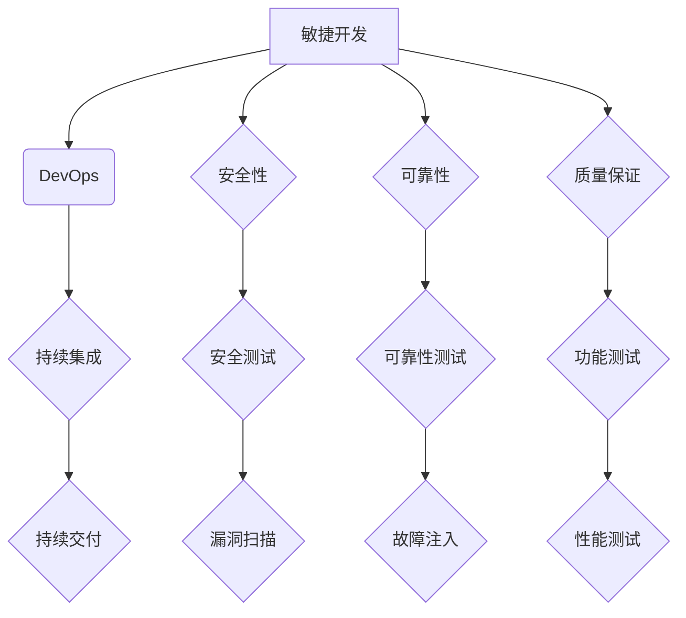

> 自动驾驶, 软件开发, 成熟度评估, 敏捷开发, DevOps, 持续集成, 持续交付, 安全性, 可靠性, 质量保证

## 1. 背景介绍

自动驾驶技术作为未来交通运输的重要发展方向，其核心是基于复杂感知、决策和控制算法的软件系统。软件开发过程的成熟度直接影响自动驾驶系统的安全性、可靠性和性能。然而，自动驾驶软件开发面临着诸多挑战，例如：

* **复杂性:** 自动驾驶系统涉及感知、决策、控制等多个领域，软件架构复杂，代码量庞大。
* **安全性:** 自动驾驶系统直接关系到人员生命安全，软件缺陷可能导致严重事故，因此安全性要求极高。
* **可靠性:** 自动驾驶系统需要在各种复杂环境下稳定运行，可靠性要求极高。
* **实时性:** 自动驾驶系统需要对环境变化做出实时响应，实时性要求极高。
* **法规标准:** 自动驾驶技术尚处于发展初期，相关法规标准不断更新，软件开发需要适应不断变化的规范。

为了确保自动驾驶系统的安全性和可靠性，需要建立完善的软件开发流程，并不断提升软件开发过程的成熟度。

## 2. 核心概念与联系

自动驾驶软件开发过程的成熟度评估主要关注以下几个核心概念：

* **敏捷开发:** 敏捷开发是一种迭代开发方法，强调快速响应变化、持续改进和团队协作。
* **DevOps:** DevOps是一种将开发和运维流程融合的理念，旨在提高软件交付效率和质量。
* **持续集成 (CI):** 持续集成是指将代码频繁集成到主分支，并自动进行构建和测试。
* **持续交付 (CD):** 持续交付是指将经过测试的软件自动部署到生产环境。
* **安全性:** 软件安全性是指软件能够抵抗各种安全威胁，保护用户数据和系统安全。
* **可靠性:** 软件可靠性是指软件能够在预期条件下稳定运行，并能够应对各种故障和异常情况。
* **质量保证:** 软件质量保证是指通过一系列测试和验证活动，确保软件满足用户需求和质量标准。

这些核心概念相互关联，共同构成了自动驾驶软件开发过程的成熟度评估体系。



## 3. 核心算法原理 & 具体操作步骤

### 3.1  算法原理概述

自动驾驶系统依赖于多种核心算法，例如：

* **感知算法:** 用于感知周围环境信息，包括图像识别、激光雷达扫描、雷达检测等。
* **路径规划算法:** 用于规划车辆行驶路径，考虑道路环境、交通规则和安全因素。
* **决策算法:** 用于根据感知信息和路径规划结果，做出驾驶决策，例如加速、减速、转向等。
* **控制算法:** 用于控制车辆的运动，例如转向、加速、制动等。

这些算法通常基于机器学习、深度学习等人工智能技术，需要大量的训练数据和计算资源。

### 3.2  算法步骤详解

以路径规划算法为例，其具体操作步骤如下：

1. **获取环境地图:** 利用感知算法获取周围环境信息，构建环境地图。
2. **定义目标位置:** 设置车辆的目标位置。
3. **搜索路径:** 利用路径规划算法搜索从当前位置到目标位置的路径。
4. **评估路径:** 对搜索到的路径进行评估，选择最优路径。
5. **规划控制指令:** 根据最优路径，规划车辆的控制指令。

### 3.3  算法优缺点

不同的路径规划算法具有不同的优缺点，例如：

* **A* 算法:** 效率高，但需要预先构建环境地图。
* **Dijkstra 算法:** 适用于无权图，但效率较低。
* **粒子群算法:** 适用于复杂环境，但计算量大。

选择合适的路径规划算法需要根据实际应用场景进行权衡。

### 3.4  算法应用领域

自动驾驶系统中的核心算法广泛应用于其他领域，例如：

* **机器人导航:** 机器人路径规划、避障等。
* **物流配送:** 自动驾驶卡车、无人配送机器人等。
* **城市规划:** 交通流量预测、道路优化等。

## 4. 数学模型和公式 & 详细讲解 & 举例说明

### 4.1  数学模型构建

自动驾驶系统的核心算法通常基于数学模型，例如：

* **状态空间模型:** 用于描述车辆的运动状态，包括位置、速度、加速度等。
* **控制模型:** 用于描述车辆的控制输入与运动状态之间的关系。
* **预测模型:** 用于预测未来环境状态，例如车辆位置、速度、方向等。

### 4.2  公式推导过程

以状态空间模型为例，其数学表达式如下：

$$
x(k+1) = A(k)x(k) + B(k)u(k) + w(k)
$$

其中：

* $x(k)$: 车辆状态向量，包括位置、速度、加速度等。
* $u(k)$: 控制输入向量，包括转向角、油门踏板等。
* $w(k)$: 噪声向量，代表系统误差和外部干扰。
* $A(k)$: 状态转移矩阵，描述车辆运动状态的演变。
* $B(k)$: 控制输入矩阵，描述控制输入对车辆运动状态的影响。

### 4.3  案例分析与讲解

假设车辆的初始状态为 $x(0) = [0, 0, 0]^T$，控制输入为 $u(k) = [0, 0]^T$，则根据状态空间模型，车辆的运动状态可以预测如下：

$$
x(1) = A(0)x(0) + B(0)u(0) + w(0) = w(0)
$$

可见，在没有控制输入的情况下，车辆的运动状态只受噪声影响。

## 5. 项目实践：代码实例和详细解释说明

### 5.1  开发环境搭建

自动驾驶软件开发通常需要搭建以下开发环境：

* **操作系统:** Linux 或 Windows。
* **编程语言:** C++, Python 等。
* **开发工具:** IDE、版本控制系统、测试工具等。

### 5.2  源代码详细实现

以下是一个简单的路径规划算法的代码示例，使用 Python 语言实现：

```python
import numpy as np

def a_star(grid, start, goal):
    # ...
    return path

# 示例用法
grid = np.array([
    [0, 0, 0, 0],
    [0, 1, 0, 0],
    [0, 0, 0, 0],
    [0, 0, 0, 0],
])
start = (0, 0)
goal = (3, 3)
path = a_star(grid, start, goal)
print(path)
```

### 5.3  代码解读与分析

该代码示例实现了 A* 算法，用于在二维网格地图上规划路径。

* `grid`: 表示地图，0 表示可通行，1 表示障碍。
* `start`: 起始位置。
* `goal`: 目标位置。
* `a_star`: A* 算法函数，返回从起始位置到目标位置的路径。

### 5.4  运行结果展示

运行该代码示例，将输出从起始位置到目标位置的路径。

## 6. 实际应用场景

自动驾驶软件在以下场景中得到广泛应用：

* **自动驾驶汽车:** 

* **无人配送机器人:** 

* **自动驾驶卡车:** 

* **智能交通系统:** 

### 6.4  未来应用展望

未来，自动驾驶软件将应用于更多场景，例如：

* **空中交通:** 无人驾驶飞机、无人机等。
* **海上交通:** 无人驾驶船舶等。
* **工业自动化:** 自动驾驶机器人、无人驾驶叉车等。

## 7. 工具和资源推荐

### 7.1  学习资源推荐

* **书籍:**

* **在线课程:**

* **开源项目:**

### 7.2  开发工具推荐

* **IDE:**

* **版本控制系统:**

* **测试工具:**

### 7.3  相关论文推荐

* **论文标题:**

* **论文标题:**

## 8. 总结：未来发展趋势与挑战

### 8.1  研究成果总结

自动驾驶软件开发取得了显著进展，核心算法不断成熟，软件开发流程也日益完善。

### 8.2  未来发展趋势

未来，自动驾驶软件将朝着以下方向发展：

* **更智能化:** 利用更先进的人工智能技术，提高自动驾驶系统的决策能力和适应性。
* **更安全可靠:** 加强安全测试和验证，提高软件的安全性、可靠性和鲁棒性。
* **更个性化:** 满足不同用户的个性化需求，例如驾驶风格、路线规划等。

### 8.3  面临的挑战

自动驾驶软件开发仍然面临着诸多挑战，例如：

* **数据安全:** 自动驾驶系统需要收集和处理大量用户数据，数据安全问题需要得到有效解决。
* **伦理问题:** 自动驾驶系统在遇到紧急情况时，需要做出伦理决策，这需要深入研究和探讨。
* **法规标准:** 自动驾驶技术尚处于发展初期，相关法规标准不断更新，软件开发需要适应不断变化的规范。

### 8.4  研究展望

未来，需要继续加强自动驾驶软件开发方面的研究，重点关注以下几个方面：

* **安全性和可靠性:** 开发更安全可靠的自动驾驶软件，确保用户生命安全。
* **人工智能技术:** 利用更先进的人工智能技术，提高自动驾驶系统的智能化水平。
* **伦理问题:** 研究自动驾驶系统在遇到伦理困境时的决策机制，制定相应的伦理规范。


## 9. 附录：常见问题与解答

### 9.1  常见问题

* **自动驾驶软件开发的成本高吗？**
* **自动驾驶软件的安全性如何保证？**
* **自动驾驶软件的可靠性如何保证？**

### 9.2  解答

* **自动驾驶软件开发的成本高吗？**

自动驾驶软件开发成本较高，主要体现在以下几个方面：

* **研发人员成本:** 自动驾驶软件开发需要大量高素质的研发人员，例如人工智能专家、软件工程师、测试工程师等。
* **数据标注成本:** 自动驾驶系统需要大量的训练数据，数据标注成本较高。
* **测试成本:** 自动驾驶软件需要进行大量的测试，测试成本较高。

* **自动驾驶软件的安全性如何保证？**

自动驾驶软件的安全性可以通过以下措施保证：

* **冗余设计:** 使用冗余硬件和软件，提高系统可靠性。
* **安全测试:** 进行严格的安全测试，发现和修复潜在的安全漏洞。
* **安全认证:** 通过安全认证机构的认证，确保软件安全性。

* **自动驾驶软件的可靠性如何保证？**

自动驾驶软件的可靠性可以通过以下措施保证：

* **代码质量:** 编写高质量的代码，避免代码缺陷。
* **测试覆盖率:** 提高测试覆盖率，确保软件在各种场景下都能正常运行。
* **故障注入测试:** 进行故障注入测试，验证软件的故障处理能力。


作者：禅与计算机程序设计艺术 / Zen and the Art of Computer Programming<end_of_turn>