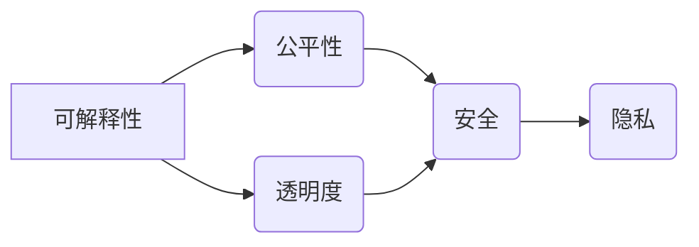

> 人工智能，伦理，责任，可解释性，公平性，透明度，安全

## 1. 背景介绍

人类计算正处于一个前所未有的发展阶段。人工智能（AI）技术的飞速进步，使得机器能够模拟人类的认知能力，并在各个领域展现出强大的应用潜力。从医疗诊断到金融交易，从自动驾驶到个性化教育，AI正在深刻地改变着我们的生活方式。然而，伴随着AI技术的快速发展，也随之而来了一系列伦理问题，这些问题关系到人类的价值观、社会秩序和未来发展。

近年来，关于AI伦理的讨论日益增多。国际组织、学术界和企业界都开始关注AI技术的潜在风险，并积极探索相应的解决方案。例如，欧盟提出了《通用数据保护条例》（GDPR），旨在保护个人数据隐私；美国发布了《国家人工智能战略》，强调AI技术应服务于人类福祉；众多科技公司也制定了自身的AI伦理准则，承诺将AI技术用于良善的目的。

## 2. 核心概念与联系

**2.1 伦理问题**

AI伦理问题涉及到AI技术的各个方面，包括：

* **公平性:** AI算法是否会产生偏见，导致不公平的结果？
* **透明度:** AI决策的逻辑是否清晰可解释，让人们能够理解其背后的原因？
* **责任:** 当AI系统导致负面后果时，谁应该承担责任？
* **安全:** AI系统是否安全可靠，不会被恶意利用？
* **隐私:** AI系统如何保护个人隐私数据？

**2.2 核心概念**

* **可解释性 (Explainability):** 指的是AI模型的决策过程能够被人类理解和解释的能力。
* **公平性 (Fairness):** 指的是AI算法在对待不同群体时，结果是否公平公正。
* **透明度 (Transparency):** 指的是AI系统的运作机制和决策过程能够被公开透明地展示。
* **安全 (Safety):** 指的是AI系统能够安全可靠地运行，不会造成意外伤害或损失。
* **隐私 (Privacy):** 指的是AI系统在处理个人数据时，能够保护个人隐私信息。

**2.3 关系架构**



## 3. 核心算法原理 & 具体操作步骤

**3.1 算法原理概述**

为了解决AI伦理问题，需要开发出能够确保AI系统公平、透明、安全和隐私保护的算法。一些常见的算法包括：

* **对抗性训练 (Adversarial Training):** 通过训练一个对抗模型来识别和防御攻击，从而提高AI系统的鲁棒性。
* **公平性约束 (Fairness Constraints):** 在训练AI模型时，加入公平性约束条件，例如限制模型对不同群体的预测结果差异。
* **可解释性模型 (Interpretable Models):** 使用能够解释其决策过程的模型，例如决策树和线性回归模型。

**3.2 算法步骤详解**

以对抗性训练为例，其具体步骤如下：

1. **训练主模型:** 使用原始数据集训练一个主模型，例如卷积神经网络。
2. **生成对抗样本:** 使用一个对抗模型生成对抗样本，这些样本是经过精心设计，能够欺骗主模型的输入数据。
3. **更新主模型:** 使用对抗样本对主模型进行训练，使其能够识别和防御对抗样本。
4. **重复步骤2和3:** 重复上述步骤，直到主模型能够有效地抵抗对抗攻击。

**3.3 算法优缺点**

* **优点:** 可以提高AI系统的鲁棒性，使其能够抵抗对抗攻击。
* **缺点:** 需要额外的计算资源和时间，并且可能导致模型性能下降。

**3.4 算法应用领域**

* **图像识别:** 提高图像识别系统的鲁棒性，使其能够识别经过篡改或模糊的图像。
* **语音识别:** 提高语音识别系统的鲁棒性，使其能够识别背景噪音或说话语速变化的语音。
* **自然语言处理:** 提高自然语言处理系统的鲁棒性，使其能够理解带有歧义或误导性的文本。

## 4. 数学模型和公式 & 详细讲解 & 举例说明

**4.1 数学模型构建**

假设我们有一个分类问题，目标是将数据点分类到不同的类别中。我们可以使用以下数学模型来表示分类器：

$$
f(x) = \text{sign}(w^T x + b)
$$

其中：

* $f(x)$ 是分类器的输出，表示数据点 $x$ 属于的类别。
* $w$ 是权重向量，表示每个特征的重要性。
* $x$ 是输入数据向量。
* $b$ 是偏置项。
* $\text{sign}(z)$ 是符号函数，返回 $z$ 的符号。

**4.2 公式推导过程**

我们可以使用梯度下降算法来训练分类器。梯度下降算法的目标是找到最优的权重向量 $w$ 和偏置项 $b$，使得分类器的预测结果与真实标签尽可能一致。

梯度下降算法的更新规则如下：

$$
w = w - \alpha \frac{\partial L(f(x), y)}{\partial w}
$$

$$
b = b - \alpha \frac{\partial L(f(x), y)}{\partial b}
$$

其中：

* $\alpha$ 是学习率，控制着更新幅度。
* $L(f(x), y)$ 是损失函数，衡量分类器预测结果与真实标签之间的差异。

**4.3 案例分析与讲解**

假设我们有一个二分类问题，目标是将图像分类为猫和狗。我们可以使用上述数学模型和梯度下降算法来训练一个分类器。

在训练过程中，我们会使用大量的猫和狗图像作为训练数据。分类器会根据图像特征学习到区分猫和狗的规则。

最终，训练好的分类器能够对新的图像进行分类，并预测其属于猫还是狗。

## 5. 项目实践：代码实例和详细解释说明

**5.1 开发环境搭建**

* 操作系统：Ubuntu 20.04
* Python 版本：3.8
* 必要的库：TensorFlow、Keras、NumPy、Matplotlib

**5.2 源代码详细实现**

```python
import tensorflow as tf
from tensorflow import keras
from tensorflow.keras import layers

# 定义模型结构
model = keras.Sequential(
    [
        layers.Conv2D(32, (3, 3), activation="relu", input_shape=(28, 28, 1)),
        layers.MaxPooling2D((2, 2)),
        layers.Conv2D(64, (3, 3), activation="relu"),
        layers.MaxPooling2D((2, 2)),
        layers.Flatten(),
        layers.Dense(10, activation="softmax"),
    ]
)

# 编译模型
model.compile(
    optimizer="adam",
    loss="sparse_categorical_crossentropy",
    metrics=["accuracy"],
)

# 加载 MNIST 数据集
(x_train, y_train), (x_test, y_test) = keras.datasets.mnist.load_data()

# 数据预处理
x_train = x_train.astype("float32") / 255.0
x_test = x_test.astype("float32") / 255.0
x_train = x_train.reshape((x_train.shape[0], 28, 28, 1))
x_test = x_test.reshape((x_test.shape[0], 28, 28, 1))

# 训练模型
model.fit(x_train, y_train, epochs=5)

# 评估模型
loss, accuracy = model.evaluate(x_test, y_test)
print("Test loss:", loss)
print("Test accuracy:", accuracy)
```

**5.3 代码解读与分析**

这段代码实现了使用 TensorFlow 和 Keras 库训练一个简单的图像分类模型。

* 首先，定义了模型结构，包括卷积层、池化层和全连接层。
* 然后，编译了模型，指定了优化器、损失函数和评估指标。
* 接着，加载了 MNIST 数据集，并对数据进行了预处理。
* 最后，训练了模型，并评估了模型的性能。

**5.4 运行结果展示**

运行这段代码后，会输出模型在测试集上的损失值和准确率。

## 6. 实际应用场景

**6.1 医疗诊断**

AI可以帮助医生更快、更准确地诊断疾病。例如，AI算法可以分析医学影像，识别肿瘤和其他异常情况。

**6.2 金融风险管理**

AI可以帮助金融机构识别和管理风险。例如，AI算法可以分析交易数据，识别欺诈行为。

**6.3 自动驾驶**

AI是自动驾驶汽车的关键技术。AI算法可以帮助汽车感知周围环境，做出驾驶决策。

**6.4 个性化教育**

AI可以提供个性化的教育体验。例如，AI算法可以根据学生的学习进度和风格，定制学习计划。

**6.5 未来应用展望**

随着AI技术的不断发展，其应用场景将更加广泛。例如，AI将被用于药物研发、材料科学、环境保护等领域。

## 7. 工具和资源推荐

**7.1 学习资源推荐**

* **在线课程:** Coursera、edX、Udacity 等平台提供丰富的AI课程。
* **书籍:** 《深度学习》、《人工智能：一种现代方法》等书籍是学习AI的基础。
* **开源项目:** TensorFlow、PyTorch 等开源项目提供了丰富的AI工具和资源。

**7.2 开发工具推荐**

* **TensorFlow:** Google开发的开源机器学习框架。
* **PyTorch:** Facebook开发的开源机器学习框架。
* **Keras:** TensorFlow的高级API，易于使用。

**7.3 相关论文推荐**

* **《ImageNet Classification with Deep Convolutional Neural Networks》**
* **《Attention Is All You Need》**
* **《BERT: Pre-training of Deep Bidirectional Transformers for Language Understanding》**

## 8. 总结：未来发展趋势与挑战

**8.1 研究成果总结**

近年来，AI技术取得了长足的进步，在各个领域展现出巨大的应用潜力。

**8.2 未来发展趋势**

* **更强大的计算能力:** 随着硬件技术的进步，AI模型将变得更加强大。
* **更广泛的应用场景:** AI将被应用到更多领域，例如医疗、教育、金融等。
* **更注重伦理和可解释性:** 人们将更加关注AI技术的伦理问题和可解释性。

**8.3 面临的挑战**

* **数据安全和隐私保护:** AI模型的训练需要大量数据，如何保护数据安全和隐私是一个重要挑战。
* **算法偏见:** AI算法可能存在偏见，导致不公平的结果。
* **AI的安全性:** 确保AI系统安全可靠，避免被恶意利用是一个重要挑战。

**8.4 研究展望**

未来，我们需要继续研究和探索AI技术的伦理问题，并开发出能够确保AI技术安全、公平、透明的算法。


## 9. 附录：常见问题与解答

**9.1 如何解决AI算法的偏见问题？**

* 使用公平性约束条件来训练AI模型。
* 使用多样化的训练数据，减少算法对特定群体的偏见。
* 定期评估AI模型的公平性，并进行调整。

**9.2 如何确保AI系统的安全性？**

* 使用对抗性训练来提高AI系统的鲁棒性。
* 定期进行安全评估，识别和修复潜在的漏洞。
* 开发安全规范和标准，指导AI系统的开发和部署。


作者：禅与计算机程序设计艺术 / Zen and the Art of Computer Programming 
<end_of_turn>