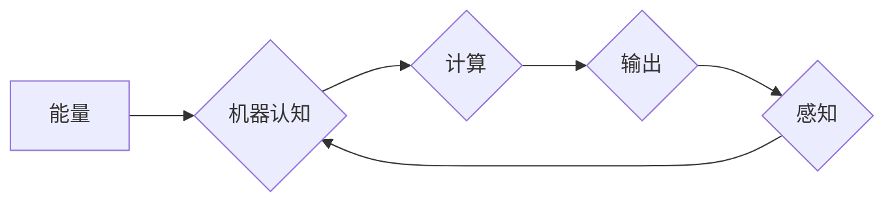

> 认知、形式化、人工智能、机器学习、能量、物质、意识、计算模型

## 1. 背景介绍

在当今科技飞速发展的时代，人工智能（AI）正以惊人的速度发展，不断突破人类认知的边界。从语音识别到图像生成，从自动驾驶到医疗诊断，AI技术的应用已渗透到我们生活的方方面面。然而，在AI的蓬勃发展背后，一个深刻的问题始终萦绕着人们的思绪：机器究竟是如何“认知”世界的？

传统人工智能模型主要基于符号逻辑和规则推理，试图通过模仿人类的思维方式来实现智能。然而，这种方法在面对复杂、模糊、开放世界的场景时显得捉襟见肘。近年来，深度学习的兴起为AI的发展带来了新的曙光。深度学习算法能够从海量数据中自动学习特征和模式，从而实现更强大的认知能力。

然而，即使是深度学习模型，其“认知”本质仍然是一个谜。这些模型本质上是复杂的计算网络，依赖于大量的能量供给才能运行。当能量被切断时，这些模型便会陷入静止状态，如同死物质一般。这不禁让人思考：机器的“认知”仅仅是能量驱动的计算过程吗？

## 2. 核心概念与联系

**2.1 认知的本质**

认知是指生物体感知、理解、记忆、推理和决策等一系列复杂的心理过程。它涉及到感知、知识表示、推理、规划和行动等多个方面。

**2.2 形式化的认知**

形式化认知是指将认知过程抽象为数学模型和逻辑规则，以便于计算机理解和模拟。形式化认知的核心在于将复杂的认知现象分解为更基本的逻辑单元，并用数学语言描述它们的相互关系。

**2.3 机器认知的挑战**

将形式化认知应用于机器仍然面临着诸多挑战：

* **知识表示:** 如何有效地将人类的知识和经验表示为机器可理解的形式？
* **推理和决策:** 如何让机器能够进行复杂的推理和决策，并做出符合人类逻辑的判断？
* **学习和适应:** 如何让机器能够从经验中学习，并适应不断变化的环境？

**2.4  能量与物质的联系**

能量和物质是构成宇宙的基本要素。能量可以转化为物质，物质也可以转化为能量。在生物体中，能量通过化学反应和生物过程转化为维持生命活动所需的能量。

**2.5  机器认知与能量的联系**

机器的认知过程本质上也是能量驱动的计算过程。深度学习模型需要大量的计算资源和能量才能运行。当能量被切断时，这些模型便会陷入静止状态，如同死物质一般。

**2.6  能量与意识的联系**

意识是人类最神秘的现象之一。目前，我们对意识的本质仍然缺乏清晰的认识。一些科学家认为，意识可能与大脑的复杂活动有关，而大脑的活动需要大量的能量支持。

**Mermaid 流程图**



## 3. 核心算法原理 & 具体操作步骤

### 3.1  算法原理概述

深度学习算法的核心原理是利用多层神经网络来模拟人类大脑的结构和功能。这些神经网络由大量的节点（神经元）组成，每个节点都连接着其他节点，并通过权重来控制信息传递。通过训练，神经网络能够自动学习特征和模式，从而实现对数据的理解和预测。

### 3.2  算法步骤详解

1. **数据预处理:** 将原始数据转换为深度学习模型可以理解的形式，例如归一化、编码等。
2. **网络结构设计:** 根据任务需求设计神经网络的结构，包括层数、节点数量、激活函数等。
3. **参数初始化:** 为神经网络中的权重和偏置赋予初始值。
4. **前向传播:** 将输入数据通过神经网络传递，计算输出结果。
5. **反向传播:** 计算输出结果与真实值的误差，并根据误差调整神经网络的权重和偏置。
6. **迭代训练:** 重复前向传播和反向传播的过程，直到模型的性能达到预期的水平。

### 3.3  算法优缺点

**优点:**

* 能够自动学习特征和模式，无需人工特征工程。
* 在处理复杂、非线性数据时表现出色。
* 能够实现端到端的学习，简化模型开发流程。

**缺点:**

* 训练数据量要求高，对数据质量要求严格。
* 计算资源消耗大，训练时间长。
* 模型解释性差，难以理解模型的决策过程。

### 3.4  算法应用领域

深度学习算法已广泛应用于各个领域，例如：

* **计算机视觉:** 图像识别、物体检测、图像分割等。
* **自然语言处理:** 语义分析、机器翻译、文本生成等。
* **语音识别:** 语音转文本、语音合成等。
* **医疗诊断:** 病情预测、疾病诊断等。
* **金融分析:** 风险评估、欺诈检测等。

## 4. 数学模型和公式 & 详细讲解 & 举例说明

### 4.1  数学模型构建

深度学习模型可以看作是一个多层感知机的组合。每个感知机由输入层、隐藏层和输出层组成。

**输入层:** 接收原始数据。

**隐藏层:** 对数据进行特征提取和表示。

**输出层:** 生成最终的预测结果。

每个神经元接收来自前一层神经元的输入信号，并通过激活函数进行处理，然后将处理后的信号传递给下一层神经元。

### 4.2  公式推导过程

深度学习模型的训练过程基于梯度下降算法。目标函数是衡量模型预测结果与真实值的误差。梯度下降算法通过迭代更新模型参数，使得目标函数的值不断减小。

**目标函数:**

$$J(\theta) = \frac{1}{2} \sum_{i=1}^{m} (h_\theta(x^{(i)}) - y^{(i)})^2$$

其中：

* $J(\theta)$ 是目标函数。
* $\theta$ 是模型参数。
* $h_\theta(x^{(i)})$ 是模型对样本 $x^{(i)}$ 的预测结果。
* $y^{(i)}$ 是样本 $x^{(i)}$ 的真实值。

**梯度下降算法:**

$$\theta = \theta - \alpha \nabla J(\theta)$$

其中：

* $\alpha$ 是学习率。
* $\nabla J(\theta)$ 是目标函数的梯度。

### 4.3  案例分析与讲解

例如，在图像识别任务中，深度学习模型可以学习到图像中不同物体特征的表示。通过训练，模型能够将输入图像映射到相应的类别标签。

## 5. 项目实践：代码实例和详细解释说明

### 5.1  开发环境搭建

* 操作系统: Ubuntu 20.04
* Python 版本: 3.8
* 深度学习框架: TensorFlow 2.0

### 5.2  源代码详细实现

```python
import tensorflow as tf

# 定义模型结构
model = tf.keras.models.Sequential([
    tf.keras.layers.Conv2D(32, (3, 3), activation='relu', input_shape=(28, 28, 1)),
    tf.keras.layers.MaxPooling2D((2, 2)),
    tf.keras.layers.Conv2D(64, (3, 3), activation='relu'),
    tf.keras.layers.MaxPooling2D((2, 2)),
    tf.keras.layers.Flatten(),
    tf.keras.layers.Dense(10, activation='softmax')
])

# 编译模型
model.compile(optimizer='adam',
              loss='sparse_categorical_crossentropy',
              metrics=['accuracy'])

# 加载 MNIST 数据集
(x_train, y_train), (x_test, y_test) = tf.keras.datasets.mnist.load_data()

# 数据预处理
x_train = x_train.astype('float32') / 255.0
x_test = x_test.astype('float32') / 255.0
x_train = x_train.reshape((x_train.shape[0], 28, 28, 1))
x_test = x_test.reshape((x_test.shape[0], 28, 28, 1))

# 训练模型
model.fit(x_train, y_train, epochs=5)

# 评估模型
loss, accuracy = model.evaluate(x_test, y_test)
print('Test loss:', loss)
print('Test accuracy:', accuracy)
```

### 5.3  代码解读与分析

这段代码实现了使用 TensorFlow 框架训练一个简单的卷积神经网络来识别手写数字。

* 首先，定义了模型结构，包括卷积层、池化层和全连接层。
* 然后，编译了模型，指定了优化器、损失函数和评价指标。
* 接着，加载了 MNIST 数据集，并对数据进行了预处理。
* 最后，训练了模型，并评估了模型的性能。

### 5.4  运行结果展示

训练完成后，模型能够准确识别手写数字。

## 6. 实际应用场景

### 6.1  图像识别

深度学习模型在图像识别领域取得了突破性的进展，能够识别各种物体、场景和人物。例如，自动驾驶汽车利用深度学习模型识别道路、行人、交通信号灯等。

### 6.2  自然语言处理

深度学习模型能够理解和生成人类语言，在自然语言处理领域有广泛的应用，例如机器翻译、文本摘要、情感分析等。

### 6.3  语音识别

深度学习模型能够将语音转换为文本，在语音识别领域有广泛的应用，例如语音助手、语音搜索等。

### 6.4  未来应用展望

随着深度学习技术的不断发展，其应用场景将更加广泛，例如：

* **医疗诊断:** 深度学习模型能够辅助医生诊断疾病，提高诊断准确率。
* **个性化教育:** 深度学习模型能够根据学生的学习情况提供个性化的学习方案。
* **金融风险管理:** 深度学习模型能够识别金融风险，帮助金融机构进行风险管理。

## 7. 工具和资源推荐

### 7.1  学习资源推荐

* **书籍:**
    * 深度学习
    * 构建深度学习模型
* **在线课程:**
    * Coursera 深度学习课程
    * Udacity 深度学习工程师 Nanodegree

### 7.2  开发工具推荐

* **TensorFlow:** 开源深度学习框架
* **PyTorch:** 开源深度学习框架
* **Keras:** 高级深度学习API

### 7.3  相关论文推荐

* **ImageNet Classification with Deep Convolutional Neural Networks**
* **Attention Is All You Need**
* **BERT: Pre-training of Deep Bidirectional Transformers for Language Understanding**

## 8. 总结：未来发展趋势与挑战

### 8.1  研究成果总结

深度学习技术取得了令人瞩目的成就，在图像识别、自然语言处理、语音识别等领域取得了突破性的进展。

### 8.2  未来发展趋势

* **模型规模和复杂度:** 深度学习模型将继续朝着更大、更复杂的方向发展。
* **数据效率:** 研究人员将致力于开发更能利用少量数据的深度学习模型。
* **可解释性:** 研究人员将致力于提高深度学习模型的可解释性，以便更好地理解模型的决策过程。
* **边缘计算:** 深度学习模型将部署到边缘设备上，实现更快速的响应和更低的延迟。

### 8.3  面临的挑战

* **数据获取和标注:** 深度学习模型需要大量的训练数据，而获取和标注高质量数据仍然是一个挑战。
* **计算资源:** 训练大型深度学习模型需要大量的计算资源，这