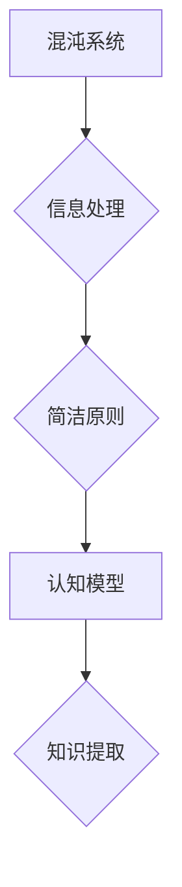

> 认知过程、混沌理论、简洁原则、人工智能、算法、复杂系统

## 1. 背景介绍

人类的认知过程是一个复杂而迷人的领域。从感知世界到理解抽象概念，从做出决策到创造艺术，我们的大脑不断地处理着海量信息，并从中提取有意义的知识和洞察力。然而，这个过程的本质机制仍然是一个未解之谜。

近年来，混沌理论和简洁原则为我们理解认知过程提供了新的视角。混沌理论揭示了看似随机的复杂系统背后隐藏的秩序，而简洁原则强调了信息压缩和结构简化在认知中的重要性。

## 2. 核心概念与联系

### 2.1 混沌理论

混沌理论研究的是那些看似随机、难以预测的复杂系统。这些系统通常由许多相互作用的个体组成，每个个体都遵循简单的规则，但整体行为却呈现出高度的复杂性和不可预测性。

**关键特征：**

* **敏感依赖初始条件：**微小的初始差异会导致系统演化轨迹的巨大变化，难以预测长期行为。
* **非线性关系：**系统中的变量之间存在非线性的相互作用，导致系统行为难以用线性模型描述。
* **分形结构：**混沌系统往往呈现出分形结构，即具有自相似性的复杂图案。

### 2.2 简洁原则

简洁原则认为，认知系统倾向于寻求简洁、易于理解的表示形式。

**核心思想：**

* **信息压缩：**将冗余信息去除，保留最关键的信息。
* **结构简化：**将复杂结构分解成更简单的子结构，提高可理解性。
* **泛化能力：**简洁的表示形式能够应用于更广泛的场景。

### 2.3 连接

混沌理论和简洁原则在认知过程中的联系在于：

* **认知的复杂性：**大脑处理信息的过程本质上是一个复杂系统，存在着混沌的特征。
* **简洁的认知模型：**大脑倾向于构建简洁、易于理解的认知模型，以应对复杂的信息环境。
* **混沌与简洁的平衡：**认知系统需要在混沌和简洁之间找到平衡，既要能够处理复杂信息，又要能够提取有意义的知识。

**Mermaid 流程图：**



## 3. 核心算法原理 & 具体操作步骤

### 3.1 算法原理概述

**自组织地图 (SOM)** 是一种神经网络算法，用于将高维数据映射到低维空间，同时保持数据之间的拓扑结构。

**原理：**

* SOM 网络由许多神经元组成，每个神经元代表一个低维空间的点。
* 输入数据被映射到网络中，每个神经元计算与输入数据的相似度。
* 最相似的神经元被激活，并与其邻近的神经元进行调整，使网络逐渐学习数据分布的拓扑结构。

### 3.2 算法步骤详解

1. **初始化网络：**随机初始化网络中的神经元权重。
2. **输入数据：**将输入数据逐个输入到网络中。
3. **寻找最佳匹配单元 (BMU)：**计算每个神经元与输入数据的相似度，找到与输入数据最相似的那个神经元，即BMU。
4. **权重更新：**根据BMU和其邻近神经元的权重，更新所有神经元的权重，使网络逐渐学习数据分布的拓扑结构。
5. **重复步骤 2-4：**重复以上步骤，直到网络收敛。

### 3.3 算法优缺点

**优点：**

* 可以将高维数据映射到低维空间，方便可视化和分析。
* 保留了数据之间的拓扑结构，能够发现数据之间的潜在关系。
* 算法相对简单，易于实现。

**缺点：**

* 算法参数的选择对结果影响较大。
* 对数据分布的假设比较强，不适用于所有类型的复杂数据。

### 3.4 算法应用领域

* **图像识别：**将图像数据映射到低维空间，用于图像分类和目标检测。
* **文本分析：**将文本数据映射到低维空间，用于文本聚类和主题建模。
* **生物信息学：**将基因表达数据映射到低维空间，用于基因功能分析和疾病诊断。

## 4. 数学模型和公式 & 详细讲解 & 举例说明

### 4.1 数学模型构建

**距离度量：**

SOM 算法使用欧氏距离作为神经元与输入数据的距离度量。

**公式：**

$$
d(x, y) = \sqrt{\sum_{i=1}^{n}(x_i - y_i)^2}
$$

其中：

* $x$ 和 $y$ 是两个数据点。
* $n$ 是数据点的维度。

**相似度：**

神经元与输入数据的相似度计算公式：

$$
s(x, y) = \frac{1}{1 + d(x, y)}
$$

### 4.2 公式推导过程

**权重更新公式：**

$$
w_{ij}(t+1) = w_{ij}(t) + \alpha(t) h_{ij}(t) (x(t) - w_{ij}(t))
$$

其中：

* $w_{ij}(t)$ 是神经元 $j$ 在时间步 $t$ 的权重。
* $\alpha(t)$ 是学习率，随时间衰减。
* $h_{ij}(t)$ 是神经元 $j$ 在时间步 $t$ 的邻域函数，表示神经元 $j$ 与 BMU 的距离。
* $x(t)$ 是输入数据。

**邻域函数：**

$$
h_{ij}(t) = exp\left(-\frac{d(i, j)^2}{2\sigma^2(t)}\right)
$$

其中：

* $d(i, j)$ 是神经元 $i$ 与 $j$ 之间的距离。
* $\sigma(t)$ 是邻域半径，随时间衰减。

### 4.3 案例分析与讲解

**举例：**

将一组图像数据映射到二维空间，以便可视化图像之间的相似性。

**步骤：**

1. 使用 SOM 算法将图像数据映射到二维空间。
2. 将每个神经元对应到一个图像类别。
3. 可视化神经元的位置和对应的图像类别，观察图像之间的相似性。

## 5. 项目实践：代码实例和详细解释说明

### 5.1 开发环境搭建

* Python 3.x
* scikit-learn 库

### 5.2 源代码详细实现

```python
from sklearn.manifold import SOM

# 准备数据
X = ... # 输入数据

# 创建 SOM 网络
som = SOM(n_components=2, random_state=42)

# 训练 SOM 网络
som.fit(X)

# 获取神经元权重
weights = som.components_

# 可视化神经元权重
plt.scatter(weights[:, 0], weights[:, 1])
plt.show()
```

### 5.3 代码解读与分析

* `SOM(n_components=2, random_state=42)` 创建一个二维 SOM 网络，随机种子为 42。
* `som.fit(X)` 训练 SOM 网络，输入数据为 X。
* `som.components_` 获取神经元权重，即每个神经元在低维空间的坐标。
* `plt.scatter(weights[:, 0], weights[:, 1])` 可视化神经元权重，每个点代表一个神经元。

### 5.4 运行结果展示

运行代码后，将生成一个二维散点图，每个点代表一个神经元，神经元的位置反映了数据之间的相似性。

## 6. 实际应用场景

### 6.1 图像分类

使用 SOM 将图像数据映射到低维空间，可以将图像聚类到不同的类别，用于图像分类任务。

### 6.2 文本聚类

使用 SOM 将文本数据映射到低维空间，可以将文本聚类到不同的主题，用于文本聚类和主题建模任务。

### 6.3 异常检测

使用 SOM 将数据映射到低维空间，可以识别出与其他数据点相似的异常数据点。

### 6.4 未来应用展望

* **个性化推荐：**根据用户的行为数据，使用 SOM 建立用户兴趣模型，提供个性化推荐。
* **医疗诊断：**使用 SOM 分析患者的医疗数据，辅助医生进行诊断。
* **金融风险管理：**使用 SOM 分析金融数据，识别潜在的风险。

## 7. 工具和资源推荐

### 7.1 学习资源推荐

* **书籍：**
    * 《自组织映射》
    * 《神经网络与深度学习》
* **在线课程：**
    * Coursera 上的《机器学习》课程
    * edX 上的《深度学习》课程

### 7.2 开发工具推荐

* **Python:** 
    * scikit-learn 库
    * TensorFlow 库
    * PyTorch 库

### 7.3 相关论文推荐

* Kohonen, T. (1989). Self-Organizing Maps. Springer.
* Vesanto, J., & Alhoniemi, E. (2000). Global structure of self-organizing maps. IEEE Transactions on Neural Networks, 11(5), 1187-1198.

## 8. 总结：未来发展趋势与挑战

### 8.1 研究成果总结

* SOM 算法是一种有效的工具，用于将高维数据映射到低维空间，并发现数据之间的潜在关系。
* SOM 算法在图像分类、文本聚类、异常检测等领域都有广泛的应用。

### 8.2 未来发展趋势

* **结合深度学习：**将 SOM 与深度学习算法结合，提高数据分析能力。
* **动态 SOM：**开发动态 SOM 网络，能够适应不断变化的数据环境。
* **可解释性：**提高 SOM 模型的可解释性，帮助用户理解模型的决策过程。

### 8.3 面临的挑战

* **参数选择：**SOM 算法的参数选择对结果影响较大，需要进行仔细的调优。
* **数据分布假设：**SOM 算法对数据分布的假设比较强，不适用于所有类型的复杂数据。
* **计算复杂度：**训练大型 SOM 网络需要大量的计算资源。

### 8.4 研究展望

* 研究更有效的 SOM 算法，提高算法的效率和鲁棒性。
* 开发新的应用场景，探索 SOM 算法在更多领域中的潜力。
* 研究 SOM 算法的理论基础，深入理解其工作机制。

## 9. 附录：常见问题与解答

### 9.1 什么是自组织地图 (SOM)？

SOM 是一种神经网络算法，用于将高维数据映射到低维空间，同时保持数据之间的拓扑结构。

### 9.2 SOM 算法的优点是什么？

* 可以将高维数据映射到低维空间，方便可视化和分析。
* 保留了数据之间的拓扑结构，能够发现数据之间的潜在关系。
* 算法相对简单，易于实现。

### 9.3 SOM 算法的缺点是什么？

* 算法参数的选择对结果影响较大。
* 对数据分布的假设比较强，不适用于所有类型的复杂数据。


作者：禅与计算机程序设计艺术 / Zen and the Art of Computer Programming 
<end_of_turn>