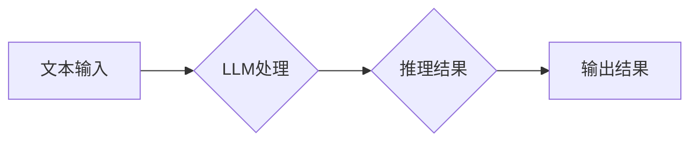

> 大语言模型，认知盲区，推理能力，逻辑推理，知识图谱，常识推理，因果关系，文本理解

## 1. 背景介绍

近年来，大语言模型（LLM）在自然语言处理领域取得了令人瞩目的成就。从文本生成、翻译到问答和代码编写，LLM展现出强大的能力，甚至在某些方面超越了人类的表现。然而，尽管LLM取得了如此巨大的进步，它们在推理能力方面仍然存在着显著的局限性。

传统的AI系统通常依赖于明确的规则和逻辑程序，而LLM则通过学习海量文本数据来构建其知识和理解。这种学习方式使得LLM能够处理更复杂和灵活的语言任务，但也导致了其推理能力的局限性。

LLM的推理能力主要受以下几个因素影响：

* **数据偏差:** LLM的训练数据可能存在偏差，导致其在某些特定领域或场景下表现不佳。
* **缺乏世界知识:** LLM缺乏对现实世界中常识和因果关系的深刻理解，这限制了其进行复杂推理的能力。
* **局限的逻辑推理能力:** 尽管LLM能够识别和理解一些逻辑关系，但其对复杂逻辑推理的处理能力仍然有限。

## 2. 核心概念与联系

**2.1 大语言模型 (LLM)**

大语言模型是一种基于深度学习的统计模型，能够理解和生成人类语言。它们通常由 Transformer 架构构成，并通过大量的文本数据进行训练。

**2.2 认知盲区**

认知盲区是指人工智能系统在某些特定领域或任务中表现出明显不足的地方。这些盲区通常与人工智能系统的知识、推理能力和理解能力有关。

**2.3 推理能力**

推理能力是指人工智能系统能够从已知信息中推导出新的知识或结论的能力。

**2.4 常识推理**

常识推理是指基于人类普遍的知识和经验进行推理的能力。

**2.5 因果关系**

因果关系是指一个事件导致另一个事件发生的关系。

**2.6 知识图谱**

知识图谱是一种结构化的知识表示形式，它将实体和关系以图的形式表示。

**2.7 Mermaid 流程图**



## 3. 核心算法原理 & 具体操作步骤

### 3.1  算法原理概述

LLM的推理能力主要依赖于其强大的语言表示能力和上下文理解能力。通过学习海量文本数据，LLM能够构建复杂的语言表示，并理解文本中的语义关系和上下文信息。

在推理过程中，LLM通常会使用以下几种方法：

* **基于规则的推理:** 基于预先定义的规则和逻辑进行推理。
* **基于概率的推理:** 利用统计模型和概率计算进行推理。
* **基于图的推理:** 将知识表示为图结构，并使用图算法进行推理。

### 3.2  算法步骤详解

1. **文本预处理:** 将输入文本进行清洗、分词、词性标注等预处理操作。
2. **文本编码:** 将预处理后的文本转换为数字向量，以便LLM进行处理。
3. **上下文理解:** LLM利用其强大的上下文理解能力，分析文本中的语义关系和上下文信息。
4. **推理过程:** 根据输入文本和上下文信息，LLM使用预先定义的规则、概率模型或图算法进行推理。
5. **结果解码:** 将推理结果转换为可读的文本形式输出。

### 3.3  算法优缺点

**优点:**

* 能够处理复杂和灵活的语言任务。
* 能够学习和理解人类语言的复杂性。
* 能够生成高质量的文本输出。

**缺点:**

* 推理能力仍然有限，难以处理复杂逻辑推理。
* 容易受到数据偏差的影响。
* 缺乏对现实世界常识和因果关系的理解。

### 3.4  算法应用领域

* **问答系统:** 回答用户提出的问题。
* **文本摘要:** 生成文本的简短摘要。
* **机器翻译:** 将文本从一种语言翻译成另一种语言。
* **代码生成:** 生成计算机代码。
* **对话系统:** 与用户进行自然语言对话。

## 4. 数学模型和公式 & 详细讲解 & 举例说明

### 4.1  数学模型构建

LLM通常使用 Transformer 架构，其核心是注意力机制。注意力机制允许模型关注输入序列中与当前任务最相关的部分，从而提高推理效率和准确性。

**4.1.1 注意力机制**

注意力机制可以表示为以下公式：

$$
Attention(Q, K, V) = softmax(\frac{QK^T}{\sqrt{d_k}})V
$$

其中：

* $Q$：查询向量
* $K$：键向量
* $V$：值向量
* $d_k$：键向量的维度
* $softmax$：softmax 函数

注意力机制通过计算查询向量与键向量的相似度，来确定哪些值向量最相关，并将其加权求和得到最终的输出。

**4.1.2 Transformer 架构**

Transformer 架构由多个编码器和解码器层组成。每个层包含多头注意力机制和前馈神经网络。

### 4.2  公式推导过程

注意力机制的公式推导过程可以参考 Transformer 原文论文。

### 4.3  案例分析与讲解

例如，在机器翻译任务中，输入句子是源语言文本，输出句子是目标语言文本。Transformer 模型通过注意力机制，可以关注源语言文本中与目标语言文本相关的词语，从而提高翻译的准确性。

## 5. 项目实践：代码实例和详细解释说明

### 5.1  开发环境搭建

* Python 3.7+
* PyTorch 1.7+
* CUDA 10.2+

### 5.2  源代码详细实现

```python
import torch
import torch.nn as nn

class Attention(nn.Module):
    def __init__(self, d_model, num_heads):
        super(Attention, self).__init__()
        self.d_model = d_model
        self.num_heads = num_heads
        self.head_dim = d_model // num_heads

        self.query = nn.Linear(d_model, d_model)
        self.key = nn.Linear(d_model, d_model)
        self.value = nn.Linear(d_model, d_model)
        self.fc_out = nn.Linear(d_model, d_model)

    def forward(self, query, key, value, mask=None):
        batch_size = query.size(0)

        # Linear projections
        Q = self.query(query).view(batch_size, -1, self.num_heads, self.head_dim).transpose(1, 2)
        K = self.key(key).view(batch_size, -1, self.num_heads, self.head_dim).transpose(1, 2)
        V = self.value(value).view(batch_size, -1, self.num_heads, self.head_dim).transpose(1, 2)

        # Scaled dot-product attention
        scores = torch.matmul(Q, K.transpose(-2, -1)) / torch.sqrt(torch.tensor(self.head_dim, dtype=torch.float))

        if mask is not None:
            scores = scores.masked_fill(mask == 0, -1e9)

        attention_weights = torch.softmax(scores, dim=-1)

        # Weighted sum of values
        context = torch.matmul(attention_weights, V)

        # Concatenate heads and project
        context = context.transpose(1, 2).contiguous().view(batch_size, -1, self.d_model)
        output = self.fc_out(context)

        return output, attention_weights
```

### 5.3  代码解读与分析

这段代码实现了 Transformer 架构中的注意力机制。

* `Attention` 类定义了注意力机制的结构。
* `forward` 方法实现了注意力机制的计算过程。
* `query`, `key`, `value` 分别表示查询向量、键向量和值向量。
* `mask` 用于屏蔽无效的注意力计算。
* `softmax` 函数用于计算注意力权重。
* `torch.matmul` 用于计算矩阵乘法。

### 5.4  运行结果展示

运行该代码可以得到注意力权重和上下文向量，这些结果可以用于后续的文本生成、翻译等任务。

## 6. 实际应用场景

### 6.1  问答系统

LLM可以用于构建问答系统，回答用户提出的问题。例如，可以训练一个LLM模型，使其能够回答关于历史事件、科学知识或文学作品的问题。

### 6.2  文本摘要

LLM可以用于生成文本的简短摘要。例如，可以训练一个LLM模型，使其能够从长篇文章中提取关键信息，生成一个简短的摘要。

### 6.3  机器翻译

LLM可以用于机器翻译，将文本从一种语言翻译成另一种语言。例如，可以训练一个LLM模型，使其能够将英文翻译成中文。

### 6.4  未来应用展望

LLM在未来将有更广泛的应用场景，例如：

* **个性化教育:** 根据学生的学习进度和需求，提供个性化的学习内容和辅导。
* **医疗诊断:** 辅助医生进行疾病诊断，提高诊断的准确性和效率。
* **法律服务:** 帮助律师进行法律研究和案件分析。

## 7. 工具和资源推荐

### 7.1  学习资源推荐

* **论文:**
    * Attention Is All You Need (Vaswani et al., 2017)
    * BERT: Pre-training of Deep Bidirectional Transformers for Language Understanding (Devlin et al., 2018)
    * GPT-3: Language Models are Few-Shot Learners (Brown et al., 2020)
* **书籍:**
    * Deep Learning (Goodfellow et al., 2016)
    * Natural Language Processing with Python (Bird et al., 2009)

### 7.2  开发工具推荐

* **PyTorch:** 深度学习框架
* **TensorFlow:** 深度学习框架
* **Hugging Face Transformers:** 预训练模型库

### 7.3  相关论文推荐

* **BERT:** https://arxiv.org/abs/1810.04805
* **GPT-3:** https://arxiv.org/abs/2005.14165
* **T5:** https://arxiv.org/abs/1910.10683

## 8. 总结：未来发展趋势与挑战

### 8.1  研究成果总结

近年来，LLM取得了显著的进展，在自然语言处理任务中展现出强大的能力。

### 8.2  未来发展趋势

* **更强大的推理能力:** 研究人员将继续探索新的算法和模型，以提高LLM的推理能力。
* **更强的常识推理能力:** 将常识知识融入LLM模型，使其能够更好地理解和推理现实世界。
* **更安全可靠的LLM:** 研究人员将致力于开发更安全可靠的LLM模型，防止其被恶意利用。

### 8.3  面临的挑战

* **数据偏差:** LLM的训练数据可能存在偏差，导致其在某些特定领域或场景下表现不佳。
* **计算资源:** 训练大型LLM模型需要大量的计算资源。
* **可解释性:** LLM的决策过程难以解释，这使得其应用在某些领域受到限制。

### 8.4  研究展望

未来，LLM将继续朝着更强大、更安全、更可靠的方向发展，并在更多领域发挥其重要作用。


## 9. 附录：常见问题与解答

**Q1: LLM的推理能力为什么仍然有限？**

A1: LLM的推理能力受限于其训练数据和