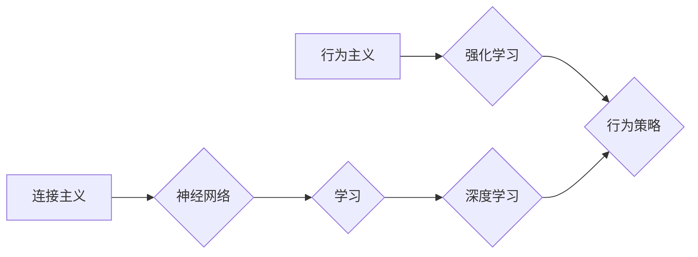

> 连接主义, 行为主义, 深度学习, 神经网络, 机器学习, 算法, 模型, 应用

## 1. 背景介绍

人工智能（AI）的蓬勃发展，为我们带来了前所未有的机遇和挑战。其中，连接主义和行为主义作为两种重要的学习 paradigms，在推动 AI 发展方面发挥着关键作用。连接主义，以其模仿生物神经网络的结构和功能，在深度学习领域取得了显著成就，例如图像识别、自然语言处理等。而行为主义，则强调通过强化学习来训练智能体，使其在环境中学习最优行为。

然而，连接主义和行为主义之间也存在着一些根本性的差异和挑战。连接主义模型通常具有强大的泛化能力，能够处理复杂的任务，但其内部机制难以解释，缺乏透明度。而行为主义模型则更加注重可解释性和控制性，但其学习能力相对有限，难以应对高度复杂的环境。

## 2. 核心概念与联系

### 2.1 连接主义

连接主义是一种模仿生物神经网络的计算模型。它由大量相互连接的神经元组成，每个神经元接收来自其他神经元的输入，并根据输入进行处理，输出到其他神经元。神经元之间的连接权重决定了信息传递的强度，通过训练，这些权重会不断调整，从而使模型能够学习和适应数据。

### 2.2 行为主义

行为主义是一种基于强化学习的学习 paradigms。它认为，智能体的行为是由环境反馈驱动的。智能体通过与环境交互，获得奖励或惩罚，并根据这些反馈调整自己的行为，以最大化奖励。强化学习算法的核心是价值函数，它评估智能体在特定状态下采取特定动作的长期回报。

### 2.3 连接主义与行为主义的联系

尽管连接主义和行为主义在学习 paradigms 和模型结构上存在差异，但它们之间也存在着密切的联系。

* **强化学习与深度学习的结合:** 深度学习可以用于构建强大的价值函数估计器，而强化学习算法可以利用这些估计器来指导智能体的行为决策。
* **行为策略与连接主义模型的融合:** 行为策略可以被编码为连接主义模型的一部分，从而使模型能够学习更复杂的策略。

**Mermaid 流程图**



## 3. 核心算法原理 & 具体操作步骤

### 3.1 算法原理概述

深度强化学习 (Deep Reinforcement Learning, DRL) 结合了深度学习和强化学习的优势，旨在训练智能体在复杂环境中学习最优行为。DRL 算法的核心是深度神经网络，它可以学习复杂的价值函数和策略，从而指导智能体的决策。

### 3.2 算法步骤详解

1. **环境建模:** 建立一个模拟真实世界的环境，定义智能体的状态空间、动作空间和奖励函数。
2. **深度神经网络构建:** 设计一个深度神经网络，用于估计价值函数和策略。
3. **训练过程:** 智能体与环境交互，根据环境反馈更新神经网络的权重。训练过程通常使用梯度下降算法，目标是最大化智能体的长期奖励。
4. **策略评估:** 在训练完成后，评估智能体的策略性能，例如在特定任务上的成功率。

### 3.3 算法优缺点

**优点:**

* 能够处理复杂的环境和任务。
* 学习能力强，能够发现隐藏的模式和规律。
* 具有较强的泛化能力，能够应用于不同的环境和任务。

**缺点:**

* 训练过程复杂，需要大量的计算资源和数据。
* 训练过程容易陷入局部最优解。
* 模型的解释性较差，难以理解智能体的决策过程。

### 3.4 算法应用领域

DRL 算法在许多领域都有广泛的应用，例如:

* **游戏:** 训练智能体玩游戏，例如围棋、Go、AlphaGo。
* **机器人:** 训练机器人执行复杂的任务，例如导航、抓取、操作。
* **自动驾驶:** 训练自动驾驶汽车在复杂道路环境中行驶。
* **医疗保健:** 辅助医生诊断疾病、制定治疗方案。

## 4. 数学模型和公式 & 详细讲解 & 举例说明

### 4.1 数学模型构建

DRL 算法的核心是价值函数和策略函数。

* **价值函数:** 估计智能体在特定状态下采取特定动作的长期回报。
* **策略函数:** 根据当前状态，决定智能体采取的动作。

### 4.2 公式推导过程

**价值函数:**

$$
V(s) = E[\sum_{t=0}^{\infty} \gamma^t r_{t+1} | s_t = s]
$$

其中:

* $V(s)$ 是状态 $s$ 的价值函数。
* $r_{t+1}$ 是时间步 $t+1$ 的奖励。
* $\gamma$ 是折扣因子，控制未来奖励的权重。
* $E$ 表示期望值。

**策略函数:**

$$
\pi(a|s) = P(a_t = a | s_t = s)
$$

其中:

* $\pi(a|s)$ 是在状态 $s$ 下采取动作 $a$ 的概率。

### 4.3 案例分析与讲解

假设一个智能体在玩一个简单的游戏，目标是收集尽可能多的金币。

* **状态空间:** 智能体的当前位置。
* **动作空间:** 向上、向下、向左、向右移动。
* **奖励函数:** 收集金币获得奖励，撞墙或掉落陷阱扣除奖励。

通过训练 DRL 算法，智能体可以学习到一个价值函数，它可以评估每个位置的价值，以及一个策略函数，它可以决定智能体在每个位置采取的动作。

## 5. 项目实践：代码实例和详细解释说明

### 5.1 开发环境搭建

* Python 3.x
* TensorFlow 或 PyTorch
* OpenAI Gym

### 5.2 源代码详细实现

```python
import gym
import tensorflow as tf

# 定义价值函数网络
class ValueNetwork(tf.keras.Model):
    def __init__(self):
        super(ValueNetwork, self).__init__()
        self.dense1 = tf.keras.layers.Dense(64, activation='relu')
        self.dense2 = tf.keras.layers.Dense(1)

    def call(self, state):
        x = self.dense1(state)
        return self.dense2(x)

# 定义策略网络
class PolicyNetwork(tf.keras.Model):
    def __init__(self):
        super(PolicyNetwork, self).__init__()
        self.dense1 = tf.keras.layers.Dense(64, activation='relu')
        self.dense2 = tf.keras.layers.Dense(4, activation='softmax')

    def call(self, state):
        x = self.dense1(state)
        return self.dense2(x)

# 创建环境
env = gym.make('CartPole-v1')

# 创建价值网络和策略网络
value_network = ValueNetwork()
policy_network = PolicyNetwork()

# 训练过程
for episode in range(1000):
    state = env.reset()
    done = False
    total_reward = 0

    while not done:
        # 选择动作
        action = tf.argmax(policy_network(tf.expand_dims(state, axis=0))).numpy()

        # 执行动作
        next_state, reward, done, _ = env.step(action)

        # 更新价值网络和策略网络
        # ...

    total_reward += reward
    print(f'Episode {episode+1}, Total Reward: {total_reward}')

```

### 5.3 代码解读与分析

* 代码首先定义了价值网络和策略网络，这两个网络分别用于估计状态价值和选择动作。
* 然后创建了一个环境，例如 OpenAI Gym 中的 CartPole-v1 环境。
* 训练过程循环执行，在每个时间步，智能体根据策略网络选择动作，执行动作后获得奖励和下一个状态。
* 根据奖励和下一个状态，更新价值网络和策略网络的权重。

### 5.4 运行结果展示

训练完成后，智能体应该能够在 CartPole-v1 环境中保持平衡杆的时间越来越长。

## 6. 实际应用场景

### 6.1 游戏 AI

DRL 算法在游戏 AI 中取得了显著的成果，例如 AlphaGo、AlphaStar 等。这些算法能够学习复杂的策略，并战胜人类顶尖选手。

### 6.2 机器人控制

DRL 算法可以用于训练机器人执行复杂的任务，例如导航、抓取、操作等。

### 6.3 自动驾驶

DRL 算法可以用于训练自动驾驶汽车在复杂道路环境中行驶。

### 6.4 其他应用

DRL 算法还可以应用于其他领域，例如医疗保健、金融、推荐系统等。

## 7. 工具和资源推荐

### 7.1 学习资源推荐

* **书籍:**
    * Deep Reinforcement Learning Hands-On by Maxim Lapan
    * Reinforcement Learning: An Introduction by Richard S. Sutton and Andrew G. Barto
* **课程:**
    * Deep Reinforcement Learning Specialization by DeepLearning.AI
    * Reinforcement Learning by David Silver (University of DeepMind)

### 7.2 开发工具推荐

* **TensorFlow:** https://www.tensorflow.org/
* **PyTorch:** https://pytorch.org/
* **OpenAI Gym:** https://gym.openai.com/

### 7.3 相关论文推荐

* **Deep Q-Network (DQN):** https://arxiv.org/abs/1312.5602
* **Proximal Policy Optimization (PPO):** https://arxiv.org/abs/1707.06347
* **Trust Region Policy Optimization (TRPO):** https://arxiv.org/abs/1502.05477

## 8. 总结：未来发展趋势与挑战

### 8.1 研究成果总结

DRL 算法取得了显著的成果，在许多领域都有广泛的应用。

### 8.2 未来发展趋势

* **更强大的模型:** 研究更强大的 DRL 算法，例如 Transformer-based DRL，以解决更复杂的任务。
* **更有效的训练方法:** 研究更有效的训练方法，例如分布式训练、迁移学习，以加速 DRL 算法的训练过程。
* **更强的可解释性:** 研究更强的 DRL 算法的可解释性，以便更好地理解智能体的决策过程。

### 8.3 面临的挑战

* **数据效率:** DRL 算法通常需要大量的训练数据，这在某些领域可能难以获得。
* **样本复杂性:** DRL 算法的样本复杂性较高，这意味着需要大量的样本才能训练出一个有效的模型。
* **安全性和可靠性:** DRL 算法在安全性和可靠性方面仍然存在挑战，需要进一步研究和改进。

### 8.4 研究展望

未来，DRL 算法将继续发展，并在更多领域发挥重要作用。

## 9. 附录：常见问题与解答

* **什么是强化学习？**

强化学习是一种机器学习 paradigms，它通过奖励和惩罚来训练智能体学习最优行为。

* **什么是价值函数？**

价值函数估计智能体在特定状态下采取特定动作的长期回报。

* **什么是策略函数？**

策略函数根据当前状态，决定智能体采取的动作。


作者：禅与计算机程序设计艺术 / Zen and the Art of Computer Programming 
<end_of_turn>