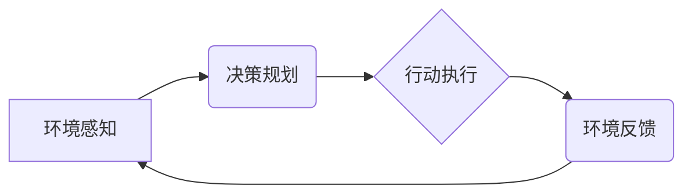

> AI Agent, 环境感知, 规划算法, 行动执行, 强化学习, 决策控制

## 1. 背景介绍

在人工智能领域，AI Agent（智能代理）作为一种能够感知环境、做出决策并执行行动的智能体，在自动驾驶、机器人控制、游戏AI等领域扮演着越来越重要的角色。一个成功的AI Agent需要具备以下关键能力：

* **环境感知:** 能够准确地感知周围环境的信息，例如位置、目标、障碍物等。
* **规划算法:** 能够根据环境信息和目标，制定出合理的行动计划。
* **行动执行:** 能够将规划好的行动转化为实际的动作，并与环境进行交互。
* **学习与适应:** 能够从经验中学习，不断优化自己的行为策略，适应不断变化的环境。

传统的AI Agent通常依赖于预先定义的规则和知识库，难以应对复杂、动态的环境。近年来，随着深度学习和强化学习等技术的快速发展，AI Agent的智能水平得到了显著提升。

## 2. 核心概念与联系

**2.1 AI Agent 的组成部分**

一个典型的AI Agent可以分为以下几个部分：

* **感知模块:** 负责收集环境信息，例如传感器数据、图像、文本等。
* **决策模块:** 负责根据环境信息和目标，制定出行动计划。
* **执行模块:** 负责将行动计划转化为实际的动作，并与环境进行交互。
* **学习模块:** 负责从经验中学习，不断优化自己的行为策略。

**2.2 核心概念关系图**



**2.3 核心概念原理**

* **环境感知:** AI Agent通过传感器或其他方式获取环境信息，并将其转化为可理解的形式。
* **决策规划:** AI Agent根据环境信息和目标，利用规划算法制定出最优的行动计划。
* **行动执行:** AI Agent将规划好的行动转化为实际的动作，并与环境进行交互。
* **学习与适应:** AI Agent通过强化学习等方法，从经验中学习，不断优化自己的行为策略，适应不断变化的环境。

## 3. 核心算法原理 & 具体操作步骤

**3.1 算法原理概述**

在AI Agent中，决策规划是至关重要的环节。常用的决策规划算法包括：

* **搜索算法:** 例如A*算法、IDA*算法等，通过搜索环境状态空间，找到从当前状态到目标状态的最优路径。
* **模型预测控制:** 建立环境模型，预测未来环境状态，并根据预测结果制定行动计划。
* **强化学习:** 通过与环境交互，学习最优的行为策略，无需事先定义规则和知识库。

**3.2 算法步骤详解**

以A*算法为例，其步骤如下：

1. **构建搜索空间:** 将环境状态表示为节点，状态之间的转移关系表示为边，构建搜索空间。
2. **定义启发函数:** 启发函数估算从当前节点到目标节点的距离，用于指导搜索方向。
3. **选择起始节点:** 从当前状态开始搜索。
4. **扩展节点:** 扩展当前节点的邻居节点，并计算其到目标节点的总代价。
5. **选择最优节点:** 选择代价最小的节点作为下一个搜索节点。
6. **重复步骤4-5:** 直到找到目标节点或搜索空间被穷尽。

**3.3 算法优缺点**

* **优点:** 能够找到最优路径，适用于静态环境。
* **缺点:** 对于复杂环境，搜索空间可能非常庞大，效率较低。

**3.4 算法应用领域**

* **路径规划:** 导航系统、机器人路径规划等。
* **游戏AI:** 游戏角色的行动规划等。

## 4. 数学模型和公式 & 详细讲解 & 举例说明

**4.1 数学模型构建**

我们可以将AI Agent的决策过程建模为一个马尔可夫决策过程（MDP）。

* **状态空间:** 环境的所有可能状态。
* **动作空间:** AI Agent可以执行的所有动作。
* **状态转移概率:** 从一个状态执行一个动作后转移到另一个状态的概率。
* **奖励函数:** AI Agent在某个状态执行某个动作后获得的奖励。

**4.2 公式推导过程**

MDP的目标是找到一个策略π，使得AI Agent在与环境交互的过程中获得最大的累积奖励。策略π是一个映射关系，将每个状态映射到一个动作。

Bellman方程是MDP最基本的数学公式，用于计算状态价值函数：

$$
V^{\pi}(s) = \max_{a \in A} \left[ R(s, a) + \gamma \sum_{s' \in S} P(s' | s, a) V^{\pi}(s') \right]
$$

其中：

* $V^{\pi}(s)$ 是状态 $s$ 在策略 $\pi$ 下的价值函数。
* $R(s, a)$ 是在状态 $s$ 执行动作 $a$ 后获得的奖励。
* $\gamma$ 是折扣因子，控制未来奖励的权重。
* $P(s' | s, a)$ 是从状态 $s$ 执行动作 $a$ 后转移到状态 $s'$ 的概率。

**4.3 案例分析与讲解**

例如，在一个简单的迷宫环境中，AI Agent的目标是找到通往出口的路径。我们可以将迷宫状态表示为节点，移动方向表示为动作，奖励函数设置为到达出口时获得最大奖励，其他状态获得零奖励。

通过Bellman方程，我们可以迭代地计算每个状态的价值函数，并根据价值函数选择最优的行动。

## 5. 项目实践：代码实例和详细解释说明

**5.1 开发环境搭建**

* Python 3.x
* TensorFlow 或 PyTorch 等深度学习框架
* OpenAI Gym 或其他强化学习环境

**5.2 源代码详细实现**

```python
import gym
import numpy as np

# 定义环境
env = gym.make('CartPole-v1')

# 定义策略网络
class PolicyNetwork(nn.Module):
    def __init__(self):
        super(PolicyNetwork, self).__init__()
        # ...

    def forward(self, state):
        # ...

# 定义训练循环
def train(policy_network, num_episodes):
    for episode in range(num_episodes):
        state = env.reset()
        done = False
        while not done:
            # 选择动作
            action = policy_network(state)
            # 执行动作
            next_state, reward, done, _ = env.step(action)
            # 更新策略网络
            # ...
        # 打印进度
        print(f"Episode {episode+1}/{num_episodes}")

# 训练模型
policy_network = PolicyNetwork()
train(policy_network, num_episodes=1000)
```

**5.3 代码解读与分析**

* 首先，我们定义了环境和策略网络。
* 然后，我们定义了一个训练循环，在每个episode中，AI Agent与环境交互，选择动作，执行动作，并根据奖励更新策略网络。
* 训练循环结束后，AI Agent能够在环境中表现出一定的智能行为。

**5.4 运行结果展示**

在训练完成后，我们可以将AI Agent部署到实际环境中，观察其行为。例如，在CartPole-v1环境中，训练好的AI Agent能够控制杆子保持平衡，持续一段时间。

## 6. 实际应用场景

**6.1 自动驾驶**

AI Agent可以用于自动驾驶汽车的决策控制，例如规划路径、避障、控制车速等。

**6.2 机器人控制**

AI Agent可以用于控制机器人执行各种任务，例如搬运物体、清洁环境等。

**6.3 游戏AI**

AI Agent可以用于开发游戏中的AI角色，例如游戏中的敌人、NPC等。

**6.4 未来应用展望**

随着人工智能技术的不断发展，AI Agent的应用场景将会更加广泛，例如医疗诊断、金融交易、个性化教育等。

## 7. 工具和资源推荐

**7.1 学习资源推荐**

* **书籍:**
    * Reinforcement Learning: An Introduction by Sutton and Barto
    * Artificial Intelligence: A Modern Approach by Russell and Norvig
* **在线课程:**
    * Coursera: Reinforcement Learning Specialization
    * Udacity: Intro to Artificial Intelligence

**7.2 开发工具推荐**

* **Python:** 广泛用于人工智能开发，拥有丰富的库和工具。
* **TensorFlow:** Google开发的深度学习框架。
* **PyTorch:** Facebook开发的深度学习框架。
* **OpenAI Gym:** 强化学习环境库。

**7.3 相关论文推荐**

* Deep Reinforcement Learning with Double Q-learning
* Proximal Policy Optimization Algorithms
* Asynchronous Methods for Deep Reinforcement Learning

## 8. 总结：未来发展趋势与挑战

**8.1 研究成果总结**

近年来，AI Agent在环境感知、决策规划、行动执行等方面取得了显著进展，能够在复杂环境中表现出较高的智能水平。

**8.2 未来发展趋势**

* **更强大的学习能力:** AI Agent将能够从更少的数据中学习，并适应更复杂的环境。
* **更安全的决策机制:** AI Agent的决策机制将更加安全可靠，能够更好地应对突发事件。
* **更广泛的应用场景:** AI Agent将应用于更多领域，例如医疗、教育、金融等。

**8.3 面临的挑战**

* **数据获取和标注:** 训练AI Agent需要大量的标注数据，获取和标注数据仍然是一个挑战。
* **模型解释性和可解释性:** AI Agent的决策过程往往是复杂的，难以解释和理解，这可能会阻碍其在一些领域中的应用。
* **伦理和安全问题:** AI Agent的决策可能会对人类社会产生影响，需要考虑伦理和安全问题。

**8.4 研究展望**

未来，AI Agent的研究将继续朝着更智能、更安全、更可解释的方向发展。


## 9. 附录：常见问题与解答

**9.1 如何选择合适的决策规划算法？**

选择合适的决策规划算法取决于具体的应用场景和环境特点。

* **静态环境:** 可以使用搜索算法，例如A*算法。
* **动态环境:** 可以使用模型预测控制或强化学习算法。

**9.2 如何评估AI Agent的性能？**

常用的评估指标包括：

* **奖励:** AI Agent在与环境交互过程中获得的总奖励。
* **成功率:** AI Agent完成目标任务的成功率。
* **时间效率:** AI Agent完成任务所需的时间。

**9.3 如何解决数据获取和标注问题？**

* **利用公开数据集:** 许多公开数据集可以用于训练AI Agent。
* **数据增强:** 通过对现有数据进行变换，可以生成更多的数据。
* **迁移学习:** 利用已训练好的模型，在新的任务上进行微调。


作者：禅与计算机程序设计艺术 / Zen and the Art of Computer Programming 
<end_of_turn>