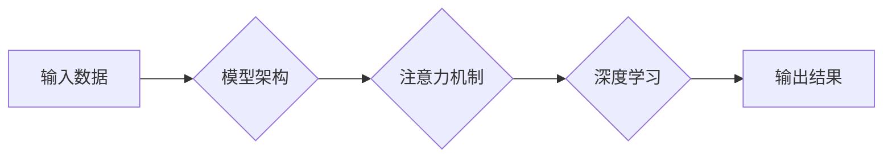

> AI大模型，组织能力，模型架构，Transformer，注意力机制，深度学习，自然语言处理

## 1. 背景介绍

近年来，人工智能（AI）领域取得了令人瞩目的进展，其中大模型扮演着越来越重要的角色。大模型是指参数规模庞大、训练数据海量的人工智能模型，其强大的学习能力和泛化能力使其能够在各种任务中表现出色，例如自然语言处理、计算机视觉、语音识别等。

大模型的成功离不开其强大的组织能力。模型的组织能力是指模型能够有效地处理和组织海量信息的能力，并将其转化为有价值的知识和洞察力。

## 2. 核心概念与联系

大模型的组织能力主要体现在以下几个方面：

* **模型架构**: 模型架构决定了模型的结构和功能，不同的架构具有不同的组织能力。例如，Transformer架构由于其强大的注意力机制，能够有效地捕捉长距离依赖关系，从而提升模型的组织能力。

* **注意力机制**: 注意力机制是一种用于突出重要信息的技术，它能够帮助模型聚焦于输入数据中最重要的部分，从而提高模型的组织效率。

* **深度学习**: 深度学习是一种基于多层神经网络的机器学习方法，它能够学习到数据中的复杂模式和关系，从而提升模型的组织能力。

**Mermaid 流程图**



## 3. 核心算法原理 & 具体操作步骤

### 3.1  算法原理概述

Transformer是一种基于注意力机制的深度学习模型，其核心思想是通过自注意力机制捕捉输入序列中的长距离依赖关系，从而提升模型的组织能力。

### 3.2  算法步骤详解

1. **词嵌入**: 将输入序列中的每个词转换为向量表示。
2. **多头自注意力**: 对输入序列中的每个词进行多头自注意力计算，捕捉词与词之间的关系。
3. **前馈神经网络**: 对每个词的注意力输出进行前馈神经网络处理，进一步提取特征。
4. **位置编码**: 将位置信息编码到词向量中，以解决Transformer模型无法处理顺序信息的缺陷。
5. **堆叠**: 将多个Transformer编码器层堆叠在一起，以进一步提升模型的组织能力。
6. **解码器**: 使用解码器对编码器的输出进行解码，生成目标序列。

### 3.3  算法优缺点

**优点**:

* 能够有效地捕捉长距离依赖关系。
* 并行计算能力强，训练速度快。
* 在自然语言处理任务中表现出色。

**缺点**:

* 参数量大，训练成本高。
* 对训练数据要求高。

### 3.4  算法应用领域

Transformer模型在自然语言处理领域有着广泛的应用，例如：

* 机器翻译
* 文本摘要
* 问答系统
* 情感分析

## 4. 数学模型和公式 & 详细讲解 & 举例说明

### 4.1  数学模型构建

Transformer模型的数学模型主要基于注意力机制和深度神经网络。

**注意力机制**:

注意力机制的数学公式如下：

$$
Attention(Q, K, V) = softmax(\frac{QK^T}{\sqrt{d_k}})V
$$

其中：

* $Q$：查询矩阵
* $K$：键矩阵
* $V$：值矩阵
* $d_k$：键向量的维度

**深度神经网络**:

深度神经网络的数学模型基于多层感知机，其输出可以表示为：

$$
y = f(W_L \cdot h_L + b_L)
$$

其中：

* $y$：输出
* $W_L$：第L层的权重矩阵
* $h_L$：第L层的隐藏状态
* $b_L$：第L层的偏置项
* $f$：激活函数

### 4.2  公式推导过程

注意力机制的公式推导过程可以参考相关文献，其核心思想是通过计算查询向量与键向量的相似度来确定每个键向量对查询向量的贡献度，然后将这些贡献度加权平均到值向量中，得到最终的注意力输出。

### 4.3  案例分析与讲解

例如，在机器翻译任务中，Transformer模型可以将源语言句子中的每个词作为查询向量，将目标语言词典中的每个词作为键向量，并将目标语言词典中的每个词的嵌入向量作为值向量。通过计算注意力机制，模型可以确定每个源语言词与每个目标语言词之间的关系，从而生成更准确的翻译结果。

## 5. 项目实践：代码实例和详细解释说明

### 5.1  开发环境搭建

* Python 3.7+
* PyTorch 1.7+
* CUDA 10.2+

### 5.2  源代码详细实现

```python
import torch
import torch.nn as nn

class Transformer(nn.Module):
    def __init__(self, vocab_size, embedding_dim, num_heads, num_layers):
        super(Transformer, self).__init__()
        self.embedding = nn.Embedding(vocab_size, embedding_dim)
        self.encoder_layers = nn.ModuleList([EncoderLayer(embedding_dim, num_heads) for _ in range(num_layers)])
        self.decoder_layers = nn.ModuleList([DecoderLayer(embedding_dim, num_heads) for _ in range(num_layers)])

    def forward(self, src, tgt, src_mask, tgt_mask):
        src = self.embedding(src)
        tgt = self.embedding(tgt)
        
        # Encoder
        encoder_output = src
        for layer in self.encoder_layers:
            encoder_output = layer(encoder_output, src_mask)
        
        # Decoder
        decoder_output = tgt
        for layer in self.decoder_layers:
            decoder_output = layer(decoder_output, encoder_output, tgt_mask)
        
        return decoder_output

class EncoderLayer(nn.Module):
    # ...

class DecoderLayer(nn.Module):
    # ...
```

### 5.3  代码解读与分析

* Transformer模型的代码实现主要包括三个部分：嵌入层、编码器层和解码器层。
* 嵌入层将输入序列中的每个词转换为向量表示。
* 编码器层负责对输入序列进行编码，并捕捉词之间的关系。
* 解码器层负责对编码后的信息进行解码，生成目标序列。

### 5.4  运行结果展示

运行代码后，模型可以生成目标序列，例如机器翻译任务中，模型可以将源语言句子翻译成目标语言句子。

## 6. 实际应用场景

Transformer模型在自然语言处理领域有着广泛的应用场景，例如：

* **机器翻译**: 将一种语言翻译成另一种语言。
* **文本摘要**: 将长篇文本压缩成短篇摘要。
* **问答系统**: 回答用户提出的问题。
* **情感分析**: 分析文本的情感倾向。
* **代码生成**: 根据自然语言描述生成代码。

### 6.4  未来应用展望

随着Transformer模型的不断发展，其应用场景将会更加广泛，例如：

* **对话系统**: 开发更智能、更自然的对话系统。
* **内容创作**: 自动生成新闻、文章、诗歌等内容。
* **教育**: 提供个性化的学习体验。
* **医疗**: 辅助医生诊断疾病、制定治疗方案。

## 7. 工具和资源推荐

### 7.1  学习资源推荐

* **论文**:
    * Vaswani, A., Shazeer, N., Parmar, N., Uszkoreit, J., Jones, L., Gomez, A. N., ... & Polosukhin, I. (2017). Attention is all you need. In Advances in neural information processing systems (pp. 5998-6008).
* **书籍**:
    * Deep Learning with Python by Francois Chollet
    * Natural Language Processing with PyTorch by Jason Brownlee

### 7.2  开发工具推荐

* **PyTorch**: 深度学习框架
* **Hugging Face Transformers**: 预训练Transformer模型库

### 7.3  相关论文推荐

* BERT: Pre-training of Deep Bidirectional Transformers for Language Understanding
* GPT-3: Language Models are Few-Shot Learners
* T5: Text-to-Text Transfer Transformer

## 8. 总结：未来发展趋势与挑战

### 8.1  研究成果总结

近年来，Transformer模型取得了显著的成果，在自然语言处理任务中取得了突破性的进展。

### 8.2  未来发展趋势

* **模型规模**: 模型规模将继续扩大，以提升模型的性能。
* **效率**: 研究更高效的Transformer模型训练和推理方法。
* **多模态**: 将Transformer模型扩展到多模态数据，例如文本、图像、音频等。

### 8.3  面临的挑战

* **数据**: 大模型训练需要海量数据，数据获取和标注成本高。
* **计算资源**: 大模型训练需要大量的计算资源，成本高昂。
* **可解释性**: 大模型的决策过程难以解释，缺乏透明度。

### 8.4  研究展望

未来，研究人员将继续探索Transformer模型的潜力，开发更强大、更智能、更安全的大模型，为人类社会带来更多福祉。

## 9. 附录：常见问题与解答

* **什么是Transformer模型？**

Transformer模型是一种基于注意力机制的深度学习模型，其核心思想是通过自注意力机制捕捉输入序列中的长距离依赖关系，从而提升模型的组织能力。

* **Transformer模型有哪些优点？**

Transformer模型具有以下优点：

* 能够有效地捕捉长距离依赖关系。
* 并行计算能力强，训练速度快。
* 在自然语言处理任务中表现出色。

* **Transformer模型有哪些缺点？**

Transformer模型也存在一些缺点：

* 参数量大，训练成本高。
* 对训练数据要求高。


作者：禅与计算机程序设计艺术 / Zen and the Art of Computer Programming 
<end_of_turn>