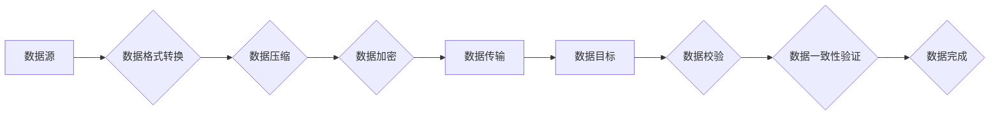

> AI大模型、数据中心、数据迁移、迁移策略、数据安全、数据一致性、性能优化

## 1. 背景介绍

随着人工智能（AI）技术的飞速发展，大规模AI模型（例如GPT-3、BERT等）的应用日益广泛，涵盖自然语言处理、计算机视觉、语音识别等多个领域。这些模型的训练和部署都需要海量的数据支撑，因此数据中心作为AI大模型应用的基础设施，显得尤为重要。

然而，随着数据量的不断增长和模型规模的不断扩大，数据中心面临着新的挑战：

* **数据存储和管理成本不断上升:** 海量数据的存储和管理需要大量的硬件资源和人力成本。
* **数据迁移效率低下:** 数据中心通常需要定期迁移数据，例如进行模型更新、数据备份等，而传统的迁移方式效率低下，容易造成数据丢失或损坏。
* **数据安全和隐私问题:** 数据中心存储着大量敏感数据，需要采取有效的安全措施来保护数据安全和隐私。

为了解决这些问题，我们需要制定合理的AI大模型应用数据中心的数据迁移策略，以确保数据安全、高效、可靠地迁移。

## 2. 核心概念与联系

数据迁移是指将数据从一个存储系统转移到另一个存储系统的过程。在AI大模型应用数据中心中，数据迁移通常涉及以下几个核心概念：

* **数据源:** 数据的原始存储位置，例如本地磁盘、云存储等。
* **数据目标:** 数据需要迁移到的存储位置，例如另一个数据中心、云存储等。
* **数据格式:** 数据的存储格式，例如CSV、JSON、Parquet等。
* **数据量:** 需要迁移的数据量。
* **迁移时间:** 数据迁移需要花费的时间。

数据迁移策略需要根据以上核心概念，以及数据中心的具体情况，制定相应的方案。

**数据迁移流程图:**



## 3. 核心算法原理 & 具体操作步骤

### 3.1  算法原理概述

数据迁移算法的核心是高效地将数据从源系统传输到目标系统，同时保证数据完整性和一致性。常用的数据迁移算法包括：

* **增量迁移:** 只迁移数据源中新增或修改的数据，减少数据传输量。
* **全量迁移:** 将所有数据从源系统迁移到目标系统。
* **差分迁移:** 比较源系统和目标系统的数据，只迁移源系统中不存在的目标系统中的数据。

### 3.2  算法步骤详解

**增量迁移算法步骤:**

1. **数据源分析:** 分析数据源的结构、格式和变化规律。
2. **数据版本控制:** 为数据源建立版本控制机制，记录数据变化历史。
3. **数据差异检测:** 比较数据源的当前版本和目标系统的版本，识别出需要迁移的数据。
4. **数据传输:** 将差异数据传输到目标系统。
5. **数据校验:** 校验目标系统中迁移数据的完整性和一致性。

**全量迁移算法步骤:**

1. **数据备份:** 对数据源进行备份，以防数据丢失。
2. **数据格式转换:** 将数据源的数据格式转换为目标系统支持的格式。
3. **数据压缩:** 对数据进行压缩，减少数据传输量。
4. **数据加密:** 对数据进行加密，保证数据安全。
5. **数据传输:** 将压缩、加密后的数据传输到目标系统。
6. **数据校验:** 校验目标系统中迁移数据的完整性和一致性。

### 3.3  算法优缺点

**增量迁移算法:**

* **优点:** 数据传输量小，迁移效率高。
* **缺点:** 需要维护数据版本控制机制，对数据源的结构和格式要求较高。

**全量迁移算法:**

* **优点:** 简单易行，对数据源的结构和格式要求较低。
* **缺点:** 数据传输量大，迁移效率低。

### 3.4  算法应用领域

增量迁移算法适用于数据变化频繁的数据中心，例如在线交易系统、日志系统等。全量迁移算法适用于数据变化较少的数据中心，例如备份系统、历史数据仓库等。

## 4. 数学模型和公式 & 详细讲解 & 举例说明

### 4.1  数学模型构建

数据迁移的效率可以表示为：

$$
Efficiency = \frac{Transferred Data}{Total Data} \times 100\%
$$

其中：

* Transferred Data: 迁移的数据量
* Total Data: 总的数据量

### 4.2  公式推导过程

数据迁移的时间可以表示为：

$$
Time = \frac{Transferred Data}{Bandwidth}
$$

其中：

* Bandwidth: 数据传输带宽

### 4.3  案例分析与讲解

假设一个数据中心需要迁移 100GB 的数据，数据传输带宽为 100Mbps，则数据迁移的时间为：

$$
Time = \frac{100GB}{100Mbps} = 1000000s = 11.57 days
$$

## 5. 项目实践：代码实例和详细解释说明

### 5.1  开发环境搭建

* 操作系统: Ubuntu 20.04
* 编程语言: Python 3.8
* 依赖库:

    * `pandas`: 数据处理库
    * `requests`: HTTP请求库
    * `gzip`: 数据压缩库
    * `cryptography`: 数据加密库

### 5.2  源代码详细实现

```python
import pandas as pd
import requests
import gzip
from cryptography.fernet import Fernet

# 数据源配置
source_url = "http://source_server/data.csv"
source_format = "csv"

# 数据目标配置
target_url = "http://target_server/data.csv"
target_format = "csv"

# 密钥配置
key = Fernet.generate_key()
f = Fernet(key)

# 数据格式转换
def convert_data_format(data, format):
    if format == "csv":
        return pd.read_csv(data)
    else:
        raise ValueError("Unsupported data format")

# 数据压缩
def compress_data(data):
    compressed_data = gzip.compress(data.to_string().encode())
    return compressed_data

# 数据加密
def encrypt_data(data, key):
    encrypted_data = f.encrypt(data.to_string().encode())
    return encrypted_data

# 数据传输
def transfer_data(data, url):
    response = requests.post(url, data=data)
    if response.status_code == 200:
        print("Data transfer successful")
    else:
        print("Data transfer failed")

# 数据迁移流程
def migrate_data():
    # 获取数据源数据
    source_data = requests.get(source_url).content
    source_df = convert_data_format(source_data, source_format)

    # 数据压缩和加密
    compressed_data = compress_data(source_df)
    encrypted_data = encrypt_data(compressed_data, key)

    # 数据传输
    transfer_data(encrypted_data, target_url)

# 执行数据迁移
migrate_data()
```

### 5.3  代码解读与分析

该代码实现了一个简单的增量数据迁移流程。

1. **数据源配置:** 设置数据源的URL和格式。
2. **数据目标配置:** 设置数据目标的URL和格式。
3. **密钥配置:** 生成一个加密密钥。
4. **数据格式转换:** 使用`pandas`库将数据从源格式转换为目标格式。
5. **数据压缩:** 使用`gzip`库压缩数据，减少传输量。
6. **数据加密:** 使用`cryptography`库加密数据，保证数据安全。
7. **数据传输:** 使用`requests`库将数据传输到目标系统。
8. **数据迁移流程:** 将以上步骤整合到一个函数中，实现数据迁移流程。

### 5.4  运行结果展示

运行该代码后，将从数据源获取数据，进行压缩、加密和传输到数据目标。

## 6. 实际应用场景

### 6.1  云迁移

将数据中心的数据迁移到云平台，可以获得更灵活、可扩展的存储和计算资源。

### 6.2  灾难恢复

将数据中心的数据备份到另一个数据中心，可以应对灾难事件，确保数据安全。

### 6.3  数据仓库建设

将数据中心的数据迁移到数据仓库，可以进行数据分析和挖掘。

### 6.4  未来应用展望

随着AI技术的不断发展，数据中心的数据迁移将变得更加复杂和重要。未来，数据迁移策略需要更加智能化、自动化，并能够适应各种不同的数据类型和应用场景。

## 7. 工具和资源推荐

### 7.1  学习资源推荐

* **书籍:**

    * 《数据迁移指南》
    * 《云计算数据迁移》

* **在线课程:**

    * Coursera: 数据迁移
    * Udemy: 云迁移

### 7.2  开发工具推荐

* **开源工具:**

    * rsync: 文件同步工具
    * Duplicity: 数据备份工具
    * Apache NiFi: 数据流处理平台

* **商业工具:**

    * AWS Database Migration Service
    * Azure Database Migration Service
    * Google Cloud Data Transfer Service

### 7.3  相关论文推荐

* **论文:**

    * 《数据迁移策略研究》
    * 《云计算环境下数据迁移技术研究》

## 8. 总结：未来发展趋势与挑战

### 8.1  研究成果总结

本文介绍了AI大模型应用数据中心的数据迁移策略，包括核心概念、算法原理、代码实现以及实际应用场景。

### 8.2  未来发展趋势

* **智能化数据迁移:** 利用机器学习等技术，自动识别数据迁移策略，并根据数据变化情况动态调整迁移策略。
* **自动化数据迁移:** 利用自动化工具，实现数据迁移的自动化部署和管理。
* **安全可靠的数据迁移:** 加强数据加密、身份验证等安全措施，确保数据在迁移过程中的安全性和可靠性。

### 8.3  面临的挑战

* **数据量和复杂度:** AI大模型应用数据中心的数据量和复杂度不断增加，对数据迁移技术提出了更高的要求。
* **数据安全和隐私:** 数据迁移过程中需要保护数据安全和隐私，避免数据泄露和滥用。
* **技术标准和兼容性:** 数据迁移技术缺乏统一的标准和规范，不同平台和工具之间存在兼容性问题。

### 8.4  研究展望

未来，需要进一步研究智能化、自动化、安全可靠的数据迁移技术，以满足AI大模型应用数据中心的不断发展需求。

## 9. 附录：常见问题与解答

### 9.1  常见问题

* **数据迁移需要多长时间？**

数据迁移的时间取决于数据量、带宽和迁移算法等因素。

* **数据迁移过程中如何保证数据安全？**

数据迁移过程中需要使用加密、身份验证等安全措施，确保数据安全。

* **数据迁移完成后如何验证数据完整性？**

可以使用数据校验工具，验证数据迁移后的完整性和一致性。

### 9.2  解答

* **数据迁移需要多长时间？**

数据迁移的时间取决于数据量、带宽和迁移算法等因素。例如，迁移100GB的数据，带宽为100Mbps，则需要大约11.57天。

* **数据迁移过程中如何保证数据安全？**

数据迁移过程中需要使用加密、身份验证等安全措施，确保数据安全。例如，可以使用加密算法对数据进行加密，并使用身份验证机制验证用户身份。

* **数据迁移完成后如何验证数据完整性？**

可以使用数据校验工具，验证数据迁移后的完整性和一致性。例如，可以使用MD5或SHA-1算法