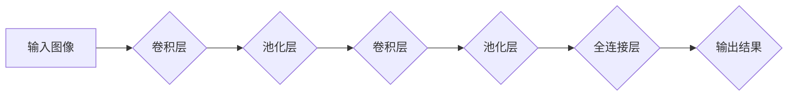

> 卷积神经网络，CNN，计算机视觉，图像识别，深度学习，Yann LeCun，Meta

## 1. 背景介绍

人工智能（AI）的蓬勃发展，深刻地改变了我们生活的方方面面。其中，深度学习作为人工智能的核心技术之一，在图像识别、自然语言处理、语音识别等领域取得了突破性的进展。而卷积神经网络（CNN）作为深度学习的重要分支，在计算机视觉领域扮演着举足轻重的角色。

Yann LeCun，一位享誉全球的计算机科学家，被誉为“卷积网络之父”。他不仅在卷积神经网络的理论研究方面做出了卓越贡献，还将其应用于实际问题，取得了令人瞩目的成果。本文将深入探讨Yann LeCun的学术生涯，以及他所领导的团队在卷积神经网络领域取得的成就，并展望未来发展趋势。

## 2. 核心概念与联系

卷积神经网络（CNN）是一种专门用于处理图像数据的深度学习模型。它借鉴了生物视觉系统的神经元结构和功能，通过卷积、池化、全连接等操作，提取图像特征，并进行分类或识别。

**CNN 的核心概念：**

* **卷积层：** 利用卷积核对图像进行卷积运算，提取图像局部特征。
* **池化层：** 对卷积层的输出进行降维操作，减少计算量，提高模型鲁棒性。
* **全连接层：** 将池化层的输出连接到全连接层，进行最终的分类或识别。

**CNN 与其他深度学习模型的关系：**

CNN 是深度学习模型的一种，与其他深度学习模型，如循环神经网络（RNN）和生成对抗网络（GAN）等，都属于深度学习家族。它们各有特点，应用场景也不尽相同。

**Mermaid 流程图：**

## 3. 核心算法原理 & 具体操作步骤

### 3.1  算法原理概述

卷积神经网络的核心算法原理是利用卷积运算和池化运算来提取图像特征。卷积运算通过卷积核对图像进行滑动计算，提取图像局部特征。池化运算则对卷积层的输出进行降维操作，减少计算量，提高模型鲁棒性。

### 3.2  算法步骤详解

1. **输入图像预处理：** 将输入图像转换为适合CNN处理的格式，例如调整图像大小、归一化像素值等。
2. **卷积层：** 使用多个卷积核对图像进行卷积运算，每个卷积核对应提取一种特定的特征。卷积运算的结果称为特征图。
3. **池化层：** 对卷积层的输出特征图进行池化操作，例如最大池化或平均池化，以减少特征图的大小，提高模型的鲁棒性。
4. **激活函数：** 在卷积层和池化层之间，通常使用激活函数，例如ReLU函数，来引入非线性，提高模型的表达能力。
5. **全连接层：** 将池化层的输出连接到全连接层，进行最终的分类或识别。全连接层将所有特征进行融合，并输出最终的分类结果。

### 3.3  算法优缺点

**优点：**

* **提取图像特征能力强：** CNN 可以自动学习图像特征，无需人工设计特征。
* **鲁棒性强：** 池化层可以减少模型对图像噪声和变化的敏感度。
* **应用广泛：** CNN 在图像识别、物体检测、图像分割等计算机视觉任务中取得了优异的性能。

**缺点：**

* **训练数据量大：** CNN 需要大量的训练数据才能达到较好的性能。
* **计算量大：** CNN 的训练和推理过程需要大量的计算资源。
* **可解释性差：** CNN 的决策过程比较复杂，难以解释模型的决策结果。

### 3.4  算法应用领域

CNN 在计算机视觉领域有着广泛的应用，例如：

* **图像识别：** 识别图像中的物体、场景、人物等。
* **物体检测：** 在图像中定位和识别物体。
* **图像分割：** 将图像分割成不同的区域，例如分割图像中的前景和背景。
* **人脸识别：** 识别图像中的特定人脸。
* **医学图像分析：** 用于诊断疾病、辅助手术等。

## 4. 数学模型和公式 & 详细讲解 & 举例说明

### 4.1  数学模型构建

卷积神经网络的数学模型主要包括卷积运算、池化运算和激活函数等。

**卷积运算：**

卷积运算的数学公式如下：

$$
y(i,j) = \sum_{m=0}^{M-1} \sum_{n=0}^{N-1} x(i+m,j+n) * w(m,n)
$$

其中：

* $y(i,j)$ 是卷积输出的像素值。
* $x(i+m,j+n)$ 是输入图像的像素值。
* $w(m,n)$ 是卷积核的权值。
* $M$ 和 $N$ 是卷积核的大小。

**池化运算：**

池化运算常用的方法是最大池化，其数学公式如下：

$$
y(i,j) = \max_{m=0}^{M-1} \max_{n=0}^{N-1} x(i*s+m,j*s+n)
$$

其中：

* $y(i,j)$ 是池化输出的像素值。
* $x(i*s+m,j*s+n)$ 是输入特征图的像素值。
* $s$ 是池化窗口的大小。

**激活函数：**

常用的激活函数包括ReLU函数、Sigmoid函数等。

### 4.2  公式推导过程

卷积运算和池化运算的公式推导过程比较复杂，需要一定的数学基础。

### 4.3  案例分析与讲解

通过具体的案例分析，可以更好地理解卷积神经网络的数学模型和算法原理。例如，可以分析LeNet-5网络的结构和参数，以及其在手写数字识别任务中的应用效果。

## 5. 项目实践：代码实例和详细解释说明

### 5.1  开发环境搭建

使用Python语言和深度学习框架TensorFlow或PyTorch搭建卷积神经网络的开发环境。

### 5.2  源代码详细实现

使用TensorFlow或PyTorch框架，实现一个简单的卷积神经网络模型，例如用于手写数字识别。

### 5.3  代码解读与分析

对代码进行详细解读，解释每个代码块的功能和作用。

### 5.4  运行结果展示

运行代码，并展示模型的训练和测试结果，例如准确率、损失函数等指标。

## 6. 实际应用场景

### 6.1  图像识别

CNN在图像识别领域有着广泛的应用，例如：

* **自动驾驶：** 用于识别道路标志、交通信号灯、行人等。
* **安防监控：** 用于识别嫌疑人、监控异常行为。
* **医疗诊断：** 用于识别病灶、辅助诊断疾病。

### 6.2  物体检测

CNN可以用于检测图像中特定物体的位置和类别，例如：

* **无人机航拍：** 用于识别目标物体的位置和类型。
* **零售业：** 用于识别商品，自动计价。
* **工业自动化：** 用于检测产品缺陷。

### 6.3  图像分割

CNN可以将图像分割成不同的区域，例如：

* **医学图像分析：** 用于分割器官、组织等。
* **遥感图像分析：** 用于分割土地类型、植被覆盖等。
* **自动驾驶：** 用于分割道路、行人、障碍物等。

### 6.4  未来应用展望

随着深度学习技术的不断发展，CNN在未来将有更广泛的应用场景，例如：

* **增强现实（AR）和虚拟现实（VR）：** 用于识别现实世界中的物体，并将其与虚拟世界进行融合。
* **机器人视觉：** 用于帮助机器人理解和感知周围环境。
* **个性化推荐：** 用于根据用户的画像，推荐个性化的商品或服务。

## 7. 工具和资源推荐

### 7.1  学习资源推荐

* **书籍：**
    * 《深度学习》
    * 《卷积神经网络》
* **在线课程：**
    * Coursera 上的深度学习课程
    * Udacity 上的深度学习工程师课程

### 7.2  开发工具推荐

* **深度学习框架：** TensorFlow、PyTorch
* **编程语言：** Python
* **数据可视化工具：** Matplotlib、Seaborn

### 7.3  相关论文推荐

* LeCun, Y., Boser, B., Denker, J. S., Henderson, D., Howard, R. E., Hubbard, W., & Jackel, L. D. (1989). Backpropagation applied to handwritten zip code recognition. Neural computation, 1(4), 541-551.
* Krizhevsky, A., Sutskever, I., & Hinton, G. E. (2012). Imagenet classification with deep convolutional neural networks. In Advances in neural information processing systems (pp. 1097-1105).

## 8. 总结：未来发展趋势与挑战

### 8.1  研究成果总结

Yann LeCun在卷积神经网络领域做出了卓越的贡献，他的研究成果推动了深度学习的发展，并广泛应用于计算机视觉领域。

### 8.2  未来发展趋势

未来卷积神经网络的发展趋势包括：

* **模型更深更广：** 探索更深层次、更广阔的网络结构，提高模型的表达能力和泛化能力。
* **高效训练：** 研究更有效的训练方法，降低模型训练的成本和时间。
* **可解释性增强：** 提高模型的透明度和可解释性，帮助人们更好地理解模型的决策过程。

### 8.3  面临的挑战

卷积神经网络的发展也面临着一些挑战，例如：

* **数据获取和标注：** 训练高质量的卷积神经网络需要大量的标注数据，数据获取和标注成本较高。
* **计算资源需求：** 训练大型卷积神经网络需要大量的计算资源，这对于资源有限的机构或个人来说是一个挑战。
* **模型安全性：** 卷积神经网络容易受到攻击，例如对抗样本攻击，需要研究更安全的模型架构和训练方法。

### 8.4  研究展望

未来，卷积神经网络的研究将继续深入，探索更深层次的网络结构、更有效的训练方法和更强的可解释性，并应用于更多领域，为人类社会带来更多福祉。

## 9. 附录：常见问题与解答

**常见问题：**

* 什么是卷积神经网络？
* 卷积神经网络的应用场景有哪些？
* 如何训练一个卷积神经网络？
* 卷积神经网络的优缺点是什么？

**解答：**

* 卷积神经网络是一种专门用于处理图像数据的深度学习模型，它借鉴了生物视觉系统的结构和功能，通过卷积、池化等操作，提取图像特征，并进行分类或识别。
* 卷积神经网络的应用场景非常广泛，例如图像识别、物体检测、图像分割、人脸识别、医学图像分析等。
* 训练一个卷积神经网络需要使用深度学习框架，例如TensorFlow或PyTorch，并准备大量的标注数据。
* 卷积神经网络的优点是提取图像特征能力强、鲁棒性强、