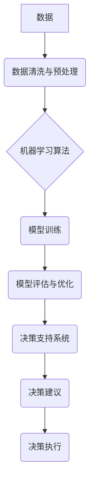

> AI 辅助决策，数据驱动，机器学习，深度学习，决策支持系统，预测分析，风险管理

## 1. 背景介绍

在当今数据爆炸的时代，企业和组织面临着海量数据的处理和分析挑战。如何从海量数据中提取有价值的信息，并将其转化为可操作的决策，成为企业发展的重要课题。人工智能（AI）技术凭借其强大的数据处理和分析能力，为AI辅助决策提供了新的解决方案。

AI辅助决策是指利用人工智能技术，对数据进行分析和预测，为决策者提供数据支持，帮助他们做出更明智、更有效的决策。这种决策模式的核心是将数据驱动与人类智慧相结合，充分发挥两者优势，实现决策的智能化和科学化。

## 2. 核心概念与联系

**2.1 核心概念**

* **AI 辅助决策:** 利用人工智能技术，对数据进行分析和预测，为决策者提供数据支持，帮助他们做出更明智、更有效的决策。
* **数据驱动:** 基于数据分析和预测结果，而不是主观臆断或经验判断，来指导决策。
* **机器学习:** 一种人工智能技术，通过算法训练，使机器能够从数据中学习，并对新数据进行预测或分类。
* **深度学习:** 一种机器学习的子集，利用多层神经网络，能够学习更复杂的模式和特征。
* **决策支持系统 (DSS):** 一种利用计算机技术，帮助决策者分析数据、识别模式和趋势，并提供决策建议的系统。

**2.2 核心概念联系**

AI辅助决策的核心是将数据驱动、机器学习和决策支持系统相结合。

* 数据驱动为决策提供基础，机器学习算法从数据中提取有价值的信息，深度学习则能够学习更复杂的模式和特征。
* 决策支持系统将这些信息整合在一起，并提供可视化界面和决策建议，帮助决策者做出更明智的决策。



## 3. 核心算法原理 & 具体操作步骤

**3.1 算法原理概述**

AI辅助决策的核心算法主要包括：

* **回归算法:** 用于预测连续数值型变量，例如销售额、股票价格等。常见的回归算法包括线性回归、逻辑回归、支持向量机回归等。
* **分类算法:** 用于预测离散型变量，例如客户是否会购买产品、邮件是否为垃圾邮件等。常见的分类算法包括逻辑回归、决策树、支持向量机分类等。
* **聚类算法:** 用于将数据点根据相似性进行分组，例如客户群体的划分、异常数据的检测等。常见的聚类算法包括K-means聚类、层次聚类等。

**3.2 算法步骤详解**

以回归算法为例，其具体操作步骤如下：

1. **数据收集与预处理:** 收集相关数据，并进行清洗、转换、特征工程等预处理操作。
2. **模型选择:** 根据具体问题选择合适的回归算法模型。
3. **模型训练:** 使用训练数据对模型进行训练，学习数据之间的关系。
4. **模型评估:** 使用测试数据对模型进行评估，评估模型的预测精度。
5. **模型优化:** 根据评估结果，调整模型参数或选择其他算法模型，提高模型性能。
6. **模型部署:** 将训练好的模型部署到实际应用环境中，用于预测新数据。

**3.3 算法优缺点**

不同的算法具有不同的优缺点，需要根据具体问题选择合适的算法。

* **回归算法:** 优点：能够预测连续数值型变量，适用范围广。缺点：对异常数据敏感，预测精度受数据质量影响。
* **分类算法:** 优点：能够预测离散型变量，适用范围广。缺点：对数据分布变化敏感，需要进行类别平衡处理。
* **聚类算法:** 优点：能够发现数据中的潜在结构，适用于无监督学习。缺点：聚类结果难以解释，需要进行聚类评估。

**3.4 算法应用领域**

AI辅助决策算法广泛应用于各个领域，例如：

* **金融领域:** 预测股票价格、风险评估、客户信用评分等。
* **医疗领域:** 疾病诊断、药物研发、患者风险预测等。
* **电商领域:** 商品推荐、价格预测、客户行为分析等。
* **制造业:** 预测设备故障、优化生产流程、质量控制等。

## 4. 数学模型和公式 & 详细讲解 & 举例说明

**4.1 数学模型构建**

以线性回归为例，其数学模型如下：

$$
y = \beta_0 + \beta_1x_1 + \beta_2x_2 + ... + \beta_nx_n + \epsilon
$$

其中：

* $y$ 是预测变量
* $x_1, x_2, ..., x_n$ 是自变量
* $\beta_0, \beta_1, ..., \beta_n$ 是回归系数
* $\epsilon$ 是误差项

**4.2 公式推导过程**

线性回归模型的目标是找到最佳的回归系数，使得预测值与实际值之间的误差最小。常用的最小二乘法可以用来求解回归系数。

最小二乘法的目标函数是：

$$
J(\beta_0, \beta_1, ..., \beta_n) = \sum_{i=1}^{n}(y_i - \hat{y}_i)^2
$$

其中：

* $y_i$ 是实际值
* $\hat{y}_i$ 是预测值

通过对目标函数求导，并令其等于零，可以得到回归系数的解。

**4.3 案例分析与讲解**

假设我们想要预测房屋价格，自变量包括房屋面积、房间数量、地理位置等。我们可以使用线性回归模型，将这些自变量作为输入，预测房屋价格。

通过训练数据，我们可以得到最佳的回归系数，并使用该模型预测新房子的价格。

## 5. 项目实践：代码实例和详细解释说明

**5.1 开发环境搭建**

* Python 3.x
* Jupyter Notebook
* scikit-learn

**5.2 源代码详细实现**

```python
from sklearn.linear_model import LinearRegression
from sklearn.model_selection import train_test_split
import pandas as pd

# 加载数据
data = pd.read_csv('house_price.csv')

# 选择特征和目标变量
X = data[['area', 'rooms', 'location']]
y = data['price']

# 将数据分为训练集和测试集
X_train, X_test, y_train, y_test = train_test_split(X, y, test_size=0.2, random_state=42)

# 创建线性回归模型
model = LinearRegression()

# 训练模型
model.fit(X_train, y_train)

# 预测测试集数据
y_pred = model.predict(X_test)

# 评估模型性能
from sklearn.metrics import mean_squared_error
mse = mean_squared_error(y_test, y_pred)
print(f'Mean Squared Error: {mse}')
```

**5.3 代码解读与分析**

* 首先，我们加载数据，并选择特征和目标变量。
* 然后，我们将数据分为训练集和测试集，用于训练和评估模型。
* 创建线性回归模型，并使用训练数据进行训练。
* 训练完成后，我们可以使用模型预测测试集数据。
* 最后，我们使用均方误差（MSE）来评估模型的性能。

**5.4 运行结果展示**

运行代码后，会输出模型的均方误差值。

## 6. 实际应用场景

**6.1 金融领域**

* **信用评分:** 利用AI辅助决策，对客户的信用风险进行评估，帮助银行和金融机构做出贷款决策。
* **欺诈检测:** 利用AI辅助决策，识别信用卡欺诈交易，降低金融机构的损失。
* **投资决策:** 利用AI辅助决策，分析市场数据，预测股票价格走势，帮助投资者做出投资决策。

**6.2 医疗领域**

* **疾病诊断:** 利用AI辅助决策，分析患者的症状和检查结果，辅助医生进行疾病诊断。
* **药物研发:** 利用AI辅助决策，分析药物的结构和作用机制，加速药物研发过程。
* **患者风险预测:** 利用AI辅助决策，预测患者的疾病风险，帮助医生制定个性化的治疗方案。

**6.3 电商领域**

* **商品推荐:** 利用AI辅助决策，根据用户的购买历史和浏览记录，推荐相关的商品。
* **价格预测:** 利用AI辅助决策，分析市场数据，预测商品价格走势，帮助商家制定定价策略。
* **客户行为分析:** 利用AI辅助决策，分析客户的购买行为，了解客户需求，提高客户满意度。

**6.4 未来应用展望**

随着人工智能技术的不断发展，AI辅助决策将在更多领域得到应用，例如：

* **教育领域:** 个性化学习推荐、自动批改作业等。
* **交通领域:** 智能交通管理、自动驾驶等。
* **环境领域:** 环境监测、污染预测等。

## 7. 工具和资源推荐

**7.1 学习资源推荐**

* **书籍:**
    * 《机器学习》 - 周志华
    * 《深度学习》 - Ian Goodfellow
* **在线课程:**
    * Coursera: Machine Learning
    * edX: Artificial Intelligence
* **博客和网站:**
    * Towards Data Science
    * Machine Learning Mastery

**7.2 开发工具推荐**

* **Python:** 
    * scikit-learn
    * TensorFlow
    * PyTorch
* **数据可视化工具:**
    * Matplotlib
    * Seaborn
    * Plotly

**7.3 相关论文推荐**

* **《机器学习》 - 周志华**
* **《深度学习》 - Ian Goodfellow**

## 8. 总结：未来发展趋势与挑战

**8.1 研究成果总结**

AI辅助决策技术取得了显著的进展，在各个领域都取得了成功应用。

**8.2 未来发展趋势**

* **模型更加复杂:** 未来，AI辅助决策模型将更加复杂，能够学习更复杂的模式和特征。
* **数据更加丰富:** 未来，AI辅助决策将利用更加丰富的数据，例如图像、视频、文本等。
* **解释性更强:** 未来，AI辅助决策模型将更加透明，能够解释其决策过程。

**8.3 面临的挑战**

* **数据质量:** AI辅助决策的性能依赖于数据质量，如何获取高质量的数据仍然是一个挑战。
* **算法可解释性:** 许多AI模型的决策过程难以解释，这可能会导致决策的不可信和不可接受。
* **伦理问题:** AI辅助决策可能会带来伦理问题，例如算法偏见、隐私泄露等。

**8.4 研究展望**

未来，AI辅助决策技术将继续发展，并应用于更多领域。研究者将继续致力于解决上述挑战，使AI辅助决策更加安全、可靠和可解释。

## 9. 附录：常见问题与解答

**9.1 如何选择合适的AI辅助决策算法？**

选择合适的AI辅助决策算法需要根据具体问题和数据特点进行选择。

* **回归问题:** 选择线性回归、逻辑回归、支持向量机回归等算法。
* **分类问题:** 选择逻辑回归、决策树、支持向量机分类等算法。
* **聚类问题:** 选择K-means聚类、层次聚类等算法。

**9.2 如何评估AI辅助决策模型的性能？**

常用的评估指标包括：

* **回归问题:** 均方误差（MSE）、平均绝对误差（MAE）等。
* **分类问题:** 精度、召回率、F1-score等。
* **聚类问题:** 调整指数（silhouette score）、DB指数等。

**9.3 如何解决AI辅助决策模型的算法偏见