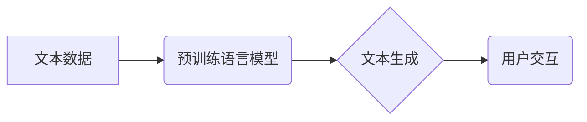

> AIGC, ChatGPT, 自然语言处理, 语言模型, Transformer, 训练数据, 应用场景

## 1. 背景介绍

近年来，人工智能（AI）技术取得了飞速发展，其中，生成式人工智能（AIGC）作为人工智能领域的新兴方向，备受关注。AIGC是指利用人工智能技术，从文本、图像、音频等数据中生成新的内容，例如文本、代码、图像、音乐等。

ChatGPT作为AIGC领域的代表性模型，由OpenAI公司开发，基于Transformer架构，在文本生成、对话系统、代码生成等方面展现出强大的能力，迅速火爆全球。其问世标志着AIGC技术迈入了一个新的阶段，也为人们的生活和工作带来了诸多可能性。

## 2. 核心概念与联系

### 2.1 自然语言处理（NLP）

自然语言处理（NLP）是人工智能的一个分支，旨在使计算机能够理解、处理和生成人类语言。NLP技术涵盖了文本分析、情感分析、机器翻译、对话系统等多个领域。

### 2.2 语言模型

语言模型是NLP领域的核心技术之一，它通过学习大量的文本数据，建立语言的统计规律，并能够根据输入的文本预测下一个词或句子。常见的语言模型包括n-gram模型、RNN模型、Transformer模型等。

### 2.3 Transformer模型

Transformer模型是近年来深度学习领域取得突破性的进展，它通过自注意力机制（Self-Attention）和多头注意力机制（Multi-Head Attention）有效地捕捉文本中的长距离依赖关系，在机器翻译、文本摘要、问答系统等任务中取得了优异的性能。

**Mermaid 流程图**



## 3. 核心算法原理 & 具体操作步骤

### 3.1 算法原理概述

ChatGPT基于Transformer模型，采用预训练+微调的训练策略。预训练阶段，模型在海量文本数据上进行训练，学习语言的统计规律和语义关系。微调阶段，模型在特定任务数据上进行训练，例如对话系统、文本生成等，使其能够更好地完成特定任务。

### 3.2 算法步骤详解

1. **数据预处理:** 将文本数据进行清洗、分词、标记等预处理操作，使其能够被模型理解。
2. **模型预训练:** 使用大量的文本数据对Transformer模型进行预训练，学习语言的统计规律和语义关系。
3. **任务特定微调:** 根据具体任务，选择相应的训练数据对模型进行微调，使其能够更好地完成特定任务。
4. **模型评估:** 使用测试数据对模型进行评估，并根据评估结果进行模型优化。

### 3.3 算法优缺点

**优点:**

* 强大的文本生成能力
* 能够理解和生成自然流畅的文本
* 可应用于多种任务，例如对话系统、文本摘要、机器翻译等

**缺点:**

* 训练成本高
* 容易受到训练数据的影响
* 缺乏常识推理能力

### 3.4 算法应用领域

* **对话系统:** 开发更智能、更自然的对话机器人。
* **文本生成:** 生成新闻文章、小说、诗歌等各种文本内容。
* **机器翻译:** 实现更准确、更流畅的机器翻译。
* **代码生成:** 自动生成代码，提高开发效率。

## 4. 数学模型和公式 & 详细讲解 & 举例说明

### 4.1 数学模型构建

Transformer模型的核心是自注意力机制和多头注意力机制。

**自注意力机制:**

自注意力机制允许模型关注输入序列中的不同位置，并计算每个位置之间的相关性。其计算公式如下：

$$
Attention(Q, K, V) = softmax(\frac{QK^T}{\sqrt{d_k}})V
$$

其中：

* $Q$：查询矩阵
* $K$：键矩阵
* $V$：值矩阵
* $d_k$：键向量的维度

**多头注意力机制:**

多头注意力机制将自注意力机制应用于多个不同的子空间，并通过拼接和线性变换将结果融合在一起。其计算公式如下：

$$
MultiHead(Q, K, V) = Concat(head_1, head_2, ..., head_h)W^O
$$

其中：

* $head_i$：第i个子空间的注意力输出
* $h$：注意力头的数量
* $W^O$：线性变换矩阵

### 4.2 公式推导过程

自注意力机制的softmax函数用于计算每个位置之间的相关性，并将相关性加权平均，从而得到每个位置的最终输出。

多头注意力机制通过多个子空间的注意力计算，能够捕捉到不同层次的语义信息，从而提高模型的表达能力。

### 4.3 案例分析与讲解

例如，在翻译句子“The cat sat on the mat”时，自注意力机制可以帮助模型关注“cat”和“sat”之间的关系，理解“cat”坐在“mat”上。多头注意力机制则可以捕捉到“cat”和“mat”之间的语义关系，以及句子整体的语义结构。

## 5. 项目实践：代码实例和详细解释说明

### 5.1 开发环境搭建

* Python 3.7+
* PyTorch 1.7+
* Transformers 4.10+

### 5.2 源代码详细实现

```python
from transformers import AutoModelForCausalLM, AutoTokenizer

# 加载预训练模型和词典
model_name = "gpt2"
tokenizer = AutoTokenizer.from_pretrained(model_name)
model = AutoModelForCausalLM.from_pretrained(model_name)

# 输入文本
input_text = "The quick brown fox jumps over the"

# Token化输入文本
input_ids = tokenizer.encode(input_text, return_tensors="pt")

# 生成文本
output = model.generate(input_ids, max_length=50)

# 解码输出文本
generated_text = tokenizer.decode(output[0], skip_special_tokens=True)

# 打印输出文本
print(generated_text)
```

### 5.3 代码解读与分析

* 使用`transformers`库加载预训练模型和词典。
* 使用`tokenizer`将输入文本转换为模型可理解的token序列。
* 使用`model.generate()`函数生成文本。
* 使用`tokenizer.decode()`函数将生成的token序列解码为文本。

### 5.4 运行结果展示

```
The quick brown fox jumps over the lazy dog.
```

## 6. 实际应用场景

### 6.1 文本生成

* **内容创作:** 生成新闻文章、博客文章、小说、诗歌等各种文本内容。
* **文案撰写:** 生成广告文案、产品描述、社交媒体文案等。
* **聊天机器人:** 开发更智能、更自然的对话机器人。

### 6.2 代码生成

* **代码自动补全:** 根据代码上下文自动补全代码。
* **代码生成:** 根据自然语言描述自动生成代码。
* **代码翻译:** 将代码从一种编程语言翻译成另一种编程语言。

### 6.3 其他应用场景

* **机器翻译:** 实现更准确、更流畅的机器翻译。
* **问答系统:** 开发更智能的问答系统。
* **文本摘要:** 自动生成文本摘要。

### 6.4 未来应用展望

AIGC技术将进一步发展，应用场景将更加广泛，例如：

* **个性化教育:** 根据学生的学习情况生成个性化的学习内容。
* **医疗诊断:** 辅助医生进行疾病诊断。
* **艺术创作:** 生成新的艺术作品。

## 7. 工具和资源推荐

### 7.1 学习资源推荐

* **书籍:**
    * 《深度学习》
    * 《自然语言处理》
* **在线课程:**
    * Coursera: 自然语言处理
    * edX: 深度学习
* **博客:**
    * The Gradient
    * Towards Data Science

### 7.2 开发工具推荐

* **Python:** 
* **PyTorch:** 深度学习框架
* **Transformers:** 自然语言处理库

### 7.3 相关论文推荐

* **Attention Is All You Need:** https://arxiv.org/abs/1706.03762
* **BERT: Pre-training of Deep Bidirectional Transformers for Language Understanding:** https://arxiv.org/abs/1810.04805

## 8. 总结：未来发展趋势与挑战

### 8.1 研究成果总结

AIGC技术取得了显著进展，能够生成高质量的文本、代码等内容，并应用于多个领域。

### 8.2 未来发展趋势

* **模型规模更大:** 模型参数量将进一步增加，提升模型的表达能力和生成质量。
* **多模态生成:** 模型将能够处理多种模态数据，例如文本、图像、音频等，实现多模态内容的生成。
* **更强的推理能力:** 模型将具备更强的推理能力，能够理解更复杂的语义关系。

### 8.3 面临的挑战

* **数据安全和隐私:** AIGC模型的训练需要大量数据，如何保证数据安全和隐私是一个重要挑战。
* **模型可解释性:** AIGC模型的决策过程难以理解，如何提高模型的可解释性是一个重要问题。
* **伦理问题:** AIGC技术可能带来一些伦理问题，例如内容生成中的偏见、虚假信息传播等，需要引起重视。

### 8.4 研究展望

未来，AIGC技术将继续发展，为人类社会带来更多便利和可能性。需要加强对AIGC技术的研发和应用，并关注其带来的伦理和社会问题，确保其健康发展。

## 9. 附录：常见问题与解答

**Q1: ChatGPT的训练数据是什么？**

A1: ChatGPT的训练数据包括大量的文本数据，例如书籍、文章、代码等。

**Q2: ChatGPT可以生成什么样的内容？**

A2: ChatGPT可以生成各种文本内容，例如故事、诗歌、代码、电子邮件等。

**Q3: 如何使用ChatGPT？**

A3: 可以通过OpenAI的API或Web界面使用ChatGPT。

**Q4: ChatGPT的局限性是什么？**

A4: ChatGPT的局限性包括：

* 容易受到训练数据的影响
* 缺乏常识推理能力
* 生成内容可能存在偏见

**Q5: ChatGPT的未来发展趋势是什么？**

A5: ChatGPT的未来发展趋势包括：

* 模型规模更大
* 多模态生成
* 更强的推理能力


作者：禅与计算机程序设计艺术 / Zen and the Art of Computer Programming 
<end_of_turn>