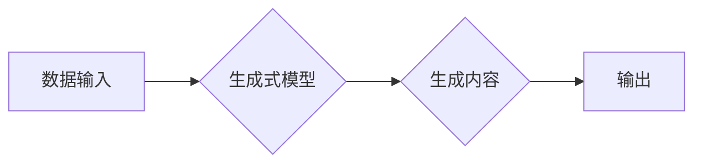

> AIGC, 人工智能, 生成式模型, 自然语言处理, 图像生成, 文本生成, 代码生成, 应用场景

## 1. 背景介绍

近年来，人工智能（AI）技术取得了飞速发展，特别是生成式人工智能（AIGC）的兴起，为我们带来了前所未有的创作和生产力提升。AIGC是指利用人工智能技术，从数据中学习并生成新的内容，例如文本、图像、音频、视频等。

AIGC技术的应用场景广泛，涵盖了各个领域，例如：

* **内容创作:** 自动生成新闻报道、广告文案、诗歌、小说等。
* **艺术创作:** 生成绘画、音乐、视频等艺术作品。
* **教育培训:** 提供个性化学习内容、自动生成习题和答案。
* **软件开发:** 自动生成代码、测试用例、软件文档等。
* **科学研究:** 辅助科学家进行数据分析、模型构建、实验设计等。

AIGC技术的出现，标志着人工智能进入了一个新的发展阶段，它将深刻地改变我们的生活和工作方式。

## 2. 核心概念与联系

AIGC的核心是生成式模型，它是一种能够学习数据模式并生成新数据的机器学习模型。常见的生成式模型包括：

* **循环神经网络（RNN）:** 用于处理序列数据，例如文本和语音。
* **变分自编码器（VAE）:** 用于生成图像和音频等数据。
* **生成对抗网络（GAN）:** 由两个网络组成，一个生成器网络和一个判别器网络，通过对抗训练生成逼真的数据。

**Mermaid 流程图:**



## 3. 核心算法原理 & 具体操作步骤

### 3.1  算法原理概述

生成式模型的核心原理是学习数据分布，并根据学习到的分布生成新的数据。

例如，在文本生成任务中，生成式模型会学习文本中单词的出现频率、语法规则等信息，然后根据这些信息生成新的文本序列。

### 3.2  算法步骤详解

1. **数据预处理:** 将原始数据进行清洗、格式化、编码等操作，使其适合模型训练。
2. **模型训练:** 使用训练数据训练生成式模型，调整模型参数，使其能够生成符合数据分布的新数据。
3. **模型评估:** 使用测试数据评估模型的生成效果，例如文本流畅度、图像逼真度等。
4. **模型部署:** 将训练好的模型部署到实际应用场景中，用于生成新的内容。

### 3.3  算法优缺点

**优点:**

* 可以生成高质量、逼真的内容。
* 应用场景广泛，可以应用于多个领域。
* 可以提高生产效率，节省人力成本。

**缺点:**

* 训练数据量大，训练成本高。
* 模型训练时间长。
* 模型容易受到训练数据的影响，可能生成带有偏见或错误的内容。

### 3.4  算法应用领域

* **文本生成:** 自动生成新闻报道、广告文案、小说、诗歌等。
* **图像生成:** 生成绘画、照片、视频等图像内容。
* **音频生成:** 生成音乐、语音、音效等音频内容。
* **代码生成:** 自动生成代码、测试用例、软件文档等。

## 4. 数学模型和公式 & 详细讲解 & 举例说明

### 4.1  数学模型构建

生成式模型通常基于概率模型，例如条件概率分布或联合概率分布。

例如，在文本生成任务中，我们可以使用条件概率分布来表示给定前文词语的下一个词语出现的概率。

### 4.2  公式推导过程

假设我们有一个文本序列 $x = (x_1, x_2, ..., x_T)$，其中 $x_i$ 表示第 $i$ 个词语。

我们可以使用条件概率分布 $P(x_t | x_{1:t-1})$ 来表示给定前 $t-1$ 个词语的第 $t$ 个词语出现的概率。

根据贝叶斯定理，我们可以推导出以下公式：

$$P(x_t | x_{1:t-1}) = \frac{P(x_{1:t})}{P(x_{1:t-1})}$$

其中 $P(x_{1:t})$ 表示文本序列 $x_{1:t}$ 的概率， $P(x_{1:t-1})$ 表示文本序列 $x_{1:t-1}$ 的概率。

### 4.3  案例分析与讲解

例如，假设我们有一个文本序列 "The cat sat on the mat"，我们想要预测下一个词语。

根据条件概率分布，我们可以计算给定前五个词语 "The cat sat on" 的下一个词语 "the" 出现的概率。

## 5. 项目实践：代码实例和详细解释说明

### 5.1  开发环境搭建

* Python 3.7+
* TensorFlow 2.0+
* PyTorch 1.0+
* Jupyter Notebook

### 5.2  源代码详细实现

```python
# 使用 TensorFlow 构建一个简单的文本生成模型

import tensorflow as tf

# 定义模型结构
model = tf.keras.Sequential([
    tf.keras.layers.Embedding(input_dim=vocab_size, output_dim=embedding_dim),
    tf.keras.layers.LSTM(units=lstm_units),
    tf.keras.layers.Dense(units=vocab_size, activation='softmax')
])

# 编译模型
model.compile(optimizer='adam', loss='sparse_categorical_crossentropy', metrics=['accuracy'])

# 训练模型
model.fit(x_train, y_train, epochs=epochs)

# 生成文本
def generate_text(seed_text, num_words):
    for _ in range(num_words):
        # 将种子文本转换为整数序列
        token_list = tokenizer.texts_to_sequences([seed_text])[0]
        # 将整数序列转换为模型输入格式
        input_sequence = tf.expand_dims(token_list, 0)
        # 使用模型预测下一个词语
        predictions = model.predict(input_sequence)
        # 从预测结果中选择概率最高的词语
        predicted_index = tf.argmax(predictions[0]).numpy()
        # 将预测的词语转换为文本
        predicted_word = tokenizer.index_word[predicted_index]
        # 将预测的词语添加到种子文本中
        seed_text += ' ' + predicted_word
    return seed_text
```

### 5.3  代码解读与分析

* 代码首先定义了一个简单的文本生成模型，使用 Embedding 层将词语转换为向量表示，使用 LSTM 层学习文本序列的上下文信息，使用 Dense 层预测下一个词语的概率。
* 然后，代码编译了模型，并使用训练数据训练模型。
* 最后，代码定义了一个 `generate_text` 函数，用于根据种子文本生成新的文本。

### 5.4  运行结果展示

运行代码后，可以生成新的文本内容，例如：

```
The cat sat on the mat. The cat jumped off the mat.
```

## 6. 实际应用场景

### 6.1  内容创作

* **新闻报道:** 自动生成新闻报道的摘要、标题、正文等内容。
* **广告文案:** 自动生成吸引人的广告文案，例如产品描述、促销语等。
* **小说创作:** 自动生成小说情节、人物对话、场景描述等内容。

### 6.2  艺术创作

* **绘画生成:** 根据文本描述生成相应的绘画作品。
* **音乐生成:** 生成不同风格的音乐作品，例如古典音乐、流行音乐等。
* **视频生成:** 生成动画视频、短片等视频内容。

### 6.3  教育培训

* **个性化学习内容:** 根据学生的学习进度和知识点，自动生成个性化的学习内容。
* **自动生成习题:** 自动生成不同难度的习题，帮助学生巩固知识。
* **自动批改作业:** 自动批改学生的作业，并提供反馈意见。

### 6.4  未来应用展望

AIGC技术的发展将带来更多新的应用场景，例如：

* **虚拟助手:** 更智能、更人性化的虚拟助手，能够理解用户的自然语言指令，并提供更精准的帮助。
* **个性化推荐:** 更精准的商品、服务、内容推荐，满足用户的个性化需求。
* **自动翻译:** 更准确、更流畅的机器翻译，打破语言障碍。

## 7. 工具和资源推荐

### 7.1  学习资源推荐

* **书籍:**
    * 《Deep Learning》 by Ian Goodfellow, Yoshua Bengio, and Aaron Courville
    * 《Generative Deep Learning》 by David Foster
* **在线课程:**
    * Coursera: Deep Learning Specialization
    * Udacity: Deep Learning Nanodegree
* **博客和论坛:**
    * Towards Data Science
    * Reddit: r/MachineLearning

### 7.2  开发工具推荐

* **TensorFlow:** 开源深度学习框架，支持多种硬件平台。
* **PyTorch:** 开源深度学习框架，以其灵活性和易用性而闻名。
* **Hugging Face Transformers:** 提供预训练的生成式模型，方便开发者快速应用。

### 7.3  相关论文推荐

* **Generative Adversarial Networks** by Ian Goodfellow et al. (2014)
* **Attention Is All You Need** by Ashish Vaswani et al. (2017)
* **BERT: Pre-training of Deep Bidirectional Transformers for Language Understanding** by Jacob Devlin et al. (2018)

## 8. 总结：未来发展趋势与挑战

### 8.1  研究成果总结

AIGC技术取得了显著的进展，在文本生成、图像生成、音频生成等领域取得了突破性成果。

### 8.2  未来发展趋势

* **模型规模和能力的提升:** 未来将会有更大规模、更强大的生成式模型出现，能够生成更逼真、更复杂的內容。
* **多模态生成:** 将文本、图像、音频等多种模态信息融合在一起，生成更丰富的、更具沉浸感的体验。
* **个性化定制:** 根据用户的需求和偏好，生成个性化的内容，例如定制小说、音乐、艺术作品等。

### 8.3  面临的挑战

* **数据安全和隐私:** AIGC模型的训练需要大量数据，如何保证数据的安全和隐私是一个重要的挑战。
* **模型可解释性和信任度:** AIGC模型的决策过程往往是复杂的，难以解释，如何提高模型的可解释性和信任度是一个重要的研究方向。
* **伦理和社会影响:** AIGC技术可能会带来一些伦理和社会问题，例如内容虚假、版权侵权等，需要认真思考和应对。

### 8.4  研究展望

未来，AIGC技术将继续发展，并应用于更多领域，为人类社会带来更多便利和福祉。

## 9. 附录：常见问题与解答

**Q1: AIGC技术与传统人工智能技术有什么区别？**

**A1:** 传统人工智能技术主要侧重于数据分析和决策，而 AIGC技术则侧重于生成新的内容。

**Q2: 如何评估 AIGC 模型的生成效果？**

**A2:** AIGC 模型的生成效果可以根据多种指标进行评估，例如文本流畅度、图像逼真度、音频质量等。

**Q3: AIGC 技术有哪些潜在的风险？**

**A3:** AIGC 技术可能带来一些风险，例如内容虚假、版权侵权、算法偏见等。

**作者：禅与计算机程序设计艺术 / Zen and the Art of Computer Programming**


<end_of_turn>