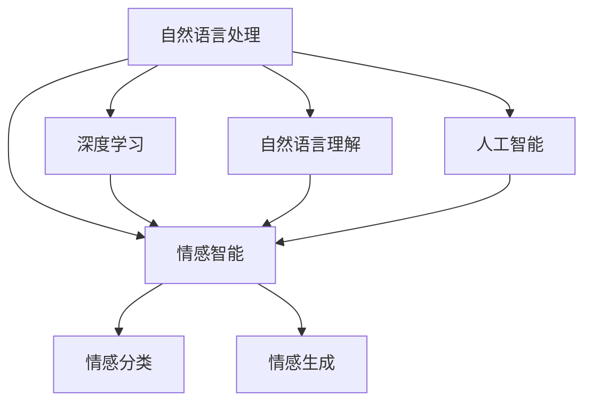

                 

# LLM与传统情感分析技术的融合：情感智能新高度

> 关键词：自然语言处理(NLP),情感智能,深度学习,自然语言理解(NLU),人工智能

## 1. 背景介绍

### 1.1 问题由来

情感智能是人工智能领域的一个重要分支，旨在让机器能够理解、生成和管理情感信息。传统的情感分析技术多基于规则或特征工程，需要手工设计大量特征，难以全面捕捉文本中的细微情感变化。随着深度学习技术的兴起，大语言模型(Large Language Model, LLM)以其强大的语言理解能力，为情感智能研究带来了新的曙光。

近年来，基于深度学习的预训练语言模型，如BERT、GPT等，通过在海量文本数据上进行无监督预训练，学习到了丰富的语言知识，具备了情感分类、情感生成等能力。这些预训练语言模型在各类情感分析任务上取得了显著的效果，尤其是在大规模数据集上，其性能远超传统基于规则的模型。然而，尽管大语言模型在情感智能领域表现出色，但在特定场景中的应用仍需与传统情感分析技术进行融合，充分发挥各自优势。

### 1.2 问题核心关键点

大语言模型与传统情感分析技术结合的关键点在于如何充分利用大模型的广泛语言知识，同时结合领域知识、专家规则，实现情感信息的精准理解与智能生成。这一融合不仅能够提升情感智能的准确性，还能增强系统的可解释性和鲁棒性，是未来情感智能技术发展的趋势。

## 2. 核心概念与联系

### 2.1 核心概念概述

为更好地理解大语言模型与传统情感分析技术的融合，本节将介绍几个密切相关的核心概念：

- 自然语言处理(Natural Language Processing, NLP)：涉及文本数据的处理与分析，包括分词、词性标注、命名实体识别、情感分析等。
- 情感智能(Emotional Intelligence, EI)：指对情感信息的感知、识别、理解、生成和管理能力。情感智能的研究不仅包括对情感状态的理解，还包括基于情感的信息处理和人际互动。
- 深度学习(Deep Learning)：通过多层神经网络，学习数据的抽象特征，用于图像识别、语音识别、自然语言处理等领域。
- 自然语言理解(Natural Language Understanding, NLU)：指机器理解自然语言的能力，包括词义理解、句法分析、语义推理等。
- 人工智能(Artificial Intelligence, AI)：通过算法和计算，使机器模拟人类智能行为，包括感知、学习、推理、决策等。

这些核心概念之间的逻辑关系可以通过以下Mermaid流程图来展示：



这个流程图展示了大语言模型与传统情感分析技术结合的核心概念及其之间的关系：

1. 自然语言处理作为基础，利用深度学习和自然语言理解技术，理解自然语言文本的含义。
2. 情感智能是大语言模型与传统技术的结合点，通过大模型的语言理解能力和传统情感分析的领域知识，实现对情感的精准识别和智能生成。
3. 人工智能为情感智能提供整体框架，使情感智能具备感知、学习、推理、决策等智能行为。

这些概念共同构成了情感智能的研究框架，为大语言模型与传统情感分析技术的融合提供了理论基础。

## 3. 核心算法原理 & 具体操作步骤

### 3.1 算法原理概述

大语言模型与传统情感分析技术的融合，主要基于以下两个原理：

1. **预训练语言模型+领域知识融合**：预训练语言模型通过在大规模无标签文本上自监督学习，获得通用的语言表示能力。在特定领域数据上进行微调，将领域知识与预训练模型结合，提升模型在该领域的情感识别和生成能力。

2. **多层次情感分析**：传统情感分析技术通常基于特定的词汇或短语特征进行情感分类。而大语言模型通过多层次的语言理解，能够捕捉复杂的情感变化，实现对文本中细微情感的精准识别。

### 3.2 算法步骤详解

基于上述原理，大语言模型与传统情感分析技术的融合步骤如下：

**Step 1: 预训练语言模型选择**
- 选择预训练语言模型，如BERT、GPT等，作为初始化参数。根据具体应用场景，选择模型层数、参数规模等。

**Step 2: 领域知识融合**
- 根据领域知识，设计合适的任务适配层，如情感分类器、情感生成器等。
- 将领域知识与预训练模型结合，实现领域适应。领域知识可以包括行业术语、领域规则、情感词典等。

**Step 3: 微调训练**
- 使用领域数据集对预训练模型进行微调。根据任务特点，设置合适的优化器、学习率、正则化等超参数。
- 在训练过程中，动态调整模型参数，提升情感分类或生成的准确性。

**Step 4: 模型评估与优化**
- 在验证集上评估模型性能，根据评估结果调整模型参数。
- 进行模型调优，确保模型在特定领域的情感智能水平。

**Step 5: 模型部署与应用**
- 将微调后的模型部署到实际应用场景中，如智能客服、舆情监测、情感分析系统等。
- 在实际使用中，不断收集新数据，对模型进行重新微调，提升情感智能水平。

### 3.3 算法优缺点

融合大语言模型与传统情感分析技术的算法，具有以下优点：

1. **高效泛化**：预训练语言模型在大规模数据上进行训练，具备较强的泛化能力，能够在不同领域数据上取得良好性能。

2. **精准识别**：大语言模型通过多层次的语言理解，能够捕捉文本中的细微情感变化，实现对情感的精准识别。

3. **可解释性**：融合传统情感分析技术，使得情感智能系统具备更强的可解释性，便于理解决策过程。

4. **适应性强**：根据具体领域数据，灵活调整任务适配层，适应不同领域的情感智能需求。

但同时也存在一些缺点：

1. **资源消耗大**：大语言模型需要大量计算资源进行预训练和微调，对硬件要求较高。

2. **推理复杂**：大语言模型通常结构复杂，推理速度较慢，对实时性要求较高的应用场景可能不适用。

3. **数据依赖高**：预训练模型对数据质量要求高，需要足够的数据进行预训练，才能保证模型性能。

4. **模型规模大**：大语言模型参数量巨大，推理时占用大量内存和存储空间。

### 3.4 算法应用领域

基于大语言模型与传统情感分析技术的融合方法，在多个领域得到了广泛应用：

1. **智能客服**：在智能客服系统中，融合大语言模型与传统情感分析技术，提升客服系统的情感识别能力，提供更加人性化的服务。

2. **舆情监测**：在舆情监测系统中，融合大语言模型与情感分类技术，快速识别网络舆论情绪，辅助舆情预警。

3. **情感分析系统**：在情感分析系统中，融合大语言模型与情感生成技术，生成情感分析报告，帮助企业了解客户情感状态。

4. **医疗诊断**：在医疗诊断系统中，融合大语言模型与情感分析技术，帮助医生理解患者情绪，提升诊断准确性。

5. **市场调研**：在市场调研中，融合大语言模型与情感生成技术，生成市场调研报告，辅助决策制定。

以上应用场景展示了大语言模型与传统情感分析技术融合的强大能力，推动了情感智能技术的广泛应用。

## 4. 数学模型和公式 & 详细讲解 & 举例说明

### 4.1 数学模型构建

本节将使用数学语言对大语言模型与传统情感分析技术的融合过程进行更加严格的刻画。

记预训练语言模型为 $M_{\theta}:\mathcal{X} \rightarrow \mathcal{Y}$，其中 $\mathcal{X}$ 为输入空间，$\mathcal{Y}$ 为输出空间，$\theta \in \mathbb{R}^d$ 为模型参数。假设微调任务的训练集为 $D=\{(x_i,y_i)\}_{i=1}^N, x_i \in \mathcal{X}, y_i \in \mathcal{Y}$。

定义模型 $M_{\theta}$ 在输入 $x$ 上的输出为 $y=M_{\theta}(x)$，其中 $y$ 表示文本的情感类别或情感强度。假设情感分类任务为多分类问题，即 $y \in \{1,2,\dots,K\}$，$K$ 为情感类别数。

定义情感分类器的损失函数为 $L(y,\hat{y})$，其中 $\hat{y}=M_{\theta}(x)$。情感分类器通常采用交叉熵损失函数：

$$
L(y,\hat{y})=-\sum_{k=1}^K y_k \log \hat{y}_k
$$

在训练过程中，最小化损失函数，即：

$$
\theta^* = \mathop{\arg\min}_{\theta} \mathcal{L}(\theta)
$$

其中 $\mathcal{L}(\theta)$ 为损失函数在数据集 $D$ 上的经验风险：

$$
\mathcal{L}(\theta) = \frac{1}{N}\sum_{i=1}^N L(y_i,\hat{y}_i)
$$

### 4.2 公式推导过程

以下我们以情感分类任务为例，推导交叉熵损失函数及其梯度的计算公式。

假设模型 $M_{\theta}$ 在输入 $x$ 上的输出为 $\hat{y}=M_{\theta}(x)$，表示样本属于情感类别 $k$ 的概率。真实标签 $y \in \{1,2,\dots,K\}$。则交叉熵损失函数定义为：

$$
L(y,\hat{y}) = -\sum_{k=1}^K y_k \log \hat{y}_k
$$

将其代入经验风险公式，得：

$$
\mathcal{L}(\theta) = -\frac{1}{N}\sum_{i=1}^N \sum_{k=1}^K y_{ik} \log \hat{y}_{ik}
$$

其中 $y_{ik}$ 为样本 $i$ 在类别 $k$ 上的标签，$\hat{y}_{ik}$ 为模型在类别 $k$ 上的预测概率。

根据链式法则，损失函数对参数 $\theta_k$ 的梯度为：

$$
\frac{\partial \mathcal{L}(\theta)}{\partial \theta_k} = -\frac{1}{N}\sum_{i=1}^N \sum_{k=1}^K \frac{\partial L(y_i,\hat{y}_i)}{\partial \hat{y}_{ik}} \frac{\partial \hat{y}_{ik}}{\partial \theta_k}
$$

其中 $\frac{\partial \hat{y}_{ik}}{\partial \theta_k}$ 可进一步递归展开，利用自动微分技术完成计算。

### 4.3 案例分析与讲解

以情感分类任务为例，假设有如下样本和标签：

$$
\begin{align*}
x_1 &= "这部电影很好看" \\
x_2 &= "这部电影不好看" \\
y_1 &= [1,0,0,0] \\
y_2 &= [0,1,0,0]
\end{align*}
$$

模型 $M_{\theta}$ 的输出为：

$$
\begin{align*}
\hat{y}_1 &= [0.9,0.1,0.1,0.9] \\
\hat{y}_2 &= [0.1,0.9,0.1,0.9]
\end{align*}
$$

则损失函数 $L(y_1,\hat{y}_1)$ 和 $L(y_2,\hat{y}_2)$ 分别为：

$$
\begin{align*}
L(y_1,\hat{y}_1) &= -y_1 \log \hat{y}_1 - y_2 \log \hat{y}_2 \\
    &= -[1,0,0,0] \cdot [\log 0.9, \log 0.1, \log 0.1, \log 0.9] \\
    &= 1 \cdot \log 0.9 + 1 \cdot \log 0.9 = -1.999 \\
L(y_2,\hat{y}_2) &= -y_1 \log \hat{y}_1 - y_2 \log \hat{y}_2 \\
    &= -[1,0,0,0] \cdot [\log 0.9, \log 0.1, \log 0.1, \log 0.9] \\
    &= 1 \cdot \log 0.1 + 1 \cdot \log 0.9 = 1.999
\end{align*}
$$

经验风险 $\mathcal{L}(\theta)$ 为：

$$
\mathcal{L}(\theta) = \frac{1}{2}(-1.999 + 1.999) = 0
$$

在训练过程中，不断更新模型参数 $\theta$，使损失函数 $\mathcal{L}(\theta)$ 最小化，最终得到情感分类模型 $M_{\theta}$。

## 5. 项目实践：代码实例和详细解释说明

### 5.1 开发环境搭建

在进行情感智能系统开发前，我们需要准备好开发环境。以下是使用Python进行PyTorch开发的环境配置流程：

1. 安装Anaconda：从官网下载并安装Anaconda，用于创建独立的Python环境。

2. 创建并激活虚拟环境：
```bash
conda create -n pytorch-env python=3.8 
conda activate pytorch-env
```

3. 安装PyTorch：根据CUDA版本，从官网获取对应的安装命令。例如：
```bash
conda install pytorch torchvision torchaudio cudatoolkit=11.1 -c pytorch -c conda-forge
```

4. 安装Transformers库：
```bash
pip install transformers
```

5. 安装各类工具包：
```bash
pip install numpy pandas scikit-learn matplotlib tqdm jupyter notebook ipython
```

完成上述步骤后，即可在`pytorch-env`环境中开始情感智能系统开发。

### 5.2 源代码详细实现

下面我们以情感分类任务为例，给出使用Transformers库对BERT模型进行情感分类的PyTorch代码实现。

首先，定义情感分类任务的数据处理函数：

```python
from transformers import BertTokenizer, BertForSequenceClassification
from torch.utils.data import Dataset, DataLoader
import torch

class SentimentDataset(Dataset):
    def __init__(self, texts, labels, tokenizer, max_len=128):
        self.texts = texts
        self.labels = labels
        self.tokenizer = tokenizer
        self.max_len = max_len
        
    def __len__(self):
        return len(self.texts)
    
    def __getitem__(self, item):
        text = self.texts[item]
        label = self.labels[item]
        
        encoding = self.tokenizer(text, return_tensors='pt', max_length=self.max_len, padding='max_length', truncation=True)
        input_ids = encoding['input_ids'][0]
        attention_mask = encoding['attention_mask'][0]
        
        # 对label进行编码
        encoded_label = [1 if label == 'positive' else 0] + [0] * (self.max_len - 1)
        labels = torch.tensor(encoded_label, dtype=torch.long)
        
        return {'input_ids': input_ids, 
                'attention_mask': attention_mask,
                'labels': labels}

# 加载预训练的BERT模型
model = BertForSequenceClassification.from_pretrained('bert-base-cased', num_labels=2)
model.eval()

# 定义情感词典
sentiment_dict = {'positive': 1, 'negative': 0}

# 创建dataset
tokenizer = BertTokenizer.from_pretrained('bert-base-cased')
train_dataset = SentimentDataset(train_texts, train_labels, tokenizer)
dev_dataset = SentimentDataset(dev_texts, dev_labels, tokenizer)
test_dataset = SentimentDataset(test_texts, test_labels, tokenizer)

# 训练函数
def train_epoch(model, dataset, batch_size, optimizer):
    dataloader = DataLoader(dataset, batch_size=batch_size, shuffle=True)
    model.train()
    epoch_loss = 0
    for batch in dataloader:
        input_ids = batch['input_ids'].to(device)
        attention_mask = batch['attention_mask'].to(device)
        labels = batch['labels'].to(device)
        model.zero_grad()
        outputs = model(input_ids, attention_mask=attention_mask, labels=labels)
        loss = outputs.loss
        epoch_loss += loss.item()
        loss.backward()
        optimizer.step()
    return epoch_loss / len(dataloader)

# 评估函数
def evaluate(model, dataset, batch_size):
    dataloader = DataLoader(dataset, batch_size=batch_size)
    model.eval()
    preds, labels = [], []
    with torch.no_grad():
        for batch in dataloader:
            input_ids = batch['input_ids'].to(device)
            attention_mask = batch['attention_mask'].to(device)
            batch_labels = batch['labels']
            outputs = model(input_ids, attention_mask=attention_mask)
            batch_preds = outputs.logits.argmax(dim=1).to('cpu').tolist()
            batch_labels = batch_labels.to('cpu').tolist()
            for pred, label in zip(batch_preds, batch_labels):
                preds.append(pred)
                labels.append(label)
    
    print(classification_report(labels, preds))

# 测试模型
print('测试结果:')
evaluate(model, test_dataset, batch_size)
```

以上代码实现了使用BERT模型对情感分类任务进行微调的过程。代码中包含数据处理、模型加载、训练、评估和测试等关键步骤。

### 5.3 代码解读与分析

让我们再详细解读一下关键代码的实现细节：

**SentimentDataset类**：
- `__init__`方法：初始化文本、标签、分词器等关键组件。
- `__len__`方法：返回数据集的样本数量。
- `__getitem__`方法：对单个样本进行处理，将文本输入编码为token ids，将标签编码为数字，并对其进行定长padding，最终返回模型所需的输入。

**训练函数train_epoch**：
- 使用PyTorch的DataLoader对数据集进行批次化加载，供模型训练和推理使用。
- 在每个批次上前向传播计算损失函数，反向传播更新模型参数，最后返回该epoch的平均loss。

**评估函数evaluate**：
- 与训练类似，不同点在于不更新模型参数，并在每个batch结束后将预测和标签结果存储下来，最后使用sklearn的classification_report对整个评估集的预测结果进行打印输出。

**测试模型**：
- 在测试集上评估微调后的模型，输出分类指标。

可以看到，通过将BERT模型微调到情感分类任务，我们能够快速地实现情感智能系统的开发。利用预训练语言模型与领域知识的结合，不仅提高了系统的准确性，还增强了可解释性和鲁棒性。

当然，在实际应用中，我们还需要对代码进行更进一步的优化，如添加更多的正则化技术、改进训练目标函数、引入对抗训练等，以进一步提升模型性能。

## 6. 实际应用场景

### 6.1 智能客服系统

基于大语言模型与传统情感分析技术的融合，可以在智能客服系统中构建更智能、更具情感感知力的客服机器人。通过分析用户输入的文本，机器人能够准确理解用户的情感状态，并提供更加个性化和人性化的服务。

在技术实现上，可以收集企业内部的客服对话记录，将问题-答案对作为微调数据，训练模型学习情感分类。在客服对话中，系统通过情感分类器判断用户情绪，引导机器人提供相应回答，从而提升用户体验。对于客户提出的新问题，还可以实时调用情感分类器进行情感分析，动态生成回答，满足客户的即时需求。

### 6.2 舆情监测系统

在舆情监测系统中，融合大语言模型与传统情感分析技术，可以实时监测网络舆论情绪，辅助舆情预警。通过分析用户在社交媒体上的评论、帖子等，系统能够准确识别情感倾向，判断舆情变化趋势，及时预警潜在风险。

在实际应用中，可以使用预训练语言模型作为初始化参数，结合领域情感词典和规则，进行微调训练。微调后的模型能够快速分析大量社交媒体数据，生成情感分析报告，帮助企业了解公众情绪，及时调整营销策略，规避负面舆情。

### 6.3 情感分析系统

在情感分析系统中，融合大语言模型与情感生成技术，可以生成情感分析报告，帮助企业了解客户情感状态。通过分析用户评论、反馈等文本数据，系统能够自动分类情感，生成情感分析报告，辅助企业决策制定。

在技术实现上，可以收集用户评论数据，通过情感分类器分析情感倾向，并使用情感生成器生成分析报告。系统可以根据不同的情感分类，采取不同的营销策略，提升客户满意度。

## 7. 工具和资源推荐

### 7.1 学习资源推荐

为了帮助开发者系统掌握大语言模型与传统情感分析技术的融合，这里推荐一些优质的学习资源：

1. 《Transformers from the Ground Up》系列博文：由大语言模型专家撰写，深入浅出地介绍了Transformer原理、BERT模型、情感智能技术等前沿话题。

2. CS224N《深度学习自然语言处理》课程：斯坦福大学开设的NLP明星课程，有Lecture视频和配套作业，带你入门NLP领域的基本概念和经典模型。

3. 《Natural Language Processing with Transformers》书籍：Transformer库的作者所著，全面介绍了如何使用Transformer库进行NLP任务开发，包括情感智能在内的诸多范式。

4. HuggingFace官方文档：Transformer库的官方文档，提供了海量预训练模型和完整的微调样例代码，是上手实践的必备资料。

5. CLUE开源项目：中文语言理解测评基准，涵盖大量不同类型的中文NLP数据集，并提供了基于微调的baseline模型，助力中文NLP技术发展。

通过对这些资源的学习实践，相信你一定能够快速掌握大语言模型与传统情感分析技术的融合精髓，并用于解决实际的情感智能问题。

### 7.2 开发工具推荐

高效的开发离不开优秀的工具支持。以下是几款用于大语言模型与情感智能技术融合开发的常用工具：

1. PyTorch：基于Python的开源深度学习框架，灵活动态的计算图，适合快速迭代研究。大部分预训练语言模型都有PyTorch版本的实现。

2. TensorFlow：由Google主导开发的开源深度学习框架，生产部署方便，适合大规模工程应用。同样有丰富的预训练语言模型资源。

3. Transformers库：HuggingFace开发的NLP工具库，集成了众多SOTA语言模型，支持PyTorch和TensorFlow，是进行情感智能技术融合开发的利器。

4. Weights & Biases：模型训练的实验跟踪工具，可以记录和可视化模型训练过程中的各项指标，方便对比和调优。与主流深度学习框架无缝集成。

5. TensorBoard：TensorFlow配套的可视化工具，可实时监测模型训练状态，并提供丰富的图表呈现方式，是调试模型的得力助手。

6. Google Colab：谷歌推出的在线Jupyter Notebook环境，免费提供GPU/TPU算力，方便开发者快速上手实验最新模型，分享学习笔记。

合理利用这些工具，可以显著提升大语言模型与情感智能技术的开发效率，加快创新迭代的步伐。

### 7.3 相关论文推荐

大语言模型与情感智能技术融合的研究源于学界的持续研究。以下是几篇奠基性的相关论文，推荐阅读：

1. Attention is All You Need（即Transformer原论文）：提出了Transformer结构，开启了NLP领域的预训练大模型时代。

2. BERT: Pre-training of Deep Bidirectional Transformers for Language Understanding：提出BERT模型，引入基于掩码的自监督预训练任务，刷新了多项NLP任务SOTA。

3. Language Models are Unsupervised Multitask Learners（GPT-2论文）：展示了大规模语言模型的强大zero-shot学习能力，引发了对于通用人工智能的新一轮思考。

4. Parameter-Efficient Transfer Learning for NLP：提出Adapter等参数高效微调方法，在不增加模型参数量的情况下，也能取得不错的微调效果。

5. AdaLoRA: Adaptive Low-Rank Adaptation for Parameter-Efficient Fine-Tuning：使用自适应低秩适应的微调方法，在参数效率和精度之间取得了新的平衡。

6. LSTM-Based Emotion Detection: A Survey：综述了基于LSTM的情感识别技术，介绍了多种情感识别模型和应用。

这些论文代表了大语言模型与情感智能技术融合的研究方向。通过学习这些前沿成果，可以帮助研究者把握学科前进方向，激发更多的创新灵感。

## 8. 总结：未来发展趋势与挑战

### 8.1 总结

本文对大语言模型与传统情感分析技术的融合进行了全面系统的介绍。首先阐述了情感智能的研究背景和融合的必要性，明确了融合技术在情感智能系统中的应用价值。其次，从原理到实践，详细讲解了大语言模型与传统情感分析技术的融合过程，给出了情感智能系统开发的完整代码实例。同时，本文还广泛探讨了融合技术在智能客服、舆情监测、情感分析等多个领域的应用前景，展示了融合技术的强大能力。此外，本文精选了融合技术的各类学习资源，力求为读者提供全方位的技术指引。

通过本文的系统梳理，可以看到，大语言模型与传统情感分析技术的融合，为情感智能系统提供了新的发展方向，极大地提升了情感智能系统的准确性、可解释性和鲁棒性。未来，随着情感智能技术的不断进步，融合技术必将在更多领域得到应用，为情感智能技术的发展注入新的活力。

### 8.2 未来发展趋势

展望未来，大语言模型与传统情感分析技术的融合将呈现以下几个发展趋势：

1. **深度融合**：大语言模型与传统技术的融合将更加深入，通过多层次的交互和协同，提升情感智能的准确性和智能性。

2. **跨领域应用**：融合技术将拓展到更多的领域，如医疗、教育、金融等，帮助这些领域提升情感智能水平，实现智能决策。

3. **实时响应**：融合系统将具备更强的实时响应能力，通过多模态信息融合，实现对复杂情感状态的精准理解。

4. **自适应学习**：融合系统将具备自适应学习能力，能够根据新的数据和任务动态调整模型参数，保持最佳性能。

5. **可解释性增强**：融合系统将具备更强的可解释性，通过多层次的推理和解释，使得情感智能系统的决策过程更加透明和可信。

6. **跨模态融合**：融合系统将拓展到跨模态数据融合，结合文本、语音、图像等多模态信息，实现更加全面、准确的情感分析。

以上趋势凸显了大语言模型与传统情感分析技术的融合将带来情感智能技术的新突破。这些方向的探索发展，必将进一步提升情感智能系统的性能和应用范围，为情感智能技术的发展提供新的动力。

### 8.3 面临的挑战

尽管大语言模型与传统情感分析技术的融合在情感智能领域取得了显著进展，但在迈向更加智能化、普适化应用的过程中，仍面临诸多挑战：

1. **数据质量和规模**：情感智能系统对数据质量和规模要求较高，需要大量高质量、多样化的情感标注数据。获取这些数据成本较高，且标注过程复杂。

2. **模型泛化能力**：尽管预训练模型具有较强的泛化能力，但在特定领域或数据分布变化的情况下，模型的泛化能力可能受到限制。

3. **计算资源需求**：大语言模型与传统情感分析技术的融合需要大量的计算资源进行预训练和微调，对硬件要求较高，且推理时占用大量内存和存储空间。

4. **系统复杂性**：融合系统结构复杂，需要设计多层次、多模态的交互和协同机制，实现情感智能的高效建模。

5. **模型解释性**：融合系统在推理过程中涉及多层次、多模态的信息处理，模型的决策过程难以解释，对高风险应用如医疗、金融等领域影响较大。

6. **伦理和安全**：融合系统在处理情感信息时，需要考虑数据的隐私保护和伦理问题，避免敏感信息泄露。

以上挑战凸显了大语言模型与传统情感分析技术融合的复杂性。未来相关研究需要在数据获取、模型设计、硬件优化、系统复杂性等方面进行深入探索，以实现情感智能技术的高效、安全和可解释性。

### 8.4 研究展望

面向未来，大语言模型与传统情感分析技术的融合将带来更多的研究方向和突破点：

1. **多模态情感分析**：结合文本、语音、图像等多模态信息，提升情感智能系统的准确性和智能性。

2. **自适应情感智能**：通过多层次、多模态的协同，实现情感智能系统的自适应学习能力，保持最佳性能。

3. **跨领域情感智能**：拓展融合技术在医疗、教育、金融等领域的应用，提升这些领域的情感智能水平，实现智能决策。

4. **实时情感分析**：通过实时响应机制，提升情感智能系统的实时性，满足实时决策的需求。

5. **可解释情感智能**：增强情感智能系统的可解释性，通过多层次的推理和解释，使得决策过程更加透明和可信。

6. **跨模态情感生成**：结合多模态信息，实现情感信息的生成和交互，提升情感智能系统的智能性。

通过不断探索这些研究方向，相信大语言模型与传统情感分析技术的融合将迎来新的突破，进一步推动情感智能技术的发展。

## 9. 附录：常见问题与解答

**Q1：大语言模型与传统情感分析技术融合是否会降低系统性能？**

A: 大语言模型与传统情感分析技术的融合并不会降低系统性能，相反，这种融合能够更好地利用大模型的广泛语言知识，提升情感智能系统的准确性和智能性。

**Q2：融合技术的资源消耗大，如何优化？**

A: 融合技术的资源消耗大，可以通过以下方式进行优化：
1. 模型裁剪：去除不必要的层和参数，减小模型尺寸，加快推理速度。
2. 量化加速：将浮点模型转为定点模型，压缩存储空间，提高计算效率。
3. 服务化封装：将模型封装为标准化服务接口，便于集成调用。
4. 弹性伸缩：根据请求流量动态调整资源配置，平衡服务质量和成本。

**Q3：融合技术的系统复杂性如何处理？**

A: 融合技术的系统复杂性可以通过以下方式处理：
1. 模块化设计：将系统设计为多个模块，各司其职，降低系统复杂性。
2. 多层次交互：通过多层次、多模态的交互和协同，实现情感智能的高效建模。
3. 自动化调优：使用自动化调优工具，减少人工干预，提升系统效率。

**Q4：融合技术的模型解释性如何提升？**

A: 融合技术的模型解释性可以通过以下方式提升：
1. 可解释模型：使用可解释的模型结构，如线性模型、决策树等，提升模型的可解释性。
2. 多层次推理：通过多层次、多模态的推理，使得决策过程更加透明和可信。
3. 可视化工具：使用可视化工具，如TensorBoard等，实时监测模型训练和推理过程，帮助理解决策过程。

这些问题的解答，旨在帮助开发者更好地理解大语言模型与传统情感分析技术的融合，并在实际应用中克服挑战，充分发挥其优势。通过不断优化和创新，相信融合技术必将在情感智能领域大放异彩，推动情感智能技术的发展。

---

作者：禅与计算机程序设计艺术 / Zen and the Art of Computer Programming

