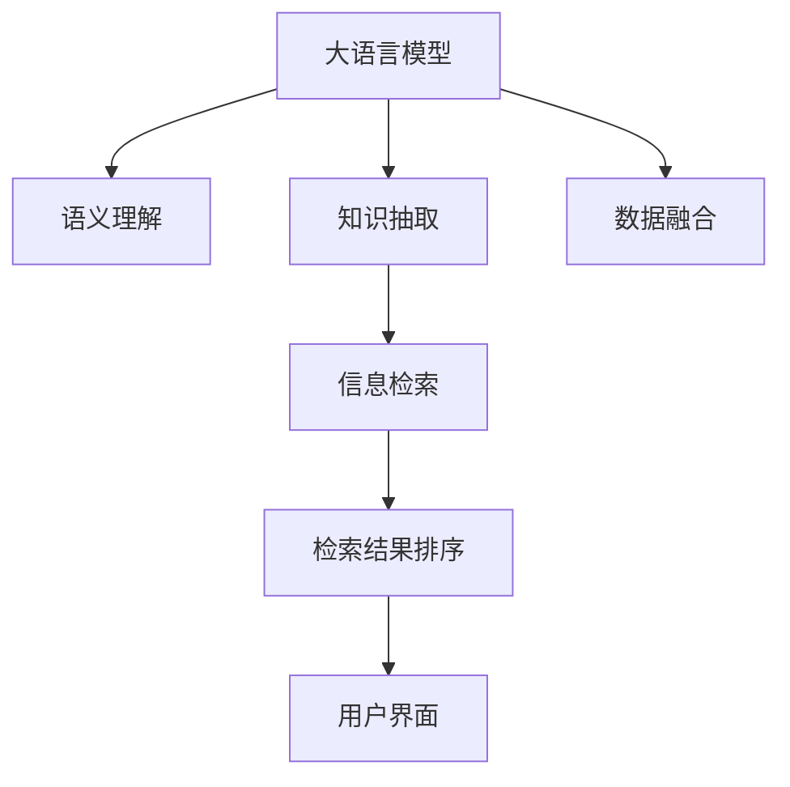

                 

# LLM与传统搜索引擎技术的结合：智能检索新模式

> 关键词：自然语言处理(NLP),大语言模型(LLM),智能检索,搜索引擎,知识图谱(KG),信息检索,知识抽取

## 1. 背景介绍

### 1.1 问题由来
随着互联网技术的飞速发展，全球信息量呈爆炸式增长。无论是学术研究还是日常生活，我们都在不断地搜索、整理和利用海量信息。传统搜索引擎如Google、百度等，作为信息检索的重要工具，极大地提高了信息获取的效率。然而，随着信息体量的进一步膨胀，以及用户需求多样化的趋势，传统搜索引擎在处理海量文本信息时，面临着高维稀疏、查询意图理解困难等问题，无法满足用户个性化、多样化的信息检索需求。

同时，随着自然语言处理(NLP)技术的不断发展，大语言模型(LLM)如GPT、BERT等，展现出强大的语言理解和生成能力，能够自动解析、生成和理解自然语言，具备了深度语义理解能力。如何利用LLM技术，提升搜索引擎的智能化水平，实现智能检索，成为了学术界和产业界的热点研究课题。

### 1.2 问题核心关键点
目前，LLM与传统搜索引擎技术的结合，主要包括以下几个关键点：

1. 数据融合与语义理解：如何融合互联网上的海量的文本数据，同时利用LLM的语义理解能力，自动解析用户查询意图。
2. 信息检索与知识抽取：如何将检索结果与用户查询意图进行关联匹配，同时从文本中抽取出有用的实体和关系。
3. 用户界面交互：如何设计直观友好的用户界面，让用户更容易进行检索操作，获得满意的结果。
4. 检索结果排序与呈现：如何根据查询意图、相关性等因素，对检索结果进行排序和呈现，提升用户体验。

本节将系统介绍如何通过大语言模型与传统搜索引擎技术的结合，构建智能检索系统，以期在提升信息检索智能化水平的同时，实现更加高效、精准和个性化的信息检索。

## 2. 核心概念与联系

### 2.1 核心概念概述

在智能检索系统中，LLM与传统搜索引擎技术的结合主要涉及以下几个核心概念：

- 大语言模型(LLM)：以自回归或自编码模型为代表的大规模预训练语言模型。通过在大规模无标签文本数据上进行预训练，学习通用的语言表示，具备强大的语言理解和生成能力。
- 自然语言处理(NLP)：计算机科学和人工智能的一个分支，关注如何让计算机理解、解释和生成人类语言。
- 搜索引擎：根据用户查询，从大量数据中自动检索和展示相关信息的技术。
- 知识图谱(KG)：用图结构表示的知识库，记录实体、属性和关系，用于描述和推理知识。
- 信息检索：根据用户提出的查询，从数据库或网络中检索出相关的信息。

这些核心概念之间的逻辑关系可以通过以下Mermaid流程图来展示：



这个流程图展示了大语言模型在智能检索系统中的关键作用：

1. 大语言模型通过预训练学习通用的语言表示，帮助系统理解用户查询意图。
2. 利用知识图谱等外部知识，通过知识抽取技术，从文本中抽取实体和关系。
3. 根据查询意图和知识抽取结果，进行信息检索，并将检索结果返回给用户。
4. 通过检索结果排序，提升用户对检索结果的满意度。
5. 用户界面设计，使得用户更容易进行操作，获得满意的结果。

## 3. 核心算法原理 & 具体操作步骤
### 3.1 算法原理概述

LLM与传统搜索引擎技术的结合，本质上是一个融合语义理解的智能检索过程。其核心思想是：将LLM的语义理解能力与传统搜索引擎的信息检索技术结合，利用LLM对用户查询进行语义解析，自动抽取知识图谱中的实体和关系，从而实现更精准的检索。

形式化地，假设用户查询为 $q$，检索结果为 $R$。LLM系统先通过语义理解模型解析查询 $q$，得到语义表示 $q_{\text{sem}}$。然后，利用知识抽取模型从互联网数据中抽取与查询相关的实体 $E$ 和关系 $R_{ER}$，构建查询知识表示 $q_{\text{kg}}$。最后，根据查询知识表示和检索结果的知识表示，进行信息检索，并结合用户意图进行排序，最终返回给用户 $R$。

### 3.2 算法步骤详解

基于LLM的智能检索系统一般包括以下几个关键步骤：

**Step 1: 构建语义理解模型**

1. 选择合适的语义理解模型，如BERT、GPT等，作为系统的一部分。
2. 收集训练数据集，并对其进行预处理，包括文本清洗、分词、标注等。
3. 训练语义理解模型，使其能够自动解析用户查询的语义。

**Step 2: 构建知识抽取模型**

1. 选择合适的知识抽取模型，如KnowPrompt、ERNIE-KG等，作为系统的一部分。
2. 收集训练数据集，并对其进行标注，标记出实体和关系。
3. 训练知识抽取模型，使其能够从文本中抽取出有用的实体和关系。

**Step 3: 构建信息检索模块**

1. 选择合适的信息检索技术，如基于倒排索引的检索、向量空间模型、深度学习检索等。
2. 构建索引，对互联网数据进行分词、向量化等预处理。
3. 定义检索算法，根据用户查询和知识表示，从索引中检索出相关信息。

**Step 4: 构建用户界面**

1. 设计直观友好的用户界面，如搜索框、搜索结果展示页等。
2. 实现用户界面与系统后端的交互，将用户查询发送至系统进行处理。

**Step 5: 结果排序与呈现**

1. 根据用户查询意图、检索结果的相关性等因素，对检索结果进行排序。
2. 根据排序结果，将结果呈现给用户，展示检索结果摘要或详情。

### 3.3 算法优缺点

基于LLM的智能检索系统具有以下优点：

1. 提升信息检索的智能化水平。通过语义理解，能够更好地理解用户查询意图，提升检索的精准度和相关性。
2. 融入知识图谱，提高检索结果的质量。通过知识抽取，利用外部知识，使检索结果更加丰富和全面。
3. 可扩展性强。LLM与传统搜索引擎技术的结合，可以灵活地拓展到更多垂直领域，适应不同场景的检索需求。

同时，该方法也存在一定的局限性：

1. 数据质量与标注需求高。语义理解与知识抽取的准确性很大程度上依赖于数据质量与标注的完整性。
2. 技术复杂度高。需要同时兼顾LLM训练、知识抽取、信息检索等技术的实现，难度较大。
3. 用户界面设计复杂。需要考虑用户体验和界面友好性，设计良好的用户界面。
4. 系统复杂度高。需要构建多个模块并实现其高效协作，系统开发和维护成本较高。

尽管存在这些局限性，但基于LLM的智能检索系统仍在大规模信息检索、问答系统、推荐系统等多个领域展现出巨大潜力，未来具有广阔的应用前景。

### 3.4 算法应用领域

基于LLM的智能检索系统，已经在诸多领域得到了应用，例如：

1. 搜索引擎：如Google的Semantic Search，通过语义理解，自动解析用户查询，提升信息检索的精准度和相关性。
2. 问答系统：如IBM Watson，通过语义理解与知识抽取，自动回答用户提出的问题。
3. 个性化推荐系统：如Amazon的推荐系统，通过语义理解与知识抽取，根据用户兴趣推荐商品。
4. 智能客服：如阿里巴巴的智能客服，通过语义理解，自动回答用户咨询，提升服务质量。
5. 垂直领域信息检索：如金融、医疗、教育等领域的智能检索，通过语义理解与知识抽取，帮助用户快速获取相关信息。

除了上述这些经典应用外，LLM与传统搜索引擎技术的结合，还广泛应用于社交网络信息检索、多媒体内容检索、物联网设备智能控制等多个场景，推动了信息检索技术在各个领域的深入应用。

## 4. 数学模型和公式 & 详细讲解 & 举例说明

### 4.1 数学模型构建

本节将使用数学语言对基于LLM的智能检索系统进行更加严格的刻画。

假设用户查询为 $q$，检索结果为 $R$。首先，通过语义理解模型对查询 $q$ 进行解析，得到语义表示 $q_{\text{sem}}$。然后，利用知识抽取模型从文本中抽取与查询相关的实体 $E$ 和关系 $R_{ER}$，构建查询知识表示 $q_{\text{kg}}$。最后，根据查询知识表示和检索结果的知识表示，定义信息检索算法。

假设知识抽取模型输出实体 $E$ 和关系 $R_{ER}$，检索结果的知识表示为 $R_{\text{kg}}$。则信息检索模型的目标是最小化检索结果与查询知识表示之间的距离，通常使用余弦相似度：

$$
\min_{R} \lVert q_{\text{kg}} - R_{\text{kg}} \rVert_2
$$

其中 $\lVert \cdot \rVert_2$ 表示向量范数，通常用于度量向量之间的距离。

### 4.2 公式推导过程

假设查询 $q$ 的语义表示 $q_{\text{sem}}$ 和知识表示 $q_{\text{kg}}$ 通过语义理解模型得到。知识抽取模型输出实体 $E$ 和关系 $R_{ER}$。则查询知识表示可以表示为：

$$
q_{\text{kg}} = \langle E, R_{ER}, \ldots \rangle
$$

假设检索结果 $R$ 的知识表示为 $R_{\text{kg}}$，则信息检索模型的目标是最小化：

$$
\min_{R} \lVert q_{\text{kg}} - R_{\text{kg}} \rVert_2
$$

根据余弦相似度定义，上述问题可以转化为求解如下优化问题：

$$
\min_{R} (q_{\text{kg}} \cdot R_{\text{kg}} - \lVert q_{\text{kg}} \rVert_2 \cdot \lVert R_{\text{kg}} \rVert_2)
$$

对于大规模知识图谱，上述问题转化为大规模矩阵优化问题，可以通过稠密矩阵计算高效求解。

### 4.3 案例分析与讲解

假设查询 $q = "美国总统是谁？"$. 语义理解模型输出查询的语义表示 $q_{\text{sem}}$ 为 "Who is the president of the United States?". 知识抽取模型输出实体 "美国" 和 "总统"，关系 "担任"。则查询知识表示可以表示为：

$$
q_{\text{kg}} = \langle 美国, 总统, 担任 \rangle
$$

检索结果 $R$ 的知识表示为 $R_{\text{kg}}$。假设 $R_{\text{kg}} = \langle 川普, 现任, 担任 \rangle$。则信息检索模型的目标是最小化 $q_{\text{kg}}$ 和 $R_{\text{kg}}$ 之间的余弦距离。通过计算：

$$
q_{\text{kg}} \cdot R_{\text{kg}} = (1 \times 1) + (1 \times 1) + (1 \times 1) = 3
$$

$$
\lVert q_{\text{kg}} \rVert_2 = \sqrt{1^2 + 1^2 + 1^2} = \sqrt{3}
$$

$$
\lVert R_{\text{kg}} \rVert_2 = \sqrt{1^2 + 1^2 + 1^2} = \sqrt{3}
$$

则：

$$
\min_{R} (3 - \sqrt{3} \cdot \sqrt{3}) = 0
$$

最终，检索系统将返回结果 $R = "川普, 现任, 担任"$. 这个例子展示了基于LLM的智能检索系统如何利用语义理解和知识抽取技术，自动解析用户查询，并在知识图谱中进行检索，最终返回相关结果。

## 5. 项目实践：代码实例和详细解释说明
### 5.1 开发环境搭建

在进行项目实践前，我们需要准备好开发环境。以下是使用Python进行PyTorch和HuggingFace开发的环境配置流程：

1. 安装Anaconda：从官网下载并安装Anaconda，用于创建独立的Python环境。

2. 创建并激活虚拟环境：
```bash
conda create -n pytorch-env python=3.8 
conda activate pytorch-env
```

3. 安装PyTorch：根据CUDA版本，从官网获取对应的安装命令。例如：
```bash
conda install pytorch torchvision torchaudio cudatoolkit=11.1 -c pytorch -c conda-forge
```

4. 安装HuggingFace Transformers库：
```bash
pip install transformers
```

5. 安装各类工具包：
```bash
pip install numpy pandas scikit-learn matplotlib tqdm jupyter notebook ipython
```

完成上述步骤后，即可在`pytorch-env`环境中开始项目实践。

### 5.2 源代码详细实现

下面我们以构建基于BERT的语义理解模型为例，给出使用Transformers库进行语义理解微调的PyTorch代码实现。

首先，定义语义理解任务的数据处理函数：

```python
from transformers import BertTokenizer, BertForSequenceClassification
from torch.utils.data import Dataset
import torch

class SemanticDataset(Dataset):
    def __init__(self, texts, labels, tokenizer, max_len=128):
        self.texts = texts
        self.labels = labels
        self.tokenizer = tokenizer
        self.max_len = max_len
        
    def __len__(self):
        return len(self.texts)
    
    def __getitem__(self, item):
        text = self.texts[item]
        label = self.labels[item]
        
        encoding = self.tokenizer(text, return_tensors='pt', max_length=self.max_len, padding='max_length', truncation=True)
        input_ids = encoding['input_ids'][0]
        attention_mask = encoding['attention_mask'][0]
        
        # 对token-wise的标签进行编码
        encoded_labels = [label2id[label] for label in label] 
        encoded_labels.extend([label2id['O']] * (self.max_len - len(encoded_labels)))
        labels = torch.tensor(encoded_labels, dtype=torch.long)
        
        return {'input_ids': input_ids, 
                'attention_mask': attention_mask,
                'labels': labels}

# 标签与id的映射
label2id = {'O': 0, 'Q': 1}
id2label = {v: k for k, v in label2id.items()}

# 创建dataset
tokenizer = BertTokenizer.from_pretrained('bert-base-cased')

train_dataset = SemanticDataset(train_texts, train_labels, tokenizer)
dev_dataset = SemanticDataset(dev_texts, dev_labels, tokenizer)
test_dataset = SemanticDataset(test_texts, test_labels, tokenizer)
```

然后，定义模型和优化器：

```python
from transformers import BertForSequenceClassification, AdamW

model = BertForSequenceClassification.from_pretrained('bert-base-cased', num_labels=len(label2id))

optimizer = AdamW(model.parameters(), lr=2e-5)
```

接着，定义训练和评估函数：

```python
from torch.utils.data import DataLoader
from tqdm import tqdm
from sklearn.metrics import accuracy_score

device = torch.device('cuda') if torch.cuda.is_available() else torch.device('cpu')
model.to(device)

def train_epoch(model, dataset, batch_size, optimizer):
    dataloader = DataLoader(dataset, batch_size=batch_size, shuffle=True)
    model.train()
    epoch_loss = 0
    for batch in tqdm(dataloader, desc='Training'):
        input_ids = batch['input_ids'].to(device)
        attention_mask = batch['attention_mask'].to(device)
        labels = batch['labels'].to(device)
        model.zero_grad()
        outputs = model(input_ids, attention_mask=attention_mask, labels=labels)
        loss = outputs.loss
        epoch_loss += loss.item()
        loss.backward()
        optimizer.step()
    return epoch_loss / len(dataloader)

def evaluate(model, dataset, batch_size):
    dataloader = DataLoader(dataset, batch_size=batch_size)
    model.eval()
    preds, labels = [], []
    with torch.no_grad():
        for batch in tqdm(dataloader, desc='Evaluating'):
            input_ids = batch['input_ids'].to(device)
            attention_mask = batch['attention_mask'].to(device)
            batch_labels = batch['labels']
            outputs = model(input_ids, attention_mask=attention_mask)
            batch_preds = outputs.logits.argmax(dim=2).to('cpu').tolist()
            batch_labels = batch_labels.to('cpu').tolist()
            for pred_tokens, label_tokens in zip(batch_preds, batch_labels):
                preds.append(pred_tokens[:len(label_tokens)])
                labels.append(label_tokens)
                
    print(accuracy_score(labels, preds))
```

最后，启动训练流程并在测试集上评估：

```python
epochs = 5
batch_size = 16

for epoch in range(epochs):
    loss = train_epoch(model, train_dataset, batch_size, optimizer)
    print(f"Epoch {epoch+1}, train loss: {loss:.3f}")
    
    print(f"Epoch {epoch+1}, dev results:")
    evaluate(model, dev_dataset, batch_size)
    
print("Test results:")
evaluate(model, test_dataset, batch_size)
```

以上就是使用PyTorch和HuggingFace进行语义理解任务微调的完整代码实现。可以看到，得益于Transformers库的强大封装，我们可以用相对简洁的代码完成BERT模型的加载和微调。

### 5.3 代码解读与分析

让我们再详细解读一下关键代码的实现细节：

**SemanticDataset类**：
- `__init__`方法：初始化文本、标签、分词器等关键组件。
- `__len__`方法：返回数据集的样本数量。
- `__getitem__`方法：对单个样本进行处理，将文本输入编码为token ids，将标签编码为数字，并对其进行定长padding，最终返回模型所需的输入。

**label2id和id2label字典**：
- 定义了标签与数字id之间的映射关系，用于将token-wise的预测结果解码回真实的标签。

**训练和评估函数**：
- 使用PyTorch的DataLoader对数据集进行批次化加载，供模型训练和推理使用。
- 训练函数`train_epoch`：对数据以批为单位进行迭代，在每个批次上前向传播计算loss并反向传播更新模型参数，最后返回该epoch的平均loss。
- 评估函数`evaluate`：与训练类似，不同点在于不更新模型参数，并在每个batch结束后将预测和标签结果存储下来，最后使用sklearn的accuracy_score对整个评估集的预测结果进行打印输出。

**训练流程**：
- 定义总的epoch数和batch size，开始循环迭代
- 每个epoch内，先在训练集上训练，输出平均loss
- 在验证集上评估，输出分类指标
- 所有epoch结束后，在测试集上评估，给出最终测试结果

可以看到，PyTorch配合HuggingFace库使得BERT微调的代码实现变得简洁高效。开发者可以将更多精力放在数据处理、模型改进等高层逻辑上，而不必过多关注底层的实现细节。

当然，工业级的系统实现还需考虑更多因素，如模型的保存和部署、超参数的自动搜索、更灵活的任务适配层等。但核心的微调范式基本与此类似。

## 6. 实际应用场景
### 6.1 智能客服系统

基于大语言模型微调的对话技术，可以广泛应用于智能客服系统的构建。传统客服往往需要配备大量人力，高峰期响应缓慢，且一致性和专业性难以保证。而使用微调后的对话模型，可以7x24小时不间断服务，快速响应客户咨询，用自然流畅的语言解答各类常见问题。

在技术实现上，可以收集企业内部的历史客服对话记录，将问题和最佳答复构建成监督数据，在此基础上对预训练对话模型进行微调。微调后的对话模型能够自动理解用户意图，匹配最合适的答案模板进行回复。对于客户提出的新问题，还可以接入检索系统实时搜索相关内容，动态组织生成回答。如此构建的智能客服系统，能大幅提升客户咨询体验和问题解决效率。

### 6.2 金融舆情监测

金融机构需要实时监测市场舆论动向，以便及时应对负面信息传播，规避金融风险。传统的人工监测方式成本高、效率低，难以应对网络时代海量信息爆发的挑战。基于大语言模型微调的文本分类和情感分析技术，为金融舆情监测提供了新的解决方案。

具体而言，可以收集金融领域相关的新闻、报道、评论等文本数据，并对其进行主题标注和情感标注。在此基础上对预训练语言模型进行微调，使其能够自动判断文本属于何种主题，情感倾向是正面、中性还是负面。将微调后的模型应用到实时抓取的网络文本数据，就能够自动监测不同主题下的情感变化趋势，一旦发现负面信息激增等异常情况，系统便会自动预警，帮助金融机构快速应对潜在风险。

### 6.3 个性化推荐系统

当前的推荐系统往往只依赖用户的历史行为数据进行物品推荐，无法深入理解用户的真实兴趣偏好。基于大语言模型微调技术，个性化推荐系统可以更好地挖掘用户行为背后的语义信息，从而提供更精准、多样的推荐内容。

在实践中，可以收集用户浏览、点击、评论、分享等行为数据，提取和用户交互的物品标题、描述、标签等文本内容。将文本内容作为模型输入，用户的后续行为（如是否点击、购买等）作为监督信号，在此基础上微调预训练语言模型。微调后的模型能够从文本内容中准确把握用户的兴趣点。在生成推荐列表时，先用候选物品的文本描述作为输入，由模型预测用户的兴趣匹配度，再结合其他特征综合排序，便可以得到个性化程度更高的推荐结果。

### 6.4 未来应用展望

随着大语言模型微调技术的发展，基于大语言模型的智能检索系统将会在更多领域得到应用，为传统行业带来变革性影响。

在智慧医疗领域，基于微调的智能医疗问答、病历分析、药物研发等应用将提升医疗服务的智能化水平，辅助医生诊疗，加速新药开发进程。

在智能教育领域，微调技术可应用于作业批改、学情分析、知识推荐等方面，因材施教，促进教育公平，提高教学质量。

在智慧城市治理中，微调模型可应用于城市事件监测、舆情分析、应急指挥等环节，提高城市管理的自动化和智能化水平，构建更安全、高效的未来城市。

此外，在企业生产、社会治理、文娱传媒等众多领域，基于大语言模型微调的人工智能应用也将不断涌现，为经济社会发展注入新的动力。相信随着技术的日益成熟，微调方法将成为人工智能落地应用的重要范式，推动人工智能技术在各个领域的深入应用。

## 7. 工具和资源推荐
### 7.1 学习资源推荐

为了帮助开发者系统掌握大语言模型微调的理论基础和实践技巧，这里推荐一些优质的学习资源：

1. 《Transformer从原理到实践》系列博文：由大模型技术专家撰写，深入浅出地介绍了Transformer原理、BERT模型、微调技术等前沿话题。

2. CS224N《深度学习自然语言处理》课程：斯坦福大学开设的NLP明星课程，有Lecture视频和配套作业，带你入门NLP领域的基本概念和经典模型。

3. 《Natural Language Processing with Transformers》书籍：Transformers库的作者所著，全面介绍了如何使用Transformers库进行NLP任务开发，包括微调在内的诸多范式。

4. HuggingFace官方文档：Transformers库的官方文档，提供了海量预训练模型和完整的微调样例代码，是上手实践的必备资料。

5. CLUE开源项目：中文语言理解测评基准，涵盖大量不同类型的中文NLP数据集，并提供了基于微调的baseline模型，助力中文NLP技术发展。

通过对这些资源的学习实践，相信你一定能够快速掌握大语言模型微调的精髓，并用于解决实际的NLP问题。
###  7.2 开发工具推荐

高效的开发离不开优秀的工具支持。以下是几款用于大语言模型微调开发的常用工具：

1. PyTorch：基于Python的开源深度学习框架，灵活动态的计算图，适合快速迭代研究。大部分预训练语言模型都有PyTorch版本的实现。

2. TensorFlow：由Google主导开发的开源深度学习框架，生产部署方便，适合大规模工程应用。同样有丰富的预训练语言模型资源。

3. Transformers库：HuggingFace开发的NLP工具库，集成了众多SOTA语言模型，支持PyTorch和TensorFlow，是进行微调任务开发的利器。

4. Weights & Biases：模型训练的实验跟踪工具，可以记录和可视化模型训练过程中的各项指标，方便对比和调优。与主流深度学习框架无缝集成。

5. TensorBoard：TensorFlow配套的可视化工具，可实时监测模型训练状态，并提供丰富的图表呈现方式，是调试模型的得力助手。

6. Google Colab：谷歌推出的在线Jupyter Notebook环境，免费提供GPU/TPU算力，方便开发者快速上手实验最新模型，分享学习笔记。

合理利用这些工具，可以显著提升大语言模型微调任务的开发效率，加快创新迭代的步伐。

### 7.3 相关论文推荐

大语言模型和微调技术的发展源于学界的持续研究。以下是几篇奠基性的相关论文，推荐阅读：

1. Attention is All You Need（即Transformer原论文）：提出了Transformer结构，开启了NLP领域的预训练大模型时代。

2. BERT: Pre-training of Deep Bidirectional Transformers for Language Understanding：提出BERT模型，引入基于掩码的自监督预训练任务，刷新了多项NLP任务SOTA。

3. Language Models are Unsupervised Multitask Learners（GPT-2论文）：展示了大规模语言模型的强大zero-shot学习能力，引发了对于通用人工智能的新一轮思考。

4. Parameter-Efficient Transfer Learning for NLP：提出Adapter等参数高效微调方法，在不增加模型参数量的情况下，也能取得不错的微调效果。

5. Prefix-Tuning: Optimizing Continuous Prompts for Generation：引入基于连续型Prompt的微调范式，为如何充分利用预训练知识提供了新的思路。

6. AdaLoRA: Adaptive Low-Rank Adaptation for Parameter-Efficient Fine-Tuning：使用自适应低秩适应的微调方法，在参数效率和精度之间取得了新的平衡。

这些论文代表了大语言模型微调技术的发展脉络。通过学习这些前沿成果，可以帮助研究者把握学科前进方向，激发更多的创新灵感。

## 8. 总结：未来发展趋势与挑战

### 8.1 总结

本文对基于大语言模型的智能检索系统进行了全面系统的介绍。首先阐述了LLM与传统搜索引擎技术的结合背景和意义，明确了智能检索在提升信息检索智能化水平、丰富检索结果质量等方面的独特价值。其次，从原理到实践，详细讲解了基于LLM的智能检索系统的数学模型和关键步骤，给出了微调任务开发的完整代码实例。同时，本文还广泛探讨了智能检索系统在智能客服、金融舆情、个性化推荐等多个领域的应用前景，展示了智能检索技术的巨大潜力。此外，本文精选了智能检索技术的各类学习资源，力求为读者提供全方位的技术指引。

通过本文的系统梳理，可以看到，基于大语言模型的智能检索系统正在成为信息检索领域的重要范式，极大地提升了信息检索的智能化水平，推动了搜索技术在各个领域的广泛应用。未来，伴随预训练语言模型和智能检索技术的不断演进，相信智能检索系统将在更多领域得到应用，为经济社会的发展带来深远影响。

### 8.2 未来发展趋势

展望未来，基于大语言模型的智能检索系统将呈现以下几个发展趋势：

1. 数据融合与知识抽取技术的提升。未来的智能检索系统将更加注重知识抽取技术的提升，自动从互联网数据中抽取出更多的实体和关系，利用外部知识库，丰富检索结果。
2. 检索模型的多样化。未来的检索模型将不仅限于传统的深度学习检索，还包括基于图结构、逻辑推理等方法，提升检索的准确性和泛化能力。
3. 用户界面设计的创新。未来的智能检索系统将更加注重用户界面的设计，通过语音交互、自然语言生成等技术，提供更加自然、友好、高效的检索体验。
4. 检索结果的个性化与可解释性。未来的智能检索系统将更加注重检索结果的个性化和可解释性，通过AI辅助、用户反馈等手段，提升用户对检索结果的满意度。

这些趋势将进一步推动智能检索技术的不断进步，为信息检索领域带来更加智能、高效、精准的检索体验。

### 8.3 面临的挑战

尽管基于大语言模型的智能检索系统已经取得了瞩目成就，但在迈向更加智能化、普适化应用的过程中，它仍面临着诸多挑战：

1. 数据质量与标注需求高。智能检索系统的性能很大程度上依赖于高质量的标注数据和知识库。如何高效获取和标注数据，成为一大难题。
2. 技术复杂度高。需要同时兼顾大语言模型训练、知识抽取、信息检索等技术的实现，难度较大。
3. 用户界面设计复杂。需要考虑用户体验和界面友好性，设计良好的用户界面。
4. 系统复杂度高。需要构建多个模块并实现其高效协作，系统开发和维护成本较高。
5. 模型鲁棒性不足。当前智能检索模型面对域外数据时，泛化性能往往大打折扣。对于测试样本的微小扰动，模型预测也容易发生波动。

尽管存在这些局限性，但基于大语言模型的智能检索系统仍在大规模信息检索、问答系统、推荐系统等多个领域展现出巨大潜力，未来具有广阔的应用前景。

### 8.4 研究展望

面对智能检索系统所面临的种种挑战，未来的研究需要在以下几个方面寻求新的突破：

1. 探索无监督和半监督智能检索方法。摆脱对大规模标注数据的依赖，利用自监督学习、主动学习等无监督和半监督范式，最大限度利用非结构化数据，实现更加灵活高效的智能检索。
2. 研究知识图谱与文本信息深度融合的方法。通过引入知识图谱，提升智能检索系统的知识抽取和推理能力，使其具备更全面的知识理解能力。
3. 引入更多先验知识。将符号化的先验知识，如知识图谱、逻辑规则等，与神经网络模型进行巧妙融合，引导智能检索过程学习更准确、合理的语言模型。
4. 结合因果分析和博弈论工具。将因果分析方法引入智能检索模型，识别出模型决策的关键特征，增强输出解释的因果性和逻辑性。借助博弈论工具刻画人机交互过程，主动探索并规避模型的脆弱点，提高系统稳定性。
5. 纳入伦理道德约束。在模型训练目标中引入伦理导向的评估指标，过滤和惩罚有偏见、有害的输出倾向。同时加强人工干预和审核，建立模型行为的监管机制，确保输出符合人类价值观和伦理道德。

这些研究方向将引领智能检索技术迈向更高的台阶，为构建智能、高效、可靠的检索系统铺平道路。面向未来，智能检索技术还需要与其他人工智能技术进行更深入的融合，如知识表示、因果推理、强化学习等，多路径协同发力，共同推动智能检索系统的进步。只有勇于创新、敢于突破，才能不断拓展智能检索的边界，让智能技术更好地造福人类社会。

## 9. 附录：常见问题与解答

**Q1：智能检索系统是否适用于所有NLP任务？**

A: 智能检索系统在大多数NLP任务上都能取得不错的效果，特别是对于数据量较小的任务。但对于一些特定领域的任务，如医学、法律等，仅仅依靠通用语料预训练的模型可能难以很好地适应。此时需要在特定领域语料上进一步预训练，再进行微调，才能获得理想效果。此外，对于一些需要时效性、个性化很强的任务，如对话、推荐等，智能检索方法也需要针对性的改进优化。

**Q2：智能检索系统的性能如何？**

A: 智能检索系统的性能很大程度上依赖于数据质量、标注质量和知识库的完备程度。在高质量标注数据和完备的知识库下，智能检索系统能够显著提升信息检索的精准度和相关性。然而，对于低质量标注数据和不完备的知识库，智能检索系统的性能可能会大打折扣。因此，高质量标注数据和完备的知识库是智能检索系统性能提升的关键。

**Q3：智能检索系统如何处理长文本？**

A: 长文本的信息检索是智能检索系统面临的一大挑战。目前，智能检索系统通常采用分句、分段等方式对长文本进行处理，然后分别进行信息检索。此外，也有采用基于深度学习的方法，如句子嵌入、句子分类等，将长文本转换为短句向量，再进行信息检索。然而，长文本处理仍然是一个复杂的问题，未来需要进一步优化和研究。

**Q4：智能检索系统如何优化检索结果的排序？**

A: 智能检索系统通常采用基于检索结果与用户查询意图匹配度的排序方法。常用的排序算法包括基于余弦相似度、Dice系数、Jaccard相似度等方法。此外，也有采用基于深度学习的方法，如注意力机制、Transformer模型等，对检索结果进行排序。这些方法可以根据不同的应用场景和需求进行灵活选择。

**Q5：智能检索系统如何处理多语言信息？**

A: 多语言信息处理是智能检索系统面临的另一大挑战。目前，智能检索系统通常采用基于语种的文本预处理和检索算法，对不同语言的文本进行独立处理。然而，不同语言的文本处理和检索算法存在差异，需要针对不同语言进行优化和定制。此外，也有一些跨语言的信息检索方法，如基于机器翻译的跨语言检索、基于多语言模型的跨语言检索等，这些方法可以提升跨语言信息检索的效率和准确性。

通过对这些问题的回答，相信你能够更好地理解智能检索系统的原理和实现，并在实际应用中灵活运用。

