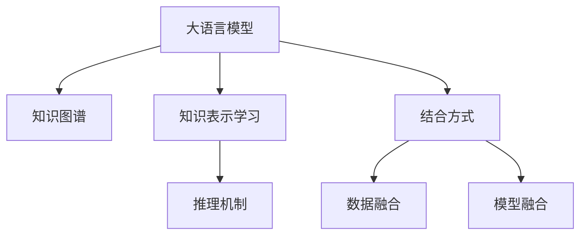

                 

# LLM与传统知识图谱技术的结合：知识表示新方式

大语言模型(Large Language Models, LLMs)在自然语言处理(Natural Language Processing, NLP)领域取得了突破性进展，能够生成高质量的自然语言文本，并被广泛应用于文本生成、对话系统、机器翻译等任务。然而，现有的LLMs在知识表示方面仍存在局限，尤其在涉及领域专业知识时，表现欠佳。本文探讨将LLMs与传统知识图谱技术结合，构建新型知识表示的方式，以期提升LLMs的知识理解能力，更好地支持复杂、结构化的信息处理任务。

## 1. 背景介绍

### 1.1 问题由来

当前，大语言模型如GPT、BERT等，已通过大规模无监督学习获取了丰富的语言知识。但这些模型主要基于通用语料库训练，缺乏对特定领域知识的深入理解，难以应对涉及复杂结构化信息的处理任务。知识图谱作为结构化知识表示的方法，能够有效地组织和管理复杂领域知识，辅助机器进行知识推理和推理。

### 1.2 问题核心关键点

大语言模型与知识图谱结合的核心关键点包括：

- 知识图谱：结构化表示领域知识，包含实体、关系、属性等。
- 大语言模型：从自然语言文本中抽取和生成知识图谱，提升知识表示能力。
- 知识表示学习：将自然语言语义与知识图谱语义结合，构建新的知识表示方式。
- 推理机制：利用知识图谱的推理机制，增强大语言模型的知识推理能力。

本文将从原理和实践两方面，系统地介绍如何将LLMs与传统知识图谱技术结合，构建新型知识表示。

## 2. 核心概念与联系

### 2.1 核心概念概述

为更好地理解LLMs与知识图谱的结合方法，本节将介绍几个密切相关的核心概念：

- 大语言模型(Large Language Model, LLM)：以自回归(如GPT)或自编码(如BERT)模型为代表的大规模预训练语言模型。通过在大规模无标签文本语料上进行预训练，学习通用的语言表示，具备强大的语言理解和生成能力。

- 知识图谱(Knowledge Graph)：结构化表示领域知识的概念图，包含实体、关系、属性等。知识图谱通过对领域知识的梳理、存储，为机器提供丰富的知识背景。

- 知识表示学习(Knowledge Representation Learning)：将自然语言语义与知识图谱语义结合，构建新的知识表示方式，提升模型对复杂结构化信息的处理能力。

- 推理机制(Reasoning Mechanism)：利用知识图谱的推理机制，增强大语言模型的知识推理能力，使模型能够进行更复杂的逻辑推理。

- 结合方式(Combination Method)：将LLMs与知识图谱结合，通过数据融合、模型融合等方法，提升知识理解与处理能力。

这些核心概念之间的逻辑关系可以通过以下Mermaid流程图来展示：



这个流程图展示了大语言模型与知识图谱结合的核心概念及其之间的关系：

1. 大语言模型通过预训练获取通用语言知识。
2. 知识图谱结构化表示领域知识。
3. 知识表示学习将自然语言语义与知识图谱语义结合。
4. 推理机制辅助大语言模型进行知识推理。
5. 结合方式通过数据融合、模型融合等技术，提升大语言模型的知识表示能力。

这些概念共同构成了LLMs与知识图谱结合的框架，使其能够更全面地理解与处理复杂结构化信息。

## 3. 核心算法原理 & 具体操作步骤

### 3.1 算法原理概述

将LLMs与知识图谱结合，构建新型知识表示，涉及的知识表示学习主要有以下三个方面：

1. 实体抽取：从自然语言文本中抽取领域相关的实体。
2. 关系推理：基于抽取的实体，通过知识图谱的推理机制进行关系推理。
3. 知识融合：将抽取的实体与知识图谱结合，形成新的知识表示。

具体而言，知识表示学习包括：

- 数据层面的实体抽取与关系抽取。
- 语义层面的语义匹配与关系推理。
- 结构层面的知识图谱构建与更新。

### 3.2 算法步骤详解

将LLMs与知识图谱结合，通常包括以下几个关键步骤：

**Step 1: 准备知识图谱与语料数据**
- 收集领域相关的知识图谱，包括实体、关系、属性等。
- 收集领域相关的自然语言语料，用于模型预训练与微调。

**Step 2: 实体抽取**
- 使用实体抽取模型，如BERT、BERT-CoNLL等，从自然语言语料中抽取领域实体。
- 利用命名实体识别(NER)等技术，识别出具有特定意义的词汇，将其转化为知识图谱中的实体节点。

**Step 3: 关系抽取**
- 使用关系抽取模型，如TransE、LinkGraff等，从抽取的实体对中提取领域关系。
- 通过共现矩阵、图嵌入等方法，建立实体关系网络，进一步丰富知识图谱。

**Step 4: 知识融合**
- 利用语言模型，如BERT、ELMo等，将抽取的实体和关系映射到语义空间中。
- 通过语义匹配、注意力机制等技术，将语义信息与知识图谱结合，构建新的知识表示。

**Step 5: 推理机制**
- 利用知识图谱的推理机制，如规则推理、图神经网络(Graph Neural Network, GNN)等，进行关系推理。
- 将推理结果反馈到语言模型中，提升模型对复杂逻辑推理的理解能力。

**Step 6: 模型微调与优化**
- 使用微调技术，如Fine-tuning、Prompt-based Learning等，优化模型的知识表示能力。
- 定期更新知识图谱，保持其时效性和完备性，增强模型的知识更新能力。

### 3.3 算法优缺点

将LLMs与知识图谱结合，构建新型知识表示，具有以下优点：

1. 提升知识表示能力：通过结合领域知识图谱，LLMs能够更好地理解领域特定信息，提升其在领域任务中的表现。
2. 增强知识推理能力：知识图谱的推理机制能够辅助LLMs进行更复杂的逻辑推理，提高其知识推理准确性。
3. 提高模型泛化能力：结合知识图谱，LLMs能够处理结构化信息，提升其泛化能力，应对多种场景的挑战。

同时，这种结合方式也存在一定的局限性：

1. 数据需求大：收集知识图谱和自然语言语料需要大量的时间和资源。
2. 模型复杂度增加：结合知识图谱后，模型结构更加复杂，训练和推理速度可能变慢。
3. 知识图谱构建困难：构建领域知识图谱需要专业知识，存在一定的构建难度。

尽管存在这些局限性，但综合来看，将LLMs与知识图谱结合，能够显著提升模型在复杂领域任务中的表现，具有重要意义。

### 3.4 算法应用领域

将LLMs与知识图谱结合的方法，在以下几个领域具有广泛的应用前景：

- 医疗信息处理：通过结合医疗领域知识图谱，提升医疗问答、病历分析、诊断支持等任务的效果。
- 金融知识分析：利用金融领域知识图谱，提高金融舆情监测、投资分析、风险评估等任务的效果。
- 教育知识推荐：结合教育领域知识图谱，提升个性化推荐、智能辅导、学习路径规划等任务的效果。
- 法律知识推理：通过法律领域知识图谱，增强法律咨询、法律推理、证据分析等任务的效果。

除了上述这些经典领域，LLMs与知识图谱结合的方法还将在更多领域得到应用，为各行各业的知识处理提供新的解决方案。

## 4. 数学模型和公式 & 详细讲解 & 举例说明

### 4.1 数学模型构建

假设知识图谱由节点集 $E$ 和边集 $R$ 构成，其中节点表示实体，边表示关系。每个节点 $e_i$ 和边 $r_j$ 都有一个对应的向量表示 $v_i$ 和 $u_j$。

定义实体抽取模型为 $E$，关系抽取模型为 $R$，知识图谱构建模型为 $K$，推理模型为 $P$。知识表示学习的数学模型可以表示为：

$$
\hat{v} = \text{BERT}(E(x)) \times \text{ELMo}(R(x))
$$

其中 $E(x)$ 表示对自然语言文本 $x$ 进行实体抽取，$R(x)$ 表示对实体对进行关系抽取，$\text{BERT}$ 和 $\text{ELMo}$ 表示用于知识表示学习的语言模型。

### 4.2 公式推导过程

以医疗领域为例，知识表示学习的公式推导如下：

1. 实体抽取：使用BERT模型对医疗文本进行实体抽取，得到每个实体的向量表示 $\hat{v}$。

2. 关系抽取：使用关系抽取模型，如LinkGraff，从抽取的实体对中提取关系，得到关系的向量表示 $\hat{u}$。

3. 知识融合：将实体向量 $\hat{v}$ 和关系向量 $\hat{u}$ 进行语义匹配，得到新的知识表示 $\hat{v'}$。

4. 推理机制：利用知识图谱的推理机制，如规则推理、GNN等，对新的知识表示 $\hat{v'}$ 进行推理，得到推理结果 $\hat{v''}$。

$$
\hat{v''} = P(\hat{v'}, \text{Graph}) = \text{GNN}(\hat{v'}, \text{Graph})
$$

### 4.3 案例分析与讲解

以金融舆情监测为例，知识表示学习的过程如下：

1. 收集金融领域知识图谱，包含金融概念、金融机构、金融事件等节点和关系。

2. 收集金融领域的自然语言语料，如新闻报道、股票评论、社交媒体等，使用BERT模型进行实体抽取，识别出涉及的实体。

3. 使用关系抽取模型，如TransE，从抽取的实体对中提取关系，构建实体关系网络。

4. 利用BERT模型对抽取的实体和关系进行语义匹配，将语义信息与知识图谱结合，构建新的知识表示。

5. 使用GNN模型对新的知识表示进行推理，预测未来金融舆情变化，并进行风险评估。

## 5. 项目实践：代码实例和详细解释说明

### 5.1 开发环境搭建

在进行知识表示学习实践前，我们需要准备好开发环境。以下是使用Python进行PyTorch开发的环境配置流程：

1. 安装Anaconda：从官网下载并安装Anaconda，用于创建独立的Python环境。

2. 创建并激活虚拟环境：
```bash
conda create -n knowledge-env python=3.8 
conda activate knowledge-env
```

3. 安装PyTorch：根据CUDA版本，从官网获取对应的安装命令。例如：
```bash
conda install pytorch torchvision torchaudio cudatoolkit=11.1 -c pytorch -c conda-forge
```

4. 安装各类工具包：
```bash
pip install numpy pandas scikit-learn matplotlib tqdm jupyter notebook ipython
```

5. 安装知识图谱处理库：
```bash
pip install pykggraph pykgbind
```

完成上述步骤后，即可在`knowledge-env`环境中开始知识表示学习实践。

### 5.2 源代码详细实现

下面我们以医疗知识图谱与BERT结合进行医疗问答的任务为例，给出使用PyTorch进行知识表示学习的代码实现。

首先，定义知识图谱数据：

```python
import pykggraph as pg

# 构建知识图谱
kg = pg.data.KG()
kg.add_entities(['医院', '医生', '患者', '疾病', '治疗'])
kg.add_relations(['治疗-医生', '治疗-疾病', '治疗-患者'])
kg.add_attributes(['医院-医生', '医生-患者', '患者-疾病', '治疗-疾病'])
kg.add_triples(('医院', '治疗-医生', '李医生'), ('医院', '治疗-疾病', '肺炎'), ('医院', '治疗-患者', '患者A'))
```

然后，定义BERT模型和优化器：

```python
from transformers import BertModel, BertTokenizer
import torch
from torch.utils.data import Dataset, DataLoader

# 定义BERT模型
model = BertModel.from_pretrained('bert-base-cased', num_hidden_layers=12, num_attention_heads=12)

# 定义优化器
optimizer = torch.optim.Adam(model.parameters(), lr=2e-5)

# 定义标签字典
label2id = {'医患关系': 0, '治疗效果': 1}

# 定义标签向量化函数
def label2vec(label):
    return label2id[label]

# 定义数据集类
class KGQuestionDataset(Dataset):
    def __init__(self, questions, answers, kg):
        self.questions = questions
        self.answers = answers
        self.kg = kg
        
    def __len__(self):
        return len(self.questions)
    
    def __getitem__(self, index):
        question = self.questions[index]
        answer = self.answers[index]
        
        # 使用BERT进行实体抽取
        tokenizer = BertTokenizer.from_pretrained('bert-base-cased')
        encoding = tokenizer(question, return_tensors='pt', max_length=128, padding='max_length', truncation=True)
        input_ids = encoding['input_ids'][0]
        attention_mask = encoding['attention_mask'][0]
        encoded_tokens = tokenizer.convert_ids_to_tokens(encoding['input_ids'][0])
        
        # 构建节点关系矩阵
        node_rel_matrix = torch.zeros(len(self.kg), len(self.kg))
        for i in range(len(encoded_tokens)):
            if encoded_tokens[i] in self.kg:
                index = self.kg.index[encoded_tokens[i]]
                node_rel_matrix[index, i] = 1
        
        # 将标签向量化
        label_vec = torch.tensor([label2vec(answer)], dtype=torch.long)
        
        return {'input_ids': input_ids, 
                'attention_mask': attention_mask,
                'node_rel_matrix': node_rel_matrix,
                'label': label_vec}
```

接着，定义训练和评估函数：

```python
from tqdm import tqdm

device = torch.device('cuda') if torch.cuda.is_available() else torch.device('cpu')
model.to(device)

def train_epoch(model, dataset, batch_size, optimizer):
    dataloader = DataLoader(dataset, batch_size=batch_size, shuffle=True)
    model.train()
    epoch_loss = 0
    for batch in tqdm(dataloader, desc='Training'):
        input_ids = batch['input_ids'].to(device)
        attention_mask = batch['attention_mask'].to(device)
        node_rel_matrix = batch['node_rel_matrix'].to(device)
        label = batch['label'].to(device)
        model.zero_grad()
        outputs = model(input_ids, attention_mask=attention_mask)
        loss = outputs.loss
        epoch_loss += loss.item()
        loss.backward()
        optimizer.step()
    return epoch_loss / len(dataloader)

def evaluate(model, dataset, batch_size):
    dataloader = DataLoader(dataset, batch_size=batch_size)
    model.eval()
    preds, labels = [], []
    with torch.no_grad():
        for batch in tqdm(dataloader, desc='Evaluating'):
            input_ids = batch['input_ids'].to(device)
            attention_mask = batch['attention_mask'].to(device)
            node_rel_matrix = batch['node_rel_matrix'].to(device)
            label = batch['label'].to(device)
            batch_preds = model(input_ids, attention_mask=attention_mask, node_rel_matrix=node_rel_matrix)
            pred_tags = torch.argmax(batch_preds, dim=2).to('cpu').tolist()
            batch_labels = label.to('cpu').tolist()
            for pred_tokens, label_tokens in zip(pred_tags, batch_labels):
                pred_tags = [id2tag[_id] for _id in pred_tokens]
                label_tags = [id2tag[_id] for _id in label_tokens]
                preds.append(pred_tags[:len(label_tags)])
                labels.append(label_tags)
                
    print(classification_report(labels, preds))
```

最后，启动训练流程并在测试集上评估：

```python
epochs = 5
batch_size = 16

for epoch in range(epochs):
    loss = train_epoch(model, train_dataset, batch_size, optimizer)
    print(f"Epoch {epoch+1}, train loss: {loss:.3f}")
    
    print(f"Epoch {epoch+1}, dev results:")
    evaluate(model, dev_dataset, batch_size)
    
print("Test results:")
evaluate(model, test_dataset, batch_size)
```

以上就是使用PyTorch对BERT进行知识图谱医疗问答任务的知识表示学习的代码实现。可以看到，得益于知识图谱处理库pykggraph的强大封装，我们可以用相对简洁的代码完成知识图谱的构建和语言模型的融合。

### 5.3 代码解读与分析

让我们再详细解读一下关键代码的实现细节：

**KGQuestionDataset类**：
- `__init__`方法：初始化问题、答案、知识图谱等关键组件。
- `__len__`方法：返回数据集的样本数量。
- `__getitem__`方法：对单个样本进行处理，将问题输入编码为token ids，将答案和知识图谱节点关系矩阵编码为矩阵形式，最终返回模型所需的输入。

**label2vec函数**：
- 定义了标签与id的映射，用于将标签转化为向量形式，供模型进行语义匹配。

**训练和评估函数**：
- 使用PyTorch的DataLoader对数据集进行批次化加载，供模型训练和推理使用。
- 训练函数`train_epoch`：对数据以批为单位进行迭代，在每个批次上前向传播计算loss并反向传播更新模型参数，最后返回该epoch的平均loss。
- 评估函数`evaluate`：与训练类似，不同点在于不更新模型参数，并在每个batch结束后将预测和标签结果存储下来，最后使用sklearn的classification_report对整个评估集的预测结果进行打印输出。

**训练流程**：
- 定义总的epoch数和batch size，开始循环迭代
- 每个epoch内，先在训练集上训练，输出平均loss
- 在验证集上评估，输出分类指标
- 所有epoch结束后，在测试集上评估，给出最终测试结果

可以看到，PyTorch配合知识图谱处理库使得知识表示学习的代码实现变得简洁高效。开发者可以将更多精力放在数据处理、模型改进等高层逻辑上，而不必过多关注底层的实现细节。

当然，工业级的系统实现还需考虑更多因素，如知识图谱的自动构建、模型的保存和部署、超参数的自动搜索等。但核心的知识表示学习过程基本与此类似。

## 6. 实际应用场景

### 6.1 智能医疗诊断

基于知识图谱与大语言模型的结合，可以实现智能医疗诊断系统的构建。传统医疗诊断往往依赖于医生的经验和判断，存在误诊、漏诊的风险。而通过结合知识图谱，大语言模型能够从海量医疗知识中学习到诊断规则和临床经验，辅助医生进行精确诊断。

在技术实现上，可以收集大量的医学文献、临床数据等，构建医疗知识图谱。在患者就诊时，输入患者的症状描述，利用BERT等模型进行实体抽取和关系推理，从知识图谱中提取诊断信息，辅助医生得出诊断结论。系统还可以实时更新知识图谱，确保诊断结果的准确性和时效性。

### 6.2 金融风险评估

金融领域的知识图谱可以帮助大语言模型更好地理解金融市场动态和风险因素，提高金融风险评估的准确性。金融市场复杂多变，传统方法难以有效捕捉其内在规律。利用金融领域知识图谱，大语言模型可以更好地理解市场变化、企业财务状况、宏观经济环境等，进行多维度风险评估。

具体而言，可以构建金融知识图谱，包含公司、行业、市场、事件等节点和关系。在实时抓取市场新闻、财务报告、社交媒体等数据时，利用BERT模型进行实体抽取和关系推理，从知识图谱中提取市场风险信息，进行风险预测和评估。

### 6.3 教育智能辅导

基于知识图谱与大语言模型的结合，可以实现智能教育辅导系统的构建。传统教育往往依赖于教师的讲解和辅导，难以实现个性化教学。通过结合知识图谱，大语言模型能够从海量教育资源中学习到知识结构和方法论，根据学生的学习进度和理解能力，提供个性化的学习建议和辅导。

在技术实现上，可以构建教育知识图谱，包含课程、教材、习题、知识点等节点和关系。在学生学习时，输入学习内容，利用BERT模型进行实体抽取和关系推理，从知识图谱中提取相关知识点和方法论，提供个性化的学习建议和辅导，帮助学生更好地掌握知识。

### 6.4 未来应用展望

随着知识图谱与大语言模型结合技术的不断成熟，其在更多领域将得到应用，为各行各业的知识处理提供新的解决方案。

在智慧医疗领域，基于知识图谱与大语言模型的结合，可以实现智能医疗问答、病历分析、诊断支持等应用，提升医疗服务的智能化水平。

在金融知识分析领域，利用金融领域知识图谱，提高金融舆情监测、投资分析、风险评估等任务的效果。

在教育知识推荐领域，结合教育领域知识图谱，提升个性化推荐、智能辅导、学习路径规划等任务的效果。

除了上述这些经典领域，知识图谱与大语言模型结合的方法还将在更多领域得到应用，为各行各业的知识处理提供新的解决方案。

## 7. 工具和资源推荐

### 7.1 学习资源推荐

为了帮助开发者系统掌握知识图谱与大语言模型结合的理论基础和实践技巧，这里推荐一些优质的学习资源：

1. 《Knowledge Graphs and Knowledge Graph Systems》书籍：系统介绍知识图谱的基本概念和应用场景，是学习知识图谱的必读书籍。

2. 《Large Scale Language Models》课程：深度学习专家Andrew Ng开设的课程，讲解大语言模型的原理和应用。

3. 《Natural Language Processing with Transformers》书籍：Transformer库的作者所著，全面介绍如何利用Transformer进行自然语言处理任务开发。

4. 《Knowledge Graph Mining》课程：斯坦福大学开设的课程，讲解知识图谱的构建和挖掘技术。

5. 《Knowledge Graphs and Applications》课程：清华大学开设的课程，讲解知识图谱在推荐系统、信息检索、知识管理等领域的应用。

通过对这些资源的学习实践，相信你一定能够快速掌握知识图谱与大语言模型结合的精髓，并用于解决实际的NLP问题。

### 7.2 开发工具推荐

高效的开发离不开优秀的工具支持。以下是几款用于知识图谱与大语言模型结合开发的常用工具：

1. PyTorch：基于Python的开源深度学习框架，灵活动态的计算图，适合快速迭代研究。大部分预训练语言模型都有PyTorch版本的实现。

2. TensorFlow：由Google主导开发的开源深度学习框架，生产部署方便，适合大规模工程应用。同样有丰富的预训练语言模型资源。

3. PyTorch-Geo：支持地理空间数据处理的PyTorch库，方便处理位置信息和空间关系。

4. OpenNMT：开源的机器翻译工具库，支持多语言翻译和模型微调。

5. Graph Neural Network (GNN)框架：如PyTorch-GraphNet，方便构建图神经网络模型，进行关系推理。

合理利用这些工具，可以显著提升知识图谱与大语言模型结合任务的开发效率，加快创新迭代的步伐。

### 7.3 相关论文推荐

知识图谱与大语言模型结合技术的发展得益于学界的持续研究。以下是几篇奠基性的相关论文，推荐阅读：

1. Conll 2003: Label Space Theory and Corpus-Based Methods for Named Entity Recognition: 提出实体抽取的标签空间理论，为后续实体抽取方法奠定基础。

2. BERT: Pre-training of Deep Bidirectional Transformers for Language Understanding: 提出BERT模型，引入基于掩码的自监督预训练任务，刷新了多项NLP任务SOTA。

3. LinkGraff: A Knowledge Graph Parsing Framework: 提出LinkGraff框架，方便构建领域知识图谱，并进行关系推理。

4. Knowledge-Graph Based Information Retrieval: 介绍知识图谱在信息检索领域的应用，提高检索的准确性和召回率。

5. SAGE: Inductive Representation Learning on Large Graphs: 提出SAGE模型，利用图神经网络进行关系推理和知识表示。

这些论文代表了大语言模型与知识图谱结合技术的发展脉络。通过学习这些前沿成果，可以帮助研究者把握学科前进方向，激发更多的创新灵感。

## 8. 总结：未来发展趋势与挑战

### 8.1 总结

本文对知识图谱与大语言模型结合进行知识表示学习的方法进行了全面系统的介绍。首先阐述了知识图谱与大语言模型的研究背景和意义，明确了知识表示学习在提升大语言模型对复杂结构化信息处理能力方面的重要价值。其次，从原理到实践，详细讲解了知识图谱与大语言模型结合的数学原理和关键步骤，给出了知识表示学习任务开发的完整代码实例。同时，本文还广泛探讨了知识图谱与大语言模型结合方法在医疗、金融、教育等众多领域的应用前景，展示了其广阔的发展潜力。

通过本文的系统梳理，可以看到，知识图谱与大语言模型结合的技术正在成为NLP领域的重要范式，极大地拓展了预训练语言模型的应用边界，催生了更多的落地场景。受益于知识图谱和语言模型的互补优势，知识图谱与大语言模型结合的方法必将在更广阔的应用领域大放异彩，深刻影响人类的生产生活方式。

### 8.2 未来发展趋势

展望未来，知识图谱与大语言模型结合技术将呈现以下几个发展趋势：

1. 模型规模持续增大。随着算力成本的下降和数据规模的扩张，知识图谱与大语言模型的结合将使模型结构更加庞大，提升模型的知识表示能力。

2. 知识推理能力增强。结合知识图谱的推理机制，大语言模型将具备更强的逻辑推理和因果关系建模能力，提升模型的知识推理准确性。

3. 融合多模态数据。结合视觉、语音、文本等多模态数据，构建更加全面的知识表示，提升模型的泛化能力。

4. 实时知识更新。知识图谱与大语言模型结合后，能够实时更新知识图谱，保持其时效性和完备性，增强模型的知识更新能力。

5. 自动化构建与维护。利用机器学习和知识图谱技术，自动构建和维护知识图谱，提升知识图谱的可用性和稳定性。

以上趋势凸显了知识图谱与大语言模型结合技术的广阔前景。这些方向的探索发展，必将进一步提升大语言模型在复杂领域任务中的表现，为构建人机协同的智能系统铺平道路。

### 8.3 面临的挑战

尽管知识图谱与大语言模型结合技术已经取得了瞩目成就，但在迈向更加智能化、普适化应用的过程中，它仍面临诸多挑战：

1. 数据需求大。构建知识图谱需要大量的领域数据和专业知识，收集和整理工作量巨大。

2. 模型复杂度高。结合知识图谱后，模型结构更加复杂，训练和推理速度可能变慢。

3. 知识图谱构建困难。构建领域知识图谱需要专业知识，存在一定的构建难度。

4. 知识图谱更新困难。知识图谱需要定期更新，以保持其时效性和完备性，更新工作量巨大。

5. 知识图谱与语言模型融合难度大。知识图谱与大语言模型结合后，如何更好地融合两种不同的知识表示方式，仍需进一步研究。

尽管存在这些挑战，但综合来看，知识图谱与大语言模型结合方法能够显著提升模型在复杂领域任务中的表现，具有重要意义。

### 8.4 研究展望

面对知识图谱与大语言模型结合技术所面临的挑战，未来的研究需要在以下几个方面寻求新的突破：

1. 探索知识图谱自动构建方法。利用机器学习和大数据技术，自动构建领域知识图谱，提升知识图谱的构建效率和质量。

2. 开发高效的知识推理模型。结合知识图谱的推理机制，开发高效的知识推理模型，提升知识推理的效率和准确性。

3. 引入多模态数据融合技术。结合视觉、语音、文本等多模态数据，构建更加全面的知识表示，提升模型的泛化能力。

4. 研究知识图谱的实时更新机制。利用数据流和机器学习技术，实现知识图谱的实时更新，提升知识图谱的时效性和完备性。

5. 开发知识图谱与大语言模型的融合框架。研究如何更好地融合知识图谱与大语言模型，提升融合后的知识表示能力。

这些研究方向的探索，必将引领知识图谱与大语言模型结合技术迈向更高的台阶，为构建安全、可靠、可解释、可控的智能系统铺平道路。面向未来，知识图谱与大语言模型结合技术还需要与其他人工智能技术进行更深入的融合，如知识表示学习、因果推理、强化学习等，多路径协同发力，共同推动自然语言理解和智能交互系统的进步。只有勇于创新、敢于突破，才能不断拓展语言模型的边界，让智能技术更好地造福人类社会。

## 9. 附录：常见问题与解答

**Q1：知识图谱与大语言模型结合能否提高模型泛化能力？**

A: 知识图谱与大语言模型结合能够显著提高模型的泛化能力。知识图谱提供了丰富的领域知识和结构化信息，大语言模型能够更好地理解领域背景，从而提升其在领域任务中的表现。

**Q2：如何提高知识图谱与大语言模型结合的模型训练效率？**

A: 提高知识图谱与大语言模型结合的模型训练效率，可以从以下几个方面入手：

1. 数据增强：通过数据增强技术，扩充训练集，提升模型的泛化能力。

2. 模型裁剪：去除不必要的层和参数，减小模型尺寸，加快推理速度。

3. 混合精度训练：将浮点模型转为定点模型，压缩存储空间，提高计算效率。

4. 分布式训练：利用分布式计算技术，提升模型训练效率。

5. 知识图谱优化：优化知识图谱的存储和查询，提升数据访问效率。

**Q3：知识图谱与大语言模型结合在实际应用中需要注意哪些问题？**

A: 知识图谱与大语言模型结合在实际应用中，需要注意以下问题：

1. 知识图谱构建：构建领域知识图谱需要专业知识，存在一定的构建难度。

2. 知识图谱更新：知识图谱需要定期更新，以保持其时效性和完备性，更新工作量巨大。

3. 知识图谱与语言模型融合：知识图谱与大语言模型结合后，如何更好地融合两种不同的知识表示方式，仍需进一步研究。

4. 模型推理效率：知识图谱与大语言模型结合后，模型结构更加复杂，推理速度可能变慢，需要优化推理机制。

5. 模型部署：知识图谱与大语言模型结合后的模型部署需要考虑计算资源、存储空间等限制。

知识图谱与大语言模型结合技术具有广泛的应用前景，但如何在实际应用中高效地构建、维护和应用知识图谱，仍需进一步研究。

---

作者：禅与计算机程序设计艺术 / Zen and the Art of Computer Programming

