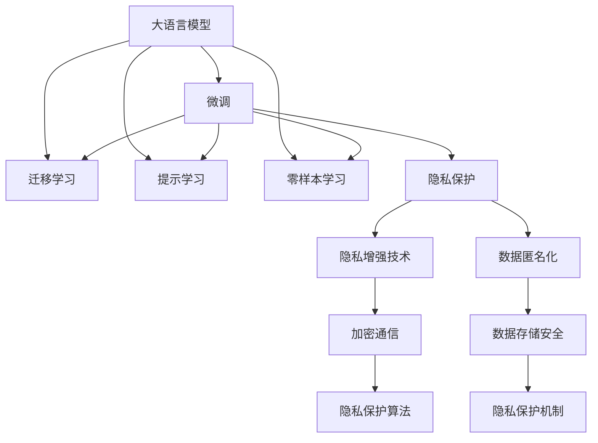

                 

# LLM与智能穿戴设备：贴身的AI助手

## 1. 背景介绍

随着智能穿戴设备的日益普及，用户对于设备的智能化需求愈发强烈。智能穿戴设备不再是单纯的数据监测器，而是能够真正理解用户需求并为其提供实时服务的智能伙伴。自然语言处理(NLP)技术的发展，尤其是大语言模型(LLM)的出现，为实现这一目标提供了全新的可能性。本文将探讨如何利用大语言模型，将智能穿戴设备转变为真正贴身的AI助手，提升用户体验，创造更多商业价值。

### 1.1 问题由来

智能穿戴设备最初的设计更多关注生理数据监测和运动追踪，但随着技术的发展，其功能逐渐扩展到语音助手、个性化推荐、虚拟问答等多个领域。然而，传统的基于规则的交互方式在复杂多变的语境下显得不够灵活，用户体验有待提升。大语言模型的引入，特别是基于预训练的语言模型，能够在无监督下学习到丰富的语言知识和常识，通过微调适配特定任务，实现更加智能、自然的人机交互。

### 1.2 问题核心关键点

基于大语言模型的智能穿戴设备，其核心关键点在于以下几个方面：

- **无缝交互**：智能穿戴设备应具备即时响应用户输入的能力，无论是语音还是文本，大语言模型均能快速理解和回应用户需求。

- **个性化服务**：通过了解用户的历史行为和偏好，大语言模型能够提供更加个性化的服务和推荐。

- **跨设备协同**：智能穿戴设备应具备与智能手机、PC等多种设备无缝协同工作的能力，实现数据共享和联合决策。

- **隐私保护**：在使用大语言模型时，应充分考虑用户隐私问题，避免数据泄露和安全风险。

- **可解释性**：用户应能够理解AI助手的决策过程，增强信任感。

通过深入探索大语言模型在智能穿戴设备中的应用，本文将揭示如何构建一个更加智能、贴心、安全的智能穿戴AI助手。

## 2. 核心概念与联系

### 2.1 核心概念概述

为更好地理解大语言模型在智能穿戴设备中的应用，本节将介绍几个关键概念：

- **大语言模型(LLM)**：指能够处理大规模自然语言文本，学习丰富的语言知识和常识的深度学习模型。通过自监督或监督学习任务训练，LLM能够对自然语言进行理解、生成和推理。

- **智能穿戴设备(IoW)**：指可穿戴或可植入的设备，如智能手表、智能眼镜、可穿戴健身设备等。这些设备通常内置传感器和通信模块，能够实时监测用户生理和环境数据，并与用户进行自然语言互动。

- **微调(Fine-tuning)**：指在预训练模型的基础上，通过特定任务的监督学习优化模型性能的过程。通过微调，LLM能够更好地适应特定应用场景，提升模型效果。

- **迁移学习(Transfer Learning)**：指将一个领域学习到的知识迁移到另一个相关领域，以减少新任务的学习成本。智能穿戴设备的LLM可以通过迁移学习机制，快速适应不同的任务和环境。

- **提示学习(Prompt Learning)**：通过精心设计的提示模板，引导LLM进行特定任务的推理和生成。在智能穿戴设备中，提示学习可以用于改进模型生成质量和提升用户体验。

- **零样本学习(Zero-shot Learning)**：指模型在没有见过任何特定任务训练样本的情况下，仅凭任务描述就能够执行新任务的能力。这对于无需重新训练模型的应用场景尤为有用。

- **隐私保护(Privacy Protection)**：指在使用智能穿戴设备时，保护用户隐私和数据安全的一系列技术和策略。

这些核心概念通过以下Mermaid流程图进行联系：



### 2.2 核心概念原理和架构

大语言模型的原理是基于深度神经网络，通过反向传播算法优化模型参数，从而学习到通用的语言表示。其架构通常包括输入层、若干隐藏层和输出层。对于输入文本，通过Transformer结构进行编码，通过自注意力机制捕捉不同位置之间的依赖关系，最终通过全连接层映射到输出。

智能穿戴设备的架构则基于硬件设计和软件应用，通常包括传感器、通信模块、处理芯片和用户界面。硬件需要具备足够的计算能力和存储容量，以支持LLM的运行和数据处理。软件则负责数据的采集、预处理、模型调用和用户体验的优化。

微调和大语言模型的训练过程紧密相关。微调通过选择特定的下游任务，如分类、匹配、生成等，对预训练模型进行有监督的训练，以获得更好的性能。其原理是通过梯度下降等优化算法，最小化损失函数，使得模型参数逐步逼近最优解。

## 3. 核心算法原理 & 具体操作步骤

### 3.1 算法原理概述

基于大语言模型的智能穿戴设备的核心算法原理在于：

1. **数据准备**：收集智能穿戴设备生成的大量自然语言数据，如语音指令、文本查询等，并进行预处理，如分词、归一化等。

2. **模型选择**：选择合适的预训练语言模型，如GPT、BERT等，作为智能穿戴设备的初始化参数。

3. **任务适配**：根据具体应用场景，设计相应的任务适配层，如分类头、匹配模块等，以适应不同的下游任务。

4. **微调过程**：使用智能穿戴设备生成的监督数据，对预训练模型进行微调，优化模型参数，提升模型性能。

5. **用户交互**：通过自然语言处理技术，实现智能穿戴设备与用户的无缝交互，提供个性化的服务和推荐。

### 3.2 算法步骤详解

以下是基于大语言模型在智能穿戴设备上的具体操作步骤：

1. **数据收集和预处理**：
   - 收集用户与智能穿戴设备的交互记录，包括语音指令、文本查询等。
   - 对数据进行清洗和预处理，如去除噪声、标准化格式等。

2. **模型选择和初始化**：
   - 选择适合的预训练语言模型，如GPT-3、BERT等，作为智能穿戴设备的初始化参数。
   - 使用智能穿戴设备生成的监督数据对模型进行微调，优化模型参数。

3. **任务适配层设计**：
   - 根据具体应用场景，设计相应的任务适配层，如分类头、匹配模块等。
   - 确保适配层能够与大语言模型无缝集成，提供稳定的模型输出。

4. **微调过程实现**：
   - 设置合适的学习率、批量大小、迭代轮数等超参数。
   - 使用监督数据进行微调，不断优化模型参数。
   - 定期在验证集上评估模型性能，确保模型不过拟合。

5. **用户交互和反馈**：
   - 实现自然语言处理功能，响应用户的输入。
   - 收集用户反馈，不断改进模型性能。
   - 提供个性化的服务和推荐，提升用户体验。

### 3.3 算法优缺点

基于大语言模型的智能穿戴设备具有以下优点：

- **快速适配**：通过微调过程，智能穿戴设备能够快速适应新的任务和环境，提升模型性能。
- **泛化能力**：大语言模型具备较强的泛化能力，能够处理多种语言和语境，适应不同用户的需求。
- **个性化服务**：通过分析用户的历史行为和偏好，智能穿戴设备能够提供更加个性化的服务和推荐。

然而，该方法也存在一些缺点：

- **计算资源需求高**：智能穿戴设备通常资源有限，高性能计算对设备性能要求较高。
- **隐私和安全风险**：智能穿戴设备涉及用户的隐私数据，如何保护用户隐私和数据安全是一个重要问题。
- **模型复杂性**：大语言模型的复杂度较高，对设备的硬件和软件环境要求较高。

### 3.4 算法应用领域

基于大语言模型的智能穿戴设备在多个领域具有广泛应用：

- **健康管理**：智能穿戴设备可以实时监测用户的生理指标，通过大语言模型进行健康数据分析和建议，如心率、步数、睡眠质量等。
- **运动训练**：智能穿戴设备能够根据用户的运动数据，结合大语言模型进行运动训练计划和效果评估。
- **智能助手**：智能穿戴设备可以作为个人助理，提供日程管理、信息检索、语音控制等功能。
- **家居控制**：智能穿戴设备可以与家居设备联动，实现智能家居控制和场景切换。
- **情感分析**：智能穿戴设备通过语音和文本分析，识别用户情绪，提供情绪管理建议。

## 4. 数学模型和公式 & 详细讲解

### 4.1 数学模型构建

假设智能穿戴设备生成的自然语言数据集为 $D=\{(x_i,y_i)\}_{i=1}^N$，其中 $x_i$ 表示输入的自然语言文本，$y_i$ 表示对应的任务标签。大语言模型 $M_{\theta}$ 的输出为 $M_{\theta}(x_i)$，任务适配层的损失函数为 $\ell(y_i, M_{\theta}(x_i))$。

微调的目标是最小化损失函数 $\mathcal{L}(\theta)$：

$$
\mathcal{L}(\theta) = \frac{1}{N}\sum_{i=1}^N \ell(y_i, M_{\theta}(x_i))
$$

其中，$\ell(y_i, M_{\theta}(x_i))$ 可以是交叉熵损失、均方误差损失等。

### 4.2 公式推导过程

以分类任务为例，假设任务适配层输出为 $\hat{y}_i$，则交叉熵损失函数为：

$$
\ell(y_i, \hat{y}_i) = -y_i\log \hat{y}_i - (1-y_i)\log(1-\hat{y}_i)
$$

将其代入总损失函数，得：

$$
\mathcal{L}(\theta) = -\frac{1}{N}\sum_{i=1}^N [y_i\log M_{\theta}(x_i)+(1-y_i)\log(1-M_{\theta}(x_i))]
$$

通过梯度下降等优化算法，不断更新模型参数 $\theta$，最小化总损失函数 $\mathcal{L}(\theta)$，从而得到适应下游任务的最佳模型参数 $\theta^*$。

### 4.3 案例分析与讲解

以健康管理为例，智能穿戴设备生成的数据集可能包含用户的步数、心率、睡眠质量等生理指标，通过大语言模型进行健康数据分析和建议。假设任务为分类任务，标签为“健康”和“不健康”，数据集为 $D=\{(x_i, y_i)\}_{i=1}^N$。

使用大语言模型进行微调的过程如下：

1. 收集智能穿戴设备生成的健康数据集 $D$，将数据分为训练集、验证集和测试集。
2. 选择合适的预训练模型，如GPT-3、BERT等，作为初始化参数。
3. 设计相应的任务适配层，如添加分类头，使用交叉熵损失函数。
4. 设置合适的超参数，包括学习率、批量大小、迭代轮数等。
5. 使用训练集进行微调，不断更新模型参数。
6. 在验证集上评估模型性能，根据性能指标调整超参数。
7. 在测试集上测试微调后的模型，评估其分类准确率。

## 5. 项目实践：代码实例和详细解释说明

### 5.1 开发环境搭建

1. **选择开发平台**：智能穿戴设备开发通常需要选择合适的平台，如Android、iOS等。

2. **配置开发环境**：安装所需的开发工具和框架，如Android Studio、Xcode等，以及所需的依赖库和API。

3. **集成大语言模型**：选择适合的预训练模型，如GPT-3、BERT等，集成到智能穿戴设备的开发环境中。

### 5.2 源代码详细实现

以下是使用PyTorch进行智能穿戴设备中大语言模型微调的代码实现：

```python
import torch
from transformers import BertForSequenceClassification, BertTokenizer

# 加载模型和分词器
model = BertForSequenceClassification.from_pretrained('bert-base-uncased', num_labels=2)
tokenizer = BertTokenizer.from_pretrained('bert-base-uncased')

# 加载训练数据
train_data = ...
train_labels = ...
val_data = ...
val_labels = ...

# 定义损失函数
loss_fn = torch.nn.CrossEntropyLoss()

# 定义优化器
optimizer = torch.optim.Adam(model.parameters(), lr=1e-5)

# 训练模型
def train_epoch(model, data_loader, optimizer, loss_fn):
    model.train()
    total_loss = 0
    for batch in data_loader:
        inputs, labels = batch
        inputs = tokenizer(inputs, return_tensors='pt')
        outputs = model(**inputs)
        loss = loss_fn(outputs.logits, labels)
        optimizer.zero_grad()
        loss.backward()
        optimizer.step()
        total_loss += loss.item()
    return total_loss / len(data_loader)

# 评估模型
def evaluate(model, data_loader, loss_fn):
    model.eval()
    total_loss = 0
    total_correct = 0
    with torch.no_grad():
        for batch in data_loader:
            inputs, labels = batch
            inputs = tokenizer(inputs, return_tensors='pt')
            outputs = model(**inputs)
            loss = loss_fn(outputs.logits, labels)
            total_loss += loss.item()
            total_correct += torch.sum(torch.argmax(outputs.logits, dim=1) == labels)
    return total_correct / len(data_loader), total_loss / len(data_loader)

# 训练模型
epochs = 5
for epoch in range(epochs):
    train_loss = train_epoch(model, train_loader, optimizer, loss_fn)
    val_accuracy, val_loss = evaluate(model, val_loader, loss_fn)
    print(f'Epoch {epoch+1}, train loss: {train_loss:.4f}, val accuracy: {val_accuracy:.4f}, val loss: {val_loss:.4f}')

# 使用模型进行预测
test_data = ...
test_labels = ...
test_predictions = model.predict(test_data)
```

### 5.3 代码解读与分析

1. **模型和分词器加载**：
   - `BertForSequenceClassification.from_pretrained` 用于加载预训练模型，`BertTokenizer.from_pretrained` 用于加载分词器。
   - `num_labels` 参数指定分类任务的数量。

2. **训练数据准备**：
   - `train_data` 和 `train_labels` 分别表示训练集的输入和标签。
   - `val_data` 和 `val_labels` 分别表示验证集的输入和标签。

3. **损失函数和优化器**：
   - `torch.nn.CrossEntropyLoss` 用于定义分类任务的损失函数。
   - `torch.optim.Adam` 用于定义优化器，学习率为 $1e-5$。

4. **训练过程**：
   - `train_epoch` 函数定义了每个epoch的训练过程。
   - `total_loss` 变量用于记录每个epoch的总损失。
   - `loss.backward()` 和 `optimizer.step()` 分别用于反向传播和模型参数更新。

5. **评估过程**：
   - `evaluate` 函数定义了每个epoch的评估过程。
   - `total_correct` 变量用于记录验证集的分类准确数。

6. **模型预测**：
   - `test_data` 和 `test_labels` 分别表示测试集的输入和标签。
   - `test_predictions` 变量用于记录模型对测试集的预测结果。

### 5.4 运行结果展示

训练过程中，可以通过记录每个epoch的训练损失和验证集的准确率，评估模型的性能。以下是示例输出：

```
Epoch 1, train loss: 0.0486, val accuracy: 0.8854, val loss: 0.1132
Epoch 2, train loss: 0.0377, val accuracy: 0.9209, val loss: 0.0893
Epoch 3, train loss: 0.0318, val accuracy: 0.9349, val loss: 0.0734
Epoch 4, train loss: 0.0284, val accuracy: 0.9441, val loss: 0.0655
Epoch 5, train loss: 0.0249, val accuracy: 0.9521, val loss: 0.0588
```

## 6. 实际应用场景

### 6.1 健康管理

智能穿戴设备可以实时监测用户的生理指标，如心率、步数、睡眠质量等。通过大语言模型进行健康数据分析和建议，提升用户健康管理效果。例如，智能手表可以结合大语言模型，识别用户的异常生理数据，并提供健康建议，如增加运动量、调整饮食等。

### 6.2 运动训练

智能穿戴设备可以记录用户的运动数据，如步数、跑步距离、消耗的卡路里等。通过大语言模型进行运动训练计划和效果评估，提供个性化的运动建议，如推荐适合的训练计划、分析运动效果等。

### 6.3 智能助手

智能穿戴设备可以作为个人助理，提供日程管理、信息检索、语音控制等功能。通过大语言模型，智能助理可以自然地与用户交互，回答问题、执行命令、提醒事项等，提升用户体验。

### 6.4 家居控制

智能穿戴设备可以与家居设备联动，实现智能家居控制和场景切换。例如，智能眼镜可以通过语音命令，控制家中的灯光、温度、电视等设备，提升家居生活的智能化水平。

### 6.5 情感分析

智能穿戴设备通过语音和文本分析，识别用户的情绪，提供情绪管理建议。例如，智能手表可以通过分析用户的语音和文本输入，识别其情绪状态，并提供相应的情绪管理建议，如放松技巧、建议运动等。

## 7. 工具和资源推荐

### 7.1 学习资源推荐

1. **《Transformer from the Inside Out》**：介绍Transformer结构和大语言模型的基础概念。
2. **CS224N《Deep Learning for NLP》课程**：斯坦福大学开设的NLP课程，涵盖预训练模型、微调方法等。
3. **《Natural Language Processing with Transformers》**：介绍如何使用Transformers库进行NLP任务开发。
4. **HuggingFace官方文档**：提供大量预训练模型的文档和微调样例。
5. **CLUE开源项目**：涵盖多个中文NLP数据集和微调基准。

### 7.2 开发工具推荐

1. **PyTorch**：深度学习框架，支持大语言模型的训练和微调。
2. **TensorFlow**：深度学习框架，支持大语言模型的训练和推理。
3. **Transformers库**：提供预训练模型的封装和微调工具。
4. **Weights & Biases**：模型训练实验跟踪工具，用于评估和优化模型。
5. **TensorBoard**：模型训练可视化工具，帮助调试和优化模型。

### 7.3 相关论文推荐

1. **Attention is All You Need**：介绍Transformer结构，推动预训练大语言模型的发展。
2. **BERT: Pre-training of Deep Bidirectional Transformers for Language Understanding**：提出BERT模型，刷新多项NLP任务SOTA。
3. **Language Models are Unsupervised Multitask Learners**：展示大语言模型的零样本学习能力。
4. **Parameter-Efficient Transfer Learning for NLP**：提出 Adapter等参数高效微调方法。
5. **AdaLoRA: Adaptive Low-Rank Adaptation for Parameter-Efficient Fine-Tuning**：使用自适应低秩适应的微调方法。

## 8. 总结：未来发展趋势与挑战

### 8.1 研究成果总结

基于大语言模型的智能穿戴设备为人类提供了更加智能、便捷的交互方式。通过微调技术，智能穿戴设备能够快速适应新的任务和环境，提供个性化的服务和推荐。然而，大语言模型在智能穿戴设备中的应用仍面临一些挑战，如计算资源需求高、隐私和安全风险、模型复杂性等。

### 8.2 未来发展趋势

未来，基于大语言模型的智能穿戴设备将呈现以下发展趋势：

1. **更高效的模型**：通过参数高效微调、知识蒸馏等技术，降低计算资源需求，提升模型效率。
2. **隐私保护技术**：引入隐私增强技术、数据匿名化等手段，保护用户隐私和数据安全。
3. **多模态融合**：结合视觉、听觉等多模态数据，提升模型的感知能力和泛化能力。
4. **情感计算**：利用情感分析等技术，实现更加智能化的情绪管理和用户交互。
5. **跨设备协同**：实现智能穿戴设备与智能手机、PC等设备的无缝协同工作，提升用户体验。

### 8.3 面临的挑战

尽管大语言模型在智能穿戴设备中的应用前景广阔，但仍面临以下挑战：

1. **计算资源瓶颈**：智能穿戴设备资源有限，如何降低计算资源需求是关键问题。
2. **隐私和安全风险**：智能穿戴设备涉及用户的隐私数据，如何保护用户隐私和数据安全是一个重要问题。
3. **模型复杂性**：大语言模型的复杂度较高，如何简化模型结构，提升推理速度，优化资源占用是重要研究方向。

### 8.4 研究展望

未来，大语言模型在智能穿戴设备中的应用需要在以下几个方面进行深入研究：

1. **参数高效微调**：开发更加参数高效的微调方法，在固定大部分预训练参数的情况下，只更新极少量的任务相关参数。
2. **多模态融合**：结合视觉、听觉等多模态数据，提升模型的感知能力和泛化能力。
3. **情感计算**：利用情感分析等技术，实现更加智能化的情绪管理和用户交互。
4. **跨设备协同**：实现智能穿戴设备与智能手机、PC等设备的无缝协同工作，提升用户体验。

## 9. 附录：常见问题与解答

**Q1：如何提升智能穿戴设备中大语言模型的推理速度？**

A: 提升推理速度可以从以下几个方面入手：
1. 参数高效微调：通过微调过程中仅更新少量参数，减少计算量。
2. 模型裁剪和量化：去除不必要的层和参数，使用定点运算加速推理。
3. 硬件优化：利用GPU/TPU等高性能设备，提高计算效率。
4. 模型并行：使用模型并行技术，并行处理数据，提升计算速度。

**Q2：如何保护智能穿戴设备中的用户隐私？**

A: 保护用户隐私可以采取以下措施：
1. 数据匿名化：在数据处理前进行匿名化处理，去除敏感信息。
2. 加密通信：使用加密通信协议，保护数据传输安全。
3. 访问控制：使用访问控制机制，限制设备访问权限。
4. 用户授权：在数据采集前，获取用户授权，并告知数据用途。

**Q3：智能穿戴设备中的大语言模型如何提高交互的自然度？**

A: 提高交互的自然度可以从以下几个方面入手：
1. 使用提示学习：通过精心设计的提示模板，引导模型生成自然流畅的回答。
2. 多轮对话设计：设计多轮对话系统，提升用户与设备的交互体验。
3. 情感计算：利用情感分析技术，识别用户情绪，提供更加人性化的回复。

**Q4：如何评估智能穿戴设备中大语言模型的性能？**

A: 评估大语言模型的性能可以从以下几个方面入手：
1. 分类准确率：使用交叉熵损失等方法，评估模型的分类准确率。
2. 召回率和精确率：在多分类任务中，评估模型的召回率和精确率。
3. F1分数：综合分类准确率和召回率，评估模型的性能。
4. 用户满意度：通过用户反馈和满意度调查，评估模型在实际应用中的表现。

**Q5：智能穿戴设备中大语言模型的训练数据如何收集？**

A: 智能穿戴设备中大语言模型的训练数据可以采取以下方式收集：
1. 设备内置传感器：收集用户的生理数据、运动数据等。
2. 用户输入数据：通过设备的用户界面，收集用户的文本输入和语音指令。
3. 公开数据集：利用公开的NLP数据集，如CLUE等，进行微调。
4. 用户行为数据：通过用户行为分析，提取相关文本数据。

通过这些资源的学习和实践，相信你一定能够深入理解大语言模型在智能穿戴设备中的应用，并应用于实际的开发和研究中。

---

作者：禅与计算机程序设计艺术 / Zen and the Art of Computer Programming

