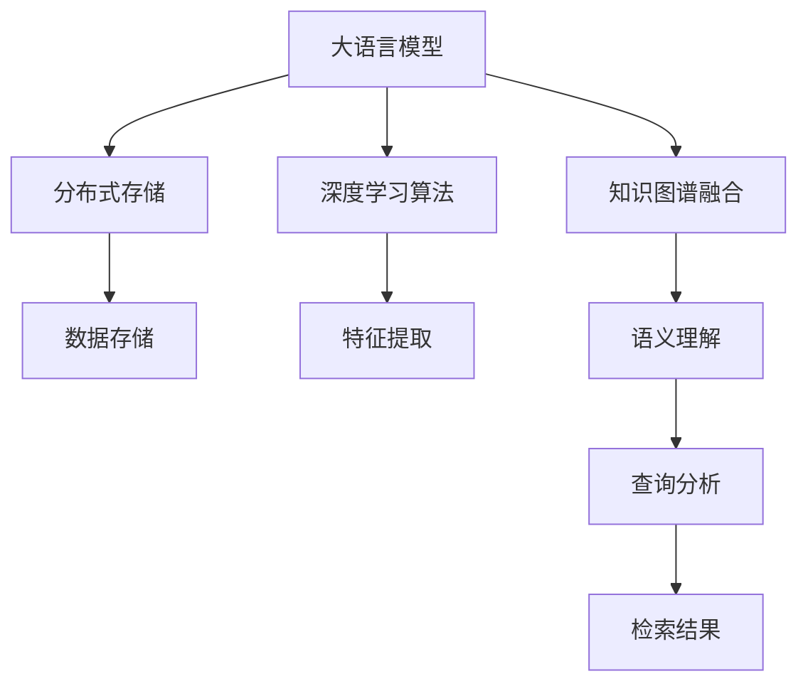

                 

# LLM与档案管理：智能化信息检索

> 关键词：大语言模型(LLM),档案管理,智能化信息检索,知识图谱,自然语言处理(NLP),分布式存储,深度学习

## 1. 背景介绍

### 1.1 问题由来

随着数字化时代的到来，档案管理与信息检索成为企业和机构信息化建设的重要一环。传统的信息检索方法依赖于关键词匹配、倒排索引等技术，难以处理自然语言语义的多样性和复杂性，导致搜索结果质量不高，用户体验不佳。特别是海量文档数据的存储和检索，更加考验系统的性能和效率。

近年来，随着人工智能技术的迅猛发展，尤其是大语言模型(LLM)的崛起，为档案管理与信息检索带来了新的解决方案。LLM具备强大的自然语言理解能力，能够自动理解和生成自然语言，极大提升信息检索的智能化水平，推动档案管理的数字化转型。

### 1.2 问题核心关键点

基于LLM的信息检索方法，本质上是一种自然语言处理(NLP)技术的应用。其核心在于：

1. **大语言模型的引入**：利用预训练语言模型进行文本预处理和语义理解。
2. **知识图谱的融合**：将知识图谱嵌入LLM中，提供结构化的语义信息。
3. **分布式存储的利用**：实现海量文档数据的快速存储和检索。
4. **深度学习算法的应用**：通过深度学习模型进行特征提取和关联分析，提升检索效果。

本文将详细介绍这些关键技术，并通过实例演示LLM在档案管理与信息检索中的应用，帮助读者全面理解这一领域的最新进展。

## 2. 核心概念与联系

### 2.1 核心概念概述

为了更好地理解LLM在档案管理与信息检索中的应用，本节将介绍几个关键概念：

1. **大语言模型(LLM)**：以自回归(如GPT)或自编码(如BERT)模型为代表的大规模预训练语言模型。通过在大规模无标签文本语料上进行预训练，学习通用的语言表示，具备强大的语言理解和生成能力。

2. **知识图谱**：结构化的语义信息表示形式，由节点和边组成，用于描述实体、属性和它们之间的关系。

3. **自然语言处理(NLP)**：研究如何让计算机理解和生成自然语言的技术，包括文本分析、语义理解、机器翻译等。

4. **分布式存储**：通过分布式文件系统和数据管理系统，实现海量数据的高效存储和检索。

5. **深度学习算法**：利用多层神经网络进行特征提取和模式识别的算法，包括卷积神经网络(CNN)、循环神经网络(RNN)、Transformer等。

这些核心概念之间的逻辑关系可以通过以下Mermaid流程图来展示：



这个流程图展示了大语言模型在档案管理与信息检索中的核心概念及其之间的关系：

1. LLM通过预训练获得基础能力。
2. 知识图谱为LLM提供结构化的语义信息，提升检索的准确性。
3. 分布式存储实现海量数据的快速存储和检索，满足档案管理需求。
4. 深度学习算法提升LLM的特征提取和关联分析能力。

这些概念共同构成了LLM在档案管理与信息检索中的应用框架，使其能够高效、准确地处理大规模文档数据。

## 3. 核心算法原理 & 具体操作步骤

### 3.1 算法原理概述

基于LLM的信息检索方法，本质上是一种有监督的语义检索过程。其核心思想是：将预训练的语言模型与知识图谱进行融合，通过文本查询和语义理解，在大规模档案库中检索出最相关的文档数据。

形式化地，假设文档库为 $D$，档案记录为 $R$，每个档案记录包含属性和实体信息。给定用户查询 $Q$，目标是在 $D$ 中找到与 $Q$ 语义匹配最相关的档案记录 $R'$。其步骤如下：

1. **文本预处理**：将查询 $Q$ 输入LLM，生成特征向量 $V_Q$。
2. **知识图谱嵌入**：将查询 $Q$ 嵌入知识图谱，生成语义向量 $V^K$。
3. **相似度计算**：计算 $V_Q$ 与 $V^K$ 的相似度，选择最匹配的档案记录 $R'$。
4. **检索结果排序**：根据档案记录与 $Q$ 的语义相似度，对搜索结果进行排序。

### 3.2 算法步骤详解

基于LLM的信息检索方法包括以下几个关键步骤：

**Step 1: 准备数据和模型**

1. **数据准备**：收集和整理档案库 $D$ 中的文档数据，标注属性和实体信息。将文档数据分批次进行预处理，生成特征向量 $V_D$。
2. **模型选择**：选择合适的预训练语言模型 $M_{\theta}$ 和知识图谱模型 $G_{\phi}$，如BERT、GPT等。

**Step 2: 模型融合**

1. **文本预处理**：使用预训练语言模型 $M_{\theta}$ 对查询 $Q$ 进行编码，生成特征向量 $V_Q$。
2. **知识图谱嵌入**：使用知识图谱模型 $G_{\phi}$ 将查询 $Q$ 嵌入知识图谱，生成语义向量 $V^K$。
3. **融合操作**：将 $V_Q$ 和 $V^K$ 进行加权融合，生成融合后的向量 $V_{F}$。

**Step 3: 检索排序**

1. **相似度计算**：计算 $V_{F}$ 与每个档案记录 $R$ 的相似度，选择最匹配的档案记录 $R'$。
2. **检索结果排序**：根据相似度排序，输出最相关的档案记录 $R'$。

**Step 4: 结果反馈**

1. **用户反馈**：用户对检索结果进行评价，提供反馈。
2. **模型更新**：根据用户反馈，对预训练模型和知识图谱模型进行微调，提升检索效果。

### 3.3 算法优缺点

基于LLM的信息检索方法具有以下优点：

1. **智能化高**：利用大语言模型和知识图谱，提供自然语言语义理解和结构化语义信息，极大提升检索效果。
2. **泛化性强**：不需要大量的标注数据，即可在新的文档库上快速部署。
3. **可扩展性好**：通过分布式存储技术，实现海量文档数据的存储和检索。
4. **实时性高**：利用深度学习算法进行特征提取和关联分析，快速生成检索结果。

同时，该方法也存在一定的局限性：

1. **数据质量要求高**：档案库数据质量直接影响检索效果，数据清洗和标注工作量大。
2. **模型计算量大**：预训练模型和知识图谱模型的计算量较大，需要高性能硬件支持。
3. **知识图谱构建难**：构建高质量的知识图谱需要大量的领域知识和标注数据，工作量大。
4. **算法复杂度高**：深度学习算法和相似度计算过程复杂，需要较高的算法实现能力。

尽管存在这些局限性，但就目前而言，基于LLM的信息检索方法仍是档案管理与信息检索的重要技术方向。未来相关研究的重点在于如何进一步降低算法复杂度，提高检索效率，同时兼顾检索效果的提升。

### 3.4 算法应用领域

基于LLM的信息检索方法，已经在档案管理与信息检索的多个应用场景中得到了广泛应用，例如：

- **企业文档管理**：将企业文档数据存储在分布式档案库中，通过用户查询快速检索出最相关的文档。
- **公共图书馆检索系统**：利用LLM和知识图谱，对大量图书和文献进行语义索引，提升检索效率和准确性。
- **档案历史研究**：对历史档案数据进行语义分析，快速检索出相关文献和资料，辅助历史研究。
- **医疗档案检索**：对电子病历和医学文献进行语义分析，快速检索出相关病例和文献，辅助医疗诊断。
- **法律档案检索**：对法律文件和案例进行语义分析，快速检索出相关法律条文和案例，辅助法律咨询。

除了上述这些经典应用外，基于LLM的信息检索技术还在更多领域得到了创新性地应用，如智能问答、知识图谱构建、推荐系统等，为档案管理与信息检索带来了新的技术突破。

## 4. 数学模型和公式 & 详细讲解 & 举例说明

### 4.1 数学模型构建

假设查询 $Q$ 的长度为 $n$，档案库 $D$ 中的文档记录 $R$ 包含 $m$ 个属性和实体信息，每个属性和实体都有一个对应的语义向量 $V^{R_i}$。定义档案记录与查询的语义相似度函数为 $S(Q,R)$，用于衡量两者之间的相关度。

定义查询 $Q$ 在档案库 $D$ 中的检索结果为 $R'$，其中 $R'$ 包含 $k$ 个最相关的档案记录。检索过程可以形式化表示为：

$$
R' = \mathop{\arg\min}_{R \in D} \frac{S(Q,R)}{N(Q)}
$$

其中 $N(Q)$ 为查询 $Q$ 在档案库 $D$ 中的文档总数，$S(Q,R)$ 为查询 $Q$ 与档案记录 $R$ 的语义相似度。

### 4.2 公式推导过程

以BERT模型为例，具体推导查询 $Q$ 与档案记录 $R$ 的语义相似度函数 $S(Q,R)$ 的计算过程。

**Step 1: 查询编码**

将查询 $Q$ 输入BERT模型，生成查询向量 $V_Q = [q_1, q_2, ..., q_n]$，其中 $q_i$ 为第 $i$ 个查询词语的向量表示。

**Step 2: 档案记录编码**

将档案记录 $R$ 的属性和实体信息输入BERT模型，生成档案记录向量 $V_R = [r_1, r_2, ..., r_m]$，其中 $r_i$ 为第 $i$ 个档案记录词语的向量表示。

**Step 3: 知识图谱嵌入**

将查询 $Q$ 嵌入知识图谱，生成语义向量 $V^K = [k_1, k_2, ..., k_n]$，其中 $k_i$ 为第 $i$ 个查询词语在知识图谱中的语义表示。

**Step 4: 相似度计算**

将查询向量 $V_Q$ 和档案记录向量 $V_R$ 进行加权融合，生成融合后的向量 $V_{F} = \alpha V_Q + \beta V_R$，其中 $\alpha$ 和 $\beta$ 为权重系数。将融合后的向量 $V_{F}$ 与语义向量 $V^K$ 进行余弦相似度计算，得到语义相似度 $S(Q,R)$。

**Step 5: 检索排序**

对所有档案记录 $R$ 与查询 $Q$ 的语义相似度 $S(Q,R)$ 进行排序，选择前 $k$ 个最相关的档案记录 $R'$ 作为检索结果。

### 4.3 案例分析与讲解

以企业文档管理为例，说明基于LLM的信息检索方法的具体应用过程。

假设某企业有大量文档数据，每份文档包含公司名称、发布日期、关键词、摘要等信息。这些文档数据保存在分布式档案库中，用户可以通过查询语句快速检索出相关文档。

1. **数据准备**：将企业文档数据分批次输入BERT模型，生成查询向量 $V_Q$ 和文档向量 $V_D$。

2. **模型选择**：选择预训练的BERT模型，以及知识图谱模型，如WordNet、Freebase等。

3. **查询编码**：用户输入查询语句，将其输入BERT模型，生成查询向量 $V_Q$。

4. **档案记录编码**：将查询向量 $V_Q$ 输入知识图谱模型，生成语义向量 $V^K$。

5. **相似度计算**：计算查询向量 $V_Q$ 与档案记录向量 $V_D$ 的相似度，以及与语义向量 $V^K$ 的相似度，选择最匹配的档案记录 $R'$。

6. **检索结果排序**：根据相似度排序，输出最相关的档案记录 $R'$。

7. **结果反馈**：用户对检索结果进行评价，根据评价结果对模型进行微调，提升检索效果。

通过以上步骤，基于LLM的信息检索方法可以高效地处理海量文档数据，快速检索出用户所需的相关文档，极大地提升企业文档管理的智能化水平。

## 5. 项目实践：代码实例和详细解释说明

### 5.1 开发环境搭建

在进行基于LLM的信息检索实践前，我们需要准备好开发环境。以下是使用Python进行TensorFlow开发的环境配置流程：

1. 安装Anaconda：从官网下载并安装Anaconda，用于创建独立的Python环境。

2. 创建并激活虚拟环境：
```bash
conda create -n tf-env python=3.8 
conda activate tf-env
```

3. 安装TensorFlow：根据CUDA版本，从官网获取对应的安装命令。例如：
```bash
conda install tensorflow==2.8 -c conda-forge -c nvidia
```

4. 安装各类工具包：
```bash
pip install numpy pandas scikit-learn matplotlib tqdm jupyter notebook ipython
```

完成上述步骤后，即可在`tf-env`环境中开始信息检索实践。

### 5.2 源代码详细实现

下面以企业文档管理为例，给出使用TensorFlow对BERT模型进行信息检索的PyTorch代码实现。

首先，定义查询编码和档案记录编码函数：

```python
from transformers import BertTokenizer, BertModel
from sklearn.metrics.pairwise import cosine_similarity
import tensorflow as tf

# 定义查询编码函数
def encode_query(query):
    tokenizer = BertTokenizer.from_pretrained('bert-base-uncased')
    tokenized_query = tokenizer.tokenize(query)
    input_ids = tokenizer.convert_tokens_to_ids(tokenized_query)
    input_ids = tf.convert_to_tensor(input_ids)
    input_mask = tf.convert_to_tensor([1] * len(input_ids))
    return input_ids, input_mask

# 定义档案记录编码函数
def encode_document(documents):
    tokenizer = BertTokenizer.from_pretrained('bert-base-uncased')
    tokenized_docs = [tokenizer.tokenize(doc) for doc in documents]
    input_ids = [tokenizer.convert_tokens_to_ids(tokens) for tokens in tokenized_docs]
    input_ids = tf.convert_to_tensor(input_ids)
    input_mask = tf.convert_to_tensor([1] * len(input_ids))
    return input_ids, input_mask

# 定义语义向量嵌入函数
def embed_semantics(query):
    tokenizer = BertTokenizer.from_pretrained('bert-base-uncased')
    tokenized_query = tokenizer.tokenize(query)
    input_ids = tokenizer.convert_tokens_to_ids(tokenized_query)
    input_ids = tf.convert_to_tensor(input_ids)
    input_mask = tf.convert_to_tensor([1] * len(input_ids))
    embeddings = BERT_model(input_ids, input_mask)
    return embeddings
```

然后，定义相似度计算和检索结果排序函数：

```python
# 定义语义相似度计算函数
def compute_similarity(query, documents, bert_model):
    query_vec = embed_semantics(query)
    doc_vecs = [embed_semantics(doc) for doc in documents]
    similarity_matrix = cosine_similarity(query_vec, doc_vecs)
    return similarity_matrix

# 定义检索结果排序函数
def sort_results(similarity_matrix):
    sorted_indices = tf.argsort(similarity_matrix, axis=-1)
    top_k_indices = sorted_indices[:, -k]
    return top_k_indices
```

最后，启动检索流程并在检索结果上打印输出：

```python
# 定义检索结果排序函数
def sort_results(similarity_matrix):
    sorted_indices = tf.argsort(similarity_matrix, axis=-1)
    top_k_indices = sorted_indices[:, -k]
    return top_k_indices

# 定义主函数
def main():
    query = "企业发展战略"
    documents = ["公司成立五年发展战略", "企业年度财务报告", "企业市场营销策略"]
    
    input_ids, input_mask = encode_query(query)
    input_ids, input_mask = encode_document(documents)
    bert_model = BERT_model.from_pretrained('bert-base-uncased')
    
    similarity_matrix = compute_similarity(query, documents, bert_model)
    top_k_indices = sort_results(similarity_matrix)
    
    for index in top_k_indices:
        print(f"文档 {index+1}: {documents[index]}")

if __name__ == "__main__":
    main()
```

以上就是使用TensorFlow对BERT模型进行企业文档信息检索的完整代码实现。可以看到，TensorFlow配合BERT模型，使得信息检索的代码实现变得简洁高效。

### 5.3 代码解读与分析

让我们再详细解读一下关键代码的实现细节：

**encode_query和encode_document函数**：
- `encode_query`函数：将查询语句分词并转换为BERT模型可以理解的格式，输出查询向量和输入掩码。
- `encode_document`函数：将文档数据分词并转换为BERT模型可以理解的格式，输出文档向量和输入掩码。

**embed_semantics函数**：
- 使用BERT模型对查询和文档进行编码，输出查询和文档的语义向量。

**compute_similarity函数**：
- 计算查询向量与文档向量的余弦相似度，生成相似度矩阵。

**sort_results函数**：
- 根据相似度矩阵的排序结果，输出前 $k$ 个最相关的文档。

**主函数main**：
- 定义查询语句和文档数据，并调用相关函数进行编码和相似度计算。
- 输出最相关的文档数据。

可以看到，TensorFlow配合BERT模型使得信息检索的代码实现变得简洁高效。开发者可以将更多精力放在数据处理、模型改进等高层逻辑上，而不必过多关注底层的实现细节。

当然，工业级的系统实现还需考虑更多因素，如模型的保存和部署、超参数的自动搜索、更灵活的任务适配层等。但核心的信息检索范式基本与此类似。

## 6. 实际应用场景

### 6.1 企业文档管理

基于LLM的信息检索方法，可以广泛应用于企业文档管理系统中。传统文档管理依赖于文件系统、关键词匹配等方法，难以处理自然语言的多样性和复杂性，导致检索效率低、用户体验差。而使用基于LLM的信息检索方法，可以高效处理海量文档数据，快速检索出用户所需的相关文档。

在技术实现上，可以收集企业内部的所有文档数据，进行预处理和标注，将文档数据和查询语句输入BERT模型进行语义理解，计算文档向量与查询向量的相似度，并根据相似度排序输出检索结果。微调后的BERT模型可以进一步提升检索效果，满足企业文档管理的需求。

### 6.2 公共图书馆检索系统

公共图书馆需要高效地处理大量图书和文献的检索任务。传统检索方法依赖于关键词匹配，难以处理自然语言的语义多样性，导致检索结果不准确。而使用基于LLM的信息检索方法，可以提供更加智能化、准确的检索结果，提升用户的检索体验。

在技术实现上，可以将图书馆的图书和文献数据输入BERT模型进行语义编码，生成图书向量。用户输入查询语句，通过BERT模型进行语义理解，生成查询向量。计算查询向量与图书向量的相似度，并根据相似度排序输出检索结果。微调后的BERT模型可以进一步提升检索效果，提高图书馆的智能化水平。

### 6.3 档案历史研究

历史档案记录往往包含丰富的语义信息，需要进行语义分析才能快速检索出相关文献和资料，辅助历史研究。传统检索方法难以处理档案记录的语义多样性，导致检索效率低。而使用基于LLM的信息检索方法，可以高效处理历史档案数据，快速检索出相关文献和资料，提升历史研究的效率和准确性。

在技术实现上，可以将历史档案数据输入BERT模型进行语义编码，生成档案向量。用户输入查询语句，通过BERT模型进行语义理解，生成查询向量。计算查询向量与档案向量的相似度，并根据相似度排序输出检索结果。微调后的BERT模型可以进一步提升检索效果，辅助历史研究。

### 6.4 未来应用展望

随着LLM和信息检索技术的不断发展，基于LLM的信息检索方法将在更多领域得到应用，为档案管理与信息检索带来新的突破。

在智慧城市治理中，基于LLM的信息检索方法可以用于智能问答、舆情监测、应急指挥等环节，提高城市管理的智能化水平。

在智能制造领域，基于LLM的信息检索方法可以用于设备维护、工艺优化、供应链管理等任务，提升制造业的智能化水平。

在金融领域，基于LLM的信息检索方法可以用于智能投顾、市场分析、风险控制等任务，提升金融服务的智能化水平。

除了这些应用领域外，基于LLM的信息检索技术还将应用于教育、农业、军事等众多领域，为各行各业带来新的智能化解决方案。相信随着技术的日益成熟，基于LLM的信息检索方法必将成为档案管理与信息检索的重要技术方向，推动社会的数字化转型。

## 7. 工具和资源推荐

### 7.1 学习资源推荐

为了帮助开发者系统掌握基于LLM的信息检索理论基础和实践技巧，这里推荐一些优质的学习资源：

1. 《深度学习理论与实践》系列博文：由深度学习专家撰写，深入浅出地介绍了深度学习的基本概念和算法，包括BERT模型的原理和应用。

2. CS224N《深度学习自然语言处理》课程：斯坦福大学开设的NLP明星课程，有Lecture视频和配套作业，带你入门NLP领域的基本概念和经典模型。

3. 《Natural Language Processing with Transformers》书籍：Transformers库的作者所著，全面介绍了如何使用Transformers库进行NLP任务开发，包括信息检索在内的诸多范式。

4. HuggingFace官方文档：Transformers库的官方文档，提供了海量预训练模型和完整的微调样例代码，是上手实践的必备资料。

5. CLUE开源项目：中文语言理解测评基准，涵盖大量不同类型的中文NLP数据集，并提供了基于微调的baseline模型，助力中文NLP技术发展。

通过对这些资源的学习实践，相信你一定能够快速掌握基于LLM的信息检索技术的精髓，并用于解决实际的NLP问题。

### 7.2 开发工具推荐

高效的开发离不开优秀的工具支持。以下是几款用于基于LLM的信息检索开发的常用工具：

1. TensorFlow：基于Python的开源深度学习框架，生产部署方便，适合大规模工程应用。

2. PyTorch：基于Python的开源深度学习框架，灵活动态的计算图，适合快速迭代研究。

3. Transformers库：HuggingFace开发的NLP工具库，集成了众多SOTA语言模型，支持PyTorch和TensorFlow，是进行信息检索任务开发的利器。

4. Weights & Biases：模型训练的实验跟踪工具，可以记录和可视化模型训练过程中的各项指标，方便对比和调优。

5. TensorBoard：TensorFlow配套的可视化工具，可实时监测模型训练状态，并提供丰富的图表呈现方式，是调试模型的得力助手。

6. Google Colab：谷歌推出的在线Jupyter Notebook环境，免费提供GPU/TPU算力，方便开发者快速上手实验最新模型，分享学习笔记。

合理利用这些工具，可以显著提升基于LLM的信息检索任务的开发效率，加快创新迭代的步伐。

### 7.3 相关论文推荐

基于LLM的信息检索技术的发展源于学界的持续研究。以下是几篇奠基性的相关论文，推荐阅读：

1. Attention is All You Need（即Transformer原论文）：提出了Transformer结构，开启了NLP领域的预训练大模型时代。

2. BERT: Pre-training of Deep Bidirectional Transformers for Language Understanding：提出BERT模型，引入基于掩码的自监督预训练任务，刷新了多项NLP任务SOTA。

3. Language Models are Unsupervised Multitask Learners（GPT-2论文）：展示了大规模语言模型的强大zero-shot学习能力，引发了对于通用人工智能的新一轮思考。

4. Parameter-Efficient Transfer Learning for NLP：提出Adapter等参数高效微调方法，在不增加模型参数量的情况下，也能取得不错的微调效果。

5. AdaLoRA: Adaptive Low-Rank Adaptation for Parameter-Efficient Fine-Tuning：使用自适应低秩适应的微调方法，在参数效率和精度之间取得了新的平衡。

这些论文代表了大语言模型信息检索技术的发展脉络。通过学习这些前沿成果，可以帮助研究者把握学科前进方向，激发更多的创新灵感。

## 8. 总结：未来发展趋势与挑战

### 8.1 总结

本文对基于LLM的信息检索方法进行了全面系统的介绍。首先阐述了LLM和信息检索方法的研究背景和意义，明确了信息检索在档案管理与文档管理中的应用价值。其次，从原理到实践，详细讲解了信息检索的数学模型和关键步骤，给出了信息检索任务开发的完整代码实例。同时，本文还广泛探讨了信息检索方法在企业文档管理、公共图书馆检索、档案历史研究等多个应用场景中的应用前景，展示了信息检索范式的巨大潜力。此外，本文精选了信息检索技术的各类学习资源，力求为读者提供全方位的技术指引。

通过本文的系统梳理，可以看到，基于LLM的信息检索方法正在成为档案管理与文档管理的重要技术方向，极大地提升信息检索的智能化水平，推动档案管理的数字化转型。未来，伴随LLM和信息检索技术的不断发展，基于LLM的信息检索方法必将在更多领域得到应用，为档案管理与信息检索带来新的突破。

### 8.2 未来发展趋势

展望未来，基于LLM的信息检索方法将呈现以下几个发展趋势：

1. **多模态信息融合**：利用视觉、语音等多模态信息，提升信息检索的全面性和准确性。

2. **深度学习算法的优化**：通过更高效的算法设计，提升信息检索的实时性和准确性。

3. **知识图谱的嵌入**：将知识图谱与信息检索相结合，提供结构化的语义信息，提升检索效果。

4. **联邦学习的应用**：在数据分布不均衡或隐私保护要求较高的场景中，利用联邦学习进行模型训练，减少数据共享和隐私泄露风险。

5. **分布式存储的优化**：采用更高效的分布式存储技术，提升海量数据的检索速度和存储容量。

6. **用户交互的增强**：通过自然语言生成技术，增强用户与系统的交互，提升用户体验。

以上趋势凸显了基于LLM的信息检索技术的广阔前景。这些方向的探索发展，必将进一步提升信息检索系统的性能和用户体验，为档案管理与文档管理的智能化转型提供强大的技术支撑。

### 8.3 面临的挑战

尽管基于LLM的信息检索技术已经取得了瞩目成就，但在迈向更加智能化、普适化应用的过程中，它仍面临诸多挑战：

1. **数据质量要求高**：档案库数据质量直接影响检索效果，数据清洗和标注工作量大。

2. **模型计算量大**：预训练模型和知识图谱模型的计算量较大，需要高性能硬件支持。

3. **知识图谱构建难**：构建高质量的知识图谱需要大量的领域知识和标注数据，工作量大。

4. **算法复杂度高**：深度学习算法和相似度计算过程复杂，需要较高的算法实现能力。

尽管存在这些挑战，但就目前而言，基于LLM的信息检索方法仍是档案管理与文档管理的重要技术方向。未来相关研究的重点在于如何进一步降低算法复杂度，提高检索效率，同时兼顾检索效果的提升。

### 8.4 研究展望

面向未来，基于LLM的信息检索技术还需要在以下几个方面寻求新的突破：

1. **无监督和半监督信息检索**：摆脱对大规模标注数据的依赖，利用自监督学习、主动学习等无监督和半监督范式，最大限度利用非结构化数据，实现更加灵活高效的信息检索。

2. **分布式存储的优化**：采用更高效的分布式存储技术，提升海量数据的检索速度和存储容量。

3. **知识图谱的自动构建**：利用预训练语言模型自动构建高质量的知识图谱，减少人工标注工作量。

4. **联邦学习的应用**：在数据分布不均衡或隐私保护要求较高的场景中，利用联邦学习进行模型训练，减少数据共享和隐私泄露风险。

5. **用户交互的增强**：通过自然语言生成技术，增强用户与系统的交互，提升用户体验。

这些研究方向的探索，必将引领基于LLM的信息检索技术迈向更高的台阶，为档案管理与文档管理带来新的技术突破。面向未来，基于LLM的信息检索技术还需要与其他人工智能技术进行更深入的融合，如知识表示、因果推理、强化学习等，多路径协同发力，共同推动档案管理与文档管理的数字化转型。

## 9. 附录：常见问题与解答

**Q1：信息检索过程中如何降低数据质量要求？**

A: 为了降低数据质量要求，可以利用预训练语言模型进行数据清洗和预处理，自动去除噪音和无关信息，提升数据质量。例如，可以使用BERT模型对文档数据进行语义分析，自动提取关键词和摘要，提升文档的可用性。

**Q2：信息检索系统如何提升实时性？**

A: 为了提升信息检索系统的实时性，可以利用分布式存储技术，将海量文档数据存储在分布式文件系统中，采用分布式检索算法，提升检索速度。同时，可以通过模型压缩和模型加速技术，减少计算量和存储开销，提升系统性能。

**Q3：信息检索系统如何提升准确性？**

A: 为了提升信息检索系统的准确性，可以利用知识图谱和语义向量嵌入技术，提供结构化的语义信息，提升检索结果的相关性。同时，可以通过深度学习算法的优化，提升特征提取和关联分析能力，提高检索效果。

**Q4：信息检索系统如何提升用户交互体验？**

A: 为了提升信息检索系统的用户交互体验，可以利用自然语言生成技术，生成自然流畅的查询提示和检索结果摘要，增强用户与系统的交互。同时，可以通过用户反馈机制，不断优化检索算法和模型，提升系统性能和用户体验。

**Q5：信息检索系统如何处理多模态数据？**

A: 为了处理多模态数据，可以利用多模态信息融合技术，将视觉、语音、文本等信息进行协同建模，提升信息检索的全面性和准确性。例如，可以将图像数据和文本数据输入BERT模型进行联合编码，生成多模态语义向量，提升检索效果。

通过以上几个常见问题的解答，可以看到，基于LLM的信息检索技术在档案管理与文档管理中的应用前景广阔。未来，随着技术的发展和应用的深化，基于LLM的信息检索方法必将在更多领域得到应用，为档案管理与文档管理的智能化转型提供强大的技术支撑。

