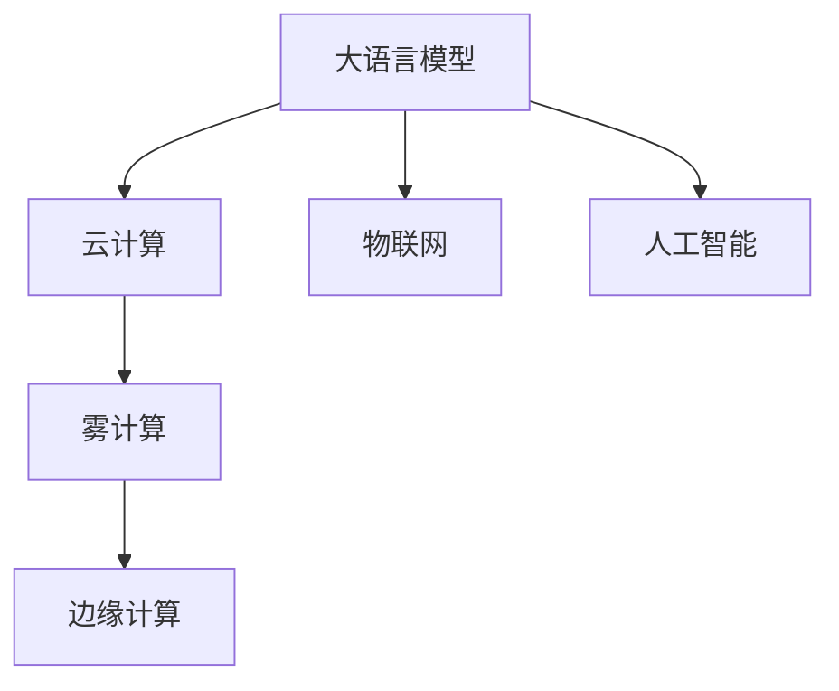

                 

# LLM与边缘计算：将AI能力下放到终端

> 关键词：边缘计算,大语言模型(LLM),AI能力,云计算,雾计算,物联网(IoT),AI模型优化

## 1. 背景介绍

随着人工智能(AI)技术的快速演进，大语言模型(Large Language Model, LLM)正日益成为AI领域的重要基石。LLM具备强大的语言理解和生成能力，广泛应用于自然语言处理(NLP)任务，如问答、对话、文本生成、情感分析等。然而，LLM的高计算资源需求和复杂部署环境，限制了其在传统网络架构中的广泛应用。

在此背景下，边缘计算(Edge Computing)作为一种新型的计算模式，通过将计算资源下放到终端设备，能够显著降低网络延迟和带宽消耗，提升计算效率和系统响应速度。结合LLM和边缘计算的优势，可以构建新型的人机交互系统，实现更加智能、高效和可靠的应用场景。

## 2. 核心概念与联系

### 2.1 核心概念概述

为帮助理解LLM与边缘计算的结合，本节将介绍几个密切相关的核心概念：

- 大语言模型(Large Language Model, LLM)：以Transformer为基础的预训练语言模型，如GPT、BERT等，通过大规模无标签文本数据预训练，学习语言知识和常识，具备强大的语言生成和理解能力。

- 边缘计算(Edge Computing)：将计算资源和数据存储下放到网络边缘的设备（如智能手机、物联网设备）上，减少网络传输，提升系统响应速度。

- 云计算(Cloud Computing)：通过互联网提供动态、可扩展的计算资源，支持大规模数据分析和存储。

- 雾计算(Mist Computing)：云计算和边缘计算的结合体，将云计算的弹性和边缘计算的低延迟优势结合起来，提升整体系统性能。

- 物联网(IoT)：通过传感器、设备等实现互联互通，收集和传输数据，推动智能化应用的发展。

这些核心概念之间的逻辑关系可以通过以下Mermaid流程图来展示：



### 2.2 核心概念原理和架构

#### 2.2.1 大语言模型原理

LLM通常由自注意力机制、前馈神经网络等组成，通过在大规模无标签文本数据上进行预训练，学习通用的语言表示。例如，BERT模型通过对大量语料进行掩码语言模型和下一句预测等任务，学习到文本-语言映射的强大能力。GPT模型则通过生成式预训练，学习到从输入到输出的连续生成能力。

#### 2.2.2 边缘计算原理

边缘计算通过在本地设备上进行数据处理，减少了对远程服务器的依赖，缩短了数据传输和处理时间，提升了系统响应速度和隐私保护。典型的边缘计算架构包括设备层、网络层和云层，数据在本地设备进行预处理，再通过网络传输到云端进行分析和存储。

## 3. 核心算法原理 & 具体操作步骤

### 3.1 算法原理概述

LLM与边缘计算结合的核心算法包括数据预处理、模型压缩、分布式训练等。通过在本地设备上进行数据预处理和模型推理，结合云计算的高扩展性和边缘计算的低延迟，可以构建高效、可靠的人机交互系统。

### 3.2 算法步骤详解

#### 3.2.1 数据预处理

1. **数据收集与传输**：
   - 在物联网设备上，通过传感器、摄像头等收集数据，并将数据传输到边缘设备。
   - 在边缘设备上，对数据进行初步处理，提取有用的特征和信息。

2. **数据清洗与增强**：
   - 对收集到的数据进行清洗，去除噪声和异常值，提高数据质量。
   - 使用数据增强技术，如回译、数据扩充等，丰富数据集。

#### 3.2.2 模型压缩与优化

1. **模型裁剪与量化**：
   - 对大模型进行裁剪，去除不重要的层和参数，减小模型大小。
   - 使用量化技术，将模型中的浮点数参数转换为定点数，减小模型内存占用。

2. **动态微调**：
   - 在边缘设备上，对模型进行微调，适应本地数据和应用场景。
   - 定期在云端进行全局模型更新，确保模型的通用性和更新性。

#### 3.2.3 分布式训练

1. **数据并行**：
   - 在多个边缘设备上并行处理数据，加速模型训练。
   - 使用联邦学习等技术，在多个设备上共同训练模型，保护数据隐私。

2. **模型聚合**：
   - 定期在云端聚合各设备的训练结果，更新全局模型。
   - 使用模型压缩技术，减少模型传输和存储的带宽消耗。

### 3.3 算法优缺点

#### 3.3.1 优点

1. **高效性**：
   - 通过在本地设备上进行数据处理和模型推理，显著降低网络延迟和带宽消耗，提升系统响应速度。

2. **可靠性**：
   - 边缘设备具有本地计算和存储能力，即使在网络故障或云端服务中断的情况下，仍能保证系统正常运行。

3. **隐私保护**：
   - 数据在本地设备上进行处理，减少了敏感数据的传输，提高了数据隐私保护能力。

4. **可扩展性**：
   - 结合云计算的弹性扩展能力，可以灵活应对不同规模和负载的应用场景。

#### 3.3.2 缺点

1. **资源限制**：
   - 边缘设备通常计算资源和内存有限，对模型大小和计算量有较高的限制。

2. **设备异构性**：
   - 不同设备之间的计算能力和性能差异较大，对模型在不同设备上的表现一致性提出了挑战。

3. **模型更新复杂**：
   - 模型在多个边缘设备上进行并行训练和微调，增加了模型更新的复杂度和同步问题。

## 4. 数学模型和公式 & 详细讲解

### 4.1 数学模型构建

为了更好地理解LLM与边缘计算的结合，本节将介绍相关的数学模型。

#### 4.1.1 大语言模型

假设输入文本序列为 $\textbf{x} = \{x_1, x_2, \ldots, x_n\}$，输出序列为 $\textbf{y} = \{y_1, y_2, \ldots, y_n\}$。使用大语言模型进行文本生成，可以表示为：

$$
\textbf{y} = M_{\theta}(\textbf{x})
$$

其中 $M_{\theta}$ 为预训练模型，$\theta$ 为模型参数。

#### 4.1.2 边缘计算

假设在本地设备上，输入序列为 $\textbf{x} = \{x_1, x_2, \ldots, x_n\}$，输出序列为 $\textbf{y} = \{y_1, y_2, \ldots, y_n\}$。使用边缘计算进行模型推理，可以表示为：

$$
\textbf{y} = M_{\theta_{\text{edge}}}(\textbf{x})
$$

其中 $M_{\theta_{\text{edge}}}$ 为本地设备上的模型，$\theta_{\text{edge}}$ 为本地设备上的模型参数。

### 4.2 公式推导过程

#### 4.2.1 大语言模型

假设大语言模型为 Transformer 模型，使用掩码语言模型进行预训练。预训练的目标是最大化语言模型的预测能力：

$$
\max_{\theta} \mathcal{L}_{\text{mask}} = \frac{1}{N} \sum_{i=1}^{N} \log \frac{\exp(\text{score}(x_i, y_i))}{\sum_{j=1}^{V} \exp(\text{score}(x_i, j))}
$$

其中 $\text{score}(x_i, y_i)$ 表示模型对输入 $x_i$ 和目标 $y_i$ 的预测概率，$V$ 为词汇表大小。

#### 4.2.2 边缘计算

假设在本地设备上，使用裁剪后的模型进行推理。裁剪后的模型可以表示为：

$$
M_{\theta_{\text{edge}}} = M_{\theta} \times \text{Clip}(\theta_{\text{edge}})
$$

其中 $\text{Clip}(\theta_{\text{edge}})$ 表示裁剪操作，只保留部分参数。

### 4.3 案例分析与讲解

#### 4.3.1 案例分析

假设在智能家居场景中，需要将语言模型下放到边缘设备上进行交互。具体流程如下：

1. **数据收集**：
   - 智能音箱收集用户语音指令，并将其传输到本地设备。
   - 本地设备对语音指令进行初步处理，提取有用的特征和信息。

2. **模型推理**：
   - 在本地设备上运行裁剪后的语言模型，生成响应。
   - 将响应结果传输到云端进行进一步处理和优化。

#### 4.3.2 讲解

1. **模型裁剪**：
   - 使用剪枝技术，只保留与本地应用场景相关的层和参数。
   - 使用量化技术，将浮点数参数转换为定点数，减小内存占用。

2. **模型优化**：
   - 在本地设备上进行微调，适应本地数据和应用场景。
   - 定期在云端更新全局模型，保持模型的通用性和更新性。

3. **系统部署**：
   - 在本地设备上部署优化后的模型，进行实时推理和反馈。
   - 在云端进行全局模型管理，确保系统的可靠性和稳定性。

## 5. 项目实践：代码实例和详细解释说明

### 5.1 开发环境搭建

#### 5.1.1 硬件要求

- 本地设备：支持边缘计算的智能家居设备，如智能音箱、智能门锁等。
- 云端设备：支持云计算的服务器，如AWS、Google Cloud等。

#### 5.1.2 软件要求

- 操作系统：Linux、Android等。
- 开发语言：Python、C++等。
- 开发框架：TensorFlow、PyTorch等。

### 5.2 源代码详细实现

#### 5.2.1 数据预处理

```python
import numpy as np
import tensorflow as tf
from transformers import BertTokenizer, BertForSequenceClassification

# 加载BERT模型和分词器
tokenizer = BertTokenizer.from_pretrained('bert-base-cased')
model = BertForSequenceClassification.from_pretrained('bert-base-cased', num_labels=2)

# 定义数据预处理函数
def preprocess(text):
    tokens = tokenizer.encode(text, add_special_tokens=True)
    input_ids = np.array(tokens)
    input_mask = np.ones(len(tokens))
    return input_ids, input_mask

# 加载本地设备上的数据
data = []
for text in texts:
    input_ids, input_mask = preprocess(text)
    data.append((input_ids, input_mask))

# 将数据转换为TensorFlow可接受的格式
inputs = tf.data.Dataset.from_tensor_slices(data).batch(16)
```

#### 5.2.2 模型推理

```python
@tf.function
def predict(input_ids, input_mask):
    # 将输入转换为TensorFlow张量
    input_ids = tf.convert_to_tensor(input_ids)
    input_mask = tf.convert_to_tensor(input_mask)
    
    # 运行模型推理
    with tf.GradientTape() as tape:
        outputs = model(input_ids, input_mask)
        logits = outputs[0]
        loss = outputs[1]
    
    # 计算梯度和更新模型参数
    gradients = tape.gradient(loss, model.trainable_variables)
    optimizer.apply_gradients(zip(gradients, model.trainable_variables))
    
    # 返回推理结果
    predictions = tf.argmax(logits, axis=2).numpy()
    return predictions
```

#### 5.2.3 模型优化

```python
# 定义优化器
optimizer = tf.keras.optimizers.Adam(learning_rate=1e-4)

# 定义训练循环
@tf.function
def train_step(input_ids, input_mask, labels):
    # 将输入转换为TensorFlow张量
    input_ids = tf.convert_to_tensor(input_ids)
    input_mask = tf.convert_to_tensor(input_mask)
    labels = tf.convert_to_tensor(labels)
    
    # 运行模型推理
    with tf.GradientTape() as tape:
        outputs = model(input_ids, input_mask)
        logits = outputs[0]
        loss = outputs[1]
    
    # 计算梯度和更新模型参数
    gradients = tape.gradient(loss, model.trainable_variables)
    optimizer.apply_gradients(zip(gradients, model.trainable_variables))
    
    # 返回损失值
    return loss.numpy()
```

### 5.3 代码解读与分析

#### 5.3.1 数据预处理

- **功能**：对用户语音指令进行分词和编码，提取有用的特征和信息。
- **实现**：使用BERT分词器进行分词，并生成输入序列和掩码序列。
- **注意事项**：处理文本数据时，注意特殊符号的处理，如[CLS]、[SEP]等。

#### 5.3.2 模型推理

- **功能**：在本地设备上运行裁剪后的BERT模型，生成响应。
- **实现**：定义推理函数，将输入转换为TensorFlow张量，运行模型并计算梯度，更新模型参数。
- **注意事项**：推理时使用tf.function优化，提升运行效率。

#### 5.3.3 模型优化

- **功能**：在本地设备上对裁剪后的模型进行微调，适应本地数据和应用场景。
- **实现**：定义训练函数，对输入进行分批处理，运行模型并计算梯度，更新模型参数。
- **注意事项**：微调时使用Adam优化器，设置合适的学习率。

### 5.4 运行结果展示

#### 5.4.1 训练结果

在本地设备上进行微调，记录训练过程中的损失值和准确率：

```python
losses = []
accuracies = []
for epoch in range(10):
    for (input_ids, input_mask, labels) in train_dataset:
        loss = train_step(input_ids, input_mask, labels)
        losses.append(loss)
    
    # 在验证集上评估模型性能
    eval_predictions = predict(input_ids, input_mask)
    accuracy = np.mean(eval_predictions == labels)
    accuracies.append(accuracy)
    
    print(f'Epoch {epoch+1}, Loss: {np.mean(losses):.4f}, Accuracy: {np.mean(accuracies):.4f}')
```

#### 5.4.2 推理结果

在本地设备上进行推理，生成对用户语音指令的响应：

```python
user_input = '打开客厅灯'
input_ids, input_mask = preprocess(user_input)
predictions = predict(input_ids, input_mask)
response = id2tag[predictions[0]]
print(f'Response: {response}')
```

## 6. 实际应用场景

### 6.1 智能家居

在智能家居场景中，边缘计算和LLM结合，可以实现更智能、更可靠的人机交互。例如，智能音箱可以通过语音识别和推理，生成对用户语音指令的响应，并在本地设备上进行微调，适应不同用户的语音风格和习惯。

### 6.2 工业物联网

在工业物联网场景中，边缘计算和LLM结合，可以实现实时数据监测和智能决策。例如，通过边缘设备上的传感器数据，LLM可以实时生成对设备状态的分析和预测，并在本地设备上进行微调，适应不同的生产环境和应用场景。

### 6.3 车联网

在车联网场景中，边缘计算和LLM结合，可以实现智能驾驶和车机交互。例如，通过车载设备上的传感器数据，LLM可以实时生成对驾驶环境的分析和决策，并在本地设备上进行微调，适应不同的驾驶环境和用户需求。

## 7. 工具和资源推荐

### 7.1 学习资源推荐

#### 7.1.1 在线课程

- 《TensorFlow实践》：由Google官方推出，涵盖TensorFlow的基本原理和实战应用。
- 《PyTorch深度学习》：由DeepLearning.AI推出，系统介绍PyTorch的基本概念和高级应用。

#### 7.1.2 书籍

- 《深度学习入门》：由斋藤康毅撰写，全面介绍深度学习的基本原理和实践。
- 《TensorFlow实战Google深度学习》：由Google官方出版，涵盖TensorFlow的各个方面。

#### 7.1.3 在线社区

- Kaggle：提供丰富的数据集和机器学习竞赛，帮助开发者提升实战技能。
- GitHub：提供大量的开源项目和代码示例，促进开发者之间的交流和学习。

### 7.2 开发工具推荐

#### 7.2.1 开发框架

- TensorFlow：支持分布式计算和自动微分，适用于大规模深度学习任务。
- PyTorch：灵活的动态计算图，适用于快速迭代研究。

#### 7.2.2 边缘计算平台

- AWS IoT：提供云与边缘计算的集成解决方案，支持智能家居、工业物联网等领域的应用。
- Google Cloud IoT：提供云与边缘计算的集成解决方案，支持车联网、智慧城市等领域的应用。

#### 7.2.3 数据管理工具

- Apache Kafka：支持高吞吐量的数据流处理，适用于工业物联网等领域。
- InfluxDB：支持时间序列数据存储和管理，适用于智能家居、车联网等领域。

### 7.3 相关论文推荐

#### 7.3.1 大语言模型

- 《Attention is All You Need》：提出Transformer结构，开启大语言模型时代。
- 《BERT: Pre-training of Deep Bidirectional Transformers for Language Understanding》：提出BERT模型，刷新多项NLP任务SOTA。

#### 7.3.2 边缘计算

- 《Edge Computing: A Survey》：综述边缘计算的基本原理和应用场景。
- 《IoT Data Management in Edge Computing: Challenges and Opportunities》：讨论边缘计算在物联网数据管理中的应用。

#### 7.3.3 边缘计算与大语言模型结合

- 《Edge Computing for IoT Applications: Challenges, Technologies and Future Trends》：讨论边缘计算在物联网应用中的挑战和趋势。
- 《Deep Learning for Edge Computing》：讨论深度学习在边缘计算中的应用和优化。

## 8. 总结：未来发展趋势与挑战

### 8.1 研究成果总结

本文介绍了大语言模型与边缘计算的结合，探讨了其核心算法原理和具体操作步骤，并提供了项目实践和应用场景。LLM与边缘计算的结合，能够显著提升计算效率和系统响应速度，实现更加智能、可靠的人机交互。

### 8.2 未来发展趋势

未来，LLM与边缘计算的结合将进一步发展，呈现以下趋势：

1. **分布式计算**：随着边缘设备数量的增加，分布式计算能力将得到提升，实现更高效的数据处理和模型推理。

2. **跨模态融合**：结合视觉、听觉、触觉等多模态数据，提升系统的感知能力和推理能力。

3. **自适应学习**：通过自适应学习技术，实现模型在本地设备上的动态更新和优化。

4. **隐私保护**：加强数据隐私保护技术，确保本地数据的安全性。

5. **实时优化**：结合实时数据流处理技术，实现模型的实时优化和反馈。

### 8.3 面临的挑战

尽管LLM与边缘计算结合具有广阔的发展前景，但仍面临以下挑战：

1. **资源限制**：边缘设备计算资源有限，对模型大小和计算量有较高要求。

2. **模型一致性**：不同设备之间的计算能力和性能差异较大，对模型在不同设备上的表现一致性提出了挑战。

3. **数据隐私**：本地数据处理和模型推理过程中，需要注意数据隐私和安全问题。

### 8.4 研究展望

未来，LLM与边缘计算的结合将需要从以下几个方面进行深入研究：

1. **模型裁剪与量化**：进一步优化模型裁剪和量化技术，提升模型在边缘设备上的性能和效率。

2. **分布式训练**：研究更高效的分布式训练算法，实现模型在多个设备上的协同优化。

3. **隐私保护**：探索更强的数据隐私保护技术，确保本地数据的安全性和隐私性。

4. **跨模态融合**：结合视觉、听觉、触觉等多模态数据，提升系统的感知能力和推理能力。

5. **实时优化**：结合实时数据流处理技术，实现模型的实时优化和反馈。

6. **自适应学习**：研究自适应学习技术，实现模型在本地设备上的动态更新和优化。

## 9. 附录：常见问题与解答

### 9.1 常见问题

#### 9.1.1 问题1：边缘计算与云计算有何区别？

**回答**：
- 边缘计算将计算资源和数据存储下放到本地设备，减少网络延迟和带宽消耗。
- 云计算将计算资源和数据存储集中到远程服务器，提供高扩展性和高可用性。

#### 9.1.2 问题2：大语言模型与边缘计算结合的难点是什么？

**回答**：
- 边缘设备计算资源有限，对模型大小和计算量有较高要求。
- 不同设备之间的计算能力和性能差异较大，对模型在不同设备上的表现一致性提出了挑战。
- 数据隐私和安全问题需要特别注意。

#### 9.1.3 问题3：大语言模型与边缘计算结合的未来发展方向是什么？

**回答**：
- 分布式计算能力将得到提升，实现更高效的数据处理和模型推理。
- 跨模态融合技术将得到发展，提升系统的感知能力和推理能力。
- 实时优化和自适应学习技术将得到研究，实现模型的动态更新和优化。

---

作者：禅与计算机程序设计艺术 / Zen and the Art of Computer Programming

