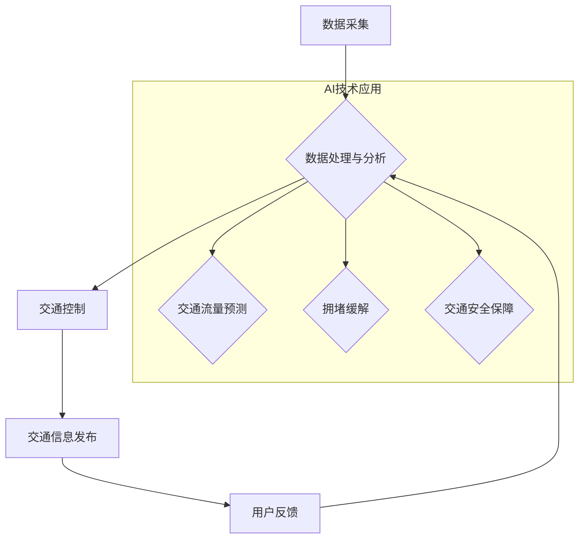

> 人工智能，城市交通，交通管理，基础设施建设，可持续发展，机器学习，深度学习，预测模型，优化算法，数据分析

## 1. 背景介绍

随着全球人口的持续增长和城市化的加速推进，城市交通拥堵、环境污染、基础设施压力等问题日益突出。传统交通管理模式已难以满足现代城市发展的需求，迫切需要引入先进的智能技术进行革新。人工智能（AI）作为一门新兴的科技领域，凭借其强大的数据处理、学习和决策能力，为解决城市交通问题提供了新的思路和解决方案。

城市交通管理系统是城市基础设施的重要组成部分，其高效运行直接关系到城市经济发展、社会稳定和人民生活质量。传统的交通管理系统主要依赖于人工干预和规则设定，存在效率低、反应慢、难以应对突发事件等问题。而AI技术可以帮助构建智能化、高效化、可持续发展的城市交通管理系统，实现交通流量优化、拥堵缓解、安全保障、环境保护等目标。

## 2. 核心概念与联系

**2.1 城市交通管理系统架构**

城市交通管理系统是一个复杂的网络系统，涉及多个子系统和数据源，包括：

* **交通数据采集系统：** 利用传感器、摄像头、GPS等设备采集交通流量、路况、交通信号灯状态等实时数据。
* **数据处理与分析系统：** 对采集到的数据进行清洗、预处理、分析和挖掘，提取有价值的信息。
* **交通控制系统：** 根据分析结果，对交通信号灯、交通流控制等进行智能调节，优化交通流量。
* **交通信息发布系统：** 向驾驶员、乘客等提供实时交通信息，帮助他们做出合理的出行决策。

**2.2 AI技术在城市交通管理中的应用**

AI技术在城市交通管理系统中扮演着关键角色，主要应用于以下几个方面：

* **交通流量预测：** 利用机器学习算法对历史交通数据进行分析，预测未来交通流量变化趋势，为交通控制提供决策依据。
* **拥堵缓解：** 通过智能信号灯控制、动态路线规划等方式，优化交通流量分配，缓解交通拥堵。
* **交通安全保障：** 利用计算机视觉技术识别违章驾驶行为、事故发生情况，提高交通安全水平。
* **智能驾驶辅助：** 为自动驾驶汽车提供感知、决策和控制支持，提高驾驶安全性。

**2.3 AI与人类计算的协同**

AI技术可以辅助人类进行交通管理决策，但不能完全替代人类的智慧和经验。AI与人类计算的协同，才能更好地解决城市交通问题。

**2.4  核心概念原理与架构**



## 3. 核心算法原理 & 具体操作步骤

### 3.1  算法原理概述

交通流量预测是城市交通管理系统的重要功能之一，其目的是利用历史交通数据预测未来交通流量变化趋势。常用的交通流量预测算法包括：

* **时间序列模型：** 这种模型假设交通流量具有时间依赖性，利用历史数据预测未来流量。常见的算法包括ARIMA、SARIMA等。
* **机器学习模型：** 这种模型利用机器学习算法从历史数据中学习交通流量的规律，并预测未来流量。常见的算法包括线性回归、支持向量机、决策树、随机森林、神经网络等。

### 3.2  算法步骤详解

以时间序列模型为例，其具体操作步骤如下：

1. **数据收集：** 收集历史交通流量数据，包括时间、地点、流量等信息。
2. **数据预处理：** 对数据进行清洗、缺失值处理、特征工程等操作，使其适合模型训练。
3. **模型选择：** 根据数据特点和预测需求，选择合适的模型，例如ARIMA模型。
4. **模型训练：** 利用历史数据训练模型，学习交通流量的规律。
5. **模型评估：** 利用测试数据评估模型的预测精度，并进行模型调参。
6. **模型部署：** 将训练好的模型部署到生产环境中，用于实时预测交通流量。

### 3.3  算法优缺点

**时间序列模型：**

* **优点：** 算法简单易懂，易于实现，对数据要求不高。
* **缺点：** 难以捕捉复杂的时间依赖关系，预测精度有限。

**机器学习模型：**

* **优点：** 能够捕捉复杂的时间依赖关系，预测精度较高。
* **缺点：** 算法复杂，对数据要求较高，需要大量的训练数据。

### 3.4  算法应用领域

交通流量预测算法广泛应用于以下领域：

* **交通管理：** 预测交通流量变化趋势，优化交通信号灯控制、动态路线规划等。
* **城市规划：** 预测未来交通需求，为城市规划提供决策依据。
* **物流运输：** 预测货物运输时间，优化物流路线。
* **出行服务：** 为用户提供实时交通信息，帮助用户做出合理的出行决策。

## 4. 数学模型和公式 & 详细讲解 & 举例说明

### 4.1  数学模型构建

交通流量预测模型通常采用时间序列模型或机器学习模型。

**4.1.1 时间序列模型**

ARIMA模型是一种常用的时间序列模型，其核心思想是利用历史数据中的自相关性和偏自相关性来预测未来值。

**4.1.2 机器学习模型**

机器学习模型通常采用回归模型或分类模型。回归模型用于预测连续变量，例如交通流量；分类模型用于预测离散变量，例如交通拥堵程度。

### 4.2  公式推导过程

**4.2.1 ARIMA模型**

ARIMA模型的公式推导过程较为复杂，涉及差分方程、自回归系数、滑动平均系数等概念。

**4.2.2 机器学习模型**

机器学习模型的公式推导过程取决于具体的算法，例如线性回归模型的公式为：

$$y = \beta_0 + \beta_1x_1 + \beta_2x_2 + ... + \beta_nx_n + \epsilon$$

其中：

* $y$ 是预测值
* $\beta_0, \beta_1, ..., \beta_n$ 是模型参数
* $x_1, x_2, ..., x_n$ 是输入特征
* $\epsilon$ 是误差项

### 4.3  案例分析与讲解

**4.3.1 ARIMA模型案例**

利用ARIMA模型预测某城市某路段的交通流量，可以根据历史数据训练模型，并预测未来一天的交通流量变化趋势。

**4.3.2 机器学习模型案例**

利用机器学习模型预测交通拥堵程度，可以根据历史交通数据、天气信息、节日信息等特征训练模型，并预测未来某个时间段的交通拥堵程度。

## 5. 项目实践：代码实例和详细解释说明

### 5.1  开发环境搭建

* 操作系统：Windows/Linux/macOS
* Python版本：3.6+
* 必要的库：pandas, numpy, scikit-learn, matplotlib, seaborn

### 5.2  源代码详细实现

```python
import pandas as pd
from sklearn.model_selection import train_test_split
from sklearn.linear_model import LinearRegression
from sklearn.metrics import mean_squared_error

# 加载交通流量数据
data = pd.read_csv('traffic_data.csv')

# 选择特征和目标变量
features = ['hour', 'weekday', 'temperature']
target = 'traffic_volume'

# 将数据分为训练集和测试集
X_train, X_test, y_train, y_test = train_test_split(data[features], data[target], test_size=0.2, random_state=42)

# 创建线性回归模型
model = LinearRegression()

# 训练模型
model.fit(X_train, y_train)

# 预测测试集数据
y_pred = model.predict(X_test)

# 计算模型精度
mse = mean_squared_error(y_test, y_pred)
print(f'Mean Squared Error: {mse}')

# 可视化预测结果
import matplotlib.pyplot as plt
plt.scatter(y_test, y_pred)
plt.xlabel('Actual Traffic Volume')
plt.ylabel('Predicted Traffic Volume')
plt.title('Linear Regression Model Performance')
plt.show()
```

### 5.3  代码解读与分析

* 代码首先加载交通流量数据，并选择特征和目标变量。
* 然后将数据分为训练集和测试集，用于训练和评估模型。
* 创建线性回归模型，并使用训练集数据训练模型。
* 使用训练好的模型预测测试集数据，并计算模型精度。
* 最后使用 matplotlib 库可视化预测结果。

### 5.4  运行结果展示

运行代码后，会输出模型的均方误差值，以及预测结果与实际值的散点图。

## 6. 实际应用场景

### 6.1  智能交通信号灯控制

利用AI技术对交通流量进行预测，可以根据实时交通状况动态调整交通信号灯的绿灯时间，优化交通流量分配，缓解交通拥堵。

### 6.2  动态路线规划

利用AI技术预测交通流量变化趋势，可以为驾驶员提供最优的路线规划，避免拥堵路段，节省出行时间。

### 6.3  交通安全保障

利用计算机视觉技术，可以识别违章驾驶行为、事故发生情况，提高交通安全水平。

### 6.4  未来应用展望

随着AI技术的不断发展，其在城市交通管理领域的应用将更加广泛和深入，例如：

* **智能驾驶辅助：** 为自动驾驶汽车提供感知、决策和控制支持，提高驾驶安全性。
* **城市微循环交通管理：** 利用AI技术优化城市微循环交通，例如共享单车、共享汽车等。
* **绿色出行推广：** 利用AI技术引导用户选择绿色出行方式，例如步行、骑自行车等。

## 7. 工具和资源推荐

### 7.1  学习资源推荐

* **在线课程：** Coursera, edX, Udacity 等平台提供人工智能、机器学习等相关课程。
* **书籍：** 《深度学习》、《机器学习实战》等书籍可以帮助读者深入了解AI技术。
* **开源项目：** TensorFlow, PyTorch 等开源项目可以帮助读者实践AI技术。

### 7.2  开发工具推荐

* **Python：** 作为人工智能领域最常用的编程语言，Python拥有丰富的库和工具，例如pandas, numpy, scikit-learn等。
* **Jupyter Notebook：** 用于编写和运行Python代码的交互式笔记本环境，方便进行数据分析和模型开发。
* **TensorFlow/PyTorch：** 用于深度学习模型开发的开源框架。

### 7.3  相关论文推荐

* **交通流量预测：**
    * "A Deep Learning Approach for Traffic Flow Prediction"
    * "Traffic Flow Prediction Using Recurrent Neural Networks"
* **智能交通信号灯控制：**
    * "Adaptive Traffic Signal Control Using Machine Learning"
    * "Deep Reinforcement Learning for Adaptive Traffic Signal Control"

## 8. 总结：未来发展趋势与挑战

### 8.1  研究成果总结

AI技术在城市交通管理领域取得了显著成果，例如交通流量预测、智能信号灯控制、动态路线规划等。这些成果有效缓解了交通拥堵，提高了交通安全水平，促进了城市可持续发展。

### 8.2  未来发展趋势

* **更精准的预测模型：** 利用更先进的机器学习算法和更丰富的交通数据，构建更精准的交通流量预测模型。
* **更智能的交通管理系统：