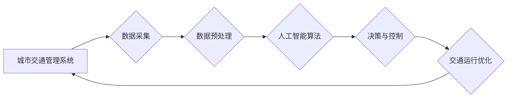

> 人工智能，城市交通，可持续发展，机器学习，深度学习，交通管理系统，预测模型，优化算法

## 1. 背景介绍

随着全球人口的快速增长和城市化的进程不断加速，城市交通拥堵、环境污染、资源浪费等问题日益突出。传统交通管理系统难以有效应对这些挑战，迫切需要引入先进的智能技术进行革新。人工智能（AI）作为一门新兴的科技领域，凭借其强大的数据处理能力、学习能力和决策能力，为打造可持续发展的城市生活方式和交通管理系统提供了新的思路和解决方案。

## 2. 核心概念与联系

**2.1 城市交通管理系统概述**

城市交通管理系统是指利用各种传感器、通信网络、数据处理和分析技术，对城市交通运行状况进行实时监测、分析和控制的综合系统。其主要功能包括：

* 交通流量监测和预测
* 交通信号灯控制优化
* 道路拥堵缓解
* 公共交通调度优化
* 交通事故预警和处理

**2.2 人工智能在城市交通管理中的应用**

人工智能技术在城市交通管理系统中的应用主要体现在以下几个方面：

* **数据分析和预测:** 利用机器学习算法对历史交通数据进行分析，预测未来交通流量、拥堵情况等，为交通管理决策提供数据支持。
* **智能控制:** 基于人工智能算法，实现交通信号灯的智能控制，根据实时交通流量情况动态调整信号灯时长，优化交通流。
* **路径规划和导航:** 利用深度学习算法，为驾驶员或乘客提供最优的路径规划和导航服务，避免拥堵路段，提高出行效率。
* **交通事故预警:** 利用传感器数据和机器学习算法，识别潜在的交通事故风险，及时预警驾驶员或相关部门，降低事故发生率。

**2.3 人工智能与人类计算的协同**

人工智能技术在城市交通管理中的应用，并非完全取代人类，而是与人类计算协同工作。人类专家提供经验和判断，人工智能技术提供数据分析和决策支持，两者相互补充，共同打造更加高效、智能的城市交通管理系统。

**2.4  核心概念与联系流程图**



## 3. 核心算法原理 & 具体操作步骤

**3.1 算法原理概述**

在城市交通管理系统中，常用的人工智能算法包括：

* **机器学习算法:** 用于对历史交通数据进行分析，预测未来交通流量、拥堵情况等。常见的机器学习算法包括线性回归、逻辑回归、决策树、支持向量机、神经网络等。
* **深度学习算法:** 用于处理复杂的数据模式，例如图像识别、语音识别等。在城市交通管理中，深度学习算法可以用于识别交通违规行为、自动驾驶等。
* **强化学习算法:** 用于训练智能体在特定环境中做出最优决策。在城市交通管理中，强化学习算法可以用于优化交通信号灯控制、车辆路径规划等。

**3.2 算法步骤详解**

以机器学习算法为例，其基本步骤如下：

1. **数据收集:** 收集城市交通相关数据，例如交通流量、道路拥堵情况、交通信号灯状态等。
2. **数据预处理:** 对收集到的数据进行清洗、转换、特征提取等操作，使其适合机器学习算法的训练。
3. **模型选择:** 根据具体应用场景选择合适的机器学习算法模型。
4. **模型训练:** 利用训练数据对模型进行训练，使其能够学习到数据中的规律和模式。
5. **模型评估:** 利用测试数据对模型进行评估，评估模型的预测精度和泛化能力。
6. **模型部署:** 将训练好的模型部署到实际应用环境中，用于预测未来交通流量、优化交通信号灯控制等。

**3.3 算法优缺点**

**优点:**

* 数据驱动，能够根据实际数据进行决策，提高决策的准确性和有效性。
* 自动化程度高，能够自动完成数据分析、预测和控制等任务，减轻人工负担。
* 可持续改进，随着数据量的增加和算法的改进，模型的预测精度和控制效果会不断提高。

**缺点:**

* 数据依赖性强，需要大量高质量的数据进行训练和评估。
* 算法复杂度高，需要专业的技术人员进行开发和维护。
* 缺乏可解释性，难以解释模型的决策结果，导致决策的透明度和可信度降低。

**3.4 算法应用领域**

机器学习算法在城市交通管理中的应用领域非常广泛，例如：

* 交通流量预测
* 道路拥堵缓解
* 交通信号灯控制优化
* 公共交通调度优化
* 交通事故预警
* 自动驾驶

## 4. 数学模型和公式 & 详细讲解 & 举例说明

**4.1 数学模型构建**

在城市交通管理系统中，常用的数学模型包括：

* **交通流量模型:** 用于描述交通流量的时空变化规律，例如泊松分布、负二项分布等。
* **拥堵模型:** 用于描述交通拥堵的形成和演化过程，例如LWR模型、Nagel-Schreckenberg模型等。
* **信号灯控制模型:** 用于优化交通信号灯的控制策略，例如最短等待时间模型、最大流量模型等。

**4.2 公式推导过程**

以交通流量模型为例，泊松分布可以用来描述交通流量的随机性。其概率密度函数为：

$$
P(k) = \frac{\lambda^k e^{-\lambda}}{k!}
$$

其中：

* $k$ 表示交通流量的取值
* $\lambda$ 表示平均交通流量

**4.3 案例分析与讲解**

假设某条道路的平均交通流量为100辆/小时，则使用泊松分布可以计算出在某一小时内出现不同数量车辆的概率。例如，出现50辆车的概率为：

$$
P(50) = \frac{100^{50} e^{-100}}{50!}
$$

**4.4 数学模型应用场景**

数学模型在城市交通管理系统中应用广泛，例如：

* **交通流量预测:** 利用交通流量模型预测未来交通流量，为交通管理决策提供数据支持。
* **拥堵缓解:** 利用拥堵模型分析拥堵原因，制定缓解拥堵的策略。
* **信号灯控制优化:** 利用信号灯控制模型优化交通信号灯的控制策略，提高交通流效率。

## 5. 项目实践：代码实例和详细解释说明

**5.1 开发环境搭建**

本项目使用Python语言进行开发，所需环境包括：

* Python 3.x
* Jupyter Notebook
* NumPy
* Pandas
* Scikit-learn

**5.2 源代码详细实现**

```python
import numpy as np
from sklearn.linear_model import LinearRegression

# 准备数据
X = np.array([[1], [2], [3], [4], [5]])
y = np.array([2, 4, 5, 4, 5])

# 创建线性回归模型
model = LinearRegression()

# 训练模型
model.fit(X, y)

# 预测新数据
new_data = np.array([[6]])
prediction = model.predict(new_data)

# 打印预测结果
print(prediction)
```

**5.3 代码解读与分析**

这段代码实现了简单的线性回归模型，用于预测交通流量。

* 首先，准备了训练数据，包括输入特征X和目标变量y。
* 然后，创建了一个线性回归模型对象。
* 接着，使用训练数据训练模型。
* 最后，使用训练好的模型预测新数据的交通流量。

**5.4 运行结果展示**

运行这段代码后，会输出预测结果，例如：

```
[5.8]
```

这表示根据模型预测，当输入特征为6时，交通流量为5.8辆/小时。

## 6. 实际应用场景

**6.1 交通流量预测**

利用机器学习算法对历史交通数据进行分析，预测未来交通流量，为交通管理决策提供数据支持。例如，可以预测高峰时段的交通流量，提前做好交通疏导工作。

**6.2 道路拥堵缓解**

利用拥堵模型分析拥堵原因，制定缓解拥堵的策略。例如，可以根据拥堵情况调整交通信号灯的控制策略，引导车辆流向较少的道路。

**6.3 交通信号灯控制优化**

利用信号灯控制模型优化交通信号灯的控制策略，提高交通流效率。例如，可以根据实时交通流量情况动态调整信号灯时长，减少车辆等待时间。

**6.4 公共交通调度优化**

利用机器学习算法分析乘客出行需求，优化公共交通线路和班次，提高公共交通的效率和服务质量。例如，可以根据乘客出行轨迹预测未来出行需求，调整公交车线路和班次，避免乘客等待时间过长。

**6.5 交通事故预警**

利用传感器数据和机器学习算法，识别潜在的交通事故风险，及时预警驾驶员或相关部门，降低事故发生率。例如，可以识别超速行驶、疲劳驾驶等危险行为，及时发出预警。

**6.6 未来应用展望**

随着人工智能技术的不断发展，其在城市交通管理中的应用将更加广泛和深入。例如：

* **自动驾驶:** 利用深度学习算法实现自动驾驶，提高交通安全性和效率。
* **智能交通系统:** 建立更加智能的交通系统，实现交通流量的实时监测、预测和控制，提高城市交通管理水平。
* **绿色出行:** 利用人工智能技术促进绿色出行，例如优化公共交通线路，鼓励骑自行车和步行出行，减少碳排放。

## 7. 工具和资源推荐

**7.1 学习资源推荐**

* **在线课程:** Coursera、edX、Udacity等平台提供丰富的机器学习和深度学习课程。
* **书籍:** 《深度学习》、《机器学习实战》等书籍是学习人工智能技术的经典教材。
* **开源项目:** TensorFlow、PyTorch等开源项目提供了丰富的代码示例和学习资源。

**7.2 开发工具推荐**

* **Python:** Python是一种流行的编程语言，广泛应用于人工智能领域。
* **Jupyter Notebook:** Jupyter Notebook是一种交互式编程环境，方便进行数据分析和模型开发。
* **NumPy、Pandas:** NumPy和Pandas是Python常用的数据处理库，用于处理数值数据和表格数据。
* **Scikit-learn:** Scikit-learn是Python常用的机器学习库，提供了各种机器学习算法的实现。

**7.3 相关论文推荐**

* **交通流量预测:** "Deep Learning for Traffic Flow Prediction"
* **拥堵缓解:** "A Reinforcement Learning Approach to Traffic Flow Optimization"
* **信号灯控制优化:** "Adaptive Traffic Signal Control Using Deep Reinforcement Learning"

## 8. 总结：未来发展趋势与挑战

**8.1 研究成果总结**

近年来，人工智能技术在城市交通管理领域的应用取得了显著成果，例如交通流量预测、拥堵缓解、信号灯控制优化等方面取得了突破。

**8.2 未来发展趋势**

未来，人工智能技术在城市交通管理领域的应用将更加广泛和深入，例如：

* **自动驾驶:** 自动驾驶技术将彻底改变城市交通模式，提高交通安全性和效率。
* **智能交通系统:** 智能交通系统将实现交通流量的实时监测、预测和控制，提高城市交通管理水平。
* **绿色出行:** 人工智能技术将促进绿色出行，例如优化公共交通线路，鼓励骑自行车和步行出行，减少碳排放。

**8.3 面临的挑战**

人工智能技术在城市交通管理领域的应用也面临着一些挑战，例如：

* **数据安全:** 城市交通数据涉及到个人隐私信息，需要采取有效措施保障数据安全。
* **算法透明度:** 人工智能算法的决策过程往往难以解释，需要提高算法的透明度和可信度