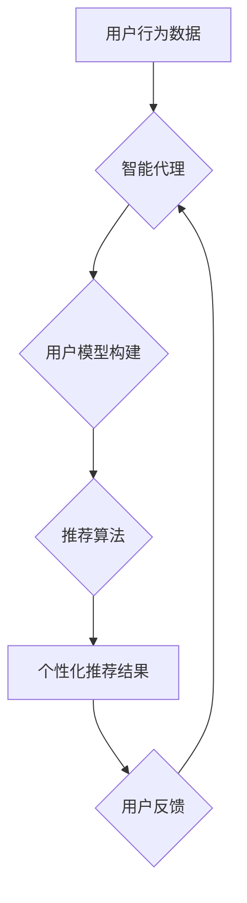

> AI人工智能, Agent, 个性化推荐, 算法原理, 数学模型, 项目实践, 应用场景, 未来发展

## 1. 背景介绍

在信息爆炸的时代，海量数据和信息涌现，用户面临着选择困难和信息过载的挑战。个性化推荐作为一种有效的解决方案，旨在根据用户的兴趣、偏好和行为，提供精准、定制化的服务和内容，提升用户体验和满意度。

AI人工智能技术，特别是智能代理技术，为个性化推荐提供了强大的支持。智能代理是一种能够自主学习、决策和执行任务的软件实体，它可以模拟人类的行为模式，理解用户的需求，并提供个性化的服务。

## 2. 核心概念与联系

**2.1 智能代理 (Agent)**

智能代理是一种能够感知环境、做出决策并执行行动的软件实体。它具有以下特征：

* **自主性:** 智能代理能够自主学习和决策，无需人工干预。
* **目标导向性:** 智能代理具有明确的目标，并努力实现这些目标。
* **交互性:** 智能代理能够与环境和用户进行交互，获取信息和反馈。
* **学习能力:** 智能代理能够从经验中学习，不断改进其决策和行为。

**2.2 个性化推荐 (Personalized Recommendation)**

个性化推荐是指根据用户的个人特征、行为模式和偏好，推荐个性化的产品、服务或内容。其目标是提高用户满意度、促进用户参与度和转化率。

**2.3 核心概念联系**

智能代理可以作为个性化推荐系统的核心引擎，通过学习用户的行为模式和偏好，并根据这些信息推荐个性化的内容。

**2.4  Mermaid 流程图**



## 3. 核心算法原理 & 具体操作步骤

**3.1 算法原理概述**

个性化推荐算法的核心是构建用户模型，并根据用户模型预测用户对特定内容的兴趣。常用的算法包括：

* **基于内容的推荐算法:** 根据物品的特征和用户历史行为，推荐与用户兴趣相似的物品。
* **基于协同过滤的推荐算法:** 根据其他用户对相同物品的评分或行为，预测用户对特定物品的兴趣。
* **基于深度学习的推荐算法:** 利用深度神经网络学习用户和物品的复杂关系，进行更精准的推荐。

**3.2 算法步骤详解**

以基于协同过滤的推荐算法为例，其步骤如下：

1. **数据收集:** 收集用户对物品的评分或行为数据。
2. **用户-物品矩阵构建:** 将用户和物品映射到矩阵中，每个元素表示用户对物品的评分或行为。
3. **相似用户/物品发现:** 利用相似度计算方法，找到与目标用户相似的用户或与目标物品相似的物品。
4. **推荐生成:** 根据相似用户或物品的评分或行为，预测目标用户对目标物品的兴趣，并生成推荐列表。

**3.3 算法优缺点**

* **优点:** 能够推荐用户可能感兴趣但未接触过的物品，提升推荐的惊喜感。
* **缺点:** 容易陷入数据稀疏问题，当用户评分或行为数据不足时，难以准确预测用户兴趣。

**3.4 算法应用领域**

个性化推荐算法广泛应用于电商、视频平台、音乐平台、社交媒体等领域，例如：

* **电商平台:** 推荐商品、优惠券、促销活动等。
* **视频平台:** 推荐视频、电视剧、电影等。
* **音乐平台:** 推荐歌曲、专辑、音乐人等。
* **社交媒体:** 推荐好友、群组、话题等。

## 4. 数学模型和公式 & 详细讲解 & 举例说明

**4.1 数学模型构建**

基于协同过滤的推荐算法可以构建如下数学模型：

* **用户相似度:** 使用余弦相似度计算用户之间的相似度。

$$
\text{相似度}(u_i, u_j) = \frac{\mathbf{u}_i \cdot \mathbf{u}_j}{\|\mathbf{u}_i\| \|\mathbf{u}_j\|}
$$

其中，$\mathbf{u}_i$ 和 $\mathbf{u}_j$ 分别表示用户 $u_i$ 和 $u_j$ 的评分向量。

* **物品相似度:** 使用余弦相似度计算物品之间的相似度。

$$
\text{相似度}(i, j) = \frac{\mathbf{i} \cdot \mathbf{j}}{\|\mathbf{i}\| \|\mathbf{j}\|}
$$

其中，$\mathbf{i}$ 和 $\mathbf{j}$ 分别表示物品 $i$ 和 $j$ 的评分向量。

**4.2 公式推导过程**

用户相似度和物品相似度可以用于预测用户对特定物品的兴趣。

* **基于用户相似度的推荐:**

$$
\text{推荐评分}(u_i, i) = \frac{\sum_{u_j \in \text{相似用户}(u_i)} \text{相似度}(u_i, u_j) \cdot \text{评分}(u_j, i)}{\sum_{u_j \in \text{相似用户}(u_i)} \text{相似度}(u_i, u_j)}
$$

* **基于物品相似度的推荐:**

$$
\text{推荐评分}(u_i, i) = \frac{\sum_{j \in \text{相似物品}(i)} \text{相似度}(i, j) \cdot \text{评分}(u_i, j)}{\sum_{j \in \text{相似物品}(i)} \text{相似度}(i, j)}
$$

**4.3 案例分析与讲解**

假设用户 $u_1$ 和 $u_2$ 对电影 $m_1$ 和 $m_2$ 的评分分别为 5 和 4，以及 3 和 5。

* 计算用户 $u_1$ 和 $u_2$ 的相似度：

$$
\text{相似度}(u_1, u_2) = \frac{(5, 3) \cdot (4, 5)}{\sqrt{5^2 + 3^2} \sqrt{4^2 + 5^2}} = \frac{20 + 15}{\sqrt{34} \sqrt{41}}
$$

* 假设电影 $m_3$ 和 $m_1$ 的相似度为 0.8，则可以预测用户 $u_1$ 对电影 $m_3$ 的评分：

$$
\text{推荐评分}(u_1, m_3) = \frac{0.8 \cdot 5}{0.8} = 5
$$

## 5. 项目实践：代码实例和详细解释说明

**5.1 开发环境搭建**

* 操作系统: Ubuntu 20.04
* Python 版本: 3.8
* 必要的库: pandas, numpy, scikit-learn

**5.2 源代码详细实现**

```python
import pandas as pd
from sklearn.metrics.pairwise import cosine_similarity

# 加载用户评分数据
ratings_data = pd.read_csv('ratings.csv')

# 构建用户-物品矩阵
user_item_matrix = ratings_data.pivot_table(index='userId', columns='movieId', values='rating')

# 计算用户相似度
user_similarity = cosine_similarity(user_item_matrix)

# 计算物品相似度
item_similarity = cosine_similarity(user_item_matrix.T)

# 基于用户相似度的推荐
def recommend_based_on_user_similarity(user_id, top_n=5):
    similar_users = user_similarity[user_id].argsort()[:-top_n-1:-1]
    user_ratings = user_item_matrix.loc[user_id]
    recommended_movies = []
    for similar_user in similar_users:
        for movie_id in user_item_matrix.columns:
            if user_item_matrix.loc[similar_user, movie_id] > 0 and user_ratings.loc[movie_id] == 0:
                recommended_movies.append(movie_id)
    return recommended_movies

# 基于物品相似度的推荐
def recommend_based_on_item_similarity(user_id, top_n=5):
    user_ratings = user_item_matrix.loc[user_id]
    rated_movies = user_ratings[user_ratings > 0].index
    item_similarity_scores = item_similarity[rated_movies].mean(axis=0)
    recommended_movies = item_similarity_scores.argsort()[:-top_n-1:-1]
    return recommended_movies

# 获取用户 ID
user_id = 1

# 基于用户相似度的推荐结果
recommendations_user_similarity = recommend_based_on_user_similarity(user_id)
print(f"基于用户相似度的推荐结果: {recommendations_user_similarity}")

# 基于物品相似度的推荐结果
recommendations_item_similarity = recommend_based_on_item_similarity(user_id)
print(f"基于物品相似度的推荐结果: {recommendations_item_similarity}")
```

**5.3 代码解读与分析**

* 代码首先加载用户评分数据，并构建用户-物品矩阵。
* 然后计算用户相似度和物品相似度。
* 基于用户相似度和物品相似度，分别实现两种推荐算法。
* 最后，根据用户 ID 获取推荐结果。

**5.4 运行结果展示**

运行代码后，将输出基于用户相似度和物品相似度的推荐结果。

## 6. 实际应用场景

**6.1 电商平台**

* 推荐商品: 根据用户的购买历史、浏览记录和评分，推荐与用户兴趣相似的商品。
* 推荐优惠券: 根据用户的消费习惯和偏好，推荐个性化的优惠券。
* 推荐促销活动: 根据用户的兴趣和需求，推荐相关的促销活动。

**6.2 视频平台**

* 推荐视频: 根据用户的观看历史、点赞记录和评论，推荐与用户兴趣相似的视频。
* 推荐电视剧: 根据用户的观看历史和偏好，推荐与用户口味相符的电视剧。
* 推荐电影: 根据用户的观看历史和评分，推荐与用户喜好相似的电影。

**6.3 音乐平台**

* 推荐歌曲: 根据用户的播放历史、收藏记录和点赞，推荐与用户口味相似的歌曲。
* 推荐专辑: 根据用户的播放历史和偏好，推荐与用户喜欢的音乐风格相符的专辑。
* 推荐音乐人: 根据用户的播放历史和收藏，推荐与用户喜欢的音乐人风格相似的音乐人。

**6.4 未来应用展望**

* **更精准的推荐:** 利用深度学习等先进算法，更精准地预测用户的兴趣和需求。
* **个性化内容生成:** 基于用户的兴趣和偏好，生成个性化的内容，例如新闻、文章、视频等。
* **跨平台推荐:** 将用户数据整合到多个平台，提供更全面的个性化推荐服务。

## 7. 工具和资源推荐

**7.1 学习资源推荐**

* **书籍:**
    * 《推荐系统实践》
    * 《机器学习》
* **在线课程:**
    * Coursera: Recommender Systems
    * edX: Machine Learning

**7.2 开发工具推荐**

* **Python:** 广泛应用于推荐系统开发，拥有丰富的库和工具。
* **Spark:** 用于大规模数据处理，可以处理海量用户数据。
* **TensorFlow/PyTorch:** 深度学习框架，用于构建更精准的推荐模型。

**7.3 相关论文推荐**

* **Collaborative Filtering for Implicit Feedback Datasets**
* **Deep Learning for Recommender Systems**

## 8. 总结：未来发展趋势与挑战

**8.1 研究成果总结**

近年来，个性化推荐技术取得了显著进展，算法模型不断优化，推荐效果不断提升。

**8.