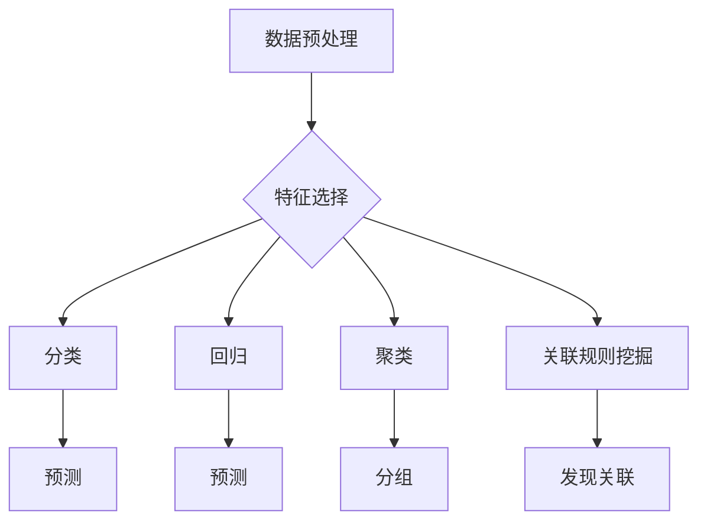

> 数据挖掘,机器学习,算法原理,代码实例,数据分析,预测建模,Python

## 1. 背景介绍

数据挖掘作为人工智能领域的重要分支，旨在从海量数据中发现隐藏的模式、规律和知识，为决策支持、市场预测、风险控制等领域提供有价值的洞察。随着大数据时代的到来，数据挖掘技术得到了蓬勃发展，其应用场景也日益广泛。

然而，数据挖掘并非一蹴而就，它需要基于一系列核心算法原理和技术手段。本文将深入探讨数据挖掘的核心算法原理，并结合Python代码实例，帮助读者理解算法的运作机制，掌握数据挖掘的基本操作步骤。

## 2. 核心概念与联系

数据挖掘的核心概念包括：

* **数据预处理:** 这是数据挖掘的第一步，旨在对原始数据进行清洗、转换和整合，使其符合算法的输入要求。
* **特征选择:**  从原始数据中选择最具代表性的特征，以提高模型的精度和效率。
* **分类:** 将数据划分为不同的类别，例如预测客户是否会流失。
* **回归:**  预测连续数值，例如预测房价或股票价格。
* **聚类:** 将数据点根据相似性进行分组，例如将客户进行细分。
* **关联规则挖掘:**  发现数据中存在的关联关系，例如发现哪些商品经常被一起购买。

这些概念相互关联，共同构成了数据挖掘的完整流程。



## 3. 核心算法原理 & 具体操作步骤

### 3.1  算法原理概述

数据挖掘算法种类繁多，每种算法都有其独特的原理和应用场景。本文将重点介绍以下几种常用的算法：

* **决策树算法:**  通过构建树形结构，将数据按照特征进行分类，最终预测目标变量的值。
* **支持向量机算法:**  通过寻找数据中最佳的分隔超平面，将不同类别的数据点分开。
* **k-近邻算法:**  根据数据点与其他数据点的距离，预测目标变量的值。
* **聚类算法:**  将数据点根据相似性进行分组，例如k-means算法和层次聚类算法。

### 3.2  算法步骤详解

**决策树算法:**

1. 选择最优特征作为根节点，该特征应该能够最大程度地将数据点分为不同的类别。
2. 对于每个子节点，重复步骤1，直到满足停止条件（例如，所有数据点都属于同一类别）。
3. 根据决策树的结构，对新的数据点进行分类。

**支持向量机算法:**

1. 将数据点映射到高维空间，寻找最佳的分隔超平面。
2. 使用核函数将数据点映射到高维空间，即使原始数据点线性不可分。
3. 根据支持向量，确定分隔超平面的位置。

**k-近邻算法:**

1. 计算数据点与其他数据点的距离。
2. 选择距离最近的k个数据点。
3. 根据k个数据点的类别，预测目标变量的值。

**聚类算法:**

1. 计算数据点之间的距离或相似度。
2. 将数据点按照相似度进行分组，例如k-means算法将数据点划分为k个簇。
3. 迭代优化簇的中心点，直到满足停止条件。

### 3.3  算法优缺点

| 算法 | 优点 | 缺点 |
|---|---|---|
| 决策树 | 易于理解和解释，可处理多种数据类型 | 容易过拟合，对数据噪声敏感 |
| 支持向量机 | 泛化能力强，对高维数据有效 | 训练时间长，参数选择困难 |
| k-近邻 | 简单易行，无须训练模型 | 容易受到噪声影响，计算复杂度高 |
| 聚类算法 | 可发现数据中的隐含结构 | 需要预先设定簇数，结果难以解释 |

### 3.4  算法应用领域

数据挖掘算法广泛应用于各个领域，例如：

* **商业领域:** 客户关系管理、市场营销、欺诈检测
* **金融领域:** 风险评估、信用评分、投资预测
* **医疗领域:** 疾病诊断、药物研发、患者管理
* **教育领域:** 学生成绩预测、个性化学习

## 4. 数学模型和公式 & 详细讲解 & 举例说明

### 4.1  数学模型构建

数据挖掘算法通常基于数学模型进行构建，例如决策树算法基于信息增益或基尼系数，支持向量机算法基于凸优化问题，k-近邻算法基于距离度量。

### 4.2  公式推导过程

决策树算法中的信息增益公式：

$$
Gain(S,A) = Entropy(S) - \sum_{v \in Values(A)} \frac{|S_v|}{|S|} Entropy(S_v)
$$

其中：

* $S$ 是数据集
* $A$ 是特征
* $Values(A)$ 是特征 $A$ 的所有取值
* $S_v$ 是特征 $A$ 取值为 $v$ 的子集
* $Entropy(S)$ 是数据集 $S$ 的熵

### 4.3  案例分析与讲解

假设我们有一个数据集，包含关于水果的特征，例如颜色、形状、大小等，以及目标变量，例如水果种类。我们可以使用决策树算法对这个数据集进行分类，例如预测水果的种类。

通过计算每个特征的信息增益，我们可以选择最优特征作为根节点，然后对子集进行递归划分，直到满足停止条件。最终，我们得到一个决策树模型，可以用来预测新的水果的种类。

## 5. 项目实践：代码实例和详细解释说明

### 5.1  开发环境搭建

本项目使用Python语言进行开发，需要安装以下库：

* scikit-learn: 机器学习库
* pandas: 数据处理库
* matplotlib: 数据可视化库

### 5.2  源代码详细实现

```python
from sklearn.tree import DecisionTreeClassifier
from sklearn.model_selection import train_test_split
from sklearn.metrics import accuracy_score
import pandas as pd

# 加载数据
data = pd.read_csv('fruit.csv')

# 分割特征和目标变量
X = data.drop('species', axis=1)
y = data['species']

# 将数据划分为训练集和测试集
X_train, X_test, y_train, y_test = train_test_split(X, y, test_size=0.2, random_state=42)

# 创建决策树模型
model = DecisionTreeClassifier()

# 训练模型
model.fit(X_train, y_train)

# 对测试集进行预测
y_pred = model.predict(X_test)

# 计算模型精度
accuracy = accuracy_score(y_test, y_pred)
print(f'模型精度: {accuracy}')
```

### 5.3  代码解读与分析

这段代码首先加载了水果数据集，然后将特征和目标变量进行分离。接着，使用train_test_split函数将数据划分为训练集和测试集。

然后，创建了一个决策树模型，并使用fit函数对训练集进行训练。最后，使用predict函数对测试集进行预测，并计算模型的精度。

### 5.4  运行结果展示

运行代码后，会输出模型的精度，例如：

```
模型精度: 0.95
```

这表示模型在测试集上的预测准确率为95%。

## 6. 实际应用场景

数据挖掘技术在各个领域都有广泛的应用场景，例如：

* **电商推荐:** 根据用户的购买历史和浏览记录，推荐相关的商品。
* **欺诈检测:**  识别信用卡欺诈交易，例如异常交易金额或交易地点。
* **医疗诊断:**  根据患者的症状和病史，辅助医生进行疾病诊断。
* **市场营销:**  分析客户数据，进行精准营销，提高营销效果。

### 6.4  未来应用展望

随着人工智能技术的不断发展，数据挖掘技术将更加智能化、自动化，并应用于更多领域，例如：

* **个性化教育:**  根据学生的学习情况，提供个性化的学习方案。
* **智能交通:**  预测交通流量，优化交通调度，缓解交通拥堵。
* **智能制造:**  预测设备故障，进行预防性维护，提高生产效率。

## 7. 工具和资源推荐

### 7.1  学习资源推荐

* **书籍:**
    * 《数据挖掘：概念与技术》
    * 《机器学习》
* **在线课程:**
    * Coursera: 数据挖掘课程
    * edX: 机器学习课程

### 7.2  开发工具推荐

* **Python:**  数据挖掘的常用编程语言
* **scikit-learn:**  机器学习库
* **pandas:**  数据处理库
* **matplotlib:**  数据可视化库

### 7.3  相关论文推荐

* 《The Elements of Statistical Learning》
* 《Introduction to Machine Learning》

## 8. 总结：未来发展趋势与挑战

### 8.1  研究成果总结

数据挖掘技术取得了显著的成果，在各个领域都有广泛的应用。

### 8.2  未来发展趋势

未来数据挖掘技术将朝着以下方向发展：

* **更智能化:**  利用深度学习等人工智能技术，提高数据挖掘的智能化水平。
* **更自动化:**  开发自动化数据挖掘工具，降低数据挖掘的门槛。
* **更可解释性:**  提高数据挖掘模型的可解释性，帮助用户理解模型的决策过程。

### 8.3  面临的挑战

数据挖掘技术也面临一些挑战，例如：

* **数据质量问题:**  数据挖掘算法对数据质量要求较高，数据不完整、不准确、不一致等问题会影响算法的性能。
* **算法复杂度问题:**  一些数据挖掘算法的复杂度较高，计算量大，难以在实际应用中部署。
* **隐私保护问题:**  数据挖掘过程中可能会涉及到敏感信息，需要采取措施保护用户隐私。

### 8.4  研究展望

未来，数据挖掘技术将继续发展，并与其他人工智能技术融合，为人类社会带来更多价值。


## 9. 附录：常见问题与解答

**Q1: 数据挖掘算法有哪些？**

**A1:**  常见的算法包括决策树算法、支持向量机算法、k-近邻算法、聚类算法等。

**Q2: 数据挖掘算法的优缺点是什么？**

**A2:**  每个算法都有其独特的优缺点，需要根据实际应用场景选择合适的算法。

**Q3: 如何选择合适的特征？**

**A3:**  可以使用特征选择算法，例如信息增益、卡方检验等，选择最具代表性的特征。

**Q4: 如何评估模型的性能？**

**A4:**  可以使用准确率、召回率、F1-score等指标评估模型的性能。

**Q5: 数据挖掘技术有哪些应用场景？**

**A5:**  数据挖掘技术广泛应用于各个领域，例如电商推荐、欺诈检测、医疗诊断、市场营销等。


作者：禅与计算机程序设计艺术 / Zen and the Art of Computer Programming 
<end_of_turn>