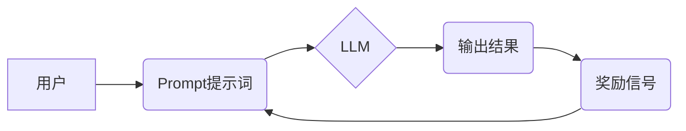

> AI大模型,Prompt提示词,奖励机制,强化学习,文本生成,自然语言处理

## 1. 背景介绍

近年来，大规模语言模型（LLM）在自然语言处理（NLP）领域取得了显著进展，展现出强大的文本生成、翻译、问答等能力。然而，LLM的性能很大程度上依赖于高质量的Prompt提示词。一个精心设计的Prompt可以引导模型生成更准确、更相关的输出，而一个模糊或不完整的Prompt则可能导致模型产生错误或不相关的结果。

传统的Prompt设计方法往往依赖于人工经验和启发式规则，效率低下且难以保证高质量。随着强化学习（RL）技术的进步，利用奖励机制训练模型生成更优Prompt提示词成为了一种新的研究方向。

## 2. 核心概念与联系

**2.1  Prompt提示词**

Prompt提示词是用户与LLM交互的关键信息，它包含了用户想要模型完成的任务描述、输入数据以及期望的输出格式等。

**2.2  奖励机制**

奖励机制是强化学习的核心概念之一，它通过给予模型对正确行为的奖励，来引导模型学习最优策略。在Prompt提示词优化中，奖励机制可以用来评估不同Prompt的质量，并鼓励模型生成更有效的Prompt。

**2.3  强化学习**

强化学习是一种机器学习方法，它通过在环境中与环境交互，学习最优策略来最大化奖励。在Prompt提示词优化中，LLM可以看作是智能体，环境是LLM的输出结果，奖励是模型生成的Prompt质量评估结果。

**2.4  架构图**



## 3. 核心算法原理 & 具体操作步骤

**3.1  算法原理概述**

利用奖励机制训练模型生成更优Prompt提示词的核心算法是基于强化学习的策略梯度算法。该算法通过计算模型生成的Prompt与奖励信号之间的梯度，来更新模型的参数，从而使模型生成更有效的Prompt。

**3.2  算法步骤详解**

1. **初始化模型参数:** 首先，需要初始化LLM模型的参数。
2. **生成Prompt提示词:** 模型根据输入数据生成一个Prompt提示词。
3. **评估Prompt质量:** 使用预定义的评估指标或人工标注数据评估生成的Prompt质量，并获得奖励信号。
4. **计算梯度:** 计算模型参数与奖励信号之间的梯度。
5. **更新模型参数:** 使用梯度下降算法更新模型参数，使模型生成更有效的Prompt。
6. **重复步骤2-5:** 重复上述步骤，直到模型生成高质量的Prompt提示词。

**3.3  算法优缺点**

**优点:**

* 可以自动学习到更有效的Prompt提示词。
* 不需要人工标注大量数据。
* 可以适应不同的任务和领域。

**缺点:**

* 需要大量的计算资源和时间。
* 奖励机制的设计对算法性能有很大影响。

**3.4  算法应用领域**

* 文本生成
* 机器翻译
* 问答系统
* 代码生成

## 4. 数学模型和公式 & 详细讲解 & 举例说明

**4.1  数学模型构建**

假设LLM模型的参数为θ，输入数据为x，生成的Prompt提示词为p，奖励信号为r。则模型的目标函数可以表示为：

$$
J(\theta) = \mathbb{E}_{x,p} [r(x,p)]
$$

其中，$\mathbb{E}$表示期望值。

**4.2  公式推导过程**

使用策略梯度算法，可以将目标函数的梯度表示为：

$$
\nabla_{\theta} J(\theta) = \mathbb{E}_{x,p} \left[ \nabla_{\theta} \log p(p|x;\theta) \cdot r(x,p) \right]
$$

其中，$p(p|x;\theta)$表示模型生成Prompt提示词p的概率分布。

**4.3  案例分析与讲解**

假设我们训练一个LLM模型生成代码提示词。我们可以使用代码质量作为奖励信号，并使用策略梯度算法来优化模型参数。

## 5. 项目实践：代码实例和详细解释说明

**5.1  开发环境搭建**

* Python 3.7+
* TensorFlow/PyTorch
* CUDA

**5.2  源代码详细实现**

```python
import tensorflow as tf

# 定义LLM模型
class LLM(tf.keras.Model):
    def __init__(self):
        super(LLM, self).__init__()
        # ...

    def call(self, x):
        # ...

# 定义奖励函数
def reward_function(x, p):
    # ...

# 定义策略梯度算法
def policy_gradient(model, data, epochs):
    # ...

# 训练模型
model = LLM()
data = ...
policy_gradient(model, data, epochs=10)
```

**5.3  代码解读与分析**

* LLM模型负责生成Prompt提示词。
* reward_function函数根据Prompt提示词和输入数据计算奖励信号。
* policy_gradient函数使用策略梯度算法训练LLM模型。

**5.4  运行结果展示**

通过训练，模型可以生成高质量的Prompt提示词，从而提高LLM的性能。

## 6. 实际应用场景

**6.1  文本生成**

可以使用奖励机制训练模型生成更具创意和流畅性的文本。

**6.2  机器翻译**

可以使用奖励机制训练模型生成更准确和自然的机器翻译结果。

**6.3  问答系统**

可以使用奖励机制训练模型生成更相关和有用的问答结果。

**6.4  未来应用展望**

随着强化学习技术的进步，奖励机制在Prompt提示词优化领域将有更广泛的应用，例如：

* 自动生成代码注释
* 自动生成数学公式
* 自动生成艺术作品

## 7. 工具和资源推荐

**7.1  学习资源推荐**

* 强化学习：Sutton, R. S., & Barto, A. G. (2018). Reinforcement learning: An introduction. MIT press.
* 自然语言处理：Jurafsky, D., & Martin, J. H. (2023). Speech and language processing (4th ed.). Pearson Education.

**7.2  开发工具推荐**

* TensorFlow: https://www.tensorflow.org/
* PyTorch: https://pytorch.org/

**7.3  相关论文推荐**

* OpenAI Five: Mastering Dota 2 with Deep Reinforcement Learning (https://arxiv.org/abs/1806.09131)
* Proximal Policy Optimization Algorithms (https://arxiv.org/abs/1707.06347)

## 8. 总结：未来发展趋势与挑战

**8.1  研究成果总结**

利用奖励机制训练模型生成更优Prompt提示词取得了显著进展，为LLM的性能提升提供了新的思路。

**8.2  未来发展趋势**

* 更有效的奖励机制设计
* 多模态Prompt提示词生成
* 跨语言Prompt提示词生成

**8.3  面临的挑战**

* 奖励信号的设计和评估
* 计算资源和时间成本
* 伦理和安全问题

**8.4  研究展望**

未来，我们将继续探索更有效的奖励机制和算法，以提高LLM的性能和应用范围。

## 9. 附录：常见问题与解答

**9.1  Q: 如何设计有效的奖励机制？**

**A:** 设计有效的奖励机制需要根据具体的任务和领域进行定制。可以参考以下原则：

* 奖励信号应该与目标任务相关。
* 奖励信号应该能够准确地评估Prompt的质量。
* 奖励信号应该具有可解释性和可评估性。

**9.2  Q: 训练模型需要多少计算资源和时间？**

**A:** 训练模型所需的计算资源和时间取决于模型规模、数据集大小和训练epochs等因素。一般来说，训练大型LLM模型需要大量的计算资源和时间。

**9.3  Q: 奖励机制可能会导致模型生成不安全的输出，如何解决这个问题？**

**A:** 这个问题是一个重要的伦理和安全问题。可以采用以下方法来缓解这个问题：

* 在奖励机制中加入安全约束。
* 使用对抗训练来提高模型的鲁棒性。
* 对模型输出进行过滤和审核。


作者：禅与计算机程序设计艺术 / Zen and the Art of Computer Programming 
<end_of_turn>