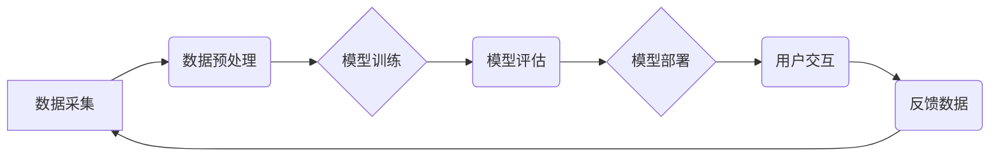

> AI大模型、创业、行业发展趋势、技术应用、商业模式、伦理风险、未来展望

## 1. 背景介绍

人工智能（AI）技术近年来发展迅速，特别是大模型的涌现，为各行各业带来了前所未有的机遇。AI大模型，是指拥有海量参数和强大的计算能力的深度学习模型，能够在自然语言处理、计算机视觉、语音识别等领域展现出惊人的性能。

随着AI技术的不断进步，越来越多的创业者看到了AI大模型的巨大潜力，纷纷涌入这个领域，希望通过AI大模型技术打造出颠覆性的产品和服务。然而，AI大模型创业也面临着诸多挑战，例如高昂的开发成本、数据安全和隐私问题、算法偏见等。

## 2. 核心概念与联系

**2.1 AI大模型概述**

AI大模型是指参数量巨大、训练数据海量、计算资源消耗巨大的深度学习模型。其核心特点是：

* **规模化：** 参数量达到数十亿甚至数千亿级别，拥有庞大的知识储备。
* **泛化能力强：** 能够在多种任务上表现出色，例如文本生成、图像识别、机器翻译等。
* **持续学习：** 可以通过不断学习新的数据来提升性能。

**2.2 核心概念关系图**



**2.3 关键技术**

* **深度学习算法：** 

包括卷积神经网络（CNN）、循环神经网络（RNN）、Transformer等，是构建AI大模型的基础。
* **分布式训练：** 由于AI大模型参数量巨大，需要利用分布式计算框架进行训练，例如TensorFlow、PyTorch等。
* **超参数调优：** 

模型训练过程中需要调整许多超参数，例如学习率、批处理大小等，以获得最佳性能。

## 3. 核心算法原理 & 具体操作步骤

**3.1 算法原理概述**

AI大模型的训练基于深度学习算法，通过大量数据进行迭代学习，不断调整模型参数，以最小化预测误差。

**3.2 算法步骤详解**

1. **数据准备：** 收集、清洗和预处理训练数据，将其转换为模型可理解的格式。
2. **模型构建：** 根据任务需求选择合适的深度学习模型架构，并初始化模型参数。
3. **模型训练：** 使用训练数据对模型进行训练，通过反向传播算法更新模型参数，降低预测误差。
4. **模型评估：** 使用验证集评估模型性能，并根据评估结果调整训练参数。
5. **模型部署：** 将训练好的模型部署到生产环境中，用于实际应用。

**3.3 算法优缺点**

**优点：**

* 泛化能力强，能够在多种任务上表现出色。
* 持续学习能力，可以通过不断学习新的数据来提升性能。

**缺点：**

* 训练成本高，需要大量数据和计算资源。
* 算法解释性差，难以理解模型的决策过程。
* 容易受到数据偏差的影响，可能产生算法偏见。

**3.4 算法应用领域**

* 自然语言处理：文本生成、机器翻译、问答系统等。
* 计算机视觉：图像识别、物体检测、图像生成等。
* 语音识别：语音转文本、语音助手等。
* 其他领域：医疗诊断、金融风险评估、推荐系统等。

## 4. 数学模型和公式 & 详细讲解 & 举例说明

**4.1 数学模型构建**

AI大模型的训练过程本质上是一个优化问题，目标是找到最优的模型参数，使得模型在训练数据上的预测误差最小。

**4.2 公式推导过程**

常用的损失函数包括均方误差（MSE）、交叉熵损失（Cross-Entropy Loss）等。

**均方误差（MSE）：**

$$MSE = \frac{1}{N} \sum_{i=1}^{N} (y_i - \hat{y}_i)^2$$

其中：

* $N$ 是样本数量。
* $y_i$ 是真实值。
* $\hat{y}_i$ 是模型预测值。

**交叉熵损失（Cross-Entropy Loss）：**

$$Cross-Entropy Loss = -\sum_{i=1}^{N} y_i \log(\hat{y}_i)$$

其中：

* $y_i$ 是真实值（one-hot编码）。
* $\hat{y}_i$ 是模型预测值（概率分布）。

**4.3 案例分析与讲解**

假设我们训练一个图像分类模型，目标是将图像分类为猫或狗。我们可以使用交叉熵损失函数来衡量模型的预测误差。

如果模型预测图像为猫，而真实标签是狗，则交叉熵损失函数的值会比较高。反之，如果模型预测图像为狗，而真实标签是狗，则交叉熵损失函数的值会比较低。

通过反向传播算法，我们可以根据损失函数的梯度更新模型参数，使得模型的预测误差逐渐降低。

## 5. 项目实践：代码实例和详细解释说明

**5.1 开发环境搭建**

* 操作系统：Ubuntu 20.04
* Python 版本：3.8
* 深度学习框架：TensorFlow 2.x

**5.2 源代码详细实现**

```python
import tensorflow as tf

# 定义模型架构
model = tf.keras.models.Sequential([
    tf.keras.layers.Conv2D(32, (3, 3), activation='relu', input_shape=(28, 28, 1)),
    tf.keras.layers.MaxPooling2D((2, 2)),
    tf.keras.layers.Conv2D(64, (3, 3), activation='relu'),
    tf.keras.layers.MaxPooling2D((2, 2)),
    tf.keras.layers.Flatten(),
    tf.keras.layers.Dense(10, activation='softmax')
])

# 定义损失函数和优化器
model.compile(loss='sparse_categorical_crossentropy',
              optimizer='adam',
              metrics=['accuracy'])

# 加载训练数据
(x_train, y_train), (x_test, y_test) = tf.keras.datasets.mnist.load_data()

# 数据预处理
x_train = x_train.astype('float32') / 255.0
x_test = x_test.astype('float32') / 255.0
x_train = x_train.reshape((x_train.shape[0], 28, 28, 1))
x_test = x_test.reshape((x_test.shape[0], 28, 28, 1))

# 模型训练
model.fit(x_train, y_train, epochs=5)

# 模型评估
loss, accuracy = model.evaluate(x_test, y_test)
print('Test loss:', loss)
print('Test accuracy:', accuracy)
```

**5.3 代码解读与分析**

* 代码首先定义了模型架构，使用卷积神经网络（CNN）进行图像分类。
* 然后定义了损失函数和优化器，用于训练模型。
* 加载MNIST数据集，并对数据进行预处理。
* 使用`model.fit()`方法训练模型，指定训练轮数（epochs）。
* 使用`model.evaluate()`方法评估模型性能。

**5.4 运行结果展示**

训练完成后，模型的测试准确率通常可以达到98%以上。

## 6. 实际应用场景

**6.1 自然语言处理**

* **文本生成：** AI大模型可以用于生成各种类型的文本，例如文章、故事、诗歌等。
* **机器翻译：** AI大模型可以实现高质量的机器翻译，跨越语言障碍。
* **问答系统：** AI大模型可以理解自然语言问题，并提供准确的答案。

**6.2 计算机视觉**

* **图像识别：** AI大模型可以识别图像中的物体、场景和人物。
* **物体检测：** AI大模型可以定位图像中的物体，并识别其类别。
* **图像生成：** AI大模型可以生成逼真的图像，例如人脸、风景等。

**6.3 语音识别**

* **语音转文本：** AI大模型可以将语音转换为文本，用于语音助手、会议记录等应用。
* **语音合成：** AI大模型可以将文本转换为语音，用于语音导航、电子书阅读等应用。

**6.4 其他领域**

* **医疗诊断：** AI大模型可以辅助医生诊断疾病，提高诊断准确率。
* **金融风险评估：** AI大模型可以分析金融数据，识别潜在的风险。
* **推荐系统：** AI大模型可以根据用户的行为和偏好，推荐个性化的商品或服务。

**6.5 未来应用展望**

AI大模型的应用场景还在不断扩展，未来将更加广泛地应用于各个领域，例如：

* **个性化教育：** 根据学生的学习情况，提供个性化的学习方案。
* **智能制造：** 自动化生产流程，提高生产效率。
* **自动驾驶：** 帮助车辆感知周围环境，实现自动驾驶。

## 7. 工具和资源推荐

**7.1 学习资源推荐**

* **书籍：**
    * 《深度学习》
    * 《动手学深度学习》
* **在线课程：**
    * Coursera：深度学习课程
    * Udacity：AI工程师课程
* **博客和网站：**
    * TensorFlow博客
    * PyTorch博客
    * AI Weekly

**7.2 开发工具推荐**

* **深度学习框架：** TensorFlow、PyTorch、Keras
* **云计算平台：** AWS、Google Cloud、Azure
* **数据处理工具：** Pandas、NumPy

**7.3 相关论文推荐**

* 《Attention Is All You Need》
* 《BERT: Pre-training of Deep Bidirectional Transformers for Language Understanding》
* 《GPT-3: Language Models are Few-Shot Learners》

## 8. 总结：未来发展趋势与挑战

**8.1 研究成果总结**

近年来，AI大模型取得了显著的进展，在各种任务上展现出强大的性能。

**8.2 未来发展趋势**

* **模型规模化：** 模型参数量将继续增加，模型能力将进一步提升。
* **多模态学习：** AI大模型将能够处理多种数据类型，例如文本、图像、音频等。
* **可解释性增强：** 研究人员将致力于提高AI大模型的解释性，使得模型决策更加透明。

**8.3 面临的挑战**

* **数据安全和隐私问题：** AI大模型的训练需要大量数据，如何保护数据安全和隐私是一个重要挑战。
* **算法偏见：** AI大模型容易受到训练数据中的偏见影响，可能产生算法偏见，需要采取措施 mitigate 偏见。
* **计算资源消耗：** AI大模型的训练需要大量的计算资源，如何降低计算成本是一个重要问题。

**8.4 研究展望**

未来，AI大模型研究将继续朝着更强大、更安全、更可解释的方向发展。


## 9. 附录：常见问题与解答

**9.1 如何选择合适的AI大模型？**

选择合适的AI大模型需要根据具体的应用场景和需求进行考虑，例如：

* **任务类型：** 不同的任务类型需要不同的模型架构。
* **数据规模：** 模型参数量和训练数据量需要匹配。
* **计算资源：** 模型训练需要足够的计算资源。

**9.2 如何训练自己的AI大模型？**

训练自己的AI大模型需要具备一定的深度学习知识和经验，以及足够的计算资源。

**9.3 如何解决AI大模型的算法偏见问题？**

