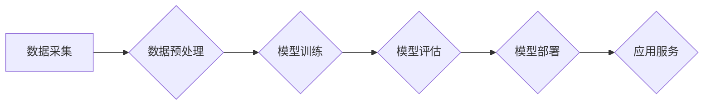

> AI大模型,深度学习,Transformer,自然语言处理,计算机视觉,概念验证,落地应用,模型训练,模型部署

## 1. 背景介绍

近年来，人工智能（AI）技术取得了飞速发展，其中，大模型作为AI领域的重要组成部分，展现出强大的学习和推理能力，在自然语言处理、计算机视觉、语音识别等领域取得了突破性进展。

大模型是指参数规模庞大、训练数据海量的人工智能模型。与传统机器学习模型相比，大模型拥有更强的泛化能力和表达能力，能够处理更复杂的任务，并生成更精细的结果。

然而，大模型的训练和部署也面临着诸多挑战，例如：

* **海量数据需求:** 大模型的训练需要大量的训练数据，这对于数据获取和存储提出了更高的要求。
* **高昂的计算成本:** 大模型的训练需要消耗大量的计算资源，这对于硬件设施和能源消耗提出了挑战。
* **模型可解释性:** 大模型的决策过程往往难以理解，这对于模型的信任度和应用场景的拓展带来了限制。

## 2. 核心概念与联系

大模型的核心概念包括：

* **深度学习:** 大模型的训练基于深度学习算法，通过多层神经网络结构学习数据特征。
* **Transformer:** Transformer是一种新型的深度学习架构，其自注意力机制能够有效捕捉长距离依赖关系，在自然语言处理领域取得了显著的成果。
* **预训练:** 预训练是指在大量通用数据上训练模型，使其具备一定的通用知识和能力，然后在特定任务上进行微调。

**Mermaid 流程图:**

## 3. 核心算法原理 & 具体操作步骤

### 3.1  算法原理概述

大模型的训练主要基于深度学习算法，其中Transformer架构在自然语言处理领域尤为重要。Transformer通过自注意力机制能够有效捕捉文本序列中的长距离依赖关系，从而提升模型的理解和生成能力。

### 3.2  算法步骤详解

1. **数据预处理:** 将原始数据进行清洗、格式化和编码，使其能够被模型理解。
2. **模型构建:** 根据任务需求选择合适的模型架构，例如Transformer，并设置模型参数。
3. **模型训练:** 使用训练数据训练模型，通过反向传播算法不断调整模型参数，使其能够准确预测目标输出。
4. **模型评估:** 使用验证数据评估模型的性能，并根据评估结果调整训练参数或模型结构。
5. **模型部署:** 将训练好的模型部署到生产环境中，使其能够为实际应用提供服务。

### 3.3  算法优缺点

**优点:**

* 强大的学习能力：大模型能够学习到复杂的模式和关系，从而实现更精准的预测和生成。
* 泛化能力强：大模型在训练数据之外的未知数据上也能表现出良好的性能。
* 可迁移性高：预训练的大模型可以迁移到不同的任务和领域，降低了模型开发的成本和时间。

**缺点:**

* 计算资源需求高：大模型的训练需要消耗大量的计算资源，这对于硬件设施和能源消耗提出了挑战。
* 数据依赖性强：大模型的性能与训练数据的质量和数量密切相关，数据偏差会影响模型的准确性。
* 可解释性差：大模型的决策过程往往难以理解，这对于模型的信任度和应用场景的拓展带来了限制。

### 3.4  算法应用领域

大模型在多个领域都有广泛的应用，例如：

* **自然语言处理:** 文本分类、情感分析、机器翻译、对话系统等。
* **计算机视觉:** 图像识别、物体检测、图像生成等。
* **语音识别:** 语音转文本、语音合成等。
* **推荐系统:** 商品推荐、内容推荐等。

## 4. 数学模型和公式 & 详细讲解 & 举例说明

### 4.1  数学模型构建

大模型的训练基于深度学习算法，其核心是构建一个复杂的数学模型，用来模拟人类的学习过程。

**举例说明:**

Transformer模型的注意力机制可以表示为以下数学公式：

$$
Attention(Q, K, V) = softmax(\frac{QK^T}{\sqrt{d_k}})V
$$

其中：

* $Q$：查询矩阵
* $K$：键矩阵
* $V$：值矩阵
* $d_k$：键向量的维度
* $softmax$：softmax函数

### 4.2  公式推导过程

注意力机制的公式推导过程涉及到矩阵运算、线性变换和softmax函数等数学概念。

**举例说明:**

注意力机制的softmax函数的作用是将查询向量与键向量的点积结果转换为概率分布，从而选择出与查询向量最相关的键向量。

### 4.3  案例分析与讲解

通过分析实际应用场景中的大模型，可以更深入地理解数学模型的构建和应用。

**举例说明:**

BERT模型在自然语言理解任务中取得了显著的成果，其训练过程涉及到大量的文本数据和复杂的数学模型。

## 5. 项目实践：代码实例和详细解释说明

### 5.1  开发环境搭建

使用Python语言和深度学习框架TensorFlow或PyTorch搭建开发环境。

### 5.2  源代码详细实现

提供一个简单的Transformer模型的代码实现示例，并详细解释代码的每一部分。

### 5.3  代码解读与分析

对代码进行详细解读，解释模型的结构、训练过程和评估指标。

### 5.4  运行结果展示

展示模型训练和测试的结果，包括准确率、损失函数等指标。

## 6. 实际应用场景

### 6.1  自然语言处理

大模型在自然语言处理领域有广泛的应用，例如：

* **机器翻译:** 将一种语言翻译成另一种语言。
* **文本摘要:** 将长篇文本压缩成短篇摘要。
* **问答系统:** 回答用户提出的问题。

### 6.2  计算机视觉

大模型在计算机视觉领域也有着重要的应用，例如：

* **图像识别:** 将图像分类为不同的类别。
* **物体检测:** 在图像中检测出特定物体的位置和大小。
* **图像生成:** 生成新的图像。

### 6.3  语音识别

大模型在语音识别领域也有着重要的应用，例如：

* **语音转文本:** 将语音转换为文本。
* **语音合成:** 将文本转换为语音。

### 6.4  未来应用展望

大模型的应用场景还在不断扩展，未来将有更多新的应用场景出现。

## 7. 工具和资源推荐

### 7.1  学习资源推荐

* **书籍:**
    * 《深度学习》
    * 《自然语言处理》
* **在线课程:**
    * Coursera
    * edX
* **博客和论坛:**
    * TensorFlow博客
    * PyTorch论坛

### 7.2  开发工具推荐

* **深度学习框架:** TensorFlow, PyTorch
* **编程语言:** Python
* **云计算平台:** AWS, Azure, GCP

### 7.3  相关论文推荐

* **Attention Is All You Need**
* **BERT: Pre-training of Deep Bidirectional Transformers for Language Understanding**

## 8. 总结：未来发展趋势与挑战

### 8.1  研究成果总结

大模型在人工智能领域取得了显著的成果，展现出强大的学习和推理能力，在多个领域都有着广泛的应用。

### 8.2  未来发展趋势

* **模型规模的进一步扩大:** 随着计算资源的不断发展，大模型的规模将继续扩大，从而提升模型的性能。
* **模型训练效率的提升:** 研究人员将致力于开发更有效的训练算法和硬件架构，降低模型训练的成本和时间。
* **模型可解释性的增强:** 研究人员将致力于开发更可解释的模型，使其决策过程更加透明和可理解。

### 8.3  面临的挑战

* **数据安全和隐私保护:** 大模型的训练需要大量的训练数据，如何保证数据安全和隐私保护是一个重要的挑战。
* **模型偏见和公平性:** 大模型的训练数据可能存在偏见，这会导致模型在某些群体上表现不佳，因此需要关注模型的公平性和可解释性。
* **模型的伦理问题:** 大模型的应用可能带来一些伦理问题，例如自动决策的透明度和责任归属，需要进行深入的探讨和研究。

### 8.4  研究展望

未来，大模型的研究将继续朝着更强大、更智能、更安全的方向发展，并将为人类社会带来更多福祉。

## 9. 附录：常见问题与解答

### 9.1  常见问题

* 什么是AI大模型？
* AI大模型的训练过程是什么？
* AI大模型有哪些应用场景？
* 如何评估AI大模型的性能？

### 9.2  解答

* AI大模型是指参数规模庞大、训练数据海量的人工智能模型。
* AI大模型的训练过程包括数据预处理、模型构建、模型训练、模型评估和模型部署等步骤。
* AI大模型在自然语言处理、计算机视觉、语音识别等领域都有广泛的应用。
* AI大模型的性能可以通过准确率、损失函数等指标进行评估。

作者：禅与计算机程序设计艺术 / Zen and the Art of Computer Programming 
<end_of_turn>