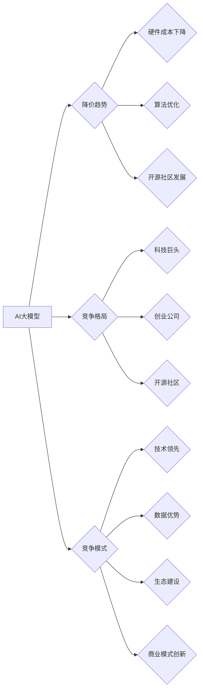

> AI大模型，降价，竞争，开源，商业模式，技术发展，应用场景

## 1. 背景介绍

近年来，人工智能（AI）技术取得了飞速发展，其中，大模型的涌现尤为引人注目。这些拥有数十亿甚至数千亿参数的模型，在自然语言处理、图像识别、代码生成等领域展现出强大的能力，推动了AI技术的广泛应用。然而，高昂的训练成本和部署费用一直是AI大模型普及的瓶颈。

随着技术的进步和开源社区的蓬勃发展，AI大模型的训练和部署成本正在逐渐降低。同时，越来越多的企业和研究机构开始投入到AI大模型的开发和应用中，激发了激烈的竞争。

## 2. 核心概念与联系

**2.1 AI大模型**

AI大模型是指参数规模庞大、训练数据海量的人工智能模型。它们通常基于深度学习架构，例如Transformer，能够学习复杂的模式和关系，从而实现强大的泛化能力。

**2.2 降价趋势**

AI大模型的降价主要源于以下几个方面：

* **硬件成本下降:** GPU等深度学习训练所需的硬件成本近年来持续下降，使得训练大模型更加经济。
* **算法优化:** 训练算法的不断优化，例如混合精度训练、模型剪枝等，可以有效降低训练成本。
* **开源社区发展:** 开源社区为AI大模型的开发和应用提供了丰富的资源和工具，降低了开发门槛和成本。

**2.3 竞争格局**

AI大模型的竞争格局日益激烈，主要参与者包括：

* **科技巨头:** 谷歌、微软、Meta等科技巨头拥有强大的技术实力和资源，在AI大模型领域占据主导地位。
* **创业公司:** 一些创业公司专注于特定领域的AI大模型开发，例如自然语言处理、图像识别等，并通过创新技术和商业模式寻求突破。
* **开源社区:** 开源社区为AI大模型的开发和应用提供了重要的基础设施和资源，推动了AI技术的普及和创新。

**2.4 竞争模式**

AI大模型的竞争模式主要包括：

* **技术领先:** 通过研发更先进的算法和模型架构，提升模型性能和效率。
* **数据优势:** 积累海量高质量的数据，为模型训练提供充足的燃料。
* **生态建设:** 构建完善的生态系统，包括工具、平台、应用等，吸引开发者和用户。
* **商业模式创新:** 探索新的商业模式，例如订阅服务、API接口等，实现盈利。

**Mermaid 流程图**



## 3. 核心算法原理 & 具体操作步骤

### 3.1  算法原理概述

AI大模型的训练主要基于深度学习算法，其中Transformer架构最为流行。Transformer模型的核心在于“注意力机制”，它能够学习文本中的长距离依赖关系，从而提升模型的理解和生成能力。

### 3.2  算法步骤详解

1. **数据预处理:** 将原始文本数据进行清洗、分词、标记等预处理操作，使其适合模型训练。
2. **模型构建:** 根据Transformer架构构建模型，包括编码器、解码器和注意力机制等模块。
3. **模型训练:** 使用训练数据对模型进行训练，通过反向传播算法不断调整模型参数，使其能够准确地预测目标输出。
4. **模型评估:** 使用测试数据对模型进行评估，衡量模型的性能，例如准确率、召回率等。
5. **模型部署:** 将训练好的模型部署到实际应用场景中，例如聊天机器人、机器翻译等。

### 3.3  算法优缺点

**优点:**

* 强大的泛化能力：能够学习复杂的模式和关系，在不同领域和任务中表现出色。
* 长距离依赖关系处理能力强：注意力机制能够有效地捕捉文本中的长距离依赖关系。
* 可并行训练：模型训练可以并行化，提高训练效率。

**缺点:**

* 训练成本高：训练大模型需要大量的计算资源和时间。
* 数据依赖性强：模型性能受训练数据质量和数量的影响较大。
* 可解释性差：模型内部的决策过程难以理解，缺乏透明度。

### 3.4  算法应用领域

AI大模型在多个领域都有广泛的应用，例如：

* **自然语言处理:** 机器翻译、文本摘要、问答系统、聊天机器人等。
* **图像识别:** 图像分类、目标检测、图像生成等。
* **代码生成:** 代码自动完成、代码翻译、代码错误修复等。
* **语音识别:** 语音转文本、语音合成等。

## 4. 数学模型和公式 & 详细讲解 & 举例说明

### 4.1  数学模型构建

Transformer模型的核心是注意力机制，其数学模型可以表示为：

$$
Attention(Q, K, V) = softmax(\frac{QK^T}{\sqrt{d_k}})V
$$

其中：

* $Q$：查询矩阵
* $K$：键矩阵
* $V$：值矩阵
* $d_k$：键向量的维度
* $softmax$：softmax函数

### 4.2  公式推导过程

注意力机制的目的是计算查询向量与键向量的相关性，并根据相关性对值向量进行加权求和。

1. 计算查询向量与每个键向量的点积，得到一个分数向量。
2. 对分数向量进行归一化，得到一个概率分布。
3. 将概率分布与值向量进行加权求和，得到最终的输出向量。

### 4.3  案例分析与讲解

例如，在机器翻译任务中，查询向量可以表示源语言的词语，键向量可以表示目标语言的词语，值向量可以表示目标语言的词语嵌入。注意力机制可以学习到源语言词语与目标语言词语之间的关系，从而提高翻译的准确性。

## 5. 项目实践：代码实例和详细解释说明

### 5.1  开发环境搭建

* Python 3.7+
* PyTorch 1.7+
* CUDA 10.2+

### 5.2  源代码详细实现

```python
import torch
import torch.nn as nn

class Attention(nn.Module):
    def __init__(self, d_model, num_heads):
        super(Attention, self).__init__()
        self.d_model = d_model
        self.num_heads = num_heads
        self.head_dim = d_model // num_heads

        self.query = nn.Linear(d_model, d_model)
        self.key = nn.Linear(d_model, d_model)
        self.value = nn.Linear(d_model, d_model)
        self.fc_out = nn.Linear(d_model, d_model)

    def forward(self, query, key, value, mask=None):
        batch_size = query.size(0)

        # Linear projections
        Q = self.query(query).view(batch_size, -1, self.num_heads, self.head_dim).transpose(1, 2)
        K = self.key(key).view(batch_size, -1, self.num_heads, self.head_dim).transpose(1, 2)
        V = self.value(value).view(batch_size, -1, self.num_heads, self.head_dim).transpose(1, 2)

        # Scaled dot-product attention
        scores = torch.matmul(Q, K.transpose(-2, -1)) / torch.sqrt(torch.tensor(self.head_dim, dtype=torch.float))

        if mask is not None:
            scores = scores.masked_fill(mask == 0, -1e9)

        attention_weights = torch.softmax(scores, dim=-1)

        # Weighted sum of values
        context = torch.matmul(attention_weights, V)

        # Concatenate heads and project
        context = context.transpose(1, 2).contiguous().view(batch_size, -1, self.d_model)
        output = self.fc_out(context)

        return output, attention_weights
```

### 5.3  代码解读与分析

这段代码实现了Transformer模型中的注意力机制。

* `__init__`方法初始化模型参数，包括模型维度、注意力头数等。
* `forward`方法实现注意力机制的计算过程，包括线性投影、缩放点积注意力、加权求和等步骤。

### 5.4  运行结果展示

运行代码可以得到注意力权重矩阵，可以直观地观察模型对不同词语的关注程度。

## 6. 实际应用场景

AI大模型在各个领域都有着广泛的应用，例如：

### 6.1 自然语言处理

* **机器翻译:** 使用AI大模型可以实现更高质量的机器翻译，例如Google Translate。
* **文本摘要:** AI大模型可以自动生成文本摘要，例如新闻文章的摘要。
* **问答系统:** AI大模型可以理解用户的问题并给出准确的答案，例如智能客服系统。

### 6.2 图像识别

* **图像分类:** AI大模型可以识别图像中的物体类别，例如自动驾驶汽车中的物体检测。
* **目标检测:** AI大模型可以定位图像中的特定物体，例如人脸识别。
* **图像生成:** AI大模型可以生成逼真的图像，例如DeepDream。

### 6.3 代码生成

* **代码自动完成:** AI大模型可以根据代码上下文自动完成代码片段，提高开发效率。
* **代码翻译:** AI大模型可以将代码从一种编程语言翻译成另一种编程语言。
* **代码错误修复:** AI大模型可以识别代码中的错误并提供修复建议。

### 6.4 未来应用展望

随着AI大模型技术的不断发展，未来将有更多新的应用场景出现，例如：

* **个性化教育:** AI大模型可以根据学生的学习情况提供个性化的学习方案。
* **医疗诊断:** AI大模型可以辅助医生进行疾病诊断，提高诊断准确率。
* **科学研究:** AI大模型可以帮助科学家进行数据分析和模型构建，加速科学研究的进程。

## 7. 工具和资源推荐

### 7.1  学习资源推荐

* **课程:**
    * Stanford CS224N: Natural Language Processing with Deep Learning
    * MIT 6.S191: Introduction to Deep Learning
* **书籍:**
    * Deep Learning by Ian Goodfellow, Yoshua Bengio, and Aaron Courville
    * Attention Is All You Need by Ashish Vaswani et al.
* **博客:**
    * The Gradient
    * Towards Data Science

### 7.2  开发工具推荐

* **框架:**
    * PyTorch
    * TensorFlow
* **库:**
    * Hugging Face Transformers
    * OpenAI API
* **平台:**
    * Google Colab
    * Paperspace Gradient

### 7.3  相关论文推荐

* Attention Is All You Need (Vaswani et al., 2017)
* BERT: Pre-training of Deep Bidirectional Transformers for Language Understanding (Devlin et al., 2018)
* GPT-3: Language Models are Few-Shot Learners (Brown et al., 2020)

## 8. 总结：未来发展趋势与挑战

### 8.1  研究成果总结

近年来，AI大模型取得了显著的进展，在多个领域展现出强大的能力。

* 模型规模不断扩大，参数数量达到数千亿甚至万亿级别。
* 算法架构不断创新，例如Transformer、GPT等模型架构取得了