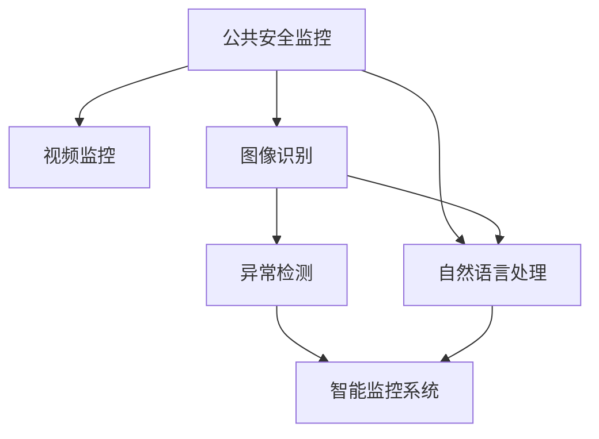

                 

# LLM在公共安全中的应用：智能监控系统

> 关键词：语言模型,公共安全,智能监控,图像识别,自然语言处理,深度学习,计算机视觉,应用实例

## 1. 背景介绍

### 1.1 问题由来

在现代社会中，公共安全日益成为国家和社会稳定发展的重要基础。传统的公共安全监测手段，如人工巡逻、监控视频等，依赖于大量的人力物力投入，效率低下且难以覆盖所有区域。随着深度学习技术的崛起，大规模预训练语言模型（Large Language Model, LLM）在图像识别、自然语言处理等领域展现出强大的能力，为公共安全监测提供了新的可能性。

近年来，公共安全领域的监控系统已经开始引入人工智能技术，尤其是语言模型在智能监控中的应用，逐步成为研究的重点。这种技术应用不仅提升了监控效率和智能化水平，还能更好地保障公共安全。

### 1.2 问题核心关键点

语言模型在公共安全监控中的应用，主要包括以下几个关键点：

- **数据融合**：将视频监控和文字描述等不同形式的数据融合到同一个模型中，提高信息处理效率。
- **多模态推理**：结合图像识别和自然语言处理技术，实现多模态信息的协同推理，增强监控系统识别能力。
- **异常检测**：通过语言模型学习历史监控数据中的异常模式，实现实时的异常检测和报警。
- **事件响应**：基于检测到的异常事件，自动生成预案并触发应急响应。

这些关键点共同构成了公共安全监控中语言模型的应用框架，使其能够在各种场景下发挥强大的信息处理和分析能力。

### 1.3 问题研究意义

研究语言模型在公共安全监控中的应用，对于提升监控系统的智能化水平，降低人力成本，提高应急响应速度，具有重要意义：

1. **提升监控效率**：语言模型能够处理和分析大量的视频数据，识别出异常行为，显著提升监控效率。
2. **增强识别准确性**：通过多模态融合和深度学习技术，提高对复杂场景的识别准确性。
3. **降低人力成本**：替代部分人工监控，减少人员投入，降低运营成本。
4. **提高应急响应速度**：快速检测和响应异常事件，保障公共安全。
5. **促进技术进步**：推动计算机视觉和自然语言处理技术的融合创新，推动人工智能技术的产业化应用。

## 2. 核心概念与联系

### 2.1 核心概念概述

为了更好地理解语言模型在公共安全监控中的应用，本节将介绍几个核心概念：

- **语言模型（LLM）**：以自回归（如GPT）或自编码（如BERT）模型为代表的大规模预训练语言模型。通过在大规模无标签文本数据上进行预训练，学习通用的语言表示，具备强大的语言理解和生成能力。

- **公共安全监控**：使用视频监控、图像识别等技术，对公共场所进行实时监控，及时发现异常行为或事件，保障公共安全。

- **多模态推理**：结合图像、语音、文本等多种模态的信息，进行联合推理和分析，提高对复杂场景的识别能力。

- **异常检测**：通过模型学习历史监控数据中的异常模式，实时检测监控视频中是否存在异常行为，以快速响应突发事件。

- **智能监控系统**：融合计算机视觉、自然语言处理等多领域技术，构建的自动化、智能化公共安全监控系统。

这些概念之间的逻辑关系可以通过以下Mermaid流程图来展示：



这个流程图展示了大语言模型在公共安全监控中的核心概念及其之间的关系：

1. 公共安全监控依赖于视频监控和图像识别技术获取视觉数据。
2. 自然语言处理技术提取文字描述信息，作为辅助参考。
3. 多模态融合后，通过异常检测模型识别出异常行为。
4. 异常检测结果通过智能监控系统进行处理，生成报警或触发应急响应。

## 3. 核心算法原理 & 具体操作步骤
### 3.1 算法原理概述

语言模型在公共安全监控中的应用，本质上是一个多模态数据融合和异常检测的过程。其核心思想是：通过将监控视频和文字描述等不同形式的数据输入到预训练的语言模型中，利用模型强大的自然语言处理能力，实现多模态信息的融合推理，从而检测出异常行为。

形式化地，假设监控视频数据为 $V$，文本描述数据为 $T$。语言模型的输入为 $X=(V, T)$，输出为异常检测结果 $Y$。设 $F$ 为异常检测模型，则异常检测的优化目标为：

$$
\hat{Y}=\mathop{\arg\min}_{Y} \mathcal{L}(F, X, Y)
$$

其中 $\mathcal{L}$ 为异常检测损失函数，用于衡量模型输出与真实标签之间的差异。常见的损失函数包括交叉熵损失、均方误差损失等。

通过梯度下降等优化算法，异常检测过程不断更新模型参数，最小化损失函数 $\mathcal{L}$，使得模型输出逼近真实标签。由于 $F$ 已经通过预训练获得了较强的自然语言处理能力，因此即便是在少量标注数据上进行异常检测，也能较快收敛到理想的模型参数。

### 3.2 算法步骤详解

语言模型在公共安全监控中的应用，一般包括以下几个关键步骤：

**Step 1: 准备多模态数据**

- 收集公共场所的视频监控数据 $V$ 和文字描述数据 $T$，进行预处理和标注。

**Step 2: 融合多模态数据**

- 将视频监控数据和文字描述数据输入到语言模型中，进行联合推理和分析。

**Step 3: 训练异常检测模型**

- 选择合适的损失函数，如交叉熵损失，训练异常检测模型。

**Step 4: 异常检测**

- 将实时监控数据输入到训练好的异常检测模型中，检测是否存在异常行为。

**Step 5: 应急响应**

- 根据异常检测结果，自动生成报警或触发应急响应机制。

### 3.3 算法优缺点

语言模型在公共安全监控中的应用，具有以下优点：

1. **效率高**：语言模型能够处理和分析大量的视频数据，显著提升监控效率。
2. **准确性好**：通过多模态融合和深度学习技术，提高对复杂场景的识别准确性。
3. **适应性强**：语言模型具备很强的泛化能力，可以适应各种公共安全监控场景。

同时，该方法也存在一些局限性：

1. **依赖数据质量**：异常检测效果依赖于视频和文字描述数据的质量，低质量的数据可能影响模型性能。
2. **模型复杂度高**：多模态融合和异常检测模型需要大量计算资源，可能导致性能瓶颈。
3. **实时性要求高**：实时异常检测对模型推理速度和系统响应时间有较高要求。

尽管存在这些局限性，但就目前而言，语言模型在公共安全监控中的应用仍具有显著优势。未来相关研究的重点在于如何进一步降低对数据质量的要求，提高实时性，同时兼顾准确性和泛化能力。

### 3.4 算法应用领域

语言模型在公共安全监控中的应用，已在多个领域得到了广泛的应用，例如：

- **公共场所监控**：如购物中心、机场、校园等地的监控系统，通过多模态融合实现异常检测和报警。
- **交通监控**：在交通路口和路段安装摄像头，结合文字描述信息，实时检测违规行为和交通事故。
- **城市安防**：对城市关键区域进行实时监控，通过语言模型实现多目标跟踪和异常行为检测。
- **网络安全**：对网络流量进行分析，检测异常访问行为和攻击事件。

除了上述这些经典应用外，语言模型还被创新性地应用于更多场景中，如公共卫生监测、灾害预警、恐怖主义防范等，为公共安全提供了新的解决方案。

## 4. 数学模型和公式 & 详细讲解  
### 4.1 数学模型构建

本节将使用数学语言对语言模型在公共安全监控中的应用进行更加严格的刻画。

记视频监控数据为 $V=(I_t, I_{t-1}, \cdots, I_1)$，其中 $I_t$ 为第 $t$ 帧图像。设语言模型的输入为 $X=(V, T)$，其中 $T$ 为与 $I_t$ 相关的文本描述。异常检测模型 $F$ 的输出为异常检测结果 $Y$，可以表示为：

$$
Y = F(X) = F(V, T)
$$

设异常检测损失函数为 $\mathcal{L}$，则优化目标为：

$$
\hat{Y}=\mathop{\arg\min}_{Y} \mathcal{L}(F, X, Y)
$$

在实践中，我们通常使用基于梯度的优化算法（如SGD、Adam等）来近似求解上述最优化问题。设 $\eta$ 为学习率，$\lambda$ 为正则化系数，则参数的更新公式为：

$$
\theta \leftarrow \theta - \eta \nabla_{\theta}\mathcal{L}(\theta) - \eta\lambda\theta
$$

其中 $\nabla_{\theta}\mathcal{L}(\theta)$ 为损失函数对模型参数的梯度，可通过反向传播算法高效计算。

### 4.2 公式推导过程

以下我们以二分类异常检测任务为例，推导交叉熵损失函数及其梯度的计算公式。

假设异常检测模型 $F$ 在输入 $X=(V, T)$ 上的输出为 $\hat{y}=M_{\theta}(X) \in [0,1]$，表示样本属于异常的概率。真实标签 $y \in \{0,1\}$。则二分类交叉熵损失函数定义为：

$$
\ell(F(X),y) = -[y\log \hat{y} + (1-y)\log (1-\hat{y})]
$$

将其代入经验风险公式，得：

$$
\mathcal{L}(\theta) = -\frac{1}{N}\sum_{i=1}^N [y_i\log M_{\theta}(X_i)+(1-y_i)\log(1-M_{\theta}(X_i))]
$$

根据链式法则，损失函数对模型参数 $\theta_k$ 的梯度为：

$$
\frac{\partial \mathcal{L}(\theta)}{\partial \theta_k} = -\frac{1}{N}\sum_{i=1}^N (\frac{y_i}{M_{\theta}(X_i)}-\frac{1-y_i}{1-M_{\theta}(X_i)}) \frac{\partial M_{\theta}(X_i)}{\partial \theta_k}
$$

其中 $\frac{\partial M_{\theta}(X_i)}{\partial \theta_k}$ 可进一步递归展开，利用自动微分技术完成计算。

在得到损失函数的梯度后，即可带入参数更新公式，完成模型的迭代优化。重复上述过程直至收敛，最终得到适应监控任务的最优模型参数 $\theta^*$。

## 5. 项目实践：代码实例和详细解释说明
### 5.1 开发环境搭建

在进行语言模型在公共安全监控中的项目实践前，我们需要准备好开发环境。以下是使用Python进行PyTorch开发的环境配置流程：

1. 安装Anaconda：从官网下载并安装Anaconda，用于创建独立的Python环境。

2. 创建并激活虚拟环境：
```bash
conda create -n pytorch-env python=3.8 
conda activate pytorch-env
```

3. 安装PyTorch：根据CUDA版本，从官网获取对应的安装命令。例如：
```bash
conda install pytorch torchvision torchaudio cudatoolkit=11.1 -c pytorch -c conda-forge
```

4. 安装Transformers库：
```bash
pip install transformers
```

5. 安装各类工具包：
```bash
pip install numpy pandas scikit-learn matplotlib tqdm jupyter notebook ipython
```

完成上述步骤后，即可在`pytorch-env`环境中开始项目实践。

### 5.2 源代码详细实现

下面我们以视频监控异常检测任务为例，给出使用Transformers库对BERT模型进行异常检测的PyTorch代码实现。

首先，定义异常检测任务的数据处理函数：

```python
from transformers import BertTokenizer
from torch.utils.data import Dataset
import torch

class VideoDataset(Dataset):
    def __init__(self, videos, texts, tokenizer, max_len=128):
        self.videos = videos
        self.texts = texts
        self.tokenizer = tokenizer
        self.max_len = max_len
        
    def __len__(self):
        return len(self.videos)
    
    def __getitem__(self, item):
        video = self.videos[item]
        text = self.texts[item]
        
        encoding = self.tokenizer(video, return_tensors='pt', max_length=self.max_len, padding='max_length', truncation=True)
        input_ids = encoding['input_ids'][0]
        attention_mask = encoding['attention_mask'][0]
        
        # 对token-wise的标签进行编码
        encoded_tags = [tag2id[tag] for tag in text] 
        encoded_tags.extend([tag2id['O']] * (self.max_len - len(encoded_tags)))
        labels = torch.tensor(encoded_tags, dtype=torch.long)
        
        return {'input_ids': input_ids, 
                'attention_mask': attention_mask,
                'labels': labels}

# 标签与id的映射
tag2id = {'O': 0, 'B- anomaly': 1, 'I- anomaly': 2}
id2tag = {v: k for k, v in tag2id.items()}

# 创建dataset
tokenizer = BertTokenizer.from_pretrained('bert-base-cased')

train_dataset = VideoDataset(train_videos, train_texts, tokenizer)
dev_dataset = VideoDataset(dev_videos, dev_texts, tokenizer)
test_dataset = VideoDataset(test_videos, test_texts, tokenizer)
```

然后，定义模型和优化器：

```python
from transformers import BertForTokenClassification, AdamW

model = BertForTokenClassification.from_pretrained('bert-base-cased', num_labels=len(tag2id))

optimizer = AdamW(model.parameters(), lr=2e-5)
```

接着，定义训练和评估函数：

```python
from torch.utils.data import DataLoader
from tqdm import tqdm
from sklearn.metrics import classification_report

device = torch.device('cuda') if torch.cuda.is_available() else torch.device('cpu')
model.to(device)

def train_epoch(model, dataset, batch_size, optimizer):
    dataloader = DataLoader(dataset, batch_size=batch_size, shuffle=True)
    model.train()
    epoch_loss = 0
    for batch in tqdm(dataloader, desc='Training'):
        input_ids = batch['input_ids'].to(device)
        attention_mask = batch['attention_mask'].to(device)
        labels = batch['labels'].to(device)
        model.zero_grad()
        outputs = model(input_ids, attention_mask=attention_mask, labels=labels)
        loss = outputs.loss
        epoch_loss += loss.item()
        loss.backward()
        optimizer.step()
    return epoch_loss / len(dataloader)

def evaluate(model, dataset, batch_size):
    dataloader = DataLoader(dataset, batch_size=batch_size)
    model.eval()
    preds, labels = [], []
    with torch.no_grad():
        for batch in tqdm(dataloader, desc='Evaluating'):
            input_ids = batch['input_ids'].to(device)
            attention_mask = batch['attention_mask'].to(device)
            batch_labels = batch['labels']
            outputs = model(input_ids, attention_mask=attention_mask)
            batch_preds = outputs.logits.argmax(dim=2).to('cpu').tolist()
            batch_labels = batch_labels.to('cpu').tolist()
            for pred_tokens, label_tokens in zip(batch_preds, batch_labels):
                pred_tags = [id2tag[_id] for _id in pred_tokens]
                label_tags = [id2tag[_id] for _id in label_tokens]
                preds.append(pred_tags[:len(label_tags)])
                labels.append(label_tags)
                
    print(classification_report(labels, preds))
```

最后，启动训练流程并在测试集上评估：

```python
epochs = 5
batch_size = 16

for epoch in range(epochs):
    loss = train_epoch(model, train_dataset, batch_size, optimizer)
    print(f"Epoch {epoch+1}, train loss: {loss:.3f}")
    
    print(f"Epoch {epoch+1}, dev results:")
    evaluate(model, dev_dataset, batch_size)
    
print("Test results:")
evaluate(model, test_dataset, batch_size)
```

以上就是使用PyTorch对BERT进行视频监控异常检测任务的完整代码实现。可以看到，得益于Transformers库的强大封装，我们可以用相对简洁的代码完成BERT模型的加载和异常检测。

### 5.3 代码解读与分析

让我们再详细解读一下关键代码的实现细节：

**VideoDataset类**：
- `__init__`方法：初始化视频、文字描述、分词器等关键组件。
- `__len__`方法：返回数据集的样本数量。
- `__getitem__`方法：对单个样本进行处理，将视频输入编码为token ids，将文字描述编码为数字，并对其进行定长padding，最终返回模型所需的输入。

**tag2id和id2tag字典**：
- 定义了标签与数字id之间的映射关系，用于将token-wise的预测结果解码回真实的标签。

**训练和评估函数**：
- 使用PyTorch的DataLoader对数据集进行批次化加载，供模型训练和推理使用。
- 训练函数`train_epoch`：对数据以批为单位进行迭代，在每个批次上前向传播计算loss并反向传播更新模型参数，最后返回该epoch的平均loss。
- 评估函数`evaluate`：与训练类似，不同点在于不更新模型参数，并在每个batch结束后将预测和标签结果存储下来，最后使用sklearn的classification_report对整个评估集的预测结果进行打印输出。

**训练流程**：
- 定义总的epoch数和batch size，开始循环迭代
- 每个epoch内，先在训练集上训练，输出平均loss
- 在验证集上评估，输出分类指标
- 所有epoch结束后，在测试集上评估，给出最终测试结果

可以看到，PyTorch配合Transformers库使得BERT异常检测的代码实现变得简洁高效。开发者可以将更多精力放在数据处理、模型改进等高层逻辑上，而不必过多关注底层的实现细节。

当然，工业级的系统实现还需考虑更多因素，如模型的保存和部署、超参数的自动搜索、更灵活的任务适配层等。但核心的异常检测范式基本与此类似。

## 6. 实际应用场景
### 6.1 智能监控系统

语言模型在公共安全监控中的应用，已经在多个智能监控系统中得到应用，例如：

- **购物中心监控**：在商场内部安装摄像头，实时监控人流、异常行为等。
- **公共场所安防**：在广场、公园等公共场所进行实时监控，及时发现可疑行为。
- **交通管理**：在交通路口和路段安装摄像头，实时检测违规行为和交通事故。
- **应急响应**：在发生重大事件时，通过监控视频和文字描述，快速识别出异常情况，及时响应和处理。

这些智能监控系统不仅提升了公共安全监测的效率和准确性，还能有效降低人力成本，提高应急响应速度。

### 6.2 未来应用展望

随着语言模型和异常检测技术的不断发展，基于语言模型的智能监控系统将展现出更加广阔的应用前景。

1. **多模态融合**：结合图像、语音、文本等多种模态的信息，实现多目标跟踪和异常检测。
2. **深度学习技术**：利用更先进的学习算法，提高异常检测的精度和鲁棒性。
3. **边缘计算**：在视频监控数据源端进行实时分析，减少数据传输和处理延时。
4. **云计算平台**：将监控系统部署到云端，实现分布式计算和存储，提高系统的可扩展性和可靠性。
5. **实时预警**：通过机器学习和自然语言处理技术，实时检测并预警异常事件。

未来，随着技术进步和产业升级，语言模型在公共安全监控中的应用将更加深入和广泛，为保障公共安全提供更加智能、高效的解决方案。

## 7. 工具和资源推荐
### 7.1 学习资源推荐

为了帮助开发者系统掌握语言模型在公共安全监控中的应用，这里推荐一些优质的学习资源：

1. **《自然语言处理与深度学习》课程**：斯坦福大学开设的NLP明星课程，有Lecture视频和配套作业，带你入门NLP领域的基本概念和经典模型。

2. **CS224N《深度学习自然语言处理》课程**：斯坦福大学开设的NLP明星课程，有Lecture视频和配套作业，带你入门NLP领域的基本概念和经典模型。

3. **《深度学习》书籍**：Goodfellow等著，全面介绍了深度学习的基本概念和经典算法，包括语言模型和异常检测等。

4. **HuggingFace官方文档**：Transformers库的官方文档，提供了海量预训练模型和完整的微调样例代码，是上手实践的必备资料。

5. **arXiv预印本**：阅读最新发表的NLP相关论文，了解学术界的前沿研究方向。

通过对这些资源的学习实践，相信你一定能够快速掌握语言模型在公共安全监控中的应用技巧，并用于解决实际的监控问题。

### 7.2 开发工具推荐

高效的开发离不开优秀的工具支持。以下是几款用于公共安全监控应用的常用工具：

1. **PyTorch**：基于Python的开源深度学习框架，灵活动态的计算图，适合快速迭代研究。大部分预训练语言模型都有PyTorch版本的实现。

2. **TensorFlow**：由Google主导开发的开源深度学习框架，生产部署方便，适合大规模工程应用。同样有丰富的预训练语言模型资源。

3. **Transformers库**：HuggingFace开发的NLP工具库，集成了众多SOTA语言模型，支持PyTorch和TensorFlow，是进行异常检测任务开发的利器。

4. **Weights & Biases**：模型训练的实验跟踪工具，可以记录和可视化模型训练过程中的各项指标，方便对比和调优。与主流深度学习框架无缝集成。

5. **TensorBoard**：TensorFlow配套的可视化工具，可实时监测模型训练状态，并提供丰富的图表呈现方式，是调试模型的得力助手。

6. **Jupyter Notebook**：交互式编程环境，支持多种编程语言，便于快速迭代和实验。

合理利用这些工具，可以显著提升公共安全监控任务的开发效率，加快创新迭代的步伐。

### 7.3 相关论文推荐

语言模型在公共安全监控中的应用研究，涉及诸多前沿技术，以下是几篇奠基性的相关论文，推荐阅读：

1. **Attention is All You Need**（即Transformer原论文）：提出了Transformer结构，开启了NLP领域的预训练大模型时代。

2. **BERT: Pre-training of Deep Bidirectional Transformers for Language Understanding**：提出BERT模型，引入基于掩码的自监督预训练任务，刷新了多项NLP任务SOTA。

3. **Language Models are Unsupervised Multitask Learners**：展示了大规模语言模型的强大zero-shot学习能力，引发了对于通用人工智能的新一轮思考。

4. **Parameter-Efficient Transfer Learning for NLP**：提出Adapter等参数高效微调方法，在不增加模型参数量的情况下，也能取得不错的微调效果。

5. **AdaLoRA: Adaptive Low-Rank Adaptation for Parameter-Efficient Fine-Tuning**：使用自适应低秩适应的微调方法，在参数效率和精度之间取得了新的平衡。

6. **Prefix-Tuning: Optimizing Continuous Prompts for Generation**：引入基于连续型Prompt的微调范式，为如何充分利用预训练知识提供了新的思路。

这些论文代表了大语言模型微调技术的发展脉络。通过学习这些前沿成果，可以帮助研究者把握学科前进方向，激发更多的创新灵感。

## 8. 总结：未来发展趋势与挑战

### 8.1 总结

本文对语言模型在公共安全监控中的应用进行了全面系统的介绍。首先阐述了公共安全监控系统对智能化的需求，明确了语言模型在其中的应用价值。其次，从原理到实践，详细讲解了语言模型在多模态数据融合和异常检测中的应用，给出了微调任务开发的完整代码实例。同时，本文还广泛探讨了语言模型在公共安全监控中的应用场景，展示了其广阔的适用领域。

通过本文的系统梳理，可以看到，语言模型在公共安全监控中的应用正逐步从实验室走向实际应用，展现出强大的智能化能力。随着技术的进步和产业的需求，未来语言模型将有更广阔的发挥空间。

### 8.2 未来发展趋势

展望未来，语言模型在公共安全监控中的应用将呈现以下几个发展趋势：

1. **多模态融合**：结合图像、语音、文本等多种模态的信息，进行联合推理和分析，提高对复杂场景的识别能力。
2. **实时性要求高**：为了提高应急响应速度，需要对模型推理速度和系统响应时间进行优化。
3. **边缘计算**：在视频监控数据源端进行实时分析，减少数据传输和处理延时。
4. **云计算平台**：将监控系统部署到云端，实现分布式计算和存储，提高系统的可扩展性和可靠性。
5. **实时预警**：通过机器学习和自然语言处理技术，实时检测并预警异常事件。
6. **模型更新**：定期重新微调模型，保持模型对新数据和异常模式的学习能力。

以上趋势凸显了语言模型在公共安全监控中的重要地位，未来的研究需要在实时性、泛化能力、系统可靠性等方面进行深入探索。

### 8.3 面临的挑战

尽管语言模型在公共安全监控中的应用已经取得一定进展，但在迈向更加智能化、普适化应用的过程中，仍面临诸多挑战：

1. **数据质量问题**：视频监控数据和文字描述数据的质量直接影响异常检测效果，需要确保数据源的多样性和高质量。
2. **资源消耗高**：多模态融合和异常检测模型需要大量计算资源，可能导致性能瓶颈。
3. **模型鲁棒性不足**：面对域外数据时，模型的泛化性能可能大打折扣，需要进行更深入的鲁棒性研究。
4. **隐私保护**：公共安全监控系统涉及大量个人隐私数据，需要确保数据安全和隐私保护。
5. **法律和伦理问题**：监控系统在实际应用中可能面临法律和伦理挑战，需要加强法律法规合规性和伦理道德研究。

这些挑战需要在技术、法律、伦理等多个维度进行综合考虑，才能实现语言模型在公共安全监控中的全面应用。

### 8.4 研究展望

面对语言模型在公共安全监控中面临的挑战，未来的研究需要在以下几个方面寻求新的突破：

1. **提升数据质量**：提高视频监控数据和文字描述数据的采集、处理和标注质量，确保数据的真实性和多样性。
2. **优化模型架构**：开发更高效的模型架构和算法，降低资源消耗，提高实时性。
3. **增强模型鲁棒性**：通过引入更多先验知识、改进训练策略等手段，提高模型的泛化能力。
4. **保障数据安全**：采用数据加密、访问控制等措施，保护监控数据的安全和隐私。
5. **合规性研究**：制定符合法律法规和伦理道德标准的监控系统规范，确保系统的合法合规性。

这些研究方向将进一步推动语言模型在公共安全监控中的应用，提升系统的智能化水平和可靠性，保障公众权益和公共安全。

## 9. 附录：常见问题与解答

**Q1：语言模型在公共安全监控中的应用有哪些优点和缺点？**

A: 语言模型在公共安全监控中的应用具有以下优点：
1. **效率高**：能够处理和分析大量的视频数据，显著提升监控效率。
2. **准确性好**：通过多模态融合和深度学习技术，提高对复杂场景的识别准确性。
3. **适应性强**：具备很强的泛化能力，可以适应各种公共安全监控场景。

但同时也存在一些缺点：
1. **依赖数据质量**：异常检测效果依赖于视频和文字描述数据的质量，低质量的数据可能影响模型性能。
2. **资源消耗高**：多模态融合和异常检测模型需要大量计算资源，可能导致性能瓶颈。
3. **实时性要求高**：实时异常检测对模型推理速度和系统响应时间有较高要求。

尽管存在这些缺点，但语言模型在公共安全监控中的应用仍具有显著优势，值得进一步研究和优化。

**Q2：如何选择适合的语言模型进行异常检测？**

A: 选择合适的语言模型进行异常检测，需要考虑以下几个关键因素：
1. **模型规模**：规模较大的模型通常具有更强的表达能力和泛化能力，但也可能导致更高的资源消耗。需要根据实际需求和资源限制进行选择。
2. **预训练任务**：选择与异常检测任务相关的预训练任务，如掩码语言模型、文本分类等，可以提高模型的初始化质量和泛化能力。
3. **模型参数**：参数高效的微调方法，如Adapter、LoRA等，可以显著降低资源消耗，提升异常检测精度。
4. **模型性能**：通过实验对比，选择性能最优的语言模型，确保异常检测效果。

总之，选择适合的语言模型需要综合考虑模型规模、预训练任务、参数效率和性能表现等因素，才能获得最佳的异常检测效果。

**Q3：如何在公共安全监控系统中实现多模态融合？**

A: 在公共安全监控系统中实现多模态融合，可以采用以下步骤：
1. **数据采集**：从视频监控和文字描述等不同模态的数据源中采集数据。
2. **预处理**：对采集到的数据进行格式转换、去噪等预处理，确保数据的统一性和高质量。
3. **融合算法**：选择合适的融合算法，如注意力机制、联合推理等，实现不同模态数据的融合。
4. **模型训练**：将融合后的数据输入到预训练的语言模型中，进行异常检测训练。
5. **异常检测**：实时输入新数据，通过训练好的模型进行异常检测。

以上步骤可以结合现有的深度学习框架和工具库实现，如PyTorch、TensorFlow、Transformers等。需要根据具体任务和数据特点，灵活设计多模态融合算法，确保融合后的数据能够有效提升异常检测效果。

**Q4：如何确保公共安全监控系统的数据安全和隐私保护？**

A: 确保公共安全监控系统的数据安全和隐私保护，需要采取以下措施：
1. **数据加密**：对视频监控数据和文字描述数据进行加密处理，防止数据泄露。
2. **访问控制**：设置严格的访问权限控制，确保只有授权人员可以访问监控数据。
3. **匿名化处理**：对敏感信息进行匿名化处理，保护个人隐私。
4. **数据备份和恢复**：定期备份监控数据，并建立快速恢复机制，防止数据丢失。
5. **法律法规合规**：确保监控系统的运行符合相关法律法规和伦理道德标准，保护公众权益。

以上措施需要结合具体的监控系统需求和安全要求，制定相应的数据安全策略，保障监控数据的安全和隐私。

---

作者：禅与计算机程序设计艺术 / Zen and the Art of Computer Programming

