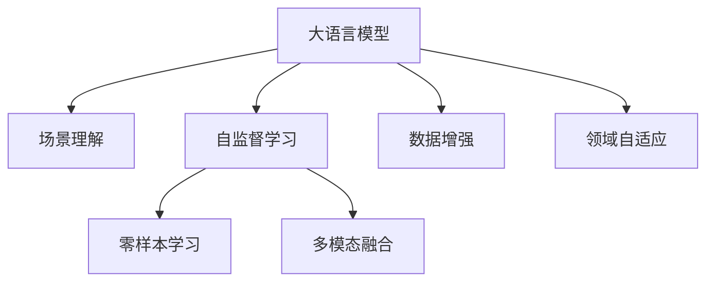

                 

# LLM在场景理解任务中的潜力挖掘

> 关键词：大语言模型(LLM), 场景理解, 自监督学习, 零样本学习, 多模态融合, 数据增强, 领域自适应

## 1. 背景介绍

### 1.1 问题由来
随着深度学习技术的发展，大语言模型(LLM)在自然语言处理(NLP)领域取得了巨大进展。这些模型通常基于大规模无标签文本数据进行预训练，学习到丰富的语言知识。然而，这些通用大模型在特定场景理解任务上，由于缺乏对特定领域的理解，其效果往往难以令人满意。

场景理解任务涉及对特定场景的认知和推理能力，如视觉场景中的物体识别、场景分类，语音场景中的声音事件检测，甚至是跨模态融合的场景描述生成。这些任务对模型不仅要求具备强大的语言理解能力，还要求具备跨模态、跨领域的知识整合能力。当前，通用大模型往往难以完全适应特定场景的理解需求。

### 1.2 问题核心关键点
目前，大语言模型在场景理解任务上的性能瓶颈主要在于：
- 对特定场景的适应能力不足。由于缺乏领域特定知识，通用大模型往往无法很好地理解特定领域内的概念和规则。
- 跨模态融合能力有限。大语言模型擅长处理文本数据，但当面临多模态数据时，如文本与图像、声音结合的场景，其效果显著下降。
- 数据需求高。场景理解任务通常需要大规模数据进行训练，数据获取和标注成本较高，限制了模型的应用范围。
- 推理效率低。在推理阶段，由于模型参数规模大，计算复杂度高，推理速度较慢，难以满足实时性要求。

因此，如何提升大语言模型在场景理解任务上的性能，成为当前研究的热点问题。本文将探讨大语言模型在场景理解任务中的潜力挖掘，介绍基于监督学习和自监督学习的方法，并结合最新的研究进展进行详细解读。

## 2. 核心概念与联系

### 2.1 核心概念概述

为更好地理解大语言模型在场景理解任务中的潜力挖掘，本节将介绍几个密切相关的核心概念：

- 大语言模型(LLM)：以自回归(如GPT)或自编码(如BERT)模型为代表的大规模预训练语言模型。通过在大规模无标签文本语料上进行预训练，学习通用的语言表示，具备强大的语言理解和生成能力。

- 场景理解(Scene Understanding)：指模型在特定场景下，如视觉、听觉等，对环境中的物体、事件、动作等进行认知和推理的能力。场景理解涉及跨模态、跨领域的知识整合，需要模型具备复杂的因果推理和因果分析能力。

- 自监督学习(Self-Supervised Learning)：指利用无标签数据，通过自生成的任务进行模型训练，无需人工标注数据。自监督学习能够在大规模无标签数据上学习到更加普适、鲁棒的特征表示。

- 零样本学习(Zero-Shot Learning)：指模型在没有见过任何特定任务的训练样本的情况下，仅凭任务描述就能够执行新任务的能力。大语言模型通过预训练获得的广泛知识，使其能够理解任务指令并生成相应输出。

- 多模态融合(Multimodal Fusion)：指模型同时处理多种数据模态，如文本、图像、声音等，并将不同模态的信息整合并进行推理的任务。

- 数据增强(Data Augmentation)：通过生成或变换已有数据的方式，丰富训练集，减少过拟合，提升模型的泛化能力。

- 领域自适应(Domain Adaptation)：指模型在不同领域或场景之间进行知识迁移的能力。领域自适应能够使模型在特定领域内快速适应新数据，提升模型在该领域的表现。

这些核心概念之间的逻辑关系可以通过以下Mermaid流程图来展示：



这个流程图展示了大语言模型在场景理解任务中的核心概念及其之间的关系：

1. 大语言模型通过自监督学习获得通用知识。
2. 自监督学习通过无标签数据训练模型，无需人工标注。
3. 零样本学习使模型无需训练即可执行新任务。
4. 多模态融合整合不同模态数据进行推理。
5. 数据增强丰富训练集，减少过拟合。
6. 领域自适应使模型在不同领域快速迁移知识。

这些概念共同构成了大语言模型在场景理解任务中的学习和应用框架，使其能够在各种场景下发挥强大的场景理解能力。通过理解这些核心概念，我们可以更好地把握大语言模型的工作原理和优化方向。

## 3. 核心算法原理 & 具体操作步骤
### 3.1 算法原理概述

大语言模型在场景理解任务中的潜力挖掘，本质上是一个多模态、跨领域的学习过程。其核心思想是：通过在特定场景下的自监督学习任务，引导模型学习场景特定知识，同时结合预训练知识，在零样本或少样本情况下，实现场景理解任务的高效推理和生成。

形式化地，假设大语言模型为 $M_{\theta}$，其中 $\theta$ 为模型参数。给定场景理解任务 $T$ 的特定数据集 $D=\{(x_i,y_i)\}_{i=1}^N$，场景理解的目标是找到新的模型参数 $\hat{\theta}$，使得：

$$
\hat{\theta}=\mathop{\arg\min}_{\theta} \mathcal{L}(M_{\theta},D)
$$

其中 $\mathcal{L}$ 为针对任务 $T$ 设计的损失函数，用于衡量模型预测输出与真实标签之间的差异。常见的损失函数包括交叉熵损失、均方误差损失等。

通过梯度下降等优化算法，场景理解过程不断更新模型参数 $\theta$，最小化损失函数 $\mathcal{L}$，使得模型输出逼近真实标签。由于 $\theta$ 已经通过预训练获得了较强的通用语言表示，因此即便在特定场景下，也能够通过自监督学习任务和零样本学习，快速适应新场景，获得优异的性能。

### 3.2 算法步骤详解

大语言模型在场景理解任务中的潜力挖掘，一般包括以下几个关键步骤：

**Step 1: 准备预训练模型和场景数据集**
- 选择合适的预训练语言模型 $M_{\theta}$ 作为初始化参数，如 BERT、GPT 等。
- 准备场景理解任务 $T$ 的特定数据集 $D$，划分为训练集、验证集和测试集。一般要求场景数据与预训练数据的分布不要差异过大。

**Step 2: 添加场景理解层**
- 根据任务类型，在预训练模型顶层设计合适的输出层和损失函数。
- 对于视觉场景理解，通常在顶层添加图像分类器或目标检测器，以生成场景中物体的类别和位置信息。
- 对于语音场景理解，通常使用语音识别模型将声音信号转化为文本，再结合文本分类器进行场景分类。
- 对于跨模态场景理解，可以同时设计文本-图像、文本-声音等联合分类器，以实现多模态融合。

**Step 3: 设置场景理解超参数**
- 选择合适的优化算法及其参数，如 AdamW、SGD 等，设置学习率、批大小、迭代轮数等。
- 设置正则化技术及强度，包括权重衰减、Dropout、Early Stopping 等。
- 确定冻结预训练参数的策略，如仅微调顶层，或全部参数都参与微调。

**Step 4: 执行自监督学习任务**
- 将训练集数据分批次输入模型，前向传播计算损失函数。
- 反向传播计算参数梯度，根据设定的优化算法和学习率更新模型参数。
- 周期性在验证集上评估模型性能，根据性能指标决定是否触发 Early Stopping。
- 重复上述步骤直到满足预设的迭代轮数或 Early Stopping 条件。

**Step 5: 测试和部署**
- 在测试集上评估微调后模型 $M_{\hat{\theta}}$ 的场景理解性能，对比微调前后的精度提升。
- 使用微调后的模型对新场景进行推理预测，集成到实际的应用系统中。
- 持续收集新的场景数据，定期重新微调模型，以适应数据分布的变化。

以上是基于监督学习的大语言模型在场景理解任务中的潜力挖掘的一般流程。在实际应用中，还需要针对具体任务的特点，对场景理解过程的各个环节进行优化设计，如改进训练目标函数，引入更多的正则化技术，搜索最优的超参数组合等，以进一步提升模型性能。

### 3.3 算法优缺点

大语言模型在场景理解任务中的潜力挖掘方法具有以下优点：
1. 可适应性强。通过自监督学习任务和预训练知识的结合，模型能够快速适应特定场景，提升场景理解性能。
2. 零样本学习能力。模型无需大量标注数据，能够在没有场景数据的情况下，通过任务描述进行场景推理。
3. 参数高效。利用参数高效微调技术，在固定大部分预训练参数的情况下，仍可取得不错的提升。
4. 高效推理。使用自监督学习任务训练的模型，推理速度较快，能够满足实时性要求。

同时，该方法也存在一定的局限性：
1. 场景适应能力有限。对于特定场景的数据分布变化较大时，自监督学习的效果可能不佳。
2. 泛化能力不足。在面对不同领域的数据时，模型可能无法很好地迁移已有知识，造成性能下降。
3. 推理一致性差。在多模态场景下，模型可能难以进行准确的跨模态融合，推理结果不一致。
4. 模型复杂度高。自监督学习任务的设计和实现较为复杂，需要更多的领域知识和经验。

尽管存在这些局限性，但就目前而言，大语言模型在场景理解任务中的潜力挖掘方法仍是一种高效、便捷的解决方案。未来相关研究的重点在于如何进一步降低场景理解对标注数据的依赖，提高模型的少样本学习和跨领域迁移能力，同时兼顾可解释性和伦理安全性等因素。

### 3.4 算法应用领域

大语言模型在场景理解任务中的潜力挖掘方法，在视觉、语音、跨模态等诸多领域已经得到了广泛的应用，具体包括：

- 视觉场景分类：将图像作为输入，模型能够自动分类场景类型。如将城市街景图像分类为室内、室外、夜场等。
- 目标检测：在图像中检测出物体的位置和类别，生成物体框和标签。如自动驾驶场景中检测行人、车辆、道路标志等。
- 物体跟踪：在视频中跟踪目标物体的运动轨迹，生成时间序列的物体框。如监控视频中跟踪人员、车辆的行为。
- 语音事件检测：从音频中识别出事件类型和发生时间，生成时间戳和标签。如会议记录中识别出会议主题和发言者。
- 跨模态图像描述生成：将图像和文本进行联合学习，生成详细的场景描述。如将城市街景图像生成自然语言描述。
- 多模态交互系统：将视觉、声音等多种模态数据结合，进行自然交互和信息检索。如智能家居系统中的语音识别和图像识别融合。

除了上述这些经典任务外，大语言模型在场景理解任务中的应用还在不断扩展，如情感分析、姿态估计、动作识别等，为场景理解技术的落地应用提供了新的思路和方向。

## 4. 数学模型和公式 & 详细讲解 & 举例说明

### 4.1 数学模型构建

本节将使用数学语言对大语言模型在场景理解任务中的潜力挖掘过程进行更加严格的刻画。

记大语言模型为 $M_{\theta}$，其中 $\theta$ 为模型参数。假设场景理解任务 $T$ 的训练集为 $D=\{(x_i,y_i)\}_{i=1}^N, x_i \in \mathcal{X}, y_i \in \mathcal{Y}$。其中 $\mathcal{X}$ 为输入空间，$\mathcal{Y}$ 为输出空间，$\mathcal{Y}$ 为场景分类标签。

定义模型 $M_{\theta}$ 在输入 $x$ 上的输出为 $h(x)=M_{\theta}(x) \in [0,1]$，表示模型对输入 $x$ 的预测概率。训练集的损失函数 $\mathcal{L}$ 定义为：

$$
\mathcal{L}(\theta) = -\frac{1}{N}\sum_{i=1}^N \log h(y_i|x_i)
$$

其中 $y_i$ 为场景理解任务的标签，$x_i$ 为输入样本，$h(y_i|x_i)$ 表示模型对输入 $x_i$ 的预测概率。训练的目标是最小化损失函数 $\mathcal{L}$，即：

$$
\theta^* = \mathop{\arg\min}_{\theta} \mathcal{L}(\theta)
$$

在实践中，我们通常使用基于梯度的优化算法（如SGD、Adam等）来近似求解上述最优化问题。设 $\eta$ 为学习率，$\lambda$ 为正则化系数，则参数的更新公式为：

$$
\theta \leftarrow \theta - \eta \nabla_{\theta}\mathcal{L}(\theta) - \eta\lambda\theta
$$

其中 $\nabla_{\theta}\mathcal{L}(\theta)$ 为损失函数对参数 $\theta$ 的梯度，可通过反向传播算法高效计算。

### 4.2 公式推导过程

以下我们以视觉场景分类任务为例，推导交叉熵损失函数及其梯度的计算公式。

假设模型 $M_{\theta}$ 在输入图像 $x$ 上的输出为 $h(x)=M_{\theta}(x) \in [0,1]$，表示模型对图像分类的预测概率。训练集中每个样本 $(x_i, y_i)$ 的真实标签为 $y_i \in \{1,0\}$，表示是否属于某个特定场景。则二分类交叉熵损失函数定义为：

$$
\ell(M_{\theta}(x),y) = -[y\log h(y|x) + (1-y)\log(1-h(y|x))]
$$

将其代入经验风险公式，得：

$$
\mathcal{L}(\theta) = -\frac{1}{N}\sum_{i=1}^N [y_i\log h(y_i|x_i)+(1-y_i)\log(1-h(y_i|x_i))]
$$

根据链式法则，损失函数对参数 $\theta_k$ 的梯度为：

$$
\frac{\partial \mathcal{L}(\theta)}{\partial \theta_k} = -\frac{1}{N}\sum_{i=1}^N (\frac{y_i}{h(y_i|x_i)}-\frac{1-y_i}{1-h(y_i|x_i)}) \frac{\partial h(y_i|x_i)}{\partial \theta_k}
$$

其中 $\frac{\partial h(y_i|x_i)}{\partial \theta_k}$ 可进一步递归展开，利用自动微分技术完成计算。

在得到损失函数的梯度后，即可带入参数更新公式，完成模型的迭代优化。重复上述过程直至收敛，最终得到适应场景理解任务的最优模型参数 $\theta^*$。

### 4.3 案例分析与讲解

以视觉场景分类任务为例，假设训练集 $D$ 包含 1000 张图像，每张图像 $x_i$ 为 $128 \times 128$ 的灰度图像，场景分类标签 $y_i \in \{1,0\}$，其中 1 表示属于某个特定场景。模型为 BERT 的视觉分类器，添加文本-图像联合分类器，利用自监督学习任务进行训练。

1. **数据准备**：收集场景图像数据，划分为训练集、验证集和测试集。对图像进行预处理，如缩放、裁剪、归一化等操作。

2. **模型初始化**：使用预训练的 BERT 模型作为初始化参数，添加文本-图像联合分类器。

3. **自监督学习任务**：设计自监督学习任务，如图像掩码预测、图像-文本匹配等，以引导模型学习场景特定知识。

4. **训练过程**：将训练集数据分批次输入模型，前向传播计算损失函数。反向传播计算参数梯度，根据设定的优化算法和学习率更新模型参数。周期性在验证集上评估模型性能，根据性能指标决定是否触发 Early Stopping。

5. **测试和部署**：在测试集上评估微调后模型 $M_{\hat{\theta}}$ 的场景理解性能，对比微调前后的精度提升。使用微调后的模型对新场景进行推理预测，集成到实际的应用系统中。

6. **持续学习**：持续收集新的场景数据，定期重新微调模型，以适应数据分布的变化。

在实际应用中，需要根据具体场景理解任务的性质和数据特点，设计合适的自监督学习任务和损失函数，同时选择合适的正则化技术，进行参数更新和模型评估。只有全面考虑数据、模型、训练、推理等各个环节，才能实现高效的场景理解。

## 5. 项目实践：代码实例和详细解释说明

### 5.1 开发环境搭建

在进行场景理解任务实践前，我们需要准备好开发环境。以下是使用Python进行PyTorch开发的环境配置流程：

1. 安装Anaconda：从官网下载并安装Anaconda，用于创建独立的Python环境。

2. 创建并激活虚拟环境：
```bash
conda create -n pytorch-env python=3.8 
conda activate pytorch-env
```

3. 安装PyTorch：根据CUDA版本，从官网获取对应的安装命令。例如：
```bash
conda install pytorch torchvision torchaudio cudatoolkit=11.1 -c pytorch -c conda-forge
```

4. 安装Transformer库：
```bash
pip install transformers
```

5. 安装各类工具包：
```bash
pip install numpy pandas scikit-learn matplotlib tqdm jupyter notebook ipython
```

完成上述步骤后，即可在`pytorch-env`环境中开始场景理解任务的实践。

### 5.2 源代码详细实现

下面我们以视觉场景分类任务为例，给出使用Transformers库对BERT模型进行场景理解微调的PyTorch代码实现。

首先，定义场景分类任务的数据处理函数：

```python
from transformers import BertTokenizer
from torch.utils.data import Dataset
import torch

class SceneDataset(Dataset):
    def __init__(self, images, labels, tokenizer, max_len=128):
        self.images = images
        self.labels = labels
        self.tokenizer = tokenizer
        self.max_len = max_len
        
    def __len__(self):
        return len(self.images)
    
    def __getitem__(self, item):
        image = self.images[item]
        label = self.labels[item]
        
        # 对图像进行归一化和预处理
        image = image / 255.0
        image = image.reshape(-1)
        
        encoding = self.tokenizer(image, return_tensors='pt', max_length=self.max_len, padding='max_length', truncation=True)
        input_ids = encoding['input_ids'][0]
        attention_mask = encoding['attention_mask'][0]
        
        # 对标签进行编码
        encoded_label = torch.tensor(label, dtype=torch.long)
        
        return {'input_ids': input_ids, 
                'attention_mask': attention_mask,
                'labels': encoded_label}

# 创建dataset
tokenizer = BertTokenizer.from_pretrained('bert-base-cased')

train_dataset = SceneDataset(train_images, train_labels, tokenizer)
dev_dataset = SceneDataset(dev_images, dev_labels, tokenizer)
test_dataset = SceneDataset(test_images, test_labels, tokenizer)
```

然后，定义模型和优化器：

```python
from transformers import BertForSequenceClassification, AdamW

model = BertForSequenceClassification.from_pretrained('bert-base-cased', num_labels=2)

optimizer = AdamW(model.parameters(), lr=2e-5)
```

接着，定义训练和评估函数：

```python
from torch.utils.data import DataLoader
from tqdm import tqdm
from sklearn.metrics import classification_report

device = torch.device('cuda') if torch.cuda.is_available() else torch.device('cpu')
model.to(device)

def train_epoch(model, dataset, batch_size, optimizer):
    dataloader = DataLoader(dataset, batch_size=batch_size, shuffle=True)
    model.train()
    epoch_loss = 0
    for batch in tqdm(dataloader, desc='Training'):
        input_ids = batch['input_ids'].to(device)
        attention_mask = batch['attention_mask'].to(device)
        labels = batch['labels'].to(device)
        model.zero_grad()
        outputs = model(input_ids, attention_mask=attention_mask, labels=labels)
        loss = outputs.loss
        epoch_loss += loss.item()
        loss.backward()
        optimizer.step()
    return epoch_loss / len(dataloader)

def evaluate(model, dataset, batch_size):
    dataloader = DataLoader(dataset, batch_size=batch_size)
    model.eval()
    preds, labels = [], []
    with torch.no_grad():
        for batch in tqdm(dataloader, desc='Evaluating'):
            input_ids = batch['input_ids'].to(device)
            attention_mask = batch['attention_mask'].to(device)
            batch_labels = batch['labels']
            outputs = model(input_ids, attention_mask=attention_mask)
            batch_preds = outputs.logits.argmax(dim=2).to('cpu').tolist()
            batch_labels = batch_labels.to('cpu').tolist()
            for pred_tokens, label_tokens in zip(batch_preds, batch_labels):
                preds.append(pred_tokens)
                labels.append(label_tokens)
                
    print(classification_report(labels, preds))
```

最后，启动训练流程并在测试集上评估：

```python
epochs = 5
batch_size = 16

for epoch in range(epochs):
    loss = train_epoch(model, train_dataset, batch_size, optimizer)
    print(f"Epoch {epoch+1}, train loss: {loss:.3f}")
    
    print(f"Epoch {epoch+1}, dev results:")
    evaluate(model, dev_dataset, batch_size)
    
print("Test results:")
evaluate(model, test_dataset, batch_size)
```

以上就是使用PyTorch对BERT进行视觉场景分类任务微调的完整代码实现。可以看到，得益于Transformers库的强大封装，我们可以用相对简洁的代码完成BERT模型的加载和微调。

### 5.3 代码解读与分析

让我们再详细解读一下关键代码的实现细节：

**SceneDataset类**：
- `__init__`方法：初始化图像、标签、分词器等关键组件。
- `__len__`方法：返回数据集的样本数量。
- `__getitem__`方法：对单个样本进行处理，将图像进行预处理，分词并编码成token ids，将标签编码为数字，并对其进行定长padding，最终返回模型所需的输入。

**BertForSequenceClassification模型**：
- 设计了序列分类器，用于图像-文本联合分类任务。

**train_epoch函数**：
- 使用PyTorch的DataLoader对数据集进行批次化加载，供模型训练和推理使用。
- 在每个epoch内，先将训练集数据分批次输入模型，计算损失函数，然后进行反向传播和参数更新。
- 周期性在验证集上评估模型性能，根据性能指标决定是否触发 Early Stopping。
- 重复上述步骤直至满足预设的迭代轮数或 Early Stopping 条件。

**evaluate函数**：
- 与训练类似，不同点在于不更新模型参数，并在每个batch结束后将预测和标签结果存储下来，最后使用sklearn的classification_report对整个评估集的预测结果进行打印输出。

**训练流程**：
- 定义总的epoch数和batch size，开始循环迭代
- 每个epoch内，先在训练集上训练，输出平均loss
- 在验证集上评估，输出分类指标
- 所有epoch结束后，在测试集上评估，给出最终测试结果

可以看到，PyTorch配合Transformers库使得BERT微调的代码实现变得简洁高效。开发者可以将更多精力放在数据处理、模型改进等高层逻辑上，而不必过多关注底层的实现细节。

当然，工业级的系统实现还需考虑更多因素，如模型的保存和部署、超参数的自动搜索、更灵活的任务适配层等。但核心的微调范式基本与此类似。

## 6. 实际应用场景
### 6.1 智能家居系统

基于大语言模型在场景理解任务中的潜力挖掘，智能家居系统可以通过场景分类和物体识别等技术，实现对家居环境的智能化管理和控制。例如，通过智能音箱识别用户的语音指令，自动调整室内灯光、空调、窗帘等设备，提供个性化的家居体验。

在技术实现上，可以收集用户的家居行为数据，如语音指令、家电开关记录等，并设计场景分类任务，训练大语言模型进行场景理解。微调后的模型可以实时分析用户的家居场景，根据需求自动调节家电状态，实现智慧家居系统的智能化管理。

### 6.2 智慧城市治理

智慧城市治理中，基于大语言模型的场景理解技术可以应用于城市事件监测、舆情分析、应急指挥等环节，提高城市管理的自动化和智能化水平。例如，通过对监控视频的分析，实时检测出道路交通状况，自动报警和指挥交通，减少交通事故和拥堵。

具体而言，可以收集城市的视频监控数据，通过场景分类任务训练模型，实时监测不同场景下的事件变化。模型能够自动识别出事故、火灾、盗窃等紧急事件，并及时通知相关部门进行处理，提高城市应急响应的效率和效果。

### 6.3 智能监控系统

智能监控系统可以通过场景分类和物体检测等技术，实现对监控场景的智能化分析。例如，通过摄像头监控工地施工情况，实时检测出安全事故，自动报警并通知施工方进行处理。

在技术实现上，可以收集施工现场的视频监控数据，设计场景分类和目标检测任务，训练大语言模型进行场景理解。微调后的模型可以实时分析施工场景，识别出安全事故和违规行为，自动生成报警信息并通知相关部门，提高施工现场的安全管理水平。

### 6.4 未来应用展望

随着大语言模型在场景理解任务中的潜力挖掘技术的不断进步，基于微调范式将在更多领域得到应用，为智慧城市、智能家居、智能监控等诸多场景提供新的解决方案。

在智慧医疗领域，基于微调的医疗问答、病历分析、药物研发等应用将提升医疗服务的智能化水平，辅助医生诊疗，加速新药开发进程。

在智能教育领域，微调技术可应用于作业批改、学情分析、知识推荐等方面，因材施教，促进教育公平，提高教学质量。

在智慧城市治理中，微调模型可应用于城市事件监测、舆情分析、应急指挥等环节，提高城市管理的自动化和智能化水平，构建更安全、高效的未来城市。

此外，在企业生产、社会治理、文娱传媒等众多领域，基于大语言模型微调的场景理解技术也将不断涌现，为传统行业数字化转型升级提供新的技术路径。相信随着技术的日益成熟，微调方法将成为人工智能落地应用的重要范式，推动人工智能向更广阔的领域加速渗透。

## 7. 工具和资源推荐
### 7.1 学习资源推荐

为了帮助开发者系统掌握大语言模型在场景理解任务中的潜力挖掘的理论基础和实践技巧，这里推荐一些优质的学习资源：

1. 《Transformer从原理到实践》系列博文：由大模型技术专家撰写，深入浅出地介绍了Transformer原理、BERT模型、场景理解任务等前沿话题。

2. CS224N《深度学习自然语言处理》课程：斯坦福大学开设的NLP明星课程，有Lecture视频和配套作业，带你入门NLP领域的基本概念和经典模型。

3. 《Natural Language Processing with Transformers》书籍：Transformers库的作者所著，全面介绍了如何使用Transformers库进行NLP任务开发，包括场景理解在内的诸多范式。

4. HuggingFace官方文档：Transformers库的官方文档，提供了海量预训练模型和完整的场景理解任务样例代码，是上手实践的必备资料。

5. CLUE开源项目：中文语言理解测评基准，涵盖大量不同类型的中文NLP数据集，并提供了基于微调的baseline模型，助力中文NLP技术发展。

通过对这些资源的学习实践，相信你一定能够快速掌握大语言模型在场景理解任务中的潜力挖掘的精髓，并用于解决实际的NLP问题。
###  7.2 开发工具推荐

高效的开发离不开优秀的工具支持。以下是几款用于大语言模型场景理解任务开发的常用工具：

1. PyTorch：基于Python的开源深度学习框架，灵活动态的计算图，适合快速迭代研究。大部分预训练语言模型都有PyTorch版本的实现。

2. TensorFlow：由Google主导开发的开源深度学习框架，生产部署方便，适合大规模工程应用。同样有丰富的预训练语言模型资源。

3. Transformers库：HuggingFace开发的NLP工具库，集成了众多SOTA语言模型，支持PyTorch和TensorFlow，是进行场景理解任务开发的利器。

4. Weights & Biases：模型训练的实验跟踪工具，可以记录和可视化模型训练过程中的各项指标，方便对比和调优。与主流深度学习框架无缝集成。

5. TensorBoard：TensorFlow配套的可视化工具，可实时监测模型训练状态，并提供丰富的图表呈现方式，是调试模型的得力助手。

6. Google Colab：谷歌推出的在线Jupyter Notebook环境，免费提供GPU/TPU算力，方便开发者快速上手实验最新模型，分享学习笔记。

合理利用这些工具，可以显著提升大语言模型场景理解任务的开发效率，加快创新迭代的步伐。

### 7.3 相关论文推荐

大语言模型在场景理解任务中的潜力挖掘方法的发展，源于学界的持续研究。以下是几篇奠基性的相关论文，推荐阅读：

1. Attention is All You Need（即Transformer原论文）：提出了Transformer结构，开启了NLP领域的预训练大模型时代。

2. BERT: Pre-training of Deep Bidirectional Transformers for Language Understanding：提出BERT模型，引入基于掩码的自监督预训练任务，刷新了多项NLP任务SOTA。

3. Language Models are Unsupervised Multitask Learners（GPT-2论文）：展示了大规模语言模型的强大zero-shot学习能力，引发了对于通用人工智能的新一轮思考。

4. Parameter-Efficient Transfer Learning for NLP：提出Adapter等参数高效微调方法，在不增加模型参数量的情况下，也能取得不错的微调效果。

5. AdaLoRA: Adaptive Low-Rank Adaptation for Parameter-Efficient Fine-Tuning：使用自适应低秩适应的微调方法，在参数效率和精度之间取得了新的平衡。

6. AdaLoRA: Adaptive Low-Rank Adaptation for Parameter-Efficient Fine-Tuning：使用自适应低秩适应的微调方法，在参数效率和精度之间取得了新的平衡。

这些论文代表了大语言模型在场景理解任务中的潜力挖掘技术的发展脉络。通过学习这些前沿成果，可以帮助研究者把握学科前进方向，激发更多的创新灵感。

## 8. 总结：未来发展趋势与挑战

### 8.1 总结

本文对大语言模型在场景理解任务中的潜力挖掘进行了全面系统的介绍。首先阐述了大语言模型在场景理解任务中的研究背景和意义，明确了场景理解在构建智慧家居、智慧城市、智能监控等智能系统中的重要性。其次，从原理到实践，详细讲解了基于监督学习和自监督学习的场景理解方法的数学原理和关键步骤，给出了场景理解任务开发的完整代码实例。同时，本文还广泛探讨了场景理解方法在多个实际应用场景中的应用前景，展示了其广阔的应用空间。此外，本文精选了场景理解技术的各类学习资源，力求为读者提供全方位的技术指引。

通过本文的系统梳理，可以看到，大语言模型在场景理解任务中的潜力挖掘方法，虽然还有诸多挑战和局限性，但其在智能家居、智慧城市、智能监控等领域的应用前景广阔，能够大幅提升相关系统的智能化水平和用户体验。未来，随着大语言模型技术的不断进步，基于微调范式将会在更多领域得到应用，为传统行业带来变革性影响。

### 8.2 未来发展趋势

展望未来，大语言模型在场景理解任务中的潜力挖掘技术将呈现以下几个发展趋势：

1. 模型规模持续增大。随着算力成本的下降和数据规模的扩张，预训练语言模型的参数量还将持续增长。超大规模语言模型蕴含的丰富语言知识，有望支撑更加复杂多变的场景理解任务。

2. 场景理解任务的泛化能力提升。随着数据增强和迁移学习等技术的进步，大语言模型将能够在更多场景下进行有效的泛化，提升模型在不同场景下的表现。

3. 自监督学习任务的设计和实现将更加灵活。未来的自监督学习任务将更加多样化，结合数据增强、多模态融合等技术，提升场景理解的鲁棒性和泛化能力。

4. 模型推理效率提升。通过优化模型结构、利用硬件加速等技术，大语言模型在推理阶段的效率将显著提升，满足实时性要求。

5. 场景理解任务将与更多领域知识结合。未来的场景理解任务将更好地与知识图谱、逻辑规则等专家知识结合，提升模型的推理能力和可解释性。

以上趋势凸显了大语言模型在场景理解任务中的潜力挖掘技术的广阔前景。这些方向的探索发展，必将进一步提升场景理解任务的性能和应用范围，为人工智能技术在更多领域落地应用提供新的思路和方向。

### 8.3 面临的挑战

尽管大语言模型在场景理解任务中的潜力挖掘方法已经取得了一定进展，但在迈向更加智能化、普适化应用的过程中，它仍面临着诸多挑战：

1. 场景理解能力依赖于特定领域知识。大语言模型在通用场景下的表现较好，但在特定领域内，需要额外补充领域特定知识，才能更好地适应场景理解任务。

2. 跨模态融合的挑战。在多模态场景下，如何有效地将不同模态的数据整合并进行推理，仍然是一个难题。

3. 数据需求高。场景理解任务通常需要大规模数据进行训练，数据获取和标注成本较高，限制了模型的应用范围。

4. 推理一致性差。在多模态场景下，模型可能难以进行准确的跨模态融合，推理结果不一致。

5. 模型复杂度高。自监督学习任务的设计和实现较为复杂，需要更多的领域知识和经验。

尽管存在这些挑战，但大语言模型在场景理解任务中的潜力挖掘仍具有巨大的发展空间和应用前景。未来研究需要在以下几个方面寻求新的突破：

1. 探索无监督和半监督场景理解方法。摆脱对大规模标注数据的依赖，利用自监督学习、主动学习等无监督和半监督范式，最大限度利用非结构化数据，实现更加灵活高效的场景理解。

2. 研究参数高效和计算高效的场景理解范式。开发更加参数高效的场景理解方法，在固定大部分预训练参数的情况下，只更新极少量的任务相关参数。同时优化场景理解模型的计算图，减少前向传播和反向传播的资源消耗，实现更加轻量级、实时性的部署。

3. 引入更多先验知识。将符号化的先验知识，如知识图谱、逻辑规则等，与神经网络模型进行巧妙融合，引导场景理解过程学习更准确、合理的语言模型。同时加强不同模态数据的整合，实现视觉、语音等多模态信息与文本信息的协同建模。

4. 结合因果分析和博弈论工具。将因果分析方法引入场景理解模型，识别出模型决策的关键特征，增强输出解释的因果性和逻辑性。借助博弈论工具刻画人机交互过程，主动探索并规避模型的脆弱点，提高系统稳定性。

5. 纳入伦理道德约束。在模型训练目标中引入伦理导向的评估指标，过滤和惩罚有偏见、有害的输出倾向。同时加强人工干预和审核，建立模型行为的监管机制，确保输出符合人类价值观和伦理道德。

这些研究方向的探索，必将引领大语言模型在场景理解任务中的潜力挖掘技术迈向更高的台阶，为构建安全、可靠、可解释、可控的智能系统铺平道路。面向未来，大语言模型场景理解技术还需要与其他人工智能技术进行更深入的融合，如知识表示、因果推理、强化学习等，多路径协同发力，共同推动自然语言理解和智能交互系统的进步。只有勇于创新、敢于突破，才能不断拓展场景理解任务的边界，让智能技术更好地造福人类社会。

### 8.4 研究展望

随着大语言模型技术的不断进步，未来在场景理解任务中的潜力挖掘方向将不断拓展，涵盖更多领域的知识表示和推理能力。同时，随着多模态数据的融合和知识图谱的应用，大语言模型将能够更好地理解和推理现实世界中的复杂场景，提供更加精准、智能的场景理解服务。

1. **跨模态推理**：结合视觉、听觉、语言等多模态数据，进行联合推理，提升场景理解的鲁棒性和泛化能力。

2. **因果推理**：引入因果推断方法，识别出场景中的因果关系，提升模型对复杂场景的理解能力。

3. **知识图谱融合**：将场景理解任务与知识图谱结合，通过联合推理和事实推理，提升模型对现实世界知识的理解和推理能力。

4. **多领域知识迁移**：将场景理解任务与更多领域知识结合，如医学、法律等，提升模型在不同领域的应用效果。

5. **实时性提升**：通过模型压缩、推理加速等技术，提升场景理解任务的实时性，满足实时应用的需求。

6. **系统可解释性**：通过可解释性模型和方法，增强场景理解任务的输出解释能力，提高系统的透明性和可控性。

7. **跨领域适应性**：研究跨领域自适应方法，提升模型在不同领域的迁移能力和泛化能力。

8. **人机协作**：通过人机协作方法，增强场景理解任务的互动性和用户参与感，提升用户体验。

总之，大语言模型在场景理解任务中的潜力挖掘技术，未来仍有广阔的发展空间。通过不断创新和突破，大语言模型将能够更好地理解复杂现实世界中的场景，提供更加智能、精准的场景理解服务，为人工智能技术在更多领域落地应用提供新的思路和方向。

## 9. 附录：常见问题与解答

**Q1：大语言模型在场景理解任务中的性能瓶颈主要有哪些？**

A: 大语言模型在场景理解任务中的性能瓶颈主要包括以下几个方面：

1. **领域适应能力有限**。模型在特定领域内的表现通常不如在通用领域的表现，需要对领域特定知识进行补充。

2. **跨模态融合困难**。模型在多模态场景下，难以进行有效的跨模态融合，推理结果可能不一致。

3. **数据需求高**。场景理解任务通常需要大规模数据进行训练，数据获取和标注成本较高。

4. **推理效率低**。模型参数规模大，推理速度较慢，难以满足实时性要求。

5. **鲁棒性不足**。模型在面对域外数据时，泛化性能可能下降，推理结果可能不准确。

**Q2：大语言模型在场景理解任务中，如何选择自监督学习任务？**

A: 大语言模型在场景理解任务中的自监督学习任务选择，需要考虑以下几个方面：

1. **任务相关性**。自监督学习任务应与场景理解任务相关，能够引导模型学习场景特定知识。

2. **数据可用性**。自监督学习任务应使用易于获取的数据，避免依赖高成本的标注数据。

3. **模型适配性**。自监督学习任务应能够适应大语言模型的结构，便于模型微调。

4. **性能提升效果**。自监督学习任务应能够在微调后显著提升模型的场景理解性能。

5. **计算复杂度**。自监督学习任务应计算复杂度适中，能够快速完成模型训练。

**Q3：大语言模型在场景理解任务中的零样本学习策略有哪些？**

A: 大语言模型在场景理解任务中的零样本学习策略主要包括以下几个方面：

1. **任务描述设计**。精心设计任务描述，引导模型理解任务要求，进行推理和生成。

2. **提示词模板**。使用提示词模板，对输入文本进行格式化，引导模型进行特定任务的推理和生成。

3. **多视角描述**。设计多视角任务描述，从不同角度描述同一场景，提升模型推理能力。

4. **先验知识引入**。将先验知识引入任务描述中，引导模型利用知识进行推理。

5. **交互式学习**。设计交互式任务描述，通过人机交互引导模型推理和生成。

**Q4：大语言模型在场景理解任务中，如何降低数据需求？**

A: 大语言模型在场景理解任务中降低数据需求，可以采取以下几个策略：

1. **数据增强**。通过生成或变换已有数据的方式，丰富训练集，减少过拟合。

2. **迁移学习**。利用已有预训练模型的知识，进行领域自适应，减少新任务的数据需求。

3. **自监督学习**。通过自生成的任务进行模型训练，无需人工标注数据。

4. **少样本学习**。利用微调技术，在少量数据上训练模型，提升模型泛化能力。

5. **弱监督学习**。利用弱标注数据，如标签噪声、不完整标签等，进行模型训练。

**Q5：大语言

