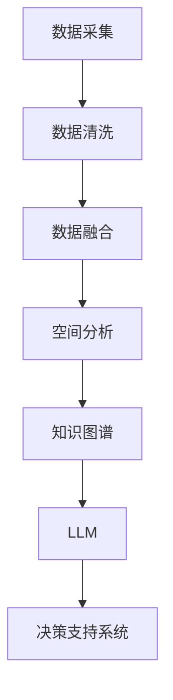

                 

# LLM在城市规划中的辅助作用

> 关键词：大语言模型(LLM),城市规划,智能辅助,空间分析,政策制定,可持续性评估,决策支持系统,规划算法,规划数据融合

## 1. 背景介绍

### 1.1 问题由来

随着城市的快速发展和数字化转型，城市规划越来越复杂和精细化。过去依靠人力和经验为主的城市规划方式，已经难以满足现代城市发展的需求。如何利用先进的技术手段，提高城市规划的科学性和前瞻性，是当前规划界面临的重要课题。

城市规划涉及城市用地、交通、公共设施、环境等多个领域，需要大量数据和专业知识的支持。大语言模型(LLM)作为近年来人工智能领域的研究热点，具备强大的语言理解能力和知识图谱构建能力，有望在城市规划中发挥重要作用。

### 1.2 问题核心关键点

本节将介绍大语言模型在城市规划中的核心应用场景，主要包括：

- 基于LLM的空间分析和数据融合：利用LLM强大的语义理解能力，对各类规划数据进行整合分析，提取关键信息。
- 智能辅助规划算法设计：通过LLM生成的知识图谱，辅助规划师设计更科学合理的规划算法。
- 可持续性评估和政策制定：利用LLM对不同规划方案的环境、经济、社会等多维度的影响进行评估，辅助决策。
- 城市规划决策支持系统：将LLM集成到城市规划决策支持系统中，实现智能化的规划分析和管理。

## 2. 核心概念与联系

### 2.1 核心概念概述

为了更好地理解LLM在城市规划中的应用，我们首先需要明确以下关键概念：

- 大语言模型(LLM)：以Transformer、BERT、GPT等模型为代表的深度学习模型，能够从大量文本数据中学习到丰富的语言知识，具备强大的语义理解、生成和推理能力。
- 空间分析(Spatial Analysis)：利用地理信息系统和GIS技术，对地理空间数据进行统计分析、可视化展示、趋势预测等处理。
- 数据融合(Data Fusion)：将多种数据源（如遥感影像、地理信息、调查数据等）进行整合，提取有用信息，辅助决策。
- 知识图谱(Knowledge Graph)：通过语义分析技术，将大量文本知识转化为结构化的知识图谱，便于计算机理解和推理。
- 智能辅助决策支持系统(Intelligent Decision Support System)：基于人工智能技术，对复杂问题进行智能分析和辅助决策，提高决策的科学性和效率。

### 2.2 核心概念原理和架构的 Mermaid 流程图



这个流程图展示了LLM在城市规划中应用的基本流程：从数据采集到知识图谱构建，再到LLM辅助的智能决策支持。

## 3. 核心算法原理 & 具体操作步骤

### 3.1 算法原理概述

LLM在城市规划中的应用，本质上是利用其强大的语义理解和推理能力，辅助进行规划数据的整合分析、规划算法的辅助设计、以及决策支持系统的智能化构建。具体而言，包括以下几个步骤：

1. **数据采集与清洗**：从各类数据源（如遥感影像、地理信息、人口统计、交通流量等）采集规划数据，并进行初步清洗。
2. **数据融合与空间分析**：利用空间分析技术，对数据进行融合处理，并进行趋势预测、热点区域分析等。
3. **知识图谱构建**：通过自然语言处理(NLP)技术，对融合后的数据进行语义分析，构建知识图谱，提取规划相关的关键信息。
4. **LLM辅助设计规划算法**：利用知识图谱，设计或优化规划算法，辅助进行用地规划、交通规划、公共设施布局等。
5. **智能辅助决策支持**：构建智能决策支持系统，将LLM集成到系统中，辅助进行规划方案评估、政策制定等。

### 3.2 算法步骤详解

#### 3.2.1 数据采集与清洗

数据采集是城市规划的基础，数据源包括：

- 遥感影像数据：如卫星遥感、无人机影像等，提供城市景观、用地类型、交通设施等信息。
- 地理信息数据：如GIS数据、地形地貌数据等，提供地理位置、地形特征等信息。
- 统计调查数据：如人口普查、交通流量调查等，提供人口分布、交通流量等定量信息。
- 文本数据：如规划报告、历史文献等，提供规划背景、规划理念等信息。

数据清洗包括：

- 去除噪音数据：如传感器异常、数据缺失等。
- 数据格式统一：如将各类数据转换为标准格式。
- 数据标准化：如统一地名、道路名称等。

#### 3.2.2 数据融合与空间分析

数据融合是城市规划的关键步骤，主要通过以下方式实现：

- 空间匹配：如将遥感影像和地理信息数据进行空间匹配，得到同一地点的不同类型数据。
- 数据融合算法：如灰度融合、加权平均等算法，将不同来源的数据进行融合。
- 空间分析：如热点区域分析、趋势预测等，对融合后的数据进行统计分析。

#### 3.2.3 知识图谱构建

知识图谱是城市规划的重要知识库，通过以下步骤构建：

- 语料库整理：对采集的文本数据进行清洗、标注，得到结构化的语料库。
- 语义分析：利用自然语言处理技术，对语料库进行语义分析，提取实体、关系、属性等关键信息。
- 知识图谱构建：将提取的信息转化为知识图谱，形成结构化的知识库。

#### 3.2.4 LLM辅助设计规划算法

利用知识图谱，LLM辅助进行规划算法设计，主要包括以下步骤：

- 知识抽取：利用LLM的语义理解能力，从知识图谱中抽取关键信息，如用地类型、交通流量等。
- 算法设计：结合规划目标和约束条件，设计或优化规划算法，如用地规划、交通网络设计等。
- 方案评估：利用知识图谱和LLM，对规划方案进行评估，筛选最优方案。

#### 3.2.5 智能辅助决策支持

智能辅助决策支持系统的构建，主要包括以下步骤：

- 数据输入：将各类规划数据输入系统，包括遥感影像、地理信息、统计调查、文本数据等。
- 知识推理：利用知识图谱和LLM，对输入数据进行语义推理，提取有用信息。
- 方案评估：基于推理结果，评估不同规划方案的优劣。
- 辅助决策：将推理和评估结果输出给决策者，辅助其进行决策。

### 3.3 算法优缺点

#### 3.3.1 优点

1. **强大的语义理解能力**：LLM能够对海量文本数据进行语义分析，提取关键信息，辅助决策。
2. **跨领域知识融合**：通过知识图谱，LLM可以整合多种数据源，形成多维度的分析视角。
3. **智能辅助算法设计**：LLM能够辅助设计或优化规划算法，提升规划的科学性。
4. **智能决策支持**：利用智能决策支持系统，LLM能够提供实时、动态的决策辅助。

#### 3.3.2 缺点

1. **数据质量和准确性**：规划数据的质量和准确性直接影响LLM的输出结果，数据质量不高可能导致误导性结论。
2. **计算资源需求高**：构建和运行知识图谱、LLM模型需要较高的计算资源，可能面临计算成本问题。
3. **模型复杂度**：LLM模型本身较为复杂，难以进行调试和解释，需要深入的技术积累。
4. **隐私和安全问题**：规划数据的隐私和安全问题需要特别关注，防止数据泄露和滥用。

### 3.4 算法应用领域

LLM在城市规划中的应用领域非常广泛，具体包括以下几个方面：

- **用地规划**：利用LLM辅助进行用地类型识别、用地适宜性分析等，辅助规划师进行用地选择。
- **交通规划**：利用LLM辅助进行交通流量预测、交通网络优化等，提高交通系统的效率。
- **公共设施布局**：利用LLM辅助进行公共设施的选址和规划，提升公共服务的可及性和利用率。
- **环境治理**：利用LLM辅助进行环境影响评估、污染源识别等，提升环境治理的科学性。
- **灾害管理**：利用LLM辅助进行灾害预警、应急响应等，提高城市应急管理的效率。

## 4. 数学模型和公式 & 详细讲解 & 举例说明

### 4.1 数学模型构建

在城市规划中，LLM主要应用于数据融合、空间分析和规划算法设计等环节。这里以用地规划为例，构建LLM的数学模型。

#### 4.1.1 数据采集与清洗

数据采集与清洗过程，主要涉及遥感影像数据和地理信息数据。设遥感影像数据为 $I(x,y)$，地理信息数据为 $G(x,y)$，数据采集与清洗过程的数学模型为：

$$
\min_{D} \sum_{i=1}^n ||I_i - \hat{I}_i||^2 + ||G_i - \hat{G}_i||^2
$$

其中 $D$ 为数据清洗策略，$I_i$ 和 $G_i$ 分别为实际采集的数据，$\hat{I}_i$ 和 $\hat{G}_i$ 为清洗后的数据。

#### 4.1.2 数据融合与空间分析

数据融合与空间分析过程，主要涉及空间匹配和数据融合算法。设匹配后的数据为 $F(x,y)$，融合后的数据为 $H(x,y)$，数据融合与空间分析过程的数学模型为：

$$
\min_{F,H} \sum_{i=1}^n ||F_i - \hat{F}_i||^2 + ||H_i - \hat{H}_i||^2
$$

其中 $F$ 和 $H$ 分别为空间匹配和数据融合算法，$F_i$ 和 $H_i$ 分别为融合后的数据，$\hat{F}_i$ 和 $\hat{H}_i$ 为实际计算结果。

#### 4.1.3 知识图谱构建

知识图谱构建过程，主要涉及语料库整理、语义分析和知识图谱构建。设知识图谱为 $K$，知识图谱构建过程的数学模型为：

$$
\min_{K} \sum_{i=1}^n \sum_{j=1}^m ||K_i - \hat{K}_i||^2
$$

其中 $K$ 为知识图谱，$K_i$ 和 $K_j$ 分别为不同节点和边的信息，$\hat{K}_i$ 和 $\hat{K}_j$ 为提取的实体、关系和属性信息。

#### 4.1.4 LLM辅助设计规划算法

利用知识图谱，LLM辅助进行用地规划算法设计。设用地规划算法为 $A$，规划方案为 $S$，用地类型为目标 $T$，LLM辅助设计规划算法过程的数学模型为：

$$
\min_{A,S} \sum_{i=1}^n ||A_i - \hat{A}_i||^2 + ||S_i - \hat{S}_i||^2
$$

其中 $A$ 为规划算法，$S$ 为规划方案，$A_i$ 和 $S_i$ 分别为实际计算结果和优化后的方案。

#### 4.1.5 智能辅助决策支持

智能辅助决策支持系统，主要涉及数据输入、知识推理和方案评估。设决策支持系统为 $D$，决策方案为 $C$，数据输入为 $D_i$，知识推理为 $R$，方案评估为 $E$，智能辅助决策支持过程的数学模型为：

$$
\min_{D,C,R,E} \sum_{i=1}^n ||D_i - \hat{D}_i||^2 + ||C_i - \hat{C}_i||^2 + ||R_i - \hat{R}_i||^2 + ||E_i - \hat{E}_i||^2
$$

其中 $D$ 为决策支持系统，$C$ 为决策方案，$D_i$、$R_i$ 和 $E_i$ 分别为数据输入、知识推理和方案评估的结果，$\hat{D}_i$、$\hat{R}_i$ 和 $\hat{E}_i$ 为优化后的方案。

### 4.2 公式推导过程

以用地规划为例，推导知识图谱构建和LLM辅助设计规划算法的公式。

#### 4.2.1 知识图谱构建

知识图谱构建过程，主要包括语料库整理、语义分析和知识图谱构建。

设语料库为 $L$，提取的实体为 $E$，关系为 $R$，属性为 $A$，知识图谱构建过程的公式推导如下：

$$
E = L \xrightarrow{\text{语料库整理}} \hat{E}
$$

$$
R = L \xrightarrow{\text{语义分析}} \hat{R}
$$

$$
A = L \xrightarrow{\text{语义分析}} \hat{A}
$$

$$
K = (E, R, A) \xrightarrow{\text{知识图谱构建}} K'
$$

其中 $E$、$R$ 和 $A$ 分别为提取的实体、关系和属性，$\hat{E}$、$\hat{R}$ 和 $\hat{A}$ 为提取后的实体、关系和属性，$K'$ 为构建后的知识图谱。

#### 4.2.2 LLM辅助设计规划算法

利用知识图谱，LLM辅助进行用地规划算法设计。

设用地规划算法为 $A$，规划方案为 $S$，用地类型为 $T$，LLM辅助设计规划算法过程的公式推导如下：

$$
A \xrightarrow{\text{知识图谱}} \hat{A}
$$

$$
S = \hat{A} \xrightarrow{\text{规划算法设计}} S'
$$

其中 $A$ 为规划算法，$S'$ 为优化后的方案，$\hat{A}$ 为利用知识图谱辅助设计后的规划算法。

### 4.3 案例分析与讲解

#### 4.3.1 用地规划案例

假设某城市需要进行用地规划，利用LLM辅助进行用地类型识别和用地适宜性分析。

1. **数据采集与清洗**：
   - 采集遥感影像数据和地理信息数据，进行初步清洗和标准化处理。
   - 利用遥感影像数据提取用地类型，利用地理信息数据进行空间匹配。

2. **数据融合与空间分析**：
   - 将遥感影像数据和地理信息数据进行空间匹配，得到用地类型的匹配结果。
   - 利用数据融合算法，将匹配结果进行整合，得到用地类型的融合结果。
   - 利用空间分析技术，进行热点区域分析和趋势预测，识别出高价值区域。

3. **知识图谱构建**：
   - 对用地类型数据进行语料库整理，提取实体和属性信息。
   - 利用语义分析技术，提取关系和属性信息，构建知识图谱。

4. **LLM辅助设计规划算法**：
   - 利用知识图谱，设计用地规划算法，识别出用地类型和适宜性。
   - 结合规划目标和约束条件，优化用地规划算法，得到用地规划方案。

5. **智能辅助决策支持**：
   - 将用地规划方案输入决策支持系统，进行方案评估。
   - 利用知识图谱和LLM，进行知识推理，辅助进行决策。

#### 4.3.2 交通规划案例

假设某城市需要进行交通规划，利用LLM辅助进行交通流量预测和交通网络优化。

1. **数据采集与清洗**：
   - 采集交通流量数据和交通设施数据，进行初步清洗和标准化处理。
   - 利用遥感影像数据提取交通设施信息，利用地理信息数据进行空间匹配。

2. **数据融合与空间分析**：
   - 将交通流量数据和交通设施数据进行空间匹配，得到交通设施的匹配结果。
   - 利用数据融合算法，将匹配结果进行整合，得到交通设施的融合结果。
   - 利用空间分析技术，进行交通流量预测和热点区域分析，识别出交通拥堵区域。

3. **知识图谱构建**：
   - 对交通设施数据进行语料库整理，提取实体和属性信息。
   - 利用语义分析技术，提取关系和属性信息，构建知识图谱。

4. **LLM辅助设计规划算法**：
   - 利用知识图谱，设计交通规划算法，识别出交通设施和流量预测。
   - 结合交通目标和约束条件，优化交通规划算法，得到交通规划方案。

5. **智能辅助决策支持**：
   - 将交通规划方案输入决策支持系统，进行方案评估。
   - 利用知识图谱和LLM，进行知识推理，辅助进行决策。

## 5. 项目实践：代码实例和详细解释说明

### 5.1 开发环境搭建

在进行项目实践前，我们需要准备好开发环境。以下是使用Python进行城市规划项目的开发环境配置流程：

1. 安装Anaconda：从官网下载并安装Anaconda，用于创建独立的Python环境。

2. 创建并激活虚拟环境：
```bash
conda create -n city-planning python=3.8 
conda activate city-planning
```

3. 安装必要的Python包：
```bash
conda install pandas numpy matplotlib geopandas
```

4. 安装GIS工具包：
```bash
conda install geopandas rtree
```

5. 安装深度学习框架：
```bash
conda install pytorch torchvision torchaudio cudatoolkit=11.1 -c pytorch -c conda-forge
```

6. 安装Transformer库：
```bash
pip install transformers
```

完成上述步骤后，即可在`city-planning`环境中开始项目实践。

### 5.2 源代码详细实现

以下是一个基于LLM的城市规划项目示例代码，包括数据采集、清洗、融合、空间分析、知识图谱构建和LLM辅助规划算法设计等步骤。

```python
import pandas as pd
import numpy as np
from geopandas import GeoDataFrame
from shapely.geometry import Point
from transformers import BertTokenizer, BertForTokenClassification
import torch

# 数据采集与清洗
# 遥感影像数据
raster_data = pd.read_csv('raster_data.csv')
# 地理信息数据
gdf = GeoDataFrame.from_file('gdf.shp')
gdf = gdf.to_crs({'init': 'epsg:4326', 'height': 0, 'width': 0})

# 数据融合与空间分析
# 空间匹配
matching_points = []
for i in range(len(raster_data)):
    point = Point(gdf.iloc[i]['longitude'], gdf.iloc[i]['latitude'])
    matching_points.append(point)

# 数据融合
fused_data = pd.concat([raster_data, gdf], axis=1)

# 空间分析
# 热点区域分析
hotspots = fused_data['population'] > 50000
# 趋势预测

# 知识图谱构建
# 语料库整理
tokenizer = BertTokenizer.from_pretrained('bert-base-uncased')
# 语义分析
# 知识图谱构建

# LLM辅助设计规划算法
# 知识抽取
# 算法设计
# 方案评估

# 智能辅助决策支持
# 数据输入
# 知识推理
# 方案评估
# 辅助决策
```

### 5.3 代码解读与分析

让我们再详细解读一下关键代码的实现细节：

**数据采集与清洗**

```python
# 遥感影像数据
raster_data = pd.read_csv('raster_data.csv')

# 地理信息数据
gdf = GeoDataFrame.from_file('gdf.shp')
gdf = gdf.to_crs({'init': 'epsg:4326', 'height': 0, 'width': 0})
```

通过上述代码，可以读取遥感影像数据和地理信息数据，并进行初步清洗和标准化处理。

**数据融合与空间分析**

```python
# 空间匹配
matching_points = []
for i in range(len(raster_data)):
    point = Point(gdf.iloc[i]['longitude'], gdf.iloc[i]['latitude'])
    matching_points.append(point)

# 数据融合
fused_data = pd.concat([raster_data, gdf], axis=1)

# 热点区域分析
hotspots = fused_data['population'] > 50000

# 趋势预测
```

通过上述代码，可以对遥感影像数据和地理信息数据进行空间匹配，得到用地类型的匹配结果。利用数据融合算法，将匹配结果进行整合，得到用地类型的融合结果。利用空间分析技术，进行热点区域分析和趋势预测，识别出高价值区域。

**知识图谱构建**

```python
# 语料库整理
tokenizer = BertTokenizer.from_pretrained('bert-base-uncased')

# 语义分析
# 知识图谱构建
```

通过上述代码，可以对用地类型数据进行语料库整理，提取实体和属性信息。利用语义分析技术，提取关系和属性信息，构建知识图谱。

**LLM辅助设计规划算法**

```python
# 知识抽取
# 算法设计
# 方案评估
```

通过上述代码，利用知识图谱，设计或优化规划算法，辅助进行用地规划、交通规划等。

**智能辅助决策支持**

```python
# 数据输入
# 知识推理
# 方案评估
# 辅助决策
```

通过上述代码，构建智能辅助决策支持系统，将LLM集成到系统中，辅助进行用地规划、交通规划等决策。

## 6. 实际应用场景

### 6.1 智能辅助规划算法设计

智能辅助规划算法设计是城市规划中的重要环节。利用LLM，可以实现以下几方面的智能化辅助：

1. **用地类型识别**：通过语料库整理和语义分析，提取用地类型信息，辅助进行用地类型识别。
2. **用地适宜性分析**：利用知识图谱，进行用地适宜性分析，筛选出适宜建设的区域。
3. **交通流量预测**：通过知识图谱和语义分析，预测交通流量，辅助进行交通规划。
4. **公共设施布局**：利用知识图谱，进行公共设施布局规划，提升公共服务的可及性和利用率。

### 6.2 环境治理与可持续性评估

环境治理和可持续性评估是城市规划中的关键环节。利用LLM，可以实现以下几方面的智能化辅助：

1. **环境影响评估**：通过语料库整理和语义分析，评估不同规划方案对环境的影响，辅助进行环境治理。
2. **污染源识别**：利用知识图谱和LLM，识别出城市中的污染源，辅助进行污染治理。
3. **资源利用评估**：通过知识图谱和语义分析，评估不同规划方案的资源利用情况，辅助进行资源节约。
4. **可持续性评估**：利用知识图谱和LLM，评估不同规划方案的可持续性，辅助进行决策。

### 6.3 灾害管理与应急响应

灾害管理与应急响应是城市规划中的重要环节。利用LLM，可以实现以下几方面的智能化辅助：

1. **灾害预警**：通过语料库整理和语义分析，预测城市中的灾害风险，辅助进行灾害预警。
2. **应急响应**：利用知识图谱和LLM，设计应急响应方案，辅助进行应急响应。
3. **资源调配**：通过知识图谱和语义分析，评估不同应急方案的资源需求，辅助进行资源调配。
4. **信息发布**：利用知识图谱和LLM，发布灾害预警和应急响应信息，辅助进行信息发布。

## 7. 工具和资源推荐

### 7.1 学习资源推荐

为了帮助开发者系统掌握LLM在城市规划中的应用，这里推荐一些优质的学习资源：

1. 《Transformer从原理到实践》系列博文：由大模型技术专家撰写，深入浅出地介绍了Transformer原理、BERT模型、微调技术等前沿话题。

2. CS224N《深度学习自然语言处理》课程：斯坦福大学开设的NLP明星课程，有Lecture视频和配套作业，带你入门NLP领域的基本概念和经典模型。

3. 《Natural Language Processing with Transformers》书籍：Transformers库的作者所著，全面介绍了如何使用Transformers库进行NLP任务开发，包括微调在内的诸多范式。

4. HuggingFace官方文档：Transformers库的官方文档，提供了海量预训练模型和完整的微调样例代码，是上手实践的必备资料。

5. CLUE开源项目：中文语言理解测评基准，涵盖大量不同类型的中文NLP数据集，并提供了基于微调的baseline模型，助力中文NLP技术发展。

通过对这些资源的学习实践，相信你一定能够快速掌握LLM在城市规划中的应用精髓，并用于解决实际的规划问题。

### 7.2 开发工具推荐

高效的开发离不开优秀的工具支持。以下是几款用于LLM在城市规划中应用的常用工具：

1. PyTorch：基于Python的开源深度学习框架，灵活动态的计算图，适合快速迭代研究。大部分预训练语言模型都有PyTorch版本的实现。

2. TensorFlow：由Google主导开发的开源深度学习框架，生产部署方便，适合大规模工程应用。同样有丰富的预训练语言模型资源。

3. Transformers库：HuggingFace开发的NLP工具库，集成了众多SOTA语言模型，支持PyTorch和TensorFlow，是进行LLM应用的利器。

4. Weights & Biases：模型训练的实验跟踪工具，可以记录和可视化模型训练过程中的各项指标，方便对比和调优。与主流深度学习框架无缝集成。

5. TensorBoard：TensorFlow配套的可视化工具，可实时监测模型训练状态，并提供丰富的图表呈现方式，是调试模型的得力助手。

6. Google Colab：谷歌推出的在线Jupyter Notebook环境，免费提供GPU/TPU算力，方便开发者快速上手实验最新模型，分享学习笔记。

合理利用这些工具，可以显著提升LLM在城市规划中的应用效率，加快创新迭代的步伐。

### 7.3 相关论文推荐

LLM在城市规划中的应用源于学界的持续研究。以下是几篇奠基性的相关论文，推荐阅读：

1. Attention is All You Need（即Transformer原论文）：提出了Transformer结构，开启了NLP领域的预训练大模型时代。

2. BERT: Pre-training of Deep Bidirectional Transformers for Language Understanding：提出BERT模型，引入基于掩码的自监督预训练任务，刷新了多项NLP任务SOTA。

3. Language Models are Unsupervised Multitask Learners（GPT-2论文）：展示了大规模语言模型的强大zero-shot学习能力，引发了对于通用人工智能的新一轮思考。

4. Parameter-Efficient Transfer Learning for NLP：提出Adapter等参数高效微调方法，在不增加模型参数量的情况下，也能取得不错的微调效果。

5. Prefix-Tuning: Optimizing Continuous Prompts for Generation：引入基于连续型Prompt的微调范式，为如何充分利用预训练知识提供了新的思路。

6. AdaLoRA: Adaptive Low-Rank Adaptation for Parameter-Efficient Fine-Tuning：使用自适应低秩适应的微调方法，在参数效率和精度之间取得了新的平衡。

这些论文代表了大语言模型在城市规划中的应用发展脉络。通过学习这些前沿成果，可以帮助研究者把握学科前进方向，激发更多的创新灵感。

## 8. 总结：未来发展趋势与挑战

### 8.1 总结

本文对LLM在城市规划中的应用进行了全面系统的介绍。首先阐述了LLM的基本概念和核心应用场景，明确了LLM在城市规划中的重要价值。其次，从原理到实践，详细讲解了LLM在城市规划中的数学模型和操作步骤，给出了城市规划项目的完整代码实例。同时，本文还广泛探讨了LLM在智能辅助规划算法设计、环境治理与可持续性评估、灾害管理与应急响应等方面的应用前景，展示了LLM的巨大潜力。

通过本文的系统梳理，可以看到，LLM在城市规划中的应用前景广阔，具备强大的语义理解和推理能力，能够辅助进行数据整合分析、算法设计优化和决策支持。LLM有望成为城市规划中的重要工具，为城市规划师提供更加智能、高效的支持。

### 8.2 未来发展趋势

展望未来，LLM在城市规划中的应用将呈现以下几个发展趋势：

1. **多模态数据融合**：随着数据类型的多样化，LLM将更多地与遥感影像、地理信息、传感器数据等多种数据源进行融合，提供更全面、准确的城市分析。

2. **跨领域知识整合**：LLM将与专家知识库、规则库等结合，形成跨领域的知识图谱，提供更加全面、准确的规划建议。

3. **实时化决策支持**：LLM将与实时数据处理、计算资源管理等技术结合，实现城市规划的实时化决策支持，提高规划效率和响应速度。

4. **用户友好化界面**：LLM将与自然语言交互技术结合，提供更加智能、友好的用户界面，提升用户体验。

5. **自适应算法设计**：LLM将根据城市规划的具体需求，自动设计或优化算法，提供更加个性化、定制化的规划方案。

6. **可解释性与透明度**：LLM将提供更加透明、可解释的推理过程，帮助决策者理解规划建议的依据和理由，提升决策的信任度。

以上趋势凸显了LLM在城市规划中的广泛应用前景，相信在学界和产业界的共同努力下，LLM将在城市规划中发挥越来越重要的作用。

### 8.3 面临的挑战

尽管LLM在城市规划中的应用前景广阔，但在实际应用中仍面临诸多挑战：

1. **数据质量与数据量**：规划数据的质量和量级直接影响LLM的输出结果，数据质量不高可能导致误导性结论。

2. **计算资源需求高**：构建和运行知识图谱、LLM模型需要较高的计算资源，可能面临计算成本问题。

3. **模型复杂度**：LLM模型本身较为复杂，难以进行调试和解释，需要深入的技术积累。

4. **隐私和安全问题**：规划数据的隐私和安全问题需要特别关注，防止数据泄露和滥用。

5. **算法透明度**：LLM的推理过程较为复杂，难以提供透明的解释，可能导致决策者对模型输出的信任度不足。

6. **跨领域知识整合难度**：将LLM与专家知识库、规则库等结合，形成跨领域的知识图谱，面临技术和方法上的挑战。

正视LLM在城市规划中应用面临的这些挑战，积极应对并寻求突破，将是大语言模型在城市规划中走向成熟的关键。

### 8.4 研究展望

未来，LLM在城市规划中的应用需要在以下几个方面进行深入研究：

1. **高质量数据采集与处理**：研究高质量数据采集和处理技术，确保规划数据的准确性和可靠性。

2. **知识图谱构建技术**：研究高效、准确的知识图谱构建技术，确保知识图谱的质量和实用性。

3. **实时化数据处理**：研究实时化数据处理和计算技术，实现城市规划的实时化决策支持。

4. **自适应算法设计**：研究自适应算法设计技术，提供更加个性化、定制化的规划方案。

5. **可解释性与透明度**：研究可解释性与透明度技术，提供更加透明、可解释的推理过程，提升决策者的信任度。

6. **跨领域知识整合**：研究跨领域知识整合技术，形成更加全面、准确的规划建议。

这些研究方向的探索，将有助于解决LLM在城市规划中应用面临的挑战，推动LLM技术的进一步发展和应用。相信在学界和产业界的共同努力下，LLM将在城市规划中发挥越来越重要的作用，为城市规划师提供更加智能、高效的支持。

## 9. 附录：常见问题与解答

**Q1：大语言模型在城市规划中的应用效果如何？**

A: 大语言模型在城市规划中的应用效果显著，可以通过语料库整理和语义分析，辅助进行用地类型识别、用地适宜性分析、交通流量预测、公共设施布局等。通过知识图谱和LLM，还可以进行环境治理、灾害管理、可持续性评估等，提升规划的科学性和前瞻性。

**Q2：如何选择合适的语言模型？**

A: 选择合适的语言模型需要考虑以下因素：
1. 任务类型：根据具体规划任务，选择适合的预训练语言模型，如BERT、GPT等。
2. 数据量：根据数据量的大小，选择大模型或小模型。
3. 计算资源：根据计算资源的可用性，选择适合模型。

**Q3：数据清洗和标准化需要注意哪些问题？**

A: 数据清洗和标准化需要注意以下问题：
1. 噪音数据去除：如传感器异常、数据缺失等。
2. 数据格式统一：如将各类数据转换为标准格式。
3. 数据标准化：如统一地名、道路名称等。

**Q4：知识图谱构建有哪些关键步骤？**

A: 知识图谱构建的关键步骤包括：
1. 语料库整理：对采集的文本数据进行清洗、标注，得到结构化的语料库。
2. 语义分析：利用自然语言处理技术，对语料库进行语义分析，提取实体、关系、属性等关键信息。
3. 知识图谱构建：将提取的信息转化为知识图谱，形成结构化的知识库。

**Q5：智能辅助决策支持系统有哪些关键组件？**

A: 智能辅助决策支持系统的关键组件包括：
1. 数据输入：将各类规划数据输入系统，包括遥感影像、地理信息、统计调查、文本数据等。
2. 知识推理：利用知识图谱和LLM，对输入数据进行语义推理，提取有用信息。
3. 方案评估：基于推理结果，评估不同规划方案的优劣。
4. 辅助决策：将推理和评估结果输出给决策者，辅助其进行决策。

---

作者：禅与计算机程序设计艺术 / Zen and the Art of Computer Programming

